<!--
author: GYH
date: 2020-03-22
-->

# 作业汇总

## Ex1

程序 1 不死神兔  
题目：古典问题：有一对兔子，从出生后第 3 个月起每个月都生一对兔子，小兔子长到第三个月后每个月
又生一对兔子，假如兔子都不死，问每个月的兔子对数为多少？  
程序分析： 兔子的规律为数列 1,1,2,3,5,8,13,21....   

源代码：  
```java
/*
分析：斐波那契数列，每一项为前两项的和
方法：递归
注：代码规范遵守 《阿里巴巴Java开发手册》
*/

import java.util.Scanner;

public class Ex1 {
	// 递归
	public static int fib(int n) {
        if (n == 1 || n == 2) {
            return 1;
        } else {
            return fib(n - 1) + fib(n - 2);  
        }  
	}
	
	public static void main(String[] args) {
		Scanner sc = new Scanner(System.in);
		System.out.print("输入月份：");
		int n = sc.nextInt();
		sc.close();

		System.out.println("第 " + n + " 月，兔子的对数为：" + fib(n));
	}
}
```

运行截图：  
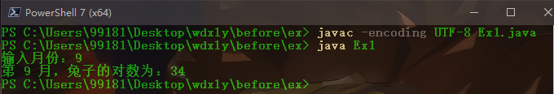  

## Ex2

程序 2 输出素数  
题目：判断 101-200 之间有多少个素数，并输出所有素数。  
程序分析：判断素数的方法：用一个数分别去除 2 到 sqrt(这个数)，如果能被整除，则表明此数不是素
数，反之是素数。  

源代码  
```java
/*
方法：循环判断。
注：代码规范遵守 《阿里巴巴Java开发手册》
*/

public class Ex2 {
	// 判断是否是素数
	public static boolean isPrime(int n) {
		for(int i = 2; i <= Math.sqrt(n); i++) {
			if (n % i == 0) {
				return false;	// 能被整除即非素数
			}
		}
		return true;
	}

	public static void main(String[] args) {
		int i,n,num;	// num 记录个数

		for(i = 101,num = 0; i <= 200; i++) {
			if (isPrime(i)) {	// 如果为素数，就 +1
				System.out.print(i + " ");
				num++;
			}
		}
		System.out.printf("\n共 %d 个\n", num);
	}
}
```

运行截图：  
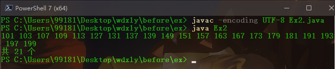  

## Ex3

程序 3 水仙花数  
题目：打印出所有的"水仙花数"，所谓"水仙花数"是指一个三位数，其各位数字立方和等于该数本身。例如：153 是一个"水仙花数"，因为 153=1 的三次方＋5 的三次方＋3 的三次方。  
程序分析：利用 for 循环控制 100-999 个数，每个数分解出个位，十位，百位。  

源代码：
```java
public class Ex3{
	public static boolean isNarcissistic(int n) {
		int a, b, c;	// 个位，十位，百位
		a = n % 10;
		b = (n / 10) % 10;
		c = n / 100;

		if (Math.pow(a, 3) + Math.pow(b, 3) + Math.pow(c, 3) == n) {
			return true;
		} else
			return false;
	}

	public static void main(String[] args) {
		for (int i = 100; i <= 999; i++) {
			if (isNarcissistic(i)) {
				System.out.println(i);
			}
		}
	}
}
```

运行截图：  
  

## Ex4

程序 4 分解质因数  
题目：将一个大于 2 正整数分解质因数。例如：输入 3, 3=3, 输入 6, 6=2\*3,输入 90, 90=2\*3\*3\*5。  
程序分析：对 n 进行分解质因数，应先找到一个最小的质数 k，然后按下述步骤完成：  
1. 如果这个质数恰等于 n，则说明分解质因数的过程已经结束，打印出即可。  
2. 如果 n<>k，但 n 能被 k 整除，则应打印出 k 的值，并用 n 除以 k 的商,作为新的正整数 n,重复执行第
一步。  
3. 如果 n 不能被 k 整除，则用 k+1 作为 k 的值,重复执行第一步。

源代码：
```java
import java.util.Scanner;

public class Ex4 {
	public static void main(String[] args) {
		Scanner sc = new Scanner(System.in);
		System.out.print("输入一个正整数：");
		int n = sc.nextInt();
		sc.close();

		System.out.print("分解质因数：" + n + " =");
		for (int i = 2; i <= n; i++) {
			if (n % i == 0) {
				System.out.print(i);
				n = n / i;
				i = 1;	// 整除一次后，i 重置为 2（还有一个 i++）
				if (n != 0 && n != 1) {	// 如果还能分解加一个乘号
					System.out.print(" * ");
				}
			}
		}
	}
}
```

运行截图：  
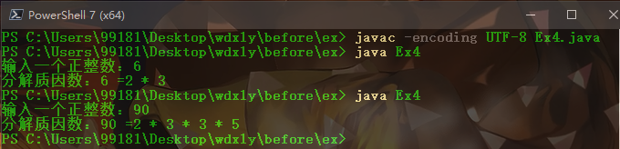  

## Ex5

程序 5 判断分数等级  
题目：利用条件运算符的嵌套来完成此题：学习成绩>=90 分的同学用 A 表示，60-89 分之间的用 B 表示，
60 分以下的用 C 表示。  
程序分析：(a>b)?a:b 这是条件运算符的基本例子  

源代码：  
```java
import java.util.Scanner;

public class Ex5 {
	public static void main(String[] args) {
		Scanner sc = new Scanner(System.in);
		System.out.print("输入学生成绩：");
		int n = sc.nextInt();
		sc.close();

		System.out.println((n < 60) ? "C": (n < 90) ? "B" : "A");
	}
}
```

运行截图  
  

## Ex6

程序 6 求最大公约数及最小公倍数  
题目：输入两个正整数 m 和 n，求其最大公约数和最小公倍数。  
程序分析：利用辗除法  

源代码：
```java
import java.util.Scanner;

public class Ex6 {
	// 求最大公约数
	public static int gcd(int a,int b) {
    	int temp;
    	while(b != 0) {	// 辗除法，直到 b == 0；int 无法转换为 boolean，不能用 (b) 判断
	        temp = b;
	        b = a % b;
	        a = temp;
	    }
    	return a;
	}
	
	public static void main(String[] args) {
		Scanner sc = new Scanner(System.in);
		System.out.print("输入两个正整数：");
		int m = sc.nextInt();
		int n = sc.nextInt();
		sc.close();

		System.out.println("最大公约数为：" + gcd(m, n));
		System.out.println("最小公倍数为：" + m * n / gcd(m, n));
	}
}
```

运行截图：  
  

## Ex7

程序 7 处理字符串  
题目：输入一行字符，分别统计出其中英文字母、空格、数字和其它字符的个数。  
程序分析：利用 while 语句，条件为输入的字符不为'\n'。  

源代码：
```java
import java.util.Scanner;

public class Ex7 {
	public static void main(String[] args) {
		int spaceNum = 0;
		int charNum = 0;
		int numberNum = 0;
		int otherNum = 0;

		System.out.print("输入一行字符：");
		Scanner sc = new Scanner(System.in);
		String str = sc.nextLine();
		sc.close();

		for (int i = 0; i < str.length(); i++) {
			if (str.charAt(i) == ' ') {
				spaceNum++;
			} else if ((str.charAt(i) >= 'a' && str.charAt(i) <= 'z') || (str.charAt(i) >= 'A' && str.charAt(i) <= 'Z')) {
				charNum++;
			} else if (str.charAt(i)>= '0' && str.charAt(i) <= '9') {
				numberNum++;
			} else {
				otherNum++;
			}
		}

		System.out.println("英文字母个数：" + charNum + "\n空格个数：" + spaceNum 
			+ "\n数字个数：" + numberNum + "\n其它字符个数：" + otherNum);
	}
}
```

运行截图：  
  

## Ex8

程序 8 输入数字求和  
题目：求 s=a+aa+aaa+aaaa+aa...a 的值，其中 a 是一个数字。例如 2+22+222+2222+22222(此时共有 5 个
数相加)，几个数相加有键盘控制。  
程序分析：关键是计算出每一项的值。  

源代码：
```java
import java.util.Scanner;

public class Ex8 {
	public static void main(String[] args) {
		Scanner sc = new Scanner(System.in);
		System.out.print("输入数字及项数：");
		int a = sc.nextInt();
		int n = sc.nextInt();
		sc.close();

		int s = 0;
		int aN = 0;	// 第 N 项
		int carry = 1;	// 单位 1 10 100 1000
		for (int i = 1; i <= n; i++) {
			aN = aN + a * carry;	// 求第 N 项的值
			s += aN;
			carry *= 10;
 		}

		System.out.println("和值：" + s);
	}
}
```

运行截图：  
  

## Ex9

程序 9 求完数  
题目：一个数如果恰好等于它的所有因子之和，这个数就称为"完数"。例如 6=1＋2＋3。编程找出 1000 以内的所有完数。  

源代码：  
```java
public class Ex9 {
	public static void main(String[] args) {
		System.out.print("1000 以内所有完数：");
		for (int j = 1; j <= 1000; j++) {	// 遍历 1~1000
			int s = 0;
			for (int i = 1; i < j; i++) {	// 求出所有因子之和
				if (j % i == 0) {
					s += i;
				}
			}

			if (s == j) {	// 如果是完数
				System.out.print(s + " ");		
			}
		}
	}
}
```

运行截图：  


## Ex10

程序 10 自由落体  
题目：一球从 100 米高度自由落下，每次落地后反跳回原高度的一半；求它在 第 10 次落地时，共经过多少米？第 10 次反弹多高？

源代码：
```java
public class Ex10 {
	public static void main(String[] args) {
		float h = 100;
		float s = -100;	// 设起点为地面
		for (int i = 0; i < 10; i++) {
			s = s + h * 2;
			h = h / 2;
		}

		System.out.println("第 10 次落地时，共经过 " + s + " 米");
		System.out.println("第 10 次反弹 " + h + " 米");
	}
}
```

运行截图：  
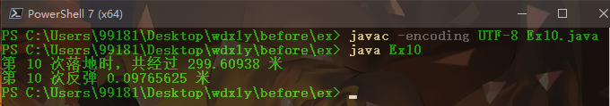

## Ex11

程序 11 求不重复数字  
题目：有 1、2、3、4 个数字，能组成多少个互不相同且无重复数字的三位数？都是多少？  
程序分析：可填在百位、十位、个位的数字都是 1、2、3、4。组成所有的排列后再去 掉不满足条件的排列。  

源代码：
```java
public class Ex11 {
	public static void main(String[] args) {
		System.out.print("能组成的三位数：");
		int num = 0;
		for (int i = 1; i <= 4; i++) {	// 穷举
			for (int j = 1; j <= 4; j++) {
				if (i == j) {	// 重复就跳过
					continue;
				}
				for (int k = 1; k <= 4; k++) {
					if (k == j || k == i) {	// 重复就跳过
						continue;
					}
					System.out.print((i * 100 + j * 10 + k) + " ");
					num++;
				}
			}
		}

		System.out.println("\n共 " + num + " 个");
	}
}
```

运行截图：  
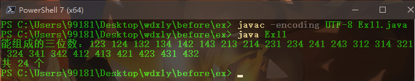  

## Ex12

程序 12 计算奖金  
题目：企业发放的奖金根据利润提成。利润(I)低于或等于 10 万元时，奖金可提 10%；利润高于 10 万元，低于 20 万元时，低于 10 万元的部分按 10%提成，高于 10 万元的部分，可可提成 7.5%；20 万到 40 万之间时，高于 20 万元的部分，可提成 5%；40 万到 60 万之间时高于 40 万元的部分，可提成 3%；60 万到 100 万之间时，高于 60 万元的部分，可提成 1.5%，高于 100 万元时，超过 100 万元的部分按 1%提成，从键盘输入当月利润 I，求应发放奖金总数？  
程序分析：请利用数轴来分界，定位。注意定义时需把奖金定义成长整型。

源代码：
```java
import java.util.Scanner;

public class Ex12 {
	public static void main(String[] args) {
		Scanner sc = new Scanner(System.in);
		System.out.print("输入当月利润（元）：");
		long n = sc.nextInt();
		sc.close();
	
		double bonus;
		// 分段函数
		if (n <= 100000) {
			bonus = n * 0.1;
		} else if (n <= 200000) {
			bonus = 100000 * 0.1 + (n - 100000) * 0.075;
		} else if (n <= 400000) {
			bonus = 100000 * 0.1 + 100000 * 0.075 + (n - 200000) * 0.05;
		} else if (n <= 600000) {
			bonus = 100000 * 0.1 + 100000 * 0.075 + 200000 * 0.05 + (n - 400000) * 0.03;
		} else if (n <= 1000000) {
			bonus = 100000 * 0.1 + 100000 * 0.075 + 200000 * 0.05 + 200000 * 0.03 + (n - 600000) * 0.015 ;
		} else {
			bonus = 100000 * 0.1 + 100000 * 0.075 + 200000 * 0.05 + 200000 * 0.03 + 400000 * 0.015 + (n - 1000000) * 0.01 ;
		}

		System.out.println("应发奖金 " + bonus + "元");
	}
}
```

运行截图：  


## Ex13

程序 13 根据条件求数字  
题目：一个整数，它加上 100 后是一个完全平方数，再加上 268 又是一个完全平方数，请问该数是多少？  
程序分析：在 10 万以内判断，先将该数加上 100 后再开方，再将该数加上 268 后再开方，如果开方后的结果满足如下条件，即是结果。  

源代码：
```java
public class Ex13 {
	public static void main(String[] args) {
		for (int i = 0; i <= 100000; i++) {
			int n1 = (int)Math.sqrt(i + 100);
			int n2 = (int)Math.sqrt(i + 368);

			if (Math.pow(n1, 2) == (i + 100) && Math.pow(n2, 2) == (i + 368)) {
				System.out.println(i);
				break;
			}
		}
	}
}
```

运行截图：
  

## Ex14

程序 14 求日期  
题目：输入某年某月某日，判断这一天是这一年的第几天？
程序分析：以 3 月 5 日为例，应该先把前两个月的加起来，然后再加上 5 天即本年的第几天，特殊情况，闰年且输入月份大于 3 时需考虑多加一天。  

源代码：
```java
import java.util.Scanner;

public class Ex14 {
	public static void main(String[] args) {
		Scanner sc = new Scanner(System.in);
		System.out.print("输入年月日：");
		int year = sc.nextInt();
		int month = sc.nextInt();
		int day = sc.nextInt();
		sc.close();

		int dayTh = 0;
		for (int i = 1; ; i++) {
			if (i == month) {	// 第本月，则加上日期并退出
				dayTh += day;
				break;
			} else{
				if (i == 1 || i == 3 || i == 5 || i == 7 || i == 8 || i == 10 || i == 12) {	// 31天
					dayTh += 31;
				} else if (i == 2) {	// 2 月份
					// 不能被 4 整除的是平年，能被 100 整除 且不能被 400 整除的也是平年
					if ((year % 4 != 0) || (year % 100 == 0 && year % 400 != 0)) {
						dayTh += 28;
					} else {
						dayTh += 29;
					}
				} else {	// 30 天
					dayTh += 30;
				}
			}
		}

		System.out.println("该天是该年的第 " + dayTh + " 天");
	}
}
```

运行截图：  


## Ex15

程序 15 排序  
题目：输入三个整数 x,y,z，请把这三个数由小到大输出。  
程序分析：我们想办法把最小的数放到 x 上，先将 x 与 y 进行比较，如果 x>y 则将 x 与 y 的值进行交换，
然后再用 x 与 z 进行比较，如果 x>z 则将 x 与 z 的值进行交换，这样能使 x 最小。  

源代码：  
```java
import java.util.Scanner;

public class Ex15 {
	public static void main(String[] args) {
		System.out.print("输入三个数：");
		Scanner sc = new Scanner(System.in);
		int x = sc.nextInt();
		int y = sc.nextInt();
		int z = sc.nextInt();
		sc.close();

		int temp;
		if (x > y) {
			temp = x;
			x = y;
			y = temp;
		}
		if (x > z) {
			temp = x;
			x = z;
			z = temp;
		}
		if (y > z) {
			temp = z;
			z = y;
			y = temp;
		}

		System.out.println("递增排序后：" + x + " " + y + " " + z);
	}
}
```

运行截图：  


## Ex16

程序 16 输入 9*9 表  
题目：输出 9*9 口诀。  
程序分析：分行与列考虑，共 9 行 9 列，i 控制行，j 控制列。  

源代码：
```java
public class Ex16 {
	public static void main(String[] args) {
		for (int i = 1; i < 10; i++) {
			for (int j = 1; j <= i; j++) {
				// System.out.print(i + " + " + j + "=" + i * j);
				System.out.printf("%d * %d = %2d\t",i, j, i * j);	// java 中也有 printf
			}
			System.out.println("");	// 换行
		}
	}
}
```

运行截图：  
  

## Ex17

程序 17 猴子吃桃问题  
题目：猴子吃桃问题：猴子第一天摘下若干个桃子，当即吃了一半，还不瘾，又多吃了一个 第二天早上
又将剩下的桃子吃掉一半，又多吃了一个。以后每天早上都吃了前一天剩下的一半零一个。到第 10 天早上想再吃时，见只剩下一个桃子了。求第一天共摘了多少。  
程序分析：采取逆向思维的方法，从后往前推断。

源代码：
```java
public class Ex17 {
	public static void main(String[] args) {
		int todayEat = 1;
		for (int i = 9; i >= 1; i--) {
			todayEat = (todayEat + 1) * 2;	// 第 i 天还有多少
		}
		
		System.out.println("第一天摘了 " + todayEat + " 个");
	}
}
```

运行截图：  


## Ex18

程序 18 乒乓球赛  
题目：两个乒乓球队进行比赛，各出三人。甲队为 a,b,c 三人，乙队为 x,y,z 三人。已抽签决定比赛名单。有人向队员打听比赛的名单。a 说他不和 x 比，c 说他不和 x,z 比，请编程序找出三队赛手的名单。  

源代码：
```java
public class Ex18 {
	public static void main(String[] args) {
		char[] team1 = {'x','y','z'};	// 0, 1, 2 对应 x, y, z

		int a, b, c;
		for (a = 0; a <= 2; a++) {
			for (b = 0; b <= 2; b++) {
				if (a == b) {	// 不能重复
					continue;
				}
				for (c = 0; c <= 2; c++) {
					if (a == c || b == c) {	// 不能重复
						continue;
					}
					if ((a != 0) && (c != 0) && (c != 2)) {	// a 不和 x，c 不和 x 和 z
						System.out.println("a 和 " + team1[a] + " 比赛");
						System.out.println("b 和 " + team1[b] + " 比赛");
						System.out.println("c 和 " + team1[c] + " 比赛");
						break;
					}
				}
			}
		}
	}
}
```

运行截图：  
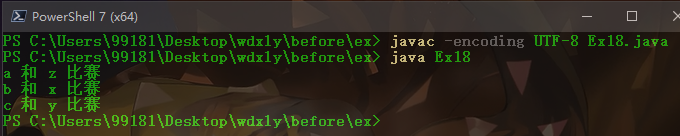  

## Ex19

程序 19 打印菱形图案 
题目：打印出如下图案（菱形）  
  
程序分析：先把图形分成两部分来看待，前四行一个规律，后三行一个规律，利用双重 for 循环，第一
层控制行，第二层控制列。

源代码：
```java
public class Ex19 {
	public static void main(String[] args) {
		for (int i = 1; i <= 7; i++) {	// 7 行
			if (i <= 4) {	// 前 4 行
				for (int j = 1; j <= 4 - i; j++) {
					System.out.print(" ");
				}
				for (int j = 1; j <= (2 * i - 1); j++) {
					System.out.print("*");
				}
			} else {	// 后 3行
				for (int j = 1; j <= i - 4; j++) {
					System.out.print(" ");
				}
				for (int j = 1; j <= ((8 - i) * 2 - 1); j++) {
					System.out.print("*");
				}
			}
			System.out.println();	// 每行结束需要换行
		}
	}
}
```

运行截图：  
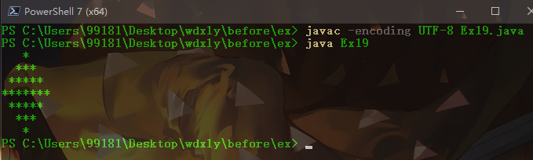  

## Ex20

程序 20 求前 20 项之和  
题目：有一分数序列：2/1，3/2，5/3，8/5，13/8，21/13...求出这个数列的前 20 项之和。
程序分析：请抓住分子与分母的变化规律。

源代码：
```java
/*
分析：分子和分母都是斐波那契数列
*/

public class Ex20 {
	// 斐波那契数列
	public static int fib(int n) {
        if (n == 1 || n == 2) {
            return 1;
        } else {
            return fib(n - 1) + fib(n - 2);  
        }  
    } 

	public static void main(String[] args) {
		double sum = 0;
		for (int i = 1 ; i <= 20; i++) {
			sum += (double)fib(i + 2) / (double)fib(i + 1);	// 需要强转
		}
		System.out.println(sum);
	}
}
```

运行截图：  


## Ex21

程序 21 求阶乘  
题目：求 1+2!+3!+...+20!的和  
程序分析：此程序只是把累加变成了累乘。

源代码：
```java
public class Ex21 {
	// 阶乘
	public static long factorial(int n) {
		long fac = 1L;
		for (int i = 1; i <= n; i++) {
			fac *= i;
		}
		return fac;
	}

	public static void main(String[] args) {
		long sum = 0L;	// 需要定义为 long 型
		for (int i = 1; i <= 20; i++) {
			sum += factorial(i);
		}
		System.out.println(sum);
	}
}
```

运行截图：  
  

## Ex22

程序 22 递归求阶乘  
题目：利用递归方法求 5!。  
程序分析：递归公式：fn=fn_1*4!  

源代码：
```java
public class Ex22 {
	// 递归
	public static int fn(int n){
		if (n == 1) {
			return 1;
		} else{
			return n * fn(n - 1);
		}
	}

	public static void main(String[] args) {
		System.out.println("5! = " + fn(5));
	}
}
```

运行截图：  
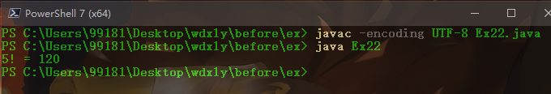  

## Ex23

【程序 23 求岁数】  
题目：有 5 个人坐在一起，问第五个人多少岁？他说比第 4 个人大 2 岁。问第 4 个人岁数，他说比第 3 个人大 2 岁。问第三个人，又说比第 2 人大两岁。问第 2 个人，说比第一个人大两岁。最后问第一个人，他说是 10 岁。请问第五个人多大？  
程序分析：利用递归的方法，递归分为回推和递推两个阶段。要想知道第五个人岁数，需知道第四人的岁数，依次类推，推到第一人（10 岁），再往回推。

源代码：
```java
public class Ex23 {
	// 递归
	public static int age(int n) {
		if (n == 1) return 10;
		return age(n - 1) + 2;	// 第 i 个人比第 i - 1 个人大 2 岁
	}

	public static void main(String[] args) {
		System.out.printf("第 5 个人 %d 岁。\n",age(5));
	}
}
```

运行截图：  
  

## Ex24

程序 24 根据输入求输出  
题目：给一个不多于 5 位的正整数，要求：一、求它是几位数，二、逆序打印出各位数字。  

源代码：
```java
import java.util.Scanner;

public class Ex24 {
	static int n = 0;	// 全局遍历记录位数

	// 递归打印
	public static void reverse(int num) {
		if (num != 0) {
			System.out.print(num % 10 + " ");
			n++;
			reverse(num / 10);
		}
	}
	
	public static void main(String[] args) {
		Scanner sc = new Scanner(System.in);
		System.out.print("输入一个不多于 5 位的正整数：");
		int num = sc.nextInt();
		sc.close();

		System.out.print("它的逆序为：");
		reverse(num);
		System.out.printf("\n它是 %d 位数\n",n);
	}
}
```

运行截图：  
  

## Ex25

程序 25 求回文数  
题目：一个 5 位数，判断它是不是回文数。即 12321 是回文数，个位与万位相同，十位与千位相同。

源代码：
```java
import java.util.Scanner;

public class Ex25 {
	public static void main(String[] args) {
		Scanner sc = new Scanner(System.in);
		System.out.print("输入一个 5 位数：");
		int n = sc.nextInt();
		sc.close();

		int[] num = new int[5];	// 数组记录每一位
		for (int i = 0; i < 5; i++) {
			num[i] = n % 10;
			n = n / 10;
		}

		if (num[0] == num[4] && num[1] == num[3]) {
			System.out.println("它是回文数");
		} else {
			System.out.println("它不是回文数");
		}
	}
}
```

运行截图：  
  

## Ex26

程序 26 求星期  
题目：请输入星期几的第一个字母来判断一下是星期几，如果第一个字母一样，则继续 判断第二个字
母。  
程序分析：用情况语句比较好，如果第一个字母一样，则判断用情况语句或 if 语句判断第二个字母。  

源代码：  
```java
/*
分析：
	星期一：Monday
	星期二：Tuesday
	星期三：Wednesday
	星期四：Thursday
	星期五：Friday
	星期六：Saturday
	星期日：Sunday
	周一、三、五直接确定，二、四、六、七需要判断 2 次
*/

import java.util.Scanner;

public class Ex26 {
	public static void main(String[] args) {
		Scanner sc = new Scanner(System.in);
		System.out.print("输入第一个字母：");
		String str = sc.nextLine();

		char week = str.charAt(0);
		switch(week) {	// 考虑大小写
			case 'M':
			case 'm':
				System.out.println("Monday 星期一");
				break;
			case 'W':
			case 'w':
				System.out.println("Wednesday 是星期三");
				break;
			case 'F':
			case 'f':
				System.out.println("Friday 星期五");
				break;
			case 'T':
			case 't':
				System.out.print("输入第二个字母：");
				str = sc.nextLine();
				week = str.charAt(0);
				if (week == 'U' || week == 'u') {
					System.out.println("Tuesday 星期二");
				} else if (week == 'H' || week == 'h') {
					System.out.println("Thursday 是星期四");
				} else {
					System.out.println("输入有误！");
				}
				break;
			case 'S':
			case 's':
				System.out.print("输入第二个字母：");
				str = sc.nextLine();
				week = str.charAt(0);
				if (week == 'A' || week == 'a') {
					System.out.println("Saturday 星期六");
				} else if (week == 'U' || week == 'u') {
					System.out.println("Sunday 星期日");
				} else {
					System.out.println("输入有误！");
				}
				break;
			default :
            	System.out.println("输入有误！");
		}
		
		sc.close();	// 可能会有第二次输入，放在最后关闭
	}
}
```

运行截图：  
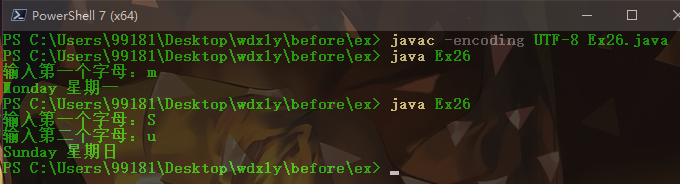  

## Ex27

程序 27 求素数  
题目：求 100 之内的素数  

源代码：
```java
public class Ex27 {
	// 判断是否是素数
	public static boolean isPrime(int n) {
		for(int i = 2; i <= Math.sqrt(n); i++) {
			if (n % i == 0) {
				return false;	// 能被整除即非素数
			}
		}
		return true;
	}
	public static void main(String[] args) {
		int i,n;
		System.out.print("100 以内的素数有：");
		
		for(i = 1; i <= 100; i++) {
			if (isPrime(i)) {	// 如果为素数，就 +1
				System.out.print(i + " ");
			}
		}
	}
}
```

运行截图：  
  

## Ex28

程序 28 排序算法  
题目：对 10 个数进行排序  
程序分析：可以利用选择法，即从后 9 个比较过程中，选择一个最小的与第一个元素交换， 下次类推，即用第二个元素与后 8 个进行比较，并进行交换

源代码：  
```java
import java.util.Scanner;

public class Ex28 {
	public static void main(String[] args) {
		Scanner sc = new Scanner(System.in);
		int[] nums = new int[10];
		int i,j,k,min,temp;
		System.out.print("输入 10 个数：");
		for (i = 0; i < 10; i++) {
			nums[i] = sc.nextInt();
		}
		sc.close();

		// 选择排序
		for (i = 0; i < 9; i++) {
			min = i;
			for (j = i + 1; j < 10; j++) {
				if (nums[min] > nums[j]) {
					min = j;
				}
			}
			temp = nums[min];
			nums[min] = nums[i];
			nums[i] = temp;
		}
		
		System.out.print("从小到大排列：");
		for (i = 0; i < 10; i++) {
			System.out.print(nums[i] + " ");
		}
	}
}
```

运行截图：  
  

## Ex29

程序 29 求矩阵对角线之和  
题目：求一个 3*3 矩阵对角线元素之和  
程序分析：利用双重 for 循环控制输入二维数组，再将 a[i][i]累加后输出。

源代码：
```java
import java.util.Scanner;

public class Ex29 {
	public static void main(String[] args) {
		Scanner sc = new Scanner(System.in);
		int[][] matrix = new int[3][3];
		int num = 0;

		// 输入矩阵
		System.out.print("输入一个 3 * 3 矩阵：");
		for (int i = 0; i < 3; i++) {
			for (int j = 0; j < 3; j++) {
				matrix[i][j] = sc.nextInt();
			}
		}
		sc.close();
		
		for (int i = 0; i < 3; i++) {
			num += matrix[i][i];
		}
		System.out.println("对角线之和：" + num);
	}
}
```

运行截图：  
  

## Ex30

程序 30 插入数字  
题目：有一个已经排好序的数组。现输入一个数，要求按原来的规律将它插入数组中。  
程序分析：首先判断此数是否大于最后一个数，然后再考虑插入中间的数的情况，插入后此元素之后的
数，依次后移一个位置。  

源代码：  
```java
import java.util.Scanner;

public class Ex30 {
	public static void main(String[] args) {
		int[] arr = new int[100];
		System.out.print("输入一个有序数组：");
		int i = 0;

		// 通过设置 2 个 Scanner，达到 「\n 停止输入」 的效果
		Scanner sc1 = new Scanner(System.in);
		String input = sc1.nextLine();
		Scanner sc2 = new Scanner(input);
		while(sc2.hasNextInt()) {
			arr[i] = sc2.nextInt();
			i++;
		}
		int length = i;	// 数组长度

		System.out.print("插入一个数：");
		int n = sc1.nextInt();
		sc1.close();
		sc2.close();

		if (arr[0] > arr[length - 1]) {	// 如果是从大到小
			for (i = length - 1; i >= 0; i--)
				if (arr[i] < n) {
					arr[i + 1] = arr[i];
				} else {
					arr[i + 1] = n;
					break;
				}
		} else {	// 从小到大
			for (i = length - 1; i >= 0; i--)
				if (arr[i] > n) {
					arr[i + 1] = arr[i];
				} else {
					arr[i + 1] = n;
					break;
				}
		}
		
		System.out.print("新的有序数组：");
		for (i = 0; i < length + 1; i++) {
			System.out.print(arr[i] + " ");
		}
	}
}
```

运行截图：  
  

## Ex31

程序 31 数组逆序  
题目：将一个数组逆序输出。  
程序分析：用第一个与最后一个交换。  

源代码：  
```java
public class Ex31 {
    public static void main(String[] args) {
        int[] arr = {1, 11, 5, 15, 8, 9, 10};
        System.out.print("原本顺序：");
        for (int i = 0; i < arr.length; i++) {
            System.out.print(arr[i] + " ");
        }

        for (int temp,i = 0; i < (arr.length + 1) / 2; i++) {   // 第一个与最后一个交换
            temp = arr[i]; 
            arr[i] = arr[arr.length - 1 - i];
            arr[arr.length - 1 -i] = temp;
        }

        System.out.print("\n逆序：");
        for (int i = 0; i < arr.length; i++) {
            System.out.print(arr[i] + " ");
        }
    }
}
```

运行截图：  
  

## Ex32

程序 32 左移右移  
题目：取一个整数 a 从右端开始的 4～7 位。  

源代码：
```java
import java.util.Scanner;

public class Ex32 {
	public static void main(String[] args) {
		Scanner sc = new Scanner(System.in);
		System.out.print("输入一个数（位数大于7）：");
		long num = sc.nextLong();
		sc.close();
		
		num = num / 1000;
		num = num % 10000;
		System.out.println("4~7 位为：" + num);
	}
}
```

运行截图：  
  

## Ex33

程序 33 杨辉三角  
题目：打印出杨辉三角形（要求打印出 10 行如下图）
程序分析：  
  

源代码：  
```java
public class Ex33 {
	public static final int N = 10;	// 10 行

	public static void main(String[] args) {
		// 初始化
		int[][] arr = new int[N][N];
		for (int i = 0; i < N; i++) {	// 每行的第一和最后一个数字是 0
			arr[i][0] = 1;
			arr[i][i] = 1;
		}

		// 求出其余值
		for (int i = 2; i < N; i++) {
			for (int j = 1; j < i; j++) {
				arr[i][j] = arr[i - 1][j - 1] + arr[i - 1][j];	// 杨辉三角每个元素等于父母之和
			}
		}

		// 规律输出
		for (int i = 0; i < N; i++) {
			for (int k = 0; k <= (N - i - 1) * 2; k++) {	// 下面控制每个元素占 4 个字格，则每行递减缩进 2 的倍数即可达到金字塔形状
				System.out.print(" ");
			}

			for (int j = 0; j <= i; j++) {
				System.out.printf("%3d ",arr[i][j]);	// 每项占 4 个字格
			}
			
			System.out.println();
		}
	}
}
```

运行截图：  
  

## Ex34

程序 34 三个数排序  
题目：输入 3 个数 a,b,c，按大小顺序输出。  
程序分析：利用指针方法。  

源代码：  
```java
/*
分析：java 里没有指针，那就尝试用不改变本身的方法输出
*/

import java.util.Scanner;

public class Ex34 {
	public static void main(String[] args) {
		System.out.print("输入三个数：");
		Scanner sc = new Scanner(System.in);
		int a = sc.nextInt();
		int b = sc.nextInt();
		int c = sc.nextInt();
		sc.close();

		System.out.print("递减顺序：");
		System.out.print((a > b && a > c) ? a : (b > c) ? b : c);	// 找出最大的
		System.out.print(" ");
		System.out.print(((a > b && a < c) || (a < b && a > c)) ? a : ((b > c && b < a) || (b > a && b < c)) ? b : c);	// 找出中间的
		System.out.print(" ");
		System.out.print((a < b && a < c) ? a : (b < c) ? b : c);	// 找出最小的
	}
}
```

运行截图：  
  

## Ex35

程序 35 最大最小交换  
题目：输入数组，最大的与第一个元素交换，最小的与最后一个元素交换，输出数组。  

源代码：  
```java
import java.util.Scanner;

public class Ex35 {
	public static void main(String[] args) {
		System.out.print("输入一个数组：");
		int[] arr = new int[100];
		int i = 0;

		// 通过设置 2 个 Scanner，达到 「\n 停止输入」 的效果
		Scanner sc1 = new Scanner(System.in);
		String input = sc1.nextLine();
		Scanner sc2 = new Scanner(input);
		while(sc2.hasNextInt()) {
			arr[i] = sc2.nextInt();
			i++;
		}
		sc1.close();
		sc2.close();

		int length = i;	// 数组长度
		int min = 0,max = 0;
		int temp;
		for (i = 0; i < length; i++) {	// 找到最大值，最小值的坐标
			if (arr[i] < arr[min]) {
				min = i;
			}
			if (arr[i] > arr[max]) {
				max = i;
			}
		}

		// 交换
		if (min + max == length - 1) {	// 如果最大值，最小值在两边，互换一次即可
			temp = arr[0];
			arr[0] = arr[max];
			arr[max] = temp;
		} else {
			temp = arr[0];
			arr[0] = arr[max];
			arr[max] = temp;
			temp = arr[length - 1];
			arr[length - 1] = arr[min];
			arr[min] = temp;
		}

		// 输出
		System.out.print("最大最小交换后：");
		for (i = 0; i < length; i++) {
			System.out.print(arr[i] + " ");
		}
	}
}
```

运行截图：  
  

## Ex36

程序 36 移动位置  
题目：有 n 个整数，使其前面各数顺序向后移 m 个位置，最后 m 个数变成最前面的 m 个数,比如输入数字
为 1 2 3 4 5 6 7 8 9 0，m=4，则结果为 7 8 9 0 1 2 3 4 5 6   

源代码：
```java
/*
分析：
1. 分成两部分，分别转置。 6 5 4 3 2 1，0 9 8 7
2. 合并。 6 5 4 3 2 1 0 9 8 7
3. 转置。 7 8 9 0 1 2 3 4 5 6
*/

import java.util.Scanner;

public class Ex36 {
	// 转置数组
	public static void trans(int[] arr,int a,int b) {
		for (int temp,i = 0; i <= (b - a) / 2; i++) {
			temp = arr[a + i];
			arr[a + i] = arr[b - i];
			arr[b - i] = temp;
		}
	}

	public static void main(String[] args) {
		int[] arr = new int[100];
		int length = 0;

		System.out.print("输入一个数组：");
		// 通过设置 2 个 Scanner，达到 「\n 停止输入」 的效果
		Scanner sc1 = new Scanner(System.in);
		String input = sc1.nextLine();
		Scanner sc2 = new Scanner(input);
		while(sc2.hasNextInt()) {
			arr[length] = sc2.nextInt();
			length++;	// 记录数组长度
		}

		System.out.print("向后移动多少位：");
		Scanner sc = new Scanner(System.in);
		int m = sc.nextInt();

		trans(arr,0,length - m -1 );	// 转置前半段
		trans(arr,length - m,length - 1);	// 转置后半段
		trans(arr,0,length - 1);	// 全部转置

		System.out.printf("向后移动 %d 位后：",m);
		for (int i = 0; i < length; i++) {
			System.out.print(arr[i] + " ");
		}

		sc1.close();
		sc2.close();
		sc.close();
	}
}
```

运行截图：  
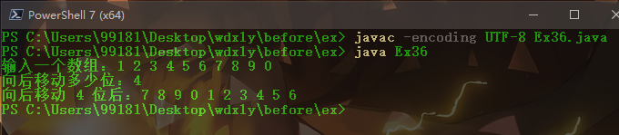

## Ex37

程序 37 报数  
题目：有 n 个人围成一圈，顺序排号。从第一个人开始报数（从 1 到 3 报数），凡报到 3 的人退出圈子，问最后留下的是原来第几号的那位。  

源代码：  
```java
/*
分析：通过 % 达到绕圈的效果
*/

import java.util.Scanner;

public class Ex37 {
	// 删除数组中的第 k 个元素
	public static void del(int[] arr,int n,int k) {
		for (int i = k; i < n - 1; i++) {
			arr[i] = arr[i + 1];
		}
	}

	public static void main(String[] args) {
		System.out.print("一共多少人：");
		Scanner sc = new Scanner(System.in);
		int n = sc.nextInt();
		sc.close();

		int[] arr = new int[n];
		/*
		角标：0 1 2 3 4...n-1
		赋值：1 2 3 4 5...n
		*/
		for (int i = 0; i < n; i++) {
			arr[i] = i + 1;
		}

		int k = 2;	// 从角标 2 开始删除
		while(true) {
			if (n == 1) {
				break;
			}
			k = k % n;
			del(arr,n,k);
			n--;
			k += 2;	// 删除操作后，之前的元素后退 1 位，因此每次角标前进 2 位即可
		}

		System.out.print("最后留下的是第 " + arr[0] + " 号");
	}
}
```

运行截图：  


## Ex38

程序 38 求字符串长度  
题目：写一个函数，求一个字符串的长度，在 main 函数中输入字符串，并输出其长度。

源代码：  
```java
import java.util.Scanner;

public class Ex38 {
	public static void main(String[] args) {
		System.out.print("输入一个字符串：");
		Scanner sc = new Scanner(System.in);
		String str = sc.nextLine();
		sc.close();
		System.out.println("字符串长度：" + str.length());
	}
}
```

运行截图：  
  

## Ex39

程序 39 分数累加  
题目：编写一个函数，输入 n 为偶数时，调用函数求 1/2+1/4+...+1/n,当输入 n 为奇数时，调用函数 1/1+1/3+...+1/n

源代码：  
```java
import java.util.Scanner;

public class Ex39 {
	public static void main(String[] args) {
		Scanner sc = new Scanner(System.in);
		int n = sc.nextInt();
		sc.close();
		
		double sum = 0;
		if (n % 2 == 0) {
			for (int i = 2; i <= n; i = i + 2) {
				sum += 1 / (double)i;	// 需要专制
			}
		} else {
			for (int i = 1; i <= n; i = i + 2) {
				sum += 1 / (double)i;
			}
		}

		System.out.print(sum);
	}
}
```

运行截图：  
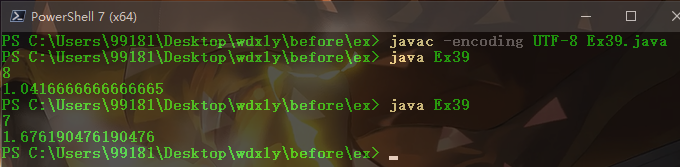  

## Ex40

程序 40 字符串排序  
输入一个字符串数组，按照字母表的降序对这些字符串进行排序。  
题目：字符串排序。

源代码：
```java
/*
分析：把字符比大小，用冒泡排序法
*/

import java.util.Scanner;

public class Ex40 {
	public static void main(String[] args) {
		Scanner sc = new Scanner(System.in);
		System.out.print("输入一个字符串：");
		String input = sc.nextLine();
		sc.close();

		// 字符串转为 char 数组
		int length = input.length();
		char[] str = new char[length];
		for (int i = 0; i < length; i++) {
			str[i] = input.charAt(i);
		}

		// 冒泡排序
		char temp;
		for (int i = 0; i < length; i++) {
			for (int j = 0; j < length - i - 1; j++) {
				// 大写字母 -'A'，小写字母 -'a'
				if (((str[j] > 'a' && str[j] < 'z') ? (str[j] - 'a') : (str[j] - 'A')) > ((str[j + 1] > 'a' && str[j + 1] < 'z') ? (str[j + 1] - 'a') : (str[j + 1] - 'A'))) {
					temp = str[j];
					str[j] = str[j + 1];
					str[j + 1] = temp;
				}
			}
		}

		System.out.print("按字母表排序：");
		for (int i = 0; i < length; i++) {
			System.out.print(str[i]);
		}
	}
}
```

运行截图：  
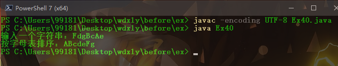

## Ex41

程序 41 猴子分桃  
题目：海滩上有一堆桃子，五只猴子来分。第一只猴子把这堆桃子凭据分为五份，多了一个，这只猴子把多的一个扔入海中，拿走了一份。第二只猴子把剩下的桃子又平均分成五份，又多了一个，它同样把多的一个扔入海中，拿走了一份，第三、第四、第五只猴子都是这样做的，问海滩上原来最少有多少个桃子？

源代码：  
```java
public class Ex41 {
	public static void main(String[] args) {
		int i,n,peach;
		n = 1;
		while(true) {
			peach = n;

			// 5 次达标才符合
			for (i = 1; i <= 5; i++) {
				if ((peach - 1) % 5 != 0) {	// 扔掉 1 个，是否能分成 5 份
					break;
				} else {
					peach = (peach - 1) / 5 * 4;
				}
			}

			if (i == 6) {
				System.out.print("桃子数目：" + n);
				break;
			}
			n++;
		}
	}
}
```

运行截图：  
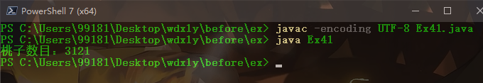

## Ex42

程序 42 求数字  
题目：809*??=800*??+9*??+1  
其中??代表的两位数,8*??的结果为两位数，9*??的结果为 3 位数。求??代表的两位数，及 809*??后的结果

源代码：  
```java
public class Ex42 {
	public static void main(String[] args) {
		int num;
		for (num = 10; num <= 99; num++) {
			if ((809*num == 800*num + 9 * num + 1) && (8*num < 100) && (9*num >= 100) ) {
				System.out.println("??为：" + num);
				break;
			}
		}
		if (num == 100) {
			System.out.print("无解");
		}

	}
}
```

运行截图：  


## Ex43

程序 43 求奇数个数  
题目：求 0—7 所能组成的奇数个数。  

源代码：  
```java
/*
分析：
	可以是 1 位数，2 位数...8 位数，但个位都是奇数
	最高位都不为 0

	似乎可以用递归简化代码
*/

public class Ex43 {
	// 设置一个函数，判断最新元素是否与之前元素重复
	public static boolean isSame(int[] num,int n) {
		for (int i = 0; i < n; i++) {
			if (num[i] == num[n]) {
				return true;
			}
		}
		return false;
	}

	public static void main(String[] args) {
		int all = 0;
		int[] num = new int[8];	// 存储 8 位，num[0] 存储个位
		// 个位需要判断是否为奇数
		for (num[0] = 0; num[0] < 8; num[0]++) {
			if (num[0] % 2 == 0) {
				continue;
			}
			all++;	// 1 位数

			// 其余位需要判断是否与之前数字重复
			for (num[1] = 0; num[1] < 8; num[1]++) {
				if (isSame(num,1))	continue;
				if (num[1] != 0)	all++;	// 2 位数

				for (num[2] = 0; num[2] < 8; num[2]++) {
					if (isSame(num,2))	continue;
					if (num[2] != 0)	all ++;	// 3 位数

					for (num[3] = 0; num[3] < 8; num[3] ++) {
						if (isSame(num,3))	continue;
						if (num[3] != 0)	all++;	// 4 位

						for (num[4] = 0; num[4] < 8; num[4]++) {
							if (isSame(num,4))	continue;
							if (num[4] != 0)	all++;	// 5 位

							for (num[5] = 0; num[5] < 8; num[5]++) {
								if (isSame(num,5))	continue;
								if (num[5] != 0)	all++;	// 6 位

								for (num[6] = 0; num[6] < 8; num[6]++) {
									if (isSame(num,6))	continue;
									if (num[6] != 0)	all++;	// 7 位

									for (num[7] = 0; num[7] < 8; num[7]++) {
										if (isSame(num,7))	continue;
										if (num[7] != 0)	all++;	// 8 位
									}
								}
							}
						}
					}
				}
			}
		}
		System.out.println("共有奇数 " + all + " 个");
	}
}
```

运行截图：  
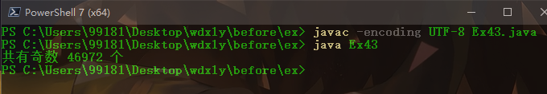  

## Ex44

程序 44 偶数的素数和  
题目：一个偶数总能表示为两个素数之和  

源代码：  
```java
import java.util.Scanner;

public class Ex44 {
	// 判断是否为素数
	public static boolean isPrime(int n) {
		for(int i = 2; i <= Math.sqrt(n); i++) {
			if (n % i == 0) {
				return false;	// 能被整除即非素数
			}
		}
		return true;
	}

	public static void main(String[] args) {
		Scanner sc = new Scanner(System.in);
		System.out.print("输入一个偶数：");
		int num = sc.nextInt();
		boolean isOk = false;	// 设置一个开关，默认不能，如果能表示，就打开
		sc.close();

		for (int i = 1; i <= num/2; i++) {
			if (isPrime(i) && isPrime(num - i)) {
				System.out.printf("%d = %d + %d\n",num, i, num - i);
				isOk = true;
			}
		}
		if (isOk == false) {
			System.out.println("该偶数不能表示为两个奇数之和");
		}
	}
}
```

运行截图：  
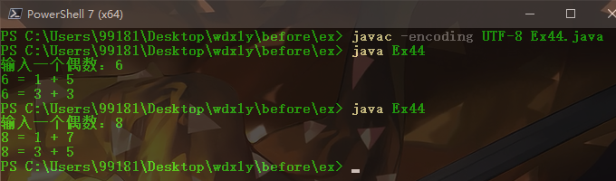  

## Ex45

程序 45 被 9 整除  
题目：判断一个数能被几个 9 整除  

源代码：  
```java
import java.util.Scanner;

public class Ex45 {
	public static void main(String[] args) {
		Scanner sc = new Scanner(System.in);
		System.out.print("输入一个数：");
		int num = sc.nextInt();
		sc.close();

		int s = 0;
		int n = num;
		while(n % 9 == 0) {
			s++;
			n = n / 9;
		}

		if (s == 0) {	// 仍为 0，则不能被 9 整除
			System.out.printf("%d 不能被 9 整除\n",num);
		} else {
			System.out.printf("%d 能被 %d 个 9 整除\n",num,s);
		}
	}
}
```

运行截图：  
  

## Ex46

程序 46 字符串连接  
题目：两个字符串连接程序,将两个字符串拼接在一起  

源代码：  
```java
import java.util.Scanner;

public class Ex46 {
	public static void main(String[] args) {
		Scanner sc = new Scanner(System.in);
		System.out.print("输入两个字符串：");
		String str1 = sc.nextLine();
		String str2 = sc.nextLine();
		sc.close();

		String str3 = str1 + str2;
		System.out.println("拼接后：" + str3);
	}
}
```

运行截图：  
  

## Ex47

程序 47 打印星号  
题目：读取 7 个数（1—50）的整数值，每读取一个值，程序打印出该值个数的＊。

源代码：  
```java
import java.util.Scanner;

public class Ex47 {
	public static void main(String[] args) {
		Scanner sc = new Scanner(System.in);

		for (int i = 1; i <= 7; i++) {
			System.out.print("输入第 " + i + " 个数（1-50）:");
			float num = sc.nextFloat();
			if (num > 50 || num < 1) {
				System.out.println("输入有误！");
				i--;	// 输错的话，本次不算
				continue;
			}
			for (int j = 0; j < (int)num; j++) {
				System.out.print("*");
			}
			System.out.println();
		}
		sc.close();
	}
}
```

运行截图：  
  

## Ex48

程序 48 加密  
题目：某个公司采用公用电话传递数据，数据是四位的整数，在传递过程中是加密的，加密  
规则如下：每位数字都加上 5,然后用和除以 10 的余数代替该数字，再将第一位和第四位交换，第二位和第三位交换。

源代码：  
```java
import java.util.Scanner;

public class Ex48 {
	public static void main(String[] args) {
		Scanner sc = new Scanner(System.in);
		System.out.print("输入数据（4 位数）：");
		int input = sc.nextInt();
		sc.close();

		// 转换成数组
		int[] date = new int[4];
		for (int i = 0; i < 4; i++) {
			date[i] = ((input % 10) + 5) % 10;
			input /= 10;
		}

		System.out.print("加密后：" );
		for (int i = 0; i < 4; i++) {
			System.out.print(date[i]);
		}
	}
}
```

运行截图：  
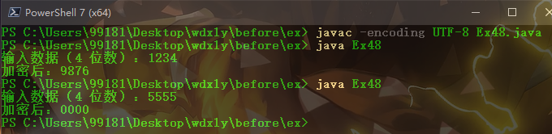

## Ex49

程序 49 子串出现的个数  
题目：计算字符串中子串出现的次数  


源代码：  
```java
import java.util.Scanner;

public class Ex49 {
	public static void main(String[] args) {
		Scanner sc = new Scanner(System.in);
		System.out.print("输入字符串：");
		String str1 = sc.nextLine();
		System.out.print("输入子串：");
		String str2 = sc.nextLine();
		sc.close();

		int i, j, sum = 0;
		for (i = 0; i <= str1.length() - str2.length(); i++) {
			for (j = 0; j < str2.length(); j++) {	// 与字串第一个字符相同他，就对比
				if (str1.charAt(i + j) != str2.charAt(j)) {
					break;
				}
			}
			if (j == str2.length()) {	// 字串能遍历一次都相同，即出现一次
				sum++;
			}
		}
		
		System.out.println("子串出现了 " + sum + " 次");
	}
}
```

运行截图：  
  

## Ex50

程序 50 文件 IO  
题目：有五个学生，每个学生有 3 门课的成绩，从键盘输入以上数据（包括学生号，姓名，三门课成绩），计算出平均成绩，将原有的数据和计算出的平均分数存放在磁盘文件"stud"中。  

源代码：
```java
/*
IO 流控制写入


学号    姓名    课1    课2    课3
001		小明		90    90    90
002		小芳		100   100   100
003     小张    90    90    90
004     小李    90    90    90
005     小王    90    90    90
                90    90    90
*/


import java.io.*;
import java.util.Scanner;

public class Ex50 {
	public static void main(String[] args) throws IOException {
		// 学生信息用 4 个数组保存
		String[] studentId = new String[5];	// 学号
		String[] studentName = new String[5];	// 姓名
		int[][] studentCourse = new int[5][3];	// 三门课
		float[] averageScore = new float[3];	// 每门课的平均成绩

		// 输入
		Scanner sc = new Scanner(System.in);
		int i, j;
		for (i = 0; i < 5; i++) {
			System.out.printf("现在输入第 %d 个学生的信息\n学号：", i+1);
			studentId[i] = sc.nextLine();

			System.out.print("姓名：");
			studentName[i] = sc.nextLine();

			for (j = 0; j < 3; j++) {
				System.out.printf("课 %d 的成绩：", j + 1);
				studentCourse[i][j] = sc.nextInt();
			}
			sc.nextLine();	// nextInt 后回车，会跳过一个 nextLine
		}

		// 计算
		System.out.println();
		for (i = 0; i < 3; i++) {
			averageScore[i] = 0;
			for (j = 0; j < 5; j++) {
				averageScore[i] += studentCourse[j][i];
			}
			averageScore[i] /= 5;
			System.out.printf("课 %d 的平均成绩为：%.2f\n", i + 1, averageScore[i]);
		}

		// 写入文件
		File file = new File("stud.txt");
		file.createNewFile();
		FileWriter out = new FileWriter(file);

		// String 是最大的类型，由小到大可以自动转换
		out.write("学号\t姓名\t课1\t课2\t课3\n");
		for (i = 0; i < 5; i++) {
			out.write(studentId[i] + "\t" + studentName[i] + "\t");
			for (j = 0; j < 3; j++) {
				out.write(studentCourse[i][j] + "\t");
			}
			out.write("\n");
		}
		for (i = 0; i < 3; i++) {
			out.write("课 " + (i + 1) + " 的平均成绩：" + averageScore[i] + "\n");
		}
		out.flush();
		out.close();
	}
}
```

运行截图：  
  