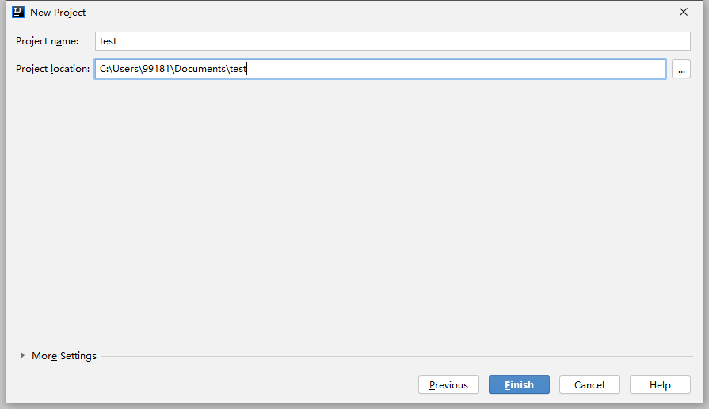

# 一、Java 入门

## 目录

- [一、Java 入门](#一java-入门)
  - [目录](#目录)
  - [1 Java 语言概述](#1-java-语言概述)
    - [1.1 Java 语言的诞生](#11-java-语言的诞生)
    - [1.2 Java 语言的平台版本](#12-java-语言的平台版本)
    - [1.3 Java 语言的特点](#13-java-语言的特点)
    - [1.4 JRE 与 JDK](#14-jre-与-jdk)
  - [2 HelloWorld](#2-helloworld)
    - [2.1 命令行方式](#21-命令行方式)
    - [2.2 IDEA 方式](#22-idea-方式)
  - [3 Java 语言基础](#3-java-语言基础)
    - [3.1 关键字](#31-关键字)
    - [3.2 标识符](#32-标识符)
    - [3.3 注释](#33-注释)
    - [3.4 常量](#34-常量)
    - [3.5 变量和数据类型](#35-变量和数据类型)
      - [3.5.1 变量](#351-变量)
      - [3.5.2 数据类型](#352-数据类型)
      - [3.5.3 数据类型转换](#353-数据类型转换)
    - [3.6 运算符](#36-运算符)
      - [3.6.1 算数运算符](#361-算数运算符)
      - [3.6.2 赋值运算符](#362-赋值运算符)
      - [3.6.3 关系运算符](#363-关系运算符)
      - [3.6.4 逻辑运算符](#364-逻辑运算符)
      - [3.6.5 位运算符](#365-位运算符)
      - [3.6.6 三元运算符](#366-三元运算符)
    - [3.7 键盘录入数据](#37-键盘录入数据)
  - [4 Java 流程控制](#4-java-流程控制)
    - [4.1 顺序结构](#41-顺序结构)
    - [4.2 选择结构](#42-选择结构)
      - [4.2.1 if 语句](#421-if-语句)
      - [4.2.2 switch 语句](#422-switch-语句)
    - [4.3 循环结构](#43-循环结构)
      - [4.3.1 for 语句](#431-for-语句)
      - [4.3.2 while 语句](#432-while-语句)
      - [4.3.3 do while 语句](#433-do-while-语句)
      - [for each 语句](#for-each-语句)
    - [4.4 跳转控制语句](#44-跳转控制语句)
      - [4.4.1 break](#441-break)
      - [4.4.2 continue](#442-continue)
      - [4.4.3 return](#443-return)
  - [5 方法](#5-方法)
    - [5.1 方法定义](#51-方法定义)
    - [5.2 方法重载](#52-方法重载)
    - [5.3 递归](#53-递归)
  - [6 数组](#6-数组)
    - [6.1 概念](#61-概念)
    - [6.2 数组的初始化](#62-数组的初始化)
    - [6.3 数组拷贝](#63-数组拷贝)
    - [6.4 二维数组](#64-二维数组)
    - [6.5 数组常见报错](#65-数组常见报错)
  - [7 Java 中的内存](#7-java-中的内存)

## 1 Java 语言概述

### 1.1 Java 语言的诞生

Java 是由 Sun 公司于 1995 年 5 月推出的 Java 面向对象程序设计语言和 Java 平台的总称。由 James Gosling 和同事们共同研发，并在 1995 年正式推出。  
- Sun 公司发布 Java1.0 版本（1996.1）
- JDK 1.1（1997.2）
- J2SE 1.2（1998.12） 
- J2SE 1.3（2001.9）
- J2SE 1.4（2002.2） 
- J2SE 5.0（2004.9） 
- Java SE 6（2006.12） 
- 2009 年 Oracle 甲骨文公司收购 Sun 公司
- Java SE 7（2011.7） 
- Java SE 8（2014.3） 
- Java SE 9（2017.9）
- Java SE 10（2018.3）
- Java SE 11（2018.9）
- Java SE 12（2019.3）
- Java SE 13（2019.9）
- Java SE 14（2020.3）

### 1.2 Java 语言的平台版本

Java SE 标准版：是为开发普通桌面和商务应用程序提供的解决方案。  

Java ME 嵌入式开发：是为开发电子消费产品和嵌入式设备提供的解决方案。  

Java EE 企业级开发：是为开发企业环境下的应用程序提供的一套解决方案。  

注：Java SE 为整个技术架构的核心。  

### 1.3 Java 语言的特点

**（1）跨平台**  

Java 程序是在 Java 虚拟机上运行，而非直接运行于操作系统。因此通过 Java 语言编写的应用程序在不同的系统平台上都可以运行。  
<div align="center">

</div>

**（2）面向对象**  

**（3）解释型**  

编译型语言写出的代码，首先通过编译器的编译，全部转化成目标代码，然后依次在操作系统中执行。  
解释型语言则是转化一句，执行一句。  

Java 编译过程：`.java` -> `.class` -> Java 虚拟机。  

**（4）健壮**  

提供了异常机制。  

**（5）动态**  

两个方面：  
1. 在 Java 语言中，可以简单、直观地查询运行时的信息；  

2. 可以将新代码加入到一个正在运行的程序中。  

**（6）分布式**  

Java 语言具有强大的、易于使用的联网能力。

**（7）高效**  

由于 Java 是一种解释型语言，所以它的执行效率相对就会慢一些，但由于 Java 语言采用以下两种手段，使其拥有较好的性能。  
1. Java 语言源程序编写完成后，先使用 Java 伪编译器进行伪编译，将其转换为中间码，再解释；

2. Java 语言提供一种「准实时」（Just-in-Time，JIT）编译器，当需要更快速度时，Java 语言可以使用 JIT 编译器将字节码转换成机器码，然后将其缓冲下来，这样速度就会更快。

**（8）多线程**  

**（9）结构中立（字节码）**  

Java 编译器通过伪编译后，将生成一个与任何计算机体系统无关的「中性」的字节码。  

**（10）开源**

### 1.4 JRE 与 JDK

JRE（JAVA  Runtime Environment） 是 Java 程序的运行时环境，包含 JVM 和运行时所需要的核心类库。

JDK（JAVA  Develop kit) 是 Java 程序开发工具包，包含 JRE 和开发人员使用的工具。

<div align="center">

</div>

JDK的下载和安装：[JDK8 下载地址](https://www.oracle.com/java/technologies/javase-jdk8-downloads.html)。

建议 JDK 安装路径中不要有中文和空格。

PATH 环境变量是操作系统的环境属性，告诉操作系统可执行程序（javac）路径。  

官方推荐的配置 PATH 环境变量方式：
1. 先配置 JAVA_HOME 环境变量：`xx\xx\xx\jdk1.8`；

2. 再添加 PATH 环境变量：`$JAVA_HOME$\bin`。 


## 2 HelloWorld

Java 程序运行原理：  
<div align="center">

</div>

### 2.1 命令行方式

第一步：创建 `HelloWorld.java` 文件，用文本编辑器打开编辑：  
```java
public class HelloWorld {
	public static void main(String[] args) {
		System.out.println("Hello World!");
	}
}  
```  

第二步：打开 cmd，进入 `HelloWorld.java` 文件所在的文件夹，执行命令：
```
javac HelloWorld.java
```
之后会生成 `HelloWorld.class` 文件，接着执行：
```
java HelloWorld
``` 
即可在命令行打印出 HelloWorld!。  

注：如打印内容中包含中文，cmd 命令行下会显示乱码。用 javac 命令时添加 `-enconding UTF-8` 即可解决。如：
```
javac -encoding UTF-8 HelloWorld.java
```

### 2.2 IDEA 方式

[IDEA 官网地址](https://www.jetbrains.com/idea)，选择版本，下载安装即可。  

安装完成后，打开 IDEA，选择新建项目：  
<div align="center">

</div>

选择创建 Java 项目，并选择 JDK 的版本：  
<div align="center">

</div>

此处不勾选：  
<div align="center">

</div>

设置项目名称和存储位置：  
<div align="center">

</div>

Java 代码一般存放在 src 目录下，在此新建一个包：  
<div align="center">

</div>

给包命名：  
<div align="center">

</div>

右击包名，在包文件夹下新建 Java 程序：  
<div align="center">

</div>

给程序命名：  
<div align="center">

</div>

写好代码后，右击侧边小三角，选择运行，即可在下方显示运行结果：  
<div align="center">
  

</div> 

## 3 Java 语言基础

### 3.1 关键字  

关键字也称保留字，是被 Java 语言赋予特殊含义的单词。  

关键字的特点：组成关键字的字母全部小写。  

关键字的注意事项：  
- 高级的编辑器或者专门的开发工具中，关键字会有高亮效果。

- `goto` 和 `const` 作为保留字存在，目前并不使用。

### 3.2 标识符

标识符是我们给类、接口、方法、变量等起名字时使用的字符序列。  

组成规则：
- 由英文大小写字母、数字字符、`$` 和 `_` 组合。  
 
- 不能以数字开头。

- 不能是 Java 中的关键字（保留字）。

- 区分大小写。

常见命名规范：  
- 包命名：  
  - 单级：一个全部小写的单词。
  
  - 多级：以域名反转的方式来命名，单词全部小写，单词以 `.` 隔开。

- 类和接口命名：使用 UpperCamelCase 风格。

- 变量和方法的命名：使用 lowerCamelCase 风格。

- 常量的命名：常量命名全部大写，单词间用下划线隔开，力求语义表达完整清楚，不要嫌名字长。 

注：Java 语言还有很多约定俗成的书写规范。如：  
- 代码中的命名均不能以下划线或美元符号开始，也不能以下划线或美元符号结束。  

- 代码中的命名严禁使用拼音与英文混合的方式，更不允许直接使用中文的方式。  
  说明：正确的英文拼写和语法可以让阅读者易于理解，避免歧义。注意，纯拼音命名方式更要避免采用。  

- 更多规则可以阅读 <a href = "https://github.com/alibaba/p3c">《阿里巴巴Java开发手册》</a>。  

### 3.3 注释

注释是指用于解释说明的文字，有助于阅读代码和项目维护。  

Java 语言的注释分类：  
- 单行注释。格式：  
  ```java
  // 这是单行注释
  ```  

- 多行注释。格式：  
  ```java
  /*
  一行
  两行
  可以很多行
  */
  ```  
  注：多行注释不能嵌套使用。

- 文档注释。格式：  
  ```java
  /**
  文档注释内容
  */
  ```

### 3.4 常量

常量是指在运行过程中，其值不会发生改变的量。

常量的分类：  
- 字面值常量。  

- 自定义常量。  

字面值常量分类：  
- 字符串常量：用双引号引起来的内容，如："zhang3"。  

- 整型常量：所有整数。  
  
- 浮点数常量：所有小数。  

- 字符常量：用单引号引起来的内容，如：'a'，'我'。  

- 布尔常量：只有 true 和 false。  

- 空常量：只有 null。  

Java 中的整数型常量的表现形式：  
- 二进制：由 0 和 1 组成，以 `0b` 开头。

- 八进制：由 0~7 组成，以 `0` 开头。

- 十进制：由 0~9 组成，默认 10 进制。

- 十六进制：由 0\~9，A\~F(或 a\~f) 表示 0\~15，以 `0x` 开头。   

注：从 Java 7 开始，可以为数字字面量加下划线，如用 1_000_000 表示一百万。这些下划线只是为了让人更易读，Java 编译器会去除这些下划线。

### 3.5 变量和数据类型

#### 3.5.1 变量

变量指在程序运行期间，其值在某个范围内可以改变的量。变量定义的格式：
```java
数据类型 变量名 = 变量值
```  

使用变量的注意事项：  
- 作用域：变量有效的时间范围，这个范围通常用 `{}` 来界定。 

- 定义的变量，不赋值不能使用。

- 从代码的可读性角度来考虑，建议一行定义一个变量。  

#### 3.5.2 数据类型

一种数据类型，表示的就是一个数据集和基于该数据集的一组合法操作。  

Java 的数据类型分为两大类：
- 基本数据类型：整数、浮点数、字符、布尔。

- 引用数据类型：类、数组、接口。

四类八种基本数据类型：  
| 数据类型 | 关键字 | 内存占用 | 取值范围 |
| :- | :- | :- | :- |
| 字节型 | byte | 1 个字节 | -128 ~ 127 |
| 短整型 | short | 2 个字节 | -32768 ~ 32767 |
| 整型 | int（默认） | 4 个字节 | -231 次方 ~2 的 31 次方 - 1 |
| 长整型 | long | 8 个字节 | -2 的 63 次方 ~ 2 的 63 次方 - 1 |
| 单精度浮点数 | float | 4 个字节 | 1.4013E-45 ~ 3.4028E+38 |
| 双精度浮点数 | double（默认） | 8 个字节 | 4.9E-324 ~ 1.7977E+308 |
| 字符型 | char | 2 个字节 | 0 ~ 65535 |
| 布尔类型 | boolean | 1 个字节 | true，false |

注：
- Java 中整数类型的默认类型是 int、浮点类型的默认类型是 double 。

- boolean 只有两个值：true、false，可以使用 1 bit 来存储，但是具体大小没有明确规定。JVM 会在编译时期将 boolean 类型的数据转换为 int，使用 1 来表示 true，0 表示 false。JVM 支持 boolean 数组，但是是通过读写 byte 数组来实现的。  

- 在 long 或者 Long 赋值时，数值后使用大写的 L，不能是小写的 l ，小写容易跟数字 1 混淆，造成误解。  

- 浮点型可能只是一个近似值，并非精确的值。

- 在 float 赋值时，通过数值后加 f/F，声明类型是 float 类型。没有后缀 f/F 的浮点数值默认为 double 类型。  
  注：事实上，只有很少的情况适合使用 float 类型。   

- 一个字符只能以数值的形式保存到计算机中。ASCII 码表定义了常见字符和字符对应的数值对应关系。  

  注：**强烈建议不要在程序中使用 char 类型，除非确实需要处理 UTF-16 代码单元。最好将字符串作为抽象数据处理类型。**

#### 3.5.3 数据类型转换

自动类型转换：一些数据类型之间可以互相转换（JVM 默认类型转化规则）。  
规则：byte、short、char -> int -> long -> float -> double。

强制类型转换：将取值范围大的类型强制转换成取值范围小的类型。自动转换是 Java 自动执行的，而强制转换需要我们自己手动执行。格式：
```java
变量名 = (目标类型)(被转换的数据);
```  

注：
- boolean 类型的值不能直接转化为其它数据类型的值。

- byte、short、char 相互之间不转换，他们参与运算时都会提升为 int 类型。

### 3.6 运算符

常用运算符有六类：算术运算符、赋值运算符、比较运算符、逻辑运算符、位运算符和三目运算符。  

#### 3.6.1 算数运算符   

| 运算符 | 功能 |
| :- | :- |
| + | 加号 / 正号 / 字符串拼接 |
| - | 减号 / 负号 | 
| * | 乘号 |
| / | 除号 | 
| % | 取模 |
| ++ / -- | 自增 / 自减 | 
  
注：
- `+` 符号在遇到字符串的时候，表示连接、拼接的含义。  
  任何数据类型和字符串进行连接的时候，结果都会变成字符串

- `++` 或 `--` 若参与运算，位置不同，效果不同。  
  示例：
  ```java
  a = 1；
  b = ++a;  // 先加后用，b = 2。  
  
  a = 1;
  b = a++;  // 先用后加，b = 1。
  ```
  建议不要在表达式中使用 `++` 或 `--`，因为这样的代码很容易让人困惑，而且会带来烦人的 bug。

#### 3.6.2 赋值运算符  

赋值运算符就是将右侧的数据交给左侧的变量。

| 运算符 | 功能 |
| :- | :- |
| = | 等于号 |
| += | 加等于 |
| -= | 减等于 |
| *= | 乘等于 |
| /= | 除等于 |
| %= | 取模等 |

注：复合赋值运算符其中隐含了一个强制类型转换。  
示例：
```java
public class Test{
    public static void main(String[] args) {
        byte num = 30;
        num += 5;
        System.out.println(getType(num));
    }
    public static String getType(Object obj) {
        return obj.getClass().getName();
    }
}

/* 运行结果：
java.lang.Byte
*/
```

#### 3.6.3 关系运算符  

| 运算符 | 功能 |
| :- | :- |
| == | 判断是否相等于 |
| != | 判断是否不等于 |
| < / > | 判断是否小于 / 大于 |
| <= / >= | 判断是否小于等于 / 大于等于 |  

关系运算符的结果只有两种：ture 和 flase。  

#### 3.6.4 逻辑运算符  

| 运算符 | 功能 |
| :- | :- |
| & | 与（AND） |
| \| | 或（OR） |
| ^ | 异或（XOR） |
| ! | 非（NOT） |
| && | 与（短路） |
| \|\| | 或（短路） |
  
短路：如果根据左边已经可以判断得到最终结果，那么右边的代码将不再执行，从而节省一定的性能。

#### 3.6.5 位运算符  

| 运算符 | 功能 | 注意事项 |
| :- | :- | :- |
| << | 左移 | 空位补 0，被移除的高位丢弃 |
| >> | 右移 | 被移位的二进制最高位是 0，右移后，空缺位补 0；最高位是 1，最高位补 1 |
| >>> | 无符号右移 | 被移位二进制最高位无论是 0 或者是 1，空缺位都用 0 补 |
| & | 与运算 | 任何二进制位和 0 进行 & 运算，结果是 0；和 1 进行 & 运算结果是原值 |
| \| | 或运算 | 任何二进制位和 0 进行 \| 运算，结果是原值；和 1 进行 \| 运算结果是 1 |
| ^ | 异或运算 | 任何相同二进制位进行 ^ 运算，结果是0；不相同二进制位 ^ 运算结果是 1 |
| ~ | 按位取反 |  

实现两个整数的互换：
```java
a = a ^ b;
b = a ^ b;
a = a ^ b;
```

快速实现计算 2 乘以 8：  
```java
n = 2 << 3;
```

#### 3.6.6 三元运算符

一元运算符：只需要一个数据就可以进行操作的运算符。例如：`!`、`++`、`--`。

二元运算符：需要两个数据才可以进行操作的运算符。如：`+`、`=`。

三元运算符（三目运算符）：需要三个数据才可以进行操作的运算符。格式：
```java
关系表达式 ? 表达式 1 : 表达式 2
```  

含义：如果关系表达式结果为为 true，运算后的结果是表达式 1；如果关系表达式结果为 false，运算后的结果是表达式 2。

注：
- 必须同时保证表达式 1 和表达式 2 都符合左侧数据类型的要求。

- 三元运算符的结果必须被使用。

### 3.7 键盘录入数据

实现键盘录入数据：  
```java
import java.util.Scanner; // 导包语句（放到 class 定义的上面）

··· {
    ···
    Scanner sc = new Scanner(System.in);  // 创建对象

    int x = sc.nextInt(); // 从键盘输入读取数据

    sc.close();
}
```


## 4 Java 流程控制

一个 Java 程序，通常是由多条符合 Java 语法规则的语句组成的。一个 Java 程序的执行，一定意味着多条 Java 语句的执行。  
既然是多条 Java 语句的执行，执行的结果就一定与语句执行的顺序有关，同样的语句，不同的执行顺序，结果可能不同。

### 4.1 顺序结构

顺序结构描述的是 Java 语句之间，从上到下（或从左到右）依次执行的执行顺序。  

顺序结构是程序中最简单最基本的流程控制，没有特定的语法，就是按照代码书写的顺序执行。

### 4.2 选择结构
 
Java 中，选择结构有 2 种实现形式，if 语句 和 switch 语句

#### 4.2.1 if 语句  

if 语句实现选择结构有 3 种格式：  
- 如果，就（单分支）。格式：    
  ```java
  if (关系表达式) {
      语句体
  }
  ```  

- 非此即彼（两分支）。格式：  
  ```java
  if (关系表达式) {
        语句体1
    } else {
        语句体2
    }
  ```

- 多选一（多分支）。格式：  
  ```java
  if (关系表达式1) {
      语句体1
  } else  if (关系表达式2) {
      语句体2
  }
  …
  else {
      语句体n+1
  }
  ```

在绝大部分场景下，三目运算符和 if 双分支选择结构，都可以相互替代。但是，如果选择结构执行的仅仅只是一个操作（没有返回值），此时三目运算无法替代 if 双分支选择结构。  

#### 4.2.2 switch 语句

switch 语句格式：  
```java
switch(表达式) {
    case 值1:
        语句体1
        break;
    case 值2:
        语句体2
        break;
    …
    default:	
        语句体 n+1
        break;
}
```

switch 格式解释：  
- switch 关键字：表示这是一个 switch 语句。

- switch 后的表达式：表示选择条件。

- case 语句：每个 case 语句表示一个分支。

- beak 语句：表示结束 switch 语句。

- default 语句：表示当所有其他的 case 的分支都不能匹配 switch 后表达式的值的时候，此时就会执行 default 分支。

注：  
- switch 语句后，表达式结果的取值范围：byte、short、int、char、枚举、String。

- case 后面的值，不能相同，且必须是和表达式值的类型相同的常量值。

- break 在语法上可以省略，省略之后，有可能触发多个 case 分支。

- default 语法上可以省略，但建议一般不要省略。

### 4.3 循环结构

与顺序结构和选择结构不同，循环结构的主要功能是控制 Java 语句能够重复执行。

循环结构，从语法上来讲，有 3 种实现形式：for 语句、while 语句和 do while 语句。  
  
不管哪种实现形式，都由 4 部分组成：  
- 初始化语句。  

- 条件判断语句。  

- 循环体语句。  

- 循环控制语句。

#### 4.3.1 for 语句

for 循环语句格式：
```java
for (初始化语句; 判断条件语句; 控制条件语句) {
    循环体语句
}
```

执行流程：  
<div align="center">

</div>

#### 4.3.2 while 语句

while 循环语句格式：  
```java
初始化语句
while (条件判断语句) {
    循环体语句
}
```

执行流程：
  和 for 循环一模一样。

#### 4.3.3 do while 语句

do while 循环语句格式：  
```java
初始化语句
do {
    循环体语句
} while (条件判断)
```

执行流程：  
do while 循环结构与 while 循环结构比，略有不同。不同之处在于 do while 中的循环体语句是在条件判断之前执行。

#### for each 语句

Java 中还有一种功能很强的循环结构，for each 循环。可以用来依次处理数组中的每个元素，而不必为指定下标值而分心。格式：
```java
for (循环变量 : 数组) {
    循环体语句
}
```  
示例：
```java
for (int num : nums) {
    System.out.println(num);
}
```

for each 中的循环变量会遍历数组中的每一个元素，且不需要下标值。

### 4.4 跳转控制语句

通过跳转控制语句可以实现对循环结构更加细粒度的控制。
- break：中断。

- continue：继续。 

- return：返回。

#### 4.4.1 break

break 的使用场景：
- 在选择结构的 switch 语句中：结束 switch 语句。

- 在循环语句中：  
  - 跳出单层循环（如果有多层循环，只跳出内层）。

  - 带标签的跳出（多重循环）。  
    格式：`标签名 : 循环语句`。  
    标签名要符合 Java 的命名规则。  
    示例：  
    ```java
    outer:  // 标签名
    for (int i = 0; i < 3; i++) {
      for (int j = 0; j < 3; j++) {
        if( j == 2) {
          break outer;
        }
      }
    }
    ```

- 离开使用场景的存在是没有意义的。  

#### 4.4.2 continue

continue 的使用场景：
  - 在循环语句中：  
    - 退出单层循环的一次迭代过程。

    - 也可以使用标签。

  - 离开使用场景的存在是没有意义的。

#### 4.4.3 return

return 关键字不是为了跳转出循环体。更常用的功能是结束一个方法（函数），也就是退出一个方法，跳转到上层调用的方法。


## 5 方法

### 5.1 方法定义

方法（在有些其他语言中，也被称为函数）的主要功能是封装可以执行的一段代码，这样不仅可以进行重复调用，更可以方便地实现代码的维护。  

方法定义的格式：  
```java
修饰符 返回值类型 方法名 (参数1 类型 参数1 名称, 参数2 类型 参数2 名称, ……) {
    方法体语句
    return 返回值;
}
```

格式说明：  
- 修饰符：现在暂且认为固定 `public static`。  

- 返回值类型：return 返回的数据类型。

- 方法名：标识符。

- 参数：类比数学中函数的自变量，如 z = f(x, y) 里的 x，y。

- return：跳转控制关键字。

- 返回值：方法执行的到的最终结果。

注：返回值类型为 void 时，可以不使用 return 返回内容，但是可以使用 return 结束方法调用。

方法在定义完毕后，方法不会自己运行，必须被调用才能执行，我们可以在主方法 main 中来调用我们自己定义好的方法。在主方法中，直接写要调用的方法名字就可以调用了。  
示例：
```java
public static void main(String[] args) {
    // 调用定义的方法 method
    method();
}

// 定义方法，被 main 方法调用
public static void method() {
    System.out.println("自己定义的方法，需要被 main 调用运行");
}
```

### 5.2 方法重载

方法重载（overload）：在同一个类中，允许存在一个以上的同名方法，只要它们的「参数个数 / 参数类型 / 参数顺序」不同。  
示例：  
```java
public static int add(int x, int y) {
  return x + y;
}

// 方法重载
public static double add(double x, double y) {  
  return x + y;
}
```

注：方法重载的时候是根据参数类型及个数来区分不同的方法，而不是依靠返回值的不同来确定。  

### 5.3 递归

递归调用是一种特殊的调用形式，指的是方法自己调用自己的形式。递归调用必须满足两个条件：  
1. 必须有结束条件；

2. 每次调用必须改变传递的参数。

示例：
```java
// 求阶乘
public static fac(int n) {
  if (n == 1) {
    return 1;
  }
  return n * fac(n - 1);
}
```

注：开发中应当避免过多的使用递归，因为处理不当，就可能造成栈溢出问题。

## 6 数组 

### 6.1 概念

数组的概念：相同数据类型的数据元素的有序（物理地址有序非元素有序）集合。通过一个整型下标就可以访问数组中的每一个元素。  

特点：  
- 存储多个数据元素。

- 这多个数据元素的数据类型必须一致。

可以存储的数据类型：  
- 基本类型数据。  

- 引用类型数据。

数组的定义格式：  
- 格式1：
  ```java
  数据类型[] 数组名;
  ```

- 格式2：
  ```java
  数据类型 数组名[];
  ```

建议使用格式1，避免造成歧义。

### 6.2 数组的初始化

数组的初始化：为数组中的数组元素分配内存空间，并为每个数组元素赋初值。Java 中的数组必须先初始化，然后才能使用。  

数组的初始化方式：  
- 动态初始化（指定长度）。格式：
  ```java
  数据类型[] 数组名 = new 数据类型[数组长度];
  ```  
  示例：  
  ```java
  int[] arr = new int[3];
  ```  

- 静态初始化（指定内容）。格式：
  ```java
  数据类型[] 数组名 = new 数据类型[]{元素1, 元素2, …};
  ```  
  示例：  
  ```java
  int[] arr1 = new int[]{1, 2, 3};

  int[] arr2 = {1, 2, 3}; // 简化写法
  ```
  注：简化写法只在数组定义时有效！

注：
- 一旦创建了数组就不能再改变它的大小。如果经常需要在运行中拓展数组的大小，就应该使用另外一种数据结构 —— 数组列表（Arraylist），之后会详细介绍。  

- 字符串类型的数据不是基本数据类型的数据，我们所说的一个字符串，其实是一个字符串对象。字符串对象存储在数组中，数组中其实存储的是对象的地址值，并未直接存储字符串中的字符序列数据，而同一个 JVM 中的引用值（地址值）占用的内存大小相同。


### 6.3 数组拷贝

在 Java 中，允许将一个数组拷贝给另一个数组变量。这时两个变量将引用同一个数组。  
示例：
```java
int[] arr2 = arr1;
arr2[3] = 5; // 这时 arr1[3] 也等于 5
```

如果希望将一个数组的所有值拷贝到一个新的数组中去，可以使用 Arrays 类中的 copyOf 方法。  
示例：    
```java
int[] arr2 = Arrays.copyOf(arr1, arr1.length);
```
参数2 确定新数组的长度，因此这个方法常用来调整数组的长度。如果参数2 小于原始长度，则只拷贝最前面的数据元素。

### 6.4 二维数组

相对于一维数组单行多列的结构，二维数组就是一张多行多列的数据表结构。  

定义格式：  
- 动态初始化：
  ```java
  数据类型[][] 数组名 = new 数据类型[行的长度][列的长度];
  ```  
  示例：  
  ```java
  int[][] arr = new int[10][10]
  ```

- 静态初始化：
  ```java
  数据类型[][] 数组名 = {{}, {}, {}, …};
  ```  
  示例：  
  ```java
  int[][] arr = {
      {1, 2, 3},
      {3, 4, 6},
      {7, 8, 9}
  };
  ```

注：for each 循环语句不能自动处理二维数组的每一个元素。它是按行，也就是一位数组处理的。想要访问二维数组的所有元素，需要使用两个嵌套的循环。  
示例：
```java
for (int[] row : arr) {
    for (int value : row) {
        循环语句
    }
}
```
 
- Java 实际上没有多维数组，只有一维数组。多维数组实际上是「数组的数组」。因此 Java 中可以构建不规则数组，即数组的每一行有不同的长度。   

Java 中允许定义不规则的多维数组。  
不规则数组动态定义格式：`数据类型[][] 数组名 = new 数据类型[行的长度][];`。  
示例：
```java
int[][] arr = new int[3][];
for (int i = 0; i < arr.length; i++) {
  int[i] = new int[i + 1];
}
/*
构建了不规则数组：
{
  {长度为 1},
  {长度为 2},
  {长度为 3}
}
*/
```


### 6.5 数组常见报错

`ArrayIndexOutOfBoundsException`：数组索引越界。  

`NullPointerException`：空指针异常。 

## 7 Java 中的内存

一个 Java 程序在 JVM 中运行的过程中，在内存中需要保存很多种内存数据，比如局部变量、数组等。不同类型的数据，其使用方式和生命周期都不相同。为了更好的管理这些不同类型的数据，JVM 把自己的内存空间划分为不同的内存区域。各个区域针对不同类型的数据采用不同的管理方式：  
- 栈（Stack）：存放的都是方法中的局部变量。方法的运行一定要在栈当中运行。  
  一旦超出作用域，立刻从栈内存当中消失。

- 堆（Heap）：存储关键字 new 开辟出来的东西，即保存每一个对象的属性内容。  
  堆内存里面的东西都有一个 16 进制的地址值。  
  堆内存里的数据天然有初值：
  - 整型：0。
  - 浮点型：0.0。
  - 字符型：'\u000'。
  - 布尔型：false。
  - 引入数据类型：null。  

- 方法区（Method Area）：存储 .class 相关信息，包含方法的信息。

- 本地方法栈（Native Method Stack）：与操作系统相关。

- 寄存器（pc Register）：与 CPU 相关。

个人理解：  
当定义一个变量，如 `int a = 1` 时，栈是先开辟地址，这个地址存放值 1，然后让变量名 a 指向这个地址。如果又定义了新的变量等于这个值，如 `int b = 1`，那直接让新的变量名 b 也指向这个地址。如果修改新的变量值，如 `b = 2`，并不会修改这块地址的值（即 a 依旧为 1），而是重新指向一块值为 2 的地址（如果没有，就再开辟一块地址，令值为 2）。如果变量都离开了作用域，即没有变量指向这块地址，就把这块地址回收。  
堆是申请一片地址，数组名指向这个地址。修改数组，就直接修改这块地址的数据。