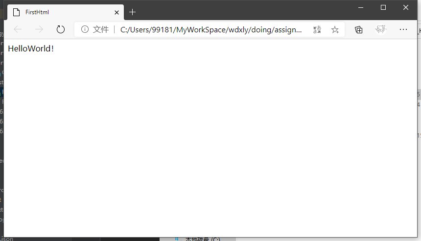
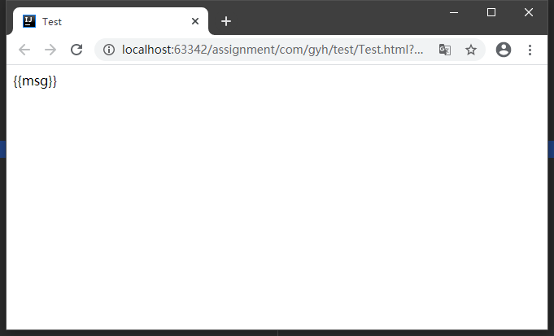
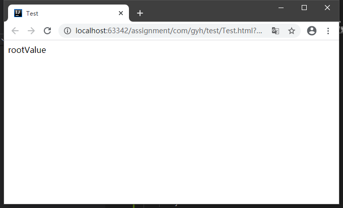

# 七、前端基础

## 目录

- [七、前端基础](#七前端基础)
  - [目录](#目录)
  - [1 背景知识](#1-背景知识)
    - [1.1 URI 和 URL](#11-uri-和-url)
    - [1.2 DNS](#12-dns)
    - [1.3 HTTP](#13-http)
      - [1.3.1 请求报文](#131-请求报文)
      - [2.2.2 结构特点](#222-结构特点)
      - [2.2.3 `<!DOCTYPE>` 声明](#223-doctype-声明)
      - [2.2.4 标签分类](#224-标签分类)
    - [2.3 头部常用标签](#23-头部常用标签)
      - [2.3.1 title](#231-title)
      - [2.3.2 meta](#232-meta)
      - [2.3.3 link](#233-link)
      - [2.3.4 style](#234-style)
      - [2.3.5 script](#235-script)
    - [2.4 body 常用标签](#24-body-常用标签)
      - [2.4.1 hr](#241-hr)
      - [2.4.2 br](#242-br)
      - [2.4.3 h 标题](#243-h-标题)
      - [2.4.4 div](#244-div)
      - [2.4.5 a](#245-a)
      - [2.4.6 p](#246-p)
      - [2.4.7 img](#247-img)
      - [2.4.8 input](#248-input)
      - [2.4.9 textarea](#249-textarea)
      - [2.4.10 select](#2410-select)
      - [2.4.11 ol 和 ul](#2411-ol-和-ul)
      - [2.4.12 table](#2412-table)
      - [2.4.13 form](#2413-form)
  - [3 CSS](#3-css)
    - [3.1 CSS 概念](#31-css-概念)
    - [3.2 引人 CSS](#32-引人-css)
    - [3.3 选择器](#33-选择器)
      - [3.3.1 标签选择器](#331-标签选择器)
      - [3.3.2 类选择器](#332-类选择器)
      - [3.3.3 id 选择器](#333-id-选择器)
      - [3.3.4 复合选择器](#334-复合选择器)
      - [3.3.5 伪类和伪元素选择器](#335-伪类和伪元素选择器)
      - [3.3.6 属性选择器](#336-属性选择器)
      - [3.3.7 选择器优先级](#337-选择器优先级)
    - [3.4 盒子模型](#34-盒子模型)
    - [3.5 浮动](#35-浮动)
    - [3.6 定位](#36-定位)
      - [3.6.1 默认定位](#361-默认定位)
      - [3.6.2 相对定位](#362-相对定位)
      - [3.6.3 绝对定位](#363-绝对定位)
  - [4 JavaScript](#4-javascript)
    - [4.1 概述](#41-概述)
    - [4.2 常见操作](#42-常见操作)
      - [4.2.1 引用 JS](#421-引用-js)
    - [4.2.2 日志和注释](#422-日志和注释)
    - [4.3 语法](#43-语法)
      - [4.3.1 声明变量](#431-声明变量)
      - [4.3.2 变量的类型](#432-变量的类型)
      - [4.3.3 函数](#433-函数)
      - [4.3.4 语言逻辑](#434-语言逻辑)
    - [4.4 核心对象](#44-核心对象)
      - [4.4.1 Number](#441-number)
      - [4.4.2 String](#442-string)
      - [4.4.3 Array](#443-array)
      - [4.4.4 Math](#444-math)
      - [4.4.5 Boolean](#445-boolean)
  - [5 DOM](#5-dom)
    - [5.1 概述](#51-概述)
    - [5.2 节点](#52-节点)
    - [5.3 document 方法和属性](#53-document-方法和属性)
    - [5.4 Element 对象](#54-element-对象)
    - [6.3 Vue 基础指令](#63-vue-基础指令)
      - [6.3.1 v-bind](#631-v-bind)
      - [6.3.2 v-model](#632-v-model)
      - [6.3.3 v-test 和 v-html](#633-v-test-和-v-html)
      - [6.3.4 v-on](#634-v-on)
      - [6.3.5 v-show](#635-v-show)
      - [6.3.6 v-if](#636-v-if)
      - [6.3.7 v-for](#637-v-for)
      - [6.3.8 v-pre](#638-v-pre)
      - [6.3.9 v-cloak](#639-v-cloak)
      - [6.3.10 v-once](#6310-v-once)
    - [6.4 部分选项](#64-部分选项)
      - [6.4.1 computed](#641-computed)
      - [6.4.2 watch](#642-watch)
      - [6.4.3 template](#643-template)
      - [6.4.4 component](#644-component)
      - [6.4.5 组件传值：向下传值](#645-组件传值向下传值)
      - [6.4.6 组件传值：向上](#646-组件传值向上)
      - [6.4.7 生命周期钩子](#647-生命周期钩子)
    - [6.5 创建 Vue 项目（工程化）](#65-创建-vue-项目工程化)
      - [6.5.1 安装环境](#651-安装环境)
      - [6.5.2 创建项目](#652-创建项目)
      - [6.5.3 Vue 项目的目录结构](#653-vue-项目的目录结构)
      - [6.5.4 项目入口和基本配置](#654-项目入口和基本配置)
      - [6.5.5 Vue 事务总线](#655-vue-事务总线)

## 1 背景知识

### 1.1 URI 和 URL

统一资源标识符（英语：Uniform Resource Identifier，缩写：URI）在电脑术语中是一个用于标识某一互联网资源名称的字符串。  

> 维基百科介绍：  
> 该种标识允许用户对网络中（一般指万维网）的资源通过特定的协议进行交互操作。URI的最常见的形式是统一资源定位符（URL），经常指定为非正式的网址。更罕见的用法是统一资源名称（URN），其目的是通过提供一种途径。用于在特定的名字空间资源的标识，以补充网址。

URL，简单讲就是网址。

### 1.2 DNS

域名系统（英语：Domain Name System，缩写：DNS）是互联网的一项服务。它作为将域名和IP地址相互映射的一个分布式数据库，能够使人更方便地访问互联网。

DNS，简单讲就是将域名转换成 IP 地址。

### 1.3 HTTP

浏览器负责发起请求 --> 服务器从 80 端口接收请求 --> 服务器负责响应 --> 浏览器下载响应内容。

HTTP 的作用就是指导浏览器和服务器如何沟通。

#### 1.3.1 请求报文

一个完整的 HTTP 请求包括如下内容：
- 一个请求行。

- 若干请求头。

- 一个空格行。

- 以及请求正文。

注：其中的一些消息头和正文都是可选的（不固定的），消息头和正文内容之间要用空行隔开。

请求报文的格式：
- 请求行：
  ```
  请求方法 URL 协议/版本
  ```	

- 请求头：
  ```
  名: 值  
  名: 值
  ...
  ```

- 空行：
  ```
  ```

- 请求正文：
  ```
  HTTP 要传输的内容
  ```

示例：  
<div align="center">

</div>

请求行：
- 请求方式：GET、POST、HEAD、OPTIONS、DELETE、PUT。  

  用户如没有设置，默认情况下浏览器向服务器发送的都是 GET 请求，用户如想把请求方式改为 POST，可通过更改表单的提交方式实现。  

  不管 POST 或 GET，都用于向服务器请求某个 WEB 资源，这两种方式的区别主要表现在数据传递上。  

  - GET 方式：如请求方式为 GET 方式，则可以在请求的 URL 地址后以 ? 的形式带上交给服务器的数据，多个数据之间以 & 进行分隔。  
    
    GET 方式的特点：在 URL 地址后附带的参数是有限制的，其数据容量通常不能超过 1K。
  
  - POST 方式：如请求方式为 POST 方式，则可以在请求的正文内容中向服务器发送数据。  
    
    POST 方式的特点：传送的数据量无限制。
  
  - PUT：传输文件。

  - DELETE：一般用来删除数据。

  - OPTIONS：用来测试连接。

  - HEAD：获取报文首部，无正文。用来确认 url 有效或者资源更新时间。

请求头：
- Accept：浏览器可接受的。MIME 类型 `*/*`(大类型)/(小类型)

- Accept-Charset：浏览器通过这个头告诉服务器，它支持哪种字符集。

- Accept-Encoding：浏览器能够进行解码的数据编码方式，比如 gzip。

- Accept-Language：浏览器所希望的语言种类，当服务器能够提供一种以上的语言版本时要用到。 可以在浏览器中进行设置。

- Host：初始 URL 中的主机和端口。

- Referer：包含一个 URL，用户从该 URL 代表的页面出发访问当前请求的页面（防盗链）。

- Content-Type：内容类型。

- If-Modified-Since：GMT 服务器利用这个头与服务器的文件进行比对，如果一致，则告诉浏览器从缓存中直接读取文件。

- User-Agent：浏览器类型。

- Content-Length：表示请求消息正文的长度。

- Connection：表示是否需要持久连接。如果服务器看到这里的值为 `Keep -Alive`，或者看到请求使用的是HTTP 1.1 默认进行持久连接 

- Cookie：这是最重要的请求头信息之一 

- Date：GMT 请求时间。

#### 1.3.2 响应报文

一个完整的 HTTP 响应包括如下内容：
- 一个状态行。

- 若干消息头。

- 空格。

- 响应正文。

注：其中的一些消息头和正文都是可选的，消息头和正文内容之间要用空行隔开。

响应报文和请求报文共同点：
- 使用消息头，可以实现 HTTP 客户机与服务器之间的条件请求和应答，消息头相当于服务器和浏览器之间的一些暗号指令。

- 每个消息头包含一个头字段名称，然后依次是冒号、空格、值、回车和换行符。

- 消息头字段名是不区分大小写的，但习惯上每个单词的第一个字母大写。

- 整个消息头部分中的各行消息头可按任何顺序排列。

- 许多请求头字段都允许客户端在值部分指定多个可接受的选项，多个选项之间以逗号分隔。

- 有些头字段可以出现多次。

响应报文的格式：
- 状态行：
  ```
  协议版本 状态码 原因短语
  ```

- 首部：
  ```
  名: 值
  名: 值
  ...
  ```

- 空行：
  ```
  ```	
   
- 实体的主体部分：
  ```
  HTTP 要传输的内容
  ```

状态行：
- 状态码用于表示服务器对请求的各种不同处理结果和状态，它是一个三位的十进制数。响应状态码分为 5 类，使用最高位为 1 到 5 来进行分类如下所示：  
    <div align="center">
    
    </div>
  - 200 表示正常。  
    表示一切正常，返回的是正常请求结果。  
    206 表示分段的请求 OK。

  - 301、302/307（临时重定向）。  
    指出被请求的文档已被临时移动到别处，此文档的新的 URL 在 Location 响应头中给出。
  
  - 304（未修改）表示客户机缓存的版本是最新的，客户机可以继续使用它，无需到服务器请求。

  - 404（找不到）。  
    404：服务器上不存在客户机所请求的资源。  
    400：服务器不支持这种请求方式。

  - 500 表示服务器内部错误。
    服务器端的程序发生错误。


常用响应头：
- Location：指示新的资源的位置。

- Server：指示服务器的类型。

- Content-Encoding：服务器发送的数据采用的编码类型。

- Content-Length：告诉浏览器正文的长度。

- Content-Language：服务发送的文本的语言。

- Content-Type：服务器发送的内容的 MIME 类型。

- Last-Modified：文件的最后修改时间。

- Refresh：指示客户端刷新频率，单位是秒。

- Content-Disposition：指示客户端保存文件。

- Set-Cookie：服务器端发送的 Cookie。

- Expires 和 Cache-Control：缓存相关。

- Connection：表示是否需要持久连接。

- Date：时间。


## 2 HTML

### 2.1 HTML 概念

HTML 的英文全称是 Hypertext Marked Language，即超文本标记语言。  
- 超文本是一种组织信息的方式，它通过超链接方法蒋文本中的文字、图表与其它信息媒体相关联（本质是一个文本，不过是个特别的文本）。

- HTML 不是一种编程语言，而是一种标记语言。标记语言是一套（一系列）标记标签，通过这些标签可以将网络上的文档格式统一，使分散的 internet 资源链接为一个逻辑整体。

用 HTML 编写的超文本文档称为 HTML 文档，它能独立于各种操作系统平台。使用 HTML 语言，将所需要表达的信息按某种规则写成 HTML 文件，通过专用的浏览器来识别，并将这些 HTML 文件翻译成可以识别的信息，即现在所见到的网页.

HTML 发展历史：HTML 1.0 --> HTML 2.0 --> HTML 3.2 --> HTML 4.0 --> HTML 4.01 --> HTML 5。  

HTML5 极大地提升了 Web 在富媒体、富内容和富应用等方面的能力，曾经被喻为终将改变移动互联网的重要推手。  

HTML 语言特点：
- 简易性：超级文本标记语言版本升级采用超集方式，从而更加灵活方便。 

- 可扩展性：超级文本标记语言的广泛应用带来了加强功能，增加标识符等要求，超级文本标记语言采取子类元素的方式，为系统扩展带来保证。 

- 平台无关性：超级文本标记语言可以使用在广泛的平台上 

- 通用性： HTML 是网络的通用语言，一种简单、通用的全置标记语言。它允许网页制作人建立文本与图片相结合的复杂页面，这些页面可以被网上任何其他人浏览到，无论使用的是什么类型的电脑或浏览器。

### 2.2 HTML 结构

#### 2.2.1 HelloWorld

创建一个新的 HTML 文本：新建文本 `FirstHtml` --> 后缀改为 `.html`。

编辑 `FirstHtml.html`：
```html
<!DOCTYPE html>
<html lang="en">
<head>
    <meta charset="UTF-8">
    <title>FirstHtml</title>
</head>
<body>
HelloWorld！
</body>
</html>
```

保存后选择打开方式为浏览器：
<div align="center">

</div>

#### 2.2.2 结构特点

HTML 文本是由标签描述的文本，整个文本由 `<html>` 标签包裹，文本分为两个部分：
- 头标签 `<head>`。

- 包裹身体标签 `<body>`。
 
HTML 标记语言有一系列标签组成，这些标签具有以下特点：
- 由尖括号包围的关键词，比如 `<html>`。

- 标签成对出现，有开始标签和结束标签（除了个别单标签，如 `<hr>`）

- 标签对中的第一个标签是开始标签，第二个标签是结束标签。开始和结束标签也被称为开放标签和闭合标签。

#### 2.2.3 `<!DOCTYPE>` 声明

一个 HTML 文本必须有 `<!DOCTYPE>` 声明，用来选择文档类型（除了 HTML5 的 DOCTYPE，其他的都很难记）。  

HTML5 的 DOCTYPE：
```html
<!DOCTYPE html>
```

注：
- `<!DOCTYPE>` 声明位于文档中的最前面的位置，处于 `<html>` 标签之前。

- `<!DOCTYPE>` 声明不是一个 HTML 标签。

#### 2.2.4 标签分类

**（1）按位置分类**  

HTML 标签在文档中一般分为两个部分：文档头部和文档身体。

文档头部由 `<head>` 标签包裹，主要用来指定整个网页的标题、提供有关页面的基本信息和定义文档与外部资源的关系。  

除了网页在浏览器的标题外，头部标签包裹的标签及内容都不会在网页上显示。  

写在头部的主要标签：`<title>`、`<base>`、`<meta>`、`<link>`、`<script>`、`<style>`。

文档身体部分由 `<body>` 标签包裹，主要用来书写网页的实际显示部分。  

写在身体部分的主要标签：`<div>`、`<a>`、`<font>`、`<b>`、`<i>`、`<ui>`、`<li>`、`<ol>`、`<table>`、`<tr>`、`<td>`、`<th>`、`<br>`、``、`<input>`...

**（2）按单双标签分类**  

双标签：标签成对出现，有开始和结束标签。  

单标签：标签单个出现，没有开始和结束标签，仅有一个标签。  
如：`<br>`、`<hr>`、``。

HTML 标签中大多都是双标签，只有少部分特别的标签是单标签。

**（3）body 里按 css 盒子模型分类**  

在 HTML 文本中，部分标签独占一行，称为块级标签；有的不能独占一行，多个标签元素可以在一行内前后排列，称为行级（行内）标签。

块级元素性质：
- 独占一行，每一个块级元素都会从新的一行重新开始，从上到下排布。

- 可以直接控制宽度、高度以及盒子模型的相关 css 属性。

- 在不设置宽度的情况下，块级元素的宽度是它父级元素内容的宽度。

- 在不设置高度的情况下，块级元素的高度是它本身内容的高度。

- 块级元素是指本身属性为 `display:block;` 的元素。

- 通常使用块级元素来进行大布局（大结构）的搭建。


行级元素性质：
- 和其他内联元素从左到右在一行显示。

- 不能直接控制宽度、高度以及盒子模型的相关 css 属性，但是直接设置内外边距的左右值是可以的。

- 内联元素的宽高是由本身内容的大小决定（文字、图片等）。

- 内联元素只能容纳文本或者其他内联元素（不要在内联元素中嵌套块级元素）。

- 内联元素是指本身属性为 `display:inline;` 的元素。

- 通常使用行级元素来进行文字、小图标（小结构）的搭建。

行级块元素性质：
- 本质属于行级元素。

- 可以与其他行内元素、内联元素共处一行。

- 可以设置宽高、内外边距（需要结合 css 盒子模型理解）。

- 属性为 `display:inline-block;` 的元素。

### 2.3 头部常用标签

#### 2.3.1 title

`<title>` 定义文档的标题。  

浏览器会以特殊的方式来使用标题，并且通常把它放置在浏览器窗口的标题栏或状态栏上。同样，当把文档加入用户的链接列表或者收藏夹或书签列表时，标题将成为该文档链接的默认名称。

#### 2.3.2 meta

meta 标签提供关于 HTML 文档的元数据。

元数据不会显示在页面上，但是对于机器是可读的。它可用于浏览器（如何显示内容或重新加载页面）、搜索引擎（关键词）或其他 Web 服务。

为搜索引擎定义关键词：
```html
<meta name="keywords" content="HTML, CSS, XML, XHTML, JavaScript">
```

为网页定义描述内容：
```html
<meta name="description" content="编程 & 教程">
```

定义网页作者：
```html
<meta name="author" content="Runoob">
```

每 30 秒钟刷新当前页面：
```html
<meta http-equiv="refresh" content="30">
```

#### 2.3.3 link

`<link>` 标签定义了文档与外部资源之间的关系，通常用于链接到样式表。  

注：在用于样式表时，`<link>` 标签得到了几乎所有浏览器的支持。但是几乎没有浏览器支持其他方面的用途。

#### 2.3.4 style

`<style>` 标签定义了 HTML 文档的 css 样式文件引用。

在 `<style>` 元素中也可以直接添加样式来渲染 HTML 文档。

#### 2.3.5 script

`<script>` 标签用于加载脚本文件，如 JavaScript。

### 2.4 body 常用标签

#### 2.4.1 hr

`<hr>` 标识一条横线，并且是一个单标签。


| 属性 | 值 | 描述 |
| :- | :- | :- |
| align	| center<br>left<br>right | 对齐方式 |
| noshade | noshade	| 规定 hr 元素的颜色呈现为纯色 |
| size | pixels	| 规定 hr 元素的高度（厚度） |
| width	| pixels<br>% | 宽度 |

#### 2.4.2 br

`<br>` 可插入一个简单的换行符，是一个单标签。

使用在行级元素, 当多个行级元素,中间需要换行时使用。

#### 2.4.3 h 标题

`<h1>`、`<h2>`、`<h3>`、`<h4>`、`<h5>`、`<h6>` 被称为标题标签，用来定义标题。
- 有且只有这 6 个标题标签。

- `<h1>` 定义最大的标题，`<h6>` 定义最小的标题。

- `<h1>` 只能在一个 HTML 文本中出现一次，并且不得出现在 `<h2>` - `<h6>` 之后。  
  注：错误书写不影响显示，但是建议正确书写。例如写多个 `<h1>` 不影响每个 `<h1>` 的显示，但是 SEO 会淡化这个页面的标题和关键词，降低关键字的排名。

#### 2.4.4 div

<div> 可定义文档中的分区或节（division/section）。它可以把文档分割为独立的、不同的部分。可以用作严格的组织工具，并且不使用任何格式与其关联。
- 它是块级标签，会自动换行。

- 是最常用的布局标签。

| 属性 | 值 | 描述 |
| :- | :- | :- |
| align	| center<br>left<br>right<br>justify | 对齐方式 |

#### 2.4.5 a

`<a>` 标签定义超链接，用于从一张页面链接到另一张页面。


| 属性 | 值 | 描述 |
| :- | :- | :- |
| targrt | _self<br>_blank<br>_parent<br>_top | 默认是 _self<br>_self：原窗口打开<br>_blank：在新窗口打开<br>_parent：在父窗口打开<br>_top：在顶级窗口打开 |
| href | URL | 规定链接指向的页面的 URL |

注：`<a>` 元素最重要的属性是 href 属性。

#### 2.4.6 p

`<p>` 标签定义段落。  

`<p>` 元素会自动在其前后创建一些空白。浏览器会自动添加这些空间，也可以自己在样式表中规定。

#### 2.4.7 img

`` 为图片标签，在文档中引入图片资源。
- 单标签。

- 行级标签。

注：从技术上讲，`` 标签并不会在网页中插入图像，而是从网页上链接图像。`` 标签创建的是被引用图像的占位空间。

| 必须属性 | 值 | 描述 |
| :- | :- | :- |
| alt | text | 规定图像的替代文本 |
| src | URL | 规定显示图像的 URL |

| 属性 | 值 | 描述 |
| :- | :- | :- |
| height / width | pixels<br>% | 设置图像的高度 / 宽度 |

#### 2.4.8 input

`<input>` 标签用于搜集用户信息。
- 单标签。

- 行级元素。


根据不同的 type 属性值，输入字段拥有很多种形式。输入字段可以是文本字段、复选框、掩码后的文本控件、单选按钮、按钮等等。

| 属性 | 值 | 描述 |
| :- | :- | :- |
| type | button<br>checkbox<br>file<br>hidden<br>image<br>password<br>radio<br>reset<br>submit<br>text | Button：按钮<br>Checkbox：定义复选框<br>file：文件上传<br>hidden：隐藏<br>image：图片<br>password	：密码<br>radio：单选框<br>reset：重置按钮，用于 form 表单<br>submit：提交<br>text：单行文本 |
| max / min | number<br>date | 规定输入字段的最大值 / 最小值 |
| multiple | multiple | 如果使用该属性，则允许一个以上的值 |
| required | required | 指示输入字段的值是必需的 |
| placeholder | text | 规定帮助用户填写输入字段的提示 |
| readonly | readonly | 规定输入字段为只读 |

#### 2.4.9 textarea

`<textarea>` 标签定义多行的文本输入控件。

文本区中可容纳无限数量的文本，其中的文本的默认字体是等宽字体（通常是 Courier）。

#### 2.4.10 select

<select> 元素可创建单选或多选菜单。

<select> 元素中的 <option> 标签用于定义列表中的可用选项。

示例：
```html
<select>
    <option>
        1
    </option>
    <option>
        2
    </option>
    <option selected="selected">
        3
    </option>
    <option>
        4
    </option>
</select>
```
<div align="center">

</div>

#### 2.4.11 ol 和 ul

`<ol>`: 标识有序列表。

| 属性 | 值 | 描述 |
| :- | :- | :- |
| reversed | reversed | 规定列表顺序为降序 |
| start	| number | 规定有序列表的起始值 |
| type | 1<br><br><br><br>i | 规定在列表中使用的标记类型 |

示例：
```html
<ol type="1" start="10">
    <li>li1</li>
    <li>li2</li>
    <li>li3</li>
</ol>

<ol type="a" start="2">
    <li>li1</li>
    <li>li2</li>
    <li>li3</li>
</ol>

<ol type="1" reversed>
    <li>li1</li>
    <li>li2</li>
    <li>li3</li>
</ol>
```
<div align="center">

</div>

`<ul>`: 标识无序列表。

| 属性 | 值 | 描述 |
| :- | :- | :- |
| compact | compact | 规定列表呈现的效果比正常情况更小巧 |
| type | disc<br>square<br>circle | disc：实心圆，是默认值<br>circle：空心圆<br>square：实心方块 |

注：`<ol>` 和 `<ul>` 都必须结合 li 标签使用。

#### 2.4.12 table

`<table>` 标签定义 HTML 表格。

简单的 HTML 表格由 table 元素以及一个或多个 tr、th 或 td 元素组成。
- tr 元素定义表格行。
  
- th 元素定义表头。

- td 元素定义表格单元。

更复杂的 HTML 表格也可能包括 caption、col、colgroup、thead、tfoot 以及 tbody 元素。

`<thead>`、`<tbody>`、`<tfoot>` 必须结合起来使用，它们的出现次序是：`<thead>`、`<tbody>`、`<tfoot>`。  
- `<thead>` 标签定义表格的表头。

- `<tbody>` 元素用于对 HTML 表格中的主体内容进行分组。

- `<tfoot>` 元素用于对 HTML 表格中的表注（页脚）内容进行分组。

注：
- 必须在 `<table>` 元素内部使用这些标签。

- 依旧包含 `<tr>`、`<td>`、`<th>` 等子元素。

示例：
```html
<table border="1px">
    <tr>
        <th colspan="2">11</th>
        <th>12</th>
    </tr>
    <tr valign="top">
        <td rowspan="2">21</td>
        <td>22</td>
        <td>23</td>
    </tr>
    <tr>

        <td>32</td>
        <td>33</td>
    </tr>
</table>

<hr>

<table>
    <thead>
        <tr>
            <td>头</td>
        </tr>
    </thead>

    <tfoot>
        <tr>
            <td>尾</td>
        </tr>
    </tfoot>

    <tbody>
        <tr>
            <td>中</td>
        </tr>
    </tbody>
</table>
```
<div align="center">

</div>

#### 2.4.13 form

`<form>` 标签用于为用户输入创建 HTML 表单。
- 表单能够包含 input 元素，比如文本字段、复选框、单选框、提交按钮等等。

- 表单还可以包含 menus、textarea、fieldset、legend 和 label 元素。

- 表单用于向服务器传输数据。

| 属性 | 值 | 描述 |
| :- | :- | :- |
| action | URL | 规定当提交表单时向何处发送表单数据 |
| method | get<br>post | 规定用于发送 form-data 的 HTTP 方法 |


示例：
```html
<form action="https://www.baidu.com/s" method="get">

    <input name="wd">

    <input type="submit">

</form>
```
<div align="center">


</div>


## 3 CSS

### 3.1 CSS 概念

CSS 指层叠样式表（级联样式表）。  

主要用于设置 HTML 页面中的文本内容（字体、大小、对齐方式等）、图片的外形（宽高、边框样式、边距等）以及版面的布局等等外观显示样式。

CSS 以 HTML为基础，提供了丰富样式功能。

### 3.2 引人 CSS

引入 CSS 的几种方式

内联：
- style 属性。

- style 标签。

外部文件：
- css link。

- `@import url()`。

style 属性：在 HTML 页面的标签上增加一个 style 属性, style 属性的值就是 css 代码。  
示例：
```html
<p style="background-color:#FF0000; color:#FFFFFF">
	p 标签段落内容。
</p>
```

style 标签：写在 HTML 页面的 `<head>` 标签里，用 `<style>` 标签包裹。  
示例：
```html
<head>
    <style type="text/css">
        p { 
            color:#FF0000;
        }
    </style>
</head>
```

css link：链接写在 head 标签内部。  
示例：
```html
<link rel="stylesheet" type="text/css" href="css_3.css" />
```

`@import url()`：导入。  
示例：
```html
<style type="text/css">
	@import url(css_3.css);
</style>
```

### 3.3 选择器

在 CSS 中，选择器是一种模式，用于选择需要添加样式的元素。  
分类：
- 标签选择器。

- 类选择器。

- Id 选择器。

- 复合选择器。

- 伪类选择器。

- 伪元素选择器。

- 属性选择器。

#### 3.3.1 标签选择器

通过标签名实现关联。  
示例：
```html
<style>
	p {
        color:red;
    }
</style>
```

#### 3.3.2 类选择器

通过类名（class）关联起来。

在 HTML 代码中，标签有一个 class 属性, class 属性所指向的值，就是这个标签的 css 类名。  

在 css 中（style标签里）可以创建一个以  `.类名{}`  的样式和 HTML 对应的标签绑定起来。  
示例：
```html
<style>
    .test{
        background: #FF0000;
    }
</style>

...

<div class="test">
    test
</div>
```

#### 3.3.3 id 选择器

通过 id 属性关联起来

在 HTML 代码中，标签有一个 id 属性，id 属性所指向的值，就是这个标签的 css id。

在 css 中（style标签里）可以创建一个以 `#id{}`  的样式和 HTML 对应的标签绑定起来。

注：
- id 是一个唯一标识，在一个 HTML 文档中，id 是不可重复的。

- 不提倡用id 去写样式，因为他的权重太高。 Id 主要是为了 js 做准备。

示例：
```html
style
<style>
    #test{
        background: #FF0000;
    }
</style>

...

<div id="test">
    test
</div>
```

#### 3.3.4 复合选择器

| 选择器 | 示例 | 示例说明 |
| :- | :- | :- |
| element,element | div,p | 选择所有 `<div>` 元素和 `<p>` 元素 |
| element element | div p | 选择 `<div>` 元素内的所有 `<p>`元素 |

#### 3.3.5 伪类和伪元素选择器

CSS 伪类是用来添加一些选择器的特殊效果。其实就在 HTML 中预先定义好的一些选择器。

伪元素是对元素中的特定内容进行操作，而不是描述状态。它的操作层次比伪类更深一层，因此动态性比伪类低很多。

区别：
- 伪类：用于已有元素处于某种状态时为其添加对应的样式，这个状态是根据用户行为而动态变化的。

- 伪元素：用于创建一些不在 DOM 树中的元素，并为其添加样式。


所有的 CSS 伪类 / 元素：

| 选择器 | 示例 | 示例说明 |
| :- | :- | :- |
| :checked | input:checked | 选择所有选中的表单元素 |
| :disabled | input:disabled | 选择所有禁用的表单元素 |
| :empty | p:empty | 选择所有没有子元素的p元素 |
| :enabled | input:enabled | 选择所有启用的表单元素 |
| :first-of-type | p:first-of-type | 选择的每个 p 元素是其父元素的第一个 p 元素 |
| :in-range | input:in-range | 选择元素指定范围内的值 |
| :invalid | input:invalid | 选择所有无效的元素 |
| :last-child | p:last-child | 选择所有 p 元素的最后一个子元素 |
| :last-of-type | p:last-of-type | 选择每个 p 元素是其母元素的最后一个p元素 |
| :not(selector) | :not(p) | 选择所有 p 以外的元素 |
| :nth-child(n) | p:nth-child(2) | 选择所有 p 元素的父元素的第二个子元素 |
| :nth-last-child(n) | p:nth-last-child(2) | 选择所有 p 元素倒数的第二个子元素 |
| :nth-last-of-type(n) | p:nth-last-of-type(2) | 选择所有 p 元素倒数的第二个为p的子元素 |
| :nth-of-type(n) | p:nth-of-type(2) | 选择所有 p 元素第二个为 p 的子元素 |
| :only-of-type | p:only-of-type | 选择所有仅有一个子元素为 p 的元素 |
| :only-child | p:only-child | 选择所有仅有一个子元素的p元素 |
| :optional | input:optional | 选择没有 required 的元素属性 |
| :out-of-range | input:out-of-range | 选择指定范围以外的值的元素属性 |
| :read-only | input:read-only | 选择只读属性的元素属性 |
| :read-write | input:read-write | 选择没有只读属性的元素属性 |
| :required | input:required | 选择有 required 属性指定的元素属性 |
| :root | root | 选择文档的根元素 |
| :target | #news:target | 选择当前活动 #news 元素（点击 URL 包含锚的名字） |
| :valid | input:valid | 选择所有有效值的属性 |
| :link | a:link | 选择所有未访问链接 |
| :visited | a:visited | 选择所有访问过的链接 |
| :active | a:active | 选择正在活动链接 |
| :hover | a:hover | 把鼠标放在链接上的状态 |
| :focus | input:focus | 选择元素输入后具有焦点 |
| :first-letter | p:first-letter | 选择每个 `<p>` 元素的第一个字母 |
| :first-line | p:first-line | 选择每个 `<p>` 元素的第一行 |
| :first-child | p:first-child | 选择器匹配属于任意元素的第一个子元素的 `<p>` 元素 |
| :before | p:before | 在每个 `<p>` 元素之前插入内容 |
| :after | p:after | 在每个 `<p>` 元素之后插入内容 |
| :lang(language) | p:lang(it) | 为 `<p>` 元素的 lang 属性选择一个开始值 |

#### 3.3.6 属性选择器

[attribute]：用于选取带有指定属性的元素。  
示例：
```html
[target] { 
    background-color:yellow;
}
```

[attribute=value]：用于选取带有指定属性和值的元素。  

[attribute~=value]：用于选取属性值中包含指定词汇的元素。

[attribute|=value]：用于选取带有以指定值开头的属性值的元素，该值必须是整个单词。

[attribute^=value]：匹配属性值以指定值开头的每个元素。

[attribute$=value]：匹配属性值以指定值结尾的每个元素。

[attribute*=value]：匹配属性值中包含指定值的每个元素。

#### 3.3.7 选择器优先级

如果有两个相同的样式同时作用于某一个 HTML 元素，那么就会在这两个样式间产生一个优先级问题。
- !important > 行内 > ID选择器 > 伪类|类 | 属性选择 > 标签 > 通配符。
  
- 在满足上述优先级的基础上，要满足一个就近原则（上下结构的就近原则）。  
  HTML 代码在浏览器中是从上向下解析的。


### 3.4 盒子模型

把 HTML 的标签在页面上所占据的位置看成一个矩形的盒子。每个矩形都由元素的内容、内边距（padding）、边框（border）和外边距（margin）组成。  
<div align="center">

</div>

这个盒子是可控大小，但是控制大小的方式需要注意：
- 宽高仅是元素内容的宽高。  

- 背景色 = 元素内容的区域 + 内边距的区域。

- 如果要设置边框，那么必须要把边框设置为固体。

- 关于元素的嵌套问题：行级元素内部不能嵌套块级元素，可以嵌套行级元素；级元素内部可以嵌套行级和块级。

- 默认的 display 属性：我们可以修改 HTML 元素的默认属性，来做行和块的转变。  
  不推荐使用（如果块级元素转化为行级元素之后，仅一行内容可以用）。


块级元素：独占一行，上下排列。
- 独占一行，每一个块级元素都会从新的一行重新开始，从上到下排布。

- 可以直接控制宽度、高度以及盒子模型的相关 css 属性。

- 在不设置宽度的情况下，块级元素的宽度是它父级元素内容的宽度（宽度能继承）。

- 在不设置高度的情况下，块级元素的高度是它本身内容的高度（高度不能继承）。

- 块级元素是指本身属性为 `display:block;` 的元素。

- 通常使用块级元素来进行大布局（大结构）的搭建。

行级元素：在一行排列，从左向右。
- 和其他内联元素从左到右在一行显示。

- 不能直接控制宽度、高度以及盒子模型的相关 css 属性，但是直接设置内外边距的左右值是可以的。

- 内联元素的宽高是由本身内容的大小决定（文字、图片等）。

- 内联元素只能容纳文本或者其他内联元素（不要在内联元素中嵌套块级元素）。

- 内联元素是指本身属性为 `display:inline;` 的元素。通常使用行级元素来进行文字、小图标（小结构）的搭建。

行内块：本质上是一个行级元素（在一行排列），有一些块级元素的特性（可以控制宽高和内外边距）。
- 本质属于行级元素。

- 可以与其他行内元素、内联元素共处一行。

- 可以设置宽高、内外边距。

- 属性为 `display:inline-block;` 的元素。

注: 父元素，子元素实际上就是嵌套的关系，子元素所占据的盒子模型空间是父元素的元素内容区域。

外边距合并：在 HTML 页面元素排列中，在垂直方向，有两个外边距紧相邻，那么就会产生一种外边距合并现象。合并之后的值是产生合并现象的最大的那个外边距。

### 3.5 浮动

标准文档流：元素（标签）根据元素特性（行级、块级、行内块）从左向右，自上而下顺序排列。

浮动设计的初衷是为了做文字环绕效果。

浮动一般用来布局（把一个块级元素变成行内块元素）。

浮动：`float: left;`。浮动使元素脱离了标准文档流。

特性：
- 浮动只影响后面的元素。  
  因为浮动脱离了标准文档流，浮动元素本来占据的空间，就空了出来后面的元素,要想复合标准文档流规范，它就要占据它前面的空间。所以，浮动影响后面的元素。

- 浮动找浮动，不浮动找不浮动。

- 浮动以元素顶部为基准对齐。

- 浮动可实现模式转换。如：span 设置浮动可以设置宽高。

- 让块级元素在一行显示。

清除浮动：
- 谁被浮动效果影响了, 那么就在谁之上清除浮动：`clear: left;`。

- 同时清除左右方向的浮动：`clear: both;`。

撑开和塌陷：
- 当父容器没有设置高度，里面的盒子没有设置浮动的情况下，会将父容器的高度撑开。

- 一旦父容器中的盒子设置浮动，脱离标准文档流，父容器立马没有高度，下面的盒子会跑到浮动的盒子下面。

- 出现这种情况，需要清除浮动。

### 3.6 定位

position 就是一个 HTML 标签所显示在网页上的位置。


#### 3.6.1 默认定位

static：元素框正常生成。
- 默认值。

- 没有定位，元素出现在正常的文档流中（忽略 top，bottom，left，right 或者 z-index 声明）。

#### 3.6.2 相对定位

relative：元素框偏移某个距离。  
- 相对于它本来的位置进行定位，不脱离标准文档流。

注：单设置相对定位不会起效果，要结合方位元素，才会产生效果。

#### 3.6.3 绝对定位

absolute：元素框从文档流完全删除，
- 绝对定位绝对不占空间位置（与浮动一样）。

- 脱离文档。

- 元素的位置通过 `left`、`top`、`right` 以及 `bottom` 属性进行规定。

- 生成绝对定位的元素，相对于非 static 定位的第一个父元素进行定位。


fixed：绝对定位的元素，相对于浏览器窗口进行定位。

z-index:z-index 仅能在定位元素上奏效，static 无效。

注：一般子元素设置绝对定位，父元素设置相对对定位（子绝父相），是一种习惯

## 4 JavaScript

### 4.1 概述

JavaScript 是可插入 HTML 页面的编程代码。
- 一种轻量级的编程语言。

- 一种弱类型语言。

- 解释器被称为 JavaScript 引擎，为浏览器的一部分。主

- 跨平台特性，在绝大多数浏览器的支持下。

### 4.2 常见操作

#### 4.2.1 引用 JS

在 HTML 中引用：
- 内部 JS 程序（在 HTML文本中）：  
  HTML 中的 JS 脚本（代码）必须位于 `<script>` 与 `</script>` 标签之间。

- 外部 JS 程序：  
  `<script src="xxx.js"></script>`。在引用外部 JS 的 script 标签间不能编写 JavaScript 代码

### 4.2.2 日志和注释

常用测试：
- `alert()`。

- `console.log()`。

注释语句：
- `// 注释`。

- `/* 注释 */`。

### 4.3 语法

#### 4.3.1 声明变量


JavaScript 在声明变量时统一使用无类型（untyped）的 `var` 关键字。

JavaScript 并没有避开数据类型，它的数据类型是根据所赋值的类型来确定的。

JavaScript 对大小写敏感。

变量名有命名规范：只能由英语字母、数字、下划线、美元符号 `$` 构成，且不能以数字开头，并且不能是 JavaScript 保留字。

如果重新声明 JavaScript 变量，该变量的值不会丢失。示例：
```js
// 在以下两条语句执行后，变量 carname 的值依然是 "Volvo"
var carname="Volvo";
var carname;
```

let 和 const 关键字是 ES6 的新语法，主要用来取代 var 来定义变量。  
ES6 出了这么一个简单的新语法其实足以说明 JS 有很多不好的地方，而其中之一就是变量声明。

#### 4.3.2 变量的类型

String。

Number：只要是个数，那么就是数值型的，无论整浮、无论大小、无论正负，都是 Number 类型的。

Boolean。

数组。示例：
```js
var cars = new Array();
cars[0]="Audi";

var cars = new Array("Audi","BMW","Volvo");

var cars = ["Audi","BMW","Volvo"];
```

对象。示例：
```js
var person={firstname:"Bill", lastname:"Gates", id:5566};
```
- 获取参数：
```js
name=person.lastname;
name=person["lastname"];
```

- 添加参数并赋值：
```js
person.aaa = 'aaaa';
```

注：
```js
var person={firstname:"Bill", lastname:"Gates", id:5566};
var b = person;
b.lastname = 'b';
console.log(b); // 结果: lastname 为 b
console.log(person);    // 结果: lastname 为 b
```

类型检测：typeof 表示某某的类型。  
语法：`typeof 变量`。示例：
```js
console.log(typeof b)
```

`instanceof`表示是某某类型。

#### 4.3.3 函数

函数就是包裹在花括号中的代码块，前面使用了关键词 function：
```js
function functionname(parm){
    // 执行代码
}
```
示例：
```js
<button onclick="myFunction(`123`, `yyyy`)">点击这里</button> 

<script> 
function myFunction(num,str){ alert(num + str); }
</script>
```

#### 4.3.4 语言逻辑

运算符：`+`，`-`，`*`，``/`，``%`，``++`，`--`，``=`，`+=`，` -=`，`*=`，`/=`，`%=`。

注:`30-'10'` 结果为 10。

比较和逻辑运算符：`!=`，`>`，`<`，`>=`，`<=`，`?`，`&&` ，`||`，`!`。

注:
- `==`：值相等。

- `===`：值相等并且类型相等。

- `!==`：值不相等或类型不相等。

逻辑语句 `if----else`：
```js
if (条件 1) {
  当条件 1 为 true 时执行的代码
} else if (条件 2) {
  当条件 2 为 true 时执行的代码
} else {
  当条件 1 和 条件 2 都不为 true 时执行的代码
}
```

逻辑语句 `switch`：
```js
switch(n) {
case 1:
	执行代码块 1
	break;
case 2:
	执行代码块 2
	break;
default:
	n 与 case 1 和 case 2 不同时执行的代码
}
```

逻辑语句 `for`：
- 种类一：
    ```js
    var person={fname:"John",lname:"Doe",age:25};
    for (x  in person) {
        alert(x)             
        alert(person[x])
    }
    ```

- 种类二：
    ```js
    for (var i=0; i<5; i++) {
        x=x + "The number is " + i + "<br>";
    }
    ```

逻辑语句 `while`：
```js
while (条件){
	需要执行的代码
}
```

### 4.4 核心对象

#### 4.4.1 Number

常用 api：
- `toString()`：以字符串返回数值。

- `toFixed()`：返回字符串值，它包含了指定位数小数的数字（四舍五入）。示例：
  ```js
    var x = 9.6544;
    x.toFixed(2);           // 返回 9.65
  ```

- `toPrecision()`：返回字符串值，它包含了指定长度的数字。

- `MAX_VALUE`：返回 JavaScript 中的最大数字。

- `MIN_VALUE`。

- `parseInt()`：允许空格。只返回首个整数。示例：
  ```js
    parseInt("10");         // 返回 10
    parseInt("10.33");      // 返回 10
    parseInt("10 20 30");   // 返回 10
    parseInt("10 years");   // 返回 10
    parseInt("years 10");   // 返回 NaN
  ```
 
- `parseFloat()`：允许空格。只返回首个数字。示例：
  ```js
    parseFloat("10"); // 返回 10
    parseFloat("10.33"); // 返回 10.33
    parseFloat("10 20 30"); // 返回 10
    parseFloat("10 years"); // 返回 10
    parseFloat("years 10"); // 返回 NaN
  ```


#### 4.4.2 String

常用 api：
- `length`：返回字符串的长度。

- `indexOf()`：返回字符串中指定文本首次出现的索引（位置），不存在则返回 -1。

- `slice()`：切片。

- `split()`：将字符串转换为数组。示例：
  ```js
    var txt = "a,b,c,d,e";   // 字符串
    txt.split(",");          // 用逗号分隔
    txt.split(" ");          // 用空格分隔
    txt.split("|");          // 用竖线分隔
  ```  
  如果分隔符是 `""`，被返回的数组将是间隔单个字符的数组。

#### 4.4.3 Array

常用 api：
- `toString()`：返回数组转换的数组值（逗号分隔）的字符串。

- `pop()`：从数组中删除最后一个元素,返回删除的元素

- `push()`：（在数组结尾处）向数组添加一个新的元素，返回数组长度。

- `splice()`：用于向数组添加新项，返回被删除的内容。示例：
  ```js
    var fruits = ["Banana", "Orange", "Apple", "Mango"];
    var new_fruit = fruits.splice(2, 0, "Lemon", "Kiwi");   //  new_fruit = []
    // 第一个参数：添加新元素的起始位置。
    // 第二个参数：定义应删除多少元素。
    // 其余参数（“Lemon”，“Kiwi”）定义要添加的新元素。
  ```

- `sort()`：以字母顺序对数组进行排序，返回值和原数组是经过排序的数组。

- `reverse()`：反转数组中的元素。返回值和原数组都变为经过反转数组。

#### 4.4.4 Math

常用 api：
- `Math.ceil(x)`：返回大于等于 x 的最小整数。

- `Math.floor(x)`：返回小于等于 x 的最大整数。

- `Math.random()`：返回 0 ~ 1 之间的随机数。 

- `Math.round(x)`：把一个数四舍五入为最接近的整数。

- `Math.max(x,y,z,...,n)`：返回最高值。

- `Math.min(x,y,z,...,n)`：返回最低值


#### 4.4.5 Boolean

为 true 的情况：
```js
var myBoolean=new Boolean(1);
var myBoolean=new Boolean(true);
var myBoolean=new Boolean("true");
var myBoolean=new Boolean("false");
var myBoolean=new Boolean("Bill Gates");
```

为 false 的情况：
```js
var myBoolean=new Boolean();
var myBoolean=new Boolean(0);
var myBoolean=new Boolean(null);
var myBoolean=new Boolean("");
var myBoolean=new Boolean(false);
var myBoolean=new Boolean(NaN);
```


## 5 DOM

### 5.1 概述

文档对象模型(document object model )。

HTML DOM 将 HTML 文档视作树结构。这种结构被称为节点树：DOM Tree。  
<div align="center">

</div>

DOM 加载顺序（HTML 从代码 -> 真正显示）：
1. 解析 HTML 结构（从上向下的过程）；

2. 加载外部脚本和样式表文件；

3. 解析并执行脚本代码；

4. 构造 HTML DOM 模型；

5. 加载图片等外部文件；

6. 页面加载完毕。

### 5.2 节点

DOM 树中的节点彼此拥有层级关系。

父、子和同胞（兄弟或姐妹）专指元素节点。
- 在节点树中，顶端节点被称为根（root）。

- 每个节点都有父节点、除了根（它没有父节点）。

- 一个节点可拥有任意数量的子节点。

- 同胞是拥有相同父节点的节点。

整个文档是一个文档节点。

每个 HTML 元素是元素节点。

HTML 元素内的文本是文本节点。

每个 HTML 属性是属性节点。

注释是注释节点。

### 5.3 document 方法和属性

获得节点的常用方法：
- `getElementById()`。

- `getElementsByName()`：获得结点数组，根据 name 属性。

- `getElementsByTagName()`：获得节点数组，根据标签名。示例：

### 5.4 Element 对象

Element 对象表示 HTML 元素（节点）对象。

Element 对象是拥有类型为元素节点、文本节点、注释节点等子节点的节点（标签）。

部分方法：
- `element.appendChild()`：向元素添加新的子节点，作为最后一个子节点。示例：
  ```js
    <ol id="ollist"><li>1</li><li>2</li><li>3</li></ol>

    <input id="inputStr">
    <button onclick="add()">添加</button>

    <script>
        function add() {
            var inputStr = document.getElementById('inputStr')

            var ollist = document.getElementById('ollist')

            // 创建一个节点
            var  li = document.createElement('LI')
            // 创建一个文本节点
            var inputNode = document.createTextNode(inputStr.value)

            li.appendChild(inputNode)
            ollist.appendChild(li)

            // 清空输入框
            inputStr.value = ''
        }
    </script>
  ```

- `element.removeChild()`：从元素中移除子节点。示例：
  ```html
    <ol id="ollist"><li>1</li><li>2</li><li>3</li></ol>

    节点下标:<input id="inputStr">
    <button onclick="delete1()">删除节点</button>

    <script>
        function delete1() {
            var inputStr = document.getElementById('inputStr')
            var ollist = document.getElementById('ollist')

            // 获得ol标签(节点)的子节点数组
            var list = ollist.childNodes

            // 获得输入下标的对应ol的子节点
            var deleteNode = list[inputStr.value]

            ollist.removeChild(deleteNode)
        }
    </script>
  ```

- `element.replaceChild()`：替换元素中的子节点。示例：
  ```html
    <ol id="ollist"><li>1</li><li>2</li><li>3</li></ol>

    节点下标:<input id="inputTag"><br>
    替换内容:<input id="inputStr">

    <button onclick="change1()">替换节点</button>

    <script>
        function change1() {
            var  inputTag = document.getElementById('inputTag')
            var  inputStr = document.getElementById('inputStr')

            var  ollist = document.getElementById('ollist')

            // 创建一个节点
            var liNode = document.createElement('LI')
            var inputStrNode = document.createTextNode(inputStr.value)
            liNode.appendChild(inputStrNode)

            // 获得旧节点
            var oldNode = ollist.childNodes[inputTag.value]

            // replaceChild 有两个参数, 第一个参数: 新节点, 第二个参数:旧节点
            ollist.replaceChild(liNode, oldNode)

            inputTag.value = ''
            inputStr.value = ''
        }
    </script>
  ```

- `innerText`：改变节点中的文本。示例：
  ```html
    <div id="div1">
        我是一个div
    </div>

    <button onclick="change1()">改变</button>


    <script>
        function change1() {

        var div1  = document.getElementById('div1')

            div1.innerText = '123'

        }
    </script>
    ```

- `innerHTML`：向一个节点中插入内容, 但是可以插入 HTML 代码（HTML 代码在这个插入过程中是可以解析的）。

## 6 Vue

### 6.1 概述

Vue.js ——— 渐进式框架。与其他重量级框架不同的是，Vue 采用自底向上增量开发的设计。Vue 的核心库只关注视图层，并且非常容易学习，非常容易与其它库或已有项目整合。另一方面，Vue 完全有能力驱动采用单文件组件和 Vue 生态系统支持开发复杂单页应用。
- 渐进式：从核心到完备的全家桶。

- 增量：从少到多，从一页到多页，从简单到复杂。

- 单文件组件： 一个文件描述一个组件。

- 单页应用： 经过打包生成一个单页的 HTML 文件和一些 JS 文件。

Vue 优缺点：
- 基本语法简单。  
  简洁、轻量、快速、数据驱动、模块友好、组件化。

- 各种插件完善：  
  Vue 官方提供了一系列的工具，如：  
  - 路由 vue-router。

  - 状态树管理器 vuex（假如您的页面不存在非常复杂的交互或数据递进式体验时，您可能不需要 vuex）。

  - 网络请求 axios（非 Vue 官方出）。

### 6.2 HTML 中的 Vue

[Vue 官网](https://cn.vuejs.org/v2/guide/installation.html)。

选中该部分的网址并访问：  

<div align="center">

</div>

选中网页展示的全部内容并复杂：

<div align="center">

</div>

在 HTML 项目中新建 `Vue.js` 文件，将复制的内容粘贴到此。

之后在 HTML 的 head 标签内导入即可：
```html
<!-- 引入 vue.js 最好放在 head 部分（避免页面抖屏）-->
<script src="./vue.js"><srcipt>
```

### 6.3 Vue 基础指令

[Vue官网教程](https://cn.vuejs.org/v2/api)。

#### 6.3.1 v-bind

单向绑定数据和属性以及表达式，缩写为：`:`。

示例：
```html
<div id="root">
    {{msg}}
    <br>
    
</div>

<script>
    new Vue({
        el: "#root",
        data: {
            msg: "???",
            imageSrc: "demo.jpg"
        }
    })
</script>
```

<div align="center">

</div>

#### 6.3.2 v-model

在表单控件或者组件上创建双向绑定。随表单控件类型不同而不同。

限制：
- `<input>`。

- `<select>`。

- `<textarea>`。

- components。

示例：
```html
<div id="root">
    1:<input type="radio" value="one" v-model="text" />
    2:<input type="radio" value="two" v-model="text" />
    <div >{{text}}</div>
</div>

<script>
    new  Vue({
        el:"#root",
        data:{
            text:"-----"
        }
    })
</script>
```
<div align="center">


</div>

#### 6.3.3 v-test 和 v-html

v-text 类似更新元素的 innerText。  

v-html 类似更新元素的 innerHTML。

示例：
```html
<div id="root">
    <div v-text="test1"></div>
    
    <div v-html="test2"></div>
</div>

<script>
    new Vue({
        el:'#root',
        data: {
            test1: 'one',
            test2: '<b>two</b>'
        }
    })
</script>
```

<div align="center">

</div>

#### 6.3.4 v-on

绑定事件监听器，把监听到的事件, 触发到对应 Vue 对象的 `methods` 里面去。可简写为：`@`。  

示例：
```html
<div id="root">
    {{msg}}
    <input v-model="aaa">
    <button @click="f1">点击</button>
</div>

<script>
    new Vue({
        el: '#root',
        data: {
            msg: "test",
            aaa: ''
        },
        methods:{
            f1: function () {
                this.msg = this.aaa
            }
        }
    })
</script>
```

<div align="center">

</div>


#### 6.3.5 v-show

标签控制隐藏（display : none）。

示例：
```html
<div id="root">

    <div v-show="bool">
        我是一个 div
    </div>

    <button @click="change1">隐藏和显示</button>

</div>
<script>
    new Vue({
        el:'#root',
        data: {
            bool: true,
        },
        methods: {
            change1: function () {
                this.bool = !this.bool
            }
        }
    })
</script>
```

<div align="center">

</div>

#### 6.3.6 v-if

根据表达式的值的真假条件渲染元素。可以和 v-else-if、v-else 一块使用。

示例：
```html
<div id="root">
    <div v-if="bool1">
        div1
    </div>
    <div v-else-if="bool2">
        div2
    </div>
    <div v-else>
        div3
    </div>

</div>
<script>
    new Vue({
        el:'#root',
        data: {
            bool1: false,
            bool2: ture
        }
    })
</script>
```

div align="center">

</div>

v-show 不同于 v-if。`v-if=false` 是把 v-if 所在标签整个标签取消在 DOM 中，而 `v-show=false` 则是把这个标签隐藏，但是这个标签还存在于 DOM 树上。

#### 6.3.7 v-for

基于源数据多次渲染元素或模板块（循环渲染元素）。
- 循环渲染的，是 v-for 这个指令所在的 HTML 元素。

- v-for 指令必须要和 `:key` 配套出现，并且 key 值唯一，不可重复。

- 可以用 of/in 两种形式来循环。

示例：
```html
<div id="root">
    <div v-for="(aaa, index) of list"  :key="index">
        {{aaa}}--{{index}}
    </div>
</div>

<script>
    new Vue({
        el: '#root',
        data: {
            list: ['1', '22', '333', '4444']
        }
    })
</script>
```

<div align="center">

</div>

#### 6.3.8 v-pre

v-pre 可以用来阻止预编译，有 v-pre 指令的标签内部的内容不会被编译。  

示例:
```html
<div id="root">
    <div v-pre>
        {{msg}}
    </div>
</div>

<script>
    new Vue({
        el: '#root',
        data: {
            msg: "test"
        }
    })
</script>
```

<div align="center">

</div>

#### 6.3.9 v-cloak

这个指令保持在元素上直到关联实例结束编译。  

和 CSS 规则如 `[v-cloak] { display: none }` 一起用时，这个指令可以隐藏未编译的标签直到实例准备完毕。

示例：
```html
<style>
    [v-cloak] {
        display: none;
    }
</style>

<div id="root">
    <div v-cloak>
        {{msg}}
    </div>

</div>
<script>

    // setTimeout  在多少毫秒秒之后,执行什么什么东西
    setTimeout('f()', 3000)

    function f() {
        new Vue({
            el:'#root',
            data:{
                msg: "test"
            }
        })
    }
</script>

<!--3s 后页面由空白转而显示字符串 test -->
```

#### 6.3.10 v-once

只渲染元素和组件一次。随后的重新渲染，元素 / 组件及其所有的子节点将被视为静态内容并跳过。这可以用于优化更新性能。

示例：
```html
<div id="root">
    <div v-once>
        {{msg}}
    </div>

    {{msg}}
    <input v-model="msg">

</div>

<script>
    new Vue({
        el: '#root',
        data: {
            msg: "once"
        }
    })
</script>
```

<div align="center">

</div>

### 6.4 部分选项

#### 6.4.1 computed

computed 指的是一个属性通过其他属性计算而来。

示例：
```html
<div id="root">
    数1: <input v-model="num1"><br>
    数2: <input v-model="num2"><br>
    和: {{sum}}
</div>

<script>
    new Vue({
        el: '#root',
        data: {
            num1: 0,
            num2: 0

        },
        computed: {
            sum: function () {
                return parseInt(this.num1) + parseInt(this.num2)
            }
        },
    })
</script>
```
<div align="center">

</div>

注：
- 计算属性的结果会被缓存，除非依赖的响应式 property 变化才会重新计算。

- 如果某个依赖（比如非响应式 property）在该实例范畴之外，则计算属性是不会被更新的。

- 不常用。

#### 6.4.2 watch

监听一个属性改变触发一个事件。

示例：
```html
<div id="root">
    改变次数: {{changetimes}}<br>

    {{msg}}<br>

    <input v-model="inputStr">
    <button @click="change1">修改</button>
</div>

<script>
    new Vue({
        el:'#root',
        data: {
            msg: "start",
            inputStr: "",
            changetimes: 0
        },
        watch: {
            msg: function () {
                this.changetimes = this.changetimes + 1
            }
        },
        methods: {
            change1: function () {
                this.msg = this.inputStr;
                this.inputStr = ""
            }
        }
    })
</script>
```

<div align="center">

</div>

#### 6.4.3 template

一个字符串模板作为 Vue 实例的标识使用。模板将会替换挂载的元素。挂载元素的内容都将被忽略（除非模板的内容有分发插槽）。

示例：
```html
<div id="root">
    000
</div>

<script>
    new Vue({
        el:'#root',
        template: '<div>567--{{msg}}</div>',
        data: {
            msg: 123
        }
    })
</script>
```

<div align="center">

</div>

#### 6.4.4 component

组件（component）是 Vue.js 最强大的功能之一。  

组件可以扩展 HTML 元素，封装可重用的代码。  

组件系统让让我们可以用独立可复用的小组件来构建大型应用，几乎任意类型的应用的界面都可以抽象为一个组件树。

全局组件：直接注册一个 Vue 对象, 在 Vue 域里面使用。
- 通过 `Vue.component` 创建出一个 Vue 对象, 给这个 Vue 对象起一个名字。

-  在 Vue 域里就可以直接使用以该对象名字为标签的组件。

示例：
```html
<div id="root">
    <div1></div1>
    <div2></div2>
    <div3></div3>
</div>


<script>
    Vue.component( 'div1', {
        template: '<div>div1 value</div>'
    })
    Vue.component( 'div2', {
        template: '<div>div2 value</div>'
    })
    Vue.component( 'div3', {
        template: '<div>div3 value</div>'
    })

    new Vue({
        el: '#root',
        data: {
        }
    })
</script>
```

<div align="center">

</div>

局部组件：局部起作用，必须要在别的 Vue 对象中引入，它才具有 Vue 对象的意义。
- 声明的时候这就是一个普普通的 JS 对象。

- 如果组件名存在大写字符，那么使用的时候把除首字母之外的大写字母转化为 `-小写` 的模式。  

示例：
```html
<div id="root">
    <aaa></aaa>
    <b-bb></b-bb>
    <ccc></ccc>
</div>

<script>
    let div1 = {
        template: '<div>div1 value</div>'
    }
    let div2 = {
        template: '<div>div2 value</div>'
    }
    let div3 = {
        template: '<div>div3 value</div>'
    }

    new Vue({
        el: '#root',
        components: {
            aaa: div1,
            BBb: div2,
            Ccc: div3
        },
        data: {
        }
    })
</script>
```

<div align="center">

</div>

#### 6.4.5 组件传值：向下传值

props 用于接收来自父组件的数据。props 可以是简单的数组，或者使用对象作为替代，对象允许配置高级选项，如类型检测、自定义验证和设置默认值。

传值至少要分两步：
1. 传递（父组件，传递通过 v-bind）； 

2. 接收（子组件接收，通过 props）。

示例：
```html
<div id="root">
    <aaa v-bind:test="msg"></aaa>
</div>

<script>
    Vue.component('aaa', {
        props: ['test'], // 不能修改
        template: '<div>{{test}}</div>'
    })

    new Vue({
        el: '#root',
        data: {
            msg: 'rootValue',
        }
    })
</script>
```
<div align="center">

</div>

#### 6.4.6 组件传值：向上

向上传值也分两步：  
1. 子组件通知父组件（通过 $emit）；

2. 父组件监听字组件（自定义方法）。

示例：
```html
<div id="root">
    <aaa v-for="(item, index) in list"
         :key="index"
         v-bind:bbb="item"
         v-bind:index="index"
         @fun="delete1"
    ></aaa>
</div>

<script>
    Vue.component('aaa', {
        props: ['bbb', 'index'], // 不能修改
        template: '<div><div @click="click1">{{bbb}}--{{index}}</div></div>',
        methods: {
            click1: function () {
                this.$emit('fun', this.index)   // 向上传递
            }
        }
    })
    
    new Vue({
        el:'#root',
        data: {
            list: [ '1' , '2', '3', '4']
        },
        methods: {
            delete1: function (parm) {
                this.list.splice(parm, 1)
            }
        }
    })
</script>
```

点击元素实现删除对应 div：   
<div align="center">

</div>

#### 6.4.7 生命周期钩子

> 所有的生命周期钩子自动绑定 this 上下文到实例中，因此你可以访问数据，对 property 和方法进行运算。这意味着你不能使用箭头函数来定义一个生命周期方法（例如 created: () => this.fetchTodos()）。这是因为箭头函数绑定了父上下文，因此 this 与你期待的 Vue 实例不同，this.fetchTodos 的行为未定义。

示例：
```html
<div id="root">
    {{msg}}
    <input v-model="msg">

</div>
<script>

    var root = new Vue({
        el:"#root",
        data: {
            msg: "test"
        },
        beforeCreate:function () {
            console.log("控制台打印:beforeCreate")
        },
        created:function () {
            console.log("控制台打印:created")
        },
        beforeMount:function () {
            //页面还未被渲染
            console.log(this.$el),
                console.log("控制台打印:beforeMount")
        },
        mounted:function () {
            //页面渲染完成
            console.log(this.$el),
                console.log("控制台打印：mounted")
        },
        beforeUpdate:function () {
            console.log("控制台打印：beforeUpdate")
        },
        updated:function () {
            console.log("控制台打印：updated")
        },
        beforeDestroy:function () {
            console.log("控制台打印：beforeDestory")
        },
        destroyed:function () {
            console.log("控制台打印：destroyed")
        }
    })
</script>
```
<div align="center">

</div>

### 6.5 创建 Vue 项目（工程化）

#### 6.5.1 安装环境

第一步：安装 node。  
- 官网：https://nodejs.org/en/ 。

- 安装过程完全默认。

- 检查是否安装成功：  
    ```
    $ node -v
    $ npm -v
    ```

第二步：安装 cnpm。
- 命令行操作：
    ```
    npm install -g cnpm --registry=https://registry.npm.taobao.org
    ```
    
- 检查是否安装成功：
    ```
    $ cnpm -v
    ```

第三步：安装 vue-cli。
- 使用 Vue.js 开发大型应用时，我们需要考虑代码目录结构、项目构建和部署、热加载、代码单元测试等事情，如果每个项目都要手动完成这些工作，那无疑效率低下，所以通常我们会使用一些脚手架工具来帮助完成这些事情。在 Vue.js 生态中我们可以使用 vue-cli 脚手架工具来快速构建项目。

- 命令行操作：
    ```
    $ cnpm install -g @vue/cli 
    $ cnpm install -g @vue/cli-init 
    ```


- 检查是否安装成功：
    ```
    $ vue –V
    ```

第四步：安装 webpack。
- 命令行操作：
    ```
    $ cnpm install -g webpack
    ```

- 检查是否安装成功：
    ```
    $ webpack –V
    ```

#### 6.5.2 创建项目

第一步：创建项目
- 命令行操作：
    ```
    $ vue init webpack 项目名称
    ```
    注：项目名称不能出现大写字母！  

    安装过程直接回车即可，遇到选项就选 no：  
    <div align="center">
    
    </div>

第二步：配置包。
- 命令行操作：
    ```
    $ cd 项目文件夹
    $ cnpm install 或者 cnpm i
    ```

第三步：运行项目。
- 命令行操作：
    ```
    $ npm run dev
    ```

- 成功执行后，即可在浏览器访问 `localhost:8080`。页面如下即成功：   
    <div align="center">
    
    </div>

#### 6.5.3 Vue 项目的目录结构

build：构建脚本目录（webpack 相关）。

Config：项目配置，包括端口号等。我们初学可以使用默认的。

node_modules：npm 加载的项目依赖模块。

Src：这里是我们要开发的目录，基本上要做的事情都在这个目录里。

static：静态资源文件。

test：测试目录。

.xxxx 文件：这些是一些配置文件，包括语法配置，git配置等。

index.html：首页入口文件，可以添加一些 meta 信息或统计代码。

package.json：项目配置文件。

README.md：项目的说明文档，markdown 格式。

#### 6.5.4 项目入口和基本配置


入口：Main.js。  
基本配置： 
```js
new Vue({
  el: '#app',
  router,
  store: store,
  components: { App },
  template: '<App/>'
})
```

启动端口：Config -> index.js -> Dev -> port。

开发模式（dev）启动时访问：Package.json -> dev -> --host 0.0.0.0

#### 6.5.5 Vue 事务总线

Vue Bus 可以实现不同组件间、不同页面间的通信。一个中央事件总线 Bus，可以作为一个简单的组件传递数据，用于解决跨级和兄弟组件通信问题。

创建 Bus.js：
```
import Vue from 'vue'
const Bus = new Vue()
export default Bus
```

使用 emit   on   off：
```
import Bus from '../Bus'
export default {
    data() {
        return {
            .........
            }
    },
    methods: {
        ....
        Bus.$emit('log', 120)
    }
}
```