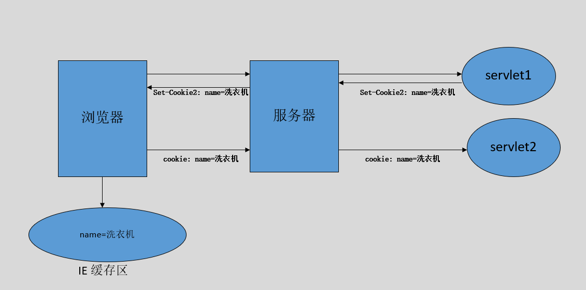
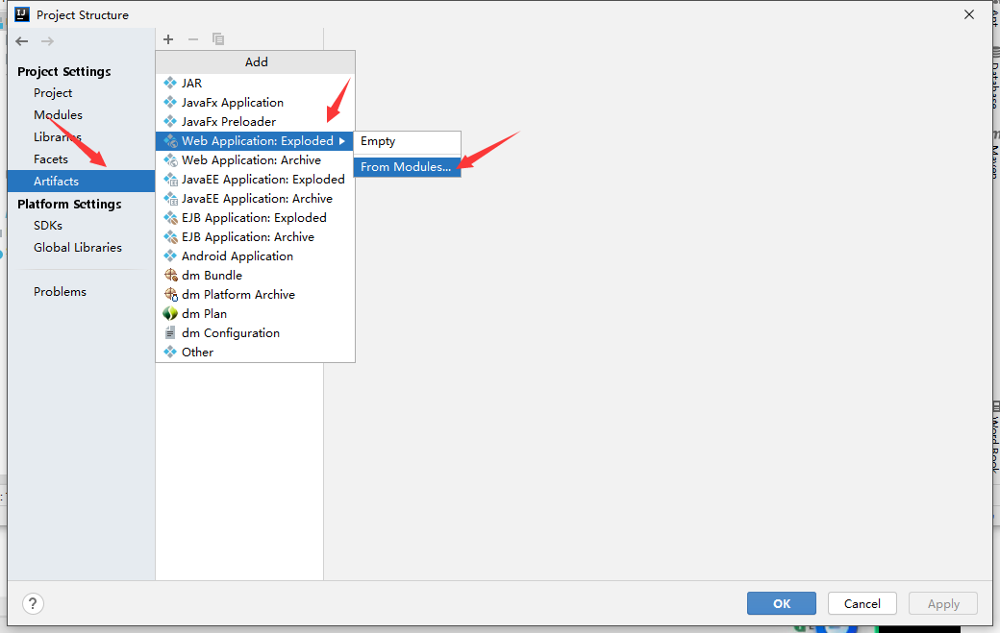
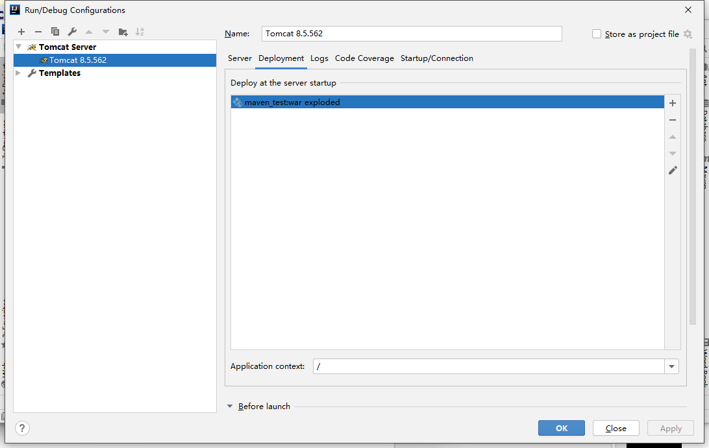
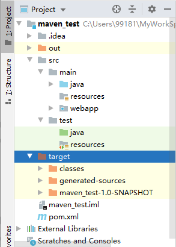

# 八、JavaWeb

## 目录

- [八、JavaWeb](#八javaweb)
  - [目录](#目录)
  - [1. Tomcat](#1-tomcat)
    - [1.1 安装和使用](#11-安装和使用)
    - [1.2 Tomcat 的目录结构](#12-tomcat-的目录结构)
    - [1.3 Tomcat 的组成结构](#13-tomcat-的组成结构)
    - [1.4 虚拟目录映射](#14-虚拟目录映射)
      - [1.4.1 方式一](#141-方式一)
      - [1.4.2 方式二](#142-方式二)
    - [1.5 默认页面和端口](#15-默认页面和端口)
  - [2 Servlet](#2-servlet)
    - [2.1 概述](#21-概述)
    - [2.2 实现第一个 Servlet](#22-实现第一个-servlet)
      - [2.2.1 FirstServlet](#221-firstservlet)
      - [2.2.2 Servlet 执行流程](#222-servlet-执行流程)
    - [2.3 Servlet 接口实现类](#23-servlet-接口实现类)
    - [2.4 IDEA 开发 Servlet](#24-idea-开发-servlet)
    - [2.5 Servlet 的生命周期](#25-servlet-的生命周期)
    - [2.6 url-pattern 细节](#26-url-pattern-细节)
      - [2.6.1 多个映射关系](#261-多个映射关系)
      - [2.6.2 两个特殊的 url-pattern](#262-两个特殊的-url-pattern)
    - [2.7 ServletConfig](#27-servletconfig)
    - [2.8 ServletContext](#28-servletcontext)
      - [2.8.1 全局性初始化参数](#281-全局性初始化参数)
      - [2.8.2 全局性共享数据](#282-全局性共享数据)
      - [2.8.3 获取绝对路径](#283-获取绝对路径)
  - [3 ServletRequest](#3-servletrequest)
    - [3.1 Request 常用方法](#31-request-常用方法)
      - [3.1.1 获取请求行](#311-获取请求行)
      - [3.1.2 获取请求头](#312-获取请求头)
      - [3.1.3 获取请求参数](#313-获取请求参数)
    - [3.2 中文乱码问题](#32-中文乱码问题)
    - [3.3 form 表单路径写法](#33-form-表单路径写法)
    - [3.4 转发和包含](#34-转发和包含)
      - [3.4.1 转发](#341-转发)
      - [3.4.2 包含](#342-包含)
  - [4 ServletResponse](#4-servletresponse)
    - [4.1 输出数据到客户端](#41-输出数据到客户端)
    - [4.2 中文乱码问题](#42-中文乱码问题)
    - [4.4 刷新和重定向](#44-刷新和重定向)
      - [4.4.1 定时刷新](#441-定时刷新)
      - [4.4.2 重定向](#442-重定向)
      - [4.4.3 转发、定时刷新、重定向区别联系](#443-转发定时刷新重定向区别联系)
    - [4.5 下载](#45-下载)
  - [5 FileUpload](#5-fileupload)
    - [5.1 Web 页面添加上传输入项](#51-web-页面添加上传输入项)
    - [5.2 Servlet 读取上传文件](#52-servlet-读取上传文件)
    - [5.3 文件存放位置](#53-文件存放位置)
    - [5.4 文件上传案例](#54-文件上传案例)
    - [5.5 保存数据到 bean](#55-保存数据到-bean)
      - [5.5.1 中规中矩版](#551-中规中矩版)
      - [5.5.2 优化版](#552-优化版)
    - [5.6 文件保存问题](#56-文件保存问题)
      - [5.6.1 文件重名](#561-文件重名)
      - [5.6.2 单个目录文件数过多](#562-单个目录文件数过多)
    - [5.7 保存回显操作](#57-保存回显操作)
  - [6 Cookie](#6-cookie)
    - [6.1 Cookie 概述](#61-cookie-概述)
    - [6.2 Cookie 案例](#62-cookie-案例)
      - [6.2.1 案例 1](#621-案例-1)
      - [6.2.2 案例 2](#622-案例-2)
    - [6.3 Cookie 设置](#63-cookie-设置)
      - [6.4.1 设置 Maxage](#641-设置-maxage)
      - [6.4.2 设置 path](#642-设置-path)
      - [6.4.3 设置 domain](#643-设置-domain)
  - [7 Session](#7-session)
    - [7.1 Session 概述](#71-session-概述)
  - [8 JSP](#8-jsp)
    - [8.1 概述](#81-概述)
    - [8.2 JSP 语法](#82-jsp-语法)
      - [8.2.1 JSP 模板元素](#821-jsp-模板元素)
      - [8.2.2 JSP 表达式](#822-jsp-表达式)
      - [8.2.3 JSP 脚本片断](#823-jsp-脚本片断)
      - [8.2.4 JSP 声明](#824-jsp-声明)
      - [8.2.5 JSP 注释](#825-jsp-注释)
      - [8.2.6 JSP 指令](#826-jsp-指令)
    - [8.3 JSP 九大隐式对象](#83-jsp-九大隐式对象)
      - [8.3.1 out 隐式对象](#831-out-隐式对象)
      - [8.3.2 pageContext 对象](#832-pagecontext-对象)
  - [9 Listener](#9-listener)
    - [9.1 概述](#91-概述)
    - [9.2 编写 Listener](#92-编写-listener)
  - [10 Filter](#10-filter)
    - [10.1 概述](#101-概述)
    - [10.2 工作原理](#102-工作原理)
    - [10.3 创建过滤器](#103-创建过滤器)
    - [10.4 Filter 链](#104-filter-链)
    - [10.5 Filter 生命周期](#105-filter-生命周期)
  - [11 JSON](#11-json)
    - [11.1 概述](#111-概述)
    - [11.2 JSON 和 XML](#112-json-和-xml)
    - [11.3 Java 操作 JSON](#113-java-操作-json)
  - [12 MVC](#12-mvc)
    - [12.1 概述](#121-概述)
    - [12.2 案例](#122-案例)
  - [13 Maven](#13-maven)
    - [13.1 概述](#131-概述)
    - [13.2 安装和配置 Maven](#132-安装和配置-maven)
      - [13.2.1 安装 Maven](#1321-安装-maven)
      - [13.2.2 设置国内镜像](#1322-设置国内镜像)
      - [13.2.3 设置默认 JDK 版本](#1323-设置默认-jdk-版本)
      - [13.2.3 本地仓库](#1323-本地仓库)
    - [13.3 IDEA 开发 Maven 项目](#133-idea-开发-maven-项目)
    - [13.4 认识 Maven](#134-认识-maven)
      - [13.4.1 Maven 目录结构](#1341-maven-目录结构)
      - [13.4.2 Maven 常用命令](#1342-maven-常用命令)
      - [13.4.3 Maven 生命周期](#1343-maven-生命周期)


## 1. Tomcat

### 1.1 安装和使用

第一步：进入 [官网](http://tomcat.apache.org)，选择相应版本，进入其下载界面。  

<div align="center">

</div>

第二步：选择下载方式。  
- Linux 操作系统下载 tar.gz 文件。

- Windows 操作系统建议下载 zip 文件。

<div align="center">

</div>

第三步：把下载的文件解压，解压后的文件放入工作区即可。

使用先需要保证环境变量中存在 `JAVA_HOME`。可以通过命令行下的：`echo %JAVA_HOME%` 检查。

检查是否安装成功：
1. 双击 `bin` 目录下的 `startup.bat` 文件;

2. 在浏览器访问 `http://localhost:8080`，如果安装成功界面会有提示。

3. `shutdown.bat` 关闭服务器。

### 1.2 Tomcat 的目录结构

bin：存放启动和关闭 Tomcat 的脚本文件。

conf：存放 Tomcat 服务器的各种配置文件。
- 推荐：修改 `./conf` -> `server.xml` -> connector -> port="8080" 为 "80"。

lib：存放 Tomcat 服务器的支撑 jar 包。

logs：存放 Tomcat 的日志文件。

temp：存放 Tomcat 运行时产生的临时文件。

webpack：Web 应用所在目录，即供外界访问的 Web 资源的存放目录。

work：Tomcat 的工作目录。


### 1.3 Tomcat 的组成结构

```xml
// ./conf/server.xml
<Server>
    <Service>
        <Connector/>
        <Engine>
            <Host>
                <Context/>
            </Host>
        </Engine>
    </Service>
</Server>
```

Server：代表整个 Servlet 容器的组件，是最顶层元素，可以包含一个或多个 Service 元素。  

Service：包含一个 Engine 元素以及一个或多个 Connector 元素，这些 Connector 元素共享同一个 Engine。

Connector：代表和客户端程序实际交互的组件，负责接受客户请求，以及向客户返回响应。

Engine：每个 Service 元素只能包含一个 Engine 元素，它处理在同一个 Service 中所有 Connector 接收到的客户请求。

Host：在一个 Engine 中可以包含多个 Host，它代表一个虚拟主机，它可以包含一个或者多个 Web 应用。

Context：使用最频繁的元素，代表了运行在虚拟主机上的单个 Web 应用。

### 1.4 虚拟目录映射

#### 1.4.1 方式一

在 `server.xml` 文件的 host 元素中配置 context 元素，例如：
```
<Host name="localhost"  appBase="webapps"
      unpackWARs="true" autoDeploy="true">

      <Context path="/test" docBase="D:\test"></Context>
```
并在 `D:\test` 下新建 `index.html` 文件。  

<div align="center">

</div>

注：在 Tomcat6 中，不再建议在 `server.xml` 文件中配置 context 元素。

#### 1.4.2 方式二

Tomcat 自动映射：Tomcat 服务器会自动管理 webapps 目录下的所有 Web 应用，并把它映射成虚似目录。  
换句话说，Tomcat 服务器 webapps 目录中的 Web 应用，外界可以直接访问。

在 `./conf/Catalina/localhost` 目录下新建一个 xml 文件，文件名为虚拟目录名。  

示例：  
<div align="center">

</div>

即可达到和方式一一样的效果。


### 1.5 默认页面和端口

默认页面：`./conf` -> `web.xml` -> welcome-file-list。

默认端口：`./conf` -> `server.xml` -> connector -> port。

## 2 Servlet

### 2.1 概述

> A servlet is a small Java program that runs within a Web server. Servlets receive and respond to requests from Web clients, usually across HTTP, the HyperText Transfer Protocol. 

Servlet 是 Sun 公司提供的一门用于开发动态 Web 资源的技术。  

Sun 公司在其 API 中提供了一个 Servlet 接口，用户若想开发一个动态 Web 资源（即开发一个 Java 程序向浏览器输出数据），需要完成以下 2 个步骤：
1. 编写一个 Java 类，实现 Servlet 接口；

2. 把开发好的 Java 类部署到 Web 服务器中。

注：按照一种约定俗成的称呼习惯，通常我们也把实现了servlet 接口的 Java 程序，称之为 Servlet。

Servlet 在 Web 应用中的位置：
```
mail
|
|--html、jsp、css、js 文件等
|
|--WEB-INF
    |
    |--classes
    |   |
    |   |--Java 类
    |
    |--lib
    |   |
    |   |--Java 类运行所需要的 jar 包
    |
    |--web.xml
```

mail：Web 应用所在目录

html、jsp、css、js 文件等：这些文件一般存在 Web 应用根目录下，根目录下的文件外界可以直接访问。

WEB-INF：必须直接放在应用下一级目录里。Java 类、jar 包、Web 应用的配置文件存在这个目录下，该目录下的文件外界无法非法直接访问，由 Web 服务器负责调用。

### 2.2 实现第一个 Servlet

#### 2.2.1 FirstServlet

第一步：下载 Tomcat，在 Tomcat 的 `webapps` 文件夹下新建应用文件夹，如 `app1`。  
在 `app1` 文件夹下新建文件夹 `WEB-INF/classes`。

第二步：编译一个 Java 文件，将生成的 class 文件放入 `classes` 文件夹下。如：
```java
import javax.servlet.*;

public class FirstServlet extends GenericServlet {
    public void service(ServletRequest req, ServletResponse res) throws ServletException, java.io.IOException {
        res.getWriter().println("Hello World");
    }
}
```

使用命令行编译时，需要注意类加载机制：
```
javac -classpath xx/xx/xx/apache-tomcat-8.5.56/lib/servlet-api.jar FirstServlet.java
```

第三步：`WEB-INF` 下新建文件 `web.xml`，在 xml 文件中进行配置虚拟路径。如：
```xml
<web-app xmlns="http://xmlns.jcp.org/xml/ns/javaee"
  xmlns:xsi="http://www.w3.org/2001/XMLSchema-instance"
  xsi:schemaLocation="http://xmlns.jcp.org/xml/ns/javaee
                      http://xmlns.jcp.org/xml/ns/javaee/web-app_3_1.xsd"
  version="3.1"
  metadata-complete="true">


    <servlet>
      <servlet-name>hello</servlet-name>
      <servlet-class>FirstServlet</servlet-class>
    </servlet>

    <servlet-mapping>
        <servlet-name>hello</servlet-name>
        <url-pattern>/servlet</url-pattern>
    </servlet-mapping>

</web-app>
```

第四步：启动 Tomcat，在默认端口下后缀 `/app1/servlet` 即可访问 Servlet 应用。  
<div align="center">

</div>

#### 2.2.2 Servlet 执行流程

当访问 `http://localhost/app1/servlet` 时：
1. 地址栏打出该地址，浏览器构建一个请求报文；

2. 传输到目标机器，到达指定端口的 connector，然后 connector 接收到该请求，将请求报文转成 request 对象；

3. connector 同时还会生成一个空的 response 对象，然后将其和 request 对象传给 engine；
 
4. engine 接着选择 host，将这两个对象传给 host；

5. host 选择 `Context（/app1）`，将这两个对象传给 Context；

6. Context 在当前应用下去寻找 `/servlet`，如果找到，则往 response 对象里面写入对应的数据；

7. 这两个对象依次返回，给 connector；

8. connector 读取 response 对象里面的数据，然后生成一个响应报文，发送出去。

### 2.3 Servlet 接口实现类

Servlet 接口定义了两个默认实现类：GenericServlet、HttpServlet。

HttpServlet 指能够处理 HTTP 请求的 Servlet，它在原有 Servlet 接口上添加了一些与 HTTP 协议处理方法，它比 Servlet 接口的功能更为强大。  
因此，开发人员在编写 Servlet 时，通常应继承这个类，而避免直接去实现 Servlet 接口。

HttpServlet 在实现 Servlet 接口时，覆写了 service 方法，该方法体内的代码会自动判断用户的请求方式，如为 GET 请求，则调用 HttpServlet 的 doGet 方法，如为 Post 请求，则调用 doPost 方法。  
因此，开发人员在编写 Servlet 时，通常只需要覆写 doGet 或 doPost 方法，而不要去覆写 service 方法。

### 2.4 IDEA 开发 Servlet

第一步：创建 Project 和 Module。  
<div align="center">
</br>

</div>

第二步：创建 Web 应用。  

<div align="center">
</br>
</br>

</div>

第三步：Debug，然后就可以在浏览器访问。  
<div align="center">
</br>

</div>


### 2.5 Servlet 的生命周期

Servlet 是一个供其他 Java 程序（Servlet 引擎）调用的 Java 类，它不能独立运行，它的运行完全由 Servlet 引擎来控制和调度。

针对客户端的多次 Servlet 请求，通常情况下，服务器只会创建一个 Servlet 实例对象，也就是说 Servlet 实例对象一旦创建，它就会驻留在内存中，为后续的其它请求服务，直至 Web 容器退出（或应用停止），Servlet 实例对象才会销毁。

在 Servlet 的整个生命周期内，Servlet 的 init 方法只被调用一次。而对一个 Servlet 的每次访问请求都导致 Servlet 引擎调用一次 Servlet 的 service 方法。对于每次访问请求，Servlet 引擎都会创建一个新的 HttpServletRequest 请求对象和一个新的 HttpServletResponse 响应对象，然后将这两个对象作为参数传递给它调用的 Servlet 的 service() 方法，service 方法再根据请求方式分别调用 doXXX 方法。 

注：默认情况下，init 会在第一次调用该 Servlet 的时候执行，但是也可以通过添加相应的参数（设置 load-on-startup 为非负数），使其在应用被加载的时候执行。


### 2.6 url-pattern 细节

#### 2.6.1 多个映射关系

同一个 Servlet 可以被映射到多个 URL 上，即多个 `<servlet-mapping>` 元素的 `<servlet-name>` 子元素的设置值可以是同一个 Servlet 的注册名。  

在 Servlet 映射到的 URL 中也可以使用 `*` 通配符，但是只能有两种固定的格式：
- 一种格式是 `*.扩展名`。

- 一种格式是以正斜杠 `/` 开头并以 `/*` 结尾。

优先级：
- `/*` 的优先级要高于 `*.do`。

- 以 `/` 开头的优先级要高于 `*.后缀` 的优先级。

- 如果多个 `/` 开头的 url-pattern 同时满足，那么匹配的程度越高，越优先执行谁。

如以下的映射关系：  
Servlet1 映射到 `/abc/*`；   
Servlet2 映射到 `/*`；   
Servlet3 映射到 `/abc`；   
Servlet4 映射到 `*.do`。   

则：
- 当请求 URL 为 `/abc/a.html`，`/abc/*` 和`/*` 都匹配，Servlet 引擎将调用 Servlet1。

- 当请求 URL 为 `/abc` 时，`/abc` 和 `/*` 都匹配，Servlet 引擎将调用 Servlet3。

- 当请求 URL 为 `/abc/a.do` 时，`/abc/*` 和 `*.do` 和 `/*` 都匹配，Servlet 引擎将调用 Servlet1。

- 当请求 URL 为 `/a.do` 时，`/*` 和 `*.do` 都匹配，Servlet 引擎将调用 Servlet2。

- 当请求 URL 为 `/xxx/yyy/a.do` 时，`/*` 和 `*.do` 都匹配，Servlet 引擎将调用 Servlet2。

#### 2.6.2 两个特殊的 url-pattern

如果某个 Servlet 的映射路径仅仅为一个正斜杠 `/`，那么这个 Servlet 就成为当前 Web 应用程序的缺省 Servlet。  
凡是在 `web.xml` 文件中找不到匹配的 `<servlet-mapping>` 元素的 URL，它们的访问请求都将交给缺省 Servlet 处理。也就是说，缺省 Servlet 用于处理所有其他 Servlet 都不处理的访问请求。 

在 `tomcat/conf/web.xml` 文件中，注册了一个名称为 `org.apache.catalina.servlets.DefaultServlet` 的 Servlet，并将这个 Servlet 设置为了缺省 Servlet。  
当访问 Tomcat 服务器中的某个静态 HTML 文件和图片时，实际上是在访问这个缺省 Servlet。 

### 2.7 ServletConfig

在 Servlet 的配置文件中，可以使用一个或多个 `<init-param>` 标签为某个 Servlet 配置一些初始化参数。

当 Servlet 配置了初始化参数后，Web 容器在创建 Servlet 实例对象时，会自动将这些初始化参数封装到 ServletConfig 对象中，并在调用 `Servlet` 的 init 方法时，将 ServletConfig 对象传递给 Servlet。进而，通过 ServletConfig 对象就可以得到当前 Servlet 的初始化参数信息。

示例：
```xml
<servlet>
  <servlet-name>config</servlet-name>
  <servlet-class>com.gyh.test</servlet-class>
  <init-param>
    <param-name>name</param-name>
    <param-value>zhang3</param-value>
  </init-param>
</servlet>
```
```java
ServletConfig servletConfig = getServletConfig();
String name = servletConfig.getInitParameter("name");
System.out.printf(name);

// 即可打印 name 的 value
```

### 2.8 ServletContext

#### 2.8.1 全局性初始化参数

示例：
```xml
<context-param>
  <param-name>key</param-name>
  <param-value>utf-8</param-value>
</context-param>
```
```java
String key = getServletContext().getInitParameter("key");
System.out.println(key);
```

#### 2.8.2 全局性共享数据


Context 类下的三个数据操作：
- `setAttribute(key,value)`。

- `getAttribute(key)`。

- `removeAttribute(key)`。

示例：记录网站历史访问次数。  
```java
ServletContext servletContext = getServletContext();
synchronized (servletContext){
    Integer count = (Integer) servletContext.getAttribute("count");
    if(count == null){
        count = 0;
    }
    servletContext.setAttribute("count", ++count);
}
response.getWriter().println("history total count: " + servletContext.getAttribute("count"));
```

#### 2.8.3 获取绝对路径

Context 关于路径的两个操作：
- `getRealpath(String path)`：获取绝对路径。  
  path 为文件和部署根目录的相对路径关系。  

  注：该方法也可以获取 `WEB-INF` 目录下的文件。


## 3 ServletRequest

Web 服务器收到客户端的 http 请求，会针对每一次请求，分别创建一个用于代表请求的 Request 对象、和代表响应的 Response 对象。   
- Request：获取客户机（浏览器）提交过来的数据。

- Response：向浏览器（客户端）输出数据。

### 3.1 Request 常用方法

HttpServletRequest 对象代表客户端的请求，当客户端通过 HTTP 协议访问 http 服务器时，HTTP 请求头（正文）中的所有信息都封装在这个对象中，开发人员通过这个对象的方法，可以获得客户这些信息。

#### 3.1.1 获取请求行

`getMethod`：请求方法。

`getRequestURL`：URL。

`getRequestURI`：资源名。

`getProtoco`：协议 / 版本。

#### 3.1.2 获取请求头

`getRemoteAddr`：方法返回发出请求的客户机的 IP 地址。

`getRemoteHost`：方法返回发出请求的客户机的完整主机名。

`getRemotePort`：方法返回客户机所使用的网络端口号。

`getLocalAddr`：方法返回 WEB 服务器的 IP 地址。

`getLocalName`：方法返回 WEB 服务器的主机名。

#### 3.1.3 获取请求参数

`getParameter(name)`。

`getParameterValues(String name)`。

`getParameterNames`。

`getParameterMap()`。

示例：获取 form 表单参数。  
form 表单：
```xml
<form action="/app/submit" method="post">
    用户名：<input type="text" name="username"><br>
    密码：<input type="password" name="password"><br>
    性别：男<input type="radio" name="gender" value="male">
          女<input type="radio" name="gender" value="female"><br>
    爱好：java<input type="checkbox" name="hobby" value="java">
          c++<input type="checkbox" name="hobby" value="c++">
          python<input type="checkbox" name="hobby" value="python"><br>
    简介<textarea name="description"></textarea><br>
    <input type="submit">
</form>
```
获取方式一：
```java
protected void doPost(HttpServletRequest request, HttpServletResponse response) throws ServletException, IOException {
    String username = request.getParameter("username");
    String password = request.getParameter("password");
    String gender = request.getParameter("gender");
    String[] hobbies = request.getParameterValues("hobby");
    String description = request.getParameter("description");

    // ...
}
```
获取方式二：
```java
protected void doPost(HttpServletRequest request, HttpServletResponse response) throws ServletException, IOException {
    Enumeration<String> parameterNames = request.getParameterNames();
    while (parameterNames.hasMoreElements()){
        String name = parameterNames.nextElement();
        String[] values = request.getParameterValues(name);
        if(values.length == 1){
            System.out.println(name + " = " + values[0]);
        }else if(values.length > 1){
            System.out.println(name + " = " + Arrays.toString(values));
        }
    }
}
```
获取方式三：
```java
// 将参数信息封装到对象
protected void doPost(HttpServletRequest request, HttpServletResponse response) throws ServletException, IOException {
    request.setCharacterEncoding("utf-8");
    Map<String, String[]> parameterMap = request.getParameterMap();

    User user = new User();
    try {
        BeanUtils.populate(user, parameterMap);
    } catch (IllegalAccessException | InvocationTargetException e) {
        e.printStackTrace();
    }
    System.out.println(user);
}
```

### 3.2 中文乱码问题

中文乱码仅针对请求体，因此对 get 方法没有效果。

对于 post 方法，需要添加一行：
```java
request.setCharacterEncoding("utf-8");
```

### 3.3 form 表单路径写法

三种写法：
1. 全路径。示例：`http://localhost:8080/app/submit`。

2. 相对路径：提交的地址相对于当前页面的相对路径。  
   示例：当前页面路径：`http://localhost:8080/app/form.html`，需要提交的路径 `http://localhost:8080/app/submit`。则相对路径就是 `submit`。

3. `/应用名/资源名` 路径写法。比如上例，可以写为 `/app/submit`。

推荐第三种路径写法。

### 3.4 转发和包含

一个 Servlet 对象无法获得另一个 Servelt 对象的引用；如果需要多个 Servet 组件共同协作（数据传递），只能使用 Servelt 规范为我们提供的两种方式：
- 请求转发：Servlet（源组件）先对客户请求做一些预处理操作，然后把请求转发给其他 Web 组件（目标组件）来完成包括生成响应结果在内的后续操作。

- 包含：Servelt（源组件）把其他 Web 组件（目标组件）生成的响应结果包含到自身的响应结果中。

转发和包含的共同点：
- 源组件和目标组件处理的都是同一个客户请求，源组件和目标组件共享同一个 ServeltRequest 和 ServletResponse 对象。

- 目标组件都可以为 Servlet、JSP 或 HTML 文档。

- 都依赖 javax.servlet.RequestDispatcher 接口。

Request 对象提供了一个 `getRequestDispatcher(String path)` 方法，该方法返回一个 requestDispatcher 对象，这个对象表示请求分发器，它有两个方法：
- `forward()`：把请求转发给目标组件。

- `include()`：包含目标组件的响应结果。

得到 RequestDispatcher 对象：
- ServletContext 对象的 `getRequestDispather(String path1)`。  
  path1 必须即以 `/` 开头，若用相对路径会抛出异常 IllegalArgumentException。

- ServletRequest 对象的 `getRequestDispatcher(String path2)`。  
  path2 可以用绝对路径也可以用相对路径

注：以 `/` 开头的路径写法，如果执行主体是服务器，那么就可以省略 `/`。

#### 3.4.1 转发

`forward(request, response)` 的处理流程：
1. 清空用于存放响应正文数据的缓冲区。

2. 如果目标组件为 Servlet 或 JSP，Tomcat 就调用它们，把它们产生的响应结果发送到客户端；  
   如果目标组件为文件系统中的静态 HTML 文档，Tomcat 就读取文档中的数据并把它发送给客户端。

特点：
1. 由于 `forward()` 方法先清空用于存放响应正文数据的缓冲区，因此源组件生成的响应结果（无论转发前后）不会被发送到客户端，只有目标组件生成的响应结果才会被送到客户端。

2. 如果源组件在进行请求转发之前，已经提交了响应结果（如调用了 response 的 flush 或 close 方法），那么 `forward()` 方法会抛出 IllegalStateException。为了避免该异常，不应该在源组件中提交响应结果。

#### 3.4.2 包含

`include(request, response)` 方法的处理流程：如果目标组件为 Servlet 或 JSP，就执行它们，并把它们产生的响应正文添加到源组件的响应结果中；如果目标组件为 HTML 文档，就直接把文档的内容添加到源组件的响应结果中。

特点：
1. 源组件与被包含的目标组件的输出数据都会被添加到响应结果中。

2. 在目标组件中对响应状态代码或者响应头所做的修改都会被忽略。


Request 对象同时也是一个域对象，开发人员通过 Request 对象在实现转发时，把数据通过 Request 对象带给其它 Web 资源处理。
- `setAttribute`。 

- `getAttribute`。  

- `removeAttribute`。

- `getAttributeNames`。

使用场景：
- 转发一般用在 Servlet 和页面之间。

- 包含一般用在页面和页面之间。

## 4 ServletResponse

HttpServletResponse 对象代表服务器的响应。这个对象中封装了向客户端发送数据、发送响应头，发送响应状态码的方法。

### 4.1 输出数据到客户端

`Response.getWriter().println()`。

### 4.2 中文乱码问题

第一步：设置服务器构建响应报文的字符。  
添加一行：
```java
response.setCharacterEncoding("utf-8");
```

第二步：设置客户端处理方式。
- 方式一：通过 meta 标签模拟请求头。  
  ```java
  out.write("<meta charset=utf-8' />".getBytes());
  ```

- 方式二：发送 content-type 相应头，告知浏览器使用哪种编码方式。  
  ```java
  response.setContentType("text/html;charset=UTF-8");
  ```

或者两步合一，直接设置：
```java
response.setHeader("Content-type", "text/html;charset=UTF-8");
````

### 4.3 输出字节数据

`getOutputStream()` 和 `getWriter()` 方法分别用于得到输出二进制数据、输出文本数据的 ServletOuputStream、Printwriter 对象。

`getOutputStream()` 和 `getWriter()` 这两个方法互相排斥，调用了其中的任何一个方法后，就不能再调用另一方法，否则会抛出异常。

Servlet 程序向 ServletOutputStream 或 PrintWriter 对象中写入的数据将被 Servlet 引擎从 response 里面获取，Servlet 引擎将这些数据当作响应消息的正文，然后再与响应状态行和各响应头组合后输出到客户端。 

Serlvet 的 service 方法结束后，Servlet 引擎将检查 getWriter 或 getOutputStream 方法返回的输出流对象是否已经调用过 close 方法，如果没有，Servlet 引擎将调用 close 方法关闭该输出流对象。 


示例：
```java
protected void doGet(HttpServletRequest request, HttpServletResponse response) throws ServletException, IOException {
    ServletOutputStream outputStream = response.getOutputStream();
    String path = getServletContext().getRealPath("1.jpg");
    FileInputStream fileInputStream = new FileInputStream(new File(path));
    int length = 0;
    byte[] bytes = new byte[1024];
    while ((length = fileInputStream.read(bytes)) != -1){
        outputStream.write(bytes, 0, length);
    }

    // request 提供的输入流以及 response 提供的输出流不关的话，tomcat 会在响应结束时给关闭
    fileInputStream.close();
}
```


### 4.4 刷新和重定向

#### 4.4.1 定时刷新

refresh 响应头设置定时刷新。  

方式一：每隔指定秒数刷新一下当前页面。  
  ```java
  response.getWriter().println(new Date());
  response.setHeader("refresh","2");
  ```

方式二：后面会带着一个 url，表示经过指定秒数之后，跳转至 url。
```java
response.setHeader("refresh","2;url=stream");

/*
/应用名/资源名路径写法：
response.setHeader("refresh","2;url=" + request.getContextPath() + "/stream");

也可以跳转至外部：
response.setHeader("refresh","2;url=http://www.baidu.com");
*/
}
```

#### 4.4.2 重定向

重定向机制的运作流程：
1. 用户在浏览器端输入特定 URL，请求访问服务器端的某个组件。

2. 服务器端的组件返回一个状态码为 302 的响应结果。

3. 当浏览器端接收到这种响应结果后，再立即自动请求访问另一个 Web 组件。

4. 浏览器端接收到来自另一个 Web 组件的响应结果。

HttpServeltResponse 的 `sendRedirect(String location)` 用于重定向。

示例：
```java
protected void doGet(HttpServletRequest request, HttpServletResponse response) throws ServletException, IOException {
    response.setStatus(302);
    response.setHeader("Location", request.getContextPath() + "/stream");
}
```
或者利用服务器提供的 api：
```java
protected void doGet(HttpServletRequest request, HttpServletResponse response) throws ServletException, IOException {
    response.sendRedirect(request.getContextPath() + "/stream");
}
```

特点：
- Servlet 源组件生成的响应结果不会被发送到客户端。  
  `response.sendRedirect(String location)` 方法一律返回状态码为 302 的响应结果。

- 如果源组件在进行重定向之前，已经提交了响应结果，会抛出 IllegalStateException。为了避免异常，不应该在源组件中提交响应结果。  
  ```
  Cannot call sendRedirect() after the response has been committed
  ```

- 在 Servlet 源组件重定向语句后面的代码也会执行。

- 源组件和目标组件不共享同一个 ServletRequest 对象。

- 对于 `sendRedirect(String location)` 方法的参数，如果以 `/` 开头，表示相对于当前服务器根路径的 URL（不是当前应用的根目录）。以 `http://` 开头，表示一个完整路径。

- 目标组件不必是同一服务器上的同一个 Web 应用的组件，它可以是任意一个有效网页。


#### 4.4.3 转发、定时刷新、重定向区别联系

共同点：都可以用来进行页面跳转。

不同点：
- 转发只有一次请求；  
  刷新和重定向发起两次请求。

- 转发是 request 介导的；  
  刷新和重定向是 response 介导的。

- 转发可以共享 request 域；   
  刷新和重定向不可以。

- 转发只能应用内跳转；    
  刷新和重定向没有限制。

- 转发是服务器介导；  
  刷新和重定向是浏览器介导（`/` 开头路径写法不同）。

- 重定向状态码 302、307；  
  其他是 200。

### 4.5 下载

对于浏览器来说，浏览器可以打开的文件，默认会执行打开操作，对于无法打开的文件，默认会执行下载操作。  
但是，对于那些可以打开的文件，也可以设置一个响应头，直接让文件下载下来。  

示例：
```java
protected void doGet(HttpServletRequest request, HttpServletResponse response) throws ServletException, IOException {
    ServletOutputStream outputStream = response.getOutputStream();
    String path = getServletContext().getRealPath("1.jpg");
    FileInputStream fileInputStream = new FileInputStream(new File(path));
    int length = 0;
    byte[] bytes = new byte[1024];
    while ((length = fileInputStream.read(bytes)) != -1){
        outputStream.write(bytes, 0, length);
    }

    fileInputStream.close();

}
```

## 5 FileUpload

实现 Web 开发中的文件上传功能，需两步操作：
1. 在 Web 页面中添加上传输入项；

2. 在 Servlet 中读取上传文件的数据，并保存到服务器硬盘中。

### 5.1 Web 页面添加上传输入项

`<input type="file">` 标签用于在 Web 页面中添加文件上传输入项，设置文件上传输入项时须注意：
- 必须要设置 input 输入项的 name 属性，否则浏览器将不会发送上传文件的数据。

- 必须把 form 的 enctype 属值设为 `multipart/form-data`。设置该值后，浏览器在上传文件时，将把文件数据附带在 HTTP 请求消息体中，并使用 MIME 协议对上传的文件进行描述，以方便接收方对上传数据进行解析和处理。

- 表单的提交方式要是 `post`。

### 5.2 Servlet 读取上传文件

Request 对象提供了一个 `getInputStream` 方法，通过这个方法可以读取到客户端提交过来的数据。但由于用户可能会同时上传多个文件，在 Servlet 端编程直接读取上传数据，并分别解析出相应的文件数据是一项非常麻烦的工作。  

为方便用户处理文件上传数据，Apache 开源组织提供了一个用来处理表单文件上传的一个开源组件 `Commons-fileupload`，该组件性能优异，并且其 API 使用极其简单，可以让开发人员轻松实现 Web 文件上传功能。

使用 `Commons-fileupload` 组件实现文件上传，需要导入该组件相应的支撑 jar 包：`Commons-fileupload` 和 `commons-io`。  
`commons-io` 不属于文件上传组件的开发 jar 文件，但 `Commons-fileupload` 组件从 1.1 版本开始，它工作时需要 `commons-io` 包的支持。

### 5.3 文件存放位置

为保证服务器安全，上传文件应保存在应用程序的 `WEB-INF` 目录下，或者不受 Web 服务器管理的目录。  

为防止多用户上传相同文件名的文件，而导致文件覆盖的情况发生，文件上传程序应保证上传文件具有唯一文件名。  

为防止单个目录下文件过多，影响文件读写速度，处理上传文件的程序应根据可能的文件上传总量，选择合适的目录结构生成算法，将上传文件分散存储。

### 5.4 文件上传案例

实现步骤：
1. 创建 DiskFileItemFactory 对象，设置缓冲区大小和临时文件目录。

2. 使用 DiskFileItemFactory 对象创建 ServletFileUpload 对象，并设置上传文件的大小限制。

3. 调用 `ServletFileUpload.parseRequest` 方法解析 request 对象，得到一个保存了所有上传内容的 List 对象。

4. 对 list 进行迭代，每迭代一个 FileItem 对象，调用其 isFormField 方法判断是否是上传文件。
   - True 为普通表单字段，则调用 getFieldName、getString 方法得到字段名和字段值。
   
   - False 为上传文件，则调用 getInputStream 方法得到数据输入流，从而读取上传数据。

5. 编码实现文件上传。

```java
protected void doPost(HttpServletRequest request, HttpServletResponse response) throws ServletException, IOException {
    // 避免中文乱码
    response.setContentType("text/html;charset=utf-8");

    // 判断是否存在上传文件
    boolean result = ServletFileUpload.isMultipartContent(request);
    if(!result){
        response.getWriter().println("不包含上传的文件");
        return;
    }

    // 创建 DiskFileItemFactory 对象
    DiskFileItemFactory factory = new DiskFileItemFactory();
    ServletContext servletContext = getServletContext();
    File repository = (File) servletContext.getAttribute("javax.servlet.context.tempdir");
    
    // 指定临时文件目录
    factory.setRepository(repository);  

    // Create a new file upload handler
    ServletFileUpload upload = new ServletFileUpload(factory);
    
    // 避免上传的文件名中文乱码
    upload.setHeaderEncoding("utf-8");

    // 设置上传文件总量的最大值
    upload.setFileSizeMax(1024);

    try {
        // 解析 request 对象，并把表单中的每一个输入项包装成一个 fileItem 对象，并返回一个保存了所有FileItem 的 list 集合。 
        List<FileItem> items = upload.parseRequest(request);

        // 对 items 进行迭代
        Iterator<FileItem> iterator = items.iterator();
        while (iterator.hasNext()){
            // 每一个 item 其实就是一个 input 框的封装
            FileItem item = iterator.next();
            if(item.isFormField()){
                // 当前是普通的 form 表单数据
                processFormField(item);
            }else{
                // 当前是上传的文件
                processUploadedFile(item);
            }
        }
    } catch (FileUploadException e) {
        e.printStackTrace();
    }
}

/**
  * 处理上传的文件
  * @param item
  */
private void processUploadedFile(FileItem item) {
    String fieldName = item.getFieldName();
    String fileName = item.getName(); // 文件名
    System.out.println(fieldName + " === " + fileName);
    String realPath = getServletContext().getRealPath("upload/" + fileName);
    File file = new File(realPath);
    if(!file.getParentFile().exists()){
        file.getParentFile().mkdirs();
    }
    try {
        // 保存文件到硬盘中
        item.write(file);
    } catch (Exception e) {
        e.printStackTrace();
    }
}

/**
  * 处理普通的 form 表单数据
  * 只需要获取 name 和 value 值即可
  * 上传文件之后，不要再用 getParameter 去获取请求参数了
  * @param item
  */
private void processFormField(FileItem item) {
    String name = item.getFieldName();
    String value = null;
    try {
        // 避免中文乱码
        value = item.getString("utf-8");
    } catch (UnsupportedEncodingException e) {
        e.printStackTrace();
    }
    System.out.println(name + " = " + value);
}
```

### 5.5 保存数据到 bean

以操作 form 表单为例：
```html
<form action="/upload3" enctype="multipart/form-data" method="post">
    <input type="text" name="username"><br>
    <input type="password" name="password"><br>
    <input type="file" name="image"><br>
    <input type="submit">
</form>
```

#### 5.5.1 中规中矩版

只需要在 `processUploadedFile` 方法和 `processFormField` 方法中添加 user 对象。  

```java
/**
  * 处理上传的文件
  * @param item
  * @param user
  */
private void processUploadedFile(FileItem item, User user) {
    String fieldName = item.getFieldName();
    String fileName = item.getName();
    System.out.println(fieldName + " === " + fileName);
    String UPLOAD_BASE = "upload/";
    UPLOAD_BASE = UPLOAD_BASE + fileName;
    String realPath = getServletContext().getRealPath(UPLOAD_BASE);
    File file = new File(realPath);
    if(!file.getParentFile().exists()){
        file.getParentFile().mkdirs();
    }
    try {
        // 保存文件到硬盘中
        item.write(file);

        // img src='/应用名/资源名'
        user.setImage(UPLOAD_BASE);
    } catch (Exception e) {
        e.printStackTrace();
    }
}

/**
  * 处理普通的 form 表单数据
  * 只需要获取 name 和 value 值即可
  * 上传文件之后，不要再用 getParameter 去获取请求参数了
  * @param item
  * @param user
  */
private void processFormField(FileItem item, User user) {
    String name = item.getFieldName();
    String value = null;
    try {
        value = item.getString("utf-8");
        if("username".equals(name)){
            user.setUsername(value);
        }else if("password".equals(name)){
            user.setPassword(value);
        }
    } catch (UnsupportedEncodingException e) {
        e.printStackTrace();
    }
    System.out.println(name + " = " + value);
}
```

#### 5.5.2 优化版

```java
protected void doPost(HttpServletRequest request, HttpServletResponse response) throws ServletException, IOException {
    response.setContentType("text/html;charset=utf-8");

    boolean result = ServletFileUpload.isMultipartContent(request);
    if(!result){
        response.getWriter().println("不包含上传的文件");
        return;
    }

    DiskFileItemFactory factory = new DiskFileItemFactory();
    ServletContext servletContext = getServletContext();
    File repository = (File) servletContext.getAttribute("javax.servlet.context.tempdir");
    factory.setRepository(repository);

    // Create a new file upload handler
    ServletFileUpload upload = new ServletFileUpload(factory);

    Map map = new HashMap();
    try {
        List<FileItem> items = upload.parseRequest(request);
        // 对 items 进行迭代
        Iterator<FileItem> iterator = items.iterator();
        while (iterator.hasNext()){
            //每一个 item 其实就是一个 input 框的封装
            FileItem item = iterator.next();
            if(item.isFormField()){
                // 当前是普通的 form 表单数据
                processFormField(item, map);
            }else{
                // 当前是上传的文件
                processUploadedFile(item, map);
            }
        }

    } catch (FileUploadException e) {
        e.printStackTrace();
    }
    //JDBC  user
    System.out.println(map);
    // 有一个 map，然后需要将数据封装到对象中
    User user = new User();
    try {
        BeanUtils.populate(user, map);
    } catch (IllegalAccessException e) {
        e.printStackTrace();
    } catch (InvocationTargetException e) {
        e.printStackTrace();
    }
    System.out.println(user);
}

/**
  * 处理上传的文件
  * @param item
  * @param map
  */
private void processUploadedFile(FileItem item, Map map) {
    String fieldName = item.getFieldName();
    String fileName = item.getName();
    // 将这个 fileName 变成唯一的一个
    fileName =  UUID.randomUUID().toString() + "-" + fileName;

    System.out.println(fieldName + " === " + fileName);
    String UPLOAD_BASE = "upload/";
    UPLOAD_BASE = UPLOAD_BASE + fileName;
    String realPath = getServletContext().getRealPath(UPLOAD_BASE);
    File file = new File(realPath);
    if(!file.getParentFile().exists()){
        file.getParentFile().mkdirs();
    }
    try {
        // 保存文件到硬盘中
        item.write(file);

        // img src='/应用名/资源名'
        map.put(fieldName, UPLOAD_BASE);
    } catch (Exception e) {
        e.printStackTrace();
    }
}

/**
  * 处理普通的 form 表单数据
  * 只需要获取 name 和 value 值即可
  * 上传文件之后，不要再用getParameter去获取请求参数了
  * @param item
  * @param map
  */
private void processFormField(FileItem item, Map map) {
    String name = item.getFieldName();
    String value = null;
    try {
        value = item.getString("utf-8");
        // 如果传入进来的是checkbox，那么下面需要变更一下
        map.put(name, value);
    } catch (UnsupportedEncodingException e) {
        e.printStackTrace();
    }
    System.out.println(name + " = " + value);
}
```

### 5.6 文件保存问题

#### 5.6.1 文件重名

添加时间戳：
```java
fileName =  UUID.randomUUID().toString() + "-" + fileName;
```

#### 5.6.2 单个目录文件数过多

利用 Hash 散列开。  

Filename 取哈希值，转化为 16 进制数字，生成多重文件夹（形如：`1/4 /a/ 5/ f/ 7/ 8/ f`）。

### 5.7 保存回显操作

保存：注册（上传头像），封装到 bean 中，将 bean 中的数据取出来，通过 JDBC 保存到数据库。

回显：到数据库里面去查询这条数据，然后封装到 bean 中，接下来，将它在页面显示出来。

注册成功之后，封装到 bean，不去保存到数据库，而是通过转发交给另外一个 servlet，该 servlet 在页面将之前选择的数据进行回显。

JDBC：
```java
// Class.forName(com.mysql.jdbc.Driver)
Connection conn = DriverManager.getConnection(url,user,password);
PreparedStatement psmt = Conn.preparedStatement();
ResultSet rs = Psmt.executeQuery();
While(rs.next){
    Rs.getString(columnName);
    Rs.getInt(columnName);
    New User;
    User.setxxx
}
```

## 6 Cookie

每个用户在使用浏览器与服务器进行会话的过程中，不可避免各自会产生一些数据，程序要想办法为每个用户保存这些数据。

### 6.1 Cookie 概述

Cookie 是客户端技术，服务器程序把每个用户的数据以 Cookie 的形式写给用户各自的浏览器。当用户使用浏览器再去访问服务器中的 Web 资源时，就会带着各自的数据去访问。这样，Web 服务器就能通过 Cookie 去识别用户了。Web 资源处理的就是用户各自的数据了。

Cookie 示例：  
<div align="center">

</div>

javax.servlet.http.Cookie 类用于创建一个 Cookie，response 接口中定义了一个 `addCookie` 方法，它用于在其响应头中增加一个相应的 Set-Cookie 头字段。 同样，request 接口中也定义了一个 `getCookies` 方法，它用于获取客户端提交的 Cookie。  

Cookie 细节：
1. Cookie 的 name 和 value 值均是字符串类型；

2. Cookie 只能存储少量的数据，一般不超过 4k；

3. 不同浏览器之间不可以共享 Cookie。

Cookie 类常用方法： 
- `public Cookie(String name,String value)`

- `setValue`

- `getValue`

- `setMaxAge`

- `getMaxAge`

- `getName`

### 6.2 Cookie 案例

#### 6.2.1 案例 1

用两个浏览器模拟两个用户。直接在浏览器的窗口将登录的用户名打印出来。

login.html：
```html
<!DOCTYPE html>
<html lang="en">
<head>
    <meta charset="UTF-8">
    <title>Title</title>
</head>
<body>
<form action="/app/login" method="post">
    <input type="text" name="username"><br>
    <input type="password" name="password"><br>
    <input type="submit">
</form>
</body>
</html>
```

Servlet1：
```java
@WebServlet("/login")
public class Servlet1 extends HttpServlet {
    protected void doPost(HttpServletRequest request, HttpServletResponse response) throws ServletException, IOException {
        response.setContentType("text/html;charset=utf-8");

        String username = request.getParameter("username");
        Cookie cookie = new Cookie("username", username);
        response.addCookie(cookie);
        response.getWriter().println("登录成功，即将跳转至个人主页");
        response.setHeader("refresh","2;url=" + request.getContextPath() + "/info");
    }

    protected void doGet(HttpServletRequest request, HttpServletResponse response) throws ServletException, IOException {
    }
}
```

Servlet2：
```java
@WebServlet("/info")
public class Servlet2 extends HttpServlet {
    protected void doPost(HttpServletRequest request, HttpServletResponse response) throws ServletException, IOException {

    }

    protected void doGet(HttpServletRequest request, HttpServletResponse response) throws ServletException, IOException {
        // 从请求头中拿到 cookie
        // 没有必要用 getHeader 去一点一点解析，因为 request 已经帮助封装
        response.setContentType("text/html;charset=utf-8");

        Cookie[] cookies = request.getCookies();
        if(cookies != null){
            for (Cookie cookie : cookies) {
                if("username".equals(cookie.getName())){
                    response.getWriter().println("欢迎您，" + cookie.getValue());
                }
            }
        }
    }
}
```

#### 6.2.2 案例 2

打印出上次访问该页面的时间。
```java
protected void doGet(HttpServletRequest request, HttpServletResponse response) throws ServletException, IOException {
    Cookie[] cookies = request.getCookies();
    if(cookies != null){
        for (Cookie cookie : cookies) {
            if("lastLogin".equals(cookie.getName())){
                String value = cookie.getValue();
                Date date = new Date(Long.parseLong(value));
                response.getWriter().println("last login: " + date);
            }
        }
    }
    Cookie cookie = new Cookie("lastLogin", System.currentTimeMillis() + "");
    response.addCookie(cookie);
}
```

注：Cookie 对象的 value 值中不能有空格。

### 6.3 Cookie 设置

#### 6.4.1 设置 Maxage

如果创建了一个 Cookie，并将它发送到浏览器，默认情况下它是一个会话级别的 Cookie（即存储在浏览器的内存中），用户退出浏览器之后即被删除。  
若希望浏览器将该 Cookie 存储在磁盘上，则需要使用 maxAge，并给出一个以秒为单位的时间。  
将最大时效设为 0 则是命令浏览器删除该 Cookie。

示例：
```java
// 保留两分钟
cookie.setMaxAge(60 * 2);
```

#### 6.4.2 设置 path

默认情况下，如果没有设置 path 的话，则当访问当前域名下任意资源时，均会带上该 Cookie，如果想仅部分路径携带 Cookie，则可以通过设置 path 来实现。

示例：
```java
@WebServlet("/path1")
public class Servlet5 extends HttpServlet {
    protected void doPost(HttpServletRequest request, HttpServletResponse response) throws ServletException, IOException {

    }

    protected void doGet(HttpServletRequest request, HttpServletResponse response) throws ServletException, IOException {
        Cookie cookie = new Cookie("name","path");
        cookie.setPath(request.getContextPath() + "/path2");
        response.addCookie(cookie);
    }
}
```

```java
@WebServlet("/path2")
public class Servlet6 extends HttpServlet {
    protected void doPost(HttpServletRequest request, HttpServletResponse response) throws ServletException, IOException {

    }

    protected void doGet(HttpServletRequest request, HttpServletResponse response) throws ServletException, IOException {
        Cookie[] cookies = request.getCookies();
        if(cookies != null){
            for (Cookie cookie : cookies) {
                if("name".equals(cookie.getName())){
                    cookie.setPath(request.getContextPath() + "/path2");
                    cookie.setMaxAge(0);
                    response.addCookie(cookie);
                }
            }
        }
    }
}
```

path1 界面多次请求，Cookie 值也不会出现 name，访问 path2 界面会直接携带该 Cookie。
<div align="center">
</br>

</div>


注：如果设置了 path，那么不能直接删除 Cookie，删除 Cookie 时，必须要和生成 Cookie 时设置相同的 path。

#### 6.4.3 设置 domain

浏览器有一个大的原则：不能设置和当前应用无关的域名 Cookie。比如当前域名是 localhost，然后设置了一个 Cookie，域名是 www.baidu.com，此时浏览器是不允许的。  

父子域名的规则：
- 父域名，如：gyh.com	127.0.0.1。

- 一级子域名，如：video.gyh.com	127.0.0.1。

- 二级子域名，如：story.video.gyh.com	127.0.0.1。

如果在父域名下，设置了一个 Cookie 的 domain 是 gyh.com，那么接下来，下面所有的子域名均可以共享这个 Cookie。


## 7 Session

### 7.1 Session 概述

保存会话数据的两种技术 Cookie 和 Session。
- Cookie 是客户端技术，程序把每个用户的数据以 Cookie 的形式写给用户各自的浏览器。当用户使用浏览器再去访问服务器中的 web 资源时，就会带着各自的数据去。这样，Web 资源处理的就是用户各自的数据了。

- Session 是服务器端技术，利用这个技术，服务器在运行时可以为每一个用户的浏览器创建一个其独享的 HttpSession 对象，由于 Session 为用户浏览器独享，所以用户在访问服务器的 Web 资源时，可以把各自的数据放在各自的 Session 中，当用户再去访问服务器中的其它 Web 资源时，其它 Web 资源再从用户各自的 Session 中取出数据为用户服务。

服务器给每个浏览器创建了一块区域，专门用来存放数据。只要是一个浏览器的行为，均可以把这些数据存放在这个 Session 中。即，浏览器和某个 Sessionn 对象做了一个绑定。


## 8 JSP

### 8.1 概述

JSP 全称 Java Server Pages，它和 Servle 技术一样，都是 SUN 公司定义的一种用于开发动态 Web 资源的技术。  

JSP 特点：
- 就可以把 JSP 当做 HTML 来对待，但是它相较于 HTML 还有很大的优势。

- 这里面可以嵌套 Java 代码，然后显示动态数据。

- Java 代码不可以随意的书写，需要在特殊的标签里才有效。

浏览器访问 JSP 页面时，Web 服务器通过 Servlet 调用并执行 JSP 页面页面。  

JSP 页面中的 Java 代码服务器是执行步骤：先找到 JSP 页面，然后 Tomcat 会生成一个 JSP 对应的 Java 文件编译成 class 字节码文件。然后加载 class 字节码文件。调用 JSP 的 service 方法。然后产生结果，并把结果写回到 client。

从本质上来说，JSP 也就是 servlet。例如访问 `http://localhost:8080/index.jsp`：
1. Tomcat 里面配置了一个 Servlet，它的 url-pattern 是 `*.jsp` 和 `*.jspx`，所以当前请求会交给它；

2.  这个 Servlet 就是 JSP 引擎。该引擎首先根据访问的资源 `index.jsp`，到指定目录下去寻找该文件，如果找得到，则将该文件翻译称为 Java 文件（其实就是 Servlet，形成 `index_jsp.java` 文件），之后再经过编译，形成 `index_jsp.class` 文件;

3. 最后调用 Servlet 的 service 方法，显示出页面里面的数据。

不管是 JSP 还是 Servlet，虽然都可以用于开发动态 Web 资源，但由于这两门技术各自的特点，在长期的软件实践中，人们逐渐把 Servlet 作为 Web 应用中的控制器组件来使用，而把 JSP 技术作为数据显示模板来使用。  
其原因为，程序的数据通常要美化后再输出。
- 让 JSP 既用 Java 代码产生动态数据，又做美化会导致页面难以维护。

- 让 Servlet 既产生数据，又在里面嵌套 HTML 代码美化数据，同样也会导致程序可读性差，难以维护。

- 因此最好的办法就是根据这两门技术的特点，让 Servlet 只负责响应请求产生数据，并把数据通过转发技术带给 JSP，数据的显示 JSP 来做。

### 8.2 JSP 语法

#### 8.2.1 JSP 模板元素

JSP 页面中的 HTML 内容称之为 JSP 模版元素。  

JSP 模版元素定义了网页的基本骨架，即，定义了页面的结构和外观。

#### 8.2.2 JSP 表达式

JSP 表达式（expression）用于将程序数据输出到客户端。  
语法：
```jsp
<%= 变量或表达式 %>
```
示例：
```jsp
当前时间:<%= new java.util.Date() %> 
```

JSP 引擎在翻译 JSP 表达式时，会将程序数据转成字符串，然后在相应位置用 `out.print(…)` 将数据输给客户端。

JSP 脚本表达式中的变量或表达式后面不能有分号 `;`。

#### 8.2.3 JSP 脚本片断

JSP 脚本片断（scriptlet）用于在 JSP 页面中编写多行 Java 代码。  
语法：
```jsp
<% 
    多行java代码 
%> 
```

JSP 脚本片断中只能出现 Java 代码，不能出现其它模板元素。JSP 引擎在翻译 JSP 页面中，会将 JSP 脚本片断中的 Java 代码将被原封不动地放到 Servlet 的 `_jspService` 方法中。  

JSP 脚本片断中的 Java 代码必须严格遵循 Java 语法。例如，每执行语句后面必须用分号 `;` 结束。

在一个 JSP 页面中可以有多个脚本片断，在两个或多个脚本片断之间可以嵌入文本、HTML 标记和其他 JSP 元素。  
示例：
```jsp
<%
	int x = 10;
	out.println(x);
%>
<p>这是 JSP 页面文本</p>
<%
	int y = 20;
	out.println(y);
%>
```

多个脚本片断中的代码可以相互访问，犹如将所有的代码放在一对 `<%%>` 之中的情况。

单个脚本片断中的 Java 语句可以是不完整的，但是，多个脚本片断组合后的结果必须是完整的 Java 语句。  
示例：
```jsp
// 打印 100 行 H1
<%
	for (int i=1; i<5; i++) 
	{
%>
	<H1>this is H1 title</H1>
<%
	}
%> 
```

#### 8.2.4 JSP 声明

JSP 页面中编写的所有代码，默认会翻译到 Servlet 的 service 方法中， 而 JSP 声明中的 Java 代码被翻译到 `_jspService` 方法的外面。  
语法：
```jsp
<%！ 
	Java 代码 
%>
```

所以，JSP 声明可用于定义 JSP 页面转换成的 Servlet 程序的静态代码块、成员变量和方法。 

多个静态代码块、变量和函数可以定义在一个 JSP 声明中，也可以分别单独定义在多个 JSP 声明中。

JSP 隐式对象的作用范围仅限于 Servlet 的 `_jspService` 方法，所以在 JSP 声明中不能使用这些隐式对象。 

示例：
```jsp
<%!
static 
{ 
	System.out.println("loading Servlet!"); 
}
private int globalVar = 0;
public void jspInit()
{
	System.out.println("initializing jsp!");
}
%>
<%!
public void jspDestroy()
{
	System.out.println("destroying jsp!");
}
%>
```

#### 8.2.5 JSP 注释

JSP 注释的格式：
```jsp
<%-- 注释信息 --%>
```

JSP 引擎在将 JSP 页面翻译成 Servlet 程序时，忽略 JSP 页面中被注释的内容。

JSP 注释和 HTML 注释区别：
- HTML 注释会原封不动地翻译到客户端。  

- JSP 注释，在翻译称为 Java 代码时，就会消失。


#### 8.2.6 JSP 指令

JSP 指令（directive）是为 JSP 引擎而设计的，它们并不直接产生任何可见输出，而只是告诉引擎如何处理 JSP 页面中的其余部分。在 JSP 2.0 规范中共定义了三个指令：
- page 指令。

- Include 指令。

- taglib 指令（jsp、~~el、jstl~~）。

JSP 指令的基本语法格式：
```jsp
<%@ 指令 属性名="值" %>
```
示例：
```jsp
<%@ page contentType="text/html;charset=gb2312"%>
```

如果一个指令有多个属性，这多个属性可以写在一个指令中，也可以分开写。  
示例：
```jsp
<%@ page contentType="text/html;charset=gb2312"%>
<%@ page import="java.util.Date"%>
```
也可以写作：
```jsp
<%@ page contentType="text/html;charset=gb2312" import="java.util.Date"%> 
```


**（1）page**  

page 指令用于定义 JSP 页面的各种属性，无论 page 指令出现在 JSP 页面中的什么地方，它作用的都是整个 JSP 页面。  
为了保持程序的可读性和遵循良好的编程习惯，page 指令最好是放在整个 JSP 页面的起始位置。 

JSP 规范中定义的 page 指令的语法：
```jsp
<%@ page 
	[ language="java" ] 
	[ extends="package.class" ] 
	[ import="{package.class | package.*}, ..." ] 
	[ session="true | false" ]  // true创建session对象 
	[ buffer="none | 8kb | sizekb" ] 
	[ contentType="mimeType [ ;charset=characterSet ]" | "text/html ; charset=ISO-8859-1" ] 
	[ pageEncoding="characterSet | ISO-8859-1" ] 
%>
```

**（2）include**

include 指令用于引入其它 JSP 页面，如果使用 include 指令引入了其它 JSP 页面，那么 JSP 引擎将把这两个 JSP 翻译成一个 Servlet。所以 include 指令引入通常也称之为静态引入。  
语法：
```jsp
<%@ include file="被包含组件的绝对 URL 或相对 URL" %>
```
其中的 file 属性用于指定被引入文件的路径。路径以 `/` 开头，表示代表当前web应用。

细节：
- 被引入的文件必须遵循 JSP 语法。

- 被引入的文件可以使用任意的扩展名，即使其扩展名是 HTML，JSP 引擎也会按照处理 JSP 页面的方式处理它里面的内容。  
  为了见名知意，JSP 规范建议使用 `.jspf`（JSP fragments）作为静态引入文件的扩展名。 

- 由于使用 include 指令将会涉及到两个 JSP 页面，并会把两个 JSP 翻译成一个 Servlet，所以这两个 JSP 页面的指令不能冲突（除了 pageEncoding 和导包除外）。 

### 8.3 JSP 九大隐式对象

JSP 引擎先将 JSP 翻译成一个 `_jspServlet`（实质上也是一个 Servlet），然后按照 Servlet 的调用方式进行调用。  

由于 JSP 第一次访问时会翻译成 Servlet，所以第一次访问通常会比较慢，但第二次访问，JSP 引擎如果发现 JSP 没有变化，就不再翻译，而是直接调用，所以程序的执行效率不会受到影响。  

JSP 引擎在调用 JSP 对应的 `_jspServlet` 时，会传递或创建 9 个与 Web 开发相关的对象供 `_jspServlet` 使用。JSP 技术的设计者为便于开发人员在编写 JSP 页面时获得这些 Web 对象的引用，特意定义了 9 个相应的成员变量，开发人员在 JSP 页面中通过这些变量就可以快速获得这 9 大对象的引用。  
- request：HttpServletRequest

- response：HttpServletResponse

- config： ServletConfig

- application：ServletContext

- Session：HttpSession

- out

- exception：Throwable

- page：this Object

- pageContext

#### 8.3.1 out 隐式对象

out 隐式对象用于向客户端发送文本数据。  

out 对象是通过调用 pageContext 对象的 `getOut` 方法返回的，其作用和用法与 `ServletResponse.getWriter` 方法返回的 PrintWriter 对象非常相似。  

JSP 页面中的 out 隐式对象的类型为 JspWriter，JspWriter 相当于一种带缓存功能的 PrintWriter，设置 JSP 页面的 page 指令的 buffer 属性可以调整它的缓存大小，甚至关闭它的缓存。  

只有向 out 对象中写入了内容，且满足如下任何一个条件时，out 对象才去调用 `ServletResponse.getWriter` 方法，并通过该方法返回的 PrintWriter 对象将 out 对象的缓冲区中的内容真正写入到 Servlet 引擎提供的缓冲区中。
- 设置 page 指令的 buffer 属性关闭了 out 对象的缓存功能。

- out 对象的缓冲区已满。

- 整个 JSP 页面结束，提交响应。

示例：
```jsp
<%
    out.println("aaa");
    response.getWriter().write("bbb");
%>
```
工作原理：  
<div align="center">

</div>

#### 8.3.2 pageContext 对象 

pageContext 对象是 JSP 技术中最重要的一个对象，它代表 JSP 页面的运行环境，这个对象不仅封装了对其它 8 大隐式对象的引用，它自身还是一个域对象，可以用来保存数据。并且，这个对象还封装了 Web 开发中经常涉及到的一些常用操作，检索其它域对象中的属性等。 

通过 pageContext 获得其他对象：
- `getException`：返回 exception 隐式对象。

- `getPage`：返回 page 隐式对象。

- `getRequest`：返回 request 隐式对象。

- `getResponse`：返回 response 隐式对象。

- `getServletConfig`：返回 config 隐式对象。

- `getServletContext`：返回 application 隐式对象。

- `getSession`：返回 session 隐式对象。

- `getOut`：返回 out 隐式对象。

pageContext 作为域对象：
- `public void setAttribute(java.lang.String name,java.lang.Object value)`

- `public java.lang.Object getAttribute(java.lang.String name)`

- `public void removeAttribute(java.lang.String name)`

pageContext 对象中还封装了访问其它域的方法：
- `public java.lang.Object getAttribute(java.lang.String name,int scope)`

- `public void setAttribute(java.lang.String name, java.lang.Object value,int scope)`

- `public void removeAttribute(java.lang.String name,int scope)`

scope 代表各个域的常量：
- `PageContext.APPLICATION_SCOPE`

- `PageContext.SESSION_SCOPE`

- `PageContext.REQUEST_SCOPE`

- `PageContext.PAGE_SCOPE `

`findAttribute` 方法：查找各个域中的属性（从下往上找）。

## 9 Listener

### 9.1 概述

Listener 是监听器。

现实生活中的案例：
- 监听对象：艺人明星。

- 监听事件：吸毒嫖娼。

- 监听器：朝阳人民群众。

- 触发事件：报警。

Web：
- 监听对象：ServletContext。

- 监听事件：context 创建和销毁。

- 监听器：自己编写的一个监听器。

- 触发事件：监听器里面的代码执行。

### 9.2 编写 Listener

编写 listener 步骤：
1. 编写一个类实现 ServletContextListener 接口；

2. 注册该 Listener；

示例：
```java
@WebListener
public class MyServletContextListener implements ServletContextListener {
    @Override
    public void contextInitialized(ServletContextEvent servletContextEvent) {
        System.out.println("context init");
    }

    @Override
    public void contextDestroyed(ServletContextEvent servletContextEvent) {
        System.out.println("context destroy");
    }
}
```

## 10 Filter

### 10.1 概述

过滤器（Filter）是 Servlet 规范的高级特性。过滤器技术是从 Servlet2.3 规范开始引入的。是一种 Web 应用程序组件，可以部署在 Web 应用程序中。

过滤器由 Servlet 容器调用，用来拦截以及处理请求和响应。过滤器本身并不能生成请求和响应对象，但是可以对请求和响应对象进行检查和修改。 

Filter 的功能：
- 可以设置拦截或者放行（如：设置 info 页面仅登录可用）。

- 可以在请求到达 Servlet 之前修改 Request 对象，也可以在响应之后修改 Response 对象（如：设置字符编码格式）。

### 10.2 工作原理

过滤器介于客户端与 Servlet/JSP 等相关的资源之间，对于与过滤器关联的 Servlet 来说，过滤器可以在 Servlet 被调用之前检查并且修改 Request 对象，在 Servlet 调用之后检查并修改 Response 对象。   
<div align="center">

</div>

以上过程可分为以下步骤：
1. 客户端将请求发送给 Web 容器；

2. Web 容器根据客户端发送的请求生成请求对象 request 和响应对象 response；

3. Web 容器在调用与过滤器相关联的 Web 组件（例如 Servlet/JSP）之前，先将 request 对象以及 response 对象发送给过滤器；

4. 过滤器对 request 对象进行必要的处理；

5. 过滤器把处理过的 request 对象以及 response 对象传递给 Web 组件；

6. Web 组件调用完成后，再次通过过滤器，此时过滤器对 response 对象进行必要的处理；

7. 过滤器把处理过的 response 对象传递给 Web 容器；

8. Web 容器将响应的结果返回到客户端，并在浏览器上显示。
 

### 10.3 创建过滤器

创建过滤器的步骤如下：
1. 创建一个实现 Filter 接口的 Java 类；

2. 实现 init() 方法，如有必要，读取过滤器的初始化参数；

3. 实现 doFilter() 方法，完成对 ServletRequest 对象以及 ServletResponse 对象的检查和处理；

4. 在 doFilter() 方法中调用 FilterChain 接口对象 chain 的 doFilter() 方法，以便将过滤器传递给后续的过滤器或资源。

5. 在 web.xml 中注册过滤器，设置参数以及过滤器要过滤的资源。 

过滤器方法：
- `void doFilter(ServletRequst request, ServletResponse response, FilterChain chain)`：此方法是 Filter 接口的核心方法，用于对请求对象和响应对象进行检查和处理。  
  此方法包括三个输入参数：
  - ServletRequest 对象为请求对象，包括表单数据、Cookie 以及 HTTP 请求头等信息。

  - ServletResponse 对象为响应对象，用于响应使用 ServletRequest 对象访问的信息。

  - FilterChain 用来调用过滤器链中的下一个资源，即将 ServletRequest 对象以及 ServletResponse 对象传递给下一个过滤器或者是其它的 Servlet/JSP 等资源。

- `void destroy()`：此方法用于销毁过滤器，当容器要销毁过滤器实例时调用此方法，Servlet 过滤器占用的资源会被释放。

示例：
```java
public class FilterDemo implements Filter {
    @Override
    public void init(FilterConfig filterConfig) throws ServletException {
        System.out.println("生命周期 init");
    }

    @Override
    public void doFilter(ServletRequest servletRequest, ServletResponse servletResponse, FilterChain filterChain) throws IOException, ServletException {
        servletResponse.setContentType("text/html;charset=utf-8");
        
        System.out.println("生命周期 doFilter");

        // Filter 默认执行的是拦截操作，如果想要放行代码往下执行，必须要有这句话
        filterChain.doFilter(servletRequest, servletResponse);
    }

    @Override
    public void destroy() {
        System.out.println("生命周期 destroy");
    }
}
```
```xml
<filter>
    <filter-name>firstFilter</filter-name>
    <filter-class>FilterDemo</filter-class>
</filter>
<filter-mapping>
    <filter-name>firstFilter</filter-name>
    <url-pattern>/servlet</url-pattern>
</filter-mapping>
```

### 10.4 Filter 链

多个 Filter 对同一个资源进行了拦截，那么当我们在开始的 Filter 中执行 `chain.doFilter(request,response)` 时，是访问下一下 Filter，直到最后一个 Filter 执行时，它后面没有了 Filter，才会访问 Web 资源。

多个 FIlter 的访问顺序问题：
- 如果有多个 Filter 形成了 Filter 链，它们的执行顺序取决于 `<filter-mapping>` 在 `web.xml` 文件中配置的先后顺序。

- 对于注解的方式，按照类名的 ASCII 码表顺序。

### 10.5 Filter 生命周期

Filter 的生命周期：
1. Init：随着应用的启动而实例化；

2. doFilter：当访问资源时，路径与 Filter 的拦截路径匹配，会执行 Filter 中的 doFilter 方法，这个方法是真正拦截操作的方法；

3. Destroy：应用的卸载或者服务器关闭。

## 11 JSON

### 11.1 概述

JSON（JavaScript Object Notation）是一种轻量级的数据交换格式。它基于 JavaScript 的一个子集，它利用了 JavaScript 的一些模式来表示结构化数据。
- 一种数据格式，而非编程语言。

- Json 并不从属于 JavaScript。

- 很多编程语言都有针对 Json 的解析器。

需要记住一点：`{}` 表示的是一个对象，`[]` 表示的是一个数组或者集合。

### 11.2 JSON 和 XML

XML 数据格式：
```xml
<?xml version="1.0"encoding="utf-8"?>
<country>
    <name>中国</name>
    <province>
        <name>黑龙江</name>
        <cities>
            <city>哈尔滨</city>
            <city>大庆</city>
        </cities>
    </province>
    <province>
        <name>广东</name>
        <cities>
            <city>广州</city>
            <city>深圳</city>
            <city>珠海</city>
        </cities>
    </province>
    <province>
        <name>台湾</name>
        <cities>
            <city>台北</city>
            <city>高雄</city>
        </cities>
    </province>
    <province>
        <name>新疆</name>
        <cities>
            <city>乌鲁木齐</city>
        </cities>
    </province>
</country>
```

JSON 数据格式：
```json
var pro ={
    "name":"中国",
    "province":[{"name":"黑龙江",”cities”:["哈尔滨","大庆"]},
		        {"name":"广东","cities":["广州","深圳","珠海"]},
		        {"name":"台湾","cities":["台北","高雄"]},
		        {"name":"新疆","cities":["乌鲁木齐"]}]
}
```

比较：
- 可读性：JSON 和 XML 的可读性可谓不相上下，一边是简易的语法，一边是规范的标签形式，很难分出胜负。

- 可扩展性：XML 天生有很好的扩展性，JSON 当然也有，没有什么是 XML 可以扩展而 JSON 却不能扩展的。

- 解码难度：XML 的解析方式有两种：一是通过文档模型解析，另外一种方法是遍历节点。  
  如果预先知道 JSON 结构的情况下，使用 JSON 进行数据传递简直是太美妙了，可以写出很实用美观可读性强的代码。

- 数据效率：JSON 作为数据包格式传输的时候具有更高的效率，这是因为 JSON 不像 XML 那样需要有严格的闭合标签，这就让有效数据量与总数据包比大大提升，从而减少同等数据流量的情况下，网络的传输压力。

### 11.3 Java 操作 JSON

其他类型数据生成json字符串：
```java
String json = "{\"id\":\"" + user.getName() + "\",\"id\":\"" + user.getPassword() + "\"}";
Gson gson = new Gson() ;
gson.toJson(Object);
```

JSON 字符串转变为 Java 对象：
```java
Gson gson = new Gson() ;
gson.fromJson(json, Class);
```

JSON 字符串转变为 `List<T>` 类型：
```java
Gson.fromJson(json, new TypeToken<List<T>>(){}.getType())
```

示例：
```java
// 实现注册功能
protected void doPost(HttpServletRequest request, HttpServletResponse response) throws ServletException, IOException {
    // 取出参数
    String username = request.getParameter("username");
    String password = request.getParameter("password");
    String confirmPassword = request.getParameter("confirmPassword");
    // 校验是否为空，确认密码是否一致
    if(StringUtils.isEmpty(username) || StringUtils.isEmpty(password)||
    StringUtils.isEmpty(confirmPassword)){
            response.getWriter().println("参数不能为空");
            return;
    }
    if(!password.equals(confirmPassword)){
        response.getWriter().println("两次密码不一致，请确认");
        return;
    }
    // 封装对象
    User user = new User();
    user.setUsername(username);
    user.setPassword(password);
    
    // 读取 JSON 文件，检查用户名是否存在
    InputStream inputStream = RegisterServlet.class.getClassLoader().getResourceAsStream("user.json");
    ByteArrayOutputStream byteArrayOutputStream = new ByteArrayOutputStream();
    byte[] bytes = new byte[1024];
    int length = 0;
    while ((length = inputStream.read(bytes))!= -1){
        byteArrayOutputStream.write(bytes, 0, length);
    }
    String jsonStr = byteArrayOutputStream.toString("utf-8");
    Gson gson = new Gson();
    List<User> userList = new ArrayList<>();
    if(!"".equals(jsonStr)){
        JsonElement jsonElement = new JsonParser().parse(jsonStr);
        JsonArray jsonArray = jsonElement.getAsJsonArray();
        for (JsonElement element : jsonArray) {
            User u = gson.fromJson(element, User.class);
            // 判断是否存在当前用户名
            if(u.getUsername().equals(username)){
                response.getWriter().println("当前用户名已经存在");
                return;
            }
            userList.add(u);
        }
    }
    userList.add(user);

    // 直接写回数据到 JSON 文件中
    String information = gson.toJson(userList);
    String file = RegisterServlet.class.getClassLoader().getResource("user.json").getFile();
    FileOutputStream fileOutputStream = new FileOutputStream(file);
    fileOutputStream.write(information.getBytes("utf-8"));
    response.getWriter().println("注册成功，即将跳转至登录页");
}
```

## 12 MVC

### 12.1 概述

MVC（Model-View-Controller）：把一个应用的输入、处理、输出流程按照 Model、View、Controller 的方式进行分离，这样一个应用被分成三个块，即模型层、视图层、控制层。
- 数据模型（Model）：封装的是数据模型和所有基于对这些数据的操作。在一个组件中，Model 往往表示组件的状态和操作状态的方法。

- 视图（View）：封装的是对数据 Model 的一种显示。一个模型可以由多个视图，而一个视图理论上也可以同不同的模型关联起来。

- 控制器（Controller）：封装的是外界作用于模型的操作，通常，这些操作会转发到模型上，并调用模型中相应的一个或者多个方法。一般 Controller 在 Model 和 View 之间起到了沟通的作用，处理用户在 View 上的输入，并转发给 Model。这样 Model 和 View 两者之间可以做到松散耦合，甚至可以彼此不知道对方，而由 Controller 连接起这两个部分。

MVC 模式广泛用于 Web 程序、GUI 程序的架构，优点：
- 分离数据和其表示，使得添加或者删除一个用户数据变得很容易，甚至可以在程序执行时动态的进行。Model 和 View 能够单独的开发，增加了程序了可维护性，可扩展性，并使测试变得更为容易。

- 将控制逻辑和表现界面分离，允许程序能够在运行时根据工作流、用户习惯或者模型状态来动态选择不同的用户界面（JSP）。

### 12.2 案例


## 13 Maven

### 13.1 概述

> Maven 是一个项目管理工具，它包含了一个项目对象模型（POM：Project Object Model），一组标准集合，一个项目生命周期（Project Lifecycle），一个依赖管理系统（Dependency Management System），和用来运行定义在生命周期阶（phase）中插件（plugin）目标（goal）的逻辑。

简单来说，Maven 是一个项目管理工具，可以对 Java 项目进行构建、依赖管理。

Maven 一键构建项目流程：Maven 将整个构建过程分为多个阶段，每个阶段对应 Maven 中的一个命令。  
<div align="center">

</div>

示例：
- clean 命令，对应的是上述的清理阶段，用于清除生成的 class 字节码文件。

- compile 命令，对应上述的编译阶段，用于将 Java 文件遵循一个原则编译成 class 字节码文件。

- package 命令，对应上述的编译阶段，用于将 Java 打包成 jar 包或者 war 包。

### 13.2 安装和配置 Maven

#### 13.2.1 安装 Maven

[官网地址](https://maven.apache.org/download.cgi)。

选择对应版本：  
<div align="center">

</div>

Maven 下载后，将 Maven 解压到一个没有中文没有空格的路径下。  
解压后目录结构如下：  
<div align="center">

</div>

- `bin`：存放了 Maven 的命令。

- `boot`：存放了一些 Maven 本身的引导程序，如类加载器等

- `conf`：存放了 Maven 的一些配置文件，如 `setting.xml` 文件

- `lib`：存放了 Maven 本身运行所需的一些 jar 包

配置环境变量：
1. 配置 MAVEN_HOME，变量值为 Maven 的安装路径；

2. 将 JAVA_HOME/bin 配置环境变量 path。

配置完成后，通过 `mvn -v` 可以检查 Maven 是否安装成功：  
<div align="center">

</div>

#### 13.2.2 设置国内镜像

在 `conf/settings.xml` 文件中 `<mirrors>` 节点下新增：
```xml
<mirror>
        <id>nexus-aliyun</id>
        <mirrorOf>central</mirrorOf>
        <name>Nexus aliyun</name>
        <url>http://maven.aliyun.com/nexus/content/groups/public</url>
</mirror>
```

#### 13.2.3 设置默认 JDK 版本

在 `conf/settings.xml`文件中新增 `<profile>` 节点：
```xml
<profile>
    <id>jdk-1.8</id>
    <activation>
        <activeByDefault>true</activeByDefault>
        <jdk>1.8</jdk>
    </activation>
    <properties>
        <maven.compiler.source>1.8</maven.compiler.source>
        <maven.compiler.target>1.8</maven.compiler.target>
        <maven.compiler.compilerVersion>1.8</maven.compiler.compilerVersion>
    </properties>
</profile>
```

#### 13.2.3 本地仓库

Maven 的工作需要从仓库下载一些 jar 包，如下图所示，本地的项目 A、项目 B 等都会通过 Maven 软件从远程仓库下载 jar 包并存在本地仓库，当第二次需要此 jar 包时则不再从远程仓库下载，因为本地仓库已经存在了，可以将本地仓库理解为缓存，有了本地仓库就不用每次从远程仓库下载了。
<div align="center">

</div>
- 中央仓库：在 Maven 软件中内置一个远程仓库地址 `http://repo1.maven.org/maven2`，它是中央仓库，服务于整个互联网，它是由 Maven 团队自己维护，里面存储了非常全的 jar 包，它包含了世界上大部分流行的开源项目构件。但是在国外，网速较慢。

本地仓库默认位置是在 `${user.dir}/.m2/repository，${user.dir}`，在 `conf/settings.xml` 文件中的 `<localRepository>` 标签下可以配置本地仓库位置。  
<div align="center">

</div>

### 13.3 IDEA 开发 Maven 项目

第一步：选择本地 Maven 目录，指定 settings 配置文件。  
<div align="center">

</div>

第二步：创建项目。  
<div align="center">
<br>

</div>

第三步：给应用添加一个 Web 根目录 `src/main/webapp`。
<div align="center">
<br>

</div>

第四步：设置 artifacts。  
<div align="center">

</div>

第五步：pom.xml 添加配置。  
配置 jar 依赖：
```xml
<packaging>war</packaging>
```

配置 servlet 依赖：
```xml
<dependencies>
    <dependency>
        <groupId>javax.servlet</groupId>
        <artifactId>javax.servlet-api</artifactId>
        <version>3.1.0</version>
        <scope>provided</scope>
    </dependency>
</dependencies>
```

第六步：添加 Tomcat。
<div align="center">

</div>

第七步：设置 JDK。
<div align="center">

</div>

### 13.4 认识 Maven

#### 13.4.1 Maven 目录结构

<div align="center">

</div>  

- `src/main/java`：存放项目的 .java 文件。

- `src/main/resources`：存放项目资源文件，如 spring, hibernate 配置文件。

- `src/test/java`：存放所有单元测试.java 文件，如 JUnit 测试类。

- `src/test/resources`：测试资源文件。

- `target`：项目输出位置，编译后的 .class 文件会输出到此目录。

- `pom.xml`：配置文件。

注意：如果是普通的 Java 项目，那么就没有 `webapp` 目录。

 #### 13.4.2 Maven 常用命令

**（1）mvn compile**

compile 是 Maven 工程的编译命令，作用是将 `src/main/java` 下的文件编译为 .class 文件输出到 `target`
目录下。

删除 IDEA 自动在 `target` 目录下生成的 .class 文件，然后在 Maven 项目下，命令行执行 `mvn compile`，发现 `target` 目录下，.class 文件成功已生成。
<div align="center">

</div>

**（2）mvn test**

mvn test 是 Maven 工程的测试命令，会执行 `src/test/java` 下的单元测试类。

**（3）mvn clean**

mvn clean 是 Maven 工程的清理命令，执行 clean 会删除 target 目录及内容。

**（4）mvn package**

mvn package 是 Maven 工程的打包命令，对于 Java 工程执行 package 打成 jar 包，对于 web 工程打成 war 包。

**（5）mvn install**

mvn install 是 Maven 工程的安装命令，执行 install 将 Maven 打成 jar 包或 war 包发布到本地仓库。

#### 13.4.3 Maven 生命周期

Maven 对项目构建过程分为三套相互独立的生命周期。
- clean：在进行真正的构建之前进行一些清理工作。

- default：构建的核心部分，编译、测试、打包、部署等等。

- site：生成项目报告、站点，发布站点。

每个生命周期都包含一些阶段，比如 clean 包含 pre-clean 阶段、clean 阶段、post-clean 阶段。当调用 pre-clean 时，只有 pre-clean 执行；调用 clean 时，pre-clean 和 clean 都会顺序执行；执行 post-clean，pre-clean、clean、post-clean 都会按照顺序执行。

default 阶段：
<div align="center">

</div>