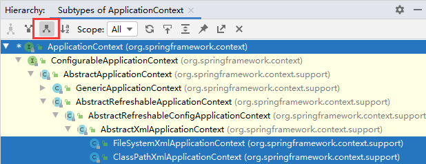
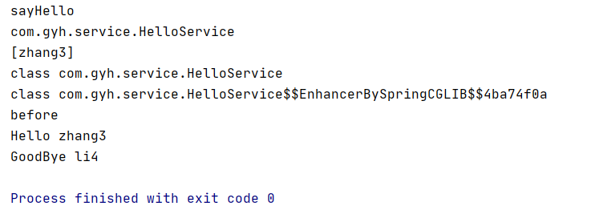

# 九、SSM 框架

## 目录

- [九、SSM 框架](#九ssm-框架)
  - [目录](#目录)
  - [1 设计模式](#1-设计模式)
    - [1.1 软件设计的原则](#11-软件设计的原则)
    - [1.2 单例](#12-单例)
    - [1.3 工厂](#13-工厂)
      - [1.3.1 简单工厂](#131-简单工厂)
      - [1.3.2 工厂方法](#132-工厂方法)
    - [1.4 代理](#14-代理)
      - [1.4.1 静态代理](#141-静态代理)
      - [1.4.2 动态代理](#142-动态代理)
    - [1.5 建造者](#15-建造者)
  - [2 Spring-IoC/DI](#2-spring-iocdi)
    - [2.1 Spring 概述](#21-spring-概述)
    - [2.2 IoC/DI 入门案例](#22-iocdi-入门案例)
      - [2.2.1 案例 1](#221-案例-1)
      - [2.2.2 案例 2](#222-案例-2)
    - [2.3 ApplicationContext](#23-applicationcontext)
    - [2.4 实例化](#24-实例化)
      - [2.4.1 构造方法](#241-构造方法)
      - [2.4.2 工厂](#242-工厂)
    - [2.5 生命周期](#25-生命周期)
    - [2.6 CollectionBean](#26-collectionbean)
    - [2.7 注解](#27-注解)
      - [2.7.1 组件注册类](#271-组件注册类)
      - [2.7.2 注入类](#272-注入类)
      - [2.7.3 scope](#273-scope)
      - [2.7.4 生命周期](#274-生命周期)
      - [2.7.5 单元测试](#275-单元测试)
  - [3 Spring-AOP](#3-spring-aop)
    - [3.1 AOP 概述](#31-aop-概述)
    - [3.2 AOP 编程术语](#32-aop-编程术语)
    - [3.3 AOP 实战](#33-aop-实战)
      - [3.3.1 SpringAOP（半自动）](#331-springaop半自动)
      - [3.3.2 AspectJ（全自动）](#332-aspectj全自动)
    - [3.4 切入点表达式](#34-切入点表达式)
    - [3.5 JoinPoJint](#35-joinpojint)
    - [3.6 注解](#36-注解)
      - [3.6.1 切面类中使用注解](#361-切面类中使用注解)
      - [3.6.2 使用自定义注解来指定增强方法](#362-使用自定义注解来指定增强方法)
  - [4 JdbcTemplate](#4-jdbctemplate)
    - [4.1 案例](#41-案例)
      - [4.1.1 SE 项目使用 JdbcTemplate](#411-se-项目使用-jdbctemplate)
      - [4.1.2 Spring 整合](#412-spring-整合)
    - [4.2 @Autowired 注解](#42-autowired-注解)
    - [4.3 jdbcDaoSupport](#43-jdbcdaosupport)
  - [5 Spring-tx](#5-spring-tx)
    - [5.1 事务回顾](#51-事务回顾)
    - [5.2 Spring 事务管理](#52-spring-事务管理)
      - [5.2.1 PlatFormTransactionManager](#521-platformtransactionmanager)
      - [5.2.2 TransactionStatus](#522-transactionstatus)
      - [5.2.3 TransactionDefinition](#523-transactiondefinition)
    - [5.3 Spring 事务案例](#53-spring-事务案例)
      - [5.3.1 TransactionTemplate（手动实现业务）](#531-transactiontemplate手动实现业务)
      - [5.3.2 事务代理对象](#532-事务代理对象)
      - [5.3.3 事务通知](#533-事务通知)
      - [5.3.4 注解方式](#534-注解方式)
  - [6 Javaconfig](#6-javaconfig)


## 1 设计模式

设计模式是一套被反复使用的、多数人知晓的、经过分类编目的、代码设计经验的总结。

### 1.1 软件设计的原则

设计模式的五个原则 solid：
- S（single）：单一职责原则。

- O（open）：开放封闭原则。对新增代码开放，对修改代码封闭。

- L（Liskov）：里氏替代原则。用父类来接收子类的实例。

- I（isolation）：接口隔离原则。不同的功能放到不同的接口中。

- D：依赖倒置原则。先定义要做的事情是什么样子，然后再进行具体的实现。

### 1.2 单例

单例：单一实例，全局只有一个。

特点：
- 构造方法私有。

- 包含自己的成员变量。

- 提供静态方法供人调用。 

使用场景：
- Servlet

- ServletContext

示例：
```java
/**
 * 线程不安全的懒加载
 */
public class Singleton {

    private Singleton(){}

    static Singleton singleton;

    public static Singleton getInstance(){

        if (singleton == null){
            singleton = new Singleton();
        }
        return singleton;
    }
}
```

```java
/**
 * 线程安全的懒加载
 */
public class Singleton2 {

    private Singleton2(){}

    static Singleton2 singleton2;

    public synchronized static Singleton2 getInstance(){

        if (singleton2 == null){
            singleton2 = new Singleton2();
        }
        return singleton2;
    }
}
```

懒加载和立即加载：
- 懒加载在调用 getInstance 方法时才初始化示例
- 立即加载在还未调用 getInstance 方法的时候就已经完成了实例的初始化。

```java
/**
 * 立即加载
 */
public class Singleton3 {

    private Singleton3(){}

    static Singleton3 singleton3 = new Singleton3();

    public static Singleton3 getInstance(){
        return singleton3;
    }
}
```

```java
/**
 * 立即加载
 * 这个是 singleton3 的一个变种
 */
public class Singleton4 {

    private Singleton4(){}

    static Singleton4 singleton4;

    // 静态代码块
    static {
        singleton4 = new Singleton4();
    }

    public static Singleton4 getInstance(){


        return singleton4;
    }
}
```

```java
/**
 * 静态内部类实现线程安全的懒加载
 * 将实例初始化的过程放在静态内部类中，当调用到静态内部类的方法的时候，静态内部类才加载
 */
public class Singleton5 {
    private Singleton5(){}

    static class Inner{
        static Singleton5 singleton5 = new Singleton5();

        public static Singleton5 provideSingleton5(){
            return singleton5;
        }
    }

    public static Singleton5 getInstance(){
        return Inner.provideSingleton5();
    }
}
```

### 1.3 工厂

在工厂模式中，我们在创建对象时不会对客户端暴露创建逻辑，并且是通过使用一个共同的接口来指向新创建的对象。
- 去生产实例，工厂要提供 create 方法。  

- 通过工厂可以把实例的实例化细节隐藏起来。  

注：XXXFactory 就是获得 xxx 实例。所有当看到类型是 XXXFactory 的时候，就要意识到这是一个工厂的设计模式。

#### 1.3.1 简单工厂

通过给工厂的生产方法传入不同的内容，工厂生产的内容就有所区别。

示例：
```java
public class AnimalFactory {

    // 提供一个返回值为 animal 的方法
    public Animal create(String name){
        Animal animal = null;

        if ("bull".equals(name)){
            animal = new Bull();
        } else if ("pig".equals(name)){
            animal = new Pig();
        } else if ("rabbit".equals(name)){
            animal = new Rabbit();
        } else if ("mouse".equals(name)){
            animal = new Mouse();
        }

        return animal;
    }
}
```

#### 1.3.2 工厂方法  

提供一个工厂接口，提供生产方法的规范。  

具体的工厂实现工厂接口，在具体的工厂中提供详细的生产方法。

**（1）实例工厂**  

先对工厂进行实例化，然后通过工厂对象来调用生产方法。当需要新的生产实例的时候，新增对应的工厂实例即可。

示例：
```java
// 工厂
public interface CarFactory {

    public Car createCar();
}
```

```java
// 工厂实例 1
public class AudiCarFactory implements CarFactory{
    @Override
    public Car createCar() {
        return new AudiCar();
    }
}
```

```java
// 工厂实例 2
public class BydCarFactory implements CarFactory{
    @Override
    public Car createCar() {
        return new BydCar();
    }
}
```

**（2）静态工厂**

提供静态方法获得实例的工厂，称为静态工厂。工厂中的方法是静态方法，可以直接调用。

示例：
```java
// 工厂
public interface CarFactory {

    public Car createCar();
}
```

```java
public class DreamOneCarFactory implements CarFactory{
    @Override
    public Car createCar() {
        return null;
    }

    public static Car staticFactoryCreate(){
        return new DreamOneCar();
    }
}
```

### 1.4 代理

代理：为某个对象提供一个代理对象以控制对这个对象的访问。

代理对象：中介。

代理类：负责为委托类预处理消息，过滤消息并转发消息，以及进行消息被委托类执行后的后续处理。

被代理对象（委托类）：业主。

代理的设计模式优点：可以在目标对象实现的基础上，增强额外的功能，扩展目标对象的功能。

#### 1.4.1 静态代理  

所谓静态代理，就是代理类是由程序员自己编写的，在编译期就确定好了的。 

**（1）委托类成员变量**  

示例：
```java
public class HouseOwner {

    public boolean rentHouse(Integer money){
        if (money >= 1500){
            return true;
        }
        return false;
    }
}
```

```java
// 代理类
public class HouseProxy {

    HouseOwner houseOwner = new HouseOwner();

    public boolean rentHouse(Integer money){
        money = money - 500;
        return houseOwner.rentHouse(money);
    }
}
```

**（2）代理类继承委托类**

```java
public class HouseProxy2 extends HouseOwner{

    public boolean rentHouse(Integer money){
        money = money - 500;
        return super.rentHouse(money);
    }
}
```

#### 1.4.2 动态代理

获得一个代理对象，通过代理对象调用的方法才是增强的方法。

Java 实现动态代理的大致步骤：
1. 定义一个委托类和公共接口。

2. 自己定义一个类（调用处理器类，即实现 InvocationHandler 接口），这个类的目的是指定运行时将生成的代理类需要完成的具体任务（包括 Preprocess 和 Postprocess），即代理类调用任何方法都会经过这个调用处理器类。

3. 生成代理对象（当然也会生成代理类），需要为他指定委托对象、实现的一系列接口和调用处理器类的实例。因此可以看出一个代理对象对应一个委托对象，对应一个调用处理器实例。

**（1）JDK 动态代理**

JDK 动态代理：java.lang.reflect 包中的 Proxy 类和 InvocationHandler 接口提供了生成动态代理类的能力。

JDK 动态代理使用要有接口的实现，并且要用接口来接收。

示例：
```java
// 接口
public interface HelloService {
    public void sayHello();
}
```

```java
public class HelloServiceImpl implements HelloService{
    @Override
    public void sayHello() {
        System.out.println("hello world");
    }
}
```

```java
// 动态代理
public class ProxyTest {

    @Test
    public void mytest(){
        // 先获得委托类对象的实例
        HelloService helloService = new HelloServiceImpl();
        
        // jdk 动态代理获得增强对象（代理对象）
        HelloService helloServiceProxy = (HelloService) Proxy.newProxyInstance(HelloServiceImpl.class.getClassLoader(),
                helloService.getClass().getInterfaces(), new InvocationHandler() {

            @Override
            public Object invoke(Object proxy, Method method, Object[] args) throws Throwable {
                System.out.println("起床"); // 前面的增强

                Object invoke = method.invoke(helloService, args);
                
                System.out.println("编程"); // 后面的增强

                return invoke;
            }
        });

        // helloServiceProxy.sayHello(); // 使用代理对象去执行才会增强

        // helloService.sayHello(); // 只会输出hello world

    }
}
```
注：JDK 动态代理不能够使用实现类来接收代理对象。

**（2）cglib 动态代理**

cglib（Code Generation Library）动态代理：cglib 是一个第三方代码生成类库，运行时在内存中动态生成一个子类对象从而实现对目标对象功能的扩展。
- 不需要有接口的实现。  

- 基于继承去实现，proxy 对象是继承委托类对象。

- 可以用接口，也可以用实现类来接收。

- 代码写起来基本是一样，获得代理对象的过程使用 api 不同。

示例：
```java
/**
 * 用 cglib 单元测试使用
 * 这个类没有接口的实现
 */
public class HelloService2 {

    public void sayHello2(){
        System.out.println("hello world2");
        
        try {
            Thread.sleep(500);
        } catch (InterruptedException e) {
            e.printStackTrace();
        }
    }
}
```

```java
public class CglibProxyTest {

    /**
     * 计算 helloService2 中的方法的执行时间
     */
    @Test
    public void mytest1(){

        HelloService2 helloService2 = new HelloService2();
        
        // 第二个参数也是 InvocationHandler，和 jdk 动态代理的 InvocationHandler 不同，需要导包
        HelloService2 helloService2Proxy = (HelloService2) Enhancer.create(HelloService2.class, new InvocationHandler() {
            
            @Override
            public Object invoke(Object proxy, Method method, Object[] args) throws Throwable {
                long start = System.currentTimeMillis();
                
                Object invoke = method.invoke(helloService2, args);
                
                long end = System.currentTimeMillis();
                long cost = end - start;
                System.out.println(method.getName() + "执行时间是：" + cost);
                
                return invoke;
            }
        });
        helloService2Proxy.sayHello2();
    }
}
```

### 1.5 建造者

建造者（builder）也是生产实例，更侧重参数的设置。

·
```java
public class Foot {
    Integer size;

    public Integer getSize() {
        return size;
    }

    public void setSize(Integer size) {
        this.size = size;
    }

    @Override
    public String toString() {
        return "Foot{" +
                "size=" + size +
                '}';
    }
}
```

```java
public class Head {
    Integer iq;
    Integer eq;
    String name;

    public Integer getIq() {
        return iq;
    }

    public void setIq(Integer iq) {
        this.iq = iq;
    }

    public Integer getEq() {
        return eq;
    }

    public void setEq(Integer eq) {
        this.eq = eq;
    }

    public String getName() {
        return name;
    }

    public void setName(String name) {
        this.name = name;
    }

    @Override
    public String toString() {
        return "Head{" +
                "iq=" + iq +
                ", eq=" + eq +
                ", name='" + name + '\'' +
                '}';
    }
}
```

```java
public class Human {
    Foot foot = new Foot();
    Head head = new Head();
    Leg leg = new Leg();

    public Foot getFoot() {
        return foot;
    }

    public void setFoot(Foot foot) {
        this.foot = foot;
    }

    public Head getHead() {
        return head;
    }

    public void setHead(Head head) {
        this.head = head;
    }

    public Leg getLeg() {
        return leg;
    }

    public void setLeg(Leg leg) {
        this.leg = leg;
    }

    @Override
    public String toString() {
        return "Human{" +
                "foot=" + foot +
                ", head=" + head +
                ", leg=" + leg +
                '}';
    }
}
```

```java
public class Leg {

    Integer length;
    boolean strong;

    public Integer getLength() {
        return length;
    }

    public void setLength(Integer length) {
        this.length = length;
    }

    public boolean isStrong() {
        return strong;
    }

    public void setStrong(boolean strong) {
        this.strong = strong;
    }

    @Override
    public String toString() {
        return "Leg{" +
                "length=" + length +
                ", strong=" + strong +
                '}';
    }
}
```


```java
public class HumanBuilder {

    Human human = new Human(); // 保证了 new 一个 builder 的时候同时 new 了一个 human ，就是空白的 human

    public HumanBuilder setFootSize(Integer size){
        human.getFoot().setSize(size);
        return this;
    }

    // 需要保证都是同一个 head
    public HumanBuilder setHeadIq(Integer iq){
        human.getHead().setIq(iq);
        return this;
    }

    public HumanBuilder setHeadEq(Integer eq){
        human.getHead().setEq(eq);
        return this;
    }

    public HumanBuilder setHeadName(String name){
        human.getHead().setName(name);
        return this;
    }

    public HumanBuilder setLegLength(Integer length){
        human.getLeg().setLength(length);
        return this;
    }

    public HumanBuilder setLegStrong(boolean strong){
        human.getLeg().setStrong(strong);
        return this;
    }

    public Human build(){
        return human;
    }

    public Human getHuman() {
        return human;
    }

    public void setHuman(Human human) {
        this.human = human;
    }
}
```

```java
public class MyTest {

    @Test
    public void mytest(){
        HumanBuilder humanBuilder = new HumanBuilder();
        humanBuilder.setLegLength(120)
                    .setHeadIq(150)
                    .setHeadEq(150)
                    .setHeadName("zhang3")
                    .setFootSize(44)
                    .setLegStrong(true);

        Human human = humanBuilder.build();
        System.out.println(human);
    }
}
```


## 2 Spring-IoC/DI

### 2.1 Spring 概述

Spring 是一个开源框架，它是于 2003 年兴起的一个轻量级的Java 开发框架，由 Rod Johnson 在其著作《Expert One-On-One J2EE Development and Design》中阐述的部分理念和原型衍生而来。  

它是为了解决企业应用开发的复杂性而创建的。框架的主要优势之一就是其分层架构，分层架构允许使用者选择使用哪一个组件，同时为 J2EE 应用程序开发提供集成的框架。  

Spring 核心：IoC/DI 和 AOP。

IoC（Inverse of Controll）：控制反转。
- 控制：实例的生成权。

- 反转：由应用程序反转给 Spring。

- 容器：容器是放置实例对象的地方。

DI（Dependency Injection）：依赖注入。
- 依赖：应用程序依赖 Spring 容器，因为 Spring 容器包含了应用程序必须的内容。

- 注入：Spring 容器给应用程序注入应用程序运行所必须的资源。

AOP（Aspect Oriented Programming）：面向切面编程。
OOP（Object Oriented Programming）：面向对象编程。

Spring 优点：
- 方便解耦，简化开发（高内聚低耦合）。  
  Spring 就是一个大工厂（容器），可以将所有对象创建和依赖关系维护，交给 Spring 管理。  
  
  Spring 工厂是用于生成 Bean。

- AOP 编程的支持。  
  Spring 提供面向切面编程，可以方便的实现对程序进行权限拦截、运行监控等功能

- 声明式事务的支持。  
  只需要通过配置就可以完成对事务的管理，而无需手动编程。

- 方便程序的测试。  
  Spring 对 Junit4 支持，可以通过注解方便的测试 Spring 程序。

- 方便集成各种优秀框架。  
  Spring 不排斥各种优秀的开源框架，其内部提供了对各种优秀框架（如：Struts、Hibernate、MyBatis、等）的直接支持。

- 降低 JavaEE API 的使用难度。  
  Spring 对 JavaEE 开发中非常难用的一些 API（如：JDBC、JavaMail、远程调用等），都提供了封装，使这些API应用难度大大降低。

Spring Framework：  
<div align="center">

</div>


### 2.2 IoC/DI 入门案例

#### 2.2.1 案例 1

**第一步**：导包。  

Spring 核心依赖 5 + 1：spring-core、spring-context、spring-aop、spring-beans、spring-expression 和 commons-logging（jcl）。

Maven 项目导入依赖：
```xml
<!--Spring 的 5+1-->
<!--利用 Maven 特性：当你导入一个依赖的时候，Maven 会导入他所关联的依赖-->
<dependency>
    <groupId>org.springframework</groupId>
    <artifactId>spring-context</artifactId>
    <version>5.2.6.RELEASE</version>
</dependency>
```

**第二步**：定义一个 service。

```java
public class HelloService {

    public void sayHello(String name){
        System.out.println("hello " + name);
    }
}
```

**第三步**：创建 Spring 容器。

通过 Spring 配置文件来管理，配置文件通常名字叫 `application(-xx).xml`。  

既然是 xml 文件，文件要满足一定的约束（schema）。约束怎么来？
- 复制已有的配置文件的约束。

- 从 Spring 的 [参考文档](https://docs.spring.io/spring/docs/5.2.7.RELEASE/spring-framework-reference/core.html) 上的 appendix 上复制。 

- 通过创建文件模板来使用（推荐，效率高）。

**第四步**：将组件交给 Spring 管理。

组件：交给 Spring 容器管理的实例，称之为组件。

在 Spring 的配置文件中定义实例：
```xml
<!--组件注册-->
<bean id="helloService" class="com.gyh.service.HelloService"/>
```

**第五步**：从容器中取出实例进行使用。

```java
@Test
public void myTest1() {
    ApplicationContext applicationContext = new ClassPathXmlApplicationContext("application.xml");

    HelloService helloService1 = (HelloService) applicationContext.getBean("helloService");
    HelloService helloService2 = (HelloService) applicationContext.getBean("helloService");

    helloService1.sayHello("zhang3");
    helloService1.sayHello("li4");
}
```

组件在容器中默认以单例的形式存在。  
<div align="center">

</div>


#### 2.2.2 案例 2

**第一步**：导包。

第二步：构建业务代码。

```java
public class HelloServiceImpl implements HelloService{

    HelloDao helloDao;

    @Override
    public void sayHello(String name) {
        helloDao.daoSayHello(name);
    }

    public String sayHello2(String name){
        return "hello " + name;
    }

    public HelloDao getHelloDao() {
        return helloDao;
    }

    public void setHelloDao(HelloDao helloDao) {
        this.helloDao = helloDao;
    }
}
```

```java
public class HelloDaoImpl implements HelloDao{
    @Override
    public void daoSayHello(String name) {
        System.out.println("hello " + name);
    }
}
```

**第三步**：注册组件并维护组件之间的依赖关系。

```xml
<!--组件注册中 class 不能写接口-->
<bean id="helloDao" class="com.gyh.dao.HelloDaoImpl"/>

<bean id="helloService" class="com.gyh.service.HelloServiceImpl">
    <!--方式 1-->
    <property name="helloDao" ref="helloDao"/>
    
<!--    方式 2-->
<!--    <property name="helloDao">-->
<!--        <ref bean="helloDao"/>-->
<!--    </property>-->
    
<!--    方式 3，相当于重新定义了一个局部组件-->
<!--    <property name="helloDao">-->
<!--        <bean class="com.gyh.dao.HelloDaoImpl"/>-->
<!--    </property>-->
</bean>
```

**第四步**：使用。

```java
@Test
public void myTest1() {
    ApplicationContext applicationContext = new ClassPathXmlApplicationContext("application.xml");

    HelloService helloService = (HelloService) applicationContext.getBean("helloService");
    helloService.sayHello("zhang3");
    HelloDao helloDao = applicationContext.getBean(HelloDao.class);
    System.out.println(helloDao);
}
```

容器中的组件是引用关系，并没有重新创建。  
<div align="center">

</div>


案例总结：
- 控制反转 IoC（Inversion of Control），是一种设计思想；  
  DI（依赖注入）是实现 IoC 的一种方法。

- 依赖注入的目的并非为软件系统带来更多功能，而是为了提升组件重用的频率，并为系统搭建一个灵活、可扩展的平台。

### 2.3 ApplicationContext

ClassPathXmlApplicationContext：加载 classpath 目录下的配置文件。

FileSystemXmlApplicationContext：加载文件系统目录下的配置文件。

<div align="center">

</div>

BeanFactory：容器中所有的组件都是通过这个 Bean 生产出来的。

<div align="center">

</div>

BeanFactory：生产所有组件 Bean。

FactoryBean：XXXFactoryBean，factoryBean 对应的特定的 xxx 实例。


### 2.4 实例化

#### 2.4.1 构造方法

**（1）无参构造**  

默认提供的是无参构造，这个是最常用。

无参构造要通过 property 标签调用 set 方法给成员变量赋值。  

示例：
```java
// 无参构造方法
@Data
@NoArgsConstructor
public class NoArgsConstructorBean {
    String name;
    Integer id;
}
```

```xml
<bean id="noArgsBean" class="com.gyh.component.NoArgsConstructorBean">
    <!--可以使用 value 属性或者 value 标签-->
    <property name="id" value="1"/>

    <property name="name">
        <value>zhang3</value>
    </property>
</bean>
```

**（2）有参构造**  

有参构造，要通过 constructor-arg 子标签来调用有参构造方法。  

示例：
```java
// 有参构造方法
@Data
@AllArgsConstructor // 写了有参构造方法，会将默认的无参构造方法覆盖掉
public class HasArgsConstructorBean {
    String name;
    Integer id;
}
```

```xml
<bean id="hasArgsBean" class="com.gyh.component.HasArgsConstructorBean">
    <constructor-arg name="id" value="2"/>
    <constructor-arg name="name" value="ligenli"/>
</bean>
```

#### 2.4.2 工厂

不常用，通常是整合已有代码的时候，可以使用工厂注册组件。

**（1）静态工厂**

`factory-method` 对应的是静态工厂中的静态方法。

示例：
```xml
<bean id="animalFromStaticFactory" class="com.gyh.factory.StaticFactory" factory-method="create"/>
```

**（2）实例工厂**  

示例：
```xml
<bean id="instanceFactory" class="com.gyh.factory.InstanceFactory"/>

<bean id="animalFromInstanceFactory" factory-bean="instanceFactory" factory-method="create"/>
```

### 2.5 生命周期

Spring 容器中 Bean 的生命周期：
1. Bean 的建立。  
   由 BeanFactory 读取 Bean 定义文件，并生成各个实例。

2. Setter 注入。  
   执行 Bean 的属性依赖注入。

3. BeanNameAware 的 `setBeanName()`。  
   如果 Bean 类实现了 org.springframework.beans.factory.BeanNameAware 接口，则执行其 `setBeanName()` 方法。

4. BeanFactoryAware 的 `setBeanFactory()`。  
   如果 Bean 类实现了 org.springframework.beans.factory.BeanFactoryAware 接口，则执行其 `setBeanFactory()` 方法。

5. BeanPostProcessor 的 `processBeforeInitialization()`。  
   容器中如果有实现 org.springframework.beans.factory.BeanPostProcessor 接口的实例，则任何 Bean 在初始化之前都会执行这个实例的`processBeforeInitialization()` 方法。  

6. InitializingBean 的 `afterPropertiesSet()`。  
   如果 Bean 类实现了 org.springframework.beans.factory.InitializingBean 接口，则执行其 `afterPropertiesSet()` 方法。

7. Bean 定义文件中定义 init-method。  
   在 Bean 定义文件中使用 init-method 属性设定方法名称，这时会执行 `initMethod()` 方法（注：这个方法是不带参数的）。

8. BeanPostProcessor 的 `processAfterInitialization()`。
   容器中如果有实现 org.springframework.beans.factory.BeanPostProcessors 接口的实例，则任何 Bean 在初始化之前都会执行这个实例的 `processAfterInitialization()` 方法。

9. DisposableBean 的 `destroy()`。  
    在容器关闭时，如果 Bean 类实现了 org.springframework.beans.factory.DisposableBean 接口，则执行它的 `destroy()` 方法。

10. Bean 定义文件中定义 destroy-method。  
    在容器关闭时，可以在 Bean 定义文件中使用 destory-method 定义的方法。

流程图：
<div align="center">

</div>

### 2.6 CollectionBean

注册组件的时候，会遇到组件的成员变量类型为 Array、List、Set 等 Collection 类型。而 value 和 ref 属性不能够满足数组数据的需求，需要在 property 标签下写子标签。  
- Array、List、Set 只有 property 的子标签不同，其余的写法都是相同的。  
  - 值类型：value 标签。

  - javabean 类型：bean、ref 标签。

- Map 需要 key 和 value。  
  key 和 value 可以是字符串、基本类型、包装类、javabean（容器中的组件 id）。  
  - Map 的 key：
    - 值类型：key 属性。  
    
    - javabean 类型：key-ref 属性。

  - Map 的 value：
    - 值类型：value属性或value子标签。
    
    - javabean 类型：value-ref 属性或 bean、ref 子标签。


- properties 也需要 key 和 value。  
  key 和 value 不能是 javabean。


示例：
```java
@Data
public class CollectionBean {
    Object[] arrayParam;
    List listParam;
    Set setParam;
    Map mapParam;
    Properties properties;
}
```

```java
@Data
public class User {
    String username;
    String password;
}
```

```xml
<bean id="user" class="com.gyh.bean.User">
    <property name="username" value="zhang3"/>
    <property name="password" value="123456"/>
</bean>

<bean class="com.gyh.bean.CollectionBean">
    <property name="arrayParam">
        <!--Array 中每一条数据写一个子标签-->
        <array>
            <!--string、int-->
            <value>string</value>
            <value>100</value>
            <!--javabean ref（引用容器中的组件） bean（局部组件）-->
            <ref bean="user"/>
            <bean class="com.gyh.bean.User">
                <property name="username" value="li4"/>
                <property name="password" value="123456"/>
            </bean>
        </array>
    </property>

    <property name="listParam">
        <list>
            <!--string、int-->
            <value>arraydata1</value>
            <value>234</value>
            <!--javabean ref（引用容器中的组件） bean（局部组件）-->
            <ref bean="user"/>
            <bean class="com.gyh.bean.User">
                <property name="username" value="li4"/>
                <property name="password" value="123456"/>
            </bean>
        </list>
    </property>

    <property name="setParam">
        <set>
            <!--string、int-->
            <value>arraydata1</value>
            <value>234</value>
            <!--javabean ref（引用容器中的组件） bean（局部组件）-->
            <ref bean="user"/>
            <bean class="com.gyh.bean.User">
                <property name="username" value="li4"/>
                <property name="password" value="123456"/>
            </bean>
        </set>
    </property>

    <property name="mapParam">
        <map>
            <!--Map标签下要写 entry 子标签-->
            <entry key="key1" value="value1"/>
            <entry key-ref="user" value-ref="user"/>
            <entry key="key2">
                <value>value2</value>
            </entry>
            <entry key="user2">
                <ref bean="user"/>
            </entry>
            <entry key="user3">
                <bean class="com.gyh.bean.User">
                    <property name="username" value="li4"/>
                    <property name="password" value="123456"/>
                </bean>
            </entry>
        </map>
    </property>

    <property name="properties">
        <!--子标签不是 properties 是 properties 的缩写 props-->
        <props>
            <prop key="key1">value1</prop>
            <prop key="key2">value2</prop>
        </props>
    </property>
</bean>
```

### 2.7 注解

首先要打开注解扫描开关：
```xml
<!--只要包目录包含 base-package 的值，就在扫描范围-->
<context:component-scan base-package="com.gyh"/>
```

#### 2.7.1 组件注册类

`@Component`：普通场景。

`@Service`：service 层组件。

`@Repository`：dao 层组件。

`@Controller`：控制层组件（SpringMVC 阶段使用）。

使用注解后组件 id：
- 可以指定id，示例：`@Service("cat")`。

- 可以使用默认 id：类名首字母小写。

#### 2.7.2 注入类

给容器中的组件的成员变量赋值，或者维护组件之间的关系。

**（1）字符串、基本类型、包装类**  

使用 `@value` 注解，不需要包含 set 方法。  

示例：
```java
@Value("zhang3")
String username;

@Value("123456")
String pwd;
```
value 中的值也可以引用 properties 配置文件中的 key：
1. 在 Spring 配置文件中引入 properties 文件；

2. 在 `@value` 注解中引用 key。

示例：
```properties
param.username=zhang3
param.pwd=123456
```

```xml
<context:property-placeholder location="classpath:param.properties"/>
```

```java
@Value("${param.username}")
String username;

@Value("${param.pwd}")
String pwd;
```

**（2）javabean**

从容器中取出组件。

`@Autowired`：类似 `getBean(class)`，要求容器中这个类型的组件只有一个。  
示例：
```java
@Autowired
UserDao userDao;
```

`@Autowired` + `@Qualifier`：容器中这个类型的组件不止一个，通过 `@Qualifier` 指定组件 id。  
示例：
```java
@Autowired
@Qualifier("userDaoImpl")
UserDao userDao2;
```

`@Resource`：默认可以按照类型去取，也可以使用 name 属性指定组件 id。  
示例：
```java
@Resource(name = "userDaoImpl2")
UserDao userDao3;
```

#### 2.7.3 scope

组件的作用域：singleton（单例）、prototype（原型）。
- singleton：容器中的组件始终以单例的形式存在。

- prototype：每次从容器中取出组件都是一个新的组件，相当于每一次 new 一个新的。

scope 也带来生命周期的变化：
- signleton：容器初始化的时候，开始生命周期。

- prototype：当获得次组件的时候，才开始生命周期，且生命周期没有 destory。

直接在类名上方使用 `@Scope`。  
示例：
```java
@Service
@Scope("prototype")
public class UserService() {}
```

#### 2.7.4 生命周期

init-method：`@PostConstruct`。

destroy-method：`@PreDestroy`。

示例：
```java
@PostConstruct
public void init(){}

@PreDestroy
public void destroy(){}
```

#### 2.7.5 单元测试

之前单元测试都是先去获得 ApplicationContext 对象，如：
```java
ClassPathXmlApplicationContext applicationContext = new ClassPathXmlApplicationContext("application.xml");

Cat cat = applicationContext.getBean("cat", Cat.class);
cat.Miao();
```

Spring 对单元测试有良好的支持，可以在单元测试类中直接使用注入类的注解从容器中取出组件。

**第一步**：引入依赖。  
```xml
<dependency>
    <groupId>org.springframework</groupId>
    <artifactId>spring-test</artifactId>
    <version>5.2.6.RELEASE</version>
    <scope>test</scope>
</dependency>
```

**第二步**：test 类添加注解。  
```java
@RunWith(SpringJUnit4ClassRunner.class)
@ContextConfiguration(value = "classpath:application.xml")
```

**第三步**：使用。  
```java
@RunWith(SpringJUnit4ClassRunner.class)
@ContextConfiguration(value = "classpath:application.xml")
public class myTest {
    @Autowired
    Cat cat;
    @Autowired
    Dog dog;
    @Autowired
    Tiger tiger;
    
    @Test
    public void myTest1() {
        cat.Miao();
        dog.Wang();
        tiger.Aowu();
    }
}
```


## 3 Spring-AOP

### 3.1 AOP 概述

面向切面编程是指通过预编译方式和运行期动态代理实现程序功能的统一维护的一种技术。AOP 是 OOP（面向对象编程）的延续，是软件开发中的一个热点，也是 Spring 框架中的一个重要内容。  

利用 AOP 可以对业务逻辑的各个部分进行隔离，从而使得业务逻辑各部分之间的耦合度降低，提高程序的可重用性，同时提高了开发的效率。

AOP 的特点：
- AOP采取横向抽取机制，取代了传统纵向继承体系重复性代码。

- Spring AOP 使用纯 Java 实现，不需要专门的编译过程和类加载器，在运行期通过代理方式向目标类织入增强代码。

经典应用：事务管理、性能监视、安全检查、缓存 、日志等。  
这些系统服务通常被称为横切关注点。想象一下如果每个组件都单独去实现这些系统功能：
- 改变这些关注点的逻辑，修改各个模块当中的实现，方法的调用就会重复出现在各个模块中。

- 组件会因为那些与自身核心业务无关的代码而变得混乱。

未建立切面：
<div align="center">

</div>

建立切面：
<div align="center">
<br>

</div>

### 3.2 AOP 编程术语

| 术语 | 意义 |
| :-: | :-: |
| Target | 目标类，需要被代理的类，委托类 |
| JoinPoint | 连接点，指被代理对象里那些可能会被增强的点 |
| PointCut | 切入点，已经被增强的连接点 |
| Advice | 通知（具体的增强的代码），代理对象执行到 Joinpoint 所做的事情 |
| weaver | 织入（植入）是指把 advice 应用到目标对象来创建新的代理对象的过程 |
| Proxy | 代理类，动态代理生成的 |
| Aspect | 切面，是切入点和通知的结合（一个线是一条特殊的面 -> 一个切入点和一个通知组成一个特殊的面） |

### 3.3 AOP 实战

#### 3.3.1 SpringAOP（半自动）

**第一步**：注册一个委托类 target 组件。

```xml
<context:component-scan base-package="com.gyh"/>
```

```java
@Service
public class HelloService {

    public void sayHello(String name) {
        System.out.println("Hello " + name);
    }
}
```

**第二步**：通知。

```java
@Component
public class CustomAdvice implements MethodInterceptor {
    @Override
    public Object invoke(MethodInvocation methodInvocation) throws Throwable {
        System.out.println("before");
        Object proceed = methodInvocation.proceed();
        System.out.println("after");
        return proceed;
    }
}
```

**第三步**：Proxy 增强组件。

```xml
<!--将目标组件生成一个代理组件-->
<!--XXXFactoryBean 生成特定的 XXX 组件-->
<bean id="helloServiceProxy" class="org.springframework.aop.framework.ProxyFactoryBean">
    <property name="target" ref="helloService"/>

    <property name="interceptorNames" value="customAdvice"/>
</bean>
```

**第四步**：使用。

```java
@RunWith(SpringJUnit4ClassRunner.class)
@ContextConfiguration("classpath:application.xml")
public class myTest {
    @Autowired
    @Qualifier("helloServiceProxy") // 从容器中通过指定 id 取出代理组件 
    HelloService helloService;

    @Test
    public void myTest1() {
        helloService.sayHello("zhang3");
    }
}
```

不足之处：
- 哪些方法被增强需要写代码判断。

- 增强的代码有要求，必须实现一些接口。


#### 3.3.2 AspectJ（全自动）

AspectJ 是基于 Java 语言的 AOP 框架。Spring2.0 之后支持了基于 AspectJ 的切入点表达式的支持。  

AspectJ 扩展了 Java 语言，提供了一个专门的编译器，在编译时提供横向代码的织入，允许直接在 class 里面定义切面类。  
主要用途：不改动现有代码的前提下自定义开发和植入代码。

**（1）自定义通知**

**第一步**：引入全新依赖。

```xml
<dependency>
    <groupId>org.aspectj</groupId>
    <artifactId>aspectjweaver</artifactId>
    <version>1.9.5</version>
</dependency>
```

**第二步**：注册一个委托类 target 组件和创建通知。

```java
@Component
public class HelloService {

    public void sayHello(String name) {
        System.out.println("Hello " + name);
    }
    public void sayGoodBye(String name) {
        System.out.println("GoodBye " + name);
    }
}
```

```java
@Component
public class CustomAdvice implements MethodInterceptor {
    @Override
    public Object invoke(MethodInvocation methodInvocation) throws Throwable {
        System.out.println("before");
        Object proceed = methodInvocation.proceed();
        System.out.println("after");
        return proceed;
    }
}
```

**第三步**：advisor（自定义通知）。

首先引入 aop 约束：
```xml
xmlns:aop="http://www.springframework.org/schema/aop"

http://www.springframework.org/schema/aop https://www.springframework.org/schema/aop/spring-aop.xsd
```

配置 advisor：
```xml
<aop:config>
    <!--pointcut id 为了方便别人引用他-->
    <!--expression 切入点表达式 → 匹配方法 → 指定增强方法-->
    <aop:pointcut id="mypointcut" expression="execution(public void com.gyh.service.HelloService.sayHello(String))"/>
    <!--pointcut 属性对应切入点表达式-->
    <aop:advisor advice-ref="customAdvice" pointcut-ref="mypointcut"/>
</aop:config>
```

**第四步**：使用。

```java
@RunWith(SpringJUnit4ClassRunner.class)
@ContextConfiguration("classpath:application.xml")
public class myTest {
    @Autowired
    HelloService helloService;

    @Test
    public void myTest1() {
        helloService.sayHello("zhang3");
        helloService.sayGoodBye("li4");
    }
}

/* 运行结果：
before
Hello zhang3
after
GoodBye li4
*/
```

**（2）AspectJ 提供通知**

AspectJ 通知类型：
- Before：在切入点之前执行。参数类型的校验。前置通知。

- After：在 finally 语句里。不管切入点是否有异常发生都会执行。

- Around：环绕通知，在切入点之前和之后都会执行。  
  用于增加事务等。  
  示例：
    ```java
    public Object around(ProceedingJoinPoint joinPoint) throws Throwable {
        System.out.println("around 的 before");
        // 类似于 method.invoke 或 methodInvocation.proceed
        Object proceed = joinPoint.proceed();
        System.out.println("around 的 after");
        return proceed;
    }
    ```

- AtterReturning：在切入点之后执行。后置通知，可以对结果进行检查。  
  用于增加 log。  
  示例：
  ```xml
  <!--retuning 属性值对应 after-returning 通知方法的形参名-->
  <aop:after-returning method="afterReturning" pointcut-ref="mypointcut" returning="returnValue"/>
  ```
  ```java
  // 可以拿到方法执行的返回值，需要在形参中定义 Object
  public void afterReturning(Object returnValue){
      System.out.println("返回值为：" + returnValue);
  }
  ```

- AfterThrowing：抛出异常的时候执行通知。正常情况下走不到，只有发生异常的情况下才会去通知。  
  用于记录一些日志。  
  示例：
  ```xml
  <!--throwing 属性值对应 after-throwing 通知方法的形参名-->
  <aop:after-throwing method="afterThrowing" pointcut-ref="mypointcut" throwing="exception"/>
  ```

  ```java
  public void afterThrowing(Exception exception){
      System.out.println("抛出的异常：" + exception.getMessage());
  }
  ```

**第一步**：引入依赖、注册委托类。

**第二步**：创建通知。

```java
@Component
public class CustomAdvice {

    public void myBefore() {
        System.out.println("before");
    }
}
```

**第三步**：aspect（提供通知）。

```xml
<aop:config>
    <aop:aspect ref="customAdvice">
        <aop:before method="myBefore" pointcut="execution(* com..sayHello(*))"/>
    </aop:aspect>
</aop:config>
```

**第四步**：使用。

```java
@RunWith(SpringJUnit4ClassRunner.class)
@ContextConfiguration("classpath:application.xml")
public class myTest {
    @Autowired
    HelloService helloService;

    @Test
    public void myTest1() {
        helloService.sayHello("zhang3");
        helloService.sayGoodBye("li4");
    }
}

/* 运行结果：
before
Hello zhang3
GoodBye li4
*/
```

### 3.4 切入点表达式

切入点表达式：`execution(修饰符 返回值 包名.类名.方法名(形参))`。
- 修饰符：private、public 这些修饰符。  
  可以省略不写，空白代表任意修饰符。

- 返回值。  
  不能省略。  
  可以使用 `*` 来通配。  
  特殊用法：如果返回值是 javabean 需要写全类名；如果是基本类型或 java.lang 包目录下的可以直接写。

- 包名、类名和方法名。  
  可以部分省略。除了头和尾不能省略，中间的部分都可以省略，通过 `..` 来省略中间的部分。  
  可以通配。头中间尾都可以使用 `*` 来通配。`*` 可以代表一个单词或一个单词的一部分。

- 形参。  
  可以省略，即无参方法。  
  可以通配。`*` 来通配，通配单个返回值。使用 `..` 来代表任意数量的任意类型的参数。    
  特殊用法：如果参数是 javabean，要写全类名；如果是 java.lang 包目录下可以直接写。

### 3.5 JoinPoJint

JoinPoJint 可以放在所有通知的形参中。

`Signature getSignature()`：获取封装了署名信息的对象，在该对象中可以获取到目标方法名，所属类的 Class 等信息。  

`Object[] getArgs()`：获取传入目标方法的参数对象。

`Object getTarget()`：获取被代理的对象。

`Object getThis()`：获取代理对象。

示例：
```java
@Component
public class CustomAdvice{

    public void myBefore(JoinPoint joinPoint) {
        Signature signature = joinPoint.getSignature();
        System.out.println(signature.getName());
        System.out.println(signature.getDeclaringTypeName());
        System.out.println(Arrays.asList(joinPoint.getArgs()));
        System.out.println(joinPoint.getTarget().getClass());   // 委托类对象
        System.out.println(joinPoint.getThis().getClass()); // 代理类对象

        System.out.println("before");
    }
}
```
使用后：
<div>

</div>

### 3.6 注解

首先开启注解开关：
```xml
<aop:aspectj-autoproxy/>
```

#### 3.6.1 切面类中使用注解

示例：
```java
@Component
@Aspect
public class CustomAdvice{
    @Pointcut("execution(* com..sayHello(*))")
    public void myPointcut() {} // id

    @Before("myPointcut()") // 可以引用切入点表达式
    public void myBefore(JoinPoint joinPoint) {
        System.out.println("before");
    }

    @After("execution(* com..sayHello(*))") // 可以直接写切入点表达式
    public void MyAfter(){
        System.out.println("after");
    }

    @AfterReturning(value = "myPointcut()", returning = "returnValue")
    public void afterReturning(Object returnValue){
        System.out.println("返回值为：" + returnValue);
    }
}
```

#### 3.6.2 使用自定义注解来指定增强方法

示例：
```java
@Target(ElementType.METHOD) // 注解能够写在方法上
@Retention(RetentionPolicy.RUNTIME) // 注解在运行时生效
public @interface CountTime {
}
```

```java
@Component
@Aspect
public class CountTimeAspect {

    @Pointcut("@annotation(com.gyh.anno.CountTime)")
    public void countTimePointcut(){}

    @Around("countTimePointcut()")
    public Object countTime(ProceedingJoinPoint joinPoint) throws Throwable {
        long start = System.currentTimeMillis();
        Object proceed = joinPoint.proceed();
        long end = System.currentTimeMillis();
        System.out.println(joinPoint.getSignature().getName() + "执行的时间是：" + (end - start));
        return proceed;
    }
}
```


## 4 JdbcTemplate

JdbcTemplate 是 Spring 利用 AOP 思想封装的 JDBC 操作工具。  

JDBCTemplate 也要依赖于数据源。

### 4.1 案例

#### 4.1.1 SE 项目使用 JdbcTemplate

第一步：引入依赖。

```xml
<dependencies>
    <dependency>
        <groupId>org.springframework</groupId>
        <artifactId>spring-jdbc</artifactId>
        <version>5.2.6.RELEASE</version>
    </dependency>

    <dependency>
        <groupId>mysql</groupId>
        <artifactId>mysql-connector-java</artifactId>
        <version>5.1.47</version>
    </dependency>

    <dependency>
        <groupId>com.alibaba</groupId>
        <artifactId>druid</artifactId>
        <version>1.1.22</version>
    </dependency>

    <dependency>
        <groupId>junit</groupId>
        <artifactId>junit</artifactId>
        <version>4.12</version>
        <scope>test</scope>
    </dependency>
</dependencies>
```

第二步：使用 JdbcTemplate。

```java
@Test
public void myTest() {
    DruidDataSource dataSource = new DruidDataSource();
    dataSource.setDriverClassName("com.mysql.jdbc.Driver");
    dataSource.setUrl("jdbc:mysql://localhost:3306/user_db?useUnicode=true&characterEncoding=utf-8");
    dataSource.setUsername("root");
    dataSource.setPassword("123456");

    JdbcTemplate jdbcTemplate = new JdbcTemplate();
    jdbcTemplate.setDataSource(dataSource); // 依赖数据源

    String sql = "select username from user_tb where id = ?";
    String username = jdbcTemplate.queryForObject(sql, String.class, 1);
    System.out.println("id 为 1 的 用户名：" + username);
}
```

#### 4.1.2 Spring 整合

第一步：新增依赖。

```xml
<!--Spring 支持和单元测试-->
<dependency>
    <groupId>org.springframework</groupId>
    <artifactId>spring-context</artifactId>
    <version>5.2.6.RELEASE</version>
</dependency>

<dependency>
    <groupId>org.springframework</groupId>
    <artifactId>spring-test</artifactId>
    <version>5.2.6.RELEASE</version>
</dependency>
```

第二步：Spring 配置文件。

```xml
<context:component-scan base-package="com.gyh"/>
<!--datasource-->
<bean id="dataSource" class="com.alibaba.druid.pool.DruidDataSource">
    <property name="driverClassName" value="com.mysql.jdbc.Driver"/>
    <property name="url" value="jdbc:mysql://localhost:3306/user_db?useUnicode=true&amp;characterEncoding=utf-8"/>
    <property name="username" value="root"/>
    <property name="password" value="123456"/>
</bean>
<!--JdbcTemplate-->
<bean id="jdbcTemplate" class="org.springframework.jdbc.core.JdbcTemplate">
    <property name="dataSource" ref="dataSource"/>
</bean>
```


> xml 常见转义字符：  
> - `&`：`&amp;`  
> - 空格：`&nbsp;`  
> - `>`：`&gt;`  
> - `<`：`&lt;`  


第三步：转账应用。

```java
@Service
public class AccountServiceImpl implements AccountService {
    @Autowired
    AccountDao accountDao;

    @Override
    public boolean transfer(Integer fromId, Integer destId, Integer money) {
        Integer fromMoney = accountDao.selectMoneyById(fromId);
        Integer destMoney = accountDao.selectMoneyById(destId);

        fromMoney -= money;
        destMoney += money;

        accountDao.updateMoneyById(fromMoney, fromId);
        accountDao.updateMoneyById(destMoney, destId);

        return true;
    }
}
```

```java
@Repository
public class AccountDaoImpl implements AccountDao {

    @Autowired
    JdbcTemplate jdbcTemplate;

    @Override
    public Integer selectMoneyById(Integer id) {
        String sql = "select money from account_tb where id = ?";
        Integer money = jdbcTemplate.queryForObject(sql, Integer.class, id);
        return money;
    }

    @Override
    public Integer updateMoneyById(Integer money, Integer id) {
        String sql = "update account_tb set money = ? where id = ?";
        int update = jdbcTemplate.update(sql, money, id);
        return update;
    }
}
```

第四步：测试用例。

```java
@RunWith(SpringJUnit4ClassRunner.class)
@ContextConfiguration("classpath:application.xml")
public class JdbcTemplateTest {

    @Autowired
    AccountService accountService;

    @Test
    public void myTest() {
        accountService.transfer(1, 2, 100);
    }
}
```

### 4.2 @Autowired 注解

`@Autowired` 注解的另一个使用方式：注解放在方法上，在组件初始化的时候，会执行到该方法。  
形参会从容器中取出对应的组件，
- 如果该类的组件在容器中只有一个可以直接取出。
- 如果容器中该类型的组件不止一个，可以使用 `@Qualifier` 来指定组件 id。

示例：
```java
@Repository
public class AccountDaoImpl implements AccountDao{

    JdbcTemplate jdbcTemplate;

    @Autowired
    public void setJdbcTemplate(@Qualifier("jdbcTemplate") JdbcTemplate jdbcTemplate) {
        this.jdbcTemplate = jdbcTemplate;
    }
}
```

### 4.3 jdbcDaoSupport

示例：
```java
// 首先在 Spring 配置文件中删除 JdbcTemplate 配置
@Repository
public class AccountDaoImpl extends JdbcDaoSupport implements AccountDao {

    // 继承 JdbcDaoSupport，并重写父类方法
    @Autowired
    public void setJdbcDatasource(DataSource datasource) {
        setDataSource(datasource);
    }
    private JdbcTemplate jdbcTemplate = getJdbcTemplate();
}
```

## 5 Spring-tx

### 5.1 事务回顾

事务特点（ACID）：
- 原子性（Atomicity）

- 一致性（Consistency）

- 隔离性（Isolation）

- 持久性（Durability）

所有这些事务特性，不管其内部如何关联，仅仅是保证从事务开始到事务完成，不管事务成功与否，都能正确地管理事务涉及的数据。当事务处理系统创建事务时，将确保事务有某些特性。组件的开发者们假设事务的特性应该是一些不需要他们亲自管理的特性。这些特性称为 ACID 特性。

事务并发引起的问题：
- 脏读：一个事务读取到另一个事务还未提交的数据。

- 不可重复读：一个事务读到另外一个事务已经的提交的数据（侧重修改操作）。

- 幻读（虚读）：一个事务读到另外一个事务已经的提交的数据（侧重增删操作）。

数据库的隔离级别：  
| | 脏读 | 不可重复读 | 虚（幻）读 |
| :-: | :-: | :-: | :-: |
| 读未提交 | × | × | × |
| 读已提交 | √ | × | × |
| 可重复读 | √ | √ | × |
| 序列化 | √ | √ | √ |

MySQL 默认的隔离级别：可重复读，但不会导致虚读问题。

### 5.2 Spring 事务管理

Spring事务管理常用对象：
- PlatformTransactionManager：平台事务管理器。

- TransactionStatus：事务状态

- TransactionDefinition：事务定义

<div align="center">

</div>

#### 5.2.1 PlatFormTransactionManager

组件依赖数据源。

平台事务管理器，Spring 要管理事务，必须使用事务管理器。进行事务配置时，必须配置事务管理器。

有多种实现，通过实现此接口，Spring 可以管理任何实现了这些接口的事务。开发人员可以使用统一的编程模型来控制管理事务。

常见的事务管理器的实现：
- DataSourceTransactionManager：jdbc 开发时事务管理器，采用 JdbcTemplate、mybatis。

- HibernateTransactionManager：hibernate 开发时事务管理器，整合 hibernate。

常用 API：
- `TransactionStatus getTransaction(TransactionDefinition definition)`：事务管理器。通过事务详情，获得事务状态，从而管理事务。获取事务状态后，Spring 根据传播行为来决定如何开启事务。

- `void commit(TransactionStatus status)`：根据状态提交。

- `void rollback(TransactionStatus status)`：根据状态回滚。


#### 5.2.2 TransactionStatus

这个接口的作用就是获取事务的状态（回滚点、是否完成、是否新事务、是否回滚）属性。

常用 API：
- `boolean isNewTransaction()`：是否是新的事务。

- `boolean hasSavepoint()`：是否有保存点。

- `void setRollbackOnly()`：设置回滚。

- `boolean isRollbackOnly()`：是否回滚。

- `void flush()`：刷新。

- `boolean isCompleted()`：是否完成。

#### 5.2.3 TransactionDefinition

这个接口的作用就是定义事务的名称、隔离级别、传播行为、超时时间长短、只读属性等。

事务的隔离级别：
- TransactionDefinition.ISOLATION_DEFAULT：使用底层数据库默认隔离级别。

- TransactionDefinition.ISOLATION_READ_UNCOMMITION：读未提交。

- TransactionDefinition.ISOLATION_READ_COMMITION：读已提交。

- TransactionDefinition.ISOLATION_REPETABLE_READ：可重复读。

- TransactionDefinition.ISOLATION_SERIALIZABLE：可串行化。

传播行为：包含事务的方法之间产生互相调用。

示例：
```java
class ServiceA{
    void methodA(){
    }
}

class ServiceB{
    void methodB(){
        serviceA.methodA()
    }
}
```

常用传播行为：
- TransactionDefinition.PROPAGATION_REQUIRED：默认的方式。把多个事务看成是同一个事务来操作。支持现有的事务，如果没有则新建一个事务  
  特点：要么一起提交事务，要么一起回滚。

- TransactionDefinition.PROPAGATION_REQUIRED_NEW：总是发起一个新的事务（methodA 作为一个单独的新事务）。  
  特点：外围不影响里面，里面影响外围。示例：  
  - 如果 methodB 发生异常：B 回滚，A 不回滚。  
  - 如果 methodA 发生异常：A、B都回滚。

- TransactionDefinition.PROPAGATION_NESTED：以嵌套事务的方式运行。  
  特点：里面发生的错误不会影响外围，外围发生的错误会影响里面。示例：
  - 如果 methodB 发生异常：A、B 都回滚。  
  - 如果 methodA 发生异常：A 回滚，B 不回滚。  
  
  TransactionDefinition.PROPAGATION_NESTED 示例：在用户注册时，发放优惠券。如果发放优惠券的时候发生错误，用户注册没有问题。只想让发放优惠券回滚，用户注册留下。

- TransactionDefinition.PROPAGATION_SUPPORT：支持现有事务。如果没有则以非事务状态运行。

- TransactionDefinition.PROPAGATION_MANDATORY：支持现有事务，如果没有则抛出异常。

- TransactionDefinition.PROPAGATION_NOT_SUPPORT：不支持事务，总是以非事务状态运行，如果当前存在一个事务，则将其挂起。

- TransactionDefinition.PROPAGATION_NEVER：不支持事务，总是以非事务状态运行，如果当前存在一个事务，则抛出异常。

### 5.3 Spring 事务案例

#### 5.3.1 TransactionTemplate（手动实现业务）

第一步：导入依赖。

```xml
    <dependencies>
        <dependency>
            <groupId>org.springframework</groupId>
            <artifactId>spring-jdbc</artifactId>
            <version>5.2.6.RELEASE</version>
        </dependency>

        <dependency>
            <groupId>mysql</groupId>
            <artifactId>mysql-connector-java</artifactId>
            <version>5.1.47</version>
        </dependency>

        <dependency>
            <groupId>com.alibaba</groupId>
            <artifactId>druid</artifactId>
            <version>1.1.22</version>
        </dependency>

        <dependency>
            <groupId>junit</groupId>
            <artifactId>junit</artifactId>
            <version>4.12</version>
            <scope>test</scope>
        </dependency>

        <!--Spring 支持和单元测试-->
        <dependency>
            <groupId>org.springframework</groupId>
            <artifactId>spring-context</artifactId>
            <version>5.2.6.RELEASE</version>
        </dependency>

        <dependency>
            <groupId>org.springframework</groupId>
            <artifactId>spring-test</artifactId>
            <version>5.2.6.RELEASE</version>
            <scope>test</scope>
        </dependency>
    </dependencies>
```

第二步：Spring 配置。

```xml
<!--datasource-->
<bean id="dataSource" class="com.alibaba.druid.pool.DruidDataSource">
    <property name="driverClassName" value="com.mysql.jdbc.Driver"/>
    <property name="url" value="jdbc:mysql://localhost:3306/user_db?useUnicode=true&amp;characterEncoding=utf-8"/>
    <property name="username" value="root"/>
    <property name="password" value="123456"/>
</bean>
<!--TransactionManager-->
<bean id="transactionManager" class="org.springframework.jdbc.datasource.DataSourceTransactionManager">
    <property name="dataSource" ref="dataSource"/>
</bean>

<!--TransactionTemplate-->
<bean class="org.springframework.transaction.support.TransactionTemplate">
    <property name="transactionManager" ref="transactionManager"/>
</bean>
```

第三步：service 层和 dao 层代码。

service：
```java
@Service
public class AccountServiceImpl implements AccountService {
    @Autowired
    AccountDao accountDao;

    @Autowired
    TransactionTemplate transactionTemplate;

    @Override
    public boolean transfer(Integer fromId, Integer destId, Integer money) {
        Integer fromMoney = accountDao.selectMoneyById(fromId);
        Integer destMoney = accountDao.selectMoneyById(destId);

        fromMoney -= money;
        destMoney += money;

        Integer finalFromMoney = fromMoney;
        Integer finalDestMoney = destMoney;
        Integer execute = transactionTemplate.execute(new TransactionCallback<Integer>() {
            // doInTransaction 方法中增加需要事务的这部分代码即可
            // 如果你这部分代码需要返回值，TransactionCallback<Object> 中的 Object 定义成需要的返回值类型
            @Override
            public Integer doInTransaction(TransactionStatus transactionStatus) {
                Integer update1 = accountDao.updateMoneyById(finalFromMoney, fromId);
                // int i = 1 / 0;
                Integer update2 = accountDao.updateMoneyById(finalDestMoney, destId);

                return update1 + update2;
            }
        });
        System.out.println("update1 + update2 = " + execute);

        return true;
    }
}
```

dao：
```java
@Repository
public class AccountDaoImpl extends JdbcDaoSupport implements AccountDao {

    @Autowired
    public void setJdbcDatasource(DataSource datasource) {
        setDataSource(datasource);
    }


    @Override
    public Integer selectMoneyById(Integer id) {
        String sql = "select money from account_tb where id = ?";
        JdbcTemplate jdbcTemplate = getJdbcTemplate();
        Integer money = jdbcTemplate.queryForObject(sql, Integer.class, id);
        return money;
    }

    @Override
    public Integer updateMoneyById(Integer money, Integer id) {
        String sql = "update account_tb set money = ? where id = ?";
        int update = getJdbcTemplate().update(sql, money, id);
        return update;
    }
}
```

第四步：测试。

```java
@RunWith(SpringJUnit4ClassRunner.class)
@ContextConfiguration("classpath:application.xml")
public class TransactionTemplateTest {

    @Autowired
    AccountService accountService;

    @Test
    public void myTest() {
        accountService.transfer(1, 2, 100);
    }
}
```

#### 5.3.2 事务代理对象

类似 Spring AOP，通过委托类组件生成代理组件。

第一步：修改 Spring 配置。

```xml
<bean id="accountServiceProxy" class="org.springframework.transaction.interceptor.TransactionProxyFactoryBean">
    <!--target 要去增强的组件-->
    <property name="target" ref="accountServiceImpl"/>
    <!--transactionManager-->
    <property name="transactionManager" ref="transactionManager"/>
    <!--transactionAttributes → definition-->
    <!--参数类型是 properties 类型，可以使用 collectionBean-->
    <property name="transactionAttributes">
        <props>
            <!--key 是方法名 value 就是事务的定义-->
            <!--
                传播行为：PROPAGATION_xxx
                隔离级别：ISOLATION_xxx REPEATABLE_READ、DEFAULT
                只读：readonly
                超时：timeout_数字 单位是秒
                rollbackFor：-XXXException
                noRollbackFor：+XXXException
            -->
            <prop key="transfer">PROPAGATION_REQUIRED, ISOLATION_DEFAULT</prop>
        </props>
    </property>
</bean>
```

第二步：service 组件。

```java
@Service
public class AccountServiceImpl implements AccountService {
    @Autowired
    AccountDao accountDao;

    @Override
    public boolean transfer(Integer fromId, Integer destId, Integer money) {
        Integer fromMoney = accountDao.selectMoneyById(fromId);
        Integer destMoney = accountDao.selectMoneyById(destId);

        fromMoney -= money;
        destMoney += money;

        accountDao.updateMoneyById(fromMoney, fromId);
        // int i = 1 / 0;
        accountDao.updateMoneyById(destMoney, destId);

        return true;
    }
}
```

第三步：测试。

```java
@RunWith(SpringJUnit4ClassRunner.class)
@ContextConfiguration("classpath:application.xml")
public class TransactionProxyBeanTest {

    @Autowired
    @Qualifier("accountServiceProxy")
    AccountService accountService;

    @Test
    public void mytest(){
        accountService.transfer(1,2,100);
    }
}
```

#### 5.3.3 事务通知

第一步：新增依赖。

```xml
<dependency>
    <groupId>org.aspectj</groupId>
    <artifactId>aspectjweaver</artifactId>
    <version>1.9.5</version>
</dependency>
```

第二步：修改 Spring 配置。

首先新增 tx 约束。
```xml
xmlns:tx="http://www.springframework.org/schema/tx"

xsi:schemaLocation="http://www.springframework.org/schema/tx https://www.springframework.org/schema/tx/spring-tx.xsd"
```

修改配置：
```xml
<aop:config>
    <aop:pointcut id="txPointcut" expression="execution(* com.gyh.service..*(..))"/>
    <aop:advisor advice-ref="transactionAdvice" pointcut-ref="txPointcut"/>
</aop:config>

<tx:advice id="transactionAdvice" transaction-manager="transactionManager">
    <tx:attributes>
        <!--name 是方法名-->
        <!--definition 在 tx：method 标签的属性中-->
        <tx:method name="transfer" isolation="DEFAULT" propagation="REQUIRED" />
    </tx:attributes>
</tx:advice>
```

第三步：测试。

```java
@RunWith(SpringJUnit4ClassRunner.class)
@ContextConfiguration("classpath:application.xml")
public class TransactionTemplateTest {

    @Autowired
    AccountService accountService;

    @Test
    public void myTest() {
        accountService.transfer(1, 2, 100);
    }
}
```

#### 5.3.4 注解方式

第一步：Spring 配置里打开注解开关。

```xml
<tx:annotation-driven transaction-manager="transactionManager"/>
<aop:aspectj-autoproxy/>

<context:property-placeholder location="classpath:param.properties"/>
```

第二步：添加注解。

添加注解 `@Transactional`。
- 给类添加，当前类下的所有方法都增加对应事务。

- 给方法添加，就是只给当前方法添加。

示例：
```java
@Transactional(propagation = Propagation.REQUIRED,isolation = Isolation.DEFAULT)
```

第三步：测试。


## 6 Javaconfig

使用配置类的方法来注册组件。

示例：
```java
@Configuration  // 增加注解之后，组件就可以在配置类上注册了，同时配置类也是容器中的组件
@ComponentScan(basePackages = "com.gyh")
@EnableTransactionManagement
@EnableAspectJAutoProxy
@PropertySource(value = "classpath:param.properties")
public class ApplicationConfiguration {


    /**
     * @Bean：value 属性指定组件 id
     * 返回值：可以写组件的class或者其接口
     * 方法名：如果没有指定组件id，使用方法名作为组件id
     */
    @Bean("datasource")
    public DruidDataSource druidDataSource(){
        //在方法体里，使用se的代码形式完成一个类对象的实例化
        DruidDataSource dataSource = new DruidDataSource();
        dataSource.setDriverClassName("com.mysql.jdbc.Driver");
        dataSource.setUrl("jdbc:mysql://localhost:3306/j22_db?useUnicode=true&characterEncoding=utf-8");
        dataSource.setUsername("root");
        dataSource.setPassword("123456");
        return dataSource;
    }

    /**
     * 形参：会从容器中取出对应的组件；
     *      如果该类型的组件只有一个，可以直接取出
     *      如果该类型的组件不止一个，需要使用@Qualifier指定id取出
     */
    @Bean
    public DataSourceTransactionManager dataSourceTransactionManager(@Qualifier("datasource") DataSource dataSource){
        DataSourceTransactionManager transactionManager = new DataSourceTransactionManager();
        transactionManager.setDataSource(dataSource);
        return transactionManager;

    }
}
```