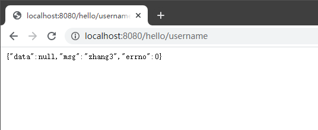
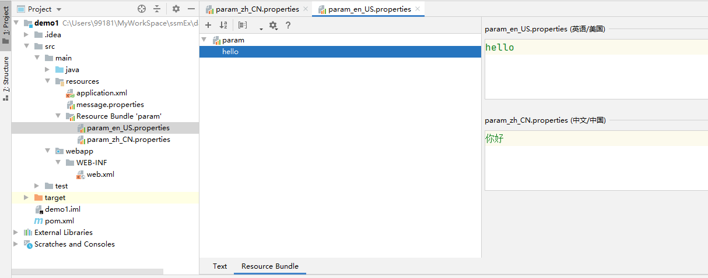
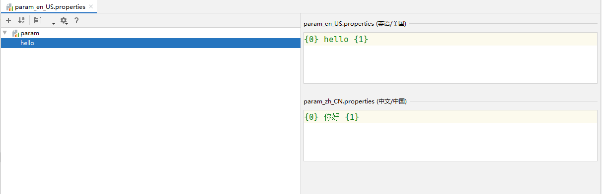

# 十、Spring MVC

## 目录

- [十、SpringMVC](#十springmvc)
  - [目录](#目录)
  - [1 SpringMVC](#1-springmvc)
    - [1.1 SpringMVC 概述](#11-springmvc-概述)
    - [1.2 Web 应用的目录结构](#12-web-应用的目录结构)
      - [1.2.1 服务器下的目录结构](#121-服务器下的目录结构)
      - [1.2.2 IDEA 中的目录结构](#122-idea-中的目录结构)
    - [1.3 入门案例](#13-入门案例)
      - [1.3.1 案例 1](#131-案例-1)
      - [1.3.2 案例 2](#132-案例-2)
    - [1.4 @RequestMapping 注解](#14-requestmapping-注解)
      - [1.4.1 url 路径映射](#141-url-路径映射)
      - [1.4.2 请求方法限定](#142-请求方法限定)
      - [1.4.3 请求参数限定](#143-请求参数限定)
      - [1.4.4 请求 headler 限定](#144-请求-headler-限定)
    - [1.5 handler 的返回值](#15-handler-的返回值)
      - [1.5.1 处理视图层](#151-处理视图层)
      - [1.5.2 不处理视图层（json）](#152-不处理视图层json)
    - [1.6 handler 形参](#16-handler-形参)
      - [1.6.1 post 请求乱码](#161-post-请求乱码)
      - [1.6.2 使用 request 封装](#162-使用-request-封装)
      - [1.6.3 自动封装](#163-自动封装)
      - [1.6.4 SpringMVC 不包括的 converter。](#164-springmvc-不包括的-converter)
      - [1.6.5 File](#165-file)
      - [1.6.6 cookie 和 session](#166-cookie-和-session)
      - [1.6.7 json 数据作为形参](#167-json-数据作为形参)
    - [1.7 RESTful](#17-restful)
      - [1.7.1 @PathVaria](#171-pathvaria)
      - [1.7.2 @RequestParam](#172-requestparam)
      - [1.7.3 @RequestHeader](#173-requestheader)
      - [1.7.4 @CookieValue](#174-cookievalue)
      - [1.7.5 @SessionAttribute](#175-sessionattribute)
    - [1.8 静态资源处理](#18-静态资源处理)
      - [1.8.1 默认的 servlet](#181-默认的-servlet)
      - [1.8.2 默认的 servlet 对应的 handler](#182-默认的-servlet-对应的-handler)
      - [1.8.3 静态资源映射](#183-静态资源映射)
    - [1.8 异常处理](#18-异常处理)
      - [1.8.1 统一的异常处理器](#181-统一的异常处理器)
      - [1.8.2 针对异常 handler 处理](#182-针对异常-handler-处理)
  - [2 HandlerInterceptor](#2-handlerinterceptor)
    - [2.1 Spring MVC 拦截器概述](#21-spring-mvc-拦截器概述)
    - [2.2 入门案例](#22-入门案例)
  - [3 国际化](#3-国际化)
    - [3.1 Locale](#31-locale)
    - [3.2 MessageSource](#32-messagesource)
    - [3.3 i18n](#33-i18n)
    - [3.4 getMessag](#34-getmessag)
  - [4 Hibernate-Validator](#4-hibernate-validator)
    - [4.1 入门案例](#41-入门案例)
    - [4.2 常见注解](#42-常见注解)
  - [5 整合 Spring 和 SpringMVC](#5-整合-spring-和-springmvc)
    - [5.1 Spring 容器和 SpringMVC 容器的分家](#51-spring-容器和-springmvc-容器的分家)
    - [5.2 使用 javaconfig 来使用 SpringMVC](#52-使用-javaconfig-来使用-springmvc)
      - [5.2.1 web.xml 启动类](#521-webxml-启动类)
      - [5.2.2 Spring 配置类](#522-spring-配置类)
      - [5.2.3 SpringMVC 配置类](#523-springmvc-配置类)
    - [5.3 SpringMVC 的组件](#53-springmvc-的组件)
      - [5.3.1 characterEncodingFilter](#531-characterencodingfilter)
      - [5.3.2 静态资源映射](#532-静态资源映射)
      - [5.3.3 interceptor 过滤器](#533-interceptor-过滤器)
      - [5.3.4 converter](#534-converter)
      - [5.3.5 multipartResolver](#535-multipartresolver)
      - [5.3.6 localeResolver](#536-localeresolver)
      - [5.3.7 MessageSource](#537-messagesource)
      - [5.3.8 validator](#538-validator)
      - [5.3.9 viewResolver](#539-viewresolver)
      - [5.3.10 HandlerExceptionResolver](#5310-handlerexceptionresolver)

## 1 Spring MVC

### 1.1 Spring MVC 概述

Spring MVC：
- Spring 提供的 MVC 框架。

- 是 Spring 框架的一部分，负责表示层。


目标是消灭 servlet：提供了一个统一的处理器 DispatcherServlet。 


Spring MVC 架构：
<div align="center">
<br>

</div

### 1.2 Web 应用的目录结构

#### 1.2.1 服务器下的目录结构

```
webroot 应用根目录
|
|--html、jsp、css、js 文件等
|
|--WEB-INF
|    |
|    |--classes
|    |   |
|    |   |--classpath：编译后的字节码文件和配置文件
|    |
|    |--lib
|    |   |
|    |   |--Java 类运行所需要的 jar 包（pom 文件中 scop 为 compiled、runtime）
|    |
|    |--web.xml
|    |
|    |--不能直接访问的视图文件、静态资源
```

#### 1.2.2 IDEA 中的目录结构

```
mudule
|
|--src
|   |--main
|   |
|   |   |
|   |   |--java
|   |   |
|   |   |--reources
|   |   |
|   |   |--webapp
|   |   |   |
|   |   |   |--WEB-INF
|   |   |   |    |
|   |   |   |    |--web.xml
|   |   |   |    |
|   |   |   |    |--不能直接访问的视图文件、静态资源
|   |   |   |
|   |   |   |--html、jsp、css、js 文件等
|   |
|   |--test
|
|--pom.xml
```

### 1.3 入门案例

#### 1.3.1 案例 1

**第一步**：引入依赖、配置为 IDEA 中的标准 Web 应用。

Spring MVC：spring-web、spring-webmvc、servlet-api（provided）。

```xml
<packaging>war</packaging>

<dependencies>
    <dependency>
        <groupId>org.springframework</groupId>
        <artifactId>spring-webmvc</artifactId>
        <version>5.2.6.RELEASE</version>
    </dependency>
    <dependency>
        <groupId>javax.servlet</groupId>
        <artifactId>servlet-api</artifactId>
        <version>3.0-alpha-1</version>
        <scope>provided</scope>
    </dependency>
</dependencies>
```

**第二步**：配置 DispatcherServlet。

```xml
<!--注册 DispatcherServlet-->
<servlet>
    <servlet-name>dispatcherServlet</servlet-name>
    <!--dispatcherServlet 的全类名-->
    <servlet-class>org.springframework.web.servlet.DispatcherServlet</servlet-class>
    <!-- 加载 xml 配置文件 -->
    <init-param>
        <param-name>contextConfigLocation</param-name>
        <param-value>classpath:application.xml</param-value>
    </init-param>
</servlet>
<servlet-mapping>
    <servlet-name>dispatcherServlet</servlet-name>
    <url-pattern>/</url-pattern>
</servlet-mapping>
```

**第三步**：注册组件、添加视图。

```java
@Component("/hello")    // 组件 id 和请求 url 建立映射关系 → 在 handleRequest 方法中处理该请求 url 对应的请求
public class HelloHandler implements Controller {
    @Override
    public ModelAndView handleRequest(HttpServletRequest httpServletRequest, HttpServletResponse httpServletResponse) throws Exception {

        // 处理 model 数据，处理视图层的跳转
        ModelAndView modelAndView = new ModelAndView();
        // 相对于 webapp 的视图名
        modelAndView.setViewName("/WEB-INF/view/hello.jsp");
        // model 添加 key
        modelAndView.addObject("nowTime", new Date());
        return modelAndView;
    }
}
```

```xml
<context:component-scan base-package="com.gyh"/>
<!--HandlerMapping-->
<!--通过 handler 组件的 id 和请求 url 建立映射关系-->
<bean class="org.springframework.web.servlet.handler.BeanNameUrlHandlerMapping"/>
<!--HandlerAdapter-->
<!--适配的是 SimpleController 类型的 Handler-->
<bean class="org.springframework.web.servlet.mvc.SimpleControllerHandlerAdapter"/>
<!--Handler → 组件-->
<!--通过 @Component 注解注册-->
```

```jsp
<%@ page contentType="text/html;charset=UTF-8" language="java" %>
<html>
<head>
    <title>hello</title>
</head>
<body>
    hello<br>
    ${nowTime}
</body>
</html>
```

**第四步**：配置 Tomcat。

**第五步**：运行。

<div align="center">

</div>

#### 1.3.2 案例 2

**第一步**：同案例 1，搭建一个 Spring MVC 的 Web 应用。

**第二步**：引入 mvc 标签。

```xml
xmlns:mvc="http://www.springframework.org/schema/mvc"

xsi:schemaLocation="http://www.springframework.org/schema/mvc https://www.springframework.org/schema/mvc/spring-mvc.xsd"
```

```xml
<context:component-scan base-package="com.gyh"/>
<mvc:annotation-driven/>
```

**第三步**：注册 controller 组件。

```java
@Controller
public class HelloHandler{

    // handler 方法
    @RequestMapping("hello")    // value 属性对应请求 url
    public ModelAndView hello() {

        ModelAndView modelAndView = new ModelAndView();
        // 相对于 webapp 的视图名
        modelAndView.setViewName("/WEB-INF/view/hello.jsp");
        // model 添加 key
        modelAndView.addObject("nowTime", new Date());
        return modelAndView;
    }
}
```

**第四步**：运行。


### 1.4 @RequestMapping 注解

#### 1.4.1 url 路径映射

通过 `@RequestMapping` 注解的 value 属性将 handler 方法和请求 url 建立映射关系。

**拓展 1**：可以将多个请求 url 映射到同一个 handler 方法上。  
示例：
```java
@RequestMapping(value = {"hello", "hello2", "hello3"})
```

**拓展 2**：url 可以使用 `*` 来通配。  
示例：
```java
@RequestMapping(value = {"hel*", "hello/*"}) 
```
则通过 `/hello` 或者 `/hello/123` 都能访问到。

**拓展 3**：窄化请求映射：类名上添加 `@RequestMapping` 注解，可以和方法上的注解结合使用。  
示例：
```java
@Controller
@RequestMapping("user")
public class HelloHandler{

    @RequestMapping("hello")
    public ModelAndView hello() {

        ModelAndView modelAndView = new ModelAndView();
        modelAndView.setViewName("/WEB-INF/view/hello.jsp");
        modelAndView.addObject("nowTime", new Date());
        return modelAndView;
    }

    @RequestMapping("hello2")
    public ModelAndView hello2() {

        ModelAndView modelAndView = new ModelAndView();
        modelAndView.setViewName("/WEB-INF/view/hello.jsp");
        modelAndView.addObject("nowTime", new Date());
        return modelAndView;
    }
}
```
这样更方便书写 `/user/hello` 和 `/user/hello1` 请求。


#### 1.4.2 请求方法限定

在 `@RequestMapping` 注解可以增加 method 属性。

示例：
```java
@RequestMapping(value = "hello", method = RequestMethod.GET)

// 也可以添加多个 method 属性
@RequestMapping(value = "hello", method = {RequestMethod.GET, RequestMethod.POST})
```

引申的注解：
- `@GetMapping`：`@RequestMapping(method=GET)`

- `@PostMapping`：`@RequestMapping(method=POST)`

通过限制请求方法，同一个 url 可以映射到不同的 handler 方法上。  
示例：
```java
@GetMapping("login")

@PostMapping("login")
```


#### 1.4.3 请求参数限定

在 `@RequestMapping` 的注解中增加 param 属性。  
示例：
```java
@RequestMapping(value = "hello", params = {"username", "pwd"})
```

注：多个请求参数之间的关系是 and。

#### 1.4.4 请求 headler 限定

在 `@RequestMapping` 的注解中增加 headers 属性。  
示例：
```java
@RequestMapping(value = "hello", headers = {"hd=qwer"})
```

两个特殊的限定：
- produces 限定 Accept。  

- consumes 限定 Content-Type。  

示例：
```java
@RequestMapping(value = "hello", produces = "application/json")
```
```java
@RequestMapping(value = "hello", consumes = "application/zip")
```

### 1.5 handler 的返回值

#### 1.5.1 处理视图层

**情形 1**：返回值为 void。

使用 request 和 response。  

示例：
```java
// 不建议使用
@RequestMapping("void")
public void aVoid(HttpServletRequest request, HttpServletResponse response) throws ServletException, IOException {
    request.setAttribute("nowTime", new Date());
    request.getRequestDispatcher("/WEB-INF/view/void.jsp").forward(request,response);
}
```

**情形 2**：返回 ModelAndView。

示例：
```java
@RequestMapping("modelAndView")
public ModelAndView modelAndView(){
    ModelAndView modelAndView = new ModelAndView();
    modelAndView.setViewName("/WEB-INF/view/modelAndView.jsp");
    return modelAndView;
}
```

**情形 3**：返回为 Sring。

物理视图名：Model 在形参中。  
示例：
```java
/**
* @param model
* @return 物理视图名
*/
// 返回值为字符串 String
@RequestMapping("physical/viewname")
public String physicalViewname(Model model){
    model.addAttribute("nowTime", new Date());
    return "/WEB-INF/view/string.jsp";  // 返回值为 viewName
}
```

逻辑视图名：配合组件 viewResolver，书写时省略前缀后缀。  
示例：
```xml
<!--最终的视图名 = 前缀 + 逻辑视图名 + 后缀-->
<bean class="org.springframework.web.servlet.view.InternalResourceViewResolver">
    <!--逻辑视图名的前缀-->
    <property name="prefix" value="/WEB-INF/view/"/>
    <!--逻辑视图名的后缀-->
    <property name="suffix" value=".jsp"/>
</bean>
```

```java
/**
* @param model
* @return 逻辑视图名
*/
@RequestMapping("logical/viewname")
public String logicalViewname(Model model){
    model.addAttribute("nowTime", new Date());
    return "string";    // 最终 viewName = 前缀 + 逻辑视图名 + 后缀
}
```
注：配置组件 viewResolver 后，modelAndView 中 viewName 、物理视图名的返回值也会拼接，即所有的返回值为字符串都会做一个拼接。

转发重定向。转发和重定向的是请求，而不是 jsp。  
示例：
```java
/**
* 用来接收转发和重定向
* @return
*/
@RequestMapping("hello")
public String hello(){
    return "hello";
}

/**
* @return
* forward：转发的 url，注意转发的 url 最前面加上 /
*/
@RequestMapping("forward")
public String forward(){
    return "forward:/return/view/hello";
}

/**
* @return
* redirect：重定向的 url，注意重定向的 url 最前面加上 /
* 状态码 302
*/
@RequestMapping("redirect")
public String redirect(){

    return "redirect:/return/view/hello";
}
```

#### 1.5.2 不处理视图层（json）

首先新增依赖：
```xml
<dependency>
    <groupId>com.fasterxml.jackson.core</groupId>
    <artifactId>jackson-databind</artifactId>
    <version>2.11.0</version>
</dependency>
```

然后给类添加注解 `@RestController` 或者给方法添加注解 `@ResponseBody`。

示例：
```java
//@Controller
@RestController
public class JsonController {

    @RequestMapping("user/query")
    //@ResponseBody
    public User queryUser(){
        User user = new User("zhang3", "123456");
        return user;
    }
}
```

### 1.6 handler 形参

请求参数的封装。

#### 1.6.1 post 请求乱码

web.xml 添加 filter：CharacterEncodingFilter。
```xml
<filter>
    <filter-name>characterEncodingFilter</filter-name>
    <filter-class>org.springframework.web.filter.CharacterEncodingFilter</filter-class>
    <init-param>
        <!-- 强制编码 -->
        <param-name>forceEncoding</param-name>
        <param-value>true</param-value>
    </init-param>
    <init-param>
        <!-- 编码类型 -->
        <param-name>encoding</param-name>
        <param-value>utf-8</param-value>
    </init-param>
</filter>
<filter-mapping>
    <filter-name>characterEncodingFilter</filter-name>
    <url-pattern>/*</url-pattern>
</filter-mapping>
```


#### 1.6.2 使用 request 封装

使用 JavaEE 的封装形式（不推荐）：
```html
<body>
<h1>通过 request 获得请求参数</h1>
<form action="/parameter/request" method="post">
    用户：<input type="text" name="username"><br>
    密码：<input type="text" name="password"><br>
    <input type="submit">
</form><hr>
</body>
```

```java
/**
 * handler 方法的请求参数封装
 */
@RestController
@RequestMapping("parameter")
public class ParameterController {

    @RequestMapping("request")
    public User request(HttpServletRequest request){
        String username = request.getParameter("username");
        String password = request.getParameter("password");
        User user = new User(username, password);
        return user;
    }
}
```

#### 1.6.3 自动封装

由 Spring MVC 提供格式转换。  

**方式 1**：直接写在 handler 方法的形参上。

要求：handler 方法的形参名和请求参数名一致（input 标签的 name 属性值）。

示例：
```html
<h1>直接在形参中封装请求参数</h1>
<form action="/parameter/base" method="post">
    用户：<input type="text" name="username"><br>
    密码：<input type="text" name="password"><br>
    <input type="submit">
</form>
```

```java
@RequestMapping("base")
public User base(String username, String password){
    User user = new User();
    user.setUsername(username);
    user.setPassword(password);
    return user;
}
```

**方式 2**：封装为 javabean。

要求：handler 方法的形参使用 javabean，这个 javabean 的成员变量名和请求参数名一致（input 标签的 name 属性值）。
- 可以为多级 javabean（嵌套 javabean），使用 `.` 分开多级成员变量名。

- 也可以为数组数据和 List。  
  数组：要求多个请求参数名一致。  
  List：通过下标进行分组，list 类型对应的成员变量名后。

```jsp
<form action="/user/register" method="post">
    用户名：<input type="text" name="username"><br>
    密码：<input type="password" name="pwd"><br>
    生日：<select name="birthday.year">
            <option>1995</option>
            <option selected="selected">1996</option>
            <option>1997</option>
        </select>年
        <select name="birthday.month">
            <option>1</option>
            <option selected="selected">2</option>
            <option>3</option>
        </select>月
        <select name="birthday.day">
            <option>1</option>
            <option selected="selected">2</option>
            <option>3</option>
        </select>日<br>
    爱好 1：<input type="text" name="hobbies"><br>
    爱好 2：<input type="text" name="hobbies"><br>
    爱好 3：<input type="text" name="hobbies"><br>
    <input type="Submit">
</form><hr>
```

```java
@RequestMapping("javabean")
public User javabean(User user){

    return user;
}
```

#### 1.6.4 Spring MVC 不包括的 converter。

converter：请求参数的类型转换。

若使用日期：Spring MVC 不能够直接转换 date，但是呢可以通过 `@DateTimeFormat` 注解，指定 date 日期的格式来转换。  
示例：
```java
@RestController
public class ParameterController {

    @Autowired
    ConfigurableConversionService conversionService;

    @RequestMapping("parameter/date")
    public String data(@DateTimeFormat(pattern = "yyyy-mm-dd") Date birthday){
        System.out.println(birthday);
        return "ok";
    }
}
```

对于不能转换的，就需要自定义 converter。  

**第一步**：自定义 converter。

把不能自动封装的数据转换成形参中（或 javabean 成员变量）接收的数据类型。

示例：
```java
@Component
public class String2DateConverter implements Converter<String, Date> {
    @Override
    public Date convert(String s) {
        Date date = null;
        try {
            date = new SimpleDateFormat("yyyy-mm-dd").parse(s);
        } catch (ParseException e) {
            e.printStackTrace();
        }
        return date;
    }
}
```

**第二步**：配置。

```java
<mvc:annotation-driven conversion-service="conversionService"/>

<bean id="conversionService" class="org.springframework.format.support.FormattingConversionServiceFactoryBean">
    <property name="converters">
        <set>
            <ref bean="string2DateConverter"/>
        </set>
    </property>
</bean>
```

**第三步**：使用。

```java
@RestController
public class ParameterController {

    @RequestMapping("date")
    public String date(Date birthday) {
        return birthday.toString();
    }
}
```

#### 1.6.5 File

File 也可以直接在形参中接收。

**第一步**：导包。

```xml
<dependency>
    <groupId>commons-fileupload</groupId>
    <artifactId>commons-fileupload</artifactId>
    <version>1.4</version>
</dependency>
```

**第二步**：注册组件。

```xml
<!--id 为指定值，不能修改为其他值-->
<bean id="multipartResolver" class="org.springframework.web.multipart.commons.CommonsMultipartResolver">
    <property name="maxUploadSize" value="500000"/>
</bean>
```

**第三步**：使用。

```jsp
<h1>单文件上传</h1>
<form action="/file/upload" enctype="multipart/form-data" method="post">
    <input type="file" name="myfile"><br>
    <input type="submit">
</form><hr>

<h1>多文件上传</h1>
<form action="/files/upload" enctype="multipart/form-data" method="post">
    <input type="file" multiple name="myfiles"><br>
    <input type="file" multiple name="myfiles"><br>
    <input type="submit">
</form>
```

```java
// 单文件上传
@RequestMapping("file/upload")
public String fileUpload(MultipartFile myfile){

    String originalFilename = myfile.getOriginalFilename();
    File file = new File("D:\\spring\\upload", originalFilename);
    try {
        myfile.transferTo(file);
    } catch (IOException e) {
        e.printStackTrace();
    }
    return "ok";
}

// 多文件上传
@RequestMapping("files/upload")
public String filesUpload(MultipartFile[] myfiles){
    String parent = "D:\\spring\\upload";
    for (MultipartFile myfile : myfiles) {
        String originalFilename = myfile.getOriginalFilename();
        // 文件名有可能发生重复，可以利用 uuid 改写上传后的文件名
        String s = UUID.randomUUID().toString();
        File file = new File(parent, originalFilename);
        try {
            myfile.transferTo(file);
        } catch (IOException e) {
            e.printStackTrace();
        }
    }
    return "ok";
}
```

#### 1.6.6 cookie 和 session

**（1）通过 request 获得**  

```java
@RequestMapping("get/cookie")
public String getCookie(HttpServletRequest request){
    Cookie[] cookies = request.getCookies();
    for (Cookie cookie : cookies) {
        String name = cookie.getName();
        String value = cookie.getValue();
        System.out.println("cookie 的 key 为" + name + ", value 为" + value);
    }
    return "ok";
}


@RequestMapping("put/session")
public String putSession(HttpServletRequest request,String username){
    HttpSession session = request.getSession();
    session.setAttribute("username", username);
    System.out.println("putSession 方法向 session 放入 key 为 username 所对应的值为：" + username);
    return "ok";
}


@RequestMapping("get/session")
public String getSession(HttpServletRequest request){
    HttpSession session = request.getSession();
    Object username = session.getAttribute("username");
    System.out.println("getSession 方法取出 username 对应的值为：" + username);
    return "ok";
}
```

**（2）HttpSession 写到形参**

```java
// 直接在形参中获得 session
@RequestMapping("get/session")
public String getSession(HttpSession session){

    Object username = session.getAttribute("username");
    System.out.println("getSession 方法取出 username 对应的值为：" + username);
    return "ok";
}
```

#### 1.6.7 json 数据作为形参

首先需要新增依赖：
```xml
<dependency>
    <groupId>com.fasterxml.jackson.core</groupId>
    <artifactId>jackson-databind</artifactId>
    <version>2.11.0</version>
</dependency>
```

然后通过 `@RequestBody` 注解即可使用。  
示例：
```java
@PostMapping("login")
public BaseRespVo login(@RequestBody User user){

    BaseRespVo baseRespVo = new BaseRespVo();
    baseRespVo.setData(user);
    baseRespVo.setMsg("注册成功");
    baseRespVo.setErrno(0);
    return baseRespVo;
}
```

`@RequestBody` 注解除了以 javabean 来接收 json 数据，还可以以通过 map 来接收。

```java
@RequestMapping("login")
public BaseRespVo login(@RequestBody Map map){

    BaseRespVo baseRespVo = new BaseRespVo();
    baseRespVo.setData(map);
    baseRespVo.setMsg("注册成功");
    baseRespVo.setErrno(0);
    return baseRespVo;
}
```


### 1.7 RESTful


RESTful（Representational State Transfer）：表现层状态转换。

#### 1.7.1 @PathVaria

拿到请求 url 中的一部分作为请求参数（最常用）。

示例：
```java
@RequestMapping("{userValue}/article/detail/{articleIdValue}")
public BaseRespVo queryArticleDetail(@PathVariable("userValue") String user,
                                        @PathVariable("articleIdValue") Integer articleId){
    Article article = new Article();
    article.setUser(user);
    article.setArticleId(articleId);
    //BaseRespVo<Article> articleBaseRespVo = new BaseRespVo<>();
    //articleBaseRespVo.setData(article);
    //articleBaseRespVo.setErrno(0);
    //articleBaseRespVo.setMsg("成功查询文章信息");
    //return articleBaseRespVo;
    return BaseRespVo.ok(article, "成功查询文章信息");
}
```


#### 1.7.2 @RequestParam

拿到请求参数作为 handler 方法的形参。  
示例：
```java
@RequestMapping(value = "login")
public BaseRespVo login(@RequestParam("username") String usernameValue,
                        @RequestParam("password") String passwordValue){
    User user = new User();
    user.setUsername(usernameValue);
    user.setPassword(passwordValue);
    return BaseRespVo.ok(user);
}
```

注：请求参数名之前是和 handler 方法的形参名对应的，增加对应的 `@RequestParam` ，该注解中的 value 要和请求参数名对应。即增加注解后，形参名可以修改。


#### 1.7.3 @RequestHeader

拿到请求头中的值作为请求参数。  
示例：
```java
@RequestMapping("fetch/header")
public BaseRespVo fetchHeader(@RequestHeader("Accept") String[] acceptArray,
                                @RequestHeader("Accept-Encoding") String acceptEncoding,
                                @RequestHeader("Accept-Language") String acceptLanguage){

    return BaseRespVo.ok();
}
```

注：通过 `@RequestHeader` 注解指定请求头的 key，在形参中增加注解。handler 方法的形参可以接收 String，也可以接收 String 数组（通过逗号分隔为数组）。

#### 1.7.4 @CookieValue

示例：
```java
@RequestMapping("fetch/cookie/value")
public BaseRespVo fetchCookieValue(@CookieValue("zhang3") String value){

    return BaseRespVo.ok();
}
```


#### 1.7.5 @SessionAttribute

示例：
```java
@RequestMapping("fetch/session/value")
public BaseRespVo fetchSessionValue(@SessionAttribute("username") String username){

    return BaseRespVo.ok();
}
```

### 1.8 静态资源处理

#### 1.8.1 默认的 servlet

配置 web.xml：
```xml
<!--<servlet-mapping>
    <servlet-name>default</servlet-name>
    <url-pattern>*.jpg</url-pattern>
</servlet-mapping>
<servlet-mapping>
    <servlet-name>default</servlet-name>
    <url-pattern>*.png</url-pattern>
</servlet-mapping>-->
```

#### 1.8.2 默认的 servlet 对应的 handler

```xml
<mvc:default-servlet-handler/>
```

#### 1.8.3 静态资源映射

请求 url 和静态资源所处的路径建立映射映射，通过请求 url 可以访问到对应路径的静态资源。

静态资源映射路径：
- classpath（java\ 和 resources → 打包后 war 里 WEB-INF/classes）

- web 根路径（webapp → 打包后的根目录）

- 纯文件系统的映射。

访问静态资源所需要的 url：mapping 中的值 + 静态资源相对于 location 的值。
- mapping 是和请求 url 相关的，`**` 就是通配多级 url。

- location 文件真实存在的路径：classpath、web 根路径、file文件路径。

示例：
```xml
<!--classpath 路径-->
<mvc:resources mapping="/pic1/**" location="classpath:/"/>

<!--web 根路径-->
<mvc:resources mapping="/pic2/**" location="/"/>

<mvc:resources mapping="/pic3/**" location="/WEB-INF/pic/"/>

<!--文件路径-->
<mvc:resources mapping="/pic4/**" location="file:D:/spring/pic/"/>
```

### 1.8 异常处理

#### 1.8.1 统一的异常处理器

发生了异常都进入到该处理器中处理，针对 ModelAndView。

示例：
```java
/**
 * 当 handler 方法发生异常，异常向上抛出，通过该统一的异常处理器处理
 * 只需要实现接口，然后注册到容器中就可以了
 */
//@Component
public class CustomHandlerExceptionResolver implements HandlerExceptionResolver {
    @Override
    public ModelAndView resolveException(HttpServletRequest httpServletRequest,
                                         HttpServletResponse httpServletResponse,
                                         Object handler, Exception exception) {

        ModelAndView modelAndView = new ModelAndView();
        modelAndView.setViewName("/WEB-INF/view/exception.jsp");
        if (exception instanceof CustomException) {
            modelAndView.addObject("message", "自定义异常");
        } else {
            String message = exception.getMessage();
            modelAndView.addObject("message", message);
        }
        return modelAndView;
    }
}
```

```java
@RequestMapping("view")
public String view(int id) throws Exception {
    if (id == 1) {
        throw new Exception("id 不能为 1");
    } else if (id == 2){
        throw new CustomException();
    }
    return "/WEB-INF/view/view.jsp";
}
```


#### 1.8.2 针对异常 handler 处理

通过 handler 处理指定异常， ModelAndView 和 json 都能处理。

示例：
```java
@ControllerAdvice
// 如果所有的 handler 处理的都是 json 数据，那么可以在类上增加 @ResponseBody
public class ExceptionControllerAdvice {

    // 处理 ModelAndView
    @ExceptionHandler(CustomException.class)
    public String handleException(){
        return "/WEB-INF/view/view.jsp";
    }

    // 处理 json
    @ResponseBody
    @ExceptionHandler(ParameterException.class)
    public BaseRespVo handleException2(ParameterException exception){
        return BaseRespVo.fail();
    }

    // 处理 json
    @ResponseBody
    @ExceptionHandler(value = {CustomException2.class, CustomException3.class})
    public BaseRespVo handleManyException(Exception exception){
        return BaseRespVo.fail();
    }
}
```

```java
@RequestMapping("json")
@ResponseBody
public BaseRespVo json(int id) throws Exception {
    if (id == 1) {
        throw new CustomException();
    } else if (id == 2) {
        throw new ParameterException();
    }
    return BaseRespVo.ok();
}
```

## 2 HandlerInterceptor

### 2.1 Spring MVC 拦截器概述

Spring MVC 的处理器拦截器类似于 Servlet 开发中的过滤器 Filter，用于对处理器进行预处理和后处理。

常见使用场景
- 日志记录：记录请求信息的日志，以便进行信息监控、信息统计、计算 PV（Page View）等。

- 权限检查：如登录检测，进入处理器检测检测是否登录，如果没有直接返回到登录页面。

- 性能监控：有时候系统在某段时间莫名其妙的慢，可以通过拦截器在进入处理器之前记录开始时间，在处理完后记录结束时间，从而得到该请求的处理时间 ；

- 通用行为：读取cookie得到用户信息并将用户对象放入请求，从而方便后续流程使用，还有如提取 Locale、Theme 信息等，只要是多个处理器都需要的即可使用拦截器实现。

- OpenSessionInView：如 Hibernate，在进入处理器打开 Session，在完成后关闭 Session。


HandlerInterceptor 接口中提供了 3 个方法：
- `public boolean preHandle(HttpServletRequest request, HttpServletResponse response, Object handler)`：预处理。  
  通过 request 可以拿到参数、cookie、session，还可以拿到 requestDispather 实现页面跳转。

- `public void postHandle(HttpServletRequest request, HttpServletResponse response, Object handler, @Nullable ModelAndView modelAndView)`：后处理。

- `public void afterCompletion(HttpServletRequest request, HttpServletResponse response, Object handler, @Nullable  Exception ex)`：收尾。  
- 当前的 intercepter 的 preHandler 返回值为 true 时，它类似 `finally`。

注：多个 interceptor 执行情况先进后出，类似 `123 321 321`。


### 2.2 入门案例

第一步：注册组件。

```java
@Component
public class CustomHandlerInterceptor implements HandlerInterceptor {

    @Override
    public boolean preHandle(HttpServletRequest request,
                             HttpServletResponse response, Object handler) throws Exception {
        System.out.println("prehandle");
        return true;
    }

    @Override
    public void postHandle(HttpServletRequest request, HttpServletResponse response,
                           Object handler, ModelAndView modelAndView) throws Exception {
        System.out.println("postHandle");
        // 可以修改 handler 方法返回的 ModelAndView
        // modelAndView.setViewName("/WEB-INF/post.jsp");
    }

    @Override
    public void afterCompletion(HttpServletRequest request, HttpServletResponse response,
                                Object handler, Exception ex) throws Exception {
        System.out.println("afterCompletion");
    }
}
```

第二步：Spring 配置。

```xml
<mvc:interceptors>
    <!--默认作用范围是 DispatcherServlet 的范围，即 /-->

    <!--mvc:mapping 标签中 path 属性，配置 interceptor 的作用范围 → 写法和 mvc：resources 标签中 mapping 类似-->
    <!--* 代表一级任意目录 ** 代表多级任意目录-->
    <mvc:interceptor>
        <mvc:mapping path="/hello/**"/>
        <ref bean="customHandlerInterceptor"/>
    </mvc:interceptor>
</mvc:interceptors>
```

## 3 国际化

### 3.1 Locale

语言处理，国际化基础。

注册组件：
```xml
<!--CookieLocaleResolver 和 SessionLocaleResolver 通常 2 选 1 → 通常使用的是 cookieLocaleResolver-->
<!--需要指定 id 为 localeResolver，不能够修改为其他的值-->
<bean id="localeResolver" class="org.springframework.web.servlet.i18n.CookieLocaleResolver">
    <property name="cookieName" value="language"/>
    <property name="defaultLocale" value="zh_CN"/>
</bean>
<!--<bean class="org.springframework.web.servlet.i18n.SessionLocaleResolver"/>-->
```

### 3.2 MessageSource

是通过 key 从配置文件中取出值，利用 MessageSource 组件。

注册组件：
```xml
<bean id="messageSource" class="org.springframework.context.support.ReloadableResourceBundleMessageSource">
    <!--basename: 加载的配置文件的-->
    <property name="basename" value="classpath:param"/>
    <!--如果配置文件中有中文，编码要写的和你配置文件的编码一致-->
    <property name="defaultEncoding" value="utf-8"/>
    <!--如果没有对应的 key，是否选择 key 作为对应的 value-->
    <property name="useCodeAsDefaultMessage" value="true"/>
</bean>
```

param.properties：
```properties
userz.username=zhang3
userz.password=123456
```

使用：
```java
@Autowired
MessageSource messageSource;

@RequestMapping("hello/{key}")
public BaseRespVo hello(@PathVariable("key") String key){
    key = "userz." + key;
    String message = messageSource.getMessage(key, null, Locale.getDefault());

    return BaseRespVo.ok(null, message);
}
```

<div>

</div>

### 3.3 i18n

利用 MessageSource 和 localeResolver 来做 i18n。

**第一步**：注册组件。

```xml
<bean id="messageSource" class="org.springframework.context.support.ReloadableResourceBundleMessageSource">

    <property name="basename" value="classpath:param"/>
    <property name="defaultEncoding" value="utf-8"/>
    <property name="useCodeAsDefaultMessage" value="true"/>
</bean>

<bean id="localeResolver" class="org.springframework.web.servlet.i18n.CookieLocaleResolver">
    <property name="cookieName" value="language"/>
    <property name="defaultLocale" value="zh_CN"/>
</bean>
```

**第二步**：创建国际化的 message 配置文件。

<div>

</div>

**第三步**：使用国际化获取 message。

```java
@RequestMapping("i18n/{key}")
public BaseRespVo i18n(@PathVariable("key") String key,Locale locale){

    String message = messageSource.getMessage(key, null, locale);

    return BaseRespVo.ok(null, message);
}
```

**第四步**：测试。

<div>
<br>

</div>

### 3.4 getMessag

MessageSource 源代码：
```java
public interface MessageSource {
    @Nullable
    String getMessage(String var1, @Nullable Object[] var2, @Nullable String var3, Locale var4);

    String getMessage(String var1, @Nullable Object[] var2, Locale var3) throws NoSuchMessageException;

    String getMessage(MessageSourceResolvable var1, Locale var2) throws NoSuchMessageException;
}
```

`getMessage`：
- `String var1`：key。
- `@Nullable Object[] var2`：给配置文件中的 message 赋值，作占位符。
- `Locale var3`：地区语言信息。


`@Nullable Object[] var2` 使用：
<div>

</div>

```java
@RequestMapping("i18n2/{param0}/{param1}")
public BaseRespVo i18n2(@PathVariable("param0") String param0,
                        @PathVariable("param1") String param1,
                        Locale locale){

    Object[] objects = {param0, param1};
    String message = messageSource.getMessage("hello", objects, locale);

    return BaseRespVo.ok(null, message);
}
```

<div>

</div>


## 4 Hibernate-Validator

将参数校验的逻辑，绑定在 javabean 上，校验 javabean 的成员变量。该 javabean 作为 handler 方法的形参来使用。

### 4.1 入门案例

**第一步**：新增依赖。

```xml
<!--hibernate-validator-->
<dependency>
    <groupId>org.hibernate.validator</groupId>
    <artifactId>hibernate-validator</artifactId>
    <version>6.0.18.Final</version>
</dependency>
```

**第二步**：注册 validator 组件。

```xml
<!--引用 validator 组件-->
<mvc:annotation-driven validator="validator"/>

<bean id="validator" class="org.springframework.validation.beanvalidation.LocalValidatorFactoryBean">
    <!--配置 HibernateValidator-->
    <property name="providerClass" value="org.hibernate.validator.HibernateValidator"/>
    <property name="validationMessageSource" ref="messageSource"/>
</bean>
```

**第三步**：配置 messageSource。

```properties
valid.username=username must between 6 and 8
valid.password=password must between 6 and 8
valid.age=age must between 18 and 150
valid.married=married must be false
```

```properties
valid.username=用户名长度为 6 到 8
valid.password=密码长度为 6 到 8
valid.age=年龄必须小于 150，必须大于 18
valid.married=必须为 false
```

**第四步**：使用。

```java
@Data
public class User {
    // 整合了 MessageSource 之后，可以直接在注解的 message 属性中引用 key
    @Size(min = 6, max = 8, message = "{valid.username}")
    String username;
    @Size(min = 6, max = 8, message = "{valid.password}")
    String password;
    @Min(value = 18 message = "{valid.age}")
    @Max(value = 150, message = "{valid.age}")
    int age;
    @AssertFalse(message = "{valid.married}")
    boolean married;
}
```
```java
// 在形参上增加 @Valid 或 @Validated
// handler 方法中增加一个参数 bindingResult，拿到校验过程的结果
@RequestMapping("register")
public BaseRespVo register(@Validated User user, BindingResult bindingResult){

    if (bindingResult.hasFieldErrors()){
        // 发生参数校验错误的成员变量
        FieldError fieldError = bindingResult.getFieldError();
        // 发生错误的成员变量名
        String field = fieldError.getField();
        // 拿到默认的 message 信息，和校验注解相关的
        String message = fieldError.getDefaultMessage();
        return BaseRespVo.fail(message);
    }
    return BaseRespVo.ok();
}
```

**第五步**：测试。

<div>
<br>

</div>


### 4.2 常见注解

常见的注解 （Bean Validation 中内置的 constraint）：  
| 注解 | 功能 |
| :- | :- |
| @Null | 被注释的元素必须为 null |
| @NotNull | 被注释的元素必须不为 null |
| @Size(max=, min=) | 被注释的元素的大小必须在指定的范围内 |
| @AssertTrue | 被注释的元素必须为 true |
| @AssertFalse | 被注释的元素必须为 false |
| @Min(value) | 被注释的元素必须是一个数字，其值必须大于等于指定的最小值 |
| @Max(value) | 被注释的元素必须是一个数字，其值必须小于等于指定的最大值 |
| @DecimalMin(value) | 被注释的元素必须是一个数字，其值必须大于等于指定的最小值 |
| @DecimalMax(value) | 被注释的元素必须是一个数字，其值必须小于等于指定的最大值 |
| @Digits (integer, fraction) | 被注释的元素必须是一个数字，其值必须在可接受的范围内 |
| @Past | 被注释的元素必须是一个过去的日期 Date |
| @Future | 被注释的元素必须是一个将来的日期 |
| @Pattern(regex=, flag=) | 被注释的元素必须符合指定的正则表达式 |


Hibernate Validator 附加的 constraint：  
| 注解 | 功能 |
| :- | :- |
| @NotBlank(message =) | 验证字符串非null，且长度必须大于0 |
| @Email | 被注释的元素必须是电子邮箱地址 |
| @Length(min=, max=) | 被注释的字符串的大小必须在指定的范围内 |
| @NotEmpty | 被注释的字符串的必须非空 |
| @Range(min=, max=, message=) | 被注释的元素必须在合适的范围内 |


## 5 整合 Spring 和 Spring MVC

Spring 容器和 Spring MVC 容器的分家：
<div>

</div>

### 5.1 XML 形式配置 Spring MVC 项目

**第一步**：添加 Spring 配置文件和 Spring MVC 配置文件。

application.xml：
```xml
<context:component-scan base-package="com.gyh">
    <!--Spring 容器移除 Controller-->
    <context:exclude-filter type="annotation" expression="org.springframework.stereotype.Controller"/>
</context:component-scan>
```

application-mvc.xml：
```xml
<context:component-scan base-package="com.gyh">
    <!--Spring MVC 容器仅添加 Controller-->
    <context:include-filter type="annotation" expression="org.springframework.stereotype.Controller"/>
</context:component-scan>

<mvc:annotation-driven/>
```

> `<mvc:annotation-driven>` 会自动注册 RequestMappingHandlerMapping 和 RequestMappingHandlerAdapter 这两个 Bean，这是 Spring MVC 为 @Controller 分发请求所必需的，并且提供了数据绑定支持，@NumberFormatannotation 支持，@DateTimeFormat 支持，@Valid 支持，读写 XML 的支持（JAXB）和读写 JSON 的支持（默认 Jackson）等功能。


**第二步**：在 web.xml 中加载配置文件。

```xml
<!--利用 listener 在 Spring MVC 配置文件加载之前加载 Spring 配置文件-->
<listener>
    <listener-class>org.springframework.web.context.ContextLoaderListener</listener-class>
</listener>
<context-param>
    <param-name>contextConfigLocation</param-name>
    <param-value>classpath:application.xml</param-value>
</context-param>

<!--Spring MVC 配置-->
<servlet>
    <servlet-name>dispatcherServlet</servlet-name>
    <servlet-class>org.springframework.web.servlet.DispatcherServlet</servlet-class>
    <init-param>
        <param-name>contextConfigLocation</param-name>
        <param-value>classpath:application-mvc.xml</param-value>
    </init-param>
</servlet>
<servlet-mapping>
    <servlet-name>dispatcherServlet</servlet-name>
    <url-pattern>/</url-pattern>
</servlet-mapping>
```

### 5.2 JavaConfig 形式配置 Spring MVC 项目

#### 5.2.1 方式一

**第一步**：添加依赖。
```xml
<dependency>
    <groupId>org.springframework</groupId>
    <artifactId>spring-webmvc</artifactId>
    <version>5.2.11.RELEASE</version>
</dependency>
<dependency>
    <groupId>javax.servlet</groupId>
    <artifactId>servlet-api</artifactId>
    <version>3.0-alpha-1</version>
</dependency>
```

**第二步**：添加配置文件。

```java
@Configuration
@ComponentScan(value = "com.gyh", 
        excludeFilters = @ComponentScan.Filter(type = FilterType.ANNOTATION, 
                value = {Controller.class, EnableWebMvc.class}))
public class SpringConfiguration {
}
```

```java
@EnableWebMvc
@ComponentScan(value = "com.gyh.controller",
        includeFilters = @ComponentScan.Filter(type = FilterType.ANNOTATION, 
                value = Controller.class))
public class WebConfiguration implements WebMvcConfigurer {
}
```

**第三步**：加载配置文件。

```java
public class ApplicationInitializer extends AbstractAnnotationConfigDispatcherServletInitializer {
    /**
     * 加载 Spring 的启动类
     */
    @Override
    protected Class<?>[] getRootConfigClasses() {
        return new Class[]{SpringConfiguration.class};
    }
    
    /**
     * 加载 Spring Mvc 的启动类
     */
    @Override
    protected Class<?>[] getServletConfigClasses() {
        return new Class[]{WebConfiguration.class};
    }

    /**
     * 配置 DispatcherServlet 的 url-pattern /
     */
    @Override
    protected String[] getServletMappings() {
        return new String[]{"/"};
    }
}
```

#### 5.2.2 方式二

**第一步**：添加依赖。

```xml
<dependency>
    <groupId>org.springframework</groupId>
    <artifactId>spring-webmvc</artifactId>
    <version>5.2.11.RELEASE</version>
</dependency>
<dependency>
    <groupId>javax.servlet</groupId>
    <artifactId>javax.servlet-api</artifactId>
    <version>4.0.1</version>
    <scope>provided</scope>
</dependency>
```

**第二步**：添加配置文件。

```java
@Configuration
@ComponentScan(basePackages = "com.gyh", useDefaultFilters = true,
        excludeFilters = {@ComponentScan.Filter(type = FilterType.ANNOTATION,
                classes = Controller.class)})
public class SpringConfig {
}
```

```java
@Configuration
@ComponentScan(basePackages = "com.gyh", useDefaultFilters = false,
        includeFilters = {@ComponentScan.Filter(type = FilterType.ANNOTATION,
                classes = Controller.class), @ComponentScan.Filter(type = FilterType.ANNOTATION,
                classes = Configuration.class)})
public class SpringMVCConfig {
}
```

**第三步**：加载配置文件。

```java
public class WebInit implements WebApplicationInitializer {
    @Override
    public void onStartup(ServletContext servletContext) throws ServletException {
        AnnotationConfigWebApplicationContext ctx = new AnnotationConfigWebApplicationContext();
        ctx.setServletContext(servletContext);
        ctx.register(SpringMVCConfig.class);

        ServletRegistration.Dynamic springmvc = servletContext.addServlet("springmvc", new DispatcherServlet(ctx));
        springmvc.addMapping("/");
        springmvc.setLoadOnStartup(1);
    }
}
```

### 5.3 Spring MVC 的组件

#### 5.3.1 characterEncodingFilter

启动类中：

```java
@Override
protected Filter[] getServletFilters() {
    CharacterEncodingFilter filter = new CharacterEncodingFilter();
    filter.setForceEncoding(true);
    filter.setEncoding("utf-8");
    return new Filter[]{filter};
}
```

#### 5.3.2 静态资源映射

```java
@Override
public void addResourceHandlers(ResourceHandlerRegistry registry) {
    registry.addResourceHandler("/pic1/**").addResourceLocations("/");  // web 根目录
    registry.addResourceHandler("/pic2/**").addResourceLocations("classpath:/");    // classpath 目录
    registry.addResourceHandler("/pic3/**").addResourceLocations("file:d:/spring/");    // 文件目录
}
```

#### 5.3.3 interceptor 过滤器

```java
@Override
public void addInterceptors(InterceptorRegistry registry) {
    registry.addInterceptor(new CustomInterceptor());
    registry.addInterceptor(new CustomInterceptor2()).addPathPatterns("/hello/**");
}
```

#### 5.3.4 converter

步骤：
1. 拿到 conversionService；

2. 增加定义的 converter；

3. conversionService 放回去。

```java
// 取出
@Autowired
ConfigurableConversionService conversionService;

// 新增
@PostConstruct
public void addCustomConverter(){
    conversionService.addConverter(new String2DateConverter());
}

// 放回去
@Bean
@Primary
public ConfigurableConversionService conversionService(){
    return conversionService;
}
```

#### 5.3.5 multipartResolver

```java
@Bean
public CommonsMultipartResolver multipartResolver(){
    CommonsMultipartResolver commonsMultipartResolver = new CommonsMultipartResolver();
    return commonsMultipartResolver;
}
```

#### 5.3.6 localeResolver

```java
@Bean
public CookieLocaleResolver localeResolver(){
    CookieLocaleResolver cookieLocaleResolver = new CookieLocaleResolver();
    cookieLocaleResolver.setDefaultLocale(Locale.SIMPLIFIED_CHINESE);
    cookieLocaleResolver.setCookieName("language");
    return cookieLocaleResolver;
}
```

#### 5.3.7 MessageSource

```java
@Bean
public MessageSource messageSource(){
    ReloadableResourceBundleMessageSource messageSource = new ReloadableResourceBundleMessageSource();
    messageSource.setBasename("classpath:message");
    messageSource.setDefaultEncoding("utf-8");
    messageSource.setUseCodeAsDefaultMessage(true);
    return messageSource;
}
```

#### 5.3.8 validator

```java
@Bean
public Validator localValidatorFactoryBean(@Qualifier("messageSource") MessageSource messageSource){
    LocalValidatorFactoryBean validator = new LocalValidatorFactoryBean();
    validator.setProviderClass(HibernateValidator.class);
    validator.setValidationMessageSource(messageSource);
    return validator;
}

@Override
public Validator getValidator() {
    return localValidatorFactoryBean(messageSource());
}
```

#### 5.3.9 viewResolver

```java
@Bean
public InternalResourceViewResolver viewResolver(){
    InternalResourceViewResolver viewResolver = new InternalResourceViewResolver();
    viewResolver.setPrefix("/WEB-INF/view/");
    viewResolver.setSuffix(".jsp");
    return viewResolver;
}
```

#### 5.3.10 HandlerExceptionResolver

```java
@Bean
public HandlerExceptionResolver handlerExceptionResolver(){
    return new CustomHandlerExceptionResolver();
}
```