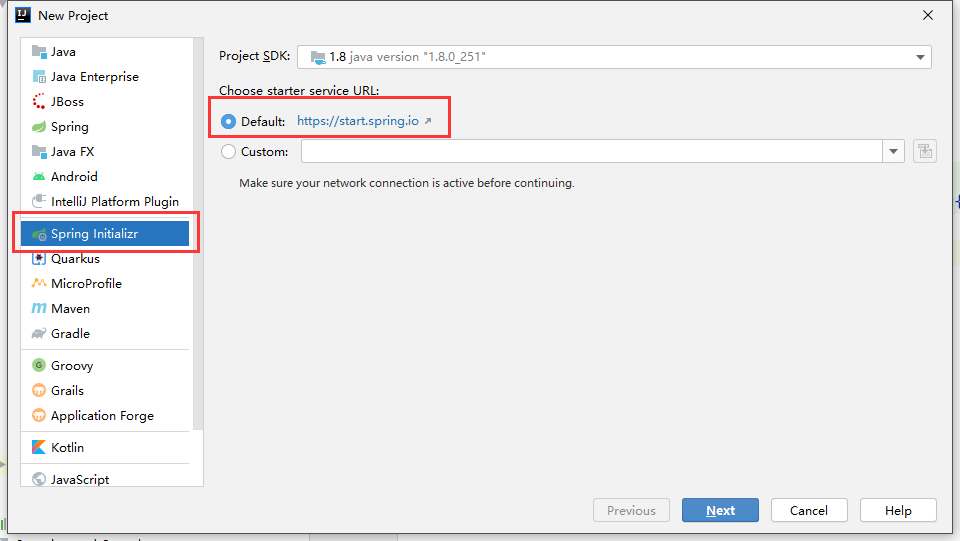
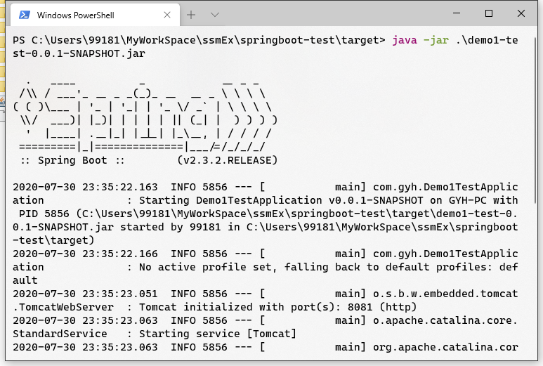

# 十二、SpringBoot

## 目录

- [十二、SpringBoot](#十二springboot)
  - [目录](#目录)
  - [1 SpringBoot](#1-springboot)
    - [1.1 创建 SpringBoot 应用](#11-创建-springboot-应用)
      - [1.1.1 网页端创建](#111-网页端创建)
      - [1.1.2 IDEA 创建](#112-idea-创建)
    - [1.2 SpringBoot 介绍](#12-springboot-介绍)
      - [1.2.1 maven](#121-maven)
      - [1.2.2 启动类](#122-启动类)
      - [1.2.3 配置文件](#123-配置文件)
      - [1.2.4 搭建一个 springboot-web](#124-搭建一个-springboot-web)
      - [1.2.5 SpringBoot 应用可以打包为 jar 包启动](#125-springboot-应用可以打包为-jar-包启动)
    - [1.3 SpringBoot 配置文件](#13-springboot-配置文件)
      - [1.3.1 配置文件形式](#131-配置文件形式)
      - [1.3.2 ConfigurationProperties 注解](#132-configurationproperties-注解)
      - [1.3.3 配置文件占位符](#133-配置文件占位符)
      - [1.3.4 引入额外的配置文件](#134-引入额外的配置文件)
      - [1.3.5 多配置文件](#135-多配置文件)
    - [1.4 整合 Web](#14-整合-web)
      - [1.4.1 静态资源](#141-静态资源)
      - [1.4.2 文件上传组件](#142-文件上传组件)
      - [1.4.3 SpringMVC 配置类](#143-springmvc-配置类)
      - [1.4.4 Converter](#144-converter)
    - [1.5 整合 MyBatis](#15-整合-mybatis)
      - [1.5.1 datasource](#151-datasource)
      - [1.5.2 mapper](#152-mapper)
    - [1.6 其它](#16-其它)

## 1 SpringBoot 

使用 SSM 开发项目的不足之处：
- 创建 SSM 项目，比较麻烦。

- 配置比较麻烦。

- 依赖的配置比较多，不方便。

- 集成第三方的组件、框架比较麻烦的。


SpringBoot 优点：
- 构建项目非常方便。

- 配置比较简单。约定大于配置。

- 无缝集成主流第三方框架。

- SpringBoot 不需要额外配置 JavaEE 容器。可以通过 jar 包的形式来运行。

Spring 当前最新版本 2.3.2，基于 Java 8，支持 Java 14。


### 1.1 创建 SpringBoot 应用

#### 1.1.1 网页端创建

访问 `start.spring.io` 创建应用。

<div align="center">

</div>

#### 1.1.2 IDEA 创建

new project：
<div align="center">

</div>

基础设置：
<div align="center">

</div>

选择依赖和 SpringBoot 版本：
<div align="center">

</div>

项目设置：
<div align="center">

</div>

### 1.2 SpringBoot 介绍

#### 1.2.1 maven

pom.xml 文件中，也可以修改 SpringBoot 版本。  
```xml
<parent>
    <groupId>org.springframework.boot</groupId>
    <artifactId>spring-boot-starter-parent</artifactId>
    <version>2.3.2.RELEASE</version>
    <relativePath/> <!-- lookup parent from repository -->
</parent>
```

#### 1.2.2 启动类

Demo1TestApplication.java：
```java
package com.gyh;    // 组件注册的范围

import org.springframework.boot.SpringApplication;
import org.springframework.boot.autoconfigure.SpringBootApplication;

@SpringBootApplication
public class Demo1TestApplication {

    public static void main(String[] args) {
        SpringApplication.run(Demo1TestApplication.class, args);
    }

}
```

#### 1.2.3 配置文件

配置文件 application.properties 为 properties 文件，所以以 key-value 的形式进行配置。  
示例：
```properties
server.port=8081
server.servlet.context-path=/demo1
```

#### 1.2.4 搭建一个 springboot-web

**第一步**：引入依赖。

```xml
<dependency>
    <groupId>org.springframework.boot</groupId>
    <artifactId>spring-boot-starter-web</artifactId>
</dependency>
```

通常 SpringBoot 支持某个框架的依赖都叫 spring-boot-starter-xxx。这个依赖会提供这个框架所必须的依赖，注册一些默认的组件。  
如 spring-boot-starter-web：
<div align="center">

</div>

**第二步**：controller。

```java
@RestController
public class HelloController {

    @RequestMapping("hello")
    public BaseRespVO hello(){
        return BaseRespVO.ok("hello SpringBoot");
    }
}
```

**第三步**：启动项目。

<div align="center">

</div>

#### 1.2.5 SpringBoot 应用可以打包为 jar 包启动

**第一步**：打包。

<div align="center">

</div>

**第二步**：运行。

<div align="center">

</div>

### 1.3 SpringBoot 配置文件

#### 1.3.1 配置文件形式

**（1）properties**  

`key=value` 形式。
示例：
```properties
server.port=8081
server.servlet.context-path=/demo1
```

**（2）yml**

`key:value` 形式。  
示例：
```yml
server:
  port: 8081
  servlet:
    context-path: /demo1
```

注：
- 下一级和上一级需要空格，几个空格都行，但是同一级需要对齐。
- `:` 后需要添加一个空格。

**（3）容器中的组件的成员变量赋值**  

示例：
```java
@Component
@Data
public class FileComponent {
    //使用 @value 注解可以引用 SpringBoot 配置文件中的 key
    @Value("${file.baseName}")
    String baseName;
    @Value("${file.maxSize}")
    int maxSize;
}
```

```yml
file:
  baseName: zhang3
  maxSize: 100
```

#### 1.3.2 ConfigurationProperties 注解

用于给容器中的组件的成员变量赋值，更简单更直接。

通过注解的 prefix 属性，自动进行匹配。  
示例：
```java
@Component
@Data
@ConfigurationProperties(prefix = "file")
public class FileComponent {

    String baseName;

    int maxSize;
}
```

```yml
# yml 可以通过 - 实现驼峰命名转换
file:
  base-name: zhang3
  maxSize: 100
```

通过 spring-boot-configuration-processor 依赖，可以在写配置文件时给与提示。  
```xml
<dependency>
    <groupId>org.springframework.boot</groupId>
    <artifactId>spring-boot-configuration-processor</artifactId>
    <optional>true</optional>
</dependency>
```
引进依赖之后，可能会没用提示，重新 run 一下，properties 或 yml 文件就会给提示了。

更复杂的类型时，如：
```java
@Component
@Data
@ConfigurationProperties(prefix = "file")
public class FileComponent {

    String baseName;
    int maxSize;
    boolean saved;
    List list1;
    List list2;
    Map map1;
    Map map2;
    FileDetail fileDetail;
}
```

propertirs 形式：
```properties
file.baseName=zhang3
file.maxSize=120
file.saved=true

# list 两种写法
file.list1=data1, data2, data3

file.list2[0]=data1
file.list2[1]=data2
file.list2[2]=data3

# map 两种写法
file.map1.key1=value1
file.map1.key2=value2

file.map2[key1]=value1
file.map2[key2]=value2

# javabean
file.file-detail.name=li4
file.file-detail.size=1000
```

yml 形式：
```yml
file:
  base-name: zhang3
  max-size: 123
  saved: true

  # list 两种写法
  list1: data1, data2, data3
  list2:
    - data1
    - data2
    - data3

  # map 两种写法
  map1:
    key1: value1
    key2: value2
  map2: {key1: value1, key2: value2}

  # file-detail 两种写法
  name: li4
  size: 2000
  # file-detail: {name: li4, size: 2000}
```

#### 1.3.3 配置文件占位符

**（1）随机数**  

格式：
- `${random.value}`
- `${random.int}`
- `${random.long}`
- `${random.int(10)}`
- `${random.(1, 10)}`

```yml
file:
  base-name: zhang3
  max-size: ${random.int}
```

注：随机数在应用启动的时候，就已经生成，在程序运行过程中不会发生改变。

**（2）属性占位符**  

示例：
```yml
file:
  file-path: d://spring/boot/
  pic-path: ${file.file-path}pic/
  xml-path: ${file.file-path}xml/
```

#### 1.3.4 引入额外的配置文件

**（1）PropertySource 注解**

SpringBoot 的 properties 类型。

示例：
```java
@PropertySource(value = "classpath:xxx.properties")
```

**（2）ImportResource 注解**  

示例：
```java
@ImportResource(locations = "classpath:bean.xml")
```

bean.xml：
```xml
<bean class="com.gyh.component.SpringComponent"/>
```

#### 1.3.5 多配置文件

可以识别的配置文件：
- 主配置文件：
  - application.properties
  - application.yml

- 分配置文件：
  - application-*.properties
  - application-*.yml


相同的 key 在不同的环境下有不同的值，把这些不同的值提取出来，分别放到不同的分配置文件中，然后通过主配置文件选择性地激活分配置文件。  
把不同类型的配置放入到不同的配置文件，完成解耦。

示例：
```yml
# applicaton.yml
spring:
  profiles:
    active: cigma, other
```

```yml
# application-alpha.yml
server:
  port: 8081
```

```yml
# application-beta.yml
server:
  port: 8082
```

```yml
# application-cigma.yml
server:
  port: 8083
```

也可以通过同一个配置文件中创建多个子配置文件实现，使用 `---` 的方式来分割。  
示例：
```yml
spring:
  profiles:
    active: cigma

---
spring:
  profiles: alpha
server:
  port: 8081

---
spring:
  profiles: beta
server:
  port: 8082

---
spring:
  profiles: cigma
server:
  port: 8083
```

### 1.4 整合 Web

spring-boot-starter-web

```xml
<dependency>
    <groupId>org.springframework.boot</groupId>
    <artifactId>spring-boot-starter-web</artifactId>
</dependency>
```

#### 1.4.1 静态资源

静态资源默认路径：
- `classpath:\/META-INF\/resources\/`
- `classpath:\/resources\/`
- `classpath:\/static\/`
- `classpath:\/public\/`

自己可以添加配置：
```yml
spring:
  resources:
    static-locations: file:D:\spring\pic\ #location
  mvc:
    static-path-pattern: /pic1/** #mapping
```

#### 1.4.2 文件上传组件

multipartResolver 会自动注册。

#### 1.4.3 SpringMVC 配置类

`@EnableWebMvc`：全面接管 mvc 的配置，配置文件中关于 web 的配置由这个配置类接管。

`@Configuration`：该配置类和 SpringBoot 配置文件中的配置是一个合作关系。

#### 1.4.4 Converter

在 Converter 类上增加 `@Component` 注解，注册到容器中就生效了。

### 1.5 整合 MyBatis

mybatis-spring-boot-starter

```xml
<dependency>
    <groupId>org.mybatis.spring.boot</groupId>
    <artifactId>mybatis-spring-boot-starter</artifactId>
    <version>2.1.2</version>
</dependency>
<dependency>
    <groupId>mysql</groupId>
    <artifactId>mysql-connector-java</artifactId>
    <version>5.1.47</version>
</dependency>
```

#### 1.5.1 datasource
```yml
spring:
  datasource:
    driver-class-name: com.mysql.jdbc.Driver
    url: jdbc:mysql://localhost:3306/test_db
    username: root
    password: 123456
```

#### 1.5.2 mapper

启动类上添加注解：
```java
@MapperScan(basePackages = "com.gyh.mapper")
```

### 1.6 其它

```yml
debug: true
```

banner.txt/png