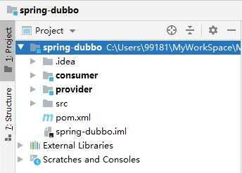
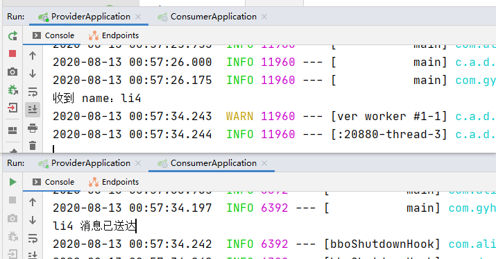
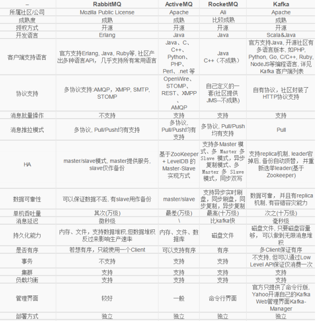
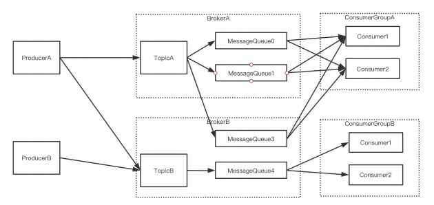
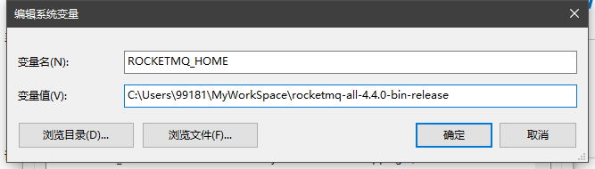

# 十三、微服务

## 目录

- [十三、微服务](#十三微服务)
  - [目录](#目录)
  - [1 Linux 基础](#1-linux-基础)
    - [1.1 Linux 介绍](#11-linux-介绍)
      - [1.1.1 Linux 的前世今生](#111-linux-的前世今生)
      - [1.1.2 Linux 的发行版本](#112-linux-的发行版本)
      - [1.1.3 Linux 操作系统的组成](#113-linux-操作系统的组成)
      - [1.1.4 Linux ⽂件系统⽬录](#114-linux-件系统录)
    - [1.2 Linux 操作](#12-linux-操作)
      - [1.2.1 高频命令](#121-高频命令)
      - [1.2.2 vim](#122-vim)
      - [1.2.3 用户管理](#123-用户管理)
      - [1.2.4 组管理](#124-组管理)
      - [1.2.5 权限管理](#125-权限管理)
      - [1.2.6 进程管理](#126-进程管理)
      - [1.2.7 网络管理](#127-网络管理)
      - [1.2.8 更换国内源](#128-更换国内源)
    - [1.3 远程连接 Linux 服务器](#13-远程连接-linux-服务器)
  - [2 Nginx](#2-nginx)
    - [2.1 Nginx 介绍](#21-nginx-介绍)
    - [2.2 Nginx 使用](#22-nginx-使用)
      - [2.2.1 Nginx 安装](#221-nginx-安装)
      - [2.2.2 Nginx 常用命令](#222-nginx-常用命令)
      - [2.2.3 Nginx 配置⽂件](#223-nginx-配置件)
      - [2.2.4 Nginx 核心功能](#224-nginx-核心功能)
  - [3 微服务架构](#3-微服务架构)
    - [3.1 单体架构](#31-单体架构)
    - [3.2 微服务架构介绍](#32-微服务架构介绍)
    - [3.3 微服务拆分思路](#33-微服务拆分思路)
      - [3.3.1 横向拆分](#331-横向拆分)
      - [3.3.2 纵向拆分](#332-纵向拆分)
    - [3.4 微服务的选择](#34-微服务的选择)
      - [3.4.1 Dubbo（RPC）（zookeeper）](#341-dubborpczookeeper)
      - [3.4.2 Spring Cloud（HTTP）](#342-spring-cloudhttp)
    - [3.5 Dubbo](#35-dubbo)
      - [3.5.1 Spring 和 Dubbo 整合案例](#351-spring-和-dubbo-整合案例)
      - [3.5.2 SpringBoot 和 Dubbo 整合案例](#352-springboot-和-dubbo-整合案例)
      - [3.5.3 Dubbo 2.7.0](#353-dubbo-270)
    - [3.6 Zookeeper](#36-zookeeper)
      - [3.6.1 下载 Zookeeper](#361-下载-zookeeper)
      - [3.6.2 SpringBoot + Dubbo 整合 Zookeeper](#362-springboot--dubbo-整合-zookeeper)
  - [4 Redis](#4-redis)
    - [4.1 Redis 介绍](#41-redis-介绍)
    - [4.2 Redis 安装](#42-redis-安装)
      - [4.2.1 Linux 安装 Redis](#421-linux-安装-redis)
      - [4.2.2 Windows 安装 Redis](#422-windows-安装-redis)
    - [4.3 Redis 启动](#43-redis-启动)
      - [4.3.1 Linxu 启动 Redis](#431-linxu-启动-redis)
      - [4.3.1 Windows 启动 Redis](#431-windows-启动-redis)
    - [4.4 核心配置文件 Redis.conf](#44-核心配置文件-redisconf)
    - [4.5 Redis 持久化](#45-redis-持久化)
      - [4.5.1 RDB](#451-rdb)
      - [4.5.2 AOF](#452-aof)
    - [4.6 Redis 常⽤数据类型以及应⽤场景](#46-redis-常数据类型以及应场景)
      - [4.6.1 String](#461-string)
      - [4.6.2 List](#462-list)
      - [4.6.3 Hashes](#463-hashes)
      - [4.6.4 Sets](#464-sets)
      - [4.6.5 Sorted Sets](#465-sorted-sets)
    - [4.7 Redis 的整合](#47-redis-的整合)
      - [4.7.1 Jedis 案例](#471-jedis-案例)
      - [4.7.2 RedisTemplate 案例](#472-redistemplate-案例)
      - [4.7.3 Redisson 案例](#473-redisson-案例)
    - [4.8 内存淘汰策略](#48-内存淘汰策略)
  - [5 HandlerInterceptorAdapter](#5-handlerinterceptoradapter)
    - [5.1 HandlerInterceptorAdapter 介绍](#51-handlerinterceptoradapter-介绍)
    - [5.2 HandlerInterceptorAdapter 源码](#52-handlerinterceptoradapter-源码)
    - [5.3 HandlerInterceptorAdapter 案例](#53-handlerinterceptoradapter-案例)
  - [6 Tk-Mybatis](#6-tk-mybatis)
    - [6.1 Tk-Mybatis 介绍](#61-tk-mybatis-介绍)
    - [6.2 入门案例](#62-入门案例)
  - [7 MapStruct](#7-mapstruct)
    - [7.1 MapStruct 介绍](#71-mapstruct-介绍)
    - [7.2 MapStruct 案例](#72-mapstruct-案例)
  - [8 SPI](#8-spi)
    - [8.1 SPI 介绍](#81-spi-介绍)
    - [8.2 入门案例](#82-入门案例)
  - [9 API ⽹关](#9-api-关)
    - [9.1 API 网关介绍](#91-api-网关介绍)
    - [9.2 架构图](#92-架构图)
  - [10 JWT](#10-jwt)
    - [10.1 JWT 介绍](#101-jwt-介绍)
    - [10.2 使用场景](#102-使用场景)
      - [10.2.1 Authorization](#1021-authorization)
      - [10.2.2 Information Exchange](#1022-information-exchange)
    - [10.3 Token 和 Session](#103-token-和-session)
      - [10.3.1 基于 Session 的身份认证](#1031-基于-session-的身份认证)
      - [10.3.2 基于 Token 的身份认证](#1032-基于-token-的身份认证)
    - [10.4 JWT Token 格式](#104-jwt-token-格式)
    - [10.5 使用](#105-使用)
  - [11 Pipeline 设计模式](#11-pipeline-设计模式)
    - [11.1 Pipeline 设计模式介绍](#111-pipeline-设计模式介绍)
    - [11.2 接口代码建模](#112-接口代码建模)
  - [12 RocketMQ](#12-rocketmq)
    - [12.1 消息中间件](#121-消息中间件)
    - [12.2 功能](#122-功能)
      - [12.2.1 异步化](#1221-异步化)
      - [12.2.2 限流削峰](#1222-限流削峰)
      - [12.2.3 对比](#1223-对比)
    - [12.3 模型](#123-模型)
      - [12.3.1 相关概念](#1231-相关概念)
      - [12.3.2 概念模型](#1232-概念模型)
      - [12.3.3 部署模型](#1233-部署模型)
      - [12.3.4 注意事项](#1234-注意事项)
    - [12.4 下载使用](#124-下载使用)
      - [12.4.1 下载](#1241-下载)
      - [12.4.2 启动](#1242-启动)
    - [12.5 整合](#125-整合)


## 1 Linux 基础

### 1.1 Linux 介绍

#### 1.1.1 Linux 的前世今生

UNIX：UNIX 操作系统由肯•汤普森（Ken Thompson）和丹尼斯•⾥奇（Dennis Ritchie）发明。  

> 1965 年开始的 Multics ⼯程计划，该计划由⻉尔实验室、美国麻省理⼯学院和通⽤电⽓公司联合发
起，⽬标是开发⼀种交互式的、具有多道程序处理能⼒的分时操作系统，以取代当时⼴泛使⽤的批处理操作
系统。但是该计划最终却以失败收场。  
> 以肯•汤普森为⾸的⻉尔实验室研究⼈员吸取了 Multics ⼯程计划失败的经验教训，于 1969 年实现了
⼀种分时操作系统的雏形，1970 年该系统正式取名为 UNIX。  
> 但是之前的操作系统⼤多使⽤汇编语⾔编写，对硬件依赖性强，可移植性很差，1971-1972 年，肯•汤普
森的同事丹尼斯•⾥奇发明了传说中的 C 语⾔，UNIX 系统的绝⼤部分源代码都⽤ C 语⾔进⾏了重写，这为提
⾼ UNIX 系统的可移植性打下了基础。

LINUX：Linux 内核最初只是由芬兰⼈林纳斯·托瓦兹（Linus Torvalds）在赫尔⾟基⼤学上学时出于个
⼈爱好⽽编写的。Linux 是⼀套免费使⽤和⾃由传播的类 Unix 操作系统，是⼀个基于 POSIX 和 UNIX
的多⽤户、多任务、⽀持多线程和多 CPU 的操作系统。Linux 能运⾏主要的 UNIX ⼯具软件、应⽤程序
和⽹络协议。它⽀持 32 位和 64 位硬件。Linux 继承了 Unix 以⽹络为核⼼的设计思想，是⼀个性能稳
定的多⽤户⽹络操作系统。  

Linux 是⼀个类似 Unix 的操作系统，Unix 要早于 Linux，Linux 的初衷就是要替代 UNIX，并在功能
和⽤户体验上进⾏优化，所以 Linux 模仿了 UNIX（但并没有抄袭 UNIX 的源码），使得 Linux 在外
观和交互上与 UNIX ⾮常类似。

#### 1.1.2 Linux 的发行版本

Linxu 发行家族：
- Debian：
  - Ubuntu
  - Linux Mint

- Fedora：
  - RHEL
  - CentOS
  - Oracle Linux

- SUSE
  - SLES
  - openSUSE

- 其它发行版

⽬前市⾯上较知名的发⾏版有：Ubuntu、RedHat、CentOS、Debian、Fedora、SuSE、OpenSUSE、Arch Linux、SolusOS 等。

#### 1.1.3 Linux 操作系统的组成

UNIX 或者 Linux 系统⼤致可以分为以下⼏个部分：
- 最底层的硬件，以及和硬件交互的操作系统内核。
- 中间层是 Shell 层。
- 最外层是应⽤层。

<div align="center">

</div>

内核层：内核层是 UNIX/Linux 系统的核⼼和基础，它直接附着在硬件平台之上，控制和管理系统内各种资源（硬件资源和软件资源），有效地组织进程的运⾏，从⽽扩展硬件的功能，提⾼资源的利⽤效率，为⽤户提供⽅便、⾼效、安全、可靠的应⽤环境。

Shell 层：Shell 层是与⽤户直接交互的界⾯。⽤户可以在提示符下输⼊命令⾏，由 Shell 解释执⾏并输出相应结果或者有关信息，所以我们也把 Shell 称作命令解释器，利⽤系统提供的丰富命令可以快捷⽽简便地完成许多⼯作。

#### 1.1.4 Linux ⽂件系统⽬录

**在 Linux 中，⼀切皆为⽂件。**  

⽂件分为下⾯的⼀些类型：
- 普通⽂件
- ⽬录⽂件
- 链接⽂件
- 设备⽂件
- 管道⽂件

Linux ⽂件系统⽬录结构和熟知的 Windows 系统有较⼤区别，没有各种盘符的概念。根⽬录只有⼀个 `/`，采⽤层级式的树状⽬录结构。

```
/：根⽬录，所有的⽬录、⽂件、设备都在 / 之下。
|
|--bin：即 binary。系统所需要的那些命令位于此⽬录。
|
|--boot：Linux 的内核及引导系统程序所需要的⽂件⽬录。
|
|--dev：即 device。这个⽬录包含了所有 Linux 系统中使⽤的外部设备。这⾥放的不是外部设备的驱动程序，而是⼀个访问这些外部设备的端⼝。
|
|--etc：管理所有的配置⽂件的⽬录，⽐如安装 MySQL 的配置⽂件 my.conf。
|
|--home：如果建⽴⼀个⽤户，⽤户名是 "xx"，那么在 /home ⽬录下就有⼀个对应的 /home/xx 路径，⽤来存放⽤户的主⽬录。
|    |
|    |--用户 A
|    |
|    |--用户 B
| 
|--lib：即 library。这个⽬录是⽤来存放系统动态连接共享库的。⼏乎所有的应⽤程序都会⽤到这个⽬录下的共享库。因此，不要轻易对这个⽬录进⾏操作。
|
|--media：⾃动挂载的⽬录。⽐如插⼊⼀个 U 盘，会⾃动到 /media ⽬录中挂载。
|
|--mnt：可供系统管理员使⽤，⼿动挂载⼀些临时设备媒体设备的⽬录。
|
|--opt：额外安装软件存放的⽬录。⽐如 MySQL 的安装包就可以放在该⽬录。
|
|--root：Linux 超级权限⽤户 root 的家⽬录。
|
|--sbin：这个⽬录是⽤来存放系统管理员的系统管理程序。⼤多是涉及系统管理的命令的存放，是超级权限⽤户 root 的可执⾏命令存放地，普通⽤户⽆权限执⾏这个⽬录下的命令，sbin 中包含的都是 root 权限才能执⾏的。
|
|--usr：即 nix software resource，Linux 系统中占⽤硬盘空间最⼤的⽬录。⽤户的很多应⽤程序和⽂件都存放在这个⽬录下。
|    |
|    |--local：这⾥主要存放那些⼿动安装的软件，即不是通过或 apt-get 安装的软件。它和 /usr ⽬录具有相类似的⽬录结构。
|    |
|    |--share：系统共⽤的东⻄存放地，⽐如 /usr/share/fonts 是字体⽬录，/usr/share/doc 和 /usr/share/man 帮助⽂件。
|    |
|    |--bin
|
|--var
|
|--proc：存储的是当前内核运⾏状态的⼀系列特殊⽂件，⽤户可以通过这些⽂件查看有关系统硬件及当前正在运⾏进程的信息，甚⾄可以通过更改其中某些⽂件来改变内核的运⾏状态。
```

### 1.2 Linux 操作

#### 1.2.1 高频命令

基础命令：
命令 | 功能  
:- | :-   
`pwd` | 显示当前目录路径  
`ls` | list directory contents，显示当前⽂件夹下的⽬录或⽂件<br>`-a`：显示所有的⽂件夹和⽂件，包括隐藏⽂件<br>`-l`：以详细的形式显示 
`clear` | 清屏
`cd 路径` | 进⼊⼀个路径或者⽬录，绝对路径或者相对路径都可以<br>`~`：当前用户的根目录<br>`.`：当前目录<br>`..`：父目录

目录相关命令：
命令 | 功能  
:- | :-  
`mkdir 目录名` | 创建⼀个新的⽬录<br>`-p 路径`：连续创建目录  
`rmdir` | 删除⼀个空的⽬录
`cp 源路径 目标路径` | 复制⽂件或⽬录<br>`-r`：递归持续复制，⽤于⽬录的复制⾏为
`rm 路径` | 移除⽂件或⽬录<br>`-f`：即 force ，忽略不存在的⽂件，不会出现警告信息<br>`-i`：互动模式，在删除前会询问使⽤者是否动作<br>`-r`：递归删除
`mv 源路径 目标路径` | 移动文件 

文件相关命令：
命令 | 功能  
:- | :-  
`touch 文件名` | 创建文件 / 改变文件更新时间   
`cat filename` | 只读的⽅式打开⼀个⽂件。
`less` | 分⻚显示数据
`head filename` | 查看⼀个⽂件，取开头的⼀部分内容
`tail filename` | 查看⼀个⽂件的尾部内容<br>`-f`：尾部持续不断地输出内容
`echo` | 输出内容到控制台。⽐如输出 Linux 的环境变量到控制台：`echo $PATH`
`>` | 输出重定向（会将原来的内容覆盖）
`>>` | 追加（不会覆盖原⽂件的内容，追加到底部）
`tar` | `-c`：产⽣ .tar ⽂件<br>`-v`：显示详细信息<br>`-z`：打包同时压缩<br>`-f`：指定压缩后的⽂件名<br>`-x`：解压 .tar ⽂件<br>`-C`：表示解压到指定⽬录

示例：  
```
echo hello > a.txt

ls -l >> a.txt

cat a.txt > b.txt

tar -zcvf combine.tar.gz 1.txt

tar -zxvf combine.tar.gz -C java/
```

其它：
命令 | 功能  
:- | :-  
`whoami` | 查看当前用户名
`tree` | 查看目录结构  
`ln -s 真实文件 链接` | 建立软链接  
`curl -L 链接 > 文件名` | 下载文件  
`wget -p -H -e robots=off 链接` | 拷贝网页  
`df` | `-k`：磁盘占用  
`du` | `-sh`：当前目录大小<br>`-h`：各文件大小  

#### 1.2.2 vim

Ubuntu 默认没有安装 vim，需要先安装 vim ⼯具。  
```
sudo apt-get install vim
```

vim 有三种模式：
- 命令模式（Command mode）
- 插⼊模式（Insert mode）
- 末⾏模式（Last Linemode）。

**（1）命令模式**

通过指令 `vim filename` 进⼊命令模式。可以添加一些参数：
- `-r`：恢复上次 vim 打开时崩溃的⽂件。
- `-R`：把指定的⽂件以只读的⽅式放⼊ vim 编辑器中。
- `+`：打开⽂件，并把光标置于最后⼀⾏的⾸部。
- `+n`：打开⽂件，并把光标置于第 n ⾏的⾸部。

命令模式快捷键：
命令 | 功能  
:- | :-  
`x` | 删除光标所在位置的字符
`dd` | 删除光标所在⾏
`ndd` | 删除当前⾏后 n ⾏⽂本（包括此⾏）
`dG` | 删除光标所在⾏⼀直到⽂件末尾的所有内容
`D` | 删除光标位置到⾏尾的所有内容
`p` | 粘贴删除的内容
`w` | 光标移动⾄下⼀个单词⾸
`e` | 光标移动⾄下⼀个单词尾
`b` | 光标移动⾄上⼀个单词⾸
`gg` | 光标移动到⽂件开头
`G` | 光标移动⾄⽂件末尾
`nG` | 光标移动到第n⾏，n为数字
`0` / `^` | 光标移动⾄当前⾏的⾏⾸
`$` | 光标移动⾄当前⾏的⾏尾

**（2）插⼊模式**  

在命令模式下，通过按下 i、I、a、A、o、O 这 6 个字⺟进⼊插⼊模式，不同的字⺟代表不同的进⼊⽅
式。  

命令 | 功能  
:- | :- 
`i` | 在当前光标位置前⾯插⼊随后输⼊的⽂本，光标后的⽂本相应向右移动
`o` | 在光标所在⾏下⾯插⼊新的⼀⾏，然后光标停在空⾏⾸，等待输⼊⽂本
`O` | 在光标所在⾏上⾯插⼊新的⼀⾏，然后光标停在空⾏⾸，等待输⼊⽂本
`a` | 在当前光标位置后⾯插⼊随后输⼊的⽂本，光标后的⽂本相应向右移动
`A` | 在光标所在⾏的⾏尾插⼊随后输⼊的⽂本

按下 ESC 键离开插⼊模式，进⼊命令模式。

**（3）末行模式**  

在命令模式下，按下 `:` 键进⼊末⾏模式。在该模式下，可以使⽤⼀系列的指令，完成保存、离开 vim 编
辑器等功能。

命令 | 功能  
:- | :- 
`:wq` | 保存并退出vim编辑器
`:wq!` | 保存并强制退出vim编辑器
`:q` | 不保存退出
`:q!` | 不保存强制退出
`:w` | 保存不退出
`:w!` | 强制保存不退出
`:w filename` | 另存到filename⽂件
`ZZ` | 直接退出


#### 1.2.3 用户管理

Linux 系统是⼀个多⽤户、多任务的操作系统。多⽤户是指在 Linux 操作系统中可以创建多个⽤户，⽽这些多⽤户⼜可以同时执⾏各⾃不同的任务，⽽互不影响。
- ⽤户名：⽤户的名称
- ⽤户所属的组：当前⽤户所属的组。
- ⽤户的家⽬录：当前账号登录成功之后的⽬录，就叫做该⽤户的家⽬录。

创建用户：
```
sudo useradd ⽤户名
```

创建⼀个⽤户，⽤户名 test：
```
sudo useradd test
```
这种⽅式创建出来的没有家⽬录，因此创建的时候需要带参数。
- `-m` 表示在 /home⽬录下创建⼀个家⽬录。
- `-s` 指定 shell 版本。

```
sudo useradd -m test

sudo useradd -m -s /bin/bash test
```

给⽤户添加密码：
```
sudo passwd ⽤户名
```

切换用户：
```
su ⽤户名
```

删除⽤户：
```
sudo userdel ⽤户名
```
`-r`: 不仅会删除该⽤户，还会删除该⽤户对应的家⽬录。

#### 1.2.4 组管理

添加组：
```
groupadd [groupname]
```

创建⽤户的时候加⼊组：
```
useradd -m -s /bin/bash -g [groupname] [username]
```

查看⽤户及组信息：
```
id ⽤户名
```

修改⽤户所属组：
```
usermod -g [groupname] [username]
```

#### 1.2.5 权限管理

<div align="center">

</div>

前⾯ 10 个符号表示⽂件的⼀些基本信息：
- 第 1 位：
  - `-` 表示是⼀个普通的⽂件。
  - `d` 表示是⼀个⽬录。

- 第 2-4 位：表示⽂件所有者的权限。

- 第 5-7 位：⽂件所在组的拥有的权限。

- 第 8-10 位：⽂件其他组⽤户拥有的权限。

`rwx`：Read、Write、Execute，读、写、执⾏权限，这个顺序不会变，如果没有权限的话就⽤ `-` 代替。

通过 chmod 指令，可以修改⽂件或者⽬录的权限。  
示例：
```
方式一：
chmod u=rwx, g=rw, o=r filename

方式二：
chmod 751 filename
```

#### 1.2.6 进程管理

Linux 系统中查看进程使⽤情况的命令是 ps 指令。

常⻅选项：
- `-e`：显示所有进程。
- `-f`：全格式。
- `a`：显示终端上的所有进程。
- `u`：以⽤户的格式来显示进程信息。
- `x`：显示后台运⾏的进程。

⼀般常⽤格式为 `ps -ef` 或者 `ps aux` 两种。显示的信息⼤体⼀致，略有区别。

<div align="center">

</div>

- UID：⽤户 ID。   

- **PID**：进程 ID。  

- **PPID**：⽗进程 ID。  

- C：CPU ⽤于计算执⾏优先级的因⼦。数值越⼤，表明进程是 CPU 密集型运算，执⾏优先级会降低；数值越⼩，表明进程是 I/O 密集型运算，执⾏优先级会提⾼。  

- STIME：进程启动的时间。  

- TTY：完整的终端名称。  

- TIME：CPU 时间。  

- **CMD**：完整的启动进程所⽤的命令和参数。  

<div align="center">

</div>

- USER：⽤户名称。

- **PID**：进程号。

- **%CPU**：进程占⽤ CPU 的百分⽐。

- **%MEM**：进程占⽤物理内存的百分⽐

- VSZ：进程占⽤的虚拟内存⼤⼩（单位：KB）。

- RSS：进程占⽤的物理内存⼤⼩（单位：KB）。

- TT：终端名称（缩写），若为？，则代表此进程与终端⽆关，因为它们是由系统启动的。

- **STAT**：进程状态，其中 S- 睡眠，s- 表示该进程是会话的先导进程，N- 表示进程拥有⽐普通优先级更低的优先级，R- 正在运⾏，D- 短期等待，Z- 僵死进程，T- 被跟踪或者被停⽌等。

- STARTED：进程的启动时间。

- TIME：CPU时间，即进程使⽤ CPU 的总时间。

- COMMAND：启动进程所⽤的命令和参数，如果过⻓会被截断显示。

两者区别：
- 如果想查看进程的CPU占⽤率和内存占⽤率，可以使⽤ aux。

- 如果想查看进程的⽗进程 ID 和完整的 COMMAND 命令，可以使⽤ ef。

如果想在进程列表中进⼀步筛选出想查询的进程，可以使⽤管道符：
```
ps -ef | grep 搜索内容
```

终⽌进程：
```
kill [参数] 进程号
```
参数：
- `-9`：操作系统从内核级别强制杀死⼀个进程。

- `-15`：可以理解为操作系统发送⼀个通知告诉应⽤主动关闭。


服务管理：服务本质上来说也是⼀个进程，只不过是在后台运⾏，监听着某⼀端⼝，等待该端⼝的请求到来。⽐如 ssh 服务，监听着 22 端⼝；mysql 服务，监听着 3306 端⼝；tomcat 服务，监听着 80 或者 8080 端⼝。

指令（管理服务器的启动、停⽌、状态等）：
```
systemctl start/stop/restart/status/reload 服务名称
```

⽐如关闭 ssh 服务：
```
systemctl stop sshd
```


#### 1.2.7 网络管理

查看⽹络设置：
```
ifconfig
```

查看⽹络端⼝占⽤情况：
```
netstat
```
- -a：显示全部
- -n：以数字的形式显示
- -p：显示该连接被哪个应⽤程序占⽤PID

示例:
```
netstat -anp | grep 3306
```

另一种方式：
```
lsof -i: 端⼝号
```

查看⽹络是否正常：
```
ping ⽬的ip 或者域名
```

#### 1.2.8 更换国内源

**第一步**：备份。

```
sudo cp /etc/apt/sources.list /etc/apt/sources.list.bak
```

**第二步**：赋予权限。

```
sudo chmod 777 /etc/apt/sources.list
```

**第三步**：修改。

```
sudo vim /etc/apt/sources.list
```

然后删除原来的内容，新增以下任意源都行。

阿里源：
```list
deb http://mirrors.aliyun.com/ubuntu/ xenial main restricted universe multiverse

deb http://mirrors.aliyun.com/ubuntu/ xenial-security main restricted universe multiverse

deb http://mirrors.aliyun.com/ubuntu/ xenial-updates main restricted universe multiverse

deb http://mirrors.aliyun.com/ubuntu/ xenial-proposed main restricted universe multiverse

deb http://mirrors.aliyun.com/ubuntu/ xenial-backports main restricted universe multiverse

deb-src http://mirrors.aliyun.com/ubuntu/ xenial main restricted universe multiverse

deb-src http://mirrors.aliyun.com/ubuntu/ xenial-security main restricted universe multiverse

deb-src http://mirrors.aliyun.com/ubuntu/ xenial-updates main restricted universe multiverse

deb-src http://mirrors.aliyun.com/ubuntu/ xenial-proposed main restricted universe multiverse

deb-src http://mirrors.aliyun.com/ubuntu/ xenial-backports main restricted universe multiverse
```

清华源：
```list
deb https://mirrors.tuna.tsinghua.edu.cn/ubuntu/ bionic main restricted universe multiverse

deb-src https://mirrors.tuna.tsinghua.edu.cn/ubuntu/ bionic main restricted universe multiverse

deb https://mirrors.tuna.tsinghua.edu.cn/ubuntu/ bionic-updates main restricted universe multiverse

deb-src https://mirrors.tuna.tsinghua.edu.cn/ubuntu/ bionic-updates main restricted universe multiverse

deb https://mirrors.tuna.tsinghua.edu.cn/ubuntu/ bionic-backports main restricted universe multiverse

deb-src https://mirrors.tuna.tsinghua.edu.cn/ubuntu/ bionic-backports main restricted universe multiverse

deb https://mirrors.tuna.tsinghua.edu.cn/ubuntu/ bionic-security main restricted universe multiverse

deb-src https://mirrors.tuna.tsinghua.edu.cn/ubuntu/ bionic-security main restricted universe multiverse

deb https://mirrors.tuna.tsinghua.edu.cn/ubuntu/ bionic-proposed main restricted universe multiverse

deb-src https://mirrors.tuna.tsinghua.edu.cn/ubuntu/ bionic-proposed main restricted universe multiverse
```

**第四步**：更新。

```
sudo apt update
```

### 1.3 远程连接 Linux 服务器

通过 SSH 协议远程连接 Linux 服务器。

> SSH 为 Secure Shell 的缩写，由 IETF 的⽹络⼯作⼩组（Network Working Group）所制定；SSH 为建⽴在应⽤层和传输层基础之上的安全协议。SSH 是⽬前较可靠，专为远程登录会话和其他⽹络服务提供安全性的协议。

**第一步**：在⽬标服务器上安装 SSH 服务（Ubuntu 16 默认⾃带了这个服务）。

```bash
# 查看ssh服务是否启动
ps aux|grep ssh

# 如果出现 sshd 进程则表示已经启动，如果没有出现那么执⾏下⾯的命令
#更新apt源
sudo apt update

# 安装 ssh
sudo apt install openssh-server

# 安装完之后再次查看 sshd 是否已经启动，如果没有启动的话执⾏以下命令启动
sudo service ssh restart
```

**第二步**：连接。

```bash
# 执⾏命令
ssh [username]@[ip]
```

示例：
```
ssh gyh@192.168.0.1
```

## 2 Nginx

### 2.1 Nginx 介绍

Nginx（engine x）是⼀个⾼性能的 HTTP 和反向代理 Web 服务器，同时也提供了 IMAP/POP3/SMTP 服务。  
Nginx 是由伊⼽尔·赛索耶夫为俄罗斯访问量第⼆的 Rambler.ru 站点（俄⽂：Рамблер）开发的，第⼀个公开版本 0.1.0 发布于 2004 年 10 ⽉ 4 ⽇。  

其将源代码以类 BSD 许可证的形式发布，因它的稳定性、丰富的功能集、示例配置⽂件和低系统资源的消耗⽽闻名。2011 年 6 ⽉ 1 ⽇，Nginx 1.0.4 发布。  

Nginx 是⼀款轻量级的 Web 服务器 / 反向代理服务器及电⼦邮件（IMAP/POP3）代理服务器，在 BSDlike 协议下发⾏。其特点是占有内存少，并发能⼒强，事实上 Nginx 的并发能⼒在同类型的⽹⻚服务器中表现较好，中国⼤陆使⽤ Nginx ⽹站⽤户有：百度、京东、新浪、⽹易、腾讯、淘宝等。

Nginx 最核⼼的两个功能：
1. ⾼性能的静态 Web 服务器；

2. 反向代理。

正向代理：代理服务器是代表⽤户客户端去访问后端服务器，代理的对象是前⾯的⽤户。

反向代理：代理服务器是代表后端服务器供客户端去访问，对于前⾯的⽤户来说是⽆感知的，代理的对象是后⾯的后台服务器。

Nginx 的优势：
1. ⾼并发、⾼性能（⼀个进程可以处理多个请求）；

2. 扩展性好（模块化设计）；

3. 异步⾮阻塞的事件驱动模型；

4. ⾼可靠性（热部署、7*24）。

### 2.2 Nginx 使用

#### 2.2.1 Nginx 安装

Ubuntu 安装 Nginx ⾮常⽅便，可以直接使⽤ apt 源来安装：
```
sudo add-apt-repository ppa:nginx/stable
sudo apt-get update
sudo apt-get install nginx
```

执⾏命令查看是否安装成功：
```
nginx -v
```

主配置⽂件是 `nginx.conf`，Nginx 的指令放在 `/usr/sbin/nginx`，⽇志⽂件放在 `/var/log/nginx` 中。

<div align="center">

</div>


#### 2.2.2 Nginx 常用命令

```
cd /usr/sbin

# 启动
./nginx

# 关闭
./nginx -s stop

# 重启
./nginx -s reload
```

#### 2.2.3 Nginx 配置⽂件

Nginx 核⼼配置⽂件就是 nginx.conf ，打开这个核⼼配置⽂件
配置⽂件中有很多注释，去掉所有注释，精简之后的内容如下：
```conf
user www-data;
worker_processes auto;
pid /run/nginx.pid;
include /etc/nginx/modules-enabled/*.conf;

events {
        worker_connections 768;
}

http {

        sendfile on;
        tcp_nopush on;
        tcp_nodelay on;
        keepalive_timeout 65;
        types_hash_max_size 2048;

        include /etc/nginx/mime.types;
        default_type application/octet-stream;

        ssl_protocols TLSv1 TLSv1.1 TLSv1.2;

        ssl_prefer_server_ciphers on;

        access_log /var/log/nginx/access.log;
        error_log /var/log/nginx/error.log;

        gzip on;

        include /etc/nginx/conf.d/*.conf;
        include /etc/nginx/sites-enabled/*;
}
```

根据上述⽂件，可以很明显的将 nginx.conf 配置⽂件分为三部分：

<div align="center">

</div>

**（1）全局配置**  

从配置⽂件开始到 events 块之间的内容，主要会设置⼀些影响 nginx 服务器整体运⾏的配置指令，主要包括配置运⾏ Nginx 服务器的⽤户（组）、允许⽣成的 worker process 数，进程 PID 存放路径、⽇志存放路径和类型以及配置⽂件的引⼊等。

```conf
user www-data; # 运⾏worker⼦进程的⽤户
worker_processes auto; # ⼦进程的个数
pid /run/nginx.pid; # 运⾏master的pid⽂件存放的路径
include /etc/nginx/modules-enabled/*.conf; # 将其他配置⽂件包含进来
```

这是 Nginx 服务器并发处理服务的关键配置，worker_processes 值越⼤，可以⽀持的并发处理量也越多，但是会受到硬件、软件等设备的制约。

**（2）events 配置**

```conf
events {
    worker_connections 768;
}
```
events 块涉及的指令主要影响 Nginx 服务器与⽤户的⽹络连接，常⽤的设置包括是否开启对多 work process 下的⽹络连接进⾏序列化，是否允许同时接收多个⽹络连接，选取哪种事件驱动模型来处理连接请求，每个 word process 可以同时⽀持的最⼤连接数等。上述就表示每个 work process ⽀持的最⼤连接数为 768，这部分的配置对 Nginx 的性能影响较⼤，在实际中应该灵活配置。

**（3） http 配置**  

这算是 Nginx 服务器配置中最频繁的部分，代理、缓存和⽇志定义等绝⼤多数功能和第三⽅模块的配置都在这⾥。  

需要注意的是：http 块也可以包括 http 全局块、server 块。
- http 全局块：http 全局块配置的指令包括⽂件引⼊、MIME-TYPE 定义、⽇志⾃定义、连接超时时间、单链接请求数上限等。

- server 块：这块和虚拟主机有密切关系，虚拟主机从⽤户⻆度看，和⼀台独⽴的硬件主机是完全⼀样的，该技术的产⽣是为了节省互联⽹服务器硬件成本。

每个 http 块可以包括多个 server 块，⽽每个 server 块就相当于⼀个虚拟主机。  
⽽每个 server 块也分为全局 server 块，以及可以同时包含多个 locaton 块。


配置详解：
```conf
########### 每个指令必须有分号结束。#################
#user administrator administrators; # 配置⽤户或者组，默认为 nobody。
#worker_processes 2; # 允许⽣成的进程数，默认为 1
#pid /nginx/pid/nginx.pid; # 指定 nginx 进程运⾏⽂件存放地址
error_log log/error.log debug; # 制定⽇志路径，级别。这个设置可以放⼊全局块，http块，server块，级别以此为：debug|info|notice|warn|error|crit|alert|emerg

events {
    accept_mutex on; # 设置⽹路连接序列化，防⽌惊群现象发⽣，默认为 on
    multi_accept on; # 设置⼀个进程是否同时接受多个⽹络连接，默认为 off
    #use epoll; # 事件驱动模型，select|poll|kqueue|epoll|resig|/dev/poll|eventport
    worker_connections 1024; # 最⼤连接数，默认为 512
}

http {
    include mime.types; # ⽂件扩展名与⽂件类型映射表
    default_type application/octet-stream; # 默认⽂件类型，默认为 text/plain
    #access_log off; # 取消服务⽇志
    log_format myFormat '$remote_addr–$remote_user [$time_local] $request $status $body_bytes_sent $http_referer $http_user_agent $http_x_forwarded_for'; #⾃定义格式
    access_log log/access.log myFormat; # combined 为⽇志格式的默认值
    sendfile on; # 允许 sendfile ⽅式传输⽂件，默认为 off，可以在 http 块，server 块，location块。
    sendfile_max_chunk 100k; # 每个进程每次调⽤传输数量不能⼤于设定的值，默认为 0，即不设上限。
    keepalive_timeout 65; # 连接超时时间，默认为 75s，可以在 http，server，location 块。
    upstream mysvr {
        server 127.0.0.1:7878;
        server 192.168.10.121:3333 backup; # 热备
    }
    error_page 404 https://www.baidu.com; # 错误⻚
    server {
        keepalive_requests 120; # 单连接请求上限次数。
        listen 4545; # 监听端⼝
        server_name 127.0.0.1; # 监听地址
        location ~*^.+$ { # 请求的url过滤，正则匹配，~为区分⼤⼩写，~*为不区分⼤⼩写。
            #root path; # 根⽬录
            #index vv.txt; # 设置默认⻚
            proxy_pass http://mysvr; # 请求转向mysvr 定义的服务器列表
            deny 127.0.0.1; # 拒绝的 ip
            allow 172.18.5.54; # 允许的 ip
        }
    }
}
```

#### 2.2.4 Nginx 核心功能

**（1）反向代理配置**  

```conf
http{
    ...
    ...
    # 这部分是被代理服务器的设置 gyh 只是⼀个代号
    upstream gyh{
        server 192.168.0.103:8080;
    }
    # 这部分是 nginx 作为反向代理服务器的配置
    server{
        # nginx 监听的端⼝
        listen 80;
        # 虚拟服务器的识别标记，⼀般配置为本机 ip
        server_name 192.168.0.103;
        # 代理设置地址
        location / {
            proxy_pass http://gyh;
        }
    }
}
```

**（2）负载均衡配置**  

负载均衡策略：
1. 轮询（默认）。

2. weight。

3. ip_hash。

4. least_conn 最少连接⽅式。

5. fair（第三⽅）响应时间。

6. url_hash（第三⽅）。

weight：weight 代表权重,默认为 1,权重越⾼被分配的客户端越多。  
示例：
```congf
upstream gyh{
    server 192.168.0.103:8080 weight=2;
    server 192.168.0.103:8081 weight=1;
}
```

ip_hash：每个请求按访问 ip 的 hash 结果分配，这样每个访客固定访问⼀个后端服务器，可以解决 session 的问题。  
示例：
```conf
upstream gyh{
    ip_hash;
    server 192.168.0.103:8080;
    server 192.168.0.103:8081;
}
```

**（3）缓存**  

Nginx 从 0.7.48 版本开始，⽀持了类似 Squid 的内容缓存功能。这个缓存是把 URL 及相关组合当作 Key，⽤ md5 编码哈希后保存在硬盘上，所以它可以⽀持任意 URL 链接，同时也⽀持 404/301/302 这样的⾮ 200 状态码。

Nginx 缓存配置：
```conf
...
http{
    ...
    # 声明⼀个 cache 缓存节点的内容，levels 在 /path/to/cache/ 设置了⼀个两级层次结构的⽬录。设置 Web 缓存区名称为 cache_one，内存缓存空间⼤⼩为 200MB，1 天没有被访问的内容⾃动清除，硬盘缓存空间⼤⼩为 30GB。
    proxy_cache_path /etc/nginx/tmp_cache levels=1:2 keys_zone=cache_one:200m inactive=1d max_size=30g;

    server{
        ...
        location / {
            proxy_cache cache_one;
            proxy_cache_key $uri;
            proxy_cache_valid 200 206 304 301 302 10d;
            proxy_pass http://gyh;
        }
        ...
    }
}
```


## 3 微服务架构

### 3.1 单体架构

单体架构：  

<div align="center">


</div>

优点：
1. 功能划分清楚；
2. 层次关系良好；
3. 每一层独立；
4. 部署简单；
5. 技术单一；
6. 用人成本低。

缺点：
1. 功能依然太大；
2. 升级风险高；
3. 维护成本增加；
4. 交付周期变长；
5. 可伸缩性差；
6. 监控困难。

### 3.2 微服务架构介绍

微服务是指开发一个单个小型的但有业务功能的服务，每个服务都有自己的处理和轻量通讯机制，可以部署在单个或多个服务器上。  
微服务也指一种种松耦合的、有一定的有界上下文的面向服务架构。也就是说，如果每个服务都要同时修改，那么它们就不是微服务，因为它们紧耦合在一起；如果你需要掌握一个服务太多的上下文场景使用条件，那么它就是一个有上下文边界的服务。

架构图：  
<div align="center">
<br>

</div>

微服务架构设计原则：
- 拆分足够小。

- 服务之间轻量级通信。

微服务的优点：
1. 相对于单体架构，它的主要特点是组件化、松耦合、自治、去中心化，体现在以下几个方面：一组小的服务，服务粒度要小，而每个服务是针对一个单一职责的业务能力的封装，专注做好一件事情。

2. 独立部署运行和扩展。  
   每个服务能够独立被部署并运行在一个进程内。这种运行和部署方式能够赋予系统灵活的代码组织方式和发布节奏，使得快速交付和应对变化成为可能。

3. 独立开发和演化。  
   技术选型灵活，不受遗留系统技术约束。合适的业务问题选择合适的技术可以独立演化。服务与服务之间采取与语言无关的 API 进行集成。相对单体架构，微服务架构是更面向业务创新的一种架构模式。

4. 独立团队和自治。  
   团队对服务的整个生命周期负责，工作在独立的上下文中，自己决策自己治理，而不需要统一的指挥中心。团队和团队之间通过松散的社区部落进行衔接。


微服务的缺点：
1. 服务拆分微服务架构可能带来过多的操作。

2. 分布式系统可能复杂难以管理。因为分布部署跟踪问题难。

3. 分布式事务比较难处理。当服务数量增加，管理复杂性增加。


###  3.3 微服务拆分思路

#### 3.3.1 横向拆分

根据业务来拆分：
<div align="center">

</div>

#### 3.3.2 纵向拆分

根据层次来拆分：
<div align="center">

</div>

### 3.4 微服务的选择

#### 3.4.1 Dubbo（RPC）（zookeeper）

Dubbo 是阿里集团开源的一个极为出名的 RPC（Remote process call）框架，在很多互联网公司和企业应用中广泛使用。协议和序列化框架都可以插拔是及其鲜明的特色。同样的远程接口是基于 Java Interface，并且依托于 Spring 框架（管理 Bean 生命周期）方便开发。可以方便的打包成单一文件，独立进程运行，和现在的微服务概念一致。所以目前 Dubbo 是一种广泛使用的微服务架构框架。

RPC（Remote Process Call）：跨进程调用。RPC 的本质是提供了一种轻量无感知的跨进程通信的方式，在分布式机器上调用其他方法与本地调用无异（远程调用的过程是透明的，你并不知道这个调用的方法是部署在哪里，通过 PRC 能够解耦服务）。RPC 是根据语言的 API 来定义的，而不是基于网络的应用来定义的，调用更方便，协议私密更安全、内容更小效率更高。

<div align="center">

</div>

- 客户端（Client）：服务的调用方。  

- 服务端（Server）：真正的服务提供者。  

- 客户端存根：存放服务端的地址消息，再将客户端的请求参数打包成网络消息，然后通过网络远程发送给服务方。

- 服务端存根：接收客户端发送过来的消息，将消息解包，并调用本地的方法。

基于 TCP/IP 协议，速度快。
<div align="center">

</div>

#### 3.4.2 Spring Cloud（HTTP）

Spring Cloud 来源于 Spring，利用 Spring Boot 进行快捷开发。 Spring Cloud 基本上都是使用了现有的开源框架进行的集成，学习的难度和部署的门槛就比较低，对于中小型企业来说，更易于使用和落地。  

Spring Cloud 核心组件 Eureka 是 Netflix 开源的一款提供服务注册和发现的产品，它提供了完整的 Service Registry 和 Service Discovery 实现。也是 Spring Cloud 体系中最重要最核心的组件之一。 

HTTP：应用层协议。HTTP 接口是在接口不多、系统与系统交互较少的情况下，解决信息孤岛初期常使用的一种通信手段；优点就是简单、直接、开发方便。

使用 HTTP 协议的微服务，通常返回 json 数据，然后把 json 转换为对象。


RPC 服务和 HTTP 服务还是存在很多的不同点的，一般来说，RPC 服务主要是针对大型企业的，而 HTTP 服务主要是针对小企业的，因为 RPC 效率更高，而 HTTP 服务开发迭代会更快。


### 3.5 Dubbo

[Dubbo 官方文档](http://dubbo.apache.org/zh-cn/docs/user/quick-start.html)。

#### 3.5.1 Spring 和 Dubbo 整合案例

[官方参考文档](https://dubbo.gitbooks.io/dubbo-user-book/content/quick-start.html)。

**第一步**：创建一个 Maven 项目，项目中创建两个 Module。  

<div align="center">

</div>

**第二步**：两个 Module 添加依赖。

```xml
<dependencies>
    <dependency>
        <groupId>com.101tec</groupId>
        <artifactId>zkclient</artifactId>
        <version>0.9</version>
    </dependency>
    <dependency>
        <groupId>org.apache.zookeeper</groupId>
        <artifactId>zookeeper</artifactId>
        <version>3.4.9</version>
        <type>pom</type>
    </dependency>
    <dependency>
        <groupId>com.alibaba</groupId>
        <artifactId>dubbo</artifactId>
        <version>2.5.3</version>
    </dependency>
    <dependency>
        <groupId>io.netty</groupId>
        <artifactId>netty-all</artifactId>
        <version>4.1.6.Final</version>
    </dependency>
    <dependency>
        <groupId>commons-logging</groupId>
        <artifactId>commons-logging</artifactId>
        <version>1.2</version>
    </dependency>
    <dependency>
        <groupId>org.javassist</groupId>
        <artifactId>javassist</artifactId>
        <version>3.21.0-GA</version>
    </dependency>
    <dependency>
        <groupId>log4j</groupId>
        <artifactId>log4j</artifactId>
        <version>1.2.17</version>
    </dependency>
    <!-- spring 相关 -->
    <dependency>
        <groupId>org.springframework</groupId>
        <artifactId>spring-context</artifactId>
        <version>4.3.3.RELEASE</version>
    </dependency>
    <dependency>
        <groupId>org.springframework</groupId>
        <artifactId>spring-context-support</artifactId>
        <version>4.3.3.RELEASE</version>
    </dependency>
    <dependency>
        <groupId>org.springframework</groupId>
        <artifactId>spring-core</artifactId>
        <version>4.3.3.RELEASE</version>
    </dependency>
    <dependency>
        <groupId>org.springframework</groupId>
        <artifactId>spring-beans</artifactId>
        <version>4.3.3.RELEASE</version>
    </dependency>
    <dependency>
        <groupId>org.springframework</groupId>
        <artifactId>spring-aop</artifactId>
        <version>4.3.3.RELEASE</version>
    </dependency>
    <dependency>
        <groupId>org.springframework</groupId>
        <artifactId>spring-aspects</artifactId>
        <version>4.3.3.RELEASE</version>
    </dependency>
    <dependency>
        <groupId>org.springframework</groupId>
        <artifactId>spring-expression</artifactId>
        <version>4.3.3.RELEASE</version>
    </dependency>

    <dependency>
        <groupId>junit</groupId>
        <artifactId>junit</artifactId>
        <version>4.12</version>
        <scope>test</scope>
    </dependency>

</dependencies>
```

**第三步**：两个 Module 添加配置。

```xml
<?xml version="1.0" encoding="UTF-8"?>
<beans xmlns="http://www.springframework.org/schema/beans"
       xmlns:xsi="http://www.w3.org/2001/XMLSchema-instance"
       xmlns:context="http://www.springframework.org/schema/context"
       xmlns:aop="http://www.springframework.org/schema/aop"
       xmlns:tx="http://www.springframework.org/schema/tx"
       xmlns:dubbo="http://code.alibabatech.com/schema/dubbo"
       xsi:schemaLocation="
		http://www.springframework.org/schema/beans http://www.springframework.org/schema/beans/spring-beans-3.0.xsd
		http://www.springframework.org/schema/context http://www.springframework.org/schema/context/spring-context-3.0.xsd
		http://www.springframework.org/schema/aop http://www.springframework.org/schema/aop/spring-aop-3.0.xsd
		http://www.springframework.org/schema/tx http://www.springframework.org/schema/tx/spring-tx-3.0.xsd
		http://code.alibabatech.com/schema/dubbo http://code.alibabatech.com/schema/dubbo/dubbo.xsd
		"
>

</beans>
```

**第四步**：配置 provider。

创建服务：
```java
public interface DemoService {
    String getDetail(String name);
}
```

```java
public class DemoServiceImpl implements DemoService {
    @Override
    public String getDetail(String name) {
        System.out.println("收到 name：" + name);
        return name + " 消息已送达";
    }
}
```

配置启动类：
```java
public class Provider {
    public static void main(String[] args) {
        // 获取 Spring 容器对象
        ClassPathXmlApplicationContext applicationContext = new ClassPathXmlApplicationContext("application-context.xml");

        // 启动容器
        applicationContext.start();

        // 保持容器处于启动状态
        try {
            System.in.read();
        } catch (IOException e) {
            e.printStackTrace();
        }
    }
}
```

配置文件：
```xml
<dubbo:application name="provider"/>

<dubbo:protocol name="dubbo" port="20880"/>

<dubbo:service interface="com.gyh.service.DemoService" ref="demoServiceImpl" registry="N/A"/>

<bean id="demoServiceImpl" class="com.gyh.service.DemoServiceImpl"/>
```

**第五步**：配置 consumer。

需要配置全类名相同的接口：
```java
public interface DemoService {
    String getDetail(String name);
}
```

配置文件：
```xml
<dubbo:application name="consumer"/>

<dubbo:reference id="demoService" interface="com.gyh.service.DemoService"
                    url="dubbo://127.0.0.1:20880"/>
```

配置启动类：
```java
public class Consumer {
    public static void main(String[] args) {
        ClassPathXmlApplicationContext applicationContext = new ClassPathXmlApplicationContext("application-context.xml");

        applicationContext.start();

        // 这个实例对象不是真正的 DemoServiceImpl 对象，而是一个代理对象。
        // 代理对象是一个 DemoService 的实例，这个代理对象里面放的是真正提供服务的对象的 url 的地址
        DemoService demoService = (DemoService) applicationContext.getBean("demoService");

        // (dubbo://127.0.0.1:20880).getDetail
        String response = demoService.getDetail("zhang3");

        System.out.println(response);
    }
}
```

**第六步**：运行。

<div align="center">

</div>

#### 3.5.2 SpringBoot 和 Dubbo 整合案例

[官方参考文档](https://github.com/alibaba/dubbo-spring-boot-starter)。

**第一步**：创建 springboot-dubbo 项目，创建两个 Module。

<div align="center">

</div>

**第二步**：两个 Module 添加依赖。

```xml
<!--dubbo 2.6.0-->
<dependency>
    <groupId>com.alibaba.spring.boot</groupId>
    <artifactId>dubbo-spring-boot-starter</artifactId>
    <version>2.0.0</version>
</dependency>

<!--dubbo 2.7.1-->
<!--<dependency>-->
<!--    <groupId>org.apache.dubbo</groupId>-->
<!--    <artifactId>dubbo-spring-boot-starter</artifactId>-->
<!--    <version>2.7.1</version>-->
<!--</dependency>-->
```


**第三步**：配置 provider。

创建服务：
```java
public interface DemoService {
    String getDetail(String name);
}
```

```java
import com.alibaba.dubbo.config.annotation.Service;
import org.springframework.stereotype.Component;

@Component
@Service(interfaceClass = DemoService.class)
public class DemoServiceImpl implements DemoService {
    @Override
    public String getDetail(String name) {
        System.out.println("收到 name：" + name);
        return name + " 消息已送达";
    }
}

```

配置：
```properties
spring.application.name=provider
spring.dubbo.protocol.name=dubbo
spring.dubbo.protocol.port=20880
spring.dubbp.server=true
spring.dubbo.registry=N/A
```

启动类：
```java
@SpringBootApplication
@EnableDubboConfiguration   // dubbo 2.6.0 版本需要添加次注解
public class ProviderApplication {

    public static void main(String[] args) {
        SpringApplication.run(ProviderApplication.class, args);

        try {
            System.in.read();
        } catch (IOException e) {
            e.printStackTrace();
        }
    }
}
```

**第四步**：配置 consumer。

需要配置全类名相同的接口：
```java
public interface DemoService {
    String getDetail(String name);
}
```

配置：
```properties
spring.application.name=consumer
```

工具类：
```java
import com.alibaba.dubbo.config.annotation.Reference;
import org.springframework.stereotype.Component;

@Component
public class ThirdService {

    @Reference(interfaceClass = DemoService.class, url = "dubbo://127.0.0.1:20880")
    private DemoService demoService;

    public String say(String name) {
        String detail = demoService.getDetail(name);
        return detail;
    }
}
```

启动类：
```java
@EnableDubboConfiguration
public class ConsumerApplication {

    public static void main(String[] args) {
        ConfigurableApplicationContext applicationContext = SpringApplication.run(ConsumerApplication.class, args);
        applicationContext.start();

        ThirdService thirdService = applicationContext.getBean(ThirdService.class);

        String response = thirdService.say("li4");
        System.out.println(response);
    }

}
```

**第五步**：运行。

<div align="center">

</div>

#### 3.5.3 Dubbo 2.7.0

将通信所用的接口提取出来，放在 common Module 中
。

**第一步**：新建 common Module。

添加依赖：
```xml
<dependency>
    <groupId>com.101tec</groupId>
    <artifactId>zkclient</artifactId>
    <version>0.10</version>
</dependency>


<dependency>
    <groupId>org.apache.curator</groupId>
    <artifactId>curator-recipes</artifactId>
    <version>2.13.0</version>
</dependency>

<dependency>
    <groupId>org.apache.curator</groupId>
    <artifactId>curator-framework</artifactId>
    <version>2.12.0</version>
</dependency>
```

**第二步**：需要通信的 Module，引入 common 依赖。

```xml
<dependency>
    <groupId>com.gyh</groupId>
    <artifactId>common</artifactId>
    <version>0.0.1-SNAPSHOT</version>
</dependency>
```

**第三步**：修改 provider 配置。

```properties
dubbo.application.name=provider
dubbo.protocol.name=dubbo
dubbo.protocol.port=20880
dubbo.registry.address=zookeeper://localhost:2181
dubbo.scan.base-packages=com.gyh.provider.demo
```

**第四步**：更改 `com.alibaba..` 的依赖为 `org.apache..`。

**第五步**：修改 consumer 配置。

```xml
dubbo.application.name=consumer
dubbo.registry.address=zookeeper://localhost:2181
```

```xml
<dependency>
    <groupId>org.apache.curator</groupId>
    <artifactId>curator-recipes</artifactId>
    <version>2.13.0</version>
</dependency>

<dependency>
    <groupId>org.apache.curator</groupId>
    <artifactId>curator-framework</artifactId>
    <version>2.12.0</version>
</dependency>
```

### 3.6 Zookeeper

#### 3.6.1 下载 Zookeeper

ZooKeeper 是一个中间件，负责为分布式系统提供协调服务。服务注册和服务发现。

[官方下载地址](https://www.apache.org/dyn/closer.cgi/zookeeper/)。


下载解压之后，修改其中的一个文件的文件名：`/conf/zoo_sample.cfg` -> `/conf/zoo.cfg`。


#### 3.6.2 SpringBoot + Dubbo 整合 Zookeeper

**第一步**：新增依赖。

```xml
<dependency>
    <groupId>com.101tec</groupId>
    <artifactId>zkclient</artifactId>
    <version>0.10</version>
</dependency>
```

**第二步**：修改 provider 配置。

```properties
# spring.dubbo.registry=N/A
spring.dubbo.registry=zookeeper://localhost:2181
```

**第三步**：修改 consumer。

添加配置：
```properties
spring.dubbo.registry=zookeeper://localhost:2181
```

修改注解：
```java
@Reference(interfaceClass = DemoService.class)
```


## 4 Redis

### 4.1 Redis 介绍

Redis 是完全开源免费的，遵守 BSD 协议，是⼀个⾼性能（NOSQL）的 Key-Value 数据库。Redis 是⼀个开源的使⽤ ANSI C 语⾔编写、⽀持⽹络、可基于内存亦可持久化的⽇志型、Key-Value 数据库，并提供多种语⾔的 API。

> Nosql（Not-only SQL）泛指⾮关系型数据库，作为关系型数据库的良好补充。随着互联⽹的兴起，⾮关系型数据库现在成为了⼀个极其热⻔的新领域，⾮关系型数据库产品的发展⾮常迅速。

> BSD（Berkeley Software Distribution）开源协议是⼀个给与使⽤者很⼤⾃由的协议。可以⾃由的使⽤，修改源代码，也可以将修改后的代码作为开源或者专有软件再发布。
> BSD 由于允许使⽤者修改或者重新发布代码，也允许使⽤或在 BSD 代码上开发商业软件发布和销售，因此是对商业集成很友好的协议。

### 4.2 Redis 安装

官网只提供 Linux 版本：
- [官⽅⽹站](http://redis.io)。  

- [中⽂官⽹](http://redis.cn)。

#### 4.2.1 Linux 安装 Redis

Redis 是 C 语⾔开发，安装 Redis 需要先将官⽹下载的源码进⾏编译，编译依赖 GCC 环境，如果没有 GCC 环境，需要安装 GCC。


**第一步**：获取 Redis 资源。
```bash
wget http://download.redis.io/releases/redis-5.0.5.tar.gz
```

**第二步**：解压。
```bash
tar xzf redis-5.0.5.tar.gz
```

**第三步**：安装。
```bash
cd redis-5.0.5

sudo make

cd src

sudo make install PREFIX=/usr/local/redis
```

**第四步**：移动配置文件到安装目录下。
```bash
cd ..

sudo mkdir /usr/local/redis/etc

sudo mv redis.conf /usr/local/redis/etc
```

**第五步**：将 redis-cli、redis-server 拷贝到 bin 下，让 redis-cli 指令可以在任意目录下直接使用

```bash
cp /usr/local/redis/bin/redis-server /usr/local/bin/

cp /usr/local/redis/bin/redis-cli /usr/local/bin/
```

#### 4.2.2 Windows 安装 Redis

Windows 版本：<a href="./file/Redis-x64-3.2.100.zip" download="Redis-x64-3.2.100.zip"> Redis-x64-3.2.100.zip </a>

下载后直接解压即可。

建议 Redis 安装的⽬录增加到环境变量。

### 4.3 Redis 启动

#### 4.3.1 Linxu 启动 Redis


Linux 启动 Redis 服务端：
```bash
# 进⼊对应的安装⽬录
cd /usr/local/redis

# 执行命令
./bin/redis-server
```

Linux 启动 Redis 客户端：
```bash
# 进⼊对应的安装⽬录
cd /usr/local/redis

# 执行命令
./bin/redis-cli
```

#### 4.3.1 Windows 启动 Redis

Windows 启动 Redis 服务端：进⼊对应的安装⽬录，打开命令窗⼝。执⾏命令。
```bash
redis-server redis.window.conf
```

Windows 启动 Redis 客户端：进⼊对应的安装⽬录，打开命令窗⼝。执⾏命令。
```bash
redis-cli
```

### 4.4 核心配置文件 Redis.conf

**配置 1**：Redis 默认不是以守护进程的⽅式运⾏，可以通过该配置项修改，使⽤ yes 启动守护进程。（Windows 不支持）
```conf
daemonize no
```

**配置 2**：当客户端闲置多⻓时间后关闭连接(单位是秒)
```conf
timeout 300
```

**配置 3**：指定 Redis 监听端⼝，默认端⼝为 6379。  
> 作者在⼀⽚博⽂中解释了为什么选⽤ 6379 作为默认端⼝，因为 6379 在⼿机按键上 MERZ 对应的号码，⽽ MERZ 取⾃意⼤利歌⼿ Alessia Merz 的名字。
```conf
port 6379
```

**配置 4**：绑定的主机地址。
```conf
bind 127.0.0.1
```

如果连接其它主机还需要关闭保护模式。
```conf
protected-mode no
```

**配置 5**：指定⽇志记录级别，Redis 共⽀持四个级别：debug、verbose、notice、warning。
```conf
loglevel verbose
```

**配置 6**：数据库数量（单机环境下），默认数据库为 0，可以使⽤ `select <dbid>` 命令在连接上指定数据库 id。
```conf
databases 16
```

**配置 7**：设置 Redis 连接密码，如果配置了连接密码，客户端在连接 Redis 的时候需要通过 `AUTH <password>` 命令提供密码，默认关闭。
```conf
requirepass foobared
```

### 4.5 Redis 持久化

#### 4.5.1 RDB 

RDB：是 Redis 默认的持久化机制。RDB 相当于照快照，保存的是⼀种状态。  
⼏⼗ GB 的数据可以保存为⼏ KB 的快照。

快照是默认的持久化⽅式，这种⽅式是就是将内存中数据以快照的⽅式写⼊到⼆进制⽂件中，默认的⽂件名为 `dump.rdb`。

优缺点：
- 优点：快照保存数据极快、还原数据极快适⽤于容灾备份。

- 缺点：⼩内存机器不适合使⽤，RDB 机制符合要求就会照快照，可能会丢失数据。

快照条件：
- 服务器正常关闭时。

- key 满⾜⼀定条件，进⾏快照。

**配置 1**：RDB 持久化策略，指定在多⻓时间内，有多少次更新操作，就将数据同步到数据⽂件，可以多个条件配合。
```conf
save <seconds> <changes>
```

Redis 默认配置⽂件提供了三个条件。
```conf
save 900 1
save 300 10
save 60 10000
```

**配置 2**：持久化⽂件名。
```conf
dbfilename dump.rdb
```

持久化文件保存路径。
```conf
dir /redis
```

**配置 3**：指定存储⾄本地数据库时是否压缩数据，默认为 yes，Redis 采⽤ LZF（压缩算法）压缩，如果为了节省 CPU 时间，可以关闭该选项，但会导致数据库⽂件变得巨⼤。
```conf
rdbcompression yes
```

#### 4.5.2 AOF

AOF：由于快照⽅式是在⼀定时间间隔内做⼀次的，那么如果 Redis 意外 down 掉的话，就会丢失最后⼀次快照后的所有修改。如果应⽤要求不能丢失任何修改的话，可以采取 AOF 持久化⽅式。

AOF（Append-only file）⽐快照⽅式有更好的持久化性，是由于在使⽤ AOF 持久化⽅式时，Redis 会将每⼀
个收到的写命令都通过 write 函数追加到⽂件中（默认是 appendonly.AOF）。当 Redis 重启时会通过执⾏
⽂件中保存的写命令来在内存中重建整个数据库的内容。

有三种⽅式如下（默认每秒⼀次）：
- `appendonly yes`：启⽤ AOF 持久化⽅式。

- `appendsync always`：收到写命令就⽴即写⼊磁盘，最慢，但是保证完全的持久化。  
  appendsync 每秒钟写⼊磁盘⼀次，在性能和持久化⽅⾯做了很好的折中。

- `appendsync no`：完全依赖 os，性能最好，持久化没有保证。

**配置 1**：指定是否在每次操作后进⾏⽇志记录，Redis 在默认情况下是关闭的。
```conf
appendonly no
```

**配置 2**：AOF ⽂件的名字。
```conf
appendfilename "appendonly.aof"
```

**配置 3**：AOF 策略。
```conf
# appendfsync always
appendfsync everysec
# appendfsync no
```


### 4.6 Redis 常⽤数据类型以及应⽤场景

Redis ⽀持五种数据类型：String（字符串），hash（哈希），list（列表），set（集合）以及 zset（sorted set：有序集合）等。

[官方命令文档](http://redis.cn/commands.html)。

#### 4.6.1 String

String 是 Redis 最基本的类型，⼀个 Key 对应⼀个 Value，⼀个键最⼤能存储 512MB。Value 是字符串。

String 类型是⼆进制安全的。Redis 的 String 可以包含任何数据，⽐如 JPG 图⽚或者序列化对象。

⼆进制安全是指，在传输数据时，保证⼆进制数据的信息安全，也就是不被篡改、破译等，如果有被攻击，能够及时检测出来。

操作跟 Map ⾮常类似：
- `SET key value`。

- `GET key`。

- `INCR key`：对应的 key 的数值（整型的数值）加⼀。

- `INCRBY key Integer`：对应的 key 的数值加 Integer。

- `SETEX key seconds value`：设置过期时间。

- `SETNX not exist key`：不存在的时候再去赋值。

应⽤场景：很常⻅的场景⽤于统计⽹站访问数量 pv（Page view），当前在线⼈数等。

#### 4.6.2 List

Redis 的列表允许⽤户从序列的两端推⼊或者弹出元素，列表由多个字符串值组成的有序可重复的序列，是链表结构，所以向列表两端添加元素的时间复杂度为 o(1)，获取越接近两端的元素速度就越快。  

这意味着即使是⼀个有⼏千万个元素的列表，获取头部或尾部的 10 条记录也是极快的。  

List 中可以包含的最⼤元素数量是 4294967295。

操作命令：
- `LPUSH key value [value ...]`：将所有指定的值插入到存于 key 的列表的头部。如果 key 不存在，那么在进行 push 操作前会创建一个空列表。 

- `LPOP key`：移除并且返回 key 对应的 list 的第一个元素。

- `LLEN key`：返回存储在 key 里的 list 的长度。

- `LINDEX key index`：返回列表里的元素的索引，index 存储在 key 里面。下标从 0 开始。负数索引用于指定从列表尾部开始索引的元素。在这种方法下，-1 表示最后一个元素，-2 表示倒数第二个元素，并以此往前推。

- `LINSERT key BEFORE|AFTER pivot value`：把 value 插入存于 key 的列表中在基准值 pivot 的前面或后面。

- `LPUSHX key value`：只有当 key 已经存在并且存着一个 list 的时候，在这个 key 下面的 list 的头部插入 value。

- `LRANGE key start stop`：返回存储在 key 的列表里指定范围内的元素。 start 和 end 偏移量都是基于 0 的下标，即 list 的第一个元素下标是 0（list 的表头），第二个元素下标是 1，以此类推。

- `LREM key count value`：从存于 key 的列表里移除前 count 次出现的值为 value 的元素。这个 count 参数通过下面几种方式影响这个操作：
  - count > 0: 从头往尾移除值为 value 的元素。
  - count < 0: 从尾往头移除值为 value 的元素。
  - count = 0: 移除所有值为 value 的元素。

- `LSET key index value`：设置 index 位置的 list 元素的值为 value。

应⽤场景：
- 最新消息排⾏榜。

- 消息队列，以完成多程序之间的消息交换。可以⽤ push 操作将任务存在 list 中（⽣产者），然后线程再⽤ pop 操作将任务取出进⾏执⾏（消费者）。


#### 4.6.3 Hashes

Redis 中的散列可以看成具有 String key 和 String value 的 Map 容器，可以将多个 key-value 存储到⼀个 key 中。

每⼀个 Hash 可以存储 4294967295 个键值对。

操作：
- `HSET key field value`：设置 key 指定的哈希集中指定字段的值。  
  如果 key 指定的哈希集不存在，会创建一个新的哈希集并与 key 关联。如果字段在哈希集中存在，它将被重写。

- `HGET key field`：返回 key 指定的哈希集中该字段所关联的值。

- `HEXISTS key field`：返回 hash 里面 field 是否存在。

- `HGETALL key`：返回 key 指定的哈希集中所有的字段和值。  
  返回值中，每个字段名的下一个是它的值，所以返回值的长度是哈希集大小的两倍。

- `HKEYS key`：返回 key 指定的哈希集中所有字段的名字。

- `HLEN key`：返回 key 指定的哈希集包含的字段的数量。

- `HVALS key`：返回 key 指定的哈希集中所有字段的值。

- `HINCRBY key field increment`：增加 key 指定的哈希集中指定字段的数值。如果 key 不存在，会创建一个新的哈希集并与 key 关联。如果字段不存在，则字段的值在该操作执行前被设置为 0。

- `HMGET key field [field ...]`：返回 key 指定的哈希集中指定字段的值。

- `HMSET key field value [field value ...]`：设置 key 指定的哈希集中指定字段的值。该命令将重写所有在哈希集中存在的字段。如果 key 指定的哈希集不存在，会创建一个新的哈希集并与 key 关联。

- `HSETNX key field value`：只在 key 指定的哈希集中不存在指定的字段时，设置字段的值。如果 key 指定的哈希集不存在，会创建一个新的哈希集并与 key 关联。如果字段已存在，该操作无效果。

应⽤场景：例如存储、读取、修改⽤户属性（name，age，pwd 等）。

#### 4.6.4 Sets

无序集合。

操作命令：
- `SADD key member [member ...]`：添加一个或多个指定的 member 元素到集合的 key 中。指定的一个或者多个元素member 如果已经在集合key中存在则忽略。如果集合 key 不存在，则新建集合 key，并添加 member 元素到集合key中。

- `SMEMBERS key`：返回 key 集合所有的元素。该命令的作用与使用一个参数的 SINTER 命令作用相同。

- `SISMEMBER key member`：返回成员 member 是否是存储的集合 key 的成员。

- `SCARD key`：返回集合存储的 key 的基数 (集合元素的数量)。

- `SPOP key [count]`：从存储在 key 的集合中移除并返回一个或多个随机元素。  
  此操作与 SRANDMEMBER 类似，它从一个集合中返回一个或多个随机元素，但不删除元素。

- `SRANDMEMBER key [count]`：仅提供 key 参数，那么随机返回 key 集合中的一个元素。

- `SINTER key [key ...]`：返回指定所有的集合的成员的交集。

- `SINTERSTORE destination key [key ...]`：这个命令与 SINTER 命令类似, 但是它并不是直接返回结果集，而是将结果保存在 destination 集合中。如果 destination 集合存在, 则会被重写。

- `SUNION key [key ...]`：返回给定的多个集合的并集中的所有成员。

- `SDIFF key [key ...]`：返回一个集合与给定集合的差集的元素。

- `SDIFFSTORE destination key [key ...]`：该命令类似于 SDIFF, 不同之处在于该命令不返回结果集，而是将结果存放在 destination 集合中。如果 destination 已经存在, 则将其覆盖重写。

- `SMOVE source destination member`：将 member 从 source 集合移动到 destination 集合中。对于其他的客户端，在特定的时间元素将会作为 source 或者 destination 集合的成员出现。

- `SREM key member [member ...]`：在 key 集合中移除指定的元素. 如果指定的元素不是 key 集合中的元素则忽略 如果 key 集合不存在则被视为一个空的集合，该命令返回 0。

应⽤场景：
- 利⽤交集求共同好友。

- 利⽤唯⼀性，可以统计访问⽹站的所有独⽴ IP。

- 好友推荐的时候根据 tag 求交集，⼤于某个 threshold（临界值的）就可以推荐。

#### 4.6.5 Sorted Sets

有序集合。

操作命令：
- `ZADD key [NX|XX] [CH] [INCR] score member [score member ...]`：将所有指定成员添加到键为 key 有序集合（sorted set）里面。添加时可以指定多个分数 / 成员（score/member）对。 如果指定添加的成员已经是有序集合里面的成员，则会更新改成员的分数（scrore）并更新到正确的排序位置。

- `ZCARD key`：返回 key 的有序集元素个数。

- `ZSCORE key member`：返回有序集 key 中，成员 member 的 score 值。

- `ZCOUNT key min max`：返回有序集 key 中，score 值在 min 和 max 之间（默认包括 score 值等于 min 或 max）的成员。

- `ZINCRBY key increment member`：为有序集 key 的成员 member 的 score 值加上增量 increment。

- `ZRANGE key start stop [WITHSCORES]`：返回存储在有序集合 key 中的指定范围的元素。返回的元素可以认为是按得分从最低到最高排列。如果得分相同，将按字典排序。

- `ZRANGEBYSCORE key min max [WITHSCORES] [LIMIT offset count]`：返回 key 的有序集合中的分数在 min 和 max 之间的所有元素（包括分数等于 max 或者 min 的元素）。元素被认为是从低分到高分排序的。

- `ZRANK key member`：返回有序集 key 中成员 member 的排名。其中有序集成员按 score 值递增（从小到大）顺序排列。排名以 0 为底，也就是说，score 值最小的成员排名为 0。

- `ZREVRANGE key start stop [WITHSCORES]`：返回有序集 key 中，指定区间内的成员。其中成员的位置按 score 值递减（从大到小）来排列。具有相同 score 值的成员按字典序的反序排列。

- `ZREVRANGEBYSCORE key max min [WITHSCORES] [LIMIT offset count]`： 返回有序集合中指定分数区间内的成员，分数由高到低排序。

- `ZREVRANK key member`：返回有序集 key 中成员 member 的排名，其中有序集成员按 score 值从大到小排列。排名以 0 为底，也就是说，score 值最大的成员排名为 0。

- `ZREM key member [member ...]`：当 key 存在，但是其不是有序集合类型，就返回一个错误。

- `ZREMRANGEBYRANK key start stop`：移除有序集 key 中，指定排名（rank）区间内的所有成员。

- `ZREMRANGEBYSCORE key min max`：移除有序集 key 中，所有 score 值介于 min 和 max 之间（包括等于 min 或 max）的成员。

应⽤场景：可以⽤于⼀个⼤型在线游戏的积分排⾏榜，每当玩家的分数发⽣变化时，可以执⾏ zadd 更新玩家分数（score），此后再通过 zrange 获取⼏分 top ten 的⽤户信息。

### 4.7 Redis 的整合

#### 4.7.1 Jedis 案例

Jedis：Java for Redis。

**第一步**：创建 Spring 项目，添加依赖。

```xml
<dependency>
    <groupId>redis.clients</groupId>
    <artifactId>jedis</artifactId>
    <version>2.9.0</version>
</dependency>
```

**第二步**：配置类。

```java
@Configuration
public class RedisConfig {

    @Bean
    public Jedis jedis(){
        Jedis jedis = new Jedis("localhost", 6379);
        return jedis;
    }
}
```

**第三步**：测试使用。

```java
@Autowired
private Jedis jedis;

@Test
public void myTest() {
    jedis.set("zhang3", "123456");

    System.out.println(jedis.get("zhang3"));
}
```

#### 4.7.2 RedisTemplate 案例

SpringBoot 对 Redis 进⾏了⼀层模板化的封装，⽅便我们对对象进⾏操作。底层在 SpringBoot1.x 的时候使⽤的是 Jedis，在 Springboot2.x 后使⽤的是 lettuce。

**第一步**：创建 SpringBoot 项目，添加依赖。

```xml
<dependency>
    <groupId>org.springframework.boot</groupId>
    <artifactId>spring-boot-starter-data-redis</artifactId>
</dependency>

<!-- 序列化 -->
<dependency>
    <groupId>com.fasterxml.jackson.core</groupId>
    <artifactId>jackson-core</artifactId>
    <version>2.10.0</version>
</dependency>
<dependency>
    <groupId>com.fasterxml.jackson.core</groupId>
    <artifactId>jackson-databind</artifactId>
    <version>2.10.0</version>
</dependency>
```

**第二步**：添加配置。

```yml
spring:
  redis:
    host: localhost
    port: 6379
```

**第三步**：配置类。

```java
@Configuration
public class RedisConfig {
    @Bean
    public RedisTemplate<Object, Object> redisTemplate(RedisConnectionFactory redisConnectionFactory){
        RedisTemplate redisTemplate = new RedisTemplate();
        redisTemplate.setConnectionFactory(redisConnectionFactory);

        // 设置 key String 的序列号方式
        StringRedisSerializer stringRedisSerializer = new StringRedisSerializer();
        redisTemplate.setKeySerializer(stringRedisSerializer);

        // 设置 value JackSon 序列化⽅式
        Jackson2JsonRedisSerializer jsonRedisSerializer = new Jackson2JsonRedisSerializer(Object.class);
        ObjectMapper objectMapper = new ObjectMapper();
        // 对于不是基本类型的变量显示全类名
        objectMapper.enableDefaultTyping(ObjectMapper.DefaultTyping.NON_FINAL);
        // 设置值的属性可⻅
        objectMapper.setVisibility(PropertyAccessor.ALL, JsonAutoDetect.Visibility.ANY);
        jsonRedisSerializer.setObjectMapper(objectMapper);
        redisTemplate.setValueSerializer(jsonRedisSerializer);

        return redisTemplate;
    }
}
```

**第四步**：测试使用。

```java
@Autowired
private RedisTemplate redisTemplate;

@Test
public void myTest() {

    redisTemplate.opsForValue().set("height","200");

}
```

#### 4.7.3 Redisson 案例

Redisson 是⼀个在 Redis 的基础上实现的 Java 驻内存数据⽹格（In-Memory Data Grid）。  

[开源地址](https://github.com/redisson/redisson)。

它不仅提供了⼀系列的分布式的 Java 常⽤对象，还提供了许多分布式服务。其中包括（BitSet，Set，Multimap，SortedSet，Map，List，Queue，BlockingQueue，Deque，BlockingDeque，Semaphore，Lock，AtomicLong，CountDownLatch，Publish / Subscribe，Bloom filter，Remote service，Spring cache，Executor service，Live Object service，Scheduler service）。  

Redisson 提供了使⽤ Redis 的最简单和最便捷的⽅法。Redisson 的宗旨是促进使⽤者对 Redis的关注分（Separation of Concern），从⽽让使⽤者能够将精⼒更集中地放在处理业务逻辑上。

**第一步**：创建 SpringBoot 项目，添加依赖。

```xml
<dependency>
    <groupId>org.redisson</groupId>
    <artifactId>redisson</artifactId>
    <version>3.5.7</version>
</dependency>
```

**第二步**：配置类。

```java
import org.redisson.Redisson;
import org.redisson.api.RedissonClient;
import org.redisson.config.Config;
import org.springframework.context.annotation.Bean;
import org.springframework.context.annotation.Configuration;

@Configuration
public class RedisConfig {

    @Bean
    public RedissonClient redissonClient() {

        Config config = new Config();
        config.useSingleServer().setAddress("redis://localhost:6379");

        RedissonClient redissonClient = Redisson.create(config);

        return redissonClient;
    }
}
```

**第三步**：测试使用。

```java
@Autowired
private RedissonClient redissonClient;


// 存
@Test
public void myTest1() {

    RBucket<Object> bucket = redissonClient.getBucket("zhang3");

    bucket.set("123456");
}

// 取
@Test
public void myTest2() {
    RBucket<Object> bucket = redissonClient.getBucket("zhang3");

    String value = (String) bucket.get();

    System.out.println(value);
}
```

### 4.8 内存淘汰策略

Redis 官⽅给的警告，当内存不⾜时，Redis 会根据配置的缓存策略淘汰部分的 Keys，以保证写⼊成功。  

当⽆淘汰策略时或者没有找到适合淘汰的 Key 时，Redis 直接返回 out of memory 错误。

在 Redis 中，允许⽤户设置的最⼤使⽤内存⼤⼩。
```conf
maxmemory 512G
```

Redis 提供 8 种（5.0 以后）数据淘汰策略：
- volatile-lru：从已设置过期时间的数据集中挑选最近最少使⽤的数据淘汰。

- volatile-lfu：从已设置过期的 Keys 中，删除⼀段时间内使⽤次数最少使⽤的 Key。

- volatile-ttl：从已设置过期时间的数据集中挑选最近将要过期的数据进⾏淘汰。

- volatile-random：从已设置过期时间的数据集中随机选择数据淘汰。

- allkeys-lru：从数据集中挑选最近最少使⽤的数据淘汰。

- allkeys-lfu：从所有的 Keys 中，删除⼀段时间内使⽤次数最少的 Key。

- allkeys-random：从数据集中随机选择数据淘汰。

- no-enviction：禁⽌驱逐数据（不采⽤任何淘汰策略，默认即此配置）。内存不⾜时，针对写操作，返回错误信息。

建议：了解 Redis 的淘汰策略，在平时使⽤时应尽量主动设置 / 更新 Key 的 expire 时间，主动剔除不活跃的旧数据，有助于提升查询性能。


## 5 HandlerInterceptorAdapter

### 5.1 HandlerInterceptorAdapter 介绍

⼀般情况下，对来⾃浏览器的请求的拦截，是利⽤ Filter 实现的。⽽在 Spring 中，基于 Filter 这种⽅式可以实现 Bean 预处理、后处理。 ⽐如注⼊ FilterRegistrationBean，然后在这个 Bean 上传递⾃⼰继承 Filter 实现的⾃定义 Filter 进⼊即可。

⽽ Spring MVC 也有拦截器，不仅可实现 Filter 的所有功能，还可以更精确的控制拦截精度。 Spring MVC 提供的 org.springframework.web.servlet.handler.HandlerInterceptorAdapter 这个适配器，继承此类，可以⾮常⽅便的实现⾃⼰的拦截器。

Filter 和 Interceptor 的区别：
- Filter 依赖 Servlet 容器，⽽ Interceptor 不依赖于 Servlet 容器。

- Filter 是基于函数回调（doFilter() ⽅法）的，⽽ Interceptor 则是基于 Java 反射的（AOP 思想）。

- Filter 对⼏乎所有的请求起作⽤，⽽ Interceptor 只能对 action 请求起作⽤。

- Interceptor 可以访问 action 的上下⽂，值栈⾥的对象，⽽ Filter 不能。

- 在 action 的⽣命周期⾥，Interceptor 可以被多次调⽤，⽽ Filter 只能在容器初始化时调⽤⼀次。

- Filter 在过滤是只能对 request 和 response 进⾏操作，⽽ interceptor 可以对 request、response、handler、modelAndView、exception 进⾏操作。

### 5.2 HandlerInterceptorAdapter 源码

```java
public abstract class HandlerInterceptorAdapter implements AsyncHandlerInterceptor {
    // 默认构造函数
    public HandlerInterceptorAdapter() {
    }

    /** 
    * 预处理回调⽅法，实现处理器的预处理（例如登录校验） 第三个参数为响应的处理器，⼀般是⾃定义的 Controller
    * 返回值：true 表示继续流程，如调⽤下⼀个拦截器或者是处理器；false 表示流程中断，不会再调⽤其他的响应器或者处理器
    */
    public boolean preHandle(HttpServletRequest request, HttpServletResponse response, Object handler) throws Exception {
        return true;
    }

    /** 
    * 后处理回调⽅法，实现处理器的后处理（但是在渲染视图之前），此时我们可以通过 ModelAndView 对模型数据进⾏处理或者对视图进⾏处理。
    */
    public void postHandle(HttpServletRequest request, HttpServletResponse response, Object handler, @Nullable ModelAndView modelAndView) throws Exception {
    }

    /** 
    * 整个请求处理完毕回调⽅法，即在视图渲染完毕时回调，⽐如性能监控中我们可以在此记录结束时间并输出消耗时间
    * 还可以进⾏⼀些资源的清理，类似于 try...catch...finally 中的 finally。
    */
    public void afterCompletion(HttpServletRequest request, HttpServletResponse response, Object handler, @Nullable Exception ex) throws Exception {
    }

    /**
    * 不是 HandlerInterceptor 的接⼝实现，是 AsyncHandlerInterceptor 的，AsyncHandlerInterceptor 实现了 HandlerInterceptor。
    * 在有异步请求时触发，在 preHandle 返回 true 之后才执⾏这⾥，这⾥执⾏完成之后会触发 postHandle 和 afterCompletion
    */
    public void afterConcurrentHandlingStarted(HttpServletRequest request, HttpServletResponse response, Object handler) throws Exception {
    }
}
```

### 5.3 HandlerInterceptorAdapter 案例

**第一步**：定义拦截器。

```java
@Component
public class MyHandler extends HandlerInterceptorAdapter {

    @Override
    public boolean preHandle(HttpServletRequest request, HttpServletResponse response, Object handler) throws Exception {
        System.out.println("preHandle");
        return super.preHandle(request, response, handler);
    }

    @Override
    public void postHandle(HttpServletRequest request, HttpServletResponse response, Object handler, ModelAndView modelAndView) throws Exception {
        System.out.println("postHandle");
        super.postHandle(request, response, handler, modelAndView);
    }

    @Override
    public void afterCompletion(HttpServletRequest request, HttpServletResponse response, Object handler, Exception ex) throws Exception {
        System.out.println("afterCompletion");
        super.afterCompletion(request, response, handler, ex);
    }

    @Override
    public void afterConcurrentHandlingStarted(HttpServletRequest request, HttpServletResponse response, Object handler) throws Exception {
        super.afterConcurrentHandlingStarted(request, response, handler);
    }
}
```

**第二步**：定义配置类。

```java
@Configuration
public class WebConfig implements WebMvcConfigurer {

    @Autowired
    MyHandler myHandler;

    @Override
    public void addInterceptors(InterceptorRegistry registry) {

        registry.addInterceptor(myHandler)
                .addPathPatterns("/**");
    }
}
```

**第三步**：创建 Controller 测试。

```java
@RestController
public class TestController {

    @RequestMapping("/user")
    public UserVO getUserVO() {
        System.out.println("controller");

        UserVO userVO = new UserVO();
        userVO.setName("zhang3");
        userVO.setPaw("123456");

        return userVO;
    }
}
```

<div align="center">

</div>

## 6 Tk-Mybatis

### 6.1 Tk-Mybatis 介绍

[官方 Github](https://github.com/abel533/Mapper/wiki)

TK-Mybatis 是⼀个在 Mybatis 基础之上只做增强，不做改变的⼯具。为简化开发，提⾼效率⽽⽣。

功能：
- 代码⽣成器 MBG。

- 通⽤ Mapper (最核⼼)。

- 分⻚插件（PageHelper）。

- 乐观锁。

- 多数据源。

- 全局 ID ⽣成器。

### 6.2 入门案例

**第一步**：添加依赖。

```xml
<!--Mysql连接-->
<dependency>
    <groupId>mysql</groupId>
    <artifactId>mysql-connector-java</artifactId>
    <version>8.0.17</version>
</dependency>
<!--Mybatis-->
<dependency>
    <groupId>org.mybatis.spring.boot</groupId>
    <artifactId>mybatis-spring-boot-starter</artifactId>
    <version>2.1.0</version>
</dependency>
<!--durid-->
<dependency>
    <groupId>com.alibaba</groupId>
    <artifactId>druid-spring-boot-starter</artifactId>
    <version>1.1.16</version>
</dependency>
<!--tk-Mybatis-->
<dependency>
    <groupId>tk.mybatis</groupId>
    <artifactId>mapper-spring-boot-starter</artifactId>
    <version>2.1.5</version>
</dependency>
<!--lombok-->
<dependency>
    <groupId>org.projectlombok</groupId>
    <artifactId>lombok</artifactId>
</dependency>
```

**第二步**：数据库配置。

```yml
spring:
  datasource:
  url: jdbc:mysql://localhost:3316/test_db
  username: root
  password: 123456
  driver-class-name: com.mysql.cj.jdbc.Driver
```

**第三步**：配置实体类和表的映射。

```java
@Table(name = "user_tb")
@Data
public class UserDO {

    // @Id 表示该字段是主键
    @Id()
    Integer id;

    // @Column 表示该字段是普通字段
    @Column()
    String name;

    @Column()
    String password;

    @Column()
    Integer age;

    @Column()
    String male;
}
```

**第四步**：配置 Mapper。

```java
import tk.mybatis.mapper.common.Mapper;

public interface UserMapper extends Mapper<UserDO> {
}
```

**第五步**：配置扫描包。

```java
import tk.mybatis.spring.annotation.MapperScan;

// 这个注解加到启动类上或者是配置类上
@MapperScan(basePackages = "com.gyh.tkdemo.mapper") 
    public class TkDemoApplication {
}
```

**第六步**：测试。

```java
@Autowired
private UserService userService;

@Test
public void myTest() {
    UserDO userDO = userService.selectById(1);
    System.out.println(userDO);
}

@Test
public void myTest2() {

    Example example = new Example(UserDO.class);

    example.createCriteria().andEqualTo("gender", "male");

    List<UserDO> userList = userMappper.selectByExample(example);

    System.out.println(userList);
}
```

## 7 MapStruct

### 7.1 MapStruct 介绍

在⼀个成熟的⼯程中，尤其是现在的分布式系统中，应⽤与应⽤之间，还有单独的应⽤细分模块之后，DO ⼀般不会让外部依赖，这时候需要在提供对外接⼝的模块⾥放 DTO ⽤于对象传输，也即是 DO 对象对内，DTO 对象对外，DTO 可以根据业务需要变更，并不需要映射 DO 的全部属性。

DTO：Data Transport Object（数据传输对象）。  

DO：Data Object。

VO：View Object（视图解析对象）。

### 7.2 MapStruct 案例

**第一步**：添加依赖。

```xml
<dependency>
    <groupId>org.mapstruct</groupId>
    <artifactId>mapstruct-jdk8</artifactId>
    <version>1.3.0.Final</version>
</dependency>

<dependency>
    <groupId>org.mapstruct</groupId>
    <artifactId>mapstruct-processor</artifactId>
    <version>1.3.0.Final</version>
</dependency>
```

**第二步**：定义转换器接口。

```java
@Mapper(componentModel = "spring")
public interface UserConvertor {

    @Mappings({
            @Mapping(source = "id", target = "id"),
            @Mapping(source = "name", target = "name"),
            @Mapping(source = "age", target = "age"),
            @Mapping(source = "gender", target = "gender")
    })
    UserDTO convert2DTO(UserDO userDO);


    /**
     * List 和 List 之间的转换 依赖于单个 Bean 之间的转换
     * @param list
     * @return
     */
    List<UserDTO> convert2DTOs(List<UserDO> list);
}
```


## 8 SPI

### 8.1 SPI 介绍

SPI 全称为 (Service Provider Interface) ，是 JDK 内置的⼀种服务提供发现机制。⽬前有不少框架⽤它来做服务的扩展发现（Dubbo、JDBC 等），简单来说，它就是⼀种动态替换发现的机制，比如有个接⼝，想运⾏时动态的给它添加实现，只需要添加⼀个实现。

<div align="center">

</div>

Java SPI 的约定（约定俗成）：当服务的提供者提供了服务接⼝的⼀种实现之后，在 jar 包的 `META-INF/Services/` ⽬录中同时创建⼀个以服务接⼝命名的⽂件。该⽂件⾥就是实现该服务接⼝的具体实现类。⽽当外部程序装配这个模块的时候，就能通过该 jar 包 `META-INF/Services/` 的配置⽂件找到具体的实现类名。并装载实例化，完成模块的注⼊。基于这样的⼀个约定就能很好的找到服务接⼝的实现类，⽽不需要在代码⾥指定。

### 8.2 入门案例

**第一步**：定义接口。

```java
public interface CatService {
    void sleep();
}
```

**第二步**：实现接口。

```java
public class BlackCatService implements CatService {
    @Override
    public void sleep() {
    System.out.println("⿊猫呼呼睡⼤觉。。。");
    }
}
```

```java
public class WhiteCatService implements CatService {
    @Override
    public void sleep() {
    System.out.println("⽩猫孜孜不倦的学习...");
    }
}
```

**第三步**：定义配置文件。

在 `src/META-INF/services` ⽬录下新增和接⼝全类名⼀样的⼀个⽂件，⽂件⾥⾯配置需要接⼝动态加载的实现类的全类名，这样 Java 在调⽤接⼝的时候就能动态的去找到接⼝的实现，⽽对原来的代码没有丝毫的侵⼊性。

`com.gyh.CatService`：
```
com.gyh.impl.BlackCatService

com.gyh.impl.WhiteCatService
```

**第四步**：测试。

```java
public static void main(String[] args) {
    ServiceLoader<CatService> serviceLoader = ServiceLoader.load(CatService.class);
    
    serviceLoader.forEach(service ->{
        service.sleep();
    });
}
```
 

## 9 API ⽹关

### 9.1 API 网关介绍

API 是 Application Programming Interface 缩写，翻译成中⽂就是应⽤程序接⼝。在实际微服务中可以理解⼀个个功能⽅法。就⽐如⼀个⽤户服务的微服务，可以对外提供 API 接⼝为，查找⽤户，创建⽤户等。

⽹关：在计算机⽹络中，⽹关（Gateway）是转发其他服务器通信数据的服务器，接收从客户端发送来的请求时，它就像⾃⼰拥有资源的源服务器⼀样对请求进⾏处理。

由于接⼊⽹关后，⽹关将转发请求。所以在这⼀层做请求认证，天然合适。这样这需要编写⼀次代码，在这⼀层过滤完毕，再转发给下⾯的 API。  
所以 API ⽹关的通常作⽤是完成⼀些通⽤的功能，如请求认证，请求记录，请求限流，⿊⽩名单判断等。

API ⽹关是⼀个服务器，是系统的唯⼀⼊⼝。 API ⽹关⽅式的核⼼要点是，所有的客户端和消费端都通过统⼀的⽹关接⼊微服务，在⽹关层处理所有的⾮业务功能。通常，⽹关也是提供 REST/HTTP 的访问 API。服务端通过 API-Gateway 注册和管理服务。

### 9.2 架构图

单入口：
<div align="center">

</div>

多入口：
<div align="center">

</div>


## 10 JWT

### 10.1 JWT 介绍

JWT（Json·Web·Token）是⼀个开放标准（RFC·7519），它定义了⼀种紧凑的、⾃包含的⽅式，⽤于作为 JSON 对象在各⽅之间安全的传输信息。该信息可以被验证和信任，因为它是数字签名的。

JWT 是⽬前最流⾏的跨域身份解决⽅案。

### 10.2 使用场景

#### 10.2.1 Authorization

Authorization（授权）是使⽤ JWT 的常⻅场景。⼀旦⽤户登录，后续每个请求都将包含 JWT，允许⽤户访问该令牌允许的路由、服务和资源。单点登录是现在⼴泛使⽤的 JWT 的⼀个特性，因为它的开销很⼩，并且可以轻松的跨域使⽤。


同源：如果两个 URL 的 protocol、port（如果有指定的话）和 host 都相同的话，则这两个 URL 是同源。

同源策略是⼀个重要的安全策略，它⽤于限制⼀个 origin 的⽂档或者它加载的脚本如何能与另⼀个源的资源进⾏交互。它能帮助阻隔恶意⽂档，减少可能被攻击的媒介。  
因为有了浏览器同源策略的限制，所以有了跨域问题。

单点登录：Single Sign On，简称为 SSO，是⽐较流⾏的企业业务整合的解决⽅案之⼀。SSO 的定义是在多个应⽤系统中，⽤户只需要登录⼀次就可以访问所有相互信任的应⽤系统。

#### 10.2.2 Information Exchange

对于安全的在各⽅之间传输信息⽽⾔，Json·Web·Token ⽆疑是⼀种很好的⽅式。因为 JWT 可以被签名，例如，⽤公钥/私钥配对，可以确定发送⼈。另外，由于签名是使⽤头和有效负载计算的，还可以验证内容有没有被篡改。

### 10.3 Token 和 Session

#### 10.3.1 基于 Session 的身份认证

HTTP 协议是⽆状态的，也就是说，如果我们已经认证了⼀个⽤户，那么他下⼀次请求的时候，服务器不知道我是谁，我们必须再次认证。

传统的做法是将已经认证过的⽤户信息存储到服务器上，⽐如 session。⽤户下次请求的时候带着 sessionId，然后服务器检查⽤户是否已经认证过。

这种基于服务器的身份认证⽅式存在⼀些问题：
- Sessions：每次⽤户认证通过以后，服务器需要创建⼀条记录来保存⽤户信息，通常是在内存中。那么随着认证通过的⽤户越来越多，服务器在这⾥的开销就会越来越⼤。

- Scalability：由于 Session 是在内存中的，这就带来⼀些扩展性的问题。

- CORS：当我们想要扩展我们的应⽤，当我们的数据被多个移动设备使⽤时，我们必须考虑跨资源共享问题。当使⽤ AJAX 调⽤另⼀个域名下获取资源时，我们可能会遇到禁⽌请求的问题。

- CSRF（跨站请求伪造）：⽤户很容易受到 CSRF 的攻击。

#### 10.3.2 基于 Token 的身份认证

基于 Token 的身份认证，在服务端不需要存储⽤户的登录信息，⼤概流程如下：
1. 客户端使⽤⽤户名、密码请求登录；

2. 服务器收到请求去验证⽤户名和密码；

3. 验证成功之后服务端会签发⼀个 Token，再把这个 Token 发送给客户端；

4. 客户端收到 Token 以后可以把它存储起来，存到客户端内存或者其他地⽅；

5. 客户端每次向服务器请求资源的时候需要带着服务器签发的 Token；

6. 服务端收到请求，然后去验证客户端请求⾥⾯带着的 Token，如果验证成功，就向客户端返回请求的数据。


Token 和 Session 对⽐：
- 他们都可以存储⽤户信息，然⽽，Session 是把⽤户信息保存在服务端的，⽽ JWT 是把⽤户信息保存在客户端的，当然，也可以保存到服务端，甚⾄保存到数据库中。

- Session ⽅式存储⽤户信息最⼤的问题在于要暂⽤服务器⼤量的内存，增加服务器的开销。⽽基于 Token 的⽅式将⽤户状态分散到了各个客户端中，可以明显的减轻服务端的内存压⼒。

- Session 的状态存储在服务端，客户端只有 sessionId，⽽ Token 的状态是存储在客户端。

使⽤ Token 的好处：
- ⽆状态和可拓展性：Token 存储在客户端，完全⽆状态，可拓展。我们的负载均衡器可以将⽤户传递到任意服务器，因为在任何地⽅都没有状态或会话信息。

- 安全：Token 不是 Cookie。每次请求的时候 token 都会被发送，可以作为请求参数发送，可以放在请求头⾥⾯发送，也可以放在Cookie⾥⾯被发送。即使在你的实现中将token存储到客户端的 Cookie 中，这个 Cookie 也只是⼀种存储机制，⽽⾮身份认证机制。没有基于会话的信息可以操作，因为我们没有会话。

### 10.4 JWT Token 格式

JSON·Web·Token 由三部分组成，他们之间⽤圆点 `·` 连接，这三部分分别是：
- Header

- Payload

- Signature

Header 两部分信息组成：
- type：声明类型，这⾥是 JWT。

- alg：声明加密的算法 通常直接使⽤ HMAC SHA256。

Payload 就是存放有效信息的地⽅（不强制）。
- iss：JWT 签发者。

- sub：JWT 所⾯向的⽤户。

- aud：接收 JWT 的⼀⽅。

- exp：JWT 的过期时间，这个过期时间必须要⼤于签发时间。

- nbf：定义在什么时间之前，该 JWT 都是不可⽤的。

- iat：JWT 的签发时间。

- jti：JWT 的唯⼀身份标识，主要⽤来作为⼀次性 token，从⽽回避重放攻击。

- **claim**：JWT 存放信息的地⽅。

Signature 就是签名信息。

因此，⼀个典型的 JWT 看起来是这个样⼦的：
```
xxxxxxxx·yyyyyyyyyy·zzzzzzzzzzz
```

示例：
```
eyJ0eXAiOiJKV1QiLCJhbGciOiJIUzI1NiJ9.eyJpc3MiOiJ3bGd6cyIsImV4cCI6MTU4Nzk3MzY1N
ywidXNlciI6Ijk2MkYxODkwNTVFMzRFNzVERjVGMzQ0QTgxODNCODdGIn0.APehq9dxRiilgTOGyuz
9qtZxvPDIJ5QIIVUCLYeX1QE
```

### 10.5 使用


创建 JWT：
```java
String token = JwtTokenUtils.builder().msg("xxx").build().creatJwtToken();
```

解析 JWT:
```java
String msg = JwtTokenUtils.builder().token(token).build().freeJwt();
```

## 11 Pipeline 设计模式

### 11.1 Pipeline 设计模式介绍

Pipeline 模式⼜称为流⽔线模式，pipeline ⼜称为管道，是⼀种在计算机普遍使⽤的技术。例如一条 cpu 流⽔线，⼀个流⽔线分为 4 部分，每个部分可以独⽴⼯作，于是可以处理多个数据流。linux 管道也是⼀个常⽤的管道技术。  

在分布式处理领域，由于管道模式是数据驱动，⽽⽬前流⾏的 Spark 分布式处理平台也是数据驱动的，两者⾮常合拍，于是在 spark 的新的 api ⾥⾯ pipeline 模式得到了⼴泛的应⽤。还有 java web 中的 struct 的filter、netty 的 pipeline，⽆处不⻅ pipeline 模式。

解决的问题：有时⼀些线程的步骤⽐较冗⻓，⽽且由于每个阶段的结果与下阶段的执⾏有关系，⼜不能分开。

解决思路：可以将任务的处理分解为若⼲个处理阶段，上⼀个阶段任务的结果交给下⼀个阶段来处理，这样每
个线程的处理是并⾏的，可以充分利⽤资源提⾼计算效率。

管道模型包含两个部分：pipeline 管道、valve 阀⻔（也称为 handler）、Context 产品。
- pipeline 管道，可以⽐作⻋间⽣产线，在这⾥可认为是容器的逻辑处理总线。
- valve 阀⻔，可以⽐作⽣产线上的⼯⼈，负责完成各⾃的部分⼯作。阀⻔也可以叫做 Handler 处理者。


### 11.2 接口代码建模

**第一步**：Handler 接⼝。

```java
public interface Handler {
    //处理
    boolean handle(PipelineContext context);
}
```

**第二步**：


## 12 RocketMQ

### 12.1 消息中间件

消息中间件：消息中间件利⽤⾼效可靠的消息传递机制进⾏平台⽆关的数据交流，并基于数据通信来进⾏分布式系统的集成。

RocketMQ 是阿⾥巴巴开源的⼀个消息中间件，是⼀个队列模型的消息中间件，具有⾼性能、⾼可靠、
⾼实时、分布式特点。

### 12.2 功能

#### 12.2.1 异步化

将⼀些可以进⾏异步化的操作通过发送消息来进⾏异步化，提⾼效率。

具体场景：⽤户为了使⽤某个应⽤，进⾏注册，系统需要发送注册邮件并验证短信。对这两个操作的处
理⽅式有两种：串⾏及并⾏。

串⾏⽅式：新注册信息⽣成后，先发送注册邮件，再发送验证短信。  
在这种⽅式下，需要最终发送验证短信后再返回给客户端。

<div align="center">

</div>

并⾏处理：新注册信息写⼊后，发短信和发邮件并⾏处理。  
在这种⽅式下，发短信和发邮件需处理完成后再返回给客户端。  

<div align="center">

</div>

假设以上三个⼦系统处理的时间均为 50 ms，且不考虑⽹络延迟，则总的处理时间：  
- 串⾏：50 + 50 + 50 = 150 ms。
- 并⾏：50 + 50 = 100 ms。

使⽤消息队列：在写⼊消息队列后⽴即返回成功给客户端，则总的响应时间依赖于写⼊消息队列的时间，⽽写⼊消息队列的时间本身是可以很快的，基本可以忽略不计，因此总的处理时间相⽐串⾏提⾼了 2 倍，相⽐并⾏提⾼了⼀倍。

<div align="center">

</div>

#### 12.2.2 限流削峰

在⾼并发场景下把请求存⼊消息队列，利⽤排队思想降低系统瞬间峰值。

具体场景：购物⽹站开展秒杀活动，⼀般由于瞬时访问量过⼤，服务器接收过⼤，会导致流量暴增，相
关系统⽆法处理请求甚⾄崩溃。⽽加⼊消息队列后，系统可以从消息队列中取数据，相当于消息队列做
了⼀次缓冲。

<div align="center">

</div>

优点：
- 请求先⼊消息队列，⽽不是由业务处理系统直接处理，做了⼀次缓冲，极⼤地减少了业务处理系统的压⼒。

- 队列⻓度可以做限制，事实上，秒杀时，后⼊队列的⽤户⽆法秒杀到商品，这些请求可以直接被抛弃，返回活动已结束或商品已售完信息。


#### 12.2.3 对比

消息中间件不仅仅只有 RocketMQ，市⾯上还有很多其他的消息中间件，这⾥列举⼏个常⻅的和 RocketMQ 作为⼀个对⽐。

ActiveMQ：ActiveMQ 是 Apache 出品，能⼒强劲的开源消息总线。ActiveMQ 是⼀个完全⽀持 JMS1.1 和 J2EE 1.4 规范的 JMS Provider 实现。

> JMS: 全称是 Java Message Service，即消息服务应⽤程序接⼝，是⼀个 Java ⾯向消息中间件平台的 API，⽤于在两个应⽤程序之间，或分布式系统中发送消息，进⾏异步通信。

RabbitMQ：AMQP 协议的领导实现，⽀持多种场景。淘宝的 MySQL 集群内部有使⽤它进⾏通讯，OpenStack 开源云平台的通信组件，最先在⾦融⾏业得到运⽤。

> AMQP: 即Advanced Message Queuing Protocol，⼀个提供统⼀消息服务的应⽤层标准⾼级消息队列协议，是应⽤层协议的⼀个开放标准，为⾯向消息的中间件设计。

Kafka: Kafka 是最初由 Linkedin 公司开发，是⼀个分布式、⽀持分区的（partition）、多副本的（replica），基于 zookeeper 协调的分布式消息系统，它的最⼤的特性就是可以实时的处理⼤量数据以满⾜各种需求场景：⽐如基于 hadoop 的批处理系统、低延迟的实时系统、storm/Spark 流式处理引擎，web/nginx ⽇志、访问⽇志，消息服务等等。⽤ scala 语⾔编写，Linkedin 于 2010 年贡献给了 Apache 基⾦会并成为顶级开源项⽬。

<div align="center">

</div>


### 12.3 模型

#### 12.3.1 相关概念

Producer：消息⽣产者，负责消息的产⽣，由业务系统负责产⽣。  
Consumer：消息消费者，负责消息消费，由后台业务系统负责异步消费。  
Topic：消息的逻辑管理单位。

这三者是 RocketMq 中最最基本的概念。

<div align="center">

</div>

具体来说是 Producer 将消息发往具体的 Topic。Consumer 订阅 Topic，主动拉取或被动接受消息，如果 Consumer 消费消息失败则默认会重试 16 次。

#### 12.3.2 概念模型

<div align="center">

</div>

Broker：消息的中转⻆⾊，负责存储消息，转发消息，⼀般也称为 server，可以理解为⼀个存放消息的服务，⾥⾯可以有多个 Topic。

MessageQueue：消息的物理管理单位，⼀个 Topic 下有多个 Queue，默认⼀个 Topic 创建时会创建四个 MessageQueue。

ConsumerGroup：具有同样消费逻辑消费同样消息的 Consumer，可以归并为⼀个 group。

ProducerGroup：具有同样属性的⼀些 Producer 可以归并为同⼀个 Group 同样属性是指：发送同样 Topic 类型的消息。

Nameserver 注册中⼼。作⽤：
- 每个 Broker 启动的时候会向 namesrv 注册。

- Producer 发送消息的时候根据 Topic 获取路由到 Broker ⾥⾯ Topic 的信息。

- Consumer 根据 Topic 到 Namesrv 获取 Topic 的路由到 Broker 的信息。

#### 12.3.3 部署模型

<div align="center">

</div>

步骤：
1. 注册中⼼ Nameserver 启动；

2. 消息中转服务 Broker 启动。
   - 启动的时候会去创建 Topic 并创建对应的 MessageQueue。

   - 启动的时候会去注册中⼼注册，把⾃⼰的地址以及负责的 Topic 告诉注册中⼼。

   - Broker 和 Nameserver 之间通过⼼跳机制来检测对⽅是否存活。

> 连接：单个 broker 和所有 nameserver 保持⻓连接。  
> ⼼跳：
> - ⼼跳间隔：每隔 30 秒（此时间⽆法更改）向所有 nameserver 发送⼼跳，⼼跳包含了⾃身的 topic 配置信息。
> - ⼼跳超时：nameserver 每隔 10 秒钟（此时间⽆法更改），扫描所有还存活的 broker 连接，
若某个连接 2 分钟内（当前时间与最后更新时间差值超过 2 分钟，此时间⽆法更改）没有发送⼼跳
数据，则断开连接。

3. 消息⽣产者 Produer 启动。
   - 启动的时候会去注册中⼼注册。  
     1. 把⾃⼰的 IP 地址告诉注册中⼼；
     2. 把⾃⼰⽣产的 Topic 告诉注册中⼼。

   运⾏时：
   - 单个⽣产者者和⼀台 nameserver 保持⻓连接，定时查询 topic 配置信息，如果该 nameserver 挂掉，⽣产者会⾃动连接下⼀个 nameserver，直到有可⽤连接为⽌，并能⾃动重连。

   - 单个⽣产者和该⽣产者关联的所有 broker 保持⻓连接。

   - 默认情况下，⽣产者每隔 30 秒从 nameserver 获取所有 topic 的最新队列情况，这意味着某个 broker 如果宕机，⽣产者最多要 30 秒才能感知，在此期间，发往该 broker 的消息发送失败。该时间可⼿动配置

   - 默认情况下，⽣产者每隔 30 秒向所有 broker 发送⼼跳，该时间由 DefaultMQProducer 的heartbeatBrokerInterval 参数决定，可⼿动配置。  
     broker 每隔 10 秒钟（此时间⽆法更改），扫描所有还存活的连接，若某个连接 2 分钟内（当前时间与最后更新时间差值超过 2 分钟，此时间⽆法更改）没有发送⼼跳数据，则关闭连接。

4. 消息消费者 Consumer 启动。
   - 启动的时候会去注册中⼼注册。
     1. 把⾃⼰的 IP 地址告诉注册中⼼；
     2. 把⾃⼰可以消费的 Topic 告诉注册中⼼。

   运⾏时：
   - 单个消费者和⼀台 nameserver 保持⻓连接，定时查询 topic 配置信息，如果该 nameserver 挂掉，消费者会⾃动连接下⼀个 nameserver，直到有可⽤连接为⽌，并能⾃动重连。

   - 单个消费者和该消费者关联的所有 broker 保持⻓连接。

   - 默认情况下，消费者每隔 30 秒从 nameserver 获取所有 topic 的最新队列情况，这意味着某个 broker 如果宕机，客户端最多要 30 秒才能感知。该时间由 DefaultMQPushConsumer 的 pollNameServerInteval 参数决定，可⼿动配置。

   - 默认情况下，消费者每隔 30 秒向所有 broker 发送⼼跳，该时间由 DefaultMQPushConsumer 的 heartbeatBrokerInterval 参数决定，可⼿动配置。  
     broker 每隔 10 秒钟（此时间⽆法更改），扫描所有还存活的连接，若某个连接2分钟内（当前时间与最后更新时间差值超过2分钟，此时间⽆法更改）没有发送⼼跳数据，则关闭连接，并向该消费者分组的所有消费者发出通知，分组内消费者重新分配队列继续消费。

#### 12.3.4 注意事项

RocketMQ 的消息是存储到磁盘上的，这样既能保证断电后恢复，⼜可以让存储的消息量超出内存的限制。RocketMQ 为了提⾼性能，会尽可能地保证磁盘的顺序写。消息在通过 Producer 写⼊ RocketMQ 的时候，有两种写磁盘⽅式：
- 异步刷盘：在返回写成功状态时，消息可能只是被写⼊了内存中，写操作的返回快，吞吐量⼤；当内存⾥的消息量积累到⼀定程度时，统⼀触发写磁盘操作，快速写⼊。

- 同步刷盘：在返回写成功状态时，消息已经被写⼊磁盘。具体流程是，消息写⼊内存后，⽴刻通知刷盘线程刷盘，然后等待刷盘完成，刷盘线程执⾏完成后唤醒等待的线程，返回消息写成功的状态。

同步刷盘还是异步刷盘，是通过 Broker 配置⽂件⾥的 flushDiskType 参数设置的，这个参数被设置成SYNC_FLUSH、ASYNC_FLUSH 中的⼀个。

如果⼀个 broker 组有 Master 和 Slave，消息需要从 Master 复制到 Slave 上，有同步和异步两种复制⽅式。
- 同步复制是等 Master 和 Slave 均写成功后才反馈给客户端写成功状态。

- 异步复制⽅式是只要 Master 写成功即可反馈给客户端写成功状态。

同步复制和异步复制是通过 Broker 配置⽂件⾥的 brokerRole 参数进⾏设置的，这个参数可以被设置成 ASYNC_MASTER、SYNC_MASTER、SLAVE 三个值中的⼀个。

### 12.4 下载使用

#### 12.4.1 下载

[官⽹地址](http://rocketmq.apache.org)。

下载安装包后，解压。

配置环境变量：
<div align="center">

</div>

#### 12.4.2 启动

⾸先启动注册中⼼ nameserver ，默认启动在 9876 端⼝，打开 cmd 命令窗⼝，进⼊bin⽬录，执⾏命令：
```bash
start mqnamesrv.cmd
```

接着启动 RocketMQ 服务，也就是 broker。进⼊ bin ⽬录，执⾏命令：
```bash
start mqbroker.cmd -n 127.0.0.1:9876 autoCreateTopicEnable=true
```

注意：`autoCreateTopicEnable=true` 这个设置表示开启⾃动创建 topic 功能，真实⽣产环境不建议开
启。

### 12.5 整合

**第一步**：导包。

```xml
<dependency>
    <groupId>org.apache.rocketmq</groupId>
    <artifactId>rocketmq-client</artifactId>
    <version>4.4.0</version>
</dependency>
```

**第二步**：消息生产者实现。

```java
public static void main(String[] args){
    
    // 新增消息⽣产者
    DefaultMQProucer producer = new DefaultMQProucer("producer_group");

    // 配置注册中⼼
    producer.setNamesrvAddr("localhost:9876");

    // 启动
    producer.start();

    // 新建消息对象
    Message message = new Message("topicA", "message".context.getBytes(Charset.forName("utf-8")));

    // messageDelayLevel=  1s 5s 10s 30s 1m 2m 3m 4m 5m 6m 7m 8m 9m 10m 20m 30m 1h 2h
    message.setDelayTimeLevel(3);

    // 发送消息
    try {

        SendResult sendResult = mqProducer.send(message);

        /**
        *     SEND_OK,             发送成功
        *     FLUSH_DISK_TIMEOUT,  刷盘超时 
        *     FLUSH_SLAVE_TIMEOUT, 同步到 slave 超时
        *     SLAVE_NOT_AVAILABLE; 从节点不可用
        */
        SendStatus sendStatus = sendResult.getSendStatus();

        if (SendStatus.SEND_OK .equals(sendStatus)) {
            System.out.println("发送消息成功！" + System.currentTimeMillis());

        } else {
            System.out.println("发送消息失败！");
        }

    } catch (MQClientException e) {
        e.printStackTrace();
    } catch (RemotingException e) {
        e.printStackTrace();
    } catch (MQBrokerException e) {
        e.printStackTrace();
    } catch (InterruptedException e) {
        e.printStackTrace();
    }
}
```

**第三步**：消息消费者实现。

```java
public static void main(String[] args) throws MQClientException {
    
    DefaultMQPushConsumer mqConsumer = new DefaultMQPushConsumer("consumer_group");
    mqConsumer.setNamesrvAddr("localhost:9876");
    
    // 订阅topic
    try {
        consumer.subscribe("topicA", "*");
    } catch (MQClientException e) {
        e.printStackTrace();
    }
    
    // 设置消息监听器
    mqConsumer.registerMessageListener(new MessageListenerConcurrently() {
        @Override
        public ConsumeConcurrentlyStatus consumeMessage(List<MessageExt> msgs, ConsumeConcurrentlyContext context) {
            MessageExt message = msgs.get(0);
            
            // 获取消息内容
            byte[] body = message.getBody();
            String bodyStr = new String(body);

            // 做一些我们自己需要的业务逻辑操作
            System.out.println("收到的消息内容是:" + bodyStr);

            return ConsumeConcurrentlyStatus.CONSUME_SUCCESS;
            // 假如在这里消费失败的话，rocketmq 默认会去重试，重试 16 次
        }
    });

            
    try {
        consumer.start();
    } catch (MQClientException e) {
        e.printStackTrace();
    }
}
```

如果写完代码之后抛出错误 `org.apache.rocketmq.client.exception.MQClientException: No route info of this topic, xxx`。表示 rocketMQ 中没有创建这个 topic，说明开启 autoCreateTopicEnable 失效，这个时候需要⼿动创建 topic。进⼊ bin ⽬录，执⾏命令：
```bash
sh ./mqamdin updateTopic -n localhost:9876 -b localhost:10911 -t topicName
```
然后重新启动⼀下程序即可。