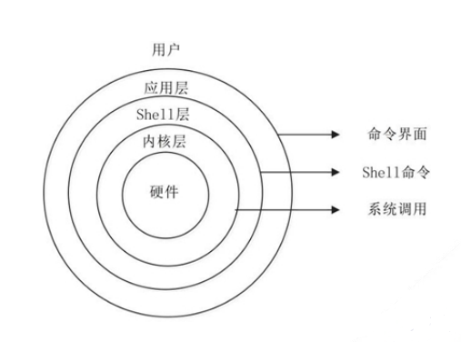
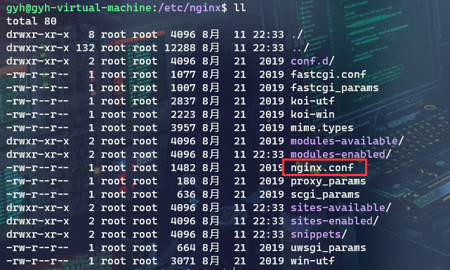

# 十三、微服务

## 目录

- [十三、微服务](#十三微服务)
  - [目录](#目录)
  - [1 Linux 基础](#1-linux-基础)
    - [1.1 Linux 介绍](#11-linux-介绍)
      - [1.1.1 Linux 的前世今生](#111-linux-的前世今生)
      - [1.1.2 Linux 的发行版本](#112-linux-的发行版本)
      - [1.1.3 Linux 操作系统的组成](#113-linux-操作系统的组成)
      - [1.1.4 Linux ⽂件系统⽬录](#114-linux-件系统录)
    - [1.2 Linux 操作](#12-linux-操作)
      - [1.2.1 高频命令](#121-高频命令)
      - [1.2.2 vim](#122-vim)
      - [1.2.3 用户管理](#123-用户管理)
      - [1.2.4 组管理](#124-组管理)
      - [1.2.5 权限管理](#125-权限管理)
      - [1.2.6 进程管理](#126-进程管理)
      - [1.2.7 网络管理](#127-网络管理)
  - [2 Nginx](#2-nginx)
    - [2.1 Nginx 介绍](#21-nginx-介绍)
    - [2.2 Nginx 使用](#22-nginx-使用)
      - [2.2.1 Nginx 安装](#221-nginx-安装)
      - [2.2.2 Nginx 常用命令](#222-nginx-常用命令)
      - [2.2.3 Nginx 配置⽂件](#223-nginx-配置件)
      - [2.2.4 Nginx 核心功能](#224-nginx-核心功能)


## 1 Linux 基础

### 1.1 Linux 介绍

#### 1.1.1 Linux 的前世今生

UNIX：UNIX 操作系统由肯•汤普森（Ken Thompson）和丹尼斯•⾥奇（Dennis Ritchie）发明。  

> 1965 年开始的 Multics ⼯程计划，该计划由⻉尔实验室、美国麻省理⼯学院和通⽤电⽓公司联合发
起，⽬标是开发⼀种交互式的、具有多道程序处理能⼒的分时操作系统，以取代当时⼴泛使⽤的批处理操作
系统。但是该计划最终却以失败收场。  
> 以肯•汤普森为⾸的⻉尔实验室研究⼈员吸取了 Multics ⼯程计划失败的经验教训，于 1969 年实现了
⼀种分时操作系统的雏形，1970 年该系统正式取名为 UNIX。  
> 但是之前的操作系统⼤多使⽤汇编语⾔编写，对硬件依赖性强，可移植性很差，1971-1972 年，肯•汤普
森的同事丹尼斯•⾥奇发明了传说中的 C 语⾔，UNIX 系统的绝⼤部分源代码都⽤ C 语⾔进⾏了重写，这为提
⾼ UNIX 系统的可移植性打下了基础。

LINUX：Linux 内核最初只是由芬兰⼈林纳斯·托瓦兹（Linus Torvalds）在赫尔⾟基⼤学上学时出于个
⼈爱好⽽编写的。Linux 是⼀套免费使⽤和⾃由传播的类 Unix 操作系统，是⼀个基于 POSIX 和 UNIX
的多⽤户、多任务、⽀持多线程和多 CPU 的操作系统。Linux 能运⾏主要的 UNIX ⼯具软件、应⽤程序
和⽹络协议。它⽀持 32 位和 64 位硬件。Linux 继承了 Unix 以⽹络为核⼼的设计思想，是⼀个性能稳
定的多⽤户⽹络操作系统。  

Linux 是⼀个类似 Unix 的操作系统，Unix 要早于 Linux，Linux 的初衷就是要替代 UNIX，并在功能
和⽤户体验上进⾏优化，所以 Linux 模仿了 UNIX（但并没有抄袭 UNIX 的源码），使得 Linux 在外
观和交互上与 UNIX ⾮常类似。

#### 1.1.2 Linux 的发行版本

Linxu 发行家族：
- Debian：
  - Ubuntu
  - Linux Mint

- Fedora：
  - RHEL
  - CentOS
  - Oracle Linux

- SUSE
  - SLES
  - openSUSE

- 其它发行版

⽬前市⾯上较知名的发⾏版有：Ubuntu、RedHat、CentOS、Debian、Fedora、SuSE、OpenSUSE、Arch Linux、SolusOS 等。

#### 1.1.3 Linux 操作系统的组成

UNIX 或者 Linux 系统⼤致可以分为以下⼏个部分：
- 最底层的硬件，以及和硬件交互的操作系统内核。
- 中间层是 Shell 层。
- 最外层是应⽤层。

<div align="center">

</div>

内核层：内核层是 UNIX/Linux 系统的核⼼和基础，它直接附着在硬件平台之上，控制和管理系统内各种资源（硬件资源和软件资源），有效地组织进程的运⾏，从⽽扩展硬件的功能，提⾼资源的利⽤效率，为⽤户提供⽅便、⾼效、安全、可靠的应⽤环境。

Shell 层：Shell 层是与⽤户直接交互的界⾯。⽤户可以在提示符下输⼊命令⾏，由 Shell 解释执⾏并输出相应结果或者有关信息，所以我们也把 Shell 称作命令解释器，利⽤系统提供的丰富命令可以快捷⽽简便地完成许多⼯作。

#### 1.1.4 Linux ⽂件系统⽬录

**在 Linux 中，⼀切皆为⽂件。**  

⽂件分为下⾯的⼀些类型：
- 普通⽂件
- ⽬录⽂件
- 链接⽂件
- 设备⽂件
- 管道⽂件

Linux ⽂件系统⽬录结构和熟知的 Windows 系统有较⼤区别，没有各种盘符的概念。根⽬录只有⼀个 `/`，采⽤层级式的树状⽬录结构。

```
/：根⽬录，所有的⽬录、⽂件、设备都在 / 之下。
|
|--bin：即 binary。系统所需要的那些命令位于此⽬录。
|
|--boot：Linux 的内核及引导系统程序所需要的⽂件⽬录。
|
|--dev：即 device。这个⽬录包含了所有 Linux 系统中使⽤的外部设备。这⾥放的不是外部设备的驱动程序，而是⼀个访问这些外部设备的端⼝。
|
|--etc：管理所有的配置⽂件的⽬录，⽐如安装 MySQL 的配置⽂件 my.conf。
|
|--home：如果建⽴⼀个⽤户，⽤户名是 "xx"，那么在 /home ⽬录下就有⼀个对应的 /home/xx 路径，⽤来存放⽤户的主⽬录。
|    |
|    |--用户 A
|    |
|    |--用户 B
| 
|--lib：即 library。这个⽬录是⽤来存放系统动态连接共享库的。⼏乎所有的应⽤程序都会⽤到这个⽬录下的共享库。因此，不要轻易对这个⽬录进⾏操作。
|
|--media：⾃动挂载的⽬录。⽐如插⼊⼀个 U 盘，会⾃动到 /media ⽬录中挂载。
|
|--mnt：可供系统管理员使⽤，⼿动挂载⼀些临时设备媒体设备的⽬录。
|
|--opt：额外安装软件存放的⽬录。⽐如 MySQL 的安装包就可以放在该⽬录。
|
|--root：Linux 超级权限⽤户 root 的家⽬录。
|
|--sbin：这个⽬录是⽤来存放系统管理员的系统管理程序。⼤多是涉及系统管理的命令的存放，是超级权限⽤户 root 的可执⾏命令存放地，普通⽤户⽆权限执⾏这个⽬录下的命令，sbin 中包含的都是 root 权限才能执⾏的。
|
|--usr：即 nix software resource，Linux 系统中占⽤硬盘空间最⼤的⽬录。⽤户的很多应⽤程序和⽂件都存放在这个⽬录下。
|    |
|    |--local：这⾥主要存放那些⼿动安装的软件，即不是通过或 apt-get 安装的软件。它和 /usr ⽬录具有相类似的⽬录结构。
|    |
|    |--share：系统共⽤的东⻄存放地，⽐如 /usr/share/fonts 是字体⽬录，/usr/share/doc 和 /usr/share/man 帮助⽂件。
|    |
|    |--bin
|
|--var
|
|--proc：存储的是当前内核运⾏状态的⼀系列特殊⽂件，⽤户可以通过这些⽂件查看有关系统硬件及当前正在运⾏进程的信息，甚⾄可以通过更改其中某些⽂件来改变内核的运⾏状态。
```

### 1.2 Linux 操作

#### 1.2.1 高频命令

基础命令：
命令 | 功能  
:- | :-   
`pwd` | 显示当前目录路径  
`ls` | list directory contents，显示当前⽂件夹下的⽬录或⽂件<br>`-a`：显示所有的⽂件夹和⽂件，包括隐藏⽂件<br>`-l`：以详细的形式显示 
`clear` | 清屏
`cd 路径` | 进⼊⼀个路径或者⽬录，绝对路径或者相对路径都可以<br>`~`：当前用户的根目录<br>`.`：当前目录<br>`..`：父目录

目录相关命令：
命令 | 功能  
:- | :-  
`mkdir 目录名` | 创建⼀个新的⽬录<br>`-p 路径`：连续创建目录  
`rmdir` | 删除⼀个空的⽬录
`cp 源路径 目标路径` | 复制⽂件或⽬录<br>`-r`：递归持续复制，⽤于⽬录的复制⾏为
`rm 路径` | 移除⽂件或⽬录<br>`-f`：即 force ，忽略不存在的⽂件，不会出现警告信息<br>`-i`：互动模式，在删除前会询问使⽤者是否动作<br>`-r`：递归删除
`mv 源路径 目标路径` | 移动文件 

文件相关命令：
命令 | 功能  
:- | :-  
`touch 文件名` | 创建文件 / 改变文件更新时间   
`cat filename` | 只读的⽅式打开⼀个⽂件。
`less` | 分⻚显示数据
`head filename` | 查看⼀个⽂件，取开头的⼀部分内容
`tail filename` | 查看⼀个⽂件的尾部内容<br>`-f`：尾部持续不断地输出内容
`echo` | 输出内容到控制台。⽐如输出 Linux 的环境变量到控制台：`echo $PATH`
`>` | 输出重定向（会将原来的内容覆盖）
`>>` | 追加（不会覆盖原⽂件的内容，追加到底部）
`tar` | `-c`：产⽣ .tar ⽂件<br>`-v`：显示详细信息<br>`-z`：打包同时压缩<br>`-f`：指定压缩后的⽂件名<br>`-x`：解压 .tar ⽂件<br>`-C`：表示解压到指定⽬录

示例：  
```
echo hello > a.txt

ls -l >> a.txt

cat a.txt > b.txt

tar -zcvf combine.tar.gz 1.txt

tar -zxvf combine.tar.gz -C java/
```

其它：
命令 | 功能  
:- | :-  
`whoami` | 查看当前用户名
`tree` | 查看目录结构  
`ln -s 真实文件 链接` | 建立软链接  
`curl -L 链接 > 文件名` | 下载文件  
`wget -p -H -e robots=off 链接` | 拷贝网页  
`df` | `-k`：磁盘占用  
`du` | `-sh`：当前目录大小<br>`-h`：各文件大小  

#### 1.2.2 vim

Ubuntu 默认没有安装 vim，需要先安装 vim ⼯具。  
```
sudo apt-get install vim
```

vim 有三种模式：
- 命令模式（Command mode）
- 插⼊模式（Insert mode）
- 末⾏模式（Last Linemode）。

**（1）命令模式**

通过指令 `vim filename` 进⼊命令模式。可以添加一些参数：
- `-r`：恢复上次 vim 打开时崩溃的⽂件。
- `-R`：把指定的⽂件以只读的⽅式放⼊ vim 编辑器中。
- `+`：打开⽂件，并把光标置于最后⼀⾏的⾸部。
- `+n`：打开⽂件，并把光标置于第 n ⾏的⾸部。

命令模式快捷键：
命令 | 功能  
:- | :-  
`x` | 删除光标所在位置的字符
`dd` | 删除光标所在⾏
`ndd` | 删除当前⾏后 n ⾏⽂本（包括此⾏）
`dG` | 删除光标所在⾏⼀直到⽂件末尾的所有内容
`D` | 删除光标位置到⾏尾的所有内容
`p` | 粘贴删除的内容
`w` | 光标移动⾄下⼀个单词⾸
`e` | 光标移动⾄下⼀个单词尾
`b` | 光标移动⾄上⼀个单词⾸
`gg` | 光标移动到⽂件开头
`G` | 光标移动⾄⽂件末尾
`nG` | 光标移动到第n⾏，n为数字
`0` / `^` | 光标移动⾄当前⾏的⾏⾸
`$` | 光标移动⾄当前⾏的⾏尾

**（2）插⼊模式**  

在命令模式下，通过按下 i、I、a、A、o、O 这 6 个字⺟进⼊插⼊模式，不同的字⺟代表不同的进⼊⽅
式。  

命令 | 功能  
:- | :- 
`i` | 在当前光标位置前⾯插⼊随后输⼊的⽂本，光标后的⽂本相应向右移动
`o` | 在光标所在⾏下⾯插⼊新的⼀⾏，然后光标停在空⾏⾸，等待输⼊⽂本
`O` | 在光标所在⾏上⾯插⼊新的⼀⾏，然后光标停在空⾏⾸，等待输⼊⽂本
`a` | 在当前光标位置后⾯插⼊随后输⼊的⽂本，光标后的⽂本相应向右移动
`A` | 在光标所在⾏的⾏尾插⼊随后输⼊的⽂本

按下 ESC 键离开插⼊模式，进⼊命令模式。

**（3）末行模式**  

在命令模式下，按下 `:` 键进⼊末⾏模式。在该模式下，可以使⽤⼀系列的指令，完成保存、离开 vim 编
辑器等功能。

命令 | 功能  
:- | :- 
`:wq` | 保存并退出vim编辑器
`:wq!` | 保存并强制退出vim编辑器
`:q` | 不保存退出
`:q!` | 不保存强制退出
`:w` | 保存不退出
`:w!` | 强制保存不退出
`:w filename` | 另存到filename⽂件
`ZZ` | 直接退出


#### 1.2.3 用户管理

Linux 系统是⼀个多⽤户、多任务的操作系统。多⽤户是指在 Linux 操作系统中可以创建多个⽤户，⽽这些多⽤户⼜可以同时执⾏各⾃不同的任务，⽽互不影响。
- ⽤户名：⽤户的名称
- ⽤户所属的组：当前⽤户所属的组。
- ⽤户的家⽬录：当前账号登录成功之后的⽬录，就叫做该⽤户的家⽬录。

创建用户：
```
sudo useradd ⽤户名
```

创建⼀个⽤户，⽤户名 test：
```
sudo useradd test
```
这种⽅式创建出来的没有家⽬录，因此创建的时候需要带参数。
- `-m` 表示在 /home⽬录下创建⼀个家⽬录。
- `-s` 指定 shell 版本。

```
sudo useradd -m test

sudo useradd -m -s /bin/bash test
```

给⽤户添加密码：
```
sudo passwd ⽤户名
```

切换用户：
```
su ⽤户名
```

删除⽤户：
```
sudo userdel ⽤户名
```
`-r`: 不仅会删除该⽤户，还会删除该⽤户对应的家⽬录。

#### 1.2.4 组管理

添加组：
```
groupadd [groupname]
```

创建⽤户的时候加⼊组：
```
useradd -m -s /bin/bash -g [groupname] [username]
```

查看⽤户及组信息：
```
id ⽤户名
```

修改⽤户所属组：
```
usermod -g [groupname] [username]
```

#### 1.2.5 权限管理

<div align="center">

</div>

前⾯ 10 个符号表示⽂件的⼀些基本信息：
- 第 1 位：
  - `-` 表示是⼀个普通的⽂件。
  - `d` 表示是⼀个⽬录。

- 第 2-4 位：表示⽂件所有者的权限。

- 第 5-7 位：⽂件所在组的拥有的权限。

- 第 8-10 位：⽂件其他组⽤户拥有的权限。

`rwx`：Read、Write、Execute，读、写、执⾏权限，这个顺序不会变，如果没有权限的话就⽤ `-` 代替。

通过 chmod 指令，可以修改⽂件或者⽬录的权限。  
示例：
```
方式一：
chmod u=rwx, g=rw, o=r filename

方式二：
chmod 751 filename
```

#### 1.2.6 进程管理

Linux 系统中查看进程使⽤情况的命令是 ps 指令。

常⻅选项：
- `-e`：显示所有进程。
- `-f`：全格式。
- `a`：显示终端上的所有进程。
- `u`：以⽤户的格式来显示进程信息。
- `x`：显示后台运⾏的进程。

⼀般常⽤格式为 `ps -ef` 或者 `ps aux` 两种。显示的信息⼤体⼀致，略有区别。

<div align="center">

</div>

- UID：⽤户 ID。   

- **PID**：进程 ID。  

- **PPID**：⽗进程 ID。  

- C：CPU ⽤于计算执⾏优先级的因⼦。数值越⼤，表明进程是 CPU 密集型运算，执⾏优先级会降低；数值越⼩，表明进程是 I/O 密集型运算，执⾏优先级会提⾼。  

- STIME：进程启动的时间。  

- TTY：完整的终端名称。  

- TIME：CPU 时间。  

- **CMD**：完整的启动进程所⽤的命令和参数。  

<div align="center">

</div>

- USER：⽤户名称。

- **PID**：进程号。

- **%CPU**：进程占⽤ CPU 的百分⽐。

- **%MEM**：进程占⽤物理内存的百分⽐

- VSZ：进程占⽤的虚拟内存⼤⼩（单位：KB）。

- RSS：进程占⽤的物理内存⼤⼩（单位：KB）。

- TT：终端名称（缩写），若为？，则代表此进程与终端⽆关，因为它们是由系统启动的。

- **STAT**：进程状态，其中 S- 睡眠，s- 表示该进程是会话的先导进程，N- 表示进程拥有⽐普通优先级更低的优先级，R- 正在运⾏，D- 短期等待，Z- 僵死进程，T- 被跟踪或者被停⽌等。

- STARTED：进程的启动时间。

- TIME：CPU时间，即进程使⽤ CPU 的总时间。

- COMMAND：启动进程所⽤的命令和参数，如果过⻓会被截断显示。

两者区别：
- 如果想查看进程的CPU占⽤率和内存占⽤率，可以使⽤ aux。

- 如果想查看进程的⽗进程 ID 和完整的 COMMAND 命令，可以使⽤ ef。

如果想在进程列表中进⼀步筛选出想查询的进程，可以使⽤管道符：
```
ps -ef | grep 搜索内容
```

终⽌进程：
```
kill [参数] 进程号
```
参数：
- `-9`：操作系统从内核级别强制杀死⼀个进程。

- `-15`：可以理解为操作系统发送⼀个通知告诉应⽤主动关闭。


服务管理：服务本质上来说也是⼀个进程，只不过是在后台运⾏，监听着某⼀端⼝，等待该端⼝的请求到来。⽐如 ssh 服务，监听着 22 端⼝；mysql 服务，监听着 3306 端⼝；tomcat 服务，监听着 80 或者 8080 端⼝。

指令（管理服务器的启动、停⽌、状态等）：
```
systemctl start/stop/restart/status/reload 服务名称
```

⽐如关闭 ssh 服务：
```
systemctl stop sshd
```


#### 1.2.7 网络管理

查看⽹络设置：
```
ifconfig
```

查看⽹络端⼝占⽤情况：
```
netstat
```
- -a：显示全部
- -n：以数字的形式显示
- -p：显示该连接被哪个应⽤程序占⽤PID

示例:
```
netstat -anp | grep 3306
```

另一种方式：
```
lsof -i: 端⼝号
```

查看⽹络是否正常：
```
ping ⽬的 ip 或者域名
```

## 2 Nginx

### 2.1 Nginx 介绍

Nginx（engine x）是⼀个⾼性能的 HTTP 和反向代理 Web 服务器，同时也提供了 IMAP/POP3/SMTP 服务。  
Nginx 是由伊⼽尔·赛索耶夫为俄罗斯访问量第⼆的 Rambler.ru 站点（俄⽂：Рамблер）开发的，第⼀个公开版本 0.1.0 发布于 2004 年 10 ⽉ 4 ⽇。  

其将源代码以类 BSD 许可证的形式发布，因它的稳定性、丰富的功能集、示例配置⽂件和低系统资源的消耗⽽闻名。2011 年 6 ⽉ 1 ⽇，Nginx 1.0.4 发布。  

Nginx 是⼀款轻量级的 Web 服务器 / 反向代理服务器及电⼦邮件（IMAP/POP3）代理服务器，在 BSDlike 协议下发⾏。其特点是占有内存少，并发能⼒强，事实上 Nginx 的并发能⼒在同类型的⽹⻚服务器中表现较好，中国⼤陆使⽤ Nginx ⽹站⽤户有：百度、京东、新浪、⽹易、腾讯、淘宝等。

Nginx 最核⼼的两个功能：
1. ⾼性能的静态 Web 服务器；

2. 反向代理。

正向代理：代理服务器是代表⽤户客户端去访问后端服务器，代理的对象是前⾯的⽤户。

反向代理：代理服务器是代表后端服务器供客户端去访问，对于前⾯的⽤户来说是⽆感知的，代理的对象是后⾯的后台服务器。

Nginx 的优势：
1. ⾼并发、⾼性能（⼀个进程可以处理多个请求）；

2. 扩展性好（模块化设计）；

3. 异步⾮阻塞的事件驱动模型；

4. ⾼可靠性（热部署、7*24）。

### 2.2 Nginx 使用

#### 2.2.1 Nginx 安装

Ubuntu 安装 Nginx ⾮常⽅便，可以直接使⽤ apt 源来安装：
```
sudo add-apt-repository ppa:nginx/stable
sudo apt-get update
sudo apt-get install nginx
```

执⾏命令查看是否安装成功：
```
nginx -v
```

主配置⽂件是 `nginx.conf`，Nginx 的指令放在 `/usr/sbin/nginx`，⽇志⽂件放在 `/var/log/nginx` 中。

<div align="center">

</div>


#### 2.2.2 Nginx 常用命令

```
cd /usr/sbin

# 启动
./nginx

# 关闭
./nginx -s stop

# 重启
./nginx -s reload
```

#### 2.2.3 Nginx 配置⽂件

Nginx 核⼼配置⽂件就是 nginx.conf ，打开这个核⼼配置⽂件
配置⽂件中有很多注释，去掉所有注释，精简之后的内容如下：
```conf
user www-data;
worker_processes auto;
pid /run/nginx.pid;
include /etc/nginx/modules-enabled/*.conf;

events {
        worker_connections 768;
}

http {

        sendfile on;
        tcp_nopush on;
        tcp_nodelay on;
        keepalive_timeout 65;
        types_hash_max_size 2048;

        include /etc/nginx/mime.types;
        default_type application/octet-stream;

        ssl_protocols TLSv1 TLSv1.1 TLSv1.2;

        ssl_prefer_server_ciphers on;

        access_log /var/log/nginx/access.log;
        error_log /var/log/nginx/error.log;

        gzip on;

        include /etc/nginx/conf.d/*.conf;
        include /etc/nginx/sites-enabled/*;
}
```

根据上述⽂件，可以很明显的将 nginx.conf 配置⽂件分为三部分：

<div align="center">

</div>

**（1）全局配置**  

从配置⽂件开始到 events 块之间的内容，主要会设置⼀些影响 nginx 服务器整体运⾏的配置指令，主要包括配置运⾏ Nginx 服务器的⽤户（组）、允许⽣成的 worker process 数，进程 PID 存放路径、⽇志存放路径和类型以及配置⽂件的引⼊等。

```conf
user www-data; # 运⾏worker⼦进程的⽤户
worker_processes auto; # ⼦进程的个数
pid /run/nginx.pid; # 运⾏master的pid⽂件存放的路径
include /etc/nginx/modules-enabled/*.conf; # 将其他配置⽂件包含进来
```

这是 Nginx 服务器并发处理服务的关键配置，worker_processes 值越⼤，可以⽀持的并发处理量也越多，但是会受到硬件、软件等设备的制约。

**（2）events 配置**

```conf
events {
    worker_connections 768;
}
```
events 块涉及的指令主要影响 Nginx 服务器与⽤户的⽹络连接，常⽤的设置包括是否开启对多 work process 下的⽹络连接进⾏序列化，是否允许同时接收多个⽹络连接，选取哪种事件驱动模型来处理连接请求，每个 word process 可以同时⽀持的最⼤连接数等。上述就表示每个 work process ⽀持的最⼤连接数为 768，这部分的配置对 Nginx 的性能影响较⼤，在实际中应该灵活配置。

**（3） http 配置**  

这算是 Nginx 服务器配置中最频繁的部分，代理、缓存和⽇志定义等绝⼤多数功能和第三⽅模块的配置都在这⾥。  

需要注意的是：http 块也可以包括 http 全局块、server 块。
- http 全局块：http 全局块配置的指令包括⽂件引⼊、MIME-TYPE 定义、⽇志⾃定义、连接超时时间、单链接请求数上限等。

- server 块：这块和虚拟主机有密切关系，虚拟主机从⽤户⻆度看，和⼀台独⽴的硬件主机是完全⼀样的，该技术的产⽣是为了节省互联⽹服务器硬件成本。

每个 http 块可以包括多个 server 块，⽽每个 server 块就相当于⼀个虚拟主机。  
⽽每个 server 块也分为全局 server 块，以及可以同时包含多个 locaton 块。


配置详解：
```conf
########### 每个指令必须有分号结束。#################
#user administrator administrators; # 配置⽤户或者组，默认为 nobody。
#worker_processes 2; # 允许⽣成的进程数，默认为 1
#pid /nginx/pid/nginx.pid; # 指定 nginx 进程运⾏⽂件存放地址
error_log log/error.log debug; # 制定⽇志路径，级别。这个设置可以放⼊全局块，http块，server块，级别以此为：debug|info|notice|warn|error|crit|alert|emerg

events {
    accept_mutex on; # 设置⽹路连接序列化，防⽌惊群现象发⽣，默认为 on
    multi_accept on; # 设置⼀个进程是否同时接受多个⽹络连接，默认为 off
    #use epoll; # 事件驱动模型，select|poll|kqueue|epoll|resig|/dev/poll|eventport
    worker_connections 1024; # 最⼤连接数，默认为 512
}

http {
    include mime.types; # ⽂件扩展名与⽂件类型映射表
    default_type application/octet-stream; # 默认⽂件类型，默认为 text/plain
    #access_log off; # 取消服务⽇志
    log_format myFormat '$remote_addr–$remote_user [$time_local] $request $status $body_bytes_sent $http_referer $http_user_agent $http_x_forwarded_for'; #⾃定义格式
    access_log log/access.log myFormat; # combined 为⽇志格式的默认值
    sendfile on; # 允许 sendfile ⽅式传输⽂件，默认为 off，可以在 http 块，server 块，location块。
    sendfile_max_chunk 100k; # 每个进程每次调⽤传输数量不能⼤于设定的值，默认为 0，即不设上限。
    keepalive_timeout 65; # 连接超时时间，默认为 75s，可以在 http，server，location 块。
    upstream mysvr {
        server 127.0.0.1:7878;
        server 192.168.10.121:3333 backup; # 热备
    }
    error_page 404 https://www.baidu.com; # 错误⻚
    server {
        keepalive_requests 120; # 单连接请求上限次数。
        listen 4545; # 监听端⼝
        server_name 127.0.0.1; # 监听地址
        location ~*^.+$ { # 请求的url过滤，正则匹配，~为区分⼤⼩写，~*为不区分⼤⼩写。
            #root path; # 根⽬录
            #index vv.txt; # 设置默认⻚
            proxy_pass http://mysvr; # 请求转向mysvr 定义的服务器列表
            deny 127.0.0.1; # 拒绝的 ip
            allow 172.18.5.54; # 允许的 ip
        }
    }
}
```

#### 2.2.4 Nginx 核心功能

**（1）反向代理配置**  

```conf
http{
    ...
    ...
    # 这部分是被代理服务器的设置 gyh 只是⼀个代号
    upstream gyh{
        server 192.168.0.103:8080;
    }
    # 这部分是 nginx 作为反向代理服务器的配置
    server{
        # nginx 监听的端⼝
        listen 80;
        # 虚拟服务器的识别标记，⼀般配置为本机 ip
        server_name 192.168.0.103;
        # 代理设置地址
        location / {
            proxy_pass http://gyh;
        }
    }
}
```

**（2）负载均衡配置**  

负载均衡策略：
1. 轮询（默认）。

2. weight。

3. ip_hash。

4. least_conn 最少连接⽅式。

5. fair（第三⽅）响应时间。

6. url_hash（第三⽅）。

weight：weight 代表权重,默认为 1,权重越⾼被分配的客户端越多。  
示例：
```congf
upstream gyh{
    server 192.168.0.103:8080 weight=2;
    server 192.168.0.103:8081 weight=1;
}
```

ip_hash：每个请求按访问 ip 的 hash 结果分配，这样每个访客固定访问⼀个后端服务器，可以解决 session 的问题。  
示例：
```conf
upstream gyh{
    ip_hash;
    server 192.168.0.103:8080;
    server 192.168.0.103:8081;
}
```

**（3）缓存**  

Nginx 从 0.7.48 版本开始，⽀持了类似 Squid 的内容缓存功能。这个缓存是把 URL 及相关组合当作 Key，⽤ md5 编码哈希后保存在硬盘上，所以它可以⽀持任意 URL 链接，同时也⽀持 404/301/302 这样的⾮ 200 状态码。

Nginx 缓存配置：
```conf
...
http{
    ...
    # 声明⼀个 cache 缓存节点的内容，levels 在 /path/to/cache/ 设置了⼀个两级层次结构的⽬录。设置 Web 缓存区名称为 cache_one，内存缓存空间⼤⼩为 200MB，1 天没有被访问的内容⾃动清除，硬盘缓存空间⼤⼩为 30GB。
    proxy_cache_path /etc/nginx/tmp_cache levels=1:2 keys_zone=cache_one:200m inactive=1d max_size=30g;

    server{
        ...
        location / {
            proxy_cache cache_one;
            proxy_cache_key $uri;
            proxy_cache_valid 200 206 304 301 302 10d;
            proxy_pass http://gyh;
        }
        ...
    }
}
```