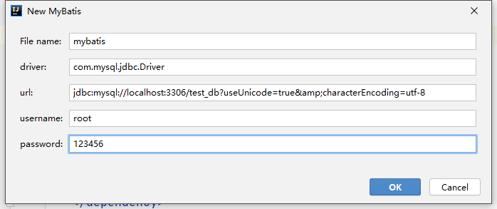

# 十一、MyBatis

## 目录

- [十一、MyBatis](#十一mybatis)
  - [目录](#目录)
  - [1 MyBatis](#1-mybatis)
    - [1.1 MyBatis 概述](#11-mybatis-概述)
    - [1.2 入门案例](#12-入门案例)
    - [1.3 MyBatis 配置](#13-mybatis-配置)
      - [1.3.1 properties](#131-properties)
      - [1.3.2 settings](#132-settings)
      - [1.3.3 typeAliases](#133-typealiases)
      - [1.3.4 typehandler](#134-typehandler)
      - [1.3.5 mappers](#135-mappers)
  - [2 Log4j](#2-log4j)
  - [3 高级映射](#3-高级映射)
    - [3.1 输入映射](#31-输入映射)
      - [3.1.1 单个参数](#311-单个参数)
      - [3.1.2 多个参数](#312-多个参数)
      - [3.1.3 注解方式](#313-注解方式)
    - [3.2 输出映射](#32-输出映射)
      - [3.2.1 基本类型、包装类、java.lang](#321-基本类型包装类javalang)
      - [3.2.2 javabean](#322-javabean)
      - [3.2.3 resultMap](#323-resultmap)
    - [3.3 动态 sql 标签](#33-动态-sql-标签)
      - [3.3.1 where](#331-where)
      - [3.3.2 if](#332-if)
      - [3.3.3 choose-when-otherwise](#333-choose-when-otherwise)
      - [3.3.4 trim](#334-trim)
      - [3.3.5 set](#335-set)
      - [3.3.6 sql 和 include](#336-sql-和-include)
      - [3.3.7 selectKey](#337-selectkey)
      - [3.3.8 foreach](#338-foreach)
      - [3.3.9 useGenerateKeys 和 keyProperty](#339-usegeneratekeys-和-keyproperty)
    - [3.4 多表映射](#34-多表映射)
      - [3.4.1 一对一](#341-一对一)
      - [3.4.2 一对多](#342-一对多)
      - [3.4.3 多对多](#343-多对多)
    - [3.5 settings](#35-settings)
      - [3.5.1 缓存](#351-缓存)
      - [3.5.2 懒加载](#352-懒加载)
  - [4 SSM 整合](#4-ssm-整合)
    - [4.1 配置文件形式](#41-配置文件形式)
    - [4.2 javaconfig](#42-javaconfig)
  - [5 generator 工具](#5-generator-工具)

## 1 MyBatis

### 1.1 MyBatis 概述

MyBatis 是一款优秀的持久层框架，它支持定制化 SQL（灵活的修改）、存储过程（函数）以及高级映射（javabean 和数据库对象的映射，输入映射和输出映射）。  
MyBatis 避免了几乎所有的 JDBC 代码和手动设置参数以及获取结果集。  

特点：
- 定制化 sql 更能适应业务复杂度。

- 高级映射：输入映射和输出映射。  
  - 输入映射：对象 -> 关系表，为预编译的sql提供参数。

  - 输出映射：关系表 -> 对象，查询结果的封装。

- 动态 sql：根据参数的不同可以动态的更改执行的 sql 语句。

- 分离 sql，集中管理。通过映射文件，分别管理不同的模块。

- MyBatis 对参数和结果的封装处理更完善，直接封装成对应的类型，使用更方便。

MyBatis 可以使用简单的 XML 或注解来配置和映射原生信息，将接口和 Java 的 POJOs 映射成数据库中的记录（ORM和持久化）。

ORM（Object Relational Mapping）框架：
- Object：javabean。
- Relational：关系表。
- Mapping：一个 javabean 对象就可以对应一条关系表中的记录。


### 1.2 入门案例

将 sql 语句集中管理到映射文件中，然后去调用映射文件中的 sql。

**第一步**：导入依赖。

```xml
<dependencies>
    <dependency>
        <groupId>org.mybatis</groupId>
        <artifactId>mybatis</artifactId>
        <version>3.5.4</version>
    </dependency>
    <dependency>
        <groupId>mysql</groupId>
        <artifactId>mysql-connector-java</artifactId>
        <version>5.1.47</version>
        <scope>runtime</scope>
    </dependency>

    <dependency>
        <groupId>junit</groupId>
        <artifactId>junit</artifactId>
        <version>4.12</version>
        <scope>test</scope>
    </dependency>
    <dependency>
        <groupId>org.projectlombok</groupId>
        <artifactId>lombok</artifactId>
        <version>1.18.12</version>
    </dependency>
</dependencies>
```

**第二步**：引入 MyBatis 的配置文件。

MyBatis 官网找到配置模板：
```xml
<?xml version="1.0" encoding="UTF-8" ?>
<!DOCTYPE configuration
  PUBLIC "-//mybatis.org//DTD Config 3.0//EN"
  "http://mybatis.org/dtd/mybatis-3-config.dtd">
<configuration>
  <environments default="development">
    <environment id="development">
      <transactionManager type="JDBC"/>
      <dataSource type="POOLED">
        <property name="driver" value="${driver}"/>
        <property name="url" value="${url}"/>
        <property name="username" value="${username}"/>
        <property name="password" value="${password}"/>
      </dataSource>
    </environment>
  </environments>
  <mappers>
    <mapper resource="org/mybatis/example/BlogMapper.xml"/>
  </mappers>
</configuration>
```

新建 MyBatis 配置：
<div align="center">

</div>

注：第一次配置时 `http://mybatis.org/dtd/mybatis-3-mapper.dtd` 会报红，需要在 IDEA 中添加配置：  

<div align="center">

</div>

`<mappers>` 标签中的 `resource` 属性加载映射文件。
```xml
<mappers>
    <mapper resource="mapper/UserMapper.xml"/>
</mappers>
```

映射文件：
```xml
<!-- 示例：resources/mapper/UserMapper.xml -->
<!-- 映射文件的名字：xxxMapper -->

<?xml version="1.0" encoding="UTF-8" ?>
<!DOCTYPE mapper
        PUBLIC "-//mybatis.org//DTD Mapper 3.0//EN"
        "http://mybatis.org/dtd/mybatis-3-mapper.dtd">
<!--namespace 就是该映射文件的唯一 id，映射文件的 namespace（命名空间）不能重复-->
<mapper namespace="userMapper">
<!-- sql 语句 -->
</mapper>
```

**第三步**：映射文件中使用 slq 语句。

```xml
<mapper namespace="userMapper">

    <!--select 意味着 sql 语句是查询-->
    <!--id 是该 sql 语句在该映射文件下的唯一标识，这个 id 在这个映射文件中是唯一的不能重复-->
    <!--resultType 查询结果封装的类型-->
    <!--占位符的写法 #{}-->
    <select id="selectUsernameById" resultType="java.lang.String">
        select username from user_tb where id = #{id}
    </select>

    <!--selectList 仍然使用的是 select 标签-->
    <!--查询多条记录，resultType 仍然写的是单条记录的类型-->
    <select id="selectUsernames" resultType="java.lang.String">
        select username from user_tb
    </select>

    <!--insert 标签做新增操作-->
    <!--增删改都不需要也写不了 resultType-->
    <!--如果传入的 Object 参数类型是 javabean 或 map 对象，#{} 中使用 javabean 的成员变量名或 map 的 key-->
    <insert id="insertUser">
        insert into user_tb (id, username, password, age, gender) value
        (#{id}, #{username}, #{password}, #{age}, #{gender})
    </insert>

    <update id="updateUser">
        update user_tb set password = #{password} where id = #{id}
    </update>

    <delete id="deleteUserById">
        delete from user_tb where id = #{zzz}
    </delete>
</mapper>
```

**第四步**：测试。

```java
public class MyBatisTest {
    static SqlSessionFactory sqlSessionFactory;
    SqlSession sqlSession = null;
    
    @BeforeClass
    public static void beforeClass() throws IOException {
        SqlSessionFactoryBuilder builder = new SqlSessionFactoryBuilder();
        InputStream inputStream = Resources.getResourceAsStream("mybatis.xml");
        // sqlSessionFactory 线程安全，只初始化一次
        sqlSessionFactory = builder.build(inputStream);
    }

    @Before // 每一个 @Test 方法执行之前都会执行的方法
    public void init() {
        // 线程不安全，每个单元测试方法都要初始化一个新的 sqlSession
        sqlSession = sqlSessionFactory.openSession();
    }

    @After
    public void commit(){
        if (sqlSession != null) {
            sqlSession.commit();
            sqlSession.close();
        }
    }


    /**
     * select
     */
    @Test
    public void mytest() throws IOException {

        // SqlSessionFactoryBuilder builder = new SqlSessionFactoryBuilder();
        // InputStream inputStream = Resources.getResourceAsStream("mybatis.xml");
        // SqlSessionFactory sqlSessionFactory = builder.build(inputStream);
        // SqlSession sqlSession = sqlSessionFactory.openSession();

        String sqlId = "userMapper" + "." + "selectUsernameById";
        String username = sqlSession.selectOne(sqlId, 2);
        System.out.println("username = " + username);
    }

    @Test
    public void mytest2() throws IOException {

        List<String> usernames = sqlSession.selectList("userMapper.selectUsernames");
        System.out.println(usernames);
    }

    /**
     * insert
     */
    @Test
    public void mytest3() throws IOException {
        User user = new User(3, "li4", "123456", 20, "male");
        int insert = sqlSession.insert("userMapper.insertUser", user);
        System.out.println("insert = " + insert);
    }

    /**
     * update
     */
    @Test
    public void mytest4(){
        Map map = new HashMap();
        map.put("id", 3);
        map.put("password", "654321");
        int update = sqlSession.update("userMapper.updateUser", map);
    }

    /**
     * delete
     */
    @Test
    public void mytest5(){
        int delete = sqlSession.delete("userMapper.deleteUserById", 3);
        System.out.println("delete = " + delete);
    }
}
```

### 1.3 MyBatis 配置

#### 1.3.1 properties

给 MyBatis 中的配置项（mybatis.xml）提供参数。

**（1）单项配置**

示例：
```xml
<properties>
    <!--name 方便配置文件引用值-->
    <property name="driver" value="com.mysql.jdbc.Driver"/>
    <property name="jdbcUrl" value="jdbc:mysql://localhost:3306/test_db"/>
</properties>
```

使用：
```xml
<property name="driver" value="${driver}"/>
<property name="url" value="${jdbcUrl}"/>
```

**（2）批量配置**

引入一个 properties 配置文件。

示例：
```xml
<properties resource="db.properties"/>
```

使用：
```xml
<property name="driver" value="${db.driver}"/>
<property name="url" value="${db.jdbcUrl}"/>
```

注：properties 配置文件中不需要使用转义字符。

#### 1.3.2 settings

```xml
<settings>
    <setting name="" value="">
</settings>
```

具体配置参考：[官方文档](https://mybatis.org/mybatis-3/zh/configuration.html#settings)。

#### 1.3.3 typeAliases

类型别名可为 Java 类型设置一个缩写名字。它仅用于 XML 配置，意在降低冗余的全限定类名书写。

**（1）单项配置**  

示例：
```xml
<typeAliases>
    <!--type 写全类名，alias 写的就是别名-->
    <typeAlias type="com.gyh.bean.User" alias="userz"/>
</typeAliases>
```

使用：
```xml
<mapper namespace="userMapper">
    <!--配置了别名之后，既可以写全类名，也可以写别名-->
    <select id="selectUserById" resultType="userz">
        select id,username,password,age,gender from user_tb where id = #{id}
    </select>
</mapper>
```

**（2）多项配置**  

示例：
```xml
<typeAliases>
    <!--name 写包名，则包下所有的 javabean 都给配置了别名，规律：类名的纯小写-->
    <package name="com.gyh.bean"/>
</typeAliases>
```

**（3）MyBatis 提供的别名**

基本类型、包装类、java.lang 目录下的类。  

| 别名 | 映射的类型 |
| :- | :- |
| _byte | byte |
| _long | long |
| _short | short |
| _int | int |
| _integer | int |
| _double | double |
| _float | float |
| _boolean | boolean |
| string | String |
| byte | Byte |
| long | Long |
| short | Short |
| int | Integer |
| integer | Integer |
| double | Double |
| float | Float |
| boolean | Boolean |
| date | Date |
| decimal | BigDecimal |
| bigdecimal | BigDecimal |
| object | Object |
| map | Map |
| hashmap | HashMap |
| list | List |
| arraylist | ArrayList |
| collection | Collection |
| iterator | Iterator |

#### 1.3.4 typehandler

MyBatis 在设置预处理语句（PreparedStatement）中的参数或从结果集中取出一个值时，都会用类型处理器将获取到的值以合适的方式转换成 Java 类型。

示例：
```xml
<typeHandlers>
    <!--单个typeHandler的注册-->
    <typeHandler handler="com.gyh.typehandler.UserDetailTypehandler"/>
    <!--批量注册-->
    <package name="com.gyh.typehandler"/>
</typeHandlers>
```

```java
@MappedTypes(UserDetail.class)  // 查询结果对应的类型
@MappedJdbcTypes(JdbcType.VARCHAR)  // 在数据库中对应的类型
//public class UserDetailTypehandler implements TypeHandler{
public class UserDetailTypehandler extends BaseTypeHandler<UserDetail>{

    ObjectMapper objectMapper = new ObjectMapper();
    // 输入映射的过程 UserDetail → String
    @SneakyThrows
    @Override
    public void setNonNullParameter(PreparedStatement preparedStatement, int index, UserDetail userDetail, JdbcType jdbcType) throws SQLException {
        String value = objectMapper.writeValueAsString(userDetail);
        preparedStatement.setString(index,value);
    }

    // 输出映射过程  String → UserDetail
    // 首先要拿到查询结果：
        // String value = resultSet.getString(columnLabel);
        // String value = resultSet.getString(index);
        // String value = callableStatement.getString(index);
        // → 接着写转换逻辑
    @Override
    public UserDetail getNullableResult(ResultSet resultSet, String columnLabel) throws SQLException {
        String value = resultSet.getString(columnLabel);
        return transfer(value);
    }

    @Override
    public UserDetail getNullableResult(ResultSet resultSet, int index) throws SQLException {
        String value = resultSet.getString(index);
        return transfer(value);
    }

    @Override
    public UserDetail getNullableResult(CallableStatement callableStatement, int index) throws SQLException {
        String value = callableStatement.getString(index);
        return transfer(value);
    }
    private UserDetail transfer(String value){
        if (value != null && !"".equals(value)){
            UserDetail userDetail = null;
            try {
                userDetail = objectMapper.readValue(value, UserDetail.class);
            } catch (JsonProcessingException e) {
                e.printStackTrace();
            }
            return userDetail;
        }
        return null;
    }
}
```


#### 1.3.5 mappers

**（1）逐项配置**  

resource：
```xml
<mappers>
    <mapper resource="mapper/UserMapper.xml"/>
</mappers>
```

url：
```xml
<mappers>
    <!--url 属性：加载的是文件路径下的映射文件-->
    <mapper url="file:///D:\MyWorkSpace\xxx\mapper\UserMapper.xml"/>
</mappers>
```

class：
```xml
<mappers>
    <!--class 属性：-->
    <!--接口和映射文件
        1、接口和映射文件要在同一级 classpath 目录下，并且同名
        2、映射文件的 namespace 值和接口的全类名一致
        3、接口中的方法名和 crud 标签的 id 一致
        分析：namespace.id → 接口的全类名 + 接口中的方法名
    -->
    <mapper class="com.gyh.mapper.UserMapper"/>
</mappers>
```

使用：
```java
@Test
public void myTest(){
    UserMapper mapper = sqlSession.getMapper(UserMapper.class);
    User user = mapper.selectUserById(1);
}
```


**（2）批量配置**  

示例：
```xml
<mappers>
    <package name="com.gyh.mapper"/>
</mappers>
```

## 2 Log4j

MyBatis 本身支持了 log4j，可以直接使用。

**第一步**：新增依赖。

```xml
<dependency>
    <groupId>log4j</groupId>
    <artifactId>log4j</artifactId>
    <version>1.2.17</version>
</dependency>
```

**第二步**：复制配置文件。

log4j.properties：
```properties
#Appender
#org.apache.log4j.ConsoleAppender（控制台）
#org.apache.log4j.FileAppender（文件）
#org.apache.log4j.DailyRollingFileAppender（每天产生一个日志文件）
#org.apache.log4j.RollingFileAppender（文件大小到达指定尺寸的时候产生一个新的文件）
#org.apache.log4j.WriterAppender（将日志信息以流格式发送到任意指定的地方）

### direct log messages to stdout ###
log4j.appender.stdout=org.apache.log4j.ConsoleAppender
log4j.appender.stdout.Target=System.out
log4j.appender.stdout.layout=org.apache.log4j.PatternLayout
log4j.appender.stdout.layout.ConversionPattern=%d{ABSOLUTE} %5p %c{1}:%L - %m%n

### direct messages to file hibernate.log ###
log4j.appender.file=org.apache.log4j.FileAppender
log4j.appender.file.File=d://mybatis.log
log4j.appender.file.layout=org.apache.log4j.PatternLayout
log4j.appender.file.layout.ConversionPattern=%d{ABSOLUTE} %5p %c{1}:%L - %m%n

#org.apache.log4j.HTMLLayout（以 HTML 表格形式布局）
#org.apache.log4j.PatternLayout（可以灵活地指定布局模式）
#org.apache.log4j.SimpleLayout（包含日志信息的级别和信息字符串）
#org.apache.log4j.TTCCLayout（包含日志产生的时间、线程、类别等信息）
log4j.appender.file2 = org.apache.log4j.FileAppender
log4j.appender.file2.File=d://file2.log
log4j.appender.file2.layout=org.apache.log4j.SimpleLayout
#log4j.appender.file2.layout.ConversionPattern=%d{ABSOLUTE} %5p %c{1}:%L - %m%n

### DEBUG、INFO、WARN、ERROR 和 FATAL
# 日志级别 + 输出 appender
log4j.rootLogger=debug, file, stdout, file2
```

## 3 高级映射

### 3.1 输入映射

映射文件中的 sql 语句要执行，有一个预编译的过程。  

输入映射：为预编译的 sql 语句提供参数。

接口的方法中提供不同写法的参数时，`#{}` 的内容也对应不同的写法。

#### 3.1.1 单个参数

**情形 1**：基本类型、包装类、java.lang。

`#{}` 中可以任意写。

示例：
```java
String selectUsernameById(int id);
String selectUsernameByAge(Integer age);
String selectPasswordByUsername(String username);
```

```xml
<!--基本类型-->
<select id="selectUsernameById" resultType="string">
    select username from user_tb where id = #{idz}
</select>
<!--包装类-->
<select id="selectUsernameByAge" resultType="java.lang.String">
    select username from user_tb where age = #{agezzz}
</select>
<!--字符串-->
<select id="selectPasswordByUsername" resultType="java.lang.String">
    select password from user_tb where username = #{usernamebbb}
</select>
```

**情形 2**：javabean 和 map。

javabean：`#{}` 使用 javabean 的成员变量名。
map：`#{}` 使用的是 map 的 key。


示例：
```java
int insertUser(User user);
int updatePasswordByUsername(Map map);
```

```xml
<insert id="insertUser">
    insert into user_tb (id, username, password, age, gender) values
    (#{id}, #{username}, #{password}, #{age}, #{gender})
</insert>

<update id="updatePasswordByUsername">
    update user_tb set password = #{password} where username = #{username}
</update>
```

#### 3.1.2 多个参数

基本类型、包装类、java.lang：param 或 arg
javabean 或 map：要使用 param 或 arg，然后再加上 javabean 的成员变量名或 map 的 key。

param：下标从 1 开始。如果是第一个参数 param1。
arg：下标从 0。如果是第一个参数 arg0。

示例：
```java
int insertUserMultiParam(int id, String username, User user, Integer age, Map map);
```

```xml
<insert id="insertUserMultiParam">
    insert into user_tb (id, username, password, age, gender)
    values (#{param1}, #{param2}, #{param3.password}, #{param4}, #{param5.gender})
</insert>
```

#### 3.1.3 注解方式

在接口的形参上，添加 `@Parm("")` 注解。

示例：
```java
String selectUsernameById(@Param("id") int id);
String selectUsernameByAge(@Param("age") Integer age);
String selectPasswordByUsername(@Param("username") String username);

int insertUser(@Param("user") User user);
int updatePasswordByUsername(@Param("map") Map map);

int insertUserMultiParam(@Param("id") int id,
                            @Param("username") String username,
                            @Param("user") User user,
                            @Param("age") Integer age,
                            @Param("map") Map map);
}
```

```xml
<select id="selectUsernameById" resultType="string">
    select username from user_tb where id = #{id}
</select>

<select id="selectUsernameByAge" resultType="java.lang.String">
    select username from user_tb where age = #{age}
</select>

<select id="selectPasswordByUsername" resultType="java.lang.String">
    select password from user_tb where username = #{username}
</select>

<insert id="insertUser">
    insert into user_tb (id,username,password,age,gender) values
    (#{user.id}, #{user.username}, #{user.password}, #{user.age}, #{user.gender})
</insert>

<update id="updatePasswordByUsername">
    update user_tb set password = #{map.password} where username = #{map.username}
</update>

<insert id="insertUserMultiParam">
    insert into user_tb (id, username, password, age, gender)
    values
    (#{id}, #{username}, #{user.password}, #{age}, #{map.gender})
</insert>
```

### 3.2 输出映射

查询结果的封装。

#### 3.2.1 基本类型、包装类、java.lang

示例：
```java
String selectUsernameById(@Param("id") Integer id);
String[] selectUsernameArray();
List<String> selectUsernameList();
```

```xml
<select id="selectUsernameById" resultType="string">
    select username from user_tb where id = #{id}
</select>
<select id="selectUsernameArray" resultType="string">
    select username from user_tb
</select>
<select id="selectUsernameList" resultType="string">
    select username from user_tb
</select>
```


#### 3.2.2 javabean

查询结果的列名和 javabean 的成员变量名对应。

示例：
```java
User selectUserById(@Param("id") Integer id);
User[] selectUserArray();
List<User> selectUserList();
```

```xml
<select id="selectUserById" resultType="com.gyh.bean.User">
    select id, username, password, age, gender, create_date as createDate from user_tb
    where id = #{id}
</select>
<select id="selectUserArray" resultType="com.gyh.bean.User">
    select id, username, password, age, gender, create_date as createDate from user_tb
</select>
<select id="selectUserList" resultType="com.gyh.bean.User">
    select id, username, password, age, gender, create_date as createDate from user_tb
</select>
```

#### 3.2.3 resultMap

resultType：查询结果的列名和 javabean 的成员变量名一致。

resultMap：不一定一致，但是要有映射关系。

示例：
```xml
<mapper namespace="com.gyh.mapper.UserMapper">
    <resultMap id="userMap" type="com.gyh.bean.User">
        <!--id 和 result 标签一样，id 可以写主键-->
        <!--column：查询结果的列名-->
        <!--property：result 标签的父标签对应 javabean 的成员变量名-->
        <result column="id" property="id"/>
        <result column="username" property="username"/>
        <result column="password" property="password"/>
        <result column="age" property="age"/>
        <result column="gender" property="gender"/>
        <result column="create_date" property="createDate"/>
    </resultMap>
    <select id="selectUserById" resultMap="userMap">
        select id, username, password, age, gender, create_date from user_tb where id = #{id}
    </select>
</mapper>
```

好处：
- 查询结果的列名和 javabean 的成员变量名要求不一定一致。

- resultMap 写在外围，可以方便 select 标签进行引用；resultMap 类似全局变量。

- 多表映射都需要使用到 resultMap。

### 3.3 动态 sql 标签

#### 3.3.1 where

连接条件。

示例：
```xml
<select id="selectUserById" resultMap="userMap">
    select id, username, password, age, gender, create_date from user_tb
    <where>
        id = #{id}
    </where>
</select>
```

#### 3.3.2 if

条件查询。

```xml
<!--test 属性做条件的判断，test 属性中可以写的值和 @Param 注解中的值相关-->
<select id="selectUserByUsernameAndPassword" resultMap="userMap">
    select id, username, password, age, gender, create_date from user_tb
    <where>
        <if test="username != null">
            username = #{username}
        </if>
        <!--如果 username 为空，where 标签会自动略去前缀 and-->
        <if test="password != null">
            and password = #{password}
        </if>
    </where>
</select>
```

test 属性中的判断：
| 功能 | 符号 |
| :- | :- |
| 大于 | gt |
| 小于 | lt |
| 连接条件 | and 或者 or |
| 等于 | == |
| 不等于 | != |

示例：
判断 age≥20：`age gt 20 or age == 20`。  
判断 age≤20：`age lt 20 or age == 20`。

test 中字符串使用 `''` 包围，字符串长度：`.length`。

转义字符：
- `>`：`&gt;`  

- `<`：`&lt;`

#### 3.3.3 choose-when-otherwise

就是 if-else 功能：
- when 代表 if。
- otherwise 代表 else
- when 标签中也是去写 test 属性。
- when 标签和 otherwise 标签要作为 choose 标签的子标签。

示例：
```xml
<select id="selectUserByAgeByChooseWhen" resultMap="userMap">
    select id, username, password, age, gender, create_date from user_tb
    <where>
        <choose>
            <when test="age gt 20 or age == 20">
                age &gt;= #{age}
            </when>
            <otherwise>
                age &lt; #{age}
            </otherwise>
        </choose>
    </where>
</select>
```

#### 3.3.4 trim

去除功能：
- prifixOverrides：如果最前面包含某个词，去除掉。
- suffixOverrides：如果最后面包含某个词，去除掉。

补充功能：
- prefix：在 trim 标签最前面补充。
- suffix：在 trim 标签最后面补充。

```xml
<update id="updateSelectiveUser">
    update user_tb
    <trim suffixOverrides="," prefixOverrides="pref" prefix="set">
        pref
        <if test="user.username != null">
            username = #{user.username},
        </if>
        <if test="user.password != null">
            password = #{user.password},
        </if>
        <if test="user.age != null">
            age = #{user.age},
        </if>
        <if test="user.gender != null">
            gender = #{user.gender},
        </if>
        <if test="user.createDate != null">
            create_date = #{user.createDate}
        </if>
    </trim>
    where id = #{user.id}
</update>
```

#### 3.3.5 set

更新语句使用，功能类似于：
```xml
<trim prefix="set" suffixOverrides=","> 
```

示例：
```xml
<update id="updateSelectiveUserBySet">
    update user_t
    <set>
        <if test="user.username != null">
            username = #{user.username},
        </if>
        <if test="user.password != null">
            password = #{user.password},
        </if>
        <if test="user.age != null">
            age = #{user.age},
        </if>
        <if test="user.gender != null">
            gender = #{user.gender},
        </if>
        <if test="user.createDate != null">
            create_date = #{user.createDate}
        </if>
    </set>
    where id = #{user.id}
</update>
```

#### 3.3.6 sql 和 include

sql 标签：定义 sql。  
include 标签：引用 sql。

示例：
```xml
<!-- 改造 choose-when-otherwise 的示例 -->
<sql id="BaseColumnList">
    id, username, password, age, gender, create_date
</sql>
<sql id="whereAgeCondition">
    <where>
        <choose>
            <when test="age gt 20 or age == 20">
                age &gt;= #{age}
            </when>
            <otherwise>
                age &lt; #{age}
            </otherwise>
        </choose>
    </where>
</sql>
<select id="selectUserByAgeByChooseWhen" resultMap="userMap">
    select <include refid="BaseColumnList"/> from user_tb
    <include refid="whereAgeCondition"></include>
</select>
```

#### 3.3.7 selectKey

在执行 insert 语句之前或之后额外的执行一次查询。
- order ：相对 insert 语句的顺序，before 或 after。
- keyColumn：selectKey 语句查询结果的列名。
- keyProperty：传入的参数，给哪个成员变量赋值。keyProperty 中可以写的内容是和 `@Param` 注解相关的
- resultType：keyProperty 对应的类型。

示例 1：
```xml
<!--order = after，user 表的 id 自增，执行 insert（user） 时，不定义 id，执行完之后，获得自增的 id -->
<insert id="insertUser">
    <selectKey order="AFTER" keyColumn="uid" keyProperty="user.id" resultType="integer">
        select last_insert_id() as uid
    </selectKey>
    insert into user_tb (username, password, age, gender)
    value 
    (#{user.username}, #{user.password}, #{user.age}, #{user.gender})
</insert>
```

示例 2：
```xml
<!--order = before，先给参数 user 设置 uuid 的 password，然后去执行 insert 语句-->
<insert id="insertUserBefore">
    <selectKey order="BEFORE" keyColumn="uuid" keyProperty="user.password" resultType="string">
        select uuid() as uuid
    </selectKey>
    insert into user_tb (username, password, age, gender)
    value
    (#{user.username}, #{user.password}, #{user.age}, #{user.gender})
</insert>
```

#### 3.3.8 foreach

遍历功能。
- collection：传入的参数。  
  - 参数无注解，值为 array 或 list。
  - 使用 `@Param`，则使用注解名。
- item：单条的参数，`#{}` 中可以写 item 中的值。
- open：在遍历过程结束后最左边增加一个值。
- close：在遍历过程结束后最左边增加一个值。
- separator：每两个遍历值之间增加的内容，通常值都是逗号。


示例 1：
```xml
<select id="selectUsersIdInArray" resultMap="userMap">
    <include refid="baseSelect"/>
    <where>
        id in
        <!-- (1, 2, 3, 4, 5) -->
        <foreach collection="array" item="id" open="(" close=")" separator=",">
            #{id}
        </foreach>
    </where>
</select>
```

示例 2：
```xml
<insert id="insertUsers">
    insert into user_tb (username, password, age, gender) values
    <foreach collection="users" item="user" separator=",">
        (#{user.username}, #{user.password}, #{user.age}, #{user.gender})
    </foreach>
</insert>
```

#### 3.3.9 useGenerateKeys 和 keyProperty

insert 标签中使用属性 useGenerateKeys 和 keyProperty 获得自增的主键。
- userGenerateKeys：是否使用生成的主键。
- keyProperty：给传入的参数赋值。


示例 1：
```xml
<insert id="insertUserByKeyProperty" useGeneratedKeys="true" keyProperty="user.id">
    insert into user_tb (username, password, age, gender)
    value
    (#{user.username}, #{user.password}, #{user.age}, #{user.gender})
</insert>
```

示例 2：
```xml
<!--给 userlist 中的每一个 user 都获得自增主键 -->
<insert id="insertUsersByKeyProperty" useGeneratedKeys="true" keyProperty="users.id">
    insert into user_tb (username, password, age, gender) values
    <foreach collection="users" item="user" separator=",">
        (#{user.username}, #{user.password}, #{user.age}, #{user.gender})
    </foreach>
</insert>
```

### 3.4 多表映射

#### 3.4.1 一对一

示例：
```java
public class User {
    Integer id;
    String username;
    String password;
    Integer age;
    String gender;
    UserDetail userDetail;
}
```

```java
public class UserDetail {
    Integer id;
    String phone;
    String email;
}
```

**（1）分次查询**

```xml
<resultMap id="userMap" type="com.gyh.bean.User">
    <result column="id" property="id"/>
    <result column="username" property="username"/>
    <result column="password" property="password"/>
    <result column="age" property="age"/>
    <result column="gender" property="gender"/>
    <result column="create_date" property="createDate"/>
    <!--association：一对一-->
    <!--property：父标签类型javabean的成员变量名-->
    <!--column：为第二次（右边）查询提供参数的查询结果的列名-->
    <!--select：第二次查询的 namespace.id-->
    <association property="userDetail" column="id"
                    select="com.gyh.mapper.UserMapper.selectUserDetailByUid"/>
</resultMap>
<select id="selectUserByUsername" resultMap="userMap">
    SELECT id, username, password, age, gender, create_date from user_tb
    <where>
        username = #{username}
    </where>
</select>

<resultMap id="userDetailMap" type="com.gyh.bean.UserDetail">
    <result column="id" property="id"/>
    <result column="phone" property="phone"/>
    <result column="email" property="email"/>
</resultMap>
<!--第二次查询 #{} 中的值是任意写的-->
<select id="selectUserDetailByUid" resultMap="userDetailMap">
    select id, phone, email from user_detail_tb where uid = #{abc}
</select>

<!--查询多条 List<User>-->
<select id="selectUserIdIn" resultMap="userMap">
    SELECT id, username, password, age, gender, create_date from user_tb
    <where>
        id in
        <foreach collection="ids" item="id" separator="," open="(" close=")">
            #{id}
        </foreach>
    </where>
</select>
```

**（2）连接查询**  

连接查询（通常使用左连接），左连接能够保证左表信息的查询，保证左一的 javabean 的查询结果的封装。  
示例：
```xml
<resultMap id="userMapLeft" type="com.gyh.bean.User">
    <result column="id" property="id"/>
    <result column="username" property="username"/>
    <result column="password" property="password"/>
    <result column="age" property="age"/>
    <result column="gender" property="gender"/>
    <result column="create_date" property="createDate"/>
    <!--association：一对一-->
    <!--一对一连接：javaType → association 中 property 的类型-->
    <!--result 子标签：
            column：查询结果的列名，当查询结果的列名重复的时候，使用 as 取别名区分开
            property：父标签类型 javabean 的成员变量名
    -->
    <association property="userDetail" javaType="com.gyh.bean.UserDetail">
        <result column="udid" property="id"/>
        <result column="phone" property="phone"/>
        <result column="email" property="email"/>
    </association>
</resultMap>
<select id="selectUserByUsernameLeft" resultMap="userMapLeft">
    select
    u.id,
    u.username,
    u.password,
    u.age,
    u.gender,
    u.create_date,
    ud.id as udid,
    ud.phone,
    ud.email
    from user_tb u LEFT JOIN user_detail_tb ud on u.id = ud.uid where
    u.username = #{username}
</select>
```

#### 3.4.2 一对多

示例：
```java
public class User {
    Integer id;
    String username;
    String password;
    Integer age;
    String gender;
    List<Order> orders;
}
```

```java
public class Order {
    Integer id;
    String orderName;
    float money;
}
```

**（1）分次查询**  

```xml
<resultMap id="userMap" type="com.gyh.bean.User">
    <result column="id" property="id"/>
    <result column="username" property="username"/>
    <result column="password" property="password"/>
    <result column="age" property="age"/>
    <result column="gender" property="gender"/>
    <result column="create_date" property="createDate"/>
    <!--collection:一对多-->
    <!--property：父标签类型javabean的成员变量名-->
    <!--column：为第二次（右边）查询提供参数的查询结果的列名-->
    <!--select：第二次查询的namespace.id-->
    <collection property="orders"
                column="id" select="com.gyh.mapper.UserMapper.selectOrdersByUid"/>
</resultMap>
<select id="selectUserByUsername" resultMap="userMap">
    select id, username, password, age, gender, create_date from user_tb where username = #{username}
</select>

<resultMap id="orderMap" type="com.gyh.bean.Order">
    <result column="id" property="id"/>
    <result column="order_name" property="orderName"/>
    <result column="money" property="money"/>
</resultMap>
<select id="selectOrdersByUid" resultMap="orderMap">
    select id, order_name, money from order_tb where uid = #{zzz}
</select>
```

**（2）连接查询**  

```xml
<resultMap id="userMapLeft" type="com.gyh.bean.User">
    <result column="id" property="id"/>
    <result column="username" property="username"/>
    <result column="password" property="password"/>
    <result column="age" property="age"/>
    <result column="gender" property="gender"/>
    <result column="create_date" property="createDate"/>
    <!--一对多：collection-->
    <!--一对一连接：javaType
        一对多连接：ofType-->
    <collection property="orders" ofType="com.gyh.bean.Order">
        <result column="oid" property="id"/>
        <result column="order_name" property="orderName"/>
        <result column="money" property="money"/>
    </collection>
</resultMap>
<select id="selectUserByUsernameLeft" resultMap="userMapLeft">
    select
    u.id,
    u.username,
    u.password,
    u.age,
    u.gender,
    u.create_date,
    o.id as oid,
    o.order_name,
    o.money
    FROM user_tb u
    LEFT JOIN order_tb o on u.id = o.uid
    where u.username = #{username}
</select>
```


#### 3.4.3 多对多

本质就是互为一对多。

示例：
```java
public class Student {
    Integer id;
    String studentName;
    List<Course> courses;
}
```

```java
public class Course {
    Integer id;
    String courseName;
    List<Student> students;
}
```

**（1）分次查询**  

```xml
<mapper namespace="com.gyh.mapper.CourseMapper">

    <select id="selectCoursesByStudentId" resultType="com.gyh.bean.Course">
        select c.id, c.course_name as courseName from relation_tb r
        LEFT JOIN course_tb c on r.course_id = c.id
        where r.student_id = #{id};
    </select>

    <resultMap id="courseMap" type="com.gyh.bean.Course">
        <result column="id" property="id"/>
        <result column="course_name" property="courseName"/>
        <collection property="students"
                    column="id" select="com.gyh.mapper.StudentMapper.selectStudentsByCourseId"/>
    </resultMap>
    <select id="selectCourseByName" resultMap="courseMap">
        select id,course_name from course_tb where course_name = #{name}
    </select>
</mapper>
```

```xml
<mapper namespace="com.gyh.mapper.StudentMapper">
    <select id="selectStudentsByCourseId" resultType="com.gyh.bean.Student">
        SELECT s.id, s.student_name as studentName from relation_tb r
        LEFT JOIN student_tb s on r.student_id = s.id
        where r.course_id = #{id};
    </select>


    <!--student 对 course 的一对多-->
    <resultMap id="studentMap" type="com.gyh.bean.Student">
        <result column="id" property="id"/>
        <result column="student_name" property="studentName"/>
        <collection property="courses"
                    column="id" select="com.gyh.mapper.CourseMapper.selectCoursesByStudentId"/>
    </resultMap>
    <select id="selectStudentByName" resultMap="studentMap">
        SELECT id, student_name from student_tb where student_name = #{name}
    </select>
</mapper>
```

**（2）连接查询**  

```xml
<mapper namespace="com.gyh.mapper.CourseMapper">
    <resultMap id="courseMapLeft" type="com.gyh.bean.Course">
        <result column="id" property="id"/>
        <result column="course_name" property="courseName"/>
        <collection property="students" ofType="com.gyh.bean.Student">
            <result column="sid" property="id"/>
            <result column="student_name" property="studentName"/>
        </collection>
    </resultMap>
    <select id="selectCourseByNameLeft" resultMap="courseMapLeft">
        select
        c.id,
        c.course_name,
        s.id as sid,
        s.student_name
        from course_tb c
        LEFT JOIN relation_tb r on c.id = r.course_id
        LEFT JOIN student_tb s on s.id = r.student_id
        where c.course_name = #{name}
    </select>
</mapper>
```

```xml
<mapper namespace="com.gyh.mapper.StudentMapper">
    <resultMap id="studentMapLeft" type="com.gyh.bean.Student">
        <result column="id" property="id"/>
        <result column="student_name" property="studentName"/>
        <collection property="courses" ofType="com.gyh.bean.Course">
            <result column="cid" property="id"/>
            <result column="course_name" property="courseName"/>
        </collection>
    </resultMap>
    <select id="selectStudentByNameLeft" resultMap="studentMapLeft">
        SELECT
        s.id,
        s.student_name,
        c.id as cid,
        c.course_name
        from student_tb s
        LEFT JOIN relation_tb r on s.id = r.student_id
        LEFT JOIN course_tb c on c.id = r.course_id
        where s.student_name = #{name}
    </select>
</mapper>
```

### 3.5 settings

#### 3.5.1 缓存

一级缓存（默认开启）：sqlSession 级别。

示例：
```java
// 同一个 sqlSession 生成的同一个 mapper 执行相同查询
User user1 = mapper.selectById(1);  // 放入缓存
User user2 = mapper.selectById(1);  // 使用缓存
User user3 = mapper.selectById(1);  // 使用缓存
```

```java
// 同一个 Session 生成的不同 mapper
UserMapper mapper1 = sqlSession.getMapper(UserMapper.class);
UserMapper mapper2 = sqlSession.getMapper(UserMapper.class);
UserMapper mapper3 = sqlSession.getMapper(UserMapper.class);

User user1 = mapper1.selectById(1); // 放入缓存
User user2 = mapper2.selectById(1); // 使用缓存
User user3 = mapper3.selectById(1); // 使用缓存
```

二级缓存：namespace 级别。  
使用需要条件：
1. settings 设置 `cacheEnabled=true`。

2. javabean 增加序列化接口 `implements Serializable`。

3. 映射文件中增加 `<cache/>` 标签。

示例：
```java
@Test
public void myTest() {
    SqlSession sqlSession1 = sqlSessionFactory.openSession();
    SqlSession sqlSession2 = sqlSessionFactory.openSession();

    UserMapper mapper1 = sqlSession1.getMapper(UserMapper.class);
    UserMapper mapper2 = sqlSession2.getMapper(UserMapper.class);

    User user1 = mapper1.selectById(1); // 放入缓存
    // 使用二级缓存需要条件，通过 sqlSession 进行 commit 或 close，才会放入到二级缓存
    sqlSession1.commit();
    User user2 = mapper2.selectById(1); // 使用缓存
    User user3 = mapper2.selectById(1); // 使用缓存
}
```

注：执行增删改操作并提交 sqlSession 时，二级缓存失效。

#### 3.5.2 懒加载

懒加载针对的是分次查询：当要去获得右一或右多的时候才去执行第二次查询。

懒加载默认没有开启，使用需要在 settings 设置 `lazyLoadingEnabled=true`。

想要立即加载：association 或 collection 标签中，增加 `fetchType="eager"`。

注：
- 执行对象打印时会使用到 toString 方法，如果 toString 重写了，就会获取第二次查询的对象。

- debug 时也会使用到 toString。


## 4 SSM 整合

### 4.1 配置文件形式

**第一步**：依赖和配置。

pom.xml：
```xml
<dependencies>
    <dependency>
        <groupId>org.springframework</groupId>
        <artifactId>spring-webmvc</artifactId>
        <version>5.2.6.RELEASE</version>
    </dependency>
    <dependency>
        <groupId>javax.servlet</groupId>
        <artifactId>servlet-api</artifactId>
        <version>3.0-alpha-1</version>
        <scope>provided</scope>
    </dependency>
    <dependency>
        <groupId>com.fasterxml.jackson.core</groupId>
        <artifactId>jackson-databind</artifactId>
        <version>2.11.0</version>
    </dependency>
    <!--mybatis整合spring的依赖-->
    <dependency>
        <groupId>org.mybatis</groupId>
        <artifactId>mybatis</artifactId>
        <version>3.5.4</version>
    </dependency>
    <dependency>
        <groupId>org.mybatis</groupId>
        <artifactId>mybatis-spring</artifactId>
        <version>2.0.4</version>
    </dependency>
    <dependency>
        <groupId>mysql</groupId>
        <artifactId>mysql-connector-java</artifactId>
        <version>5.1.47</version>
        <scope>runtime</scope>
    </dependency>
    <dependency>
        <groupId>com.alibaba</groupId>
        <artifactId>druid</artifactId>
        <version>1.1.22</version>
    </dependency>
    <dependency>
        <groupId>org.springframework</groupId>
        <artifactId>spring-jdbc</artifactId>
        <version>5.2.6.RELEASE</version>
    </dependency>
    <dependency>
        <groupId>org.projectlombok</groupId>
        <artifactId>lombok</artifactId>
        <version>1.18.12</version>
    </dependency>
</dependencies>
```

web.xml：
```xml
<listener>
    <listener-class>org.springframework.web.context.ContextLoaderListener</listener-class>
</listener>
<context-param>
    <param-name>contextConfigLocation</param-name>
    <param-value>classpath:application.xml</param-value>
</context-param>

<servlet>
    <servlet-name>dispatcherServlet</servlet-name>
    <servlet-class>org.springframework.web.servlet.DispatcherServlet</servlet-class>
    <init-param>
        <param-name>contextConfigLocation</param-name>
        <param-value>classpath:application-mvc.xml</param-value>
    </init-param>
</servlet>
<servlet-mapping>
    <servlet-name>dispatcherServlet</servlet-name>
    <url-pattern>/</url-pattern>
</servlet-mapping>
```

application.xml：
```xml
<context:component-scan base-package="com.gyh">
    <context:exclude-filter type="annotation" expression="org.springframework.stereotype.Controller"/>
</context:component-scan>
```

application-xml.xml：
```xml
<context:component-scan base-package="com.gyh.controller"/>
<mvc:annotation-driven/>
```
**第二步**：Mybatis 组件注册

application.xml：
```xml
<!--druid-->
<bean id="datasource" class="com.alibaba.druid.pool.DruidDataSource">
    <property name="driverClassName" value="com.mysql.jdbc.Driver"/>
    <property name="url" value="jdbc:mysql://localhost:3306/test_db?useUnicode=true&amp;characterEncoding=utf-8"/>
    <property name="username" value="root"/>
    <property name="password" value="123456"/>
</bean>
<!--SqlSessionFactory-->
<bean id="sqlSessionFactory" class="org.mybatis.spring.SqlSessionFactoryBean">
    <property name="dataSource" ref="datasource"/>
    <property name="typeAliasesPackage" value="com.gyh.bean"/>
    <property name="typeHandlersPackage" value="com.gyh.typehandler"/>
    <property name="configLocation" value="classpath:mybatis.xml"/>
</bean>
<!--MapperScannerConfigurer-->
<bean class="org.mybatis.spring.mapper.MapperScannerConfigurer">
    <property name="sqlSessionFactoryBeanName" value="sqlSessionFactory"/>
    <property name="basePackage" value="com.gyh.mapper"/>
</bean>
```

**第三步**：使用。

```java
@RestController
public class UserController {
    @Autowired
    UserService userService;
    @RequestMapping("user/query/{id}")
    public BaseRespVo queryUserById(@PathVariable("id") Integer id){
        User user = userService.queryUser(id);
        return BaseRespVo.ok(user);
    }
}
```

```java
@Service
public class UserServiceImpl implements UserService{

    @Autowired
    UserMapper userMapper;
    @Override
    public User queryUser(Integer id) {
        return userMapper.selectUserById(id);
    }
}
```

```java
public interface UserMapper {
    User selectUserById(@Param("id") Integer id);
}
```

### 4.2 javaconfig

**第一步**：依赖。

**第二步**：配置。

启动类：
```java
public class ApplicationInitializer extends AbstractAnnotationConfigDispatcherServletInitializer {
    @Override
    protected Class<?>[] getRootConfigClasses() {
        return new Class[]{ApplicationConfiguration.class};
    }

    @Override
    protected Class<?>[] getServletConfigClasses() {
        return new Class[]{WebConfiguration.class};
    }

    @Override
    protected String[] getServletMappings() {
        return new String[]{"/"};
    }
}
```

Spring 配置类：
```java
@Configuration
@ComponentScan(value = "com.gyh",
        excludeFilters = @ComponentScan.Filter(type = FilterType.ANNOTATION,
                value = {Controller.class, EnableWebMvc.class}))
public class ApplicationConfiguration {
}
```

SpringMVC 配置类：
```java
@EnableWebMvc
@ComponentScan("com.gyh.controller")
public class WebConfiguration implements WebMvcConfigurer {
}
```

**第三步**：组件注册。

Spring 配置类中：
```java
@Bean
public DruidDataSource dataSource(){
    DruidDataSource dataSource = new DruidDataSource();
    dataSource.setDriverClassName("com.mysql.jdbc.Driver");
    dataSource.setUrl("jdbc:mysql://localhost:3306/test_db?useUnicode=true&characterEncoding=utf-8");
    dataSource.setUsername("root");
    dataSource.setPassword("123456");
    return dataSource;
}
@Bean
public SqlSessionFactoryBean sqlSessionFactory(DataSource dataSource){
    SqlSessionFactoryBean sqlSessionFactoryBean = new SqlSessionFactoryBean();
    sqlSessionFactoryBean.setDataSource(dataSource);
    return sqlSessionFactoryBean;
}
@Bean
public MapperScannerConfigurer mapperScannerConfigurer(){
    MapperScannerConfigurer mapperScannerConfigurer = new MapperScannerConfigurer();
    mapperScannerConfigurer.setSqlSessionFactoryBeanName("sqlSessionFactory");
    mapperScannerConfigurer.setBasePackage("com.gyh.mapper");
    return mapperScannerConfigurer;
}
```

## 5 generator 工具

用于生成数据库表对应的文件：
1. javabena；
2. 接口；
3. 映射方法。

注：
- 不要已有的项目上使用逆向工程，会覆盖文件。
- javabean、接口、映射文件文件的 package 配置和已有的项目的包目录一致。 
- 逆向工程生成过文件，重新生成时删除掉已有的文件，映射文件中会存在相同 id 的表，因为做的是增量更新。


**第一步**：依赖。

```xml
<dependencies>
    <dependency>
        <groupId>org.mybatis.generator</groupId>
        <artifactId>mybatis-generator-core</artifactId>
        <version>1.4.0</version>
    </dependency>
    <dependency>
        <groupId>mysql</groupId>
        <artifactId>mysql-connector-java</artifactId>
        <version>5.1.47</version>
    </dependency>
    <dependency>
        <groupId>org.mybatis</groupId>
        <artifactId>mybatis</artifactId>
        <version>3.5.4</version>
    </dependency>
    <dependency>
        <groupId>junit</groupId>
        <artifactId>junit</artifactId>
        <version>4.12</version>
        <scope>test</scope>
    </dependency>
</dependencies>
```

**第二步**：main 方法。

Generator.java：
```java
public class Generator {
    public void generator() throws Exception{
        List<String> warnings = new ArrayList<String>();
        boolean overwrite = true;   // 指向逆向工程配置文件
        File configFile = new File("src/main/resources/generatorConfig.xml");
        System.out.println(configFile.getAbsolutePath());
        ConfigurationParser cp = new ConfigurationParser(warnings);
        Configuration config = cp.parseConfiguration(configFile);
        DefaultShellCallback callback = new DefaultShellCallback(overwrite);
        MyBatisGenerator myBatisGenerator =
                new MyBatisGenerator(config, callback, warnings);

        myBatisGenerator.generate(null);
    }

    public static void main(String[] args) throws Exception {
        try {
            Generator generatorSqlmap = new Generator();
            generatorSqlmap.generator();
        }
        catch (Exception e) {
            e.printStackTrace();
        }

    }
}
```

generatorConfig.xml：
```xml
<?xml version="1.0" encoding="UTF-8"?>
<!DOCTYPE generatorConfiguration
        PUBLIC "-//mybatis.org//DTD MyBatis Generator Configuration 1.0//EN"
        "http://mybatis.org/dtd/mybatis-generator-config_1_0.dtd">

<generatorConfiguration>
    <context id="testTables" targetRuntime="MyBatis3">
        <commentGenerator>
            <!-- 是否去除自动生成的注释-->
            <property name="suppressAllComments" value="true" />
        </commentGenerator>
        <!--数据库连接的信息：驱动类、连接地址、用户名、密码 -->
        <jdbcConnection driverClass="com.mysql.jdbc.Driver"
                        connectionURL="jdbc:mysql://localhost:3306/test_db"
                        userId="root"
                        password="123456">
            <!--是否去除同名表-->
            <property name="nullCatalogMeansCurrent" value="true"/>
        </jdbcConnection>
        <!--&lt;!&ndash;
            for oracle
           &ndash;&gt;
        <jdbcConnection driverClass="oracle.jdbc.OracleDriver"
            connectionURL="jdbc:oracle:thin:@127.0.0.1:1521:yycg"
            userId="yycg"
            password="yycg">
        </jdbcConnection>-->

        <!-- 默认false，
            为false把JDBC DECIMAL 和 NUMERIC 类型解析为Integer，
            为 true把JDBC DECIMAL 和 NUMERIC 类型解析为java.math.BigDecimal -->
        <!--<javaTypeResolver>
            <property name="forceBigDecimals" value="false" />
        </javaTypeResolver>-->

        <!-- javaModelGenerator javaBean生成的配置信息
             targetProject:生成PO类的位置
             targetPackage：生成PO类的类名-->
        <javaModelGenerator targetPackage="com.gyh.bean"
                            targetProject=".\src\main\java">
            <!-- enableSubPackages:是否允许子包,是否让schema作为包的后缀
                 即targetPackage.schemaName.tableName -->
            <property name="enableSubPackages" value="true" />
            <!-- 从数据库返回的值是否清理前后的空格 -->
            <property name="trimStrings" value="true" />
        </javaModelGenerator>


        <!-- sqlMapGenerator Mapper映射文件的配置信息
            targetProject:mapper映射文件生成的位置
            targetPackage:生成mapper映射文件放在哪个包下-->
        <sqlMapGenerator targetPackage="com.gyh.mapper"
                         targetProject=".\src\main\resources">
            <!-- enableSubPackages:是否让schema作为包的后缀 -->
            <property name="enableSubPackages" value="true" />
        </sqlMapGenerator>

        <!--
           javaClientGenerator 生成 Model对象(JavaBean)和 mapper XML配置文件 对应的Dao代码
           targetProject:mapper接口生成的位置
           targetPackage:生成mapper接口放在哪个包下

           ANNOTATEDMAPPER
           XMLMAPPER
           MIXEDMAPPER
        -->

        <javaClientGenerator type="XMLMAPPER"
                             targetPackage="com.gyh.mapper"
                             targetProject=".\src\main\java">
            <!-- enableSubPackages:是否让schema作为包的后缀 -->
            <property name="enableSubPackages" value="true" />
        </javaClientGenerator><!---->
        <!-- 指定数据库表 -->

            <!-- 指定所有数据库表 -->

            <!--<table tableName="%"
                   enableCountByExample="false"
                   enableUpdateByExample="false"
                   enableDeleteByExample="false"
                   enableSelectByExample="false"
                   enableInsert="false"
                   enableDeleteByPrimaryKey="true"
                   enableSelectByPrimaryKey="true"
                   selectByExampleQueryId="false" ></table>-->

               <!-- 指定数据库表，要生成哪些表，就写哪些表，要和数据库中对应，不能写错！ -->
               <table  tableName="user_tb"
                       enableCountByExample="false"
                       enableUpdateByExample="false"
                       enableDeleteByExample="false"
                       enableSelectByExample="false"
                       enableInsert="true"
                       enableDeleteByPrimaryKey="true"
                       enableSelectByPrimaryKey="true"
                       selectByExampleQueryId="false"
                       domainObjectName="User"
               > </table>
                <table tableName="student_tb" domainObjectName="Studentz"/>
                <table tableName="account_tb" domainObjectName="Account"/>


        <!--      <table schema="" tableName="orders"></table>
             <table schema="" tableName="items"></table>
             <table schema="" tableName="orderdetail"></table>
      -->
               <!-- 有些表的字段需要指定java类型
                <table schema="" tableName="">
                   <columnOverride column="" javaType="" />
               </table> -->
    </context>
</generatorConfiguration>
```