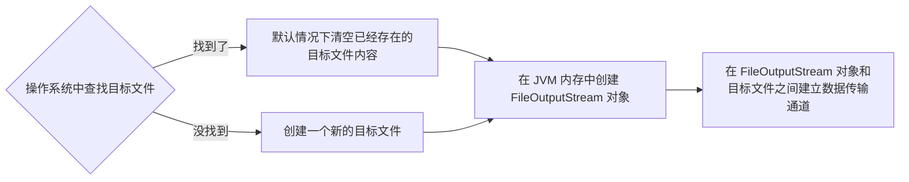
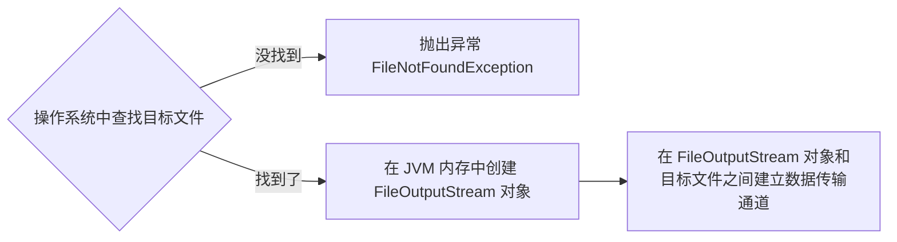

## File 类

操作系统中所有需要永久保存的数据都是以文件的形式存在。

File 类：文件和目录路径名的抽象表达形式。

路径：  
- 绝对路径名是完整的路径名，不需要任何其他信息就可以定位它所表示的文件或目录。  
  如 Windows 下：`E:\first\a.txt`。  

- 相对路径名必须使用取自其他路径名的信息进行解释（相对路径本身表示信息不完整）。  
  如 `dir\a.txt`。

- 默认情况下，java.io 包中的类总是根据当前用户目录来解析相对路径名。此目录由系统属性 user.dir 指定，通常是 Java 虚拟机的调用目录。

路径表示：  
- 对于 UNIX 平台，绝对路径名的前缀始终是 `/`（`/` 表示根目录）。相对路径名没有前缀。
  绝对路径表示：`/data/a.log`。  
  相对路径：`home/6379.conf`。  
  

- 对于 Microsoft Windows 平台，包含盘符的路径名前缀由驱动器号和一个 `:` 组成。如果路径名是绝对路径名，还可能后跟 `\\`，而相对路径没有盘符前缀。  
  绝对路径：`E:\first\dir\a.txt`。  
  相对路径：`dir\a.txt`。  

常见属性：  
- `static String separator`：与系统有关的路径分隔符。利用此常量可以在不同的操作系统中自动转换为适合该操作系统的路径分隔符。所以在实际开发中，如果要定义 File 类对象往往会使用如下形式：  
  ```java
  File file = new File("d:" + File.separator + "test.txt");  // 设置文件路径
  ```

常见构造方法：
- `File(String pathname)`：通过将给定路径名字符串转换为抽象路径名来创建一个新 File 实例。

- `File(String parent, Sting child)`：根据 parent 路径名字符串和 child 路径名字符串创建一个新 File 实例。

- `File(File parent, String child)`：根据 parent 抽象路径名和 child 路径名字符串创建一个新 File 实例。


创建功能：
- `boolean createNewFile()`：当且仅当不存在具有此抽象路径名指定名称的文件时，不可分地创建一个新的空文件。
 
- `boolean mkdir()`：创建此抽象路径名指定的目录。

- `boolean mkdirs()`：创建此抽象路径名指定的目录，包括所有必需但不存在的父目录。

删除功能：
- `boolean delete()`：删除此抽象路径名表示的文件或目录，如果此路径名表示一个目录，则该目录必须为空才能删除。

重命名功能：
- `boolean renameTo(File dest)`：重新命名此抽象路径名表示的文件。当目标 File 对象所表示抽象路径如果和原文件的路径不在同一目录下，该方法实现的效果：文件移动 + 重命名。  

判断功能：
- `boolean isFile()`：判断此抽象路径名表示的文件是否是一个标准文件。

- `boolean isDirectory()`：判断此抽象路径名表示的文件是否是一个目录。

- `boolean exists()`：判断该 File 对象所表示的文件或目录是否物理存在。

- `boolean canRead()`：判断该 File 对象所表示的文件目录是否有读取权。

- `boolean canWrite()`：判断该 File 对象所表示的文件目录是否有写入权。

- `boolean isHidden()`：判断此抽象路径名指定的文件是否是一个隐藏文件。

基本获取功能：
- `File getAbsoluteFile()`：返回此抽象路径名的绝对路径名形式。

- `String getPath()`：将此抽象路径名转换为一个路径名字符串。

- `String getName()`：返回由此抽象路径名表示的文件或目录的名称。

- `long length()`：返回由此抽象路径名表示的文件的长度。

- `long lastModified()`：返回此抽象路径名表示的文件最后一次被修改的时间。

高级获取功能：
- `String[] list()`：返回一个字符串数组，这些字符串指定此抽象路径名表示的目录中的文件和目录（其实返回的就是当前目录下的所有目录和文件的名字）。如果此抽象路径名不表示一个目录，那么此方法将返回 null。

- `File[] listFiles()`：仅返回当前目录下的子文件或子目录的名称。返回一个抽象路径名数组，这些路径名表示此抽象路径名表示的目录中的文件。如果此抽象路径名不表示一个目录，那么此方法将返回 null。

自定义获取功能：
- `File[] listFiles(FileFilter filter)`：返回抽象路径名数组，这些路径名表示此抽象路径名表示的目录中满足指定过滤器的文件和目录。

- `File[] listFiles(FilenameFilter filter)`：返回抽象路径名数组，这些路径名表示此抽象路径名表示的目录中满足指定过滤器的文件和目录。


File 类使用示例：

```java
/**
  * 递归地列出一个目录下所有文件
  * @param dir
  */
public static void listAllFiles(File dir) {
  
    if (dir == null || !dir.exists()) {
        return;
    }
    if (dir.isFile()) {
        System.out.println(dir.getName());
        return;
    }
    for (File file : dir.listFiles()) {
        listAllFiles(file);
    }

}
```

## Java 中的流

使用 java.io.File 类虽然可以操作文件，但是却不能操作文件的内容。如果要进行文件的内容操作，就必须依靠 I/O（Input/Output）流来完成。  

Java 语言主要通过输入流和输出流，完成 I/O 的功能，从而实现和外设的数据交互。而且针对此操作提供以下两类支持：  
- 字节流（JDK 1.0 开始提供）：InputStream（输入字节流）、OutputStream（输出字节流）。  

- 字符流（JDK 1.1 开始提供）：Reader（输入字符流）、Writer（输出字符流）。

!> 实际应用中，文本数据用字符流，如果不确定内容，就用字节流。  

这四个操作流的类都是抽象类，所以在使用这些类时，一定要通过子类对象的向上转型来进行抽象类对象的实例化操作。由这四个类派生出来的子类名称都是以其父类名作为子类名的后缀。如：InputStream 的子类 FileInputStream、Reader 的子类 FileReader。

### 字节输出流

OutputStream 本身是一个抽象类，想要完成字节输出功能就需要一个子类。如果要进行文件操作，则可以使用 FileOutputStream 子类完成操作。  

FileOutputStream 的构造方法：
- `FileOutputStream(File file)`：创建一个向指定 File 对象表示的文件中写入数据的文件输出流。

- `FileOutputStream(File file, boolean append)`：append 为 true 时表示追加新的内容到文件中。

- `FileOutputStream(String name)`：创建一个向具有指定名称的文件中写入数据的输出文件流。



FileOutputStream 的成员方法：  
- `void write(int b)`：将指定字节写入此文件输出流。

- `void write(byte[] b)`：将 b.length 个字节从指定 byte 数组写入此文件输出流中。

- `void write(byte[] b,int off, int len)`：将指定 byte 数组中从偏移量 off 开始的 len 个字节写入此文件输出流。

数据写成功后，需要调用 `close()` 方法关闭此输出流，并释放与此流有关的所有系统资源。

由于 OutputStream 只适合输出字节数据，因此当输出字符串时，需要先将自定的字符串利用 `getBytes()` 方法转换为字节数组。

### 字节输入流

InputStream 属于一个抽象类，如果想要实现文件读取功能，需要使用 FileInputStream 子类。  

FileInputStream 的构造方法：
- `FileInputStream(File file)`：通过打开一个到实际文件的连接来创建一个 FileInputStream，该文件通过文件系统中的 File 对象 file 指定。

- `FileInputStream(String name)`：通过打开一个到实际文件的连接来创建一个 FileInputStream，该文件通过文件系统中的路径名 name 指定。



FileInputStream 的成员方法:
- `int read()`：从此输入流中读取一个数据字节。返回 0 到 255 范围内的 int 字节值。如果因为已经到达流末尾而没有可用的字节，则返回值 -1。

- `int read(byte[] b)`：此输入流中将最多 b.length 个字节的数据读入一个 byte 数组中。以整数形式返回实际读取的字节数，如果因为已经到达流末尾而不再有数据可用，则返回 -1。

- `int read(byte[] b, int off, int len)`。

### 字节缓冲流

字节流一次读写一个数组的速度明显比一次读写一个字节的速度快很多，这是加入了数组这样的缓冲区效果，Java 本身在设计的时候也考虑到了这样的情况，所以提供了字节缓冲区流。

字节缓冲输出流：BufferedOutputStream。  
构造方法：
- `BufferedOutputStream(OutputStream out)`：创建一个新的缓冲输出流，以将数据写入指定的底层输出流。

字节缓冲输入流：BufferedInputStream。  
构造方法：
- `BufferedInputStream(InputStream in)`：创建一个 BufferedInputStream 并保存其参数，即输入流 in，以便将来使用。

关于缓冲输出流的注意事项：
- `void flush()` 刷新此缓冲的输出流。flush 可以强制把缓冲流中的字节数字写入底层流中，从而写入目标文件。

- BufferedOutputStream 的 close 方法先调用其 flush 方法，然后调用其基础输出流的 close 方法。   

### 字符编码

计算机中所有信息都是由二进制数据组成的，因此所有能够描述出的中文文字都是经过处理后的结果。在计算机的世界里，所有的语言文字都会使用编码来进行描述。例如：最常见的编码是 ASC II 码。  

在实际工作中，最为常见的 4 种编码如下：  
- GBK、GB2312：中文的国际标码，其中 GBK 包含简体中文与繁体中文两种，而 GB2312 只包含简体中文。    
  GBK 编码中，中文字符占 2 个字节，英文字符占 1 个字节。

- ISO8859-1：是国际编码，可以描述任何文字信息（中文需要转码）。  

- UNICODE：是十六进制编码，但是在传递字符信息时会造成传输的数据较大。  

- UTF 编码（Unicode Transformation Format）：是一种 UNICODE 的可变长编码，常见的编码为 UTF-8 编码。  
  UTF-8 编码中，中文字符占 3 个字节，英文字符占 1 个字节。  
  UTF-16be 编码中，中文字符和英文字符都占 2 个字节。

UTF-16be 中的 be 指的是 Big Endian，也就是大端。相应地也有 UTF-16le，le 指的是 Little Endian，也就是小端。  

Java 的内存编码使用双字节编码 UTF-16be，这不是指 Java 只支持这一种编码方式，而是说 char 这种类型使用 UTF-16be 进行编码。char 类型占 16 位，也就是两个字节，Java 使用这种双字节编码是为了让一个中文或者一个英文都能使用一个 char 来存储。

String 可以看成一个字符序列，可以指定一个编码方式将它编码为字节序列，也可以指定一个编码方式将一个字节序列解码为 String。

```java
String str1 = "中文";
byte[] bytes = str1.getBytes("UTF-8");

String str2 = new String(bytes, "UTF-8");
System.out.println(str2);
```

在调用无参数 getBytes() 方法时，默认的编码方式不是 UTF-16be。双字节编码的好处是可以使用一个 char 存储中文和英文，而将 String 转为 bytes[] 字节数组就不再需要这个好处，因此也就不再需要双字节编码。getBytes() 的默认编码方式与平台有关，一般为 UTF-8。

### 字符输出流

Writer 类中直接提供了输出字符串数据的方法，这样就不需要将字符串转成字节数组再输出了。  

与 OutputStream 的定义相似，Write 类本身也属于一个抽象类，我们可以使用其子类 OutputStreamWriter 实现对 Writer 类对象的实例化操作。  

OutputStreamWriter 的构造方法：  
- `OutputStreamWriter(OutputStream out)`：使用默认字符编码。

- `OutputStreamWriter(OutputStream out, String charsetName)`：使用指定字符集。

成员方法：  
- `public void write(int c)`：写入单个字符。要写入的字符包含在给定整数值的 16 个低位中，16 高位被忽略。

- `void write(char[] cbuf)`：写入字符数组。

- `void write(char[] cbuf, int off, int len)`：写入字符数组的某一部分。

- `void write(String str)`：写入字符串。

在使用 OutputStream 输出数据时，即使最后没有关闭输出流，内容也可以正常输出。但是使用字符输出流 Writer 时，在执行到最后如果不关闭输出流，就表示在缓冲区中处理的内容不会被强制性清空，所以就不会输出数据。  

如果有特殊情况不能关闭字符输出流，可以使用 `flush()` 方法强制清空缓冲区。

### 字符输入流

同样 Reader 也是抽象类，我们使用其子类 InputStreamReader。  

InputStreamReader 的构造方法：  
- `InputStreamReader(InputStream in)`。

- `InputStreamReader(InputStream in, String charsetName)`。

成员方法：  
- `int read()`：读取单个字符。作为整数读取的字符，范围在 0 到 65535 之间 (0x00-0xffff)，如果已到达流的末尾，则返回 -1。
 
- `int read(char[] cbuf)`：从字符输入流中，读取一个字符数组的字符数据。读取的字符数如果已到达流的末尾，则返回 -1。
         
- `int read(char[] cbuf，int off, int len)`：从字符输入流中读取多个字符，这些字符，从字符数组的第 offset 开始的位置填充，最多填充 len 个字符。读取的字符数，如果已到达流的末尾，则返回 -1。

### 转换流的简化

在使用转化流的时候，通常需要经过两步：  
1. 创建底层的字节流；

2. 包装字节流，指定字符集并完成转换流的创建。

大多数时候，我们所依赖的字符集都是本地字符集，所以为了简化我们的书写，转换流提供了对应的子类。

FileWriter：用来写入字符文件的便捷类。此类的构造方法假定默认字符编码和默认字节缓冲区大小都是可接受的。

FileWriter 构造方法：
- `FileWriter(String fileName)`：根据给定的文件名构造一个 FileWriter 对象。

- `FileWriter(String fileName, boolean append)`：根据给定的文件名以及指示是否附加写入数据的 boolean 值来构造 FileWriter 对象。

FileReader：用来读取字符文件的便捷类。此类的构造方法假定默认字符编码和默认字节缓冲区大小都是适当的。

FileReader 构造方法：
- `FileReader(String fileName)`。

- `FileReader(File file)`。

### 字符缓冲流

操作字符类型数据，主要操作类是 Reader、Writer 的子类，使用缓冲区缓冲字符，不关闭流就不会输出任何内容。

BufferedWriter
- 构造方法：`BufferedWriter(Writer out)`。创建一个使用默认大小输出缓冲区的缓冲字符输出流。

- 成员方法：`void newLine()`。写入一个行分隔符

BufferedReader
- 构造方法：`BufferedReader(Reader in)`。创建一个使用默认大小输入缓冲区的缓冲字符输入流。

- 成员方法：`String readLine()`。读取一个文本行，该文本数据是包含该行内容的字符串，但是不包含任何行终止符，如果已到达流末尾，则返回 null。


### 标准输入输出流

标准输入流：System 类中的字段 in 代表了系统的标准输入，默认的输入设备是键盘。  
System.in 的类型是 InputStream。

标准输出流：System 类中的字段 out 代表了系统的标准输出，默认的输出设备是显示器。  
System.out 的类型是 PrintStream 是 OutputStream 的子类。

注： 对于标准输入流而言，其 read 方法是一个阻塞方法。
1. 当执行 BufferedReader 的 readLine方法的时候，其实 readLine 还是基于 System.in 的 read 方法读取键盘输入数据的；

2. 当没有键盘输入数据的时候，此时执行标准输入流的 read 方法，read 不会执行完，而是在执行过程中的某一步阻塞，等着我们键盘输入数据

3. 可以自己定义键盘输入的结束规则，让键盘输入的循环终止。如：  
    ```java
    while ((s = br.readLine()) != null) {
      System.out.println("接收到了：" + s);
      if ("886".equals(s)) {
        break;
      }
    }
    ```