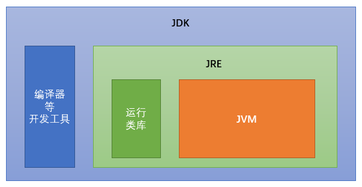

## Java 介绍

Java 是由任职于 Sun 公司的 James Gosling 和同事们共同研发，并于 1995 年 5 月推出的 Java 面向对象程序设计语言和 Java 平台的总称。  

### 历史

发展历史：
- Sun 公司发布 Java1.0 版本（1996.1）
- JDK 1.1（1997.2）
- J2SE 1.2（1998.12） 
- J2SE 1.3（2001.9）
- J2SE 1.4（2002.2） 
- J2SE 5.0（2004.9） 
- Java SE 6（2006.12） 
- 2009 年 Oracle 甲骨文公司收购 Sun 公司
- Java SE 7（2011.7） 
- Java SE 8（2014.3） 
- Java SE 9（2017.9）
- Java SE 10（2018.3）
- Java SE 11（2018.9）
- Java SE 12（2019.3）
- Java SE 13（2019.9）
- Java SE 14（2020.3）
- Java SE 15（2020.9）
- Java SE 16（2021.3）

### 版本

平台版本：
- Java SE 标准版：是为开发普通桌面和商务应用程序提供的解决方案。  
  *Java SE 为整个技术架构的核心。*

- Java ME 嵌入式开发：是为开发电子消费产品和嵌入式设备提供的解决方案。  

- Java EE 企业级开发：是为开发企业环境下的应用程序提供的一套解决方案。  

### 特点

Java 语言的特点：
1. 跨平台  
   Java 程序是在 Java 虚拟机上运行，而非直接运行于操作系统。因此使用 Java 语言编写的应用程序在不同的系统平台上都可以运行。  
   

2. 面向对象  
   面向对象是程序设计方法的一种。面向对象设计让大型软件工程的计划和设计变得更容易管理，能增强工程的健康度，减少失败工程的数量。

3. 解释型  
   编译型语言写出的代码，首先通过编译器的编译，全部转化成目标代码，然后依次在操作系统中执行。  
   解释型语言则是转化一句，执行一句。  

    Java 编译过程：`.java` -> `.class` -> Java 虚拟机。  

4. 健壮

5. 动态  
   两个方面：
   - 在 Java 语言中，可以简单、直观地查询运行时的信息。
   - 可以将新代码加入到一个正在运行的程序中。  

6. 分布式  
   Java 语言具有强大的、易于使用的联网能力。

7. 高效  
   由于 Java 是一种解释型语言，所以它的执行效率相对就会慢一些，但由于 Java 语言采用以下两种手段，使其拥有较好的性能。  
   - Java 语言源程序编写完成后，先使用 Java 伪编译器进行伪编译，将其转换为中间码，再解释。
   - Java 语言提供一种「准实时」（Just-in-Time，JIT）编译器，当需要更快速度时，Java 语言可以使用 JIT 编译器将字节码转换成机器码，然后将其缓冲下来，这样速度就会更快。

8. 多线程

9. 结构中立（字节码）  
    Java 编译器通过伪编译后，将生成一个与任何计算机体系统无关的「中性」的字节码。  

10. 开源

## 开发环境

### JDK 和 JRE

JRE（JAVA  Runtime Environment） 是 Java 程序的运行时环境，包含 JVM 和运行时所需要的核心类库。

JDK（JAVA  Develop kit) 是 Java 程序开发工具包，包含 JRE 和开发人员使用的工具。



### 下载安装

JDK的下载和安装：[JDK8 下载地址](https://www.oracle.com/java/technologies/javase-jdk8-downloads.html)。  

!> 建议 JDK 安装路径中不要有中文和空格。

PATH 环境变量是操作系统的环境属性，告诉操作系统可执行程序（javac）路径。  

官方推荐的配置 PATH 环境变量方式：
1. 先配置 JAVA_HOME 环境变量：`xx\xx\xx\jdk1.8`；

2. 再添加 PATH 环境变量：`$JAVA_HOME$\bin`。

## 第一行代码

Java 程序运行原理：


### 命令行方式

第一步：创建 `HelloWorld.java` 文件，用文本编辑器打开编辑：

```java
public class HelloWorld {
	public static void main(String[] args) {
		System.out.println("Hello World!");
	}
}  
```  

第二步：打开 cmd，进入 `HelloWorld.java` 文件所在的文件夹，执行命令：

```
javac HelloWorld.java
```

之后会生成 `HelloWorld.class` 文件，接着执行：

```
java HelloWorld
``` 

即可在命令行打印出
```
HelloWorld!
```

如果打印内容中包含中文，cmd 命令行下会显示乱码。用 javac 命令时添加 `-enconding UTF-8` 即可解决。如：  
```bash
javac -encoding UTF-8 HelloWorld.java
```

### IDEA方式

[IDEA 官网地址](https://www.jetbrains.com/idea)，选择版本，下载安装即可。  

安装完成后，打开 IDEA，选择新建项目：


选择创建 Java 项目，并选择 JDK 的版本：


此处不必勾选：


设置项目名称和存储位置：


Java 代码一般存放在 src 目录下，在此新建一个包：


给包命名：


右击包名，在包文件夹下新建 Java 程序：


给程序命名：


写好代码后，右击侧边小三角，选择运行，即可在下方显示运行结果：


