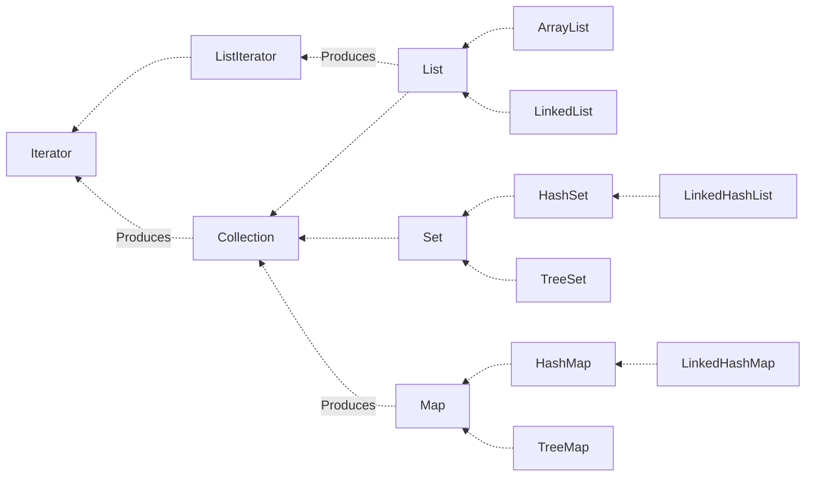

Java 工具包提供了强大的数据结构。在 Java 中的数据结构主要包括以下几种接口和类：
- 枚举（Enumeration）

- 位集合（BitSet）

- 向量（Vector）

- 栈（Stack）

- 字典（Dictionary）

- 哈希表（Hashtable）

- 属性（Properties）

这些类传统遗留的，在 Java2 中引入了一种新的框架 - 集合框架（Collection）。

类集在整个 Java 中最为核心的用处就在于其实现了动态数组的操作，并且定义了大量的操作标准。在整个类集框架中，其核心接口为：Collection、List、Set、Map、Iterator、Enumeration。

集合框架定义了一些接口：
- Collection 接口。  
  Collection 是最基本的集合接口，一个 Collection 代表一组 Object，即 Collection 的元素，Java 不提供直接继承自 Collection 的类，只提供继承的子接口（如 List 和 Set）。  
  Collection 接口存储一组不唯一，无序的对象。

- List 接口。  
  List 接口是一个有序的 Collection，使用此接口能够精确的控制每个元素插入的位置，能够通过索引（元素在 List 中位置，类似于数组的下标）来访问 List 中的元素，第一个元素的索引为 0，而且允许有相同的元素。  
  List 接口存储一组不唯一，有序（插入顺序）的对象。

- Set 接口。  
  Set 具有与 Collection 完全一样的接口，只是行为上不同，Set 不保存重复的元素。  
  Set 接口存储一组唯一，无序的对象。

- SortedSet 接口。  
  继承于 Set 保存有序的集合。

- Map 接口。  
  Map 接口存储一组键值对象，提供key（键）到value（值）的映射。

- Map.Entry 接口。  
  描述在一个 Map 中的一个元素（键/值对）。是一个 Map 的内部接口。

- SortedMap 接口。  
  继承于 Map，使 Key 保持在升序排列。

- Enumeration 接口。  
  这是一个传统的接口和定义的方法，通过它可以枚举（一次获得一个）对象集合中的元素。这个传统接口已被迭代器取代。