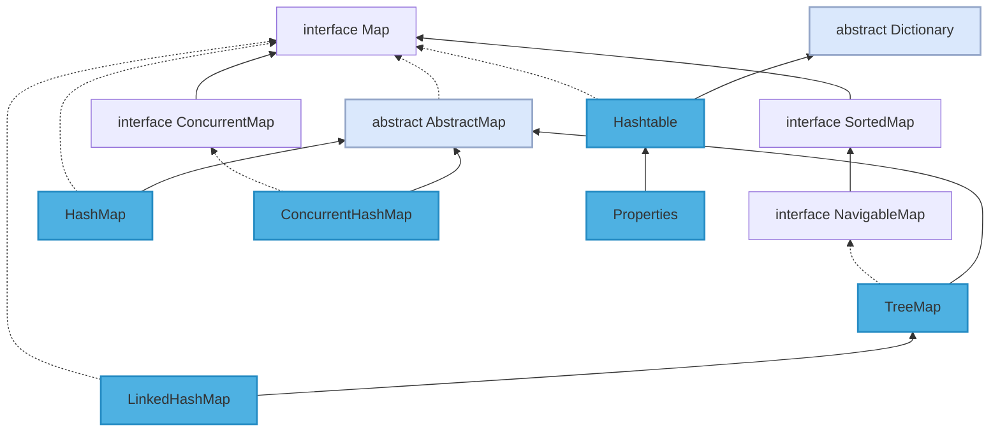

常见 Map：



## Map 接口

```java
public interface Map<K,V>
```


Map 接口储存一组成对的 key-value 对象，提供 key 到 value 的映射，Map 中的 key 不要求有序，不允许重复。value 同样不要求有序，但可以重复。

常用 API：
- `V put(K key, V value)`。

- `V get(Object key)`。

- `V remove(Object key)`。

- `void clear()`。

- `boolean containsKey(Object key)`。

- `boolean isEmpty()`。

- `int size() `。

- `Set<K> keySet()`。  

## HashMap

```java
public class HashMap<K,V> extends AbstractMap<K,V>
    implements Map<K,V>, Cloneable, Serializable
```

最常见的 Map 实现类是 HashMap，他的储存方式是哈希表，优点是查询指定元素效率高。

JDK8 之前底层实现是数组 + 链表，JDK8 改为数组 + 链表 / 红黑树，节点类型从 Entry 变更为 Node。主要成员变量包括存储数据的 table 数组、元素数量 size、加载因子 loadFactor。

table 数组记录 HashMap 的数据，每个下标对应一条链表，所有哈希冲突的数据都会被存放到同一条链表，Node/Entry 节点包含四个成员变量：key、value、next 指针和 hash 值。

HashMap 中数据以键值对的形式存在，键对应的 hash 值用来计算数组下标，如果两个元素 key 的 hash 值一样，就会发生哈希冲突，被放到同一个链表上，为使查询效率尽可能高，键的 hash 值要尽可能分散。

HashMap 默认初始化容量为 16，扩容容量必须是 2 的幂次方、最大容量为 1 << 30 、默认加载因子为 0.75。

### 部分源码

```java
static final int TREEIFY_THRESHOLD = 8;

static final int UNTREEIFY_THRESHOLD = 6;
```
size 增长到 8 则链表转红黑树，size 减少到 6 则红黑树转链表。

```java
static final int hash(Object key) {
    int h;
    return (key == null) ? 0 : (h = key.hashCode()) ^ (h >>> 16);
}
```
hash 方法计算元素 key 的散列值。如果 key 为 null 返回 0，否则就将 key 的 hashCode 方法返回值高低 16 位异或，让尽可能多的位参与运算，让结果的 0 和 1 分布更加均匀，降低哈希冲突概率。

```java
public V put(K key, V value) {
    return putVal(hash(key), key, value, false, true);
}

final V putVal(int hash, K key, V value, boolean onlyIfAbsent,
                boolean evict) {
    Node<K,V>[] tab; Node<K,V> p; int n, i;
    if ((tab = table) == null || (n = tab.length) == 0)
        n = (tab = resize()).length;
    if ((p = tab[i = (n - 1) & hash]) == null)
        tab[i] = newNode(hash, key, value, null);
    else {
        Node<K,V> e; K k;
        if (p.hash == hash &&
            ((k = p.key) == key || (key != null && key.equals(k))))
            e = p;
        else if (p instanceof TreeNode)
            e = ((TreeNode<K,V>)p).putTreeVal(this, tab, hash, key, value);
        else {
            for (int binCount = 0; ; ++binCount) {
                if ((e = p.next) == null) {
                    p.next = newNode(hash, key, value, null);
                    if (binCount >= TREEIFY_THRESHOLD - 1) // -1 for 1st
                        treeifyBin(tab, hash);
                    break;
                }
                if (e.hash == hash &&
                    ((k = e.key) == key || (key != null && key.equals(k))))
                    break;
                p = e;
            }
        }
        if (e != null) { // existing mapping for key
            V oldValue = e.value;
            if (!onlyIfAbsent || oldValue == null)
                e.value = value;
            afterNodeAccess(e);
            return oldValue;
        }
    }
    ++modCount;
    if (++size > threshold)
        resize();
    afterNodeInsertion(evict);
    return null;
}
```

put 方法添加元素。步骤：
1. 调用 putVal 方法添加元素。

2. 如果 table 为空或长度为 0 就进行扩容，否则计算元素下标位置，不存在就调用 newNode 创建一个节点。

3. 如果存在且是链表，如果首节点和待插入元素的 hash 和 key 都一样，更新节点的 value。

4. 如果首节点是 TreeNode 类型，调用 putTreeVal 方法增加一个树节点，每一次都比较插入节点和当前节点的大小，待插入节点小就往左子树查找，否则往右子树查找，找到空位后执行两个方法：balanceInsert 方法，插入节点并调整平衡、moveRootToFront 方法，由于调整平衡后根节点可能变化，需要重置根节点。

5. 如果都不满足，遍历链表，根据 hash 和 key 判断是否重复，决定更新 value 还是新增节点。如果遍历到了链表末尾则添加节点，如果达到建树阈值 7，还需要调用 treeifyBin 把链表重构为红黑树。

6。 存放元素后将 modCount 加 1，如果 ++size > threshold ，调用 resize 扩容。

```java
public V get(Object key) {
    Node<K,V> e;
    return (e = getNode(hash(key), key)) == null ? null : e.value;
}

final Node<K,V> getNode(int hash, Object key) {
    Node<K,V>[] tab; Node<K,V> first, e; int n; K k;
    if ((tab = table) != null && (n = tab.length) > 0 &&
        (first = tab[(n - 1) & hash]) != null) {
        if (first.hash == hash && // always check first node
            ((k = first.key) == key || (key != null && key.equals(k))))
            return first;
        if ((e = first.next) != null) {
            if (first instanceof TreeNode)
                return ((TreeNode<K,V>)first).getTreeNode(hash, key);
            do {
                if (e.hash == hash &&
                    ((k = e.key) == key || (key != null && key.equals(k))))
                    return e;
            } while ((e = e.next) != null);
        }
    }
    return null;
}
```
get 方法获取元素的 value 值。
1. 调用 getNode 方法获取 Node 节点，如果不是 null 就返回其 value 值，否则返回 null。

2. getNode 方法中如果数组不为空且存在元素，先比较第一个节点和要查找元素的 hash 和 key ，如果都相同则直接返回。

3. 如果第二个节点是 TreeNode 类型则调用 getTreeNode 方法进行查找，否则遍历链表根据 hash 和 key 查找，如果没有找到就返回 null。

### 常见问题

HashMap 线程不安全的原因：死循环（JDK7）和数据丢失问题。

死循环：扩容时 resize 调用 transfer 使用头插法迁移元素，虽然 newTable 是局部变量，但原先 table 中的 Entry 链表是共享的，问题根源是 Entry 的 next 指针并发修改，某线程还没有将 table 设为 newTable 时用完了 CPU 时间片，导致数据丢失或死循环。

数据丢失：
- 并发赋值被覆盖： 在 createEntry 方法中，新添加的元素直接放在头部，使元素之后可以被更快访问，但如果两个线程同时执行到此处，会导致其中一个线程的赋值被覆盖。

- 已遍历区间新增元素丢失： 当某个线程在 transfer 方法迁移时，其他线程新增的元素可能落在已遍历过的哈希槽上。遍历完成后，table 数组引用指向了 newTable，新增元素丢失。

- 新表被覆盖： 如果 resize 完成，执行了 table = newTable，则后续元素就可以在新表上进行插入。但如果多线程同时 resize ，每个线程都会 new 一个数组，这是线程内的局部对象，线程之间不可见。迁移完成后resize 的线程会赋值给 table 线程共享变量，可能会覆盖其他线程的操作，在新表中插入的对象都会被丢弃。

!> JDK8 在 resize 方法中完成扩容，并改用尾插法，不会产生死循环，但并发下仍可能丢失数据。可用 ConcurrentHashMap 或 Collections.synchronizedMap 包装成同步集合。

## TreeMap

```java
public class TreeMap<K,V>
    extends AbstractMap<K,V>
    implements NavigableMap<K,V>, Cloneable, java.io.Serializable
```

TreeMap 基于红黑树实现，增删改查的平均和最差时间复杂度均为 O(logn) ，最大特点是 Key 有序。Key 必须实现 Comparable 接口或提供的 Comparator 比较器，所以 Key 不允许为 null。

HashMap 依靠 hashCode 和 equals 去重，而 TreeMap 依靠 Comparable 或 Comparator。TreeMap 排序时，如果比较器不为空就会优先使用比较器的 compare 方法，否则使用 Key 实现的 Comparable 的 compareTo 方法，两者都不满足会抛出异常。

TreeMap 通过 put 和 deleteEntry 实现增加和删除树节点。插入新节点的规则有三个：
- 需要调整的新节点总是红色的。

- 如果插入新节点的父节点是黑色的，不需要调整。

- 如果插入新节点的父节点是红色的，由于红黑树不能出现相邻红色，进入循环判断，通过重新着色或左右旋转来调整。

TreeMap 的插入操作就是按照 Key 的对比往下遍历，大于节点值向右查找，小于向左查找，先按照二叉查找树的特性操作，后续会重新着色和旋转，保持红黑树的特性。