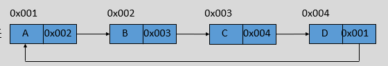

# 四、高级类型

## 目录
- [四、高级类型](#四高级类型)
  - [目录](#目录)
  - [1 集合类](#1-集合类)
    - [1.1 Collection](#11-collection)
    - [1.2 Iterator 接口](#12-iterator-接口)
    - [1.3 List](#13-list)
  - [2 数组和链表](#2-数组和链表)
    - [2.1 数组](#21-数组)
    - [2.2 链表](#22-链表)
    - [2.3 空间换取时间](#23-空间换取时间)
    - [2.4 链表问题](#24-链表问题)
      - [2.4.1 判断链表中是否有环](#241-判断链表中是否有环)
      - [2.4.2 反转单链表](#242-反转单链表)
    - [2.5 数组 VS 链表](#25-数组-vs-链表)
  - [3 List](#3-list)
    - [3.1 ArraysList](#31-arrayslist)
    - [3.2 Vector](#32-vector)
    - [3.3 LinkedList](#33-linkedlist)
    - [3.4 List 常见问题](#34-list-常见问题)
      - [3.4.1 去重](#341-去重)
      - [3.4.2 用 ArrayList 实现栈数据结构](#342-用-arraylist-实现栈数据结构)
  - [4 JDK5 的新特性](#4-jdk5-的新特性)
    - [4.1 静态导入](#41-静态导入)
    - [4.2 泛型](#42-泛型)
    - [4.2 可变长参数](#42-可变长参数)
    - [4.3 增强 for 循环](#43-增强-for-循环)


## 1 集合类

类集在整个 Java 中最为核心的用处就在于其实现了动态数组的操作，并且定义了大量的操作标准。在整个类集框架中，其核心接口为：Collection、List、Set、Map、Iterator、Enumeration。

<div align="center">

</div>

### 1.1 Collection


Collection 是层次结构中的根接口。Collection 表示一组对象，这些对象也称为 collection 的元素。一些 collection 允许有重复的元素，而另一些则不允许。一些 collection 是有序的，而另一些则是无序的。

Collection 常见接口 API：
- `boolean add(E e)`：将指定元素添加到此 collection 中。  
  如果此 collection 由于调用而发生更改，则返回 true。如果此 collection 不允许有重复元素，并且已经包含了指定的元素，则返回 false。

- `boolean remove(Object o)`：如果此 collection 包含一个或多个满足 `o == null ? e == null : o.equals(e)` 的元素 e，则移除这样的元素。  
  如果此 collection 包含指定的元素（或者此 collection 由于调用而发生更改），则返回 true 。 

- `void clear()`：移除此 collection 中的所有元素。  
  如果此 collection 不支持 clear 操作，此方法抛出一个异常： `UnsupportedOperationException`。


- `boolean contains(Object o)`：当且仅当此 collection 至少包含一个满足 `o == null ? e == null : o.equals(e)` 的元素 e 时，返回 true。 

- `boolean isEmpty()`：如果此 collection 不包含元素，则返回 true。

- `int size()`： 返回此 collection 中的元素数。  
  如果此 collection 包含的元素大于 Integer.MAX_VALUE，则返回 Integer.MAX_VALUE。 

- `boolean addAll(Collection c)`：将指定 collection 中的所有元素都添加到此 collection 中。

- `boolean removeAll(Collection c)`：移除此 collection 中那些也包含在指定 collection 中的所有元素。

- `boolean containsAll(Collection c)`：如果此 collection 包含指定 collection 中的所有元素，则返回 true。

- `boolean retainAll(Collection c)`：仅保留此 collection 中那些也包含在指定 collection 的元素。  
  如果此 collection 由于调用而发生更改，则返回 true 


- `Object[] toArray()`：返回包含此 collection 中所有元素的数组。  
  返回的数组将是「安全的」，因为此 collection 并不维护对返回数组的任何引用。（换句话说，即使 collection 受到数组的支持，此方法也必须分配一个新的数组）。因此，调用者可以随意修改返回的数组。 

- `Iterator iterator()`：返回在此 collection 的元素上进行迭代的迭代器。  
  关于元素返回的顺序没有任何保证（除非此 collection 是某个能提供保证顺序的类实例）。 

示例：  
```java
import java.util.ArrayList;
import java.util.Arrays;
import java.util.Collection;

public class TestDemo {
    public static void main(String[] args) {
        Collection c1 = new ArrayList();
        Collection c2 = new ArrayList();

        // boolean add(E e)
        c1.add("Hello");
        c1.add("World");
        System.out.println(c1);

        // boolean remove(Object o)
        c1.remove("World");
        System.out.println(c1);

        //void clear()
        c1.clear();
        System.out.println(c1);

        // boolean contains(Object o)
        c1.add("Hello");
        c1.add("World");
        System.out.println(c1.contains("Hello"));

        // boolean isEmpty()
        System.out.println(c1.isEmpty());

        // int size()
        System.out.println(c1.size());

        // boolean addAll(Collection c)
        c2.add("Java");
        c2.add("No.1");
        c1.addAll(c2);
        System.out.println(c1);

        // boolean removeAll(Collection c)
        c1.removeAll(c2);
        System.out.println(c1);

        // boolean retainAll(Collection c)
        c2.add("Hello");
        c2.add("World");
        c1.retainAll(c2);
        System.out.println(c1);

        // boolean containsAll(Collection c)
        System.out.println(c1.containsAll(c2));

        Object[] arr = c2.toArray();
        for (int i = 0; i < arr.length; i++) {
            String s = (String) arr[i];
            if ("No.1".equals(s)) arr[i] = "No.0";
        }
        System.out.println(Arrays.toString(arr));
        System.out.println(c2);
    }
}

/* 运行结果：
[Hello, World]
[Hello]
[]
true
false
2
[Hello, World, Java, No.1]
[Hello, World]
[Hello, World]
false
[Java, No.0, Hello, World]
[Java, No.1, Hello, World]
*/
```

### 1.2 Iterator 接口

它是对集合进行迭代的迭代器，依赖于集合对象存在。

Iterator 接口 API：
- `boolean hasNext()`：如果仍有元素可以迭代，则返回 true。

- `E next()`：返回迭代的下一个元素。

- `void remove()`：从迭代器指向的 collection 中移除迭代器返回的最后一个元素。

示例：  
```java
import java.util.ArrayList;
import java.util.Collection;
import java.util.Iterator;

public class TestDemo {
    public static void main(String[] args) {
        Collection c = new ArrayList();

        c.add("Hello");
        c.add("World");

        Iterator it = c.iterator();
        while (it.hasNext()) {
            String s = (String) it.next();
            System.out.println(s);
        }
    }
}

/* 运行结果：
Hello
World
*/
```

注：  
- 用集合的 API 修改集合的结构，所有的迭代器会失效。  
  用迭代器的 API 修改集合的结构，其它迭代器会失效。  

  例如，将上面的循环代码修改为：  
  ```java
  while (it.hasNext()) {
       String s = (String) it.next();
       if ("World".equals(s)) {
             c.remove(s);
        }
  }
  ```
  就会报错：`ConcurrentModificationException`。

- 用迭代器遍历集合的时候，不要使用 while 循环，可以使用 for 循环，最好使用 for each 循环。


### 1.3 List

List：有序的 Collection（也称为序列）。

此接口的用户可以对列表中每个元素的插入位置进行精确地控制。用户可以根据元素的整数索引（在列表中的位置）访问元素，并搜索列表中的元素。  

与 Set 不同，列表通常允许重复的元素。更确切地讲，列表通常允许满足 `e1.equals(e2)` 的元素对 e1 和 e2，并且如果列表本身允许 null 元素的话，通常它们允许多个 null 元素。

常见 API：
- `void add(int index, E element)`：在列表的指定位置插入指定元素。

- `boolean addAll(int index, Collection c)`：将指定 collection 中的所有元素都插入到列表中的指定位置。

- `E remove(int index)`：移除列表中指定位置的元素。

- `E get(int index)`：返回列表中指定位置的元素。

- `int indexOf(Object o)`：返回此列表中第一次出现的指定元素的索引；如果此列表不包含该元素，则返回 -1。

- `lastIndexOf(Object o)`：返回此列表中最后出现的指定元素的索引；如果列表不包含此元素，则返回 -1。

- `E set(int index, E element)`：用指定元素替换列表中指定位置的元素。

- `List<E> subList(int fromIndex, int toIndex)`：返回列表中指定的 fromIndex（包括）和 toIndex（不包括）之间的部分视图。（如果 fromIndex 和 toIndex 相等，则返回的列表为空）。返回的列表由此列表支持，因此返回列表中的非结构性更改将反映在此列表中，反之亦然。返回的列表支持此列表支持的所有可选列表操作。  
  即修改子列表，原列表也会修改。示例：  
  ```java
  import java.util.ArrayList;
  import java.util.List;

  public class TestDemo {
      public static void main(String[] args) {
          List list = new ArrayList();
          list.add("hello");
          list.add("world");
          list.add("java");

          List subList = list.subList(1, 2);
          System.out.println(subList);

          subList.set(0, "WORLD");
          System.out.println(subList);
          System.out.println(list);
      }
  }

  /* 运行结果：
  [world]
  [WORLD]
  [hello, WORLD, java]
  */
  ```

- `ListIterator<E> listIterator()`：返回此列表元素的列表迭代器（按适当顺序）。

- `ListIterator<E> listIterator(int index)`：返回列表中元素的列表迭代器（按适当顺序），从列表的指定位置开始。 

ListIterator 接口常见 API：
- `boolean hasPrevious()`：如果以逆向遍历列表，列表迭代器有多个元素，则返回 true。

- `E next()`： 返回列表中的下一个元素。

- `boolean hasPrevious()`：如果以逆向遍历列表，列表迭代器有多个元素，则返回 true。

- `E previous()`：返回列表中的前一个元素。

- `int previousIndex()`：返回对 previous 的后续调用所返回元素的索引。

- `int nextIndex()`：返回对 next 的后续调用所返回元素的索引。

- `void add(E e)`：将指定的元素插入列表。

- `void remove()`：从列表中移除由 next 或 previous 返回的最后一个元素。

- `void set(E e)`：用指定元素替换 next 或 previous 返回的最后一个元素。

## 2 数组和链表

### 2.1 数组

常见的数据结构有：数组、链表、栈、队列、树、哈希表和图。

数组的本质是固定大小的连续的内存空间，并且这片连续的内存空间又被分割成等长的小空间。它最主要的特点是随机访问。
- 数组的长度是固定的。

- 数组只能存储同一种数据类型的元素。

注：在 Java 中只有一维数组的内存空间是连续，多维数组的内存空间不一定连续。

数组通过寻址公式实现随机访问。  
寻址公式：i_address = base_address + i * type_length。

数组的基本操作：
- 添加（保证元素的顺序）。  
  最好情况：O(1)；  
  最坏情况：移动 n 个元素，O(n)；   
  平均情况：移动 n/2 个元素，O(n) 。 

- 删除（保证元素的顺序）。  
  最好情况：O(1)；  
  最坏情况：移动 n-1 个元素，O(n)；  
  平均情况：移动 (n-1)/2 个元素，O(n)。  

- 查找。
  - 根据索引查找元素：O(1)。

  - 查找数组中与特定值相等的元素。  
    大小无序：O(n)；  
    大小有序：O(log2n)。  

总结：数组增删慢，查找快。

### 2.2 链表

形象地说，链表就是用一串链子将结点串联起来。

<div align="center">

</div>

结点：包含数据域和指针域。  
数据域：数据。  
指针域：下一个结点的地址。  

链表分类：
- 单链表：  
  <div align="center">
  
  </div>

- 循环链表：  
  <div align="center">
  
  </div>

- 双向链表：  
  <div align="center">
  
  </div>

- 双向循环链表：  
  <div align="center">
  
  </div>

单链表基本操作：
- 增加（在某个结点后面添加）。

- 删除（在某个结点后面删除）。

- 查找：  
  - 根据索引查找元素。

  - 查找链表中与特定值相等的元素。  
    - 元素大小有序。  

    - 元素大小无序。  

总结：链表增删快，查找慢。

很容易验证，前面那些操作，双向链表和单链表的时间复杂度是一样的。但是双向链表有单链表没有的独特魅力 —— 它有一条指向前驱结点的链接。

双向链表基本操作：
- 增加（在某个结点前面添加元素）。

- 删除（删除该结点）。

- 查找：  
  - 查找前驱结点。  

  - 根据索引查找元素。  

  - 查找链表中与特定值相等的元素：  
    - 元素大小无序。

    - 元素大小有序 。

总结：虽然双向链表更占用内存空间，但是它在某些操作上的性能是优于单链表的。

思想：用空间换取时间。

### 2.3 空间换取时间

缓存就是一种用空间换取时间的技术。内存大小是有限的，所以缓存不能无限大。那么当缓存满的时候，再向缓存中添加数据，就需要采取一些策略。

缓存淘汰策略：
- FIFO（First In First Out）。

- LFU（Least Frequently Used）。

- LRU（Least Recently Used）。

LRU 算法中我们就用到了链表！

添加（认为尾节点是最近最少使用的数据）：
- 如果缓存中已经存在该数据：删除该结点，添加到头结点。

- 如果缓存中不存在该数据：
  - 缓存没满，添加到头结点。

  - 缓存满了，删除尾节点, 在头结点添加。


### 2.4 链表问题

#### 2.4.1 判断链表中是否有环

解决方法：
- 给一个阈值（10ms），如果在遍历链表的过程中 10ms 还没有结束，就认为有环。

- 迷雾森林。  
  `Collection visited = new ArrayList();`
  1. 遍历链表，获取每一个结点。判断结点是否在 visited 集合中存在。  
      - 存在：返回 true。
      - 不存在：将该结点添加到visited中，然后遍历下一个结点。

  2. 遍历结束后，返回 false。  

  示例：  
  ```java
  public static boolean hasCircle(Node head) {
      Collection visited = new HashSet(); // 创建 set 集合
      Node x = head;
      while (x != null) {
          if (visited.contains(x)) return true;
          visited.add(x);
          x = x.next;
      }
      // 遍历结束
      return false;
  }
  ```

- 跑道（快慢指针）。
  1. 创建了快指针和慢指针，快指针每次走两步，慢指针每次走一步
  
  2. 遍历链表，快指针每移动两步，慢指针移动一步。
      - 如果快指针到到终点：返回 false。
      - 如果快指针和慢指针相遇：返回 true。
  
  示例：  
  ```java
  public static boolean hasCircle(Node head) {
      // 创建快慢指针
      Node fast = head;
      Node slow = head;
      
      // 遍历链表
      do {
          // 快指针是否到达终点
          if (fast == null || fast.next == null) return false;
          fast = fast.next.next;
          slow = slow.next;
      } while (fast != slow);
      // fast == slow
      return true;
  }
  ```

#### 2.4.2 反转单链表

示例：
```java
public class TestDemo {
    public static Node reverse(Node head) {
        if (head.next == null) return head;
        // 如果链表不止一个结点，反转 head.next
        Node reversed = reverse(head.next);
        // 反转head结点
        head.next.next = head;
        head.next = null;
        return reversed;
    }
    public static void print(Node head) {
        Node x = head;
        while (x != null) {
            System.out.print(x.value);
            if (x.next != null) System.out.print(" --> ");
            x = x.next;
        }
        System.out.println();
    }

    public static void main(String[] args) {
        Node head = new Node(3);
        head = new Node(2, head);
        head = new Node(1, head);
        print(head);
        head = reverse(head);
        print(head);
    }
}
```

### 2.5 数组 VS 链表

<div align="center">

</div>

数组和链表的插入、删除和随机访问操作的时间复杂度刚好相反。

- 数组使用的是连续的内存空间，可以利用 CPU 的高速缓存预读数据。  
  链表的内存空间不是连续的，不能有效预读数据。当然如果数组过大，系统没有足够的连续内存空间，会抛出 OOM。

- 数组的缺点是大小固定，没法动态的调整大小。如果要存储一些对象，如果数组太大，浪费内存空间；如果数组太小，我们需要重新申请一个更大数组，并将数据拷贝过去，耗时。

- 如果业务对内存的使用非常苛刻，数组更适合。因为结点有指针域，更消耗内存。而且对链表的频繁插入和删除，会导致结点对象的频繁创建和销毁，有可能会导致频繁的 GC 活动。


## 3 List

```java
public interface List<E> extends Collection<E>
```

List：有序的 Collection（也称为序列）。此接口的用户可以对列表中每个元素的插入位置进行精确地控制。用户可以根据元素的整数索引（在列表中的位置）访问元素，并搜索列表中的元素。

与 Set 不同，列表通常允许重复的元素。更确切地讲，列表通常允许满足 e1.equals(e2) 的元素对 e1 和 e2，并且如果列表本身允许 null 元素的话，通常它们允许多个 null 元素。难免有人希望通过在用户尝试插入重复元素时抛出运行时异常的方法来禁止重复的列表，但我们希望这种用法越少越好。

### 3.1 ArraysList

```java
public class ArrayList<E> extends AbstractList<E> implements List<E>, RandomAccess, Cloneable, Serializable
```

特性：
- 底层数据结构是数组，增删慢，查找快。

- 不同步，线程不安全，效率高。

- 存储 null 元素。

构造方法：
- `ArrayList()`：默认初始大小为 10。

- `ArrayList(int initialCapacity)`：可以指定数组的初始大小。

- `ArrayList(Collection c)`： 构造一个包含指定 collection 的元素的列表，这些元素是按照该 collection 的迭代器返回它们的顺序排列的。

API：
- `void ensureCapacity(int minCapacity)`：如有必要，增加此 ArrayList 实例的容量，以确保它至少能够容纳最小容量参数所指定的元素数。  
  避免频繁扩容。

- `void trimToSize()`：将此 ArrayList 实例的容量调整为列表的当前大小。  
  慎用，确保元素不会在添加的情况下用。

### 3.2 Vector

```java
public class Vector<E> extends AbstractList<E> implements List<E>, RandomAccess, Cloneable, Serializable
```

特性：
- 底层是数组，增删慢，查找快。

- 同步，线程安全，效率比较低。

- 存储 null 元素。

API：
- `void addElement(E obj)` --> `void add(E e)`。

- `void copyInto(Object[] anArray)` --> `Object[] toArray()`。

- `E elementAt(int index)` --> `E get(int index)`。

- `void insertElementAt(E obj, int index) ` --> `void add(int index, E e)`。

- `void removeAllElements()` --> `void clear()`。

- `boolean removeElement(Object obj)` --> `boolean remove(Object obj)`。

- `void removeElementAt(int index)` --> `E remove(int index)`。

- `void setElementAt(E obj, int index)` --> `E set(int index)`。

- `Enumeration<E> elements()` --> `Iterator iterator()`。

- `int capacity()`。

- `void setSize(int newSize)`。

- `E firstElement()`。

- `E lastElement()`。

- `int indexOf(Object o, int index)`。

- `int lastIndexOf(Object o, int index)`。

- `Enumeration<E> elements()`。

Enumeration --> Iterator：
- `boolean hasMoreElements()` --> `boolean hasNext()`。

- `E nextElement()` --> `E next()`。

### 3.3 LinkedList

```java
public class LinkedList<E> extends AbstractSequentialList<E> implements List<E>, Deque<E>, Cloneable, Serializable
```

Deque 接口：双端队列，可以在两端插入和删除。

LinkedList 特性：
- 底层数据结构是链表，增删快，查找慢。

- 不同步, 线程不安全, 效率高。

- 允许 null 元素。

- 实现了 Deque 这个接口，可以当作栈，队列和双端队列来使用。

构造方法：
- `LinkedList()`。

- `LinkedList(Collection c)`。

API:
- `Iterator<E> descendingIterator()`：返回以逆向顺序在此双端队列的元素上进行迭代的迭代器。

- `boolean removeFirstOccurrence(Object o)`：从此列表中移除第一次出现的指定元素（从头部到尾部遍历列表时）。

- `boolean removeLastOccurrence(Object o)`：从此列表中移除最后一次出现的指定元素（从头部到尾部遍历列表时）。

在两端的操作：
- `boolean offerFirst(E e)`：在此列表的开头插入指定的元素。

- `boolean pollFirst`：获取并移除此列表的头（第一个元素）。

- `boolean peekFirst`：获取但不移除此列表的第一个元素；如果此列表为空，则返回 null。

栈的 API：
- `void push(E e)`。

- `E pop()`。

- `E peek()`。

注：Java 中提供了 Stack 类，但是我们应该优先使用 Deque，而不应该使用 Stack。
- Stack 同步的，效率相对来说比较低。

- Stack 继承了 Vector，所以 Stack 拥有 Vector 中所有的方法，使用起来不安全。

### 3.4 List 常见问题

#### 3.4.1 去重

输入：[a, b, c, a, a, b, c]  
输出：[a, b, c]

思路 1：
1. 新键一个 `List result = new ArrayList();`；

2. 遍历原来的 list，判断元素是否在 result 中存在：
   - 存在：不添加。
   - 不存在：添加。

3. 遍历结束后，返回 result。


思路 2：
1. 逆序遍历 list；

2. 获取元素，截取从 0 到 nextIndex 的子列表，判断元素是否在子列表中存在：
   - 存在：删除元素。
   - 不存在：继续遍历。

3. 遍历结束后，完成去重。

示例：  
```java
import java.util.ArrayList;
import java.util.Iterator;
import java.util.List;
import java.util.ListIterator;

public class TestDemo {
    // 思路 1
    public static List disctinct1(List list) {
        List result = new ArrayList();
        for(Iterator it = list.iterator(); it.hasNext(); ) {
            Object obj = it.next();
            if (!result.contains(obj)) result.add(obj);
        }
        return result;
    }

    // 思路 2
    public static void disctinct2(List list) {
        for(ListIterator it = list.listIterator(list.size()); it.hasPrevious(); ) {
            Object element = it.previous();
            List subList = list.subList(0, it.nextIndex());
            if (subList.contains(element)) it.remove();
        }
    }

    public static void main(String[] args) {
        // [a, b, c, a, a, b, c]
        List list = new ArrayList();
        list.add('a');
        list.add('b');
        list.add('c');
        list.add('a');
        list.add('a');
        list.add('b');
        list.add('c');

        System.out.println(disctinct1(list));

        disctinct2(list);
        System.out.println(list);
    }
}

/* 运行结果：
[a, b, c]
[a, b, c]
*/
```

#### 3.4.2 用 ArrayList 实现栈数据结构
```java
import java.util.ArrayList;
import java.util.EmptyStackException;


public class MyStack {
    private ArrayList list; //组合
    private String str;

    public MyStack(ArrayList list) {
        this.list = list;
    }

    public void push(Object obj) {
        list.add(obj);
    }

    public Object pop() {
        if (isEmpty()) throw new EmptyStackException();
        return list.remove(list.size() - 1);
    }

    public Object peek() {
        if (isEmpty()) throw new EmptyStackException();
        return list.get(list.size() - 1);
    }

    public boolean isEmpty() {
        return list.isEmpty();
    }
}
```

注：
-  如果一个类持有某个类的成员，那么就能够「拥有」这个类的所有公共方法。  
  但是我们可以对这些方法进行限制。

-  组合还可以「加强」另一个的方法。

- 可以组合多个对象。

「加强」一个方法：
- 继承。

- 组合。

设计原则：优先使用组合，而不是继承。  
如果两个类之间有「is a」的关系，可以使用继承。


## 4 JDK5 的新特性

### 4.1 静态导入

导包：
- 必须导入到类这一级别。

- 作用：导入的类就好像定义在当前这个包下面。

静态导入：
- 必须导入到方法这一级别，并且必须是静态方法。

- 作用：导入的静态方法就好像定义在当前这个类中一样。

推荐：不要使用静态导入，可读性差

static 的用法有：
- 静态代码块：对类进行初始化，类加载的时候执行，并且只执行一次。

- 静态变量：该变量是类所有，被该类的所有成员共享。

- 静态方法。

- 静态内部类。

- 静态导入：导入静态方法。

示例：  
```java
import static java.lang.Math.*;

public class StaticImportDemo1 {
    public static void main(String[] args) {

        System.out.println(sqrt(1.0));  // 不需要使用前缀 Math.
        System.out.println(abs(-100));
        System.out.println(max(2, 3));
    }
}
```


### 4.2 泛型

泛型类：
- 泛型定义在类上面。

- 作用域：整个类。

- 格式：`public class 类名<泛型类型1,…>`。

泛型的命名规则：必须满足标识符的规则。  
业界规范：一般用大写字母表示。
- T：type。

- E：element。

- K：key。

- V：value。

泛型方法：
- 把泛型定义在方法上面。

- 作用域：方法签名上或者方法体内。

- 格式：`public <泛型类型> 返回类型 方法名(泛型类型...)`。

注：
- 因为返回值类型也可以是泛型，泛型必须先定义才能使用，所以泛型要定义在返回值类型的前面

- 有泛型方法的类不一定是泛型类吗。

泛型的好处：
- 提高了程序的安全性。

- 将运行期遇到的问题转移到了编译期。

- 省去了类型强转的麻烦。

设计原则：及早失败原则。

掌握要求：
- 可以利用泛型操作集合。

- 能够看懂别人些的泛型代码。

泛型通配符：提供类似数组的功能，但是不要引入数组中可能出现的问题。
- 泛型通配符<?>  
  任意类型，如果没有明确，那么就是 Object 以及任意的 Java 类了。

- ? extends E
  向下限定，E 及其子类。

- ? super E
  向上限定，E 及其父类。

泛型擦除：编译器在编译的过程中，会把泛型信息「擦除」。
- E --> Object

- ? extends Animal --> Animal

- ? super Animal --> Object

### 4.2 可变长参数

作用：定义方法的时候不知道该定义多少个参数，我们就可以使用可变长参数。

本质：其实就是一个数组。

格式: `修饰符 返回值类型 方法名(数据类型…  变量名){}`。

示例：  
```java
public class TestDemo {
    public static int add(int... arr) {
        int sum = 0;
        for(int i : arr) sum += i;
        return sum;
    }
    
    public static void main(String[] args) {
        int a = 1;
        int b = 2;
        int c = 3;
        int sum = add(a, b, c);
        System.out.println(sum);
    }
}

/* 运行结果：
6
*/
```

注：可变长参数只能位于最后。因此一个方法中最多有 1 个可变长参数.如果一个方法中需要多个可变长参数，只能依靠传入数组。

### 4.3 增强 for 循环

好处：简化数组和 Collection 集合的遍历。

坏处：
- 没有索引信息。

- 不能够修改数组和集合，只能查找元素。

格式：
```java
for(元素数据类型 变量 : 数组或者 Collection 集合) {
    代码块
}
```

本质：for each 对数组进行特殊处理, 会用迭代器遍历其它对象。  

注：数组和实现了 Iterable 接口的对象才可以使用 for each 循环。


