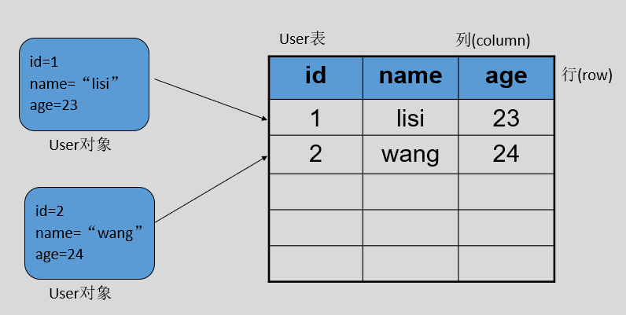
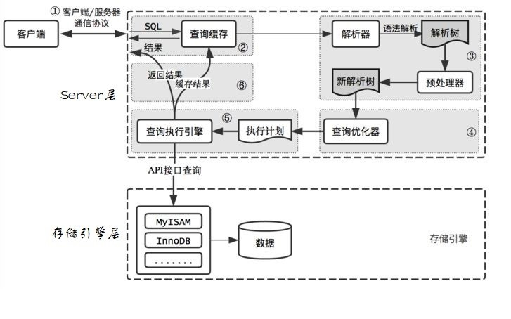

# 数据库

## 目录

- [数据库](#数据库)
  - [目录](#目录)
  - [1 数据库](#1-数据库)
  - [2 MySQL](#2-mysql)
    - [2.1 MySQL 安装与配置](#21-mysql-安装与配置)
    - [2.2 登录 MySQL Server](#22-登录-mysql-server)
    - [2.3 数据库的备份和恢复](#23-数据库的备份和恢复)
      - [2.3.1 备份](#231-备份)
      - [2.3.2 恢复](#232-恢复)
  - [3 SQL](#3-sql)
    - [3.1 DDL 管理数据库](#31-ddl-管理数据库)
      - [3.1.1 创建数据库](#311-创建数据库)
      - [3.1.2 查看、删除数据库](#312-查看删除数据库)
      - [3.1.3 修改数据库](#313-修改数据库)
    - [3.2 数据类型](#32-数据类型)
      - [3.2.1 整数类型](#321-整数类型)
      - [3.2.2 浮点数类型和定点数类型](#322-浮点数类型和定点数类型)
      - [3.2.3 日期与时间类型](#323-日期与时间类型)
      - [3.2.4 字符串类型](#324-字符串类型)
      - [3.2.5 二进制类型](#325-二进制类型)
    - [3.3 DDL 管理表](#33-ddl-管理表)
      - [3.3.1 创建表](#331-创建表)
      - [3.3.2 查询表](#332-查询表)
      - [3.3.3 修改表](#333-修改表)
      - [3.3.4 删除表](#334-删除表)
    - [3.4 DML 数据操纵语言](#34-dml-数据操纵语言)
      - [3.4.1 INSERT](#341-insert)
      - [3.4.2 UPDATE](#342-update)
      - [3.4.3 DELETE](#343-delete)
    - [3.5 常用运算符](#35-常用运算符)
      - [3.5.1 算术运算符](#351-算术运算符)
      - [3.5.2 比较运算符](#352-比较运算符)
      - [3.5.3 逻辑运算符](#353-逻辑运算符)
      - [3.5.4 位操作运算符](#354-位操作运算符)
    - [3.6 DQL 数据查询语言](#36-dql-数据查询语言)
      - [3.6.1 计算表达式和函数的值](#361-计算表达式和函数的值)
      - [3.6.2 查询表中的字段](#362-查询表中的字段)
      - [3.6.3 使用 WHERE 子句过滤记录](#363-使用-where-子句过滤记录)
      - [3.6.4 给字段起别名](#364-给字段起别名)
      - [3.6.5 去除重复行](#365-去除重复行)
      - [3.6.6 排序](#366-排序)
      - [3.6.7 限制结果集](#367-限制结果集)
      - [3.6.8 计算字段](#368-计算字段)
      - [3.6.9 聚合函数](#369-聚合函数)
      - [3.6.10 分组](#3610-分组)
      - [3.6.11 SELECT的顺序](#3611-select的顺序)
    - [3.7 约束](#37-约束)
      - [3.7.1 PRIMARY KEY](#371-primary-key)
      - [3.7.2 FOREIGN KEY](#372-foreign-key)
      - [3.7.3 UNIQUE](#373-unique)
      - [3.7.4 NOT NULL](#374-not-null)
      - [3.7.5 DEFAULT](#375-default)
      - [3.7.6 CHECK](#376-check)
  - [4 数据库范式设计](#4-数据库范式设计)
    - [4.1 数据库范式](#41-数据库范式)
    - [4.2 数据表中的键](#42-数据表中的键)
    - [4.3 从 1NF 到 3NF](#43-从-1nf-到-3nf)
    - [4.4 BCNF](#44-bcnf)
    - [4.5 总结](#45-总结)
  - [5 复杂查询](#5-复杂查询)
    - [5.1 连接查询](#51-连接查询)
      - [5.1.1 交叉连接](#511-交叉连接)
      - [5.1.2 等值连接](#512-等值连接)
      - [5.1.3 非等值连接](#513-非等值连接)
      - [5.1.4 外连接](#514-外连接)
      - [5.1.5 自连接](#515-自连接)
    - [5.2 联合查询](#52-联合查询)
    - [5.3 子查询](#53-子查询)
      - [5.3.1 EXISTS 子查询](#531-exists-子查询)
      - [5.3.2 集合比较子查询](#532-集合比较子查询)
      - [5.3.3 子查询作为计算字段](#533-子查询作为计算字段)
  - [6 事务](#6-事务)
    - [6.1 事务概述](#61-事务概述)
    - [6.2 事务的性质](#62-事务的性质)
    - [6.3 并发执行时可能引发的问题](#63-并发执行时可能引发的问题)
      - [6.3.1 脏写](#631-脏写)
      - [6.3.2 脏读](#632-脏读)
      - [6.3.3 不可重复读](#633-不可重复读)
      - [6.3.4 幻读](#634-幻读)
    - [6.4 隔离级别](#64-隔离级别)
  - [7 InnoDB 索引优化](#7-innodb-索引优化)
    - [7.1 MySQL 逻辑架构](#71-mysql-逻辑架构)
    - [7.2 存储引擎](#72-存储引擎)
      - [7.2.1 MyISAM](#721-myisam)
      - [7.2.2 InnoDB](#722-innodb)
      - [7.2.3 Memory](#723-memory)
    - [7.3 InnoDB 数据页格式](#73-innodb-数据页格式)
    - [7.4 索引](#74-索引)
      - [7.4.1 平衡二叉树索引](#741-平衡二叉树索引)
      - [7.4.2 B 树索引](#742-b-树索引)
      - [7.4.3 B+ 树索引](#743-b-树索引)
      - [7.4.4 索引的好处和坏处](#744-索引的好处和坏处)
    - [7.5 InnoDB 索引](#75-innodb-索引)
      - [7.5.1 聚集索引](#751-聚集索引)
      - [7.5.2 辅助索引](#752-辅助索引)
      - [7.5.3 语法](#753-语法)
      - [7.5.4 回表](#754-回表)
      - [7.5.5 Explain](#755-explain)
    - [7.6 联合索引](#76-联合索引)
    - [7.7 覆盖索引](#77-覆盖索引)
    - [7.8 索引的选择](#78-索引的选择)
  - [8 JDBC](#8-jdbc)
    - [8.1 概述](#81-概述)
    - [8.1 入门案例](#81-入门案例)
    - [8.2 API 详解](#82-api-详解)
      - [8.2.1 Driver&DriverManager](#821-driverdrivermanager)
      - [8.2.2 Statement](#822-statement)
      - [8.2.3 PreparedStatement](#823-preparedstatement)
      - [8.2.4 Batch](#824-batch)
      - [8.2.5 ResultSet](#825-resultset)
      - [8.2.6 管理连接、语句和结果集](#826-管理连接语句和结果集)
      - [8.2.7 JDBC 事务相关 API](#827-jdbc-事务相关-api)
  - [9 数据库连接池](#9-数据库连接池)
    - [9.1 手写数据库连接池](#91-手写数据库连接池)
    - [9.2 优秀的数据库连接池](#92-优秀的数据库连接池)
      - [9.2.1 DBCP](#921-dbcp)
      - [9.2.2 C3P0](#922-c3p0)
      - [9.2.3 Druid](#923-druid)
    - [9.3 数据库连接池的优点](#93-数据库连接池的优点)
  - [10 DBUtils](#10-dbutils)
    - [10.1 QueryRunner](#101-queryrunner)
    - [10.2 ResultSetHandler](#102-resultsethandler)
    - [10.3 DbUtils](#103-dbutils)
****      - [2. UPDATE](#2-update)
      - [3. DELETE](#3-delete)
    - [常用运算符](#常用运算符)
      - [1. 算术运算符](#1-算术运算符)
      - [2. 比较运算符](#2-比较运算符)
      - [3. 逻辑运算符](#3-逻辑运算符)
      - [4. 位操作运算符](#4-位操作运算符)
    - [DQL数据查询语言](#dql数据查询语言)
      - [1. 计算表达式和函数的值](#1-计算表达式和函数的值)
      - [2. 查询表中的字段](#2-查询表中的字段)
      - [3. 使用 WHERE 子句过滤记录](#3-使用-where-子句过滤记录)
      - [4. 给字段起别名](#4-给字段起别名)
      - [5. 去除重复行](#5-去除重复行)
      - [6. 排序](#6-排序)
      - [7. 限制结果集](#7-限制结果集)
      - [8. 计算字段](#8-计算字段)
      - [9. 聚合函数](#9-聚合函数)
      - [10. 分组](#10-分组)
      - [11. SELECT的顺序](#11-select的顺序)
    - [约束](#约束)
      - [1. PRIMARY KEY](#1-primary-key)
      - [2. FOREIGN KEY](#2-foreign-key)
      - [3. UNIQUE](#3-unique)
      - [4. NOT NULL](#4-not-null)
      - [5. DEFAULT](#5-default)
      - [6. CHECK](#6-check)
  - [数据库范式设计](#数据库范式设计)
    - [数据库有哪些范式？](#数据库有哪些范式)
    - [数据表中有哪些键？](#数据表中有哪些键)
    - [从 1NF 到 3NF](#从-1nf-到-3nf)
    - [BCNF](#bcnf)
    - [总结](#总结)
  - [复杂查询](#复杂查询)
    - [连接查询](#连接查询)
      - [1. 交叉连接](#1-交叉连接)
      - [2. 等值连接](#2-等值连接)
      - [3. 非等值连接](#3-非等值连接)
      - [4. 外连接](#4-外连接)
      - [5. 自连接](#5-自连接)
    - [联合查询](#联合查询)
    - [子查询](#子查询)
      - [1. EXISTS 子查询](#1-exists-子查询)
      - [2. 集合比较子查询](#2-集合比较子查询)
      - [3. 子查询作为计算字段](#3-子查询作为计算字段)
  - [事务](#事务)
    - [概述](#概述)
    - [性质](#性质)
    - [并发执行时可能引发的问题](#并发执行时可能引发的问题)
      - [1. 脏写](#1-脏写)
      - [2. 脏读](#2-脏读)
      - [3. 不可重复读](#3-不可重复读)
      - [4. 幻读](#4-幻读)
    - [隔离级别](#隔离级别)
  - [InnoDB索引优化](#innodb索引优化)
    - [MySQL逻辑架构](#mysql逻辑架构)
    - [存储引擎](#存储引擎)
      - [1. MyISAM](#1-myisam)
      - [2. InnoDB](#2-innodb)
      - [3. Memory](#3-memory)
    - [磁盘IO原理](#磁盘io原理)
    - [InnoDB数据页格式](#innodb数据页格式)
    - [索引](#索引)
      - [1. 平衡二叉树索引](#1-平衡二叉树索引)
      - [2. B树索引](#2-b树索引)
      - [3. B+树索引](#3-b树索引)
      - [索引的好处和坏处](#索引的好处和坏处)
    - [InnoDB索引](#innodb索引)
      - [1. 聚集索引](#1-聚集索引)
      - [2. 辅助索引](#2-辅助索引)
      - [3. 语法](#3-语法)
      - [4. 回表](#4-回表)
      - [5. Explain](#5-explain)
    - [联合索引](#联合索引)
    - [覆盖索引](#覆盖索引)
    - [索引的选择](#索引的选择)

## 1 数据库

维基百科数据库定义：  
> A database is an organized collection of data, stored and accessed electronically.  

分类：
- 关系型数据库。  
  不仅存储数据本身，还存储数据之间的关系，比如说用户信息和订单信息。关系型数据库模型把复杂的数据结构归结为简单的二维表（关系表）。

- 非关系型数据库。  
  非关系型数据库也被称为 NoSQL 数据库。NoSQL 的产生并不是要否定关系型数据库，而是作为关系型数据库的一个有效补充。

易混淆术语：
- 数据库系统（DBS）：是指在计算机系统中引入数据库后的系统，一般由数据库、数据库管理系统、应用系统、数据库管理员（DBA）构成。 

- 数据库管理系统（DBMS）：是一种操纵和管理数据库的大型软件，用于建立、使用和维护数据库（如：MySQL）。 

- 数据库（DB）：数据库是按照数据结构来组织、存储和管理数据的仓库。

注：我们通常用数据库这个术语来代表 DBMS，严格来说这是不正确的，容易产生混淆。

数据库管理系统、数据库服务、数据库和表的关系（C/S 架构）：  
<div align="center">

</div>

数据在表中的形式：  
<div align="center">

</div>  

- 表的一行称之为一条记录（数据）。

- 表中一条记录对应一个 Java 对象的数据。  
  - 对象与行对应。  
  - 属性与列对应。


## 2 MySQL

### 2.1 MySQL 安装与配置

具体步骤查看 PDF 文件：<a href="./file/MySQL安装与配置.pdf" download="MySQL安装与配置"> MySQL 安装与配置 </a>。

### 2.2 登录 MySQL Server

在启动 MySQL 服务后，输入以下格式的命令：
```
mysql -h 主机名 -u 用户名 –p
```
- `-h`：该参数用于指定客户端的主机名（host），即哪台机器要登录 MySQL Server。  
  如果是当前机器该参数可以省略。

- `-u`：用户名（user）。

- `-p`：密码（password），如果密码为空，该参数可以省略。

示例：
```
mysql -u root -p
```

### 2.3 数据库的备份和恢复

#### 2.3.1 备份  

在命令行中：
```
mysqldump -u $user -p $db_name > file
```

#### 2.3.2 恢复

**（1）方式一**   

在命令行中：  
```
mysql -u $user -p $db_name < file
```

**（2）方式二**  

在命令行中：  
```
mysql -u $user -p
```

进入 mysql 服务后：
```
> use $db_name;

> source file
```

注：后面不要加分号


## 3 SQL

SQL 是结构化查询语言（Structured Query Language）的缩写。它是一种专门用来与关系型数据库沟通的语言。

SQL 语言的优点：  
- 通用。  
  几乎所有的关系型数据库都支持 SQL。

- 简单易学。  
  它的语句是由一些有很强描述性的关键词组织而成，
而且这些关键词并不多。

- 简单且强有力。  
  灵活地使用 SQL，可以进行非常复杂的数据库操作。 

- 半衰期很长。

SQL 不区分大小写。  
注：  
- 虽然 SQL 不区分大小写，但是表名、列名和值**可能**区分！（这依赖具体的 DBMS 及其配置）。  

- SQL 不区分大小写主要是指关键字不区分大小写。

建议：  
- 关键字大写。
  
- 表名、列名和值最好是以它定义时为准。

> 标准 SQL 是由 ANSI 标准委员会管理的，从而称为 ANSI SQL。许多 DBMS 厂商通过增加语句或指令，对 SQL 进行了扩展，目的是提供一些特定的操作，或者是简化某些操作。虽然这种扩展很有必要，但同时也给 SQL 代码的移植带来了麻烦。   
> 即使 DBMS 有自己的扩展，但它们都支持 ANSI SQL。

SQL 组成：
- DDL：数据定义语言。

- DML：数据操作语言（增、删、改）。

- DQL：数据查询语言（查）。

- DCL：数据控制语言。

- TPL：事务处理语言。

- …

### 3.1 DDL 管理数据库

数据定义语言 DDL（Data Definition Language）。
- 作用：创建 & 管理数据库和表的结构。

- 常用关键字：CREATE、ALTER 和 DROP。

#### 3.1.1 创建数据库

```sql
CREATE DATABASE [IF NOT EXISTS] db_name [create_specification [ create_specification] ...];
```

create_specification：
- `CHARACTER SET charset_name`：指定字符集，如 utf8。

- `COLLATE collation_name`：指定数据库字符集的比较方式。  
  
  比较规则有时也称为排序规则，用于在字符串比较大小时规定其顺序的。同一种字符集可以有多种比较规则。

  比较规则名称以对应的字符集名称开头，中间部分表示主要用于哪种语言，常见后缀有以下几种：
  - `_bin`：以二进制方式比较。即 A < a。

  - `_ci`：不区分大小写。即 A = a。  
  
  默认 `_ci`。

  示例：
  ```sql
  # 创建一个名称为 mydb1 的数据库。
  create database mydb1;

  # 创建一个使用 gbk 字符集的 mydb2 数据库。
  create database if not exists mydb2 character set gbk;

  # 创建一个使用 gbk 字符集，并带校对规则（gbk_bin）的 mydb3 数据库。
  create database mydb3 character set gbk collate gbk_bin;
  ```

#### 3.1.2 查看、删除数据库

显示数据库：
```sql
SHOW DATABASES;
```

显示数据库创建语句：
```sql
SHOW CREATE DATABASE db_name;
```
 
数据库删除语句：
```sql
DROP DATABASE [IF EXISTS] db_name;
```

#### 3.1.3 修改数据库

```sql
ALTER  DATABASE db_name [alter_specification [, alter_specification] ...];
```

alter_specification：    
- `CHARACTER SET charset_name`。

- `COLLATE collation_name`。

示例：
```sql
# 把 mydb2 的字符集修改为 utf8
alter database mydb2 character set utf8;
```

### 3.2 数据类型

注：这里以 MySQL 为例，不同的 DBMS 都支持数值类型、字符串类型以及日期类型，但他们的实现可能不一样。

#### 3.2.1 整数类型

| 数据类型 | 占用字节 | 说明 |
| :- | :- | :- |
| TINYINT | 1 | 很小的整数 |
| SMALLINT | 2 | 小的整数 |
| MEDIUMINT | 3 | 中等大小的整数 |
| INT | 4 | 普通大小的整数 |
| BIGINT | 8 | 大整数 |


#### 3.2.2 浮点数类型和定点数类型

| 数据类型 | 占用字节 | 说明 |
| :- | :- | :- |
| FLOAT(M, D) | 4 | 单精度浮点数 |
| DOUBLE(M, D) | 8 | 双精度浮点数 |
| DECIMAL(M, D) | M + 2 | 定点数 |


- M 称为精度，表示总共的位数; 

- D 称为标度，表示小数的位数。

- DECIMAL 类型不同于 FLOAT & DOUBLE，DECIMAL 实际是以字符串存放的，它的存储空间并不固定，而是由精度 M 决定的。

#### 3.2.3 日期与时间类型

| 数据类型 | 日期格式 | 占用字节 |
| :- | :- | :- |
| YEAR | YYYY | 1 |
| TIME | HH:MM:SS | 3 |
| DATE | YYYY-MM-DD | 3 |
| DATETIME | YYYY-MM-DD HH:MM:SS | 8 |
| TIMESTAMP | YYYY-MM-DD HH:MM:SS | 4 |

DATETIME 和 TIMESTAMP 虽然显示的格式是一样的，但是它们有很大的区别：
- DATETIME 的系统默认值是 NULL, 而 TIMESTAMP 的系统默认值是当前时间 `NOW()`;

- DATETIME 存储的时间与时区无关，而 TIMESTAMP 与时区有关。

#### 3.2.4 字符串类型

| 数据类型 | 占用字节 | 说明 |
| :- | :- | :- |
| CHAR(M) | M , 1 <= M <= 255 | 固定长度字符串 |
| VARCHAR(M) | L + 1, L <= M, 1 <= M <= 255 | 变长字符串 |
| TINYTEXT | L + 1, L < 2 ^ 8 | 非常小的文本字符串 |
| TEXT | L + 2, L < 2 ^ 16 | 小的文本字符串 |
| MEDIUMTEXT | L + 3, L < 2 ^ 24 | 中等大小的文本字符串 |
| LONGTEXT | L + 4, L < 2 ^ 32 | 大的文本字符串 |
| ENUM | 1 或者 2 个字节，取决于枚举的数目，最大 65535 个 | 枚举类型 |
| SET | 1, 2, 3, 4 或 8 个字节 | 集合类型 |

ENUM 类型总有一个默认值，当 ENUM 列声明为 NULL，则默认值为 NULL。如果 ENUM 列被声明为 NOT NULL，则其默认值为列表的第一个元素。

#### 3.2.5 二进制类型

| 数据类型 | 占用字节 | 说明 |
| :- | :- | :- |
| BIT(M) | [(M + 7) / 8] | 位字节类型 |
| BINARY(M) | M | 固定长度的二进制数据 |
| VARBINARY(M) | L + 1 | 可变长度的二进制数据 |
| TINYBLOB(M) | L + 1, L < 2 ^ 8 | 非常小的 BLOB |
| BLOB(M) | L + 2, L < 2 ^ 16 | 小的 BLOB |
| MEDIUMBLOB(M) | L + 3, L < 2 ^ 24 | 中等大小的 BLOB |
| LONGBLOB(M) | L + 4, L < 2 ^ 32 | 非常大的 BLOB |


字符串类型存储的字符串（字符），二进制类型存储的是二进制数据（字节）。

### 3.3 DDL 管理表

#### 3.3.1 创建表

```sql
CREATE TABLE table_name
(
	field1  datatype,
	field2  datatype,
	field3  datatype
)[CHARACTER SET 字符集 COLLATE 校对规则];
```
- field：指定列名。

- datatype：指定列类型。

注：
- 创建表前，要先使用 `USE db_name` 语句使用库。  

- 创建表时，要根据需保存的数据创建相应的列，并根据数据的类型定义相应的列类型。

示例：
```sql
# 在数据库 mydb1 中 创建 user 表
use mydb1;

create table t_user (
	id int,
    name varchar(255),
    password varchar(20),
    birthday date
);
```

#### 3.3.2 查询表

简单描述表结构：
```sql
DESC 表名;

# 或者
DESCRIBE 表名;
```

查看数据库中所有的表：
```sql
SHOW TABLES;
```

查看生成表的 DDL 语句：
```sql
SHOW CREATE TABLE 表名;
```

#### 3.3.3 修改表

使用 `ALTER TABLE` 语句追加、修改或删除列的语法。  

**（1）追加列**  

```sql
ALTER TABLE table_name ADD (column datatype [DEFAULT expr] [, ADD column datatype]...);
```

示例：
```sql
# 添加 gender 列
alter table t_user add column gender varchar(10);

# 在 password 后面添加 balance 列
alter table t_user add column balance int after password;

# 在最前面添加 no 列
alter table t_user add column no int first;

# 添加 a, b 列 
alter table t_user add column a int, add column b int;
```

**（2）修改列**  

```sql
ALTER TABLE table_name change col_name new_col_name datatype [DEFAULT expr] [, change col_name new_col_name datatype [DEFAULT ...] ]...;
```
示例：
```sql
# 把 balance 的名字改成 salary
alter table t_user change column balance salary int;
```

**（3）修改列定义**  

```sql
ALTER TABLE table_name MODIFY column datatype [DEFAULT expr] [,MODIFY column datatype]...;
```
示例：
```sql
# 把 salary 的类型改成 decimal(10,2)
alter table t_user modify column salary decimal(10,2);
```

**（4）删除列**  

```sql
ALTER TABLE table_name DROP column col_name;
```

示例：
```sql
# 删除 a 列
alter table t_user drop column a;
```

注：多个修改的操作可以同时在同一 `ALTER TABLE` 语句后。  
示例：
```sql
# 删除 b 列, 把 gender 的类型改成 bit(1), 在 name 的后面添加 c 列
alter table t_user drop column b, modify column gender bit(1), add column c int after name;
```

**（5）修改表名**  

```sql
RENAME TABLE 表名 TO 新表名
```  
  
RENAME TABLE 语句的另一个用法是移动该表到另一个数据库：
```sql
RENAME TABLE 旧数据库名.旧表名 TO 新数据库名.新表名
```  

**（6）修改表的字符集**  

```sql
alter table student character set utf8;
```

#### 3.3.4 删除表

```sql
DROP TALBE 表名
```


### 3.4 DML 数据操纵语言

DML：Data Manipulation Language。  
作用：用于向数据库表中插入、删除和修改数据。  
常用关键字：INSERT、UPDATE 和 DELETE。

#### 3.4.1 INSERT

使用 INSERT 语句向表中插入数据：  
```sql
INSERT INTO	table [(column [, column...])] VALUES (value [, value...]);
```

- 插入的数据应与字段的数据类型相同。

- 数据的大小应在列的规定范围内。例如：不能将一个长度为 80 的字符串加入到长度为 40 的列中。

- 字符串和日期型数据应包含在单引号中。

示例：
```sql
create table t_user (
    id int,
    name varchar(20),
    age int,
    gender enum('male', 'female')
);

# 插入所有数据类型可以省略 column 
insert into t_user values (1, 'thomas_he', 18, 'male');

# 数据的插入顺序和定义表时的顺序无关
insert into t_user (name, id) values ('茜茜', 2);

# 可以同时插入多条数据
insert into t_user (id, name, age) 
values (3, '张三', 30),
    (4, '李四', 40);

create table user (
    id int,
    name varchar(20),
    age int,
    gender enum('male', 'female')
);

# 可以直接插入表
insert into user (select * from t_user);
```


#### 3.4.2 UPDATE

使用 UPDATE 语句修改表中数据：  
```sql
UPDATE 	tbl_name    
SET col_name1=expr1 [, col_name2=expr2 ...]    
[WHERE where_definition];
```

- UPDATE 语法可以用新值更新原有表行中的各列。

- SET 子句指示要修改哪些列和要给予哪些值。

- WHERE 子句指定应更新哪些行。如没有 WHERE 子句，则更新所有的行。

示例：
```sql
# 把 t_user 表中所有人的年龄改为 18
update t_user 
set age=18;

# 把名字为茜茜的用户的年龄改为 16, 性别改成 female
update t_user 
set age=16, gender='female' 
where name='茜茜';
```

#### 3.4.3 DELETE

使用 DELETE 语句删除表中数据：  
```sql
delete from table_name       
[WHERE where_definition]
```

- DELETE 语句不能删除某一列的值，删除的单位是行。

- 使用 DELETE 语句仅删除记录，不删除表本身。即，删除全部记录后表依然存在，为一个空表。  
  如要删除表，使用 DROP TABLE 语句。

示例：
```sql
# 删除名字为张三的记录
delete from t_user 
where name='张三';

# 清空 t_user 表中的所有记录
delete from t_user;
```

### 3.5 常用运算符

#### 3.5.1 算术运算符

| 运算符 | 作用 |
| :- | :- |
| + | 基本运算，下同 |
| - | |
| * | |
| / | |
| % | |

#### 3.5.2 比较运算符

| 运算符 | 作用 |
| :- | :- |
| = | 相等 |
| <=> | 安全的等于 |
| <>（!=） | 不等于 |
| <= / >= | 小于等于 / 大于等于 |
| < / > | 小于 / 大于 |
| IS NULL | 是否为 NULL |
| IS NOT NULL | 是否不为 NULL |
| BETWEEN AND | 是否在闭区间内 |
| IN | 是否在列表内 |
| NOT IN | 是否不在列表内 |
| LIKE | 通配符匹配 |

like 与通配符搭配使用, 进行模糊查询。
- `%`：匹配任何数目的字符，甚至包括零个字符。

- `_`: 匹配一个字符。

注：不同的 DBMS，通配符可能不一样, 比如 SQL Server 是 `*` 匹配所有字符，`?` 匹配一个字符。


#### 3.5.3 逻辑运算符

| 运算符 | 作用 |
| :- | :- |
| NOT（!） | 非 |
| AND（&&） | 与 |
| OR（\|\|） | 或 |  

#### 3.5.4 位操作运算符

| 运算符 | 作用 |
| :- | :- |
| & | 位与 |
| \| | 位或 |
| ~ | 位非 | 
| ^ | 位异或 | 
| << | 位左移 |
| >> | 位右移 |


### 3.6 DQL 数据查询语言

DQL：Data Query Language。  
作用：查询表中的数据。  
关键字：SELECT。

以下示例以 <a href="./file/heros.sql" download="heros.sql"> heros 表 </a> 为例。 

#### 3.6.1 计算表达式和函数的值

虽然 SELECT 语句通常用于从表中检索数据，但我们也可以用它计算表达式和函数的值。  
示例：
```sql
# 计算表达式 3 * 2 的值 
SELECT 3*2;

# 查看当前的时间 
SELECT NOW();

# 修剪字符串 ' ab cd ' 左右两边的空白
SELECT TRIM(' ab cd ');

# 拼接字符串 'ab' 和 'cd'
SELECT CONCAT('ab', 'cd');
```

#### 3.6.2 查询表中的字段

查询单个字段的值。  
示例：
```sql
# 查询 heros 表中所有英雄的名字
select name from heros;

# 查询 heors 表中所有辅助角色定位
select role_assist from heros;
```

查询多个字段的值，多个字段之间用 `,` 分隔。  
示例：  
```sql
# 查询 heros 表中所有英雄的名字，最大生命值，最大法力值以及主要角色定位。
select name, hp_max, mp_max, role_main from heros;
```

查询所有字段，还可以用 `*` 代指所有字段。
```sql
# 查询 heros 表中所有数据。
select * from heros;
```

注：在生产环境中，尽量不要使用 `*` 通配符。因为查询不必要的数据会降低查询和应用程序的
效率！

#### 3.6.3 使用 WHERE 子句过滤记录

`WHERE` 子句后面接逻辑表达式。如果逻辑表达式的结果为真，这条记录就会添加到结果集中，否则就
不会添加到结果集。  
示例：
```sql
# 返回空表
select * from heros where 0;

# 查询 heros 表中所有数据
select * from heros where 1;

# 查询 heros 中，name='花木兰' 的数据
select * from heros where name='花木兰';
```

#### 3.6.4 给字段起别名

`AS` 可以给字段起别名。  
示例：
```sql
SELECT name, hp_max AS hp, mp_max AS mp FROM heros;

# 省略 AS
SELECT name, hp_max hp, mp_max mp FROM heros;
```
注：
- AS 关键字可以省略，但是不推荐这样做。

- AS 关键字不仅仅可以给字段起别名，还可以给表起别名。

#### 3.6.5 去除重复行

`DISTINCT` 可以对查询结果去重。  
示例：
```sql
# 查询主要角色定位有哪些
select role_main from heros;

# 去重查询主要角色定位
select distinct role_main from heros;

# 去重查询主要角色定位和辅助角色定位
select distinct role_main, role_assist from heros;
```

注：
- DISTINCT 关键字必须放在所有查询字段的前面。

- DISTINCT 是对所有查询字段的组合进行去重，也就是说每个字段都相同，才认为两条记录是相同。

#### 3.6.6 排序

`ORDER BY` 可以对结果集进行排序。`ASC` 表示升序，`DESC` 表示降序，默认情况为升序。  
示例：
```sql
# 查询所有英雄，并按最大生命值从大到小排序
select name, hp_max from heros order by hp_max asc;
```

还可以对多个字段进行排序。即先按照第一个字段排序，当第一个字段相同时，再按照第二个字段排序，依此类推。  
示例：
```sql
# 查询所有英雄，先按最大生命值降序排序，再按照最大法力值升序排序
select name, hp_max, mp_max from heros order by hp_max asc, mp_max desc;
```

`ORDER BY` 可以对非选择字段进行排序，也就是说排序的字段不一定要在结果集中。  
示例：
```sql
SELECT name, hp_max FROM heros ORDER BY hp_max ASC, mp_max DESC;
```

甚至，我们还可以对计算字段进行排序。  
示例：
```sql
SELECT name, hp_max FROM heros ORDER BY (hp_max + mp_max) DESC;
```

#### 3.6.7 限制结果集 

`LIMIT` 可以限制结果集的数量。它有两种使用方式：`LIMIT offset, nums` 和 `LIMIT nums OFFSET offset`。  
示例：
```sql
# 查询最大生命值最高的 5 名英雄
select name, hp_max from heros order by hp_max desc limit 0, 5;

# 推荐使用 LIMIT nums OFFSET offset 方式，可以清楚查看偏移量
select name, hp_max from heros order by hp_max desc limit 5 offset 0;

# 偏移量为 0，可省略
select name, hp_max from heros order by hp_max desc limit 5;
```

使用 `LIMIT` 可以很方便地实现分页查询：
```sql
limit rows offset rows * (page - 1)
```


注：不同的 DBMS 用来限制结果集的关键字是不一样的。比如 Microsoft SQL Server 和 Access  使用的是 TOP 关键字。

#### 3.6.8 计算字段

计算字段并不实际存在于数据库表中，它是由表中的其它字段计算而来的。一般我们会给计算字段起一
个的别名。  
示例：
```sql
SELECT name, hp_max + mp_max FROM heros;

SELECT name, hp_max + mp_max AS total_max FROM heros;
```

#### 3.6.9 聚合函数

聚合函数是对某个字段的值进行统计的，而不是对某条记录进行统计。如果想计算某个学生各科成绩的总分，那么应该使用计算字段。  

聚合函数往往是搭配分组使用的。如果没有分组，那么聚合函数统计的是整个结果集的数据；如果分组了，那么聚合函数统计的是结果集中每个组的数据。  

SQL 中一共有 5 个聚合函数。分别为 `COUNT()`，`SUM()`，`AVG()`，`MAX()`，`MIN()`。  

`COUNT(*)` 可以统计记录数。可以统计 null 行。  
示例：
```sql
# 查询 heros 表中有多少条记录 
select count(*) from heros;

# 统计 null 行
create table temp (
	a int
);
insert into temp values (null);
select count(*) from temp;
```

`COUNT()` 作用于某个具体的字段，可以统计这个字段的非 `NULL` 值的个数。  
示例：
```sql
# 查询有辅助角色定义的英雄有多少个
select count(role_assist) from heros;
```

`SUM()` 用于统计某个字段非 `NULL` 值的和。  
示例：
```sql
SELECT SUM(hp_max) FROM heros;
```

`AVG()` 用于统计某个字段非 `NULL` 值的平均值。  
示例：
```sql
# 查询最大生命值的平均值
SELECT AVG(hp_max) FROM heros;

# 将结果格式化，保留小数点后 2 位
SELECT round(AVG(hp_max), 2) FROM heros;
```

`MAX()` 用于统计某个字段非 `NULL` 值的最大值。  
`MIN()` 用于统计某个字段非 `NULL` 值的最小值。  
示例：
```sql
SELECT MAX(hp_max) FROM heros;

SELECT MIN(hp_max) FROM heros;
```

我们还可以对字段中不同的值进行统计。先用 `DSITINCT` 去重，再用聚合函数统计。  
示例：
```sql
select count(hp_max) from heros;

SELECT COUNT(DISTINCT hp_max) FROM heros;
```

#### 3.6.10 分组

`GROUP BY` 可以对记录进行分组。 

搭配聚合函数使用：
```sql
# 按照主要角色定位进行分组，并统计每一组的英雄数目。
select role_main, count(*) from heros group by role_main;

# 按照次要角色定位进行分组，并统计每一组的英雄数目。
select role_assist, count(*) from heros group by role_assist;
```


`GROUP_CONCAT`：
```sql
# 如果我们想知道每种角色的英雄都有哪些，可以使用 GROUP_CONCAT() 函数。
select role_main, group_concat(name) from heros group by role_main;
```

我们可以对多个字段进行分组。也就是说，每个字段的值都相同的记录为一组。  
示例：
```sql
SELECT COUNT(*) AS num, role_main, role_assist 
FROM heros 
GROUP BY role_main, role_assist 
ORDER BY num DESC;
```

`HAVING` 可以过滤分组。  
示例：
```sql
# 按照英雄的主要角色定位，次要角色定位进行分组，并且筛选分组中英雄数目大于 5 的组，最后根据每组的英雄数目从高到低进行排序。
SELECT COUNT(*) AS num, role_main, role_assist 
FROM heros 
GROUP BY role_main, role_assist 
HAVING num > 5
ORDER BY num DESC;

# 筛选最大生命值大于 6000 的英雄，按照主要角色定位，次要角色定位分组，并且筛选英雄数目大于 5 的分组，最后按照英雄数目从高到低进行排序。
SELECT COUNT(*) AS num, role_main, role_assist 
FROM heros 
WHERE hp_max > 6000
GROUP BY role_main, role_assist 
HAVING num > 5
ORDER BY num DESC;
```

#### 3.6.11 SELECT的顺序

SELECT 是 RDBMS 中执行最多的操作。我们不仅仅要理解 SELECT 的语法，还要理解它底层执行的原理。  
- 语法中关键字的顺序：  
  ```sql
  SELECT ... 
  FROM ... 
  WHERE ... 
  GROUP BY ... 
  HAVING ... 
  ORDER BY ... 
  LIMIT ...
  ```

- 语句的执行顺序。不同的 RDBMS，它们 SELECT 语句的执行顺序基本是相同的。  
  ```
  FROM --> WHERE --> GROUP BY --> HAVING --> SELECT --> DISTINCT --> ORDER BY --> LIMIT
  ```

示例：
```sql
SELECT DISTINCT team_id, team_name, count(*) AS num # 顺序 5
FROM player JOIN team ON player.team_id = team.team_id # 顺序 1
WHERE height > 1.80 # 顺序 2
GROUP BY player.team_id # 顺序 3
HAVING num > 2 # 顺序 4
ORDER BY num DESC # 顺序 6
LIMIT 2; # 顺序 7
```

### 3.7 约束

当我们创建数据表的时候，我们需要对它的字段进行一些约束，目的在于保证数据的准确性和一致性。  

常见的约束有以下几种：主键约束、外键约束、唯一性约束、非空约束、DEFAULT 约束以及 CHECK 约束。

#### 3.7.1 PRIMARY KEY

主键的作用是唯一标识一条记录。所以它不能重复，也不能为空，我们可以认为它是唯一性约束和非空约束的组合。一张数据表的主键最多只能有一个（推荐每张表都设置一个主键）。主键可以是一个字段，
也可以由多个字段符合组成。  
示例：  
- 一个字段：
  ```sql
  # 方式一
  create table t_student (
      id int primary key,
      name varchar(20)
  );

  # 方式二
  create table t_student (
      id int,
      name varchar(20),
      primary key(id)
  );

  # 查看表的主键
  show index from t_student;
  show keys from t_student;
  ```

- 多个字段：
  ```sql
  create table t_score(
      sid int,
      cid int,
      score int,
      primary key(sid, cid)
  );
  ```

- 创建表之后，再指定主键（不推荐）：
  ```sql
  create table t_score(
      sid int,
      cid int,
      score int
  );

  alter table t_score add primary key(sid, cid);
  ```

`auto_increment` 关键字往往和 primary key 一起使用。  
作用：被修饰的字段会自动增长。  
示例：
```sql
create table t_student (
    id int primary key auto_increment,
    name varchar(20)
);

create table t_student (
    id int unique auto_increment,
    name varchar(20)
);
```
注：
- `auto_increment` 只能作用于被 primary key 或者是 unique 修饰的字段。

- `auto_increment` 作用字段的类型必须是数值类型。

- 一张数据表只能有一个自增长字段。

#### 3.7.2 FOREIGN KEY

外键约束的作用是确保表与表之间参照完整性。一张表的外键往往对应另一张表的主键。外键可以是重复的，也可以为空。  
示例：  
```sql
create table t_class (
    id int primary key auto_increment,
    name varchar(20) not null,
    teacher varchar(20) not null
);

create table t_student (
    id int primary key auto_increment,
    name varchar(20) not null,
    cid int,
    foreign key(cid) references t_class(id)
);


# 我们还可以给外键添加一个名字
create table t_student (
    id int primary key auto_increment,
    name varchar(20) not null,
    cid int,
    constraint fk_cid foreign key(cid) references t_class(id)
);

# 当然我们还可以在创建表之后，再添加外键（不推荐）
create table t_student (
    id int primary key auto_increment,
    name varchar(20) not null,
    cid int
);
alter table t_student add constraint fk_cid foreign key(cid) references t_class(id);
```

添加外键之后，对两张表都会有一些约束。具体体现在：
- t_student 表不能随意的添加和修改。

- t_class 表不能随意的删除和修改。

级联删除：
```sql
# 删除 t_class 表中的记录，那么 t_student 中引用相应记录的行也会一起被删除。
create table t_student (
    id int primary key auto_increment,
    name varchar(20) not null,
    cid int,
    constraint fk_cid foreign key(cid) references t_class(id) on delete cascade
);
```

级联置空：
```sql
# 删除 t_class 表中的记录，那么 t_student 中引用相应记录的行的外键会被置为 null 。
create table t_student (
    id int primary key auto_increment,
    name varchar(20) not null,
    cid int,
    constraint fk_cid foreign key(cid) references t_class(id) on delete set null
);
```

外键虽然可以保证表与表之间的参照完整性，但是它的缺点也很明显：  
- 影响数据库的性能。

- 在高并发场景中容易引起死锁。

- 当数据量很大的时候，为了保证查询的性能，我们需要进行分库分表。一旦分库分表，我们就不能
保证参照的完整性了。

正是因为这些原因，所以《阿里巴巴开发手册》中规定：
> 不要在数据库中设置外键，一切的参照完整都应该在业务层中完成。  

当然，这并不是说，外键就一无是处。如果参照完整性都在业务层中完成，也会导致一些问题：  
- 业务层与数据耦合了。

- 增加了业务层的逻辑。

- 不能够在数据库的层面保证表之间的参照完整性。  

所以，我们应该正确地看待外键。在以下场景中，我们是可以使用外键的。
- 并发度不高。
  
- 数据量不大，不需要分库分表。
  
- 正确性 > 性能

#### 3.7.3 UNIQUE

唯一性约束保证了字段的值是唯一的。即使我们有了主键，我们还是可以对其它字段设置唯一性约束。  
示例：
```sql
create table t_unique(
    a int unique
);
```

注：null 与 null 是不相同的，所以唯一性约束的字段，可以有多个 null 值。

#### 3.7.4 NOT NULL

非空性约束保证了字段的值不为 null ，必须有个具体的值。

示例：
```sql
create table t_student (
    id int primary key auto_increment,
    name varchar(20) not null,
);
```

#### 3.7.5 DEFAULT

DEFAULT 表示字段的默认值。如果插入数据的时候，没有给该字段取值，就会设置为默认值。  
示例：
```sql
create table t_default(
    a int default 100
);
```

#### 3.7.6 CHECK

CHECK 表示自定义约束。MySQL 没有实现这个功能，但是其它商用型数据库，比如 Oracle 是有这个
功能的。  
示例：  
```sql
create table t_check(
    height float(3, 2) check(height between 0.00 and 3.00)
);
```

## 4 数据库范式设计

范式是数据表设计的基本原则，又很容易被忽略。很多时候，当数据库运行了一段时间之后，我们才发现数据表设计得有问题。重新调整数据表的结构，就需要做数据迁移，还有可能影响程序的业务逻辑，以及网站正常的访问。所以在开始设置数据库的时候，我们就需要重视数据表的设计。

### 4.1 数据库范式

我们在设计关系型数据库模型的时候，需要对关系表各个字段之间联系的合理化程度进行定义，这就有了不同等级的规范要求，这些规范要求被称为范式（NF）。你可以把范式理解为，一张关系表的设计结构需要满足的某种设计标准的级别。  

目前关系型数据库一共有 6 种范式，按照范式级别，从低到高分别是：1NF（第一范式）、2NF（第二范式）、3NF（第三范式）、BCNF（巴斯 - 科德范式）、4NF（第四范式）和 5NF（第五范式，又叫做完美范式）。  

数据库的范式设计越高阶，冗余度就越低，同时高阶的范式一定符合低阶范式的要求，比如满足 2NF 的一定满足 1NF，满足 3NF 的一定满足 2NF，依次类推。  

一般来说数据表的设计应尽量满足 3NF。但也不绝对，有时候为了提高某些查询性能，我们还需要破坏范式规则，也就是反范式设计。

### 4.2 数据表中的键

范式的定义会使用到主键和候选键（因为主键和候选键可以唯一标识元组），数据库中的键（Key）由一个或者多个属性组成。
- 超键：能唯一标识元组的属性集叫做超键。

- 候选键：如果超键不包括多余的属性，那么这个超键就是候选键。

- 主键：用户可以从候选键中选择一个作为主键。

- 外键：如果数据表 R1 中的某属性集不是 R1 的主键，而是另一个数据表 R2 的主键，那么这个属性集就是数据表 R1 的外键。

- 主属性：包含在任一候选键中的属性称为主属性。

- 非主属性：与主属性相对，指的是不包含在任何一个候选键中的属性。  

示例：  
```
NBA 球员表和球队表。

球员表：球员编号、姓名、身份证号、年龄和球队编号；
球队表：球队编号、主教练和球队所在地。

对于球员表来说，超键就是包括球员编号或者身份证号的任意组合，比如（球员编号）、（球员编号，姓名）、（身份证号，年龄）等。

候选键就是最小的超键，对于球员表来说，候选键就是（球员编号）或者（身份证号）。

主键是我们自己选定，也就是从候选键中选择一个，比如（球员编号）。

外键就是球员表中的球队编号。

在球员表中，主属性是（球员编号）（身份证号），其他的属性（姓名）、（年龄）、（球队编号）都是非主属性。
```

### 4.3 从 1NF 到 3NF

1NF 指的是数据库表中的任何属性都是原子性的，不可再分。  
不同的业务，对不可再分的要求也不一样。

2NF 指的数据表里的非主属性都要和这个数据表的候选键有完全依赖关系。  
所谓完全依赖不同于部分依赖，也就是不能仅依赖候选键的一部分属性，而必须依赖全部属性。

例如设计一张球员比赛表。

球员比赛表：球员编号、姓名、年龄、比赛编号、比赛时间、比赛场地和得分。

这里候选键和主键都为（球员编号，比赛编号），我们可以通过候选键来决定如下的关系：`(球员编号, 比赛编号) → (姓名, 年龄, 比赛时间, 比赛场地，得分)`。

但是这个数据表不满足第二范式，因为数据表中的字段之间还存在着如下的对应关系：`(球员编号) → (姓名，年龄)， (比赛编号) → (比赛时间, 比赛场地)`。

也就是说候选键中的某个字段决定了非主属性。即，对于非主属性来说，并非完全依赖候选键。

这样设计会产生几个问题：
- 数据冗余：如果一个球员可以参加 m 场比赛，那么球员的姓名和年龄就重复了 m-1 次。一个比赛也可能会有 n 个球员参加，比赛的时间和地点就重复了 n-1 次。

- 插入异常：如果我们想要添加一场新的比赛，但是这时还没有确定参加的球员都有谁，那么就没法插入。

- 删除异常：如果我要删除某个球员编号，如果没有单独保存比赛表的话，就会同时把比赛信息删除掉。

- 更新异常：如果我们调整了某个比赛的时间，那么数据表中所有这个比赛的时间都需要进行调整，否则就会出现一场比赛时间不同的情况。

为了避免出现上述的情况，我们可以把球员比赛表设计为下面的三张表：
1. 球员表：包含球员编号、姓名和年龄等属性；

2. 比赛表：包含比赛编号、比赛时间和比赛场地等属性；

3. 球员比赛关系表：包含球员编号、比赛编号和得分等属性。

这样的话，每张数据表都符合第二范式，也就避免了异常情况的发生。某种程度上 2NF 是对 1NF 原子性的升级。1NF 告诉我们字段属性需要是原子性的，而 2NF 告诉我们一张表就是一个独立的对象，也就是说一张表只表达一个意思。

3NF 在满足 2NF 的同时，对任何非主属性都不传递依赖于候选键。也就是说不能存在非主属性 A 依赖于非主属性 B，非主属性 B 依赖于候选键的情况。  

用球员表举例，这张表包含的属性包括球员编号、姓名、球队名称和球队主教练。属性之间的依赖关系如下图所示：  
<div align="center">

</div>  
看到球员编号决定了球队名称，同时球队名称决定了球队主教练，非主属性球队主教练就会传递依赖于球员编号，因此不符合 3NF 的要求。  

如果要达到 3NF 的要求，需要把数据表拆成：球员表的属性包括球员编号、姓名和球队名称；球队表的属性包括球队名称、球队主教练。

### 4.4 BCNF

如果数据表的关系模式符合 3NF 的要求，就不存在问题了吗？我们来看下这张仓库管理关系表：  
<div align="center">

</div>

在这个数据表中，一个仓库只有一个管理员，同时一个管理员也只管理一个仓库。我们先来梳理下这些属性之间的依赖关系。
- 仓库名决定了管理员，管理员也决定了仓库名，同时（仓库名，物品名）的属性集合可以决定数量这个属性。这样，我们就可以找到数据表的候选键是（管理员，物品名）和（仓库名，物品名）。

- 然后我们从候选键中选择一个作为主键，比如（仓库名，物品名）。

- 在这里，主属性是包含在任一候选键中的属性，也就是仓库名，管理员和物品名。非主属性是数量这个属性。

判断这张表的范式等级:
- 首先，数据表每个属性都是原子性的，符合 1NF 的要求；

- 其次，数据表中非主属性数量都与候选键全部依赖，（仓库名，物品名）决定数量，（管理员，物品名）决定数量，因此，数据表符合 2NF 的要求；

- 最后，数据表中的非主属性，不传递依赖于候选键。因此符合 3NF 的要求。

既然这张表满足了 3NF 的要求，那么它就不存在问题了吗？我们来分析下面的情况：
- 增加一个仓库，但是还没有存放任何物品。根据数据表实体完整性的要求，主键不能有空值，因此会出现插入异常；

- 如果仓库更换了管理员，我们就可能会修改数据表中的多条记录；

- 如果仓库里的商品都卖空了，那么此时仓库名称和相应的管理员名称也会随之被删除。

所以，即便数据表符合 3NF 的要求，同样可能存在插入，更新和删除数据的异常情况。

解决思路：
首先我们分析下造成这些异常的原因：主属性管理员对于候选键（仓库名，物品名）是部分依赖的关系，这样就有可能导致上面的异常情况。

因此，人们在 3NF 的基础上进行了改进，提出了 BCNF。它在 3NF 的基础上消除了主属性对候选键的部分依赖或者传递依赖关系。

为了满足 BCNF 的要求，我们需要将上面的仓库管理表拆分成下面两张表：
- 仓库表：仓库名, 管理员。

- 库存表：仓库名，物品名，数量。

这样就不存在主属性对于候选键的部分依赖或传递依赖。

### 4.5 总结

- 1NF 需要保证表中每个属性都保持原子性；

- 2NF 需要保证表中的非主属性与候选键完全依赖；

- 3NF 需要保证表中的非主属性与候选键不存在传递依赖。

- BCNF 需要保证表中的主属性与候选键不存在部分依赖或者传递依赖。

## 5 复杂查询

SQL 允许进行复杂的查询，包括：连接查询，联合查询和子查询。

接下来的示例来自：[nba](./file/nba)

### 5.1 连接查询

在设计表的时候，为了避免数据的冗余，我们往往会将数据分散到多个表中。因此，在我们查询数据的时候，需要连接多个表进行查询。  

SQL92 和 SQL99 连表查询的语法有很大的不同。建议大家采用 SQL99 标准，因为它的层次性更强，可读性也更高。

连接查询大致可以分为 5 种，分别为：交叉连接，等值连接，非等值连接，外连接和自连接。

#### 5.1.1 交叉连接

交叉连接也叫笛卡尔乘积。
> 笛卡尔乘积：在数学中，两个集合 X 和 Y 的笛卡儿积（英语：Cartesian product），又称直积，在集合论中表示为 X x Y，是所有可能的有序对组成的集合，其中有序对的第一个对象是 X 的成员，第二个对象是 Y 的成员。

在 SQL99 中，我们可以通过 `CROSS JOIN` 获取多张表的笛卡尔乘积。  
示例：
```sql
select * from player;

select * from team;

select * from player 
cross join team;
```

注：
- 交叉连接只是获取所有数据的集合，其中大多数数据都是没意义的，所以我们还需要对数据进行筛选。

- 交叉连接是所有其它连接的基础。

#### 5.1.2 等值连接

等值连接就是对多张表中相同的字段进行等值判断。在 SQL99 中可以有多种方式表示等值连接。

**（1）自然连接**  

`NATURAL JOIN` 会自动查询两张连接表中所有相同的字段，然后进行等值连接。  
示例：
```sql
SELECT player_id, team_id, player_name, height, team_name 
FROM player NATURAL JOIN team;
```

**（2）USING 连接**  

当然我们还可以用 USING 来指定用哪些同名字段进行等值连接。  
示例：  
```sql
SELECT player_id, team_id, player_name, height, team_name 
FROM player JOIN team USING(team_id);
```

**（3）ON 连接**  

ON 表示想要连接的条件，也可以用 ON 来实现等值连接。  
示例：
```sql
SELECT player_id, player.team_id, player_name, height, team_name FROM player
JOIN team ON player.team_id = team.team_id;
```

#### 5.1.3 非等值连接

连接两张表的条件如果是相等判断，那就是等值连接，否则就是非等值连接。  

示例：
```sql
# 查询每个球员的身高级别。
SELECT player_name, height, height_level
FROM player JOIN height_grades AS h
ON player.height BETWEEN h.height_lowest AND h.height_highest;
```

#### 5.1.4 外连接

外连接除了查询满足条件的记录以外，还可以查询某一方不满足条件的记录。两张表做外连接，会有一张表是主表，另一张表是从表。

**（1）左外连接**  

左外连接，就是左边的表是主表，需要显示左边表的全部行。右边表是从表，只显示满足条件的行。关键字为 `LEFT OUTER JOIN`。  
示例：
```sql
select girls.gid, gname, bname
from girls left join boys
on girls.bid = boys.bid;
```

**（2）右外连接**  

右外连接，就是右边的表是主表，需要显示右边表的全部行。左边表是从表，只显示满足条件的行。关键字为 `RIGHT OUTER JOIN`。  
示例：
```sql
select boys.bid, bname, gname
from girls right join boys
using (gid);
```

注：SQLite 只实现了左外连接。

**（3）全外连接**  

两张表都是主表，都需要显示全部行。但是 MySQL 不支持全外连接。关键字为 `FULL OUTER JOIN`。

#### 5.1.5 自连接

我们可以连接不同的表，也可以对同一张表进行连接，这样的连接我们称之为自连接。  
示例：
```sql
# 查看比布雷克-格里芬高的球员
SELECT b.player_name, b.height 
FROM player as a JOIN player as b 
ON a.player_name = '布雷克-格里芬' and a.height < b.height;
```

### 5.2 联合查询

用 UNION 关键字可以将多个结果集合并成一个结果集，这样的查询称为联合查询。  

应用场景：要查询的结果来自多个表，且多个表没有直接的连接关系，但查询的信息一致时。  
示例：
```sql
use friend;
insert into boys values (5, "ET", null);
insert into girls values (5, "ET", null);

# 查询男生和女生的基本信息
select * from boys
union all
select * from girls;
```

注:
- 列数一致。

- 对应的数据最好一致。

- `UNION` 会去重, `UNION ALL` 不会去重。


### 5.3 子查询

子查询就是嵌套在查询中的查询。  

优点：可以进行更加复杂的查询，更容易理解查询的过程。  
很多情况下，我们无法直接从数据表中得到我们想要的结果。往往需要先进行一次查询，然后在这次查询的基础上，再次进行查询。

子查询可以分为关联子查询和非关联子查询。

如果子查询只执行一次，然后子查询的结果集会作为外部查询的条件进行判断，那么这样的子查询叫做非关联子查询。  
示例：
```sql
# 查询哪个球员的身高最高，最高身高是多少
SELECT player_name, height 
FROM player 
WHERE height = (
    SELECT max(height) FROM player # 标量子查询
);
```

如果子查询依赖于外部查询，通常情况下是因为子查询用到了外部查询的某些字段。因此，每执行一次外部查询，子查询都要重新执行一次，这样的子查询叫做关联子查询。  
示例：
```sql
# 查询每个球队中大于平均身高的球员有哪些，并显示球员姓名，身高以及所在球队 ID。
SELECT player_name, height, team_id 
FROM player AS a 
WHERE height > (
    SELECT AVG(height) 
    FROM player AS b 
    WHERE a.team_id = b.team_id
);
```

#### 5.3.1 EXISTS 子查询

关联子查询可能会搭配 EXISTS 关键字一起使用。  
EXISTS 用来判断子查询的结果集是否为空集。如果不为空集返回 True ，如果为空集返回 False 。  
示例：
```sql
# 查询出过场的球员都有哪些，并显示他们的球员ID，球员姓名，球队ID。
select player_id, player_name, team_id
from player
where exists (
    select player_id 
    from player_score 
    where player_score.player_id = player.player_id
);
```

那么，`NOT EXISTS` 自然就是不存在的意思。  
示例：
```sql
# 查询没出过场的球员都有哪些，并显示他们的球员 ID，球员姓名，球队ID。
select player_id, player_name, team_id
from player
where not exists (
    select player_id 
    from player_score 
    where player_score.player_id = player.player_id
);
```

#### 5.3.2 集合比较子查询

集合比较子查询的作用是与外部查询的结果集进行比较。主要有以下几个关键字：IN、SOME (ANY) 和 ALL。他们的含义如下：
| 关键字 | 含义 |
| :- | :- |
| IN | 判断是否在子查询的结果集中 |
| SOME (ANY) | 需要与比较操作符一起使用，与子查询结果集中的某个值进行比较 |
| ALL | 需要与比较操作符一起使用，与子查询结果集中的所有值进行比较 |

示例：
```sql
# 查询出过场的球员都有哪些，并显示他们的球员 ID，球员姓名，球队 ID。可以采用 IN 来进行操作。
select player_id, player_name, team_id
from player
where player_id in (
    select distinct player_id 
    from player_score
);
```

SOME 和 ALL 都需要和比较操作符一起使用，这些比较操作符包括： `>` 、 `=` 、 `<` 、`>=` 、`<=`  和 `<>` 。  
示例：
```sql
# 查询比印第安纳步行者 (team_id=1002) 中某个球员身高高的球员有哪些，显示它们的球员ID，球员姓名和球员身高。
select player_id, player_name, height
from player
where height > some(
    select height from player where team_id = 1002
);

# 查询比印第安纳步行者 (team_id=1002) 中所有球员身高都高的球员有哪些，显示它
们的球员ID，球员姓名和球员身高。
select player_id, player_name, height
from player
where height > all(
    select height from player where team_id = 1002
);
```

#### 5.3.3 子查询作为计算字段

子查询甚至可以作为计算字段存在。  
示例：
```sql
# 查询每个球队的名称，和它们的球员数。
select team_name, (select count(*) from player where player.team_id = team.team_id) AS player_num from team;
```

注：子查询可以作为计算字段存在时，通常会给这个计算字段起个别名，因为子查询实在
太长，别名更容易理解。


## 6 事务

### 6.1 事务概述

事务（transaction）：构成单一逻辑工作单元的操作集合。  

即使有故障，数据库系统也必须保证事务的正确执行 —— 要么执行整个事务，要么属于该事务的操作一个也不执行。

事务的基本操作：
- `START TRANSACTION` / `BEGIN`：开启一个事务，标记事务的起点。

- `COMMIT`：提交事务，表示事务成功被执行。

- `ROLL BACK`：回滚事务，回滚到初始状态或者回滚点。

- `SAVEPOINT`：回滚点。

- `RELEASE SAVEPOINT`：删除回滚点。

- `SET TRANSACTION`：设置隔离级别。

注：
- `START TRANSACTION` 标志事务的开始，在 MySQL 中可以用 `set autocommit = 0` 替代。

- 结束事务的情况只有两种：
  - `COMMIT`：表示事务成功被执行，结束事务。

  - 发生故障：结束事务, 不管有没有设置回滚点，都会回到事务开启前的状态。

- `ROLLBACK`：不表示发生故障, 它也是一个数据库操作，属于事务的一部分。表示回滚事务，回滚到事务开启前的状态，或者中间的某个回滚点。要想 `ROLLBACK` 生效，必须要 `COMMIT`。

### 6.2 事务的性质

事务的性质 —— ACID：
- 原子性（Atomicity）：原子性是指事务是一个不可分割的工作单位，事务中的操作要么都发生，要么都不发生。无论是操作系统崩溃，还是计算机停止运行，这项要求都要成立。

- 一致性（Consistency）：事务作为一个原子性操作，它从一个一致性的数据库状态开始运行，事务结束时，数据库的状态必须再次是一致的。

- 隔离性（Isolation）：尽管多个事务可能并发执行，但系统保证，对于任何一对事务 Ti 和 Tj，在 Ti 看来，Tj 要么在 Ti 开始之前已经完成，要么在 Ti 完成之后才开始执行。因此，每个事务都感觉不到系统中有其他事务在并发地执行。

- 持久性（Durability）：一个事务成功完成后，它对数据库的改变必须是永久的，即使出现系统故障。

ACID 这四个特性中，原子性是基础，隔离性是手段，一致性是约束条件，而持久性是目的。

### 6.3 并发执行时可能引发的问题

#### 6.3.1 脏写

示例：  
假设 A 开始为 1000。T1 和 T2 两个事务并发运行。T1 表示给 A 存 100 元，T2 表示给 A 存 100 元。调度如下：  
<div align="center">

</div>  
最终，A 账户只会有 1100 块钱。

这个现象，我们称之为脏写。  
脏写是指当多个事务并发写同一数据时，先执行的事务所写的数据会被后写的数据覆盖。  
脏写会导致更新丢失。就好像先提交的事务根本没有执行一样。

#### 6.3.2 脏读

示例：  
假设 A 和 B 开始都为 1000。T1 和 T2 两个事务并发运行。T1 表示 A 给 B 转账 100 元，T2 表示计算 A 和 B 的资金总额。调度如下：  
<div align="center">

</div>   
T2 计算的 A，B 总额是 1900。

这种现象称之为脏读。  

如果一个事务 A 向数据库写数据，但该事务还没提交或终止，另一个事务 B 就看到了事务 A 写入数据库的数据，这个现象我们称为脏读。

#### 6.3.3 不可重复读

示例：  
假设 A 开始为 1000。T1 和 T2 两个事务并发运行。T1 表示 A 中存入 100 元，T2 表示为 A 生成两张不同的报表。调度如下：  
<div align="center">

</div>   
结果就是，同一个事务中生成的两张报表是不一致的。

不可重复读：一个事务有对同一个数据项的多次读取，但是在某前后两次读取之间，另一个事务更新该数据项，并且提交了。在后一次读取时，感知到了提交的更新。

#### 6.3.4 幻读

示例：  
表 t 中现有三个数据 A B C。T1 表示向表 t 中插入新数据 X, T2 表示读取表 t 的所有数据，并生成两张报表。调度如下：  
<div align="center">

</div> 
结果就是，同一个事务中生成的两张报表是不一致的。  

一个事务需要进行前后两次统计，在这两次统计期间，另一个事务插入了新的符合统计条件的记录，并且提交了。导致前后两次统计的数据不一致。这种现象称之为幻读。
- 从这个事务的视角来看，平白无故多了几条数据，就像产生了幻觉一样。

### 6.4 隔离级别

数据库提供了不同的隔离级别来应对并发执行事务可能会引发的各种问题。

SQL 标准规定了四种隔离级别，分别为
- 读未提交（read uncommitted）：允许读取未提交的数据。

- 读已提交（read committed）：只允许读取已提交数据，但不要求可重复读。比如，在事务两次读取一个数据项期间，另一个事务更新了该数据项并提交。

- 可重复读（repeatable read）：只允许读取已提交数据，而且在一个事务两次读取一个数据项期间，其他事务不得更新该数据。但该事务不要求与其他事务可串行化。比如，在两次统计查询中，另一个事务可以插入一些记录，当这些记录中有符合查询条件的，那么就会产生幻读。

- 可串行化（serializable）：看起来事务就好像是串行执行的一样。一个事务结束后，另一个事务才开始执行。

隔离性依次增高：read uncommitted -> read committed -> repeatable read -> serializable

| | 脏写 | 脏读 | 不可重读读 | 幻读 |
| :- | :-: | :-: | :-: | :-: |
| read uncommitted | × | √ | √ | √ |
| read committed | × | × | √ | √ |
| repeatable read | × | × | × | √ |
| serializable | × | × | × | × |  

以上所有隔离级别都不允许脏写，即如果有一个数据项已经被另一个尚未提交或中止的事务写入，则该事务不能对该数据项执行写操作。

查看和设置 MySQL 的隔离级别：
```sql
# 查看
select @@[session|global.]transaction_isolation;

# 设置
set [session|global] transaction isolation level read uncommitted;
```

示例：
```sql
# 当前会话的隔离级别，也就是这个会话中所有事务的默认隔离级别
select @@transaction_isolation;

# 当前会话的隔离级别
select @@session.transaction_isolation; 

# 查看全局的隔离级别, 下一个会话的默认隔离级别。
select @@global.transaction_isolation; 

# 设置下一个事务的隔离级别
set transaction isolation level read uncommitted; 

# 设置会话的隔离级别 
set session transaction isolation level read uncommitted; 

# 设置全局的隔离级别 
set global transaction isolation level read uncommitted;
```

注：
- MySQL 支持 4 种隔离级别，默认为 RR（repeatable read）;

- Oracle 只支持 read committed 和 serializable 两种隔离级别，默认为 read committed.


## 7 InnoDB 索引优化

### 7.1 MySQL 逻辑架构

大体来说，MySQL 可以分为 Server 层和存储引擎层。  
<div align="center">

</div>  

- Server 层包括连接器、查询缓存、解析器、优化器和执行器等，涵盖了 MySQL 大多数核心服务功能。

- 存储引擎层负责数据的存储和提取。其架构模式是插件式的，支持 InnoDB、MyISAM、Mermory  等多个存储引擎。

Server 层：
- 连接器：当在客户端输入` mysql –u $user –p $pwd` 连接 mysql 的时候，接待的就是连接器。  
  连接器的作用就是和客户端建立连接、获取权限、维持和管理连接。  
  ```sql
  # 查看连接时间，超过该时间没有操作会自动断开
  select @@wait_timeout; # 默认 8 小时
  ```

- 查询缓存：建立连接后，就可以执行 `select` 语句了。首先 MySQL 会去查看查询缓存，看下之前是否已经执行过这条查询语句。如果命中缓存，就直接返回，否则就扔给解析器。  
  注：查询缓存弊大于利，默认查询缓存是关闭的。
  ```sql
  # 查看查询缓存
  select @@query_cache_type;
  ```

- 解析器：解析器会做词法分析和语法分析。  
  - 词法分析主要是分析每个词的含义。  

  - 语法分析会判断写的 SQL 语句是否满足 SQL 语法。

- 优化器：经过解析器，MySQL 就知道你想做什么了。但是在开始执行之前，还需要经过优化器的处理。优化器会优化 SQL 语句，生成最终的执行方案（execution plan）。然后进入执行器阶段。

- 执行器：执行器首先会判断你对这张表有没有相应的权限。如果没有，就报错。如果有，就调用相应的存储引擎接口，执行语句。然后将结果集返回给客户端。

### 7.2 存储引擎

数据的存储和提取是由存储引擎负责的，它负责和文件系统打交道。

MySQL 的存储引擎是插件式的。不同的存储引擎支持不同的特性。

选择合适的存储引擎对应用非常重要。

```sql
# 查看 MySQL 支持哪些存储引擎
SHOW ENGINES;

# 查看默认存储引擎
SHOW @@default_storage_engine;

# 查看某张表的存储引擎
SELECT ENGINE FROM information_schema.TABLES
WHERE TABLE_SCHEMA='$db'
AND TABLE_NAME='$table';
```

#### 7.2.1 MyISAM

MyISAM 是 MySQL 5.5 之前默认的存储引擎。

特点：
- 查询速度很快。

- 支持表锁。

- 支持全文索引。

- 不支持事务。

   
使用 MyISAM 存储表，会生成三个文件：
- .frm：存储表结构，是任何存储引擎都有的。

- .myd：存放数据。

- .myi：存放索引。

注：索引和数据是分开存放的，这样的索引叫非聚集索引。

#### 7.2.2 InnoDB

InnoDB 是 MySQL 5.5 以及以后版本默认的存储引擎。如果没有特殊应用，Oracle 官方推荐使用InnoDB 引擎。

特点：
- 支持事务。

- 支持行锁。

- 支持 MVCC。

- 支持崩溃恢复。

- 支持外键一致性约束。
   
使用 InnoDB 存储表，会生成两个文件：
- .frm：存储表结构，是任何存储引擎都有的。

- .ibd：存放数据和索引。

注：索引和数据存放在一起，这样的索引叫聚集索引。

#### 7.2.3 Memory

Memory 特点：
-  所有数据都存放在内存中，因此数据库重启后会丢失。

-  支持表锁。

-  支持 Hash 和 BTree 索引。

-  不支持 Blob 和 Text 字段。

Memory 由于数据都放在内存中，以及支持 Hash 索引，它的查询速度是最快的。

一般使用 Memory 存放临时表。

临时表：在单个连接中可见，当连接断开时，临时表也将不复存在。

### 7.3 InnoDB 数据页格式

页是 InnoDB 磁盘管理的最小单位。在 InnoDB 存储引擎中, 页默认大小为 16KB。可以通过参数 `innodb_page_size` 将页的大小设置为 4K、8K 和 16K。

InnoDB 每次至少会将 1 个页的数据从磁盘读取到内存，每次至少也会将 1 个页的数据从内存写到磁盘。

在 InnoDB 存储引擎中，有很多种页类型。其中最重要的是数据页，也叫 B-tree Node。里面存储了索引和数据的信息。

InnoDB 存储引擎数据页结构：  
<div align="center">

</div>

- File Header：主要存储表空间相关信息。

- Page Header：主要存储数据页的元信息。

- Infimum + Supremum Records：每个数据页中有两个虚拟行记录用来限定记录的边界。
  - infimum record 是数据页上最小的记录。  
  
  - supremum record 是数据页上最大的记录。

- User Records：用户数据，实际存储的行记录。

- Free Space：空闲空间。

- Page Directory：页目录，存放了记录的相对位置。

- File Trailer：位于数据页的最后，用来检测页是否完整地写入磁盘。

页面记录逻辑组织结构：  
<div align="center">

</div>  

行记录是用链表形式组织的，最小最大记录相当于两个哨兵。Page Directory 是一个数组，里面包含很多指向记录的指针（又叫 Slot），S0 指向最小记录的链表, Sn 指向最大记录的链表。S1 ~ Sn-1 的每条链的长度范围为 [4, 8]。

<div align="center">

</div>   

File Header 里面有两个字段：FIL_PAGE_PREV 和 FIL_PAGE_NEXT 用来表示上一个页和下一个页，因此，页与页之间是用双链表链接的。页内的记录是由单链表从大到小依次链接的。

### 7.4 索引

简单来说，索引的目的就是为了提高数据的查询效率，就像书的目录一样。

索引：在 MySQL 中也叫做键（key），是存储引擎用于快速找到记录的一种数据结构。

可以作为索引的数据结构：
- 有序数组。  
  - 优点：区间查找都比较块。
  
  - 缺点：增删需要移动大量的元素，会很慢。

- 哈希表（hash 索引）。  
  - 优点：增加、删除，等值查询都很快。

  - 缺点：区间查找，排序等操作会很慢。

- 平衡二叉树。

- B 树。

- B+ 树。

#### 7.4.1 平衡二叉树索引

<div align="center">

</div>  

不管是增加、删除还是等值查找，时间复杂度都是 O(logn)（n 是数据页的数目），并且支持范围查找。  
但是当数据量比较大，页的数目很多时，二叉树的高度会比较高。IO 的次数会比较多，查找效率低。

#### 7.4.2 B 树索引


B 树是一颗多路平衡查找树。我们描述一颗 B 树时需要指定它的阶数，阶数表示了一个结点最多有多少个孩子，一般用字母 m 表示。一颗 m 阶的 B 树定义如下：
- 除根结点外，每个结点的度 [ceil(m/2), m]。

- 根结点的度 [2, m]。

- 每个结点中的关键字都按照从小到大的顺序排列，每个关键字的左子树中的所有关键字都小于它，而右子树中的所有关键字都大于它。

- 所有叶子结点都位于同一层，或者说根结点到每个叶子结点的路径长度都相同。

<div align="center">

</div>  

这是一棵 4 阶 B 树，从图中我们可以看出：索引和数据是一起存放的。  
假设一行记录是 16B，那么一页大概可以存 1000 行记录。二层的 B 树大概可以存 1000 * 1000 行记录，三层可以存 1000 * 1000 * 1000 行记录。大大减少了树的高度，也就是减少了一次查找 IO 的次数。

#### 7.4.3 B+ 树索引

B+ 树是在 B 树上做了些改进。一棵 m 阶的 B+ 树定义如下：
- B+ 树包含 2 种类型的结点：内部结点（也称索引结点）和叶子结点。根结点即可以是内部结点，也可以是叶子结点。根结点的关键字个数可以只有 1 个。

- B+ 树与 B 树最大的不同是内部结点不保存数据，只保存关键字，所有数据（记录）都保存在叶子结点中。

-  m 阶 B+ 树表示了内部结点最多有 m 个关键字。至少有 ceiling(m/2) 个关键字。

- 内部结点中的 key 都按照从小到大的顺序排列，叶子结点中的记录也按照 key 的大小排列。

- 每个叶子结点都存有相邻叶子结点的指针，叶子结点依关键字大小依次链接。

<div align="center">

</div>  

这是一棵 5 阶的 B+ 树。由于内部节点只存储索引，因而每个节点可以有很多很多关键字。这样不管一行记录的数据大小，都可以保证树的高度很低。

假设一页可以存储 20 条记录, 1000 个索引。那么：
- 1 层：20。

- 2 层：1000 * 20。

- 3 层：1000 * 1000 * 20。

而且由于叶子节点是由链表按大小依次连接的（在InnoDB 中是双链表）。范围查找的时候，也可以避免过多的 IO 次数。

#### 7.4.4 索引的好处和坏处

好处：
- 提高数据检索的效率，降低数据库的 IO 成本。
  - 查找。

  - 排序。

  - 分组。

  - 表的连接。
 
坏处：
- 占用额外的空间。  
  有时候索引占用的空间甚至比数据占用的空间还多。

- 虽然索引大大提高了查询的速度，但同时也降低了更新表的速度。因为数据库不仅仅要更新数据，还要更新对应的索引信息。

注：索引不是越多越好！
- 索引太多，应用程序的性能可能会受到影响。  

- 索引太少，查询速度会变慢。

### 7.5 InnoDB 索引

InnoDB 支持以下三种索引：
- B+ 树索引。

- 全文索引。  
  全文索引是搜索关键字的，类似于搜索引擎。

- 哈希索引。  
  哈希索引是自适应的，我们不能自己创建。

InnoDB 中的 B+ 树索引又可以分为聚集索引（clustered index）和辅助索引（secondary index）。  
- 聚集索引的叶子节点存储的是一整行记录的信息。

- 辅助索引的叶子节点只存放部分信息（关键字和主键）。

#### 7.5.1 聚集索引

聚集索引就是按照每张表的主键构建一棵 B+ 树，同时叶子节点中存放的是整张表的行记录数据。

聚集索引的叶子节点其实就是我们前面讲过的数据页。

在 InnoDB 中，记录只能存放在聚集索引中，所以每张表有且只有一个聚集索引。在大多数情况下，查询优化器倾向于采用聚集索引。

<div align="center">

</div>

注：如果一张表中没有主键
- 找第一个定义的唯一键去构建聚集索引。

- 如果没有定义唯一键，Innodb 会提供隐藏的主键，根据隐藏的主键去构建聚集索引。

建议创建表的时候一定要创建主键。

#### 7.5.2 辅助索引

对于辅助索引，叶子节点不包含行记录的全部数据，叶子节点除了包含键以外，还包含聚集索引的键，也就是主键的信息。

辅助索引的存在并不影响数据在聚集索引中的组织，因此每张表可以有多个辅助索引。  

<div align="center">

</div>

#### 7.5.3 语法

创建：
- 创建表的时候指定。会自动给 primary key 和 unique 创建索引。	        

- `CREATE [UNIQUE] INDEX 索引名 ON 表名(字段列表);`
        
- `ALTER 表名 ADD [UNIQUE] INDEX 索引名 (字段列表);`

删除：
- `DROP INDEX 索引名 ON 表名;`

查看：
- `SHOW INDEX FROM 表名;`

#### 7.5.4 回表

当通过辅助索引来寻找数据的时候，InnoDB 会遍历辅助索引，并通过辅助索引的叶子节点，获取主键。然后再通过聚集索引来找到一个完整的行记录。这个过程我们称之为回表。

如果一个辅助索引的高度为 3，聚集索引的高度为 3。那么我们需要 6 次 IO 操作，才可以访问最终的数据。

注：应该尽量避免回表！

#### 7.5.5 Explain

查询优化器：通过计算分析系统收集的统计信息，提供它认为最优的执行计划（execution plan）。

explain：查看这个执行计划的信息。

语法：`explain + select 语句`。

示例：
```sql
explain select * from t;
```

explain 的结果有以下列的信息：
- id: 每个 select 子句的标识。

- select_type: select 语句的类型。
  - simple、primary、union、subquery、derived。

- table：显示这一行的数据是关于哪张表的。

- partitions：匹配的分表。

- type：连接类型，又叫访问类型。  
  常用类型有：ALL、index、range、ref、eq_ref、const、system、NULL（从左到右，性能越来越好）。

- possible_keys：可以选择的索引。

- key：实际选择的索引。

- key_len：使用索引的长度（以字节为单位）。

- ref：与索引比较的字段

- rows：大概要检索的行数

- Extra：额外信息。
  - using filesort：MySQL 中无法利用索引完成的排序操作称为文件排序，常见于排序和分组查询。

  - using temporary：表示 MySQL 需要使用临时表来存储结果集，常见于排序和分组查询。
   
  using filesort 和 using temporary, 这两项比较耗时, 需要特别小心。

### 7.6 联合索引

联合索引是指对表的多个列进行索引。  

联合索引的创建方法和单个索引创建的方法一样，不同之处仅在于有多个索引列。

多个键值的 B+ 树：  
<div align="center">

</div>  

联合索引的键 (1, 1), (1, 2), (2, 1), (2, 4), (3, 1), (3, 2) 是按照 (a, b) 的顺序进行存放的。

优点：
- 最左前缀法则：B+ 树这种数据结构，可以利用索引的最左前缀来定位记录。

- 键是已经排好序的。

### 7.7 覆盖索引

InnoDB 存储引擎支持覆盖索引（covering index），即从辅助索引中就可以得到要查询的信息，而不需要回表。

使用覆盖索引的好处是，覆盖索引不包含整行记录的信息，故其大小一般情况下远小于聚集索引，因此可以减少大量的 IO 操作。

对于辅助索引而言，其叶子节点包含主键信息。

### 7.8 索引的选择

有些情况虽然建立了索引，但是优化器并没有选择索引去查找数据，而是通过扫描聚集索引，也就是全表扫描来获取数据。
- 对索引列进行运算。

- 对索引进行不等于判断。

- 范围查找过大。

何时该创建索引：
- 主键和唯一键会自动创建索引，外键要求必须是 primary key 或者 unique。

- 频繁作为查询条件的字段应该创建索引。

- 与其他表关联的字段应该创建索引。

- 查询中用于经常用于排序的字段。

- 查询中经常用于分组的字段。

何时不该创建索引：
- 不在 WHERE、GROUP BY、ORDER BY 或者是 DISTINCT 中出现的字段。

- 表的记录太少。

- 经常更新的表。

- 数据字段中包含太多的重复值，比如国籍，性别等字段。

实践策略：
- 尽量使用覆盖索引，比如尽量不要使用 `select *`。

- 尽量使用最左前缀法则。

- 不要在索引列上做运算。

- 范围查找尽量不要太大。

- 尽量不要使用不等于。


## 8 JDBC

### 8.1 概述

JDBC (Java Data Base Connectivity) 是一种用于执行 SQL 语句的 Java API。JDBC 是 Java 访问数据库的标准规范，可以为不同的关系型数据库提供统一访问。它由一组用 Java 语言编写的接口和类组成，位于 java.sql 和 javax.sql 包下面。  

JDBC 需要连接驱动。客户端要和 DBMS 进行通信，需要满足一定的通信数据格式 (协议)，协议是由数据库厂商制定的，不同的 DBMS 有不同的协议。因此数据库厂商必须为客户端提供驱动软件，这样客户端才能连接到 DBMS。就像硬件设备厂家为了自家的设备能跑在操作系统上，必须提供驱动程序一样。  
Sun 公司指定了 Java 访问数据库的规范，这些规范称为 JDBC。而各个数据库厂商提供了各自的实现，这些实现我们称为驱动。

### 8.1 入门案例

操作数据库的步骤：
1. 建立连接；

2. 执行 SQL 语句；

3. 获取返回结果；

4. 退出（exit, 关闭连接，释放资源）。

用 Java 程序操作数据库的过程与之类似：
1. 注册驱动；

2. 建立连接；

3. 获取 SQL 语句执行平台；

4. 执行 SQL 语句；

5. 处理结果；

6. 退出（关闭连接，释放资源）。

下面以 MySQL 为例（驱动可以从[这里](https://dev.mysql.com/downloads/connector/j/)下载），演示 Java 如何连接 MySQL 并执行 SQL 语句。

首先，修改 MySQL 的配置文件 my.ini：将 [mysqld] 下的 general-log 的值修改为 1。  
```ini
[mysqld]
general-log=1
```

然后重启 mysql 服务。以管理员身份运行命令行：
```
net stop mysql

net start mysql
```

此时，之后对数据库的操作就会在 `C:\ProgramData\MySQL\MySQL Server 5.7\Data` 文件夹下生成 `主机名.log` 日志文件。这样，就可以通过 log 知道代码在 MySQL 服务器上是怎么执行的了。  


单元测试（@test）：
1. 访问权限必须是 public；

2. 要求方法是成员方法；

3. 方法的返回值类型必须是 void；

4. 没有参数。

示例：
```java
@Test
public void methid() {
    System.out.println("Hello World!");
}
```

断言（Assert）：判断期望结果是否一致。  

示例：
```java
int a = 1;

Assert.assertEqual(1, a);
```


用 Java 程序操作数据库示例：
```java
public class FooDemo {
    @Test
    public void foo() throws SQLException {
        // 注册驱动
        Driver driver = new com.mysql.jdbc.Driver();

        // 获取连接
        String url = "jdbc:mysql://localhost:3306/jdbc_db";

        Properties info = new Properties();
        info.setProperty("user", "用户名");
        info.setProperty("password", "密码");

        Connection conn = driver.connect(url, info);

        // 获取 SQL 执行平台
        Statement stmt = conn.createStatement();

        // 执行 SQL
        String sql = "select * from t_user";
        ResultSet rs = stmt.executeQuery(sql);

        // 处理结果
        while (rs.next()) {
            // MySQL 索引是从 1 开始的
            int id = rs.getInt(1);
            String name = rs.getString(2);
            String password = rs.getString(3);
            BigDecimal balance = rs.getBigDecimal(4);
            System.out.println(id + " " + name + " " + password + " " + balance);
        }

        // 断开连接，释放资源
        rs.close();
        stmt.close();
        conn.close();
    }
}
```

### 8.2 API 详解

#### 8.2.1 Driver&DriverManager

Driver 类常用方法：
- `Connection connect(String url, Properties info) `：试图创建一个到给定 URL 的数据库连接 

DriverManager:
- `static void registerDriver(Driver driver)`：向 DriverManager 注册给定驱动程序。

- `static void deregisterDriver(Driver driver)`：从 DriverManager 的列表中删除一个驱动程序。

- `static Connection getConnection(String url, String user, String password)`：试图建立到给定数据库 URL 的连接。


测速版本一：
```java
@Test
public void testGetConnection1() throws SQLException {
    // 注册驱动
    Driver driver = new com.mysql.jdbc.Driver();

    // 获取连接
    String url = "jdbc:mysql://localhost:3306/jdbc_db";
    Properties info = new Properties();
    info.setProperty("user", "用户名");
    info.setProperty("password", "密码");
    Connection conn = driver.connect(url, info);

    // 判断是否成功连接
    Assert.assertNotNull(conn);
}
```

版本二：
```java
@Test
public void testGetConnection2() throws SQLException {
    Driver driver = new com.mysql.jdbc.Driver();

    DriverManager.registerDriver(driver);
    String url = "jdbc:mysql:///jdbc_db"; // 连接本机时中间可以省略
    String user = "用户名";
    String password = "密码";
    Connection conn = DriverManager.getConnection(url, user, password);

    Assert.assertNotNull(conn);
}
```

版本三：
```java
/*
将常用数据通过键值对存进配置文件 db.properties
*/

@Test
@SuppressWarnings("unchecked")
public void testGetConnection3() throws Exception {
    Properties info = new Properties();
    Reader reader = new FileReader("db.properties");
    info.load(reader);
    String driver = info.getProperty("driver");
    Class<Driver> cl = (Class<Driver>) Class.forName(driver);
    DriverManager.registerDriver(cl.newInstance());

    String url = info.getProperty("url");
    String user = info.getProperty("user");
    String password = info.getProperty("password");
    Connection conn = DriverManager.getConnection(url, user, password);

    Assert.assertNotNull(conn);
}
```

版本四：
```java
// 查看源码，我们发现 com.mysql.jdbc.Driver 在类加载的时候，就会自动注册。

@Test
public void testGetConnection4() throws Exception {
    Properties info = new Properties();
    Reader reader = new FileReader("db.properties");
    info.load(reader);
    String driver = info.getProperty("driver");
    Class<Driver> cl = (Class<Driver>) Class.forName(driver);

    String url = info.getProperty("url");
    String user = info.getProperty("user");
    String password = info.getProperty("password");
    Connection conn = DriverManager.getConnection(url, user, password);
    Assert.assertNotNull(conn);
}
```

版本五：
```java
/*
JDBC4 规范：要求驱动能够自动加载（类似设备连接 PC 时，驱动能够自动加载运行一样）。因此，我们只要导入 jar 包就可以了。
*/
@Test
public void testGetConnection5() throws Exception {
    Properties info = new Properties();
    Reader reader = new FileReader("db.properties");
    info.load(reader);
    
    String url = info.getProperty("url");
    String user = info.getProperty("user");
    String password = info.getProperty("password");
    Connection conn = DriverManager.getConnection(url, user, password);

    Assert.assertNotNull(conn);
}
```

#### 8.2.2 Statement

我们可以通过 Statement 执行各种 SQL 语句，包括 DDL、DCL、DML、DQL等。

常用方法：
- `boolean execute(String sql) throws SQLException`：执行给定的 SQL 语句，该语句可能返回多个结果。  
  如果第一个结果为 ResultSet 对象，则返回 true；如果其为更新计数或者不存在任何结果，则返回 false。

- `int executeUpdate(String sql) throws SQLException`：执行给定 SQL 语句，该语句可能为 INSERT、UPDATE 或 DELETE 语句，或者不返回任何内容的 SQL 语句（如 SQL DDL 语句）。   
  - 对于 SQL 数据操作语言 (DML) 语句，返回行计数。
  - 对于什么都不返回的 SQL 语句，返回 0。

- `ResultSet executeQuery(String sql)`：执行给定的 SQL 语句，该语句返回单个 ResultSet 对象。  
  不管有没有满足查询条件的记录，ResultSet 都不为 null.我们可以通过 ResultSet 的 next() 方法判断是否有满足查询条件的记录。


**（1）创建数据库**

```java
@Test
public void testCreateDb() throws SQLException {
    Connection conn = getConnection();

    // 创建 Statement
    Statement stmt = conn.createStatement();

    // 执行 SQL 语句
    String sql = "create database test";  // 创建数据库 test
    stmt.execute(sql);
}
```

**（2）创建表**  

```java 
// 执行SQL语句
String sql = "create table t_a(a int)";
stmt.execute(sql);
```

**（3）插入数据**  

```java
String sql = "insert into t_a values (1), (2), (3)";
int rows = stmt.executeUpdate(sql);

Assert.assertEquals(3, rows);
```

**（4）更新数据**  

```java
String sql = "update t_a set a = a + 100";
int rows = stmt.executeUpdate(sql);

Assert.assertEquals(3, rows);
```

**（5）查找数据**  

```java
String sql = "select * from t_a";
ResultSet rs = stmt.executeQuery(sql);

Assert.assertTrue(rs.next());
```

Statement 会引入 SQL 注入问题：
```java
String name = "aaa' or 1=";
String password = " or 1='1";

name = "'" + name + "'";
password = "'" + password + "'";

String sql = String.format("select * from user where name=%s and password=%s", name, password);
```

#### 8.2.3 PreparedStatement

通常我们执行一条 SQL 语句，得经过三个过程:
1. 词法和语义解析；

2. 优化 SQL 语句，制定执行计划；

3. 执行并返回结果

我们把这种普通 SQL 语句称作 Immediate Statements。  

但是很多情况下，一条 SQL 语句可能会被反复执行。或者是反复执行的 SQL 语句，它们结构相似，只是参数不同而已。如果每次执行的时候都要经过上面的词法语义解析、优化 SQL、制定执行计划等，那效率就明显不行了。  

MySQL 提供了预编译语句，可以帮我们解决这个问题。在预编译语句中，参数我们用占位符 `?` 替代，这样我们就可以为多条不同的 SQL 语句，提供统一的模板。我们把这种 SQL 语句称作 PreparedStatements 或者 Parameterized Statements。

预编译语句的优势有以下两点：
- 一次解析优化，多次执行。

- 可以防止 SQL 注入问题。

语法：
- 编译：
  ```sql
  PREPARE stmt_name FROM prepare_stmt;
  ```

- 执行：
  ```sql
  EXECUTE stmt_name [USING @var_name [, @var_name] ...];
  ```

- 删除：
  ```sql
  {DEALLOCATE | DROP} PREPARE stmt_name
  ```

示例：
```sql
# 编译 
prepare ps from 'select * from t_user where name=? and password=?';

# 设置参数 
set @name='Thomas_He';
set @password='123456';

# 执行
execute ps using @name, @password;

# 删除 
drop prepare ps;
```

在 Java 中我们提供了 PreparedStatement 这个接口来调用数据库的预编译功能。  
```java
@Test
public void testInjection() throws SQLException {
    Connection conn = getConnection();
    String sql = "select * from t_user where name=? and password=?";
    PreparedStatement pstmt = conn.prepareStatement(sql);

    // 设置参数
    String name = "Thomas_He";
    String password = "123456";
    pstmt.setString(1, name);
    pstmt.setString(2, password);

    // 执行
    ResultSet rs = pstmt.executeQuery();

    // 处理结果集
    while (rs.next()) {
        String username = rs.getString("name");
        BigDecimal balance = rs.getBigDecimal("balance");
        System.out.println(username + ": " + balance);
    }
}
```

虽然这样我们就能避免 SQL 注入攻击了，但是测试性能时，我们会发现并没有什么提高。原因在于，这样我们只是开启了客户端预编译，实际还是用 Query 执行的，而不是 Execute 。  

为了提高性能，我们需要开启服务端预编译，在 url 后面添加一些参数。
```
url=jdbc:mysql://localhost:3306/jdbc_db?useServerPrepStmts=true&cachePrepStmts=true
```
- useServerPrepStmts: 是否启用服务端预编译, true 表示启用。

- cachePrepStmts: 是否缓存预编译语句, true 表示缓存。

#### 8.2.4 Batch

不管是 Statement 还是 PreparedStatement，执行一条 SQL 语句，客户端都要和服务器进行一次通信，这样效率就比较低下。因此，MySQL 提供了批处理功能。  

- `void addBatch(String sql)`：将给定的 SQL 命令添加到此 Statement 对象的当前命令列表中。 

- `void clearBatch()`：清空此 Statement 对象的当前 SQL 命令列表。 

- `int[] executeBatch()`：将一批命令提交给数据库来执行，如果全部命令执行成功，则返回更新计数组成的数组。 

```java
@Test
public void testPerformance() throws SQLException {
    Connection conn = getConnection();
    String sql = "insert into t_user(name, password) values(?, ?)";
    PreparedStatement pstmt = conn.prepareStatement(sql);

    for (int i = 1; i <= 20000; i++) {
        pstmt.setString(1, "user" + i);
        pstmt.setString(2, "123456");
        pstmt.addBatch();

        if (i % 1000 == 0) {
            pstmt.executeBatch();
            pstmt.clearBatch();
        }
    }
}
```

注：默认情况下，MySQL 没有开启批处理模式。需要在 url 后面添加 `rewriteBatchedStatements=true` 参
数。

#### 8.2.5 ResultSet

Java 中用 ResultSet 接口代表数据库返回的结果集。 

ResultSet 封装执行结果时，采用的类似于表格的方式。ResultSet 对象维护了一个指向表格数据行的游标，初始的时候，游标在第一行之前。ResultSet 的 next() 方法，可以判断是否有还有下一行数据。如果有，返回 true, 将游标指向该行，我们可以通过 ResultSet 对象获取该行的数据。如果没有，返回 false。

ResultSet API：
- getXXX(int index)。

- getXXX(String columnName)。

- next()。

- previous()。

- absolute(int row)：绝对定位。

- beforeFirst()：移动到第一行前。

- afterLast()：移动到最后一行后面。

示例：
```java
@Test
public void testGetter() throws SQLException {
    Connection conn = getConnection();
    String sql = "select id, name as username, password, balance from t_user where id = ?";
    PreparedStatement pstmt = conn.prepareStatement(sql);
    pstmt.setInt(1, 1);
    ResultSet rs = pstmt.executeQuery();
    while (rs.next()) {
        int id = rs.getInt("id");
        String name = rs.getString("username");
        String password = rs.getString("password");
        BigDecimal balance = rs.getBigDecimal("balance");
        System.out.println(id + " " + name + " " + password + " " + balance);
    }

    // 逆序
    rs.afterLast();
    while (rs.previous()) {
        int id = rs.getInt("id");
        String name = rs.getString("name");
        String password = rs.getString("password");
        BigDecimal balance = rs.getBigDecimal("balance");
        System.out.println(id + " " + name + " " + password + " " + balance);
    }
}
```

常用数据类型对应表：

| MySQL 数据类型 | JDBC 对应的 getter/setter | Java 数据类型 |
| :- | :- | :- |
| tinyInt | getByte()/setByte() | byte |
| smallint | getShort()/setShort() | short |
| int | getInt()/setInt() | int |
| bigint | getLong()/setLong() | long |
| char, | varchar | getString()/setString() | String |
| Text | getClob()/setClob() | Clob |
| Blob | getBlob()/setBlob() | Blob |
| Date | getDate()/setDate() | java.sql.Date |
| Time | getTime()/setTime() | java.sql.Time |
| TimeStamp | getTimeStamp()/setTimeStamp() | java.sql.TimeStamp |

#### 8.2.6 管理连接、语句和结果集

每个 Connection 对象都可以创建一个或多个 Statement 对象。同一个 Statement 对象可以用于多个不相关的命令和查询。但是，一个 Statement 对象最多只能有一个打开的结果集。如果需要执行多个查询操作，且需要同时分析查询结果，那么必须创建多个 Statement 对象。  

使用完 ResultSet、Statement 或 Connection 对象后，应立即调用 close() 方法。这些对象都使用了规模较大的数据结构，它们会占用数据库服务器有限的资源。  

如果 Statement 对象上有一个打开的结果集，那么调用 close() 方法将自动关闭该结果集。同样地，调用 Connection 类的 close() 方法将关闭该连接上所有的 Statement。

#### 8.2.7 JDBC 事务相关 API

Connection：
- `void setAutoCommit(boolean autoCommit)`。

- `void commit()`。

- `void rollback()`。

- `void rollback(Savepoint savepoint)`。

- `Savepoint setSavepoint()`。

- `void releaseSavepoint(Savepoint savepoint)`。

- `void setTransactionIsolation(int level)`。

- ```java
  static int TRANSATION_NONE, TRANSACTION_READ_UNCOMMITTED,
  TRANSACTION_READ_COMMITTED, TRANSACTION_REPEATABLE_READ,
  TRANSACTION_SERIALIZABLE
  ```

示例：
```java
@Test
public void testTransaction() throws SQLException {
    Connection conn = getConnection();
    String sql = "update t_user set balance = balance - 100 where id=?";
    PreparedStatement pstmt1 = conn.prepareStatement(sql);
    pstmt1.setInt(1, 1);

    // 开启事务
    conn.setAutoCommit(false);
    pstmt1.executeUpdate();
    System.out.println(1/0);
    sql = "update t_user set balance = balance + 100 where id=?";
    PreparedStatement pstmt2 = conn.prepareStatement(sql);
    pstmt2.setInt(1, 2);
    pstmt2.executeUpdate();

    // 提交事务
    conn.commit();
}
```

## 9 数据库连接池

所谓的数据库连接池技术，就是用来分配、管理、释放数据库连接的。我们以前用 JDBC 操作数据库的时候，每次操作完都会将连接关闭。数据库连接是极其宝贵的资源，频繁的创建和销毁会极大地降低服务器的性能。因此，我们可以利用池化技术，重复利用数据库资源，避免没必要的开销。

### 9.1 手写数据库连接池

首先，我们来手写一个基本的数据库连接池，加深对数据库连接池原理的理解。

```java
public class MyConnectionPool {
    private static int INIT_SIZE;
    private static int MAX_SIZE;
    private int size;
    private LinkedList<Connection> pool = new LinkedList<>();
    private static final Properties info = new Properties();
    static {
        try (Reader reader = new FileReader("info.properties")) {
            info.load(reader);
            INIT_SIZE = Integer.parseInt(info.getProperty("INIT_SIZE"));
            MAX_SIZE = Integer.parseInt(info.getProperty("MAX_SIZE"));
        } catch (Exception e) {
            e.printStackTrace();
        }
    }
    public MyConnectionPool() {
        for (int i = 0; i < INIT_SIZE; i++) {
            pool.add(createConnection());
        }
    }
    public Connection getConnection() {
        if (!pool.isEmpty()) {
            return pool.removeFirst();
        }
        if (size < MAX_SIZE) {
            return createConnection();
        }
        throw new RuntimeException("数据库连接数目已达到最大");
    }
    private Connection createConnection(){
        String url = info.getProperty("url");
        String user = info.getProperty("user");
        String password = info.getProperty("password");
        PoolConnection poolConn = null;
        try {
            Connection conn = DriverManager.getConnection(url, user, password);
            poolConn = new PoolConnection(conn);
            size++;
        } catch (SQLException e) {
            e.printStackTrace();
        }
        return poolConn;
    }
    private class PoolConnection extends MyConnectionWrapper {
        public PoolConnection(Connection conn) {
            super(conn);
        }
        @Override
        public void close() throws SQLException {
            if (pool.size() < INIT_SIZE) pool.addLast(this);
            else {
                size--;
                conn.close();
            }
        }
    }
}
```

### 9.2 优秀的数据库连接池

Sun 公司规定：Java 中所有的数据库连接池都需要实现 DataSource 接口。该接口定义如下：
```java
public interface DataSource extends CommonDataSource, Wrapper {
    Connection getConnection() throws SQLException;
    Connection getConnection(String username, String password) throws
    SQLException;
}
```
其中，定义了两个获取连接的方法。

#### 9.2.1 DBCP

DBCP 是由 Apache 开发的一个 Java 数据库连接池项目。Tomcat 内置的连接池组件就是 DBCP。单独使用 DBCP需要3个包：common-dbcp.jar,common-pool.jar,common-logging.jar。它预先将数据库连接放在内存中，应用程序需要建立数据库连接时直接到连接池中申请一个就行，用完再放回。单线程，并发量低，性能不好，适用于小型系统。

使用的方式主要有两种，一种是硬编码方式，就是在代码中设置各种参数（不推荐）。
```
BasicDataSource ds = new BasicDataSource();
ds.setInitialSize(3);
ds.setMaxTotal(10);
ds.setMaxIdle(1800);
ds.setUrl("jdbc:mysql://localhost:3306/jdbc_db");
ds.setUsername("root");
ds.setPassword("r00tme");
Connection conn = ds.getConnection();
Assert.assertNotNull(conn);
```

第二种方式就是配置相应的配置文件 (推荐)。在 dbcp.properties 文件中配置如下信息。
```
url=jdbc:mysql://localhost:3306/jdbc_db
username=root
password=r00tme
initialSize=3
maxTotal=10
maxIdle=1800
```

```java
Properties info = new Properties();
Connection conn = null;
try (Reader reader = new FileReader("dbcp.properties")) {
    info.load(reader);
    BasicDataSource ds = BasicDataSourceFactory.createDataSource(info);
    conn = ds.getConnection();
} catch (Exception e) {
    e.printStackTrace();
}
Assert.assertNotNull(conn);
```

#### 9.2.2 C3P0

开源的 JDBC 连接池，支持 JDBC3 规范和 JDBC2 的标准扩展。目前使用它的开源项目有Hibernate、Spring等。单线程，性能较差，适用于小型系统。使用 C3P0 需要 c3p0-0.9.5.2.jar 和 mchangecommons-java-0.2.11.jar。

c3p0 会默认从 src 根目录下读取文件名为 c3p0-config.xml 的文件。在该文件中，我们可以配置我们自己需要的参数，如下所示，更多的参数可以自己查阅相关参数。
```
<?xml version="1.0" encoding="utf-8" standalone="no"?>
<c3p0-config>
    <default-config>
        <property name="jdbcUrl">jdbc:mysql://localhost:3306/jdbc_db</property>
        <property name="driverClass">com.mysql.jdbc.Driver</property>
        <property name="user">root</property>
        <property name="password">r00tme</property>
        <property name="initialPoolSize">3</property>
        <property name="maxPoolSize">10</property>
        <property name="maxIdleTime">1800</property>
    </default-config>
</c3p0-config>
```

然后，我们在 Java 代码中，只要创建 ComboPooledDataSource 对象即可。
```java
ComboPooledDataSource ds = new ComboPooledDataSource();
Connection conn = null;
try {
    conn = ds.getConnection();
} catch (SQLException e) {
    e.printStackTrace();
}
Assert.assertNotNull(conn);
```

#### 9.2.3 Druid

Druid 是 Java 语言中最好的数据库连接池，Druid 能够提供强大的监控和扩展功能，是一个可用于大数据实时查询和分析的高容错、高性能的开源分布式系统，尤其是当发生代码部署、机器故障以及其他产品系统遇到宕机等情况时，Druid 仍能够保持 100% 正常运行。  

主要特色: 
- 为分析监控设计。

- 快速的交互式查询。

- 高可用。

- 可扩展。

我们可以在 `druid.properties` 配置文件中，配置如下信息。
```
url=jdbc:mysql://localhost:3306/jdbc_db
username=root
password=r00tme
initialSize=3
maxActive=10
maxWait=1800
```

```java
Properties info = new Properties();
Connection conn = null;
try(Reader reader = new FileReader("druid.properties")) {
    info.load(reader);
    DataSource ds = DruidDataSourceFactory.createDataSource(info);
    conn = ds.getConnection();
} catch (Exception e) {
    e.printStackTrace();
}

Assert.assertNotNull(conn);
```

### 9.3 数据库连接池的优点

数据库连接池主要有以下优点：
- 数据库连接得以重用，避免了频繁创建和销毁引起的大量性能开销，同时也增加了系统的稳定性。

- 数据库连接池在初始化过程中，往往就已经创建了若干个连接。因此可以提高系统的反应速度。

- 如果有多个应用共用一个 DBMS，由于 DBMS 的连接是有限的，因此我们可以通过数据库连接池
限制一个应用最大的连接数目，避免某一应用独占所有的连接。

- 在较为完善的数据库连接池中，可以设置占用超时，强制回收被占用的连接，从而避免了常规数据
库连接操作中可能出现的资源泄露问题。


## 10 DBUtils

DBUtils 是 Apache 组织提供的一个开源 JDBC 工具类库，它是对 JDBC 的简单封装，学习成本极低，使用 DBUtils 可以简化 DDBC 编码的工作量，同时也不会影响程序的性能。

使用 DBUtils 需要导入 commons-dbutils-1.7.jar。DBUtils 有三个核心的组件：
1. QueryRunner：该类提供了 DML 和 DQL 的 API；

2. ResultSetHandler：该接口定义如何封装结果集；

3. DbUtils：一个简单的工具类，简化了关闭资源和事务处理，可以简化 JDBC 操作的模板代码。

### 10.1 QueryRunner

构造方法：
- `QueryRunner()`：需要指定连接。

- `QueryRunner(DataSource ds)`：从数据源中获取连接。

常用 API：
- `<T> T query(Connection conn, String sql, ResultSetHandler<T> rsh, Object...params)`

- `<T> T query(Connection conn, String sql, ResultSetHandler<T> rsh)`。

- `<T> T query(String sql, ResultSetHandler<T> rsh, Object... params)`。

- `<T> T query(String sql, ResultSetHandler<T> rsh)`。

- `int update(Connection conn, String sql, Object... params)`。

- `int update(Connection conn, String sql)`。

- `int update(String sql, Object... params)`。

- `int update(String sql)`。

- `int[] batch(Connection conn, String sql, Object[][] params)`。

- `int[] batch(String sql, Object[][] params)`。

CRUD：
```java
@Test
public void testInsert() throws SQLException {
    QueryRunner queryRunner = new QueryRunner(getDataSource());
    String sql = "insert into t_user(username, password, balance) values (?,
            ?, ?)";
    Object[] params = {"Thomas_He", "123456", "1000"};
    int rows = queryRunner.update(sql, params);
    Assert.assertEquals(1, rows);
}

@Test
public void testUpdate() throws SQLException {
    QueryRunner queryRunner = new QueryRunner();
    String sql = "update t_user set balance = balance - 100 where id = ?";
    Object param = 1;
    Connection conn = getConnection();
    int rows = queryRunner.update(conn, sql, param);
    Assert.assertEquals(1, rows);
}

@Test
public void testDelete() throws SQLException {
    QueryRunner queryRunner = new QueryRunner(getDataSource());
    String sql = "delete from t_user where id = ?";
    Object param = 3;
    int rows = queryRunner.update(sql, 3);
    Assert.assertEquals(1, rows);
}

@Test
public void testQuery() throws SQLException {
    QueryRunner queryRunner = new QueryRunner(getDataSource());
    String sql = "select * from t_user where id = ?";
    User user = queryRunner.query(sql, new BeanHandler<>(User.class), 1);
    System.out.println(user);
    Assert.assertEquals(700, user.getBalance());
}

@Test
public void testBatch() throws SQLException {
    QueryRunner queryRunner = new QueryRunner(getDataSource());
    String sql = "insert into t_user (username, password, balance) values
    (?,?,?)";
    Object[][] params = new Object[1000][3];
    for (int i = 0; i < 1000; i++) {
        params[i] = new Object[]{"user" + i, "pwd" + i, i};
    }
    int[] rowsArr = queryRunner.batch(sql, params);
}
```

### 10.2 ResultSetHandler 

该接口用于处理 ResultSet，将查询返回的 ResultSet 按要求转换为另一种形式。该接口的定义如下：
```java
public interface ResultSetHandler<T> {
    T handle(ResultSet rs) throws SQLException;
}
```

该接口的实现类：
- ArrayHandler：把结果集中的第一行数据转成对象数组。

- ArrayListHandler：把结果集中的每一行数据都转成一个数组，再存放到 List 中。

- BeanHandler：将结果集中的第一行数据封装到一个对应的 JavaBean 实例中。

- BeanListHandler：将结果集中的每一行数据都封装到一个对应的 JavaBean 实例中，存放到 List 里。

- ColumnListHandler：将结果集中某一列的数据存放到 List 中。

- KeyedHandler(name)：将结果集中的每一行数据都封装到一个 Map 里，再把这些 map 再存到一个 map 里，其 key 为指定的 key。

- MapHandler：将结果集中的第一行数据封装到一个 Map 里，key 是列名，value 就是对应的值。

- MapListHandler：将结果集中的每一行数据都封装到一个 Map 里，然后再存放到 List。

使用 BeanHandler 和 BeanListHandler 需要注意以下几点：
- 对应的 JavaBean 必须提供无参构造方法。

- JavaBean 的属性名应该和返回结果的字段名相同。

- JavaBean 中必须提供公共的 Setter 方法。

### 10.3 DbUtils

提供如关闭连接、装载JDBC驱动程序等常规工作的工具类，里面的所有方法都是静态的。  

主要API：
- `void close(Connection conn)`：可以避免空指针异常。

- `void close(ResultSet rs)`。

- `void close(Statement stmt)`。

- `void closeQuietly(Connection conn)`：不需要判空, 处理异常。

- `void closeQuietly(ResultSet rs)`。

- `void closeQuietly(Statement stmt)`。

- `void closeQuietly(Connection conn, Statement stmt, ResultSet rs)`。

- `void commitAndClose(Connection conn)`：提交事务并且关闭连接。

- `void commitAndCloseQuietly(Connection conn)`。

- `boolean loadDriver(String driverClassName)`。