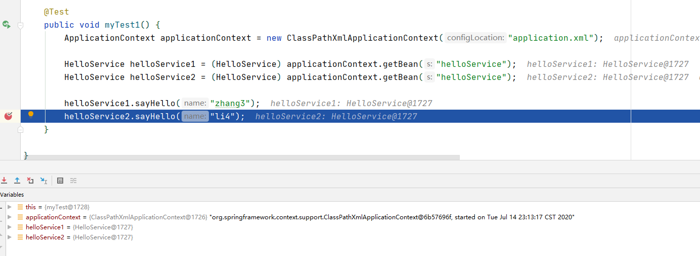

# 九、SSM 框架

## 目录

- [九、SSM 框架](#九ssm-框架)
  - [目录](#目录)
  - [1 设计模式](#1-设计模式)
    - [1.1 软件设计的原则](#11-软件设计的原则)
    - [1.2 单例](#12-单例)
    - [1.3 工厂](#13-工厂)
      - [1.3.1 简单工厂](#131-简单工厂)
      - [1.3.2 工厂方法](#132-工厂方法)
    - [1.4 代理](#14-代理)
      - [1.4.1 静态代理](#141-静态代理)
      - [1.4.2 动态代理](#142-动态代理)
    - [1.5 建造者](#15-建造者)
  - [2 Spring](#2-spring)
    - [2.1 概述](#21-概述)
    - [2.2 IOC/DI 入门案例](#22-iocdi-入门案例)
      - [2.2.1 案例 1](#221-案例-1)
      - [2.2.2 案例 2](#222-案例-2)
    - [2.3 Spring 核心 API](#23-spring-核心-api)
    - [2.4 xml 文件中注册 Bean 的方式](#24-xml-文件中注册-bean-的方式)
      - [2.4.1 构造方法](#241-构造方法)
      - [2.4.2 工厂](#242-工厂)
    - [2.5 生命周期](#25-生命周期)


## 1 设计模式

设计模式是一套被反复使用的、多数人知晓的、经过分类编目的、代码设计经验的总结。

### 1.1 软件设计的原则

设计模式的五个原则 solid：
- S（single）：单一职责原则。

- O（open）：开放封闭原则。对新增代码开放，对修改代码封闭。

- L（Liskov）：里氏替代原则。用父类来接收子类的实例。

- I（isolation）：接口隔离原则。不同的功能放到不同的接口中。

- D：依赖倒置原则。先定义要做的事情是什么样子，然后再进行具体的实现。

### 1.2 单例

单例：单一实例，全局只有一个。

特点：
- 构造方法私有。

- 包含自己的成员变量。

- 提供静态方法供人调用。 

使用场景：
- Servlet

- ServletContext

示例：
```java
/**
 * 线程不安全的懒加载
 */
public class Singleton {

    private Singleton(){}

    static Singleton singleton;

    public static Singleton getInstance(){

        if (singleton == null){
            singleton = new Singleton();
        }
        return singleton;
    }
}
```

```java
/**
 * 线程安全的懒加载
 */
public class Singleton2 {

    private Singleton2(){}

    static Singleton2 singleton2;

    public synchronized static Singleton2 getInstance(){

        if (singleton2 == null){
            singleton2 = new Singleton2();
        }
        return singleton2;
    }
}
```

懒加载和立即加载：
- 懒加载在调用 getInstance 方法时才初始化示例
- 立即加载在还未调用 getInstance 方法的时候就已经完成了实例的初始化。

```java
/**
 * 立即加载
 */
public class Singleton3 {

    private Singleton3(){}

    static Singleton3 singleton3 = new Singleton3();

    public static Singleton3 getInstance(){
        return singleton3;
    }
}
```

```java
/**
 * 立即加载
 * 这个是 singleton3 的一个变种
 */
public class Singleton4 {

    private Singleton4(){}

    static Singleton4 singleton4;

    // 静态代码块
    static {
        singleton4 = new Singleton4();
    }

    public static Singleton4 getInstance(){


        return singleton4;
    }
}
```

```java
/**
 * 静态内部类实现线程安全的懒加载
 * 将实例初始化的过程放在静态内部类中，当调用到静态内部类的方法的时候，静态内部类才加载
 */
public class Singleton5 {
    private Singleton5(){}

    static class Inner{
        static Singleton5 singleton5 = new Singleton5();

        public static Singleton5 provideSingleton5(){
            return singleton5;
        }
    }

    public static Singleton5 getInstance(){
        return Inner.provideSingleton5();
    }
}
```

### 1.3 工厂

在工厂模式中，我们在创建对象时不会对客户端暴露创建逻辑，并且是通过使用一个共同的接口来指向新创建的对象。
- 去生产实例，工厂要提供 create 方法。  

- 通过工厂可以把实例的实例化细节隐藏起来。  

注：XXXFactory 就是获得 xxx 实例。所有当看到类型是 XXXFactory 的时候，就要意识到这是一个工厂的设计模式。

#### 1.3.1 简单工厂

通过给工厂的生产方法传入不同的内容，工厂生产的内容就有所区别。

示例：
```java
public class AnimalFactory {

    // 提供一个返回值为 animal 的方法
    public Animal create(String name){
        Animal animal = null;

        if ("bull".equals(name)){
            animal = new Bull();
        } else if ("pig".equals(name)){
            animal = new Pig();
        } else if ("rabbit".equals(name)){
            animal = new Rabbit();
        } else if ("mouse".equals(name)){
            animal = new Mouse();
        }

        return animal;
    }
}
```

#### 1.3.2 工厂方法  

提供一个工厂接口，提供生产方法的规范。  

具体的工厂实现工厂接口，在具体的工厂中提供详细的生产方法。

**（1）实例工厂**  

先对工厂进行实例化，然后通过工厂对象来调用生产方法。当需要新的生产实例的时候，新增对应的工厂实例即可。

示例：
```java
// 工厂
public interface CarFactory {

    public Car createCar();
}
```

```java
// 工厂实例 1
public class AudiCarFactory implements CarFactory{
    @Override
    public Car createCar() {
        return new AudiCar();
    }
}
```

```java
// 工厂实例 2
public class BydCarFactory implements CarFactory{
    @Override
    public Car createCar() {
        return new BydCar();
    }
}
```

**（2）静态工厂**

提供静态方法获得实例的工厂，称为静态工厂。工厂中的方法是静态方法，可以直接调用。

示例：
```java
// 工厂
public interface CarFactory {

    public Car createCar();
}
```

```java
public class DreamOneCarFactory implements CarFactory{
    @Override
    public Car createCar() {
        return null;
    }

    public static Car staticFactoryCreate(){
        return new DreamOneCar();
    }
}
```

### 1.4 代理

代理：为某个对象提供一个代理对象以控制对这个对象的访问。

代理对象：中介。

代理类：负责为委托类预处理消息，过滤消息并转发消息，以及进行消息被委托类执行后的后续处理。

被代理对象（委托类）：业主。

代理的设计模式优点：可以在目标对象实现的基础上，增强额外的功能，扩展目标对象的功能。

#### 1.4.1 静态代理  

所谓静态代理，就是代理类是由程序员自己编写的，在编译期就确定好了的。 

**（1）委托类成员变量**  

示例：
```java
public class HouseOwner {

    public boolean rentHouse(Integer money){
        if (money >= 1500){
            return true;
        }
        return false;
    }
}
```

```java
// 代理类
public class HouseProxy {

    HouseOwner houseOwner = new HouseOwner();

    public boolean rentHouse(Integer money){
        money = money - 500;
        return houseOwner.rentHouse(money);
    }
}
```

**（2）代理类继承委托类**

```java
public class HouseProxy2 extends HouseOwner{

    public boolean rentHouse(Integer money){
        money = money - 500;
        return super.rentHouse(money);
    }
}
```

#### 1.4.2 动态代理

获得一个代理对象，通过代理对象调用的方法才是增强的方法。

Java 实现动态代理的大致步骤：
1. 定义一个委托类和公共接口。

2. 自己定义一个类（调用处理器类，即实现 InvocationHandler 接口），这个类的目的是指定运行时将生成的代理类需要完成的具体任务（包括 Preprocess 和 Postprocess），即代理类调用任何方法都会经过这个调用处理器类。

3. 生成代理对象（当然也会生成代理类），需要为他指定委托对象、实现的一系列接口和调用处理器类的实例。因此可以看出一个代理对象对应一个委托对象，对应一个调用处理器实例。

**（1）JDK 动态代理**

JDK 动态代理：java.lang.reflect 包中的 Proxy 类和 InvocationHandler 接口提供了生成动态代理类的能力。

JDK 动态代理使用要有接口的实现，并且要用接口来接收。

示例：
```java
// 接口
public interface HelloService {
    public void sayHello();
}
```

```java
public class HelloServiceImpl implements HelloService{
    @Override
    public void sayHello() {
        System.out.println("hello world");
    }
}
```

```java
// 动态代理
public class ProxyTest {

    @Test
    public void mytest(){
        // 先获得委托类对象的实例
        HelloService helloService = new HelloServiceImpl();
        
        // jdk 动态代理获得增强对象（代理对象）
        HelloService helloServiceProxy = (HelloService) Proxy.newProxyInstance(HelloServiceImpl.class.getClassLoader(),
                helloService.getClass().getInterfaces(), new InvocationHandler() {

            @Override
            public Object invoke(Object proxy, Method method, Object[] args) throws Throwable {
                System.out.println("起床"); // 前面的增强

                Object invoke = method.invoke(helloService, args);
                
                System.out.println("编程"); // 后面的增强

                return invoke;
            }
        });

        // helloServiceProxy.sayHello(); // 使用代理对象去执行才会增强

        // helloService.sayHello(); // 只会输出hello world

    }
}
```
注：JDK 动态代理不能够使用实现类来接收代理对象。

**（2）cglib 动态代理**

cglib（Code Generation Library）动态代理：cglib 是一个第三方代码生成类库，运行时在内存中动态生成一个子类对象从而实现对目标对象功能的扩展。
- 不需要有接口的实现。  

- 基于继承去实现，proxy 对象是继承委托类对象。

- 可以用接口，也可以用实现类来接收。

- 代码写起来基本是一样，获得代理对象的过程使用 api 不同。

示例：
```java
/**
 * 用 cglib 单元测试使用
 * 这个类没有接口的实现
 */
public class HelloService2 {

    public void sayHello2(){
        System.out.println("hello world2");
        
        try {
            Thread.sleep(500);
        } catch (InterruptedException e) {
            e.printStackTrace();
        }
    }
}
```

```java
public class CglibProxyTest {

    /**
     * 计算 helloService2 中的方法的执行时间
     */
    @Test
    public void mytest1(){

        HelloService2 helloService2 = new HelloService2();
        
        // 第二个参数也是 InvocationHandler，和 jdk 动态代理的 InvocationHandler 不同，需要导包
        HelloService2 helloService2Proxy = (HelloService2) Enhancer.create(HelloService2.class, new InvocationHandler() {
            
            @Override
            public Object invoke(Object proxy, Method method, Object[] args) throws Throwable {
                long start = System.currentTimeMillis();
                
                Object invoke = method.invoke(helloService2, args);
                
                long end = System.currentTimeMillis();
                long cost = end - start;
                System.out.println(method.getName() + "执行时间是：" + cost);
                
                return invoke;
            }
        });
        helloService2Proxy.sayHello2();
    }
}
```

### 1.5 建造者

建造者（builder）也是生产实例，更侧重参数的设置。

·
```java
public class Foot {
    Integer size;

    public Integer getSize() {
        return size;
    }

    public void setSize(Integer size) {
        this.size = size;
    }

    @Override
    public String toString() {
        return "Foot{" +
                "size=" + size +
                '}';
    }
}
```

```java
public class Head {
    Integer iq;
    Integer eq;
    String name;

    public Integer getIq() {
        return iq;
    }

    public void setIq(Integer iq) {
        this.iq = iq;
    }

    public Integer getEq() {
        return eq;
    }

    public void setEq(Integer eq) {
        this.eq = eq;
    }

    public String getName() {
        return name;
    }

    public void setName(String name) {
        this.name = name;
    }

    @Override
    public String toString() {
        return "Head{" +
                "iq=" + iq +
                ", eq=" + eq +
                ", name='" + name + '\'' +
                '}';
    }
}
```

```java
public class Human {
    Foot foot = new Foot();
    Head head = new Head();
    Leg leg = new Leg();

    public Foot getFoot() {
        return foot;
    }

    public void setFoot(Foot foot) {
        this.foot = foot;
    }

    public Head getHead() {
        return head;
    }

    public void setHead(Head head) {
        this.head = head;
    }

    public Leg getLeg() {
        return leg;
    }

    public void setLeg(Leg leg) {
        this.leg = leg;
    }

    @Override
    public String toString() {
        return "Human{" +
                "foot=" + foot +
                ", head=" + head +
                ", leg=" + leg +
                '}';
    }
}
```

```java
public class Leg {

    Integer length;
    boolean strong;

    public Integer getLength() {
        return length;
    }

    public void setLength(Integer length) {
        this.length = length;
    }

    public boolean isStrong() {
        return strong;
    }

    public void setStrong(boolean strong) {
        this.strong = strong;
    }

    @Override
    public String toString() {
        return "Leg{" +
                "length=" + length +
                ", strong=" + strong +
                '}';
    }
}
```


```java
public class HumanBuilder {

    Human human = new Human(); // 保证了 new 一个 builder 的时候同时 new 了一个 human ，就是空白的 human

    public HumanBuilder setFootSize(Integer size){
        human.getFoot().setSize(size);
        return this;
    }

    // 需要保证都是同一个 head
    public HumanBuilder setHeadIq(Integer iq){
        human.getHead().setIq(iq);
        return this;
    }

    public HumanBuilder setHeadEq(Integer eq){
        human.getHead().setEq(eq);
        return this;
    }

    public HumanBuilder setHeadName(String name){
        human.getHead().setName(name);
        return this;
    }

    public HumanBuilder setLegLength(Integer length){
        human.getLeg().setLength(length);
        return this;
    }

    public HumanBuilder setLegStrong(boolean strong){
        human.getLeg().setStrong(strong);
        return this;
    }

    public Human build(){
        return human;
    }

    public Human getHuman() {
        return human;
    }

    public void setHuman(Human human) {
        this.human = human;
    }
}
```

```java
public class MyTest {

    @Test
    public void mytest(){
        HumanBuilder humanBuilder = new HumanBuilder();
        humanBuilder.setLegLength(120)
                    .setHeadIq(150)
                    .setHeadEq(150)
                    .setHeadName("zhang3")
                    .setFootSize(44)
                    .setLegStrong(true);

        Human human = humanBuilder.build();
        System.out.println(human);
    }
}
```


## 2 Spring

### 2.1 概述

Spring 是一个开源框架，它是于 2003 年兴起的一个轻量级的Java 开发框架，由 Rod Johnson 在其著作《Expert One-On-One J2EE Development and Design》中阐述的部分理念和原型衍生而来。  

它是为了解决企业应用开发的复杂性而创建的。框架的主要优势之一就是其分层架构，分层架构允许使用者选择使用哪一个组件，同时为 J2EE 应用程序开发提供集成的框架。  

Spring 是一个分层的 Java SE/EE full-stack（一站式）轻量级开源框架。

Spring 核心：IOC、DI 和 AOP。

IOC（Inverse of Controll）：控制反转。
- 控制：实例的生成权。

- 反转：由应用程序反转给 Spring。

- 容器：容器是放置实例对象的地方。

DI（Dependency Injection）：依赖注入。
- 依赖：应用程序依赖 Spring 容器，因为 Spring 容器包含了应用程序必须的内容。

- 注入：Spring 容器给应用程序注入应用程序运行所必须的资源。

AOP（Aspect Oriented Programming）：面向切面编程。
OOP（Object Oriented Programming）：面向对象编程。

Spring 优点：
- 方便解耦，简化开发（高内聚低耦合）。  
  Spring 就是一个大工厂（容器），可以将所有对象创建和依赖关系维护，交给 Spring 管理。  
  
  Spring 工厂是用于生成 Bean。

- AOP 编程的支持。  
  Spring 提供面向切面编程，可以方便的实现对程序进行权限拦截、运行监控等功能

- 声明式事务的支持。  
  只需要通过配置就可以完成对事务的管理，而无需手动编程。

- 方便程序的测试。  
  Spring 对 Junit4 支持，可以通过注解方便的测试 Spring 程序。

- 方便集成各种优秀框架。  
  Spring 不排斥各种优秀的开源框架，其内部提供了对各种优秀框架（如：Struts、Hibernate、MyBatis、等）的直接支持。

- 降低 JavaEE API 的使用难度。  
  Spring 对 JavaEE 开发中非常难用的一些 API（如：JDBC、JavaMail、远程调用等），都提供了封装，使这些API应用难度大大降低。

Spring Framework：  
<div align="center">

</div>


### 2.2 IOC/DI 入门案例

#### 2.2.1 案例 1

**第一步**：导包。  

Spring 核心依赖 5 + 1：spring-core、spring-context、spring-aop、spring-beans、spring-expression 和 commons-logging（jcl）。

Maven 项目导入依赖：
```xml
<!--Spring 的 5+1-->
<!--利用 Maven 特性：当你导入一个依赖的时候，Maven 会导入他所关联的依赖-->
<dependency>
    <groupId>org.springframework</groupId>
    <artifactId>spring-context</artifactId>
    <version>5.2.6.RELEASE</version>
</dependency>
```

**第二步**：定义一个 service。

```java
public class HelloService {

    public void sayHello(String name){
        System.out.println("hello " + name);
    }
}
```

**第三步**：创建 Spring 容器。

通过 Spring 配置文件来管理，配置文件通常名字叫 `application(-xx).xml`。  

既然是 xml 文件，文件要满足一定的约束（schema）。约束怎么来？
- 复制已有的配置文件的约束。

- 从 Spring 的 [参考文档](https://docs.spring.io/spring/docs/5.2.7.RELEASE/spring-framework-reference/core.html) 上的 appendix 上复制。 

- 通过创建文件模板来使用（推荐，效率高）。

**第四步**：将组件交给 Spring 管理。

组件：交给 Spring 容器管理的实例，称之为组件。

在 Spring 的配置文件中定义实例：
```xml
<!--组件注册-->
<bean id="helloService" class="com.gyh.service.HelloService"/>
```

**第五步**：从容器中取出实例进行使用。

```java
@Test
public void myTest1() {
    ApplicationContext applicationContext = new ClassPathXmlApplicationContext("application.xml");

    HelloService helloService1 = (HelloService) applicationContext.getBean("helloService");
    HelloService helloService2 = (HelloService) applicationContext.getBean("helloService");

    helloService1.sayHello("zhang3");
    helloService1.sayHello("li4");
}
```

组件在容器中默认以单例的形式存在。  
<div align="center">

</div>


#### 2.2.2 案例 2

**第一步**：导包。

第二步：构建业务代码。

```java
public class HelloServiceImpl implements HelloService{

    HelloDao helloDao;

    @Override
    public void sayHello(String name) {
        helloDao.daoSayHello(name);
    }

    public String sayHello2(String name){
        return "hello " + name;
    }

    public HelloDao getHelloDao() {
        return helloDao;
    }

    public void setHelloDao(HelloDao helloDao) {
        this.helloDao = helloDao;
    }
}
```

```java
public class HelloDaoImpl implements HelloDao{
    @Override
    public void daoSayHello(String name) {
        System.out.println("hello " + name);
    }
}
```

**第三步**：注册组件并维护组件之间的依赖关系。

```xml
<!--组件注册中 class 不能写接口-->
<bean id="helloDao" class="com.gyh.dao.HelloDaoImpl"/>

<bean id="helloService" class="com.gyh.service.HelloServiceImpl">
    <!--方式 1-->
    <property name="helloDao" ref="helloDao"/>
    
<!--    方式 2-->
<!--    <property name="helloDao">-->
<!--        <ref bean="helloDao"/>-->
<!--    </property>-->
    
<!--    方式 3，相当于重新定义了一个局部组件-->
<!--    <property name="helloDao">-->
<!--        <bean class="com.gyh.dao.HelloDaoImpl"/>-->
<!--    </property>-->
</bean>
```

**第四步**：使用。

```java
@Test
public void myTest1() {
    ApplicationContext applicationContext = new ClassPathXmlApplicationContext("application.xml");

    HelloService helloService = (HelloService) applicationContext.getBean("helloService");
    helloService.sayHello("zhang3");
    HelloDao helloDao = applicationContext.getBean(HelloDao.class);
    System.out.println(helloDao);
}
```

容器中的组件是引用关系，并没有重新创建。  
<div align="center">

</div>


案例总结：
- 控制反转 IoC（Inversion of Control），是一种设计思想，DI（依赖注入）是实现 IoC 的一种方法。

- 依赖注入的目的并非为软件系统带来更多功能，而是为了提升组件重用的频率，并为系统搭建一个灵活、可扩展的平台。

### 2.3 Spring 核心 API

ClassPathXmlApplicationContext：加载 classpath 目录下的配置文件。

FileSystemXmlApplicationContext：加载文件系统目录下的配置文件。

<div align="center">

</div>

BeanFactory：容器中所有的组件都是通过这个 Bean 生产出来的。

<div align="center">

</div>

### 2.4 xml 文件中注册 Bean 的方式

#### 2.4.1 构造方法

默认提供的是无参构造，这个是最常用。

无参构造要通过 property 标签调用 set 方法给成员变量赋值。  

示例：
```java
// 无参构造方法
@Data
@NoArgsConstructor
public class NoArgsConstructorBean {
    String name;
    Integer id;
}
```

```xml
<bean id="noArgsBean" class="com.gyh.component.NoArgsConstructorBean">
    <!--可以使用 value 属性或者 value 标签-->
    <property name="id" value="1"/>

    <property name="name">
        <value>zhang3</value>
    </property>
</bean>
```

有参构造，要通过 constructor-arg 子标签来调用有参构造方法。  

示例：
```java
// 有参构造方法
@Data
@AllArgsConstructor // 写了有参构造方法，会将默认的无参构造方法覆盖掉
public class HasArgsConstructorBean {
    String name;
    Integer id;
}
```

```xml
<bean id="hasArgsBean" class="com.gyh.component.HasArgsConstructorBean">
    <constructor-arg name="id" value="2"/>
    <constructor-arg name="name" value="ligenli"/>
</bean>
```

#### 2.4.2 工厂

通常是整合已有代码的时候，可以使用工厂注册组件。

**（1）静态工厂**

`factory-method` 对应的是静态工厂中的静态方法。

示例：
```xml
<bean id="animalFromStaticFactory" class="com.gyh.factory.StaticFactory" factory-method="create"/>
```

**（2）实例工厂**  

示例：
```xml
<bean id="instanceFactory" class="com.gyh.factory.InstanceFactory"/>

<bean id="animalFromInstanceFactory" factory-bean="instanceFactory" factory-method="create"/>
```

### 2.5 生命周期

Spring 容器中 Bean 的生命周期：
1. Bean 的建立。  
   由 BeanFactory 读取 Bean 定义文件，并生成各个实例。

2. Setter 注入。  
   执行 Bean 的属性依赖注入。

3. BeanNameAware 的 `setBeanName()`。  
   如果 Bean 类实现了 org.springframework.beans.factory.BeanNameAware 接口，则执行其 `setBeanName()` 方法。

4. BeanFactoryAware 的 `setBeanFactory()`。  
   如果 Bean 类实现了 org.springframework.beans.factory.BeanFactoryAware 接口，则执行其 `setBeanFactory()` 方法。

5. BeanPostProcessor 的 `processBeforeInitialization()`。  
   容器中如果有实现 org.springframework.beans.factory.BeanPostProcessor 接口的实例，则任何 Bean 在初始化之前都会执行这个实例的`processBeforeInitialization()` 方法。  

6. InitializingBean 的 `afterPropertiesSet()`。  
   如果 Bean 类实现了 org.springframework.beans.factory.InitializingBean 接口，则执行其 `afterPropertiesSet()` 方法。

7. Bean 定义文件中定义 init-method。  
   在 Bean 定义文件中使用 init-method 属性设定方法名称，这时会执行 `initMethod()` 方法（注：这个方法是不带参数的）。

8. BeanPostProcessor 的 `processAfterInitialization()`。
   容器中如果有实现 org.springframework.beans.factory.BeanPostProcessors 接口的实例，则任何 Bean 在初始化之前都会执行这个实例的 `processAfterInitialization()` 方法。

9. DisposableBean 的 `destroy()`。  
    在容器关闭时，如果 Bean 类实现了 org.springframework.beans.factory.DisposableBean 接口，则执行它的 `destroy()` 方法。

10. Bean 定义文件中定义 destroy-method。  
    在容器关闭时，可以在 Bean 定义文件中使用 destory-method 定义的方法。

流程图：
<div align="center">

</div>


