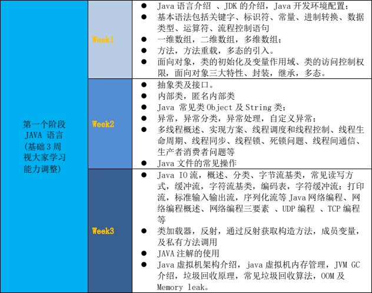
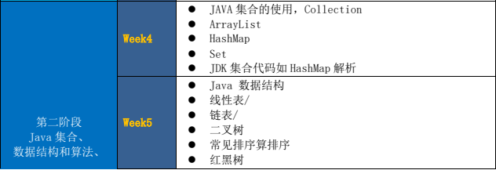
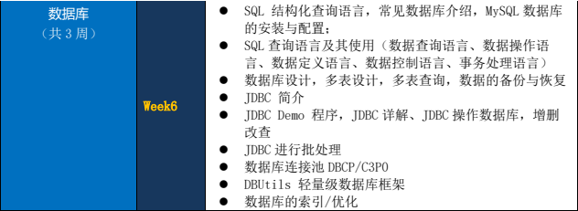
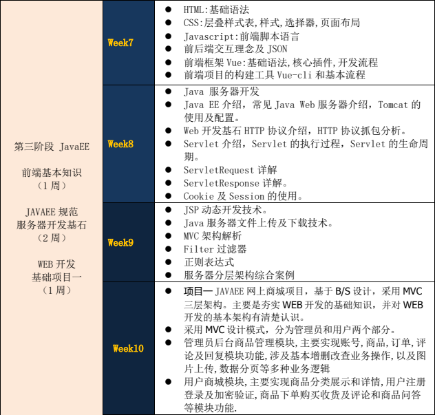
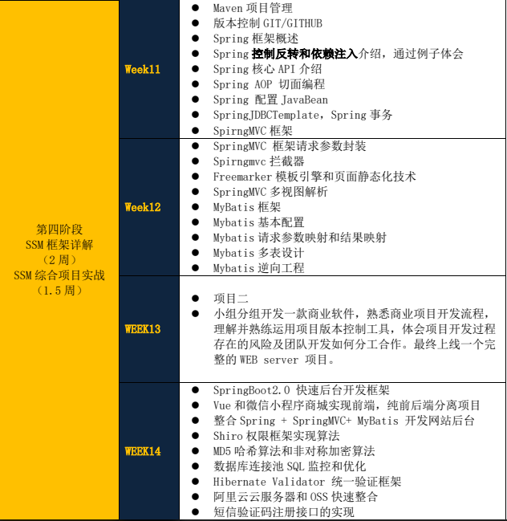
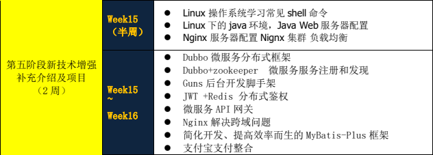
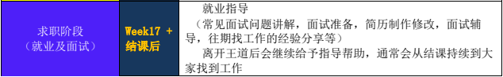

# 王道训练营

## 前言

记录本人在王道训练营 22th Java 班的学习过程。对底层知识点不做详细赘述，适合 CS 专业同学或者有编程基础的跨专业同学借鉴学习。   

笔记内容按照课程安排进行分章，比如 week1 代表课程安排中 week1 的所有内容，并非第一周的学习内容（week1 实际学习了两周）。

笔记内容除个人总结、王道课件外，还摘抄一些优秀资料，包括《第一行代码Java》、《Java核心技术第10版 卷Ⅰ》等。

文档格式参考 <a href = "https://github.com/sparanoid/chinese-copywriting-guidelines">中文文档排版指北</a> 和 <a href = "https://github.com/ruanyf/document-style-guide">中文技术文档的写作规范（阮一峰）</a> 。  

## 目录

- [前言](#前言)

- [目录](#目录)

- [课程安排](#课程安排)

- [笔记](#笔记)

## 课程安排

### 第一个阶段

JAVA 语言基础 3 周（视大家学习能力调整)。  

 
 

  
### 第二个阶段

Java 集合、数据结构和算法、数据库（共 3 周）。 

 
 
 

    

### 第三个阶段

前端基本知识（1 周），JAVA EE 规范、服务器开发基石（2 周），WEB 开发基础项目一（1 周）。

 
 

  

### 第四个阶段

SSM 框架详解（2 周），SSM 综合项目实战（1.5 周）。

 
 

 

### 第五个阶段

段新技术增强补充介绍及项目（2 周）。

 
 
 

     

### 第六个阶段

求职阶段（就业及面试）  

 
 

 

PS：本课程安排可能会根据上课进度在顺序或内容上做部分调整，请知悉！

## 笔记

### 第一阶段

[week1](./week1)  

[week2](./week2)