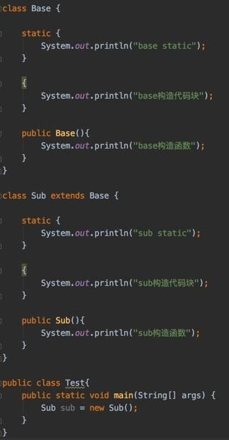

# Day11 JavaObject02
1. 将人，学生和老师（老师多了教工编号和讲课的行为）案例用继承实现，并添加军人类，军人的特殊属性假设有部队编号，军人特有的行为假设有训练。

2.
- 声明一个 Person 类，里面定义了三个属性，name、gender、age（姓名、性别、年龄），通过构造方法进行赋值。有一个方法可以展示对应的姓名性别年龄信息

- 声明一个 Student 类，继承自 Person 类，增加一个独特的属性 id（学号），通过构造方法进行赋值，同时有一个方法可以展示姓名性别年龄学号信息。

- 声明一个 Teacher 类，继承自 Person 类，增加 course 属性（教学课程），通过构造方法进行赋值。有一个方法可以显示姓名性别年龄教学课程信息。

- 编写一个测试类，验证你的代码。（分别创建 Student 对象，和 Teacher 对象，要求利用子类对象的显示初始化，即在子类构造方法中，调用父类构造方法的方式来初始化子类对象。）

3. 分别写出如下两幅图片中所示代码的输出  
  


答：
3. 
图 1：  
```
base static
sub static
base构造代码块
base构造函数
sub构造代码块
sub构造函数
```

图 2：  
```
obj2
obj1
obj2
obj3
```