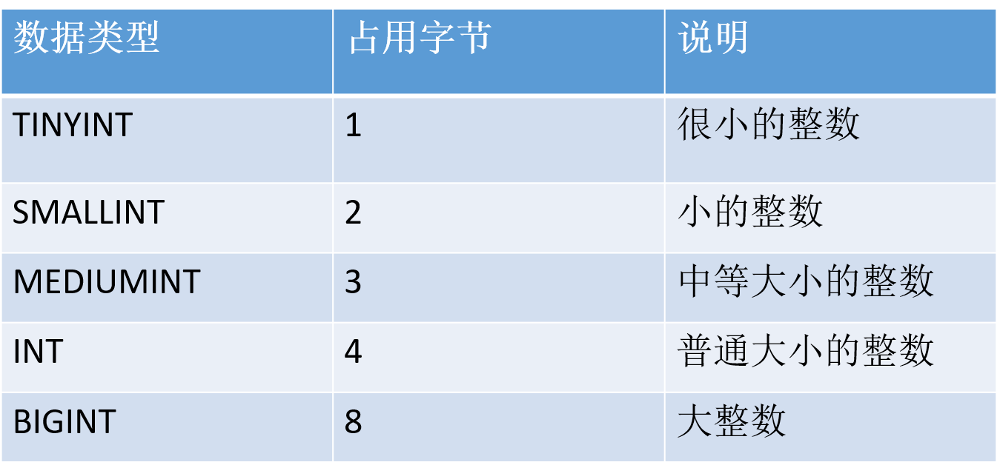
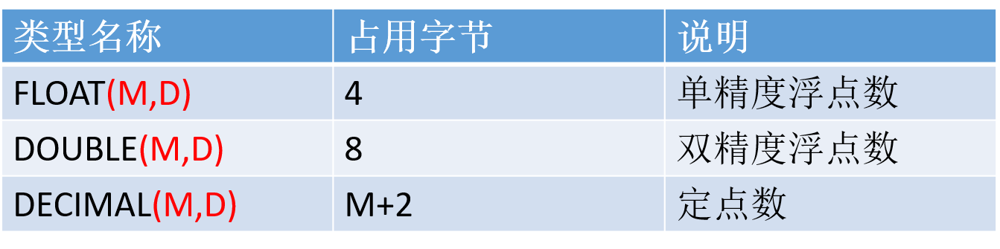

# 数据库

## 目录

- [数据库基础](#数据库基础)

- [MySQL](#mysql)
  - [MySQL安装与配置](#mysql安装与配置)
  - [登录 MySQL Server](#登录-mysql-server)
  - [数据库的备份和恢复](#数据库的备份和恢复)

- [SQL](#sql)
  - [DDL管理数据库](#ddl管理数据库)
  - [数据类型](#数据类型)
  - [DDL管理表](#ddl管理表)
  - [DML数据操纵语言](#dml数据操纵语言)
  - [常用运算符](#常用运算符)
  - [DQL数据查询语言](#dql数据查询语言)
  - [约束](#约束)
  - [数据库范式设计](#数据库范式设计)


## 数据库基础

维基百科数据库定义：  
> A database is an organized collection of data, stored and accessed electronically.  

分类：
- 关系型数据库。  
  不仅存储数据本身，还存储数据之间的关系，比如说用户信息和订单信息。关系型数据库模型把复杂的数据结构归结为简单的二维表（关系表）。

- 非关系型数据库。  
  非关系型数据库也被称为 NoSQL 数据库。NoSQL 的产生并不是要否定关系型数据库，而是作为关系型数据库的一个有效补充。

易混淆术语：
- 数据库系统（DBS）：是指在计算机系统中引入数据库后的系统，一般由数据库、数据库管理系统、应用系统、数据库管理员（DBA）构成。 

- 数据库管理系统（DBMS）：是一种操纵和管理数据库的大型软件，用于建立、使用和维护数据库（如：MySQL）。 

- 数据库（DB）：数据库是按照数据结构来组织、存储和管理数据的仓库。

注：我们通常用数据库这个术语来代表 DBMS，严格来说这是不正确的，容易产生混淆。

数据库管理系统、数据库服务、数据库和表的关系（C/S 架构）：  
<div align="center">

</div>

数据在表中的形式：  
<div align="center">

</div>  

- 表的一行称之为一条记录（数据）。

- 表中一条记录对应一个 Java 对象的数据。  
  - 对象与行对应。  
  - 属性与列对应。


## MySQL

### MySQL安装与配置

具体步骤查看 PDF 文件：<a href="./file/MySQL安装与配置.pdf" download="MySQL安装与配置"> MySQL 安装与配置 </a>。

### 登录 MySQL Server

在启动 MySQL 服务后，输入以下格式的命令：
```
mysql -h 主机名 -u 用户名 –p
```
- `-h`：该参数用于指定客户端的主机名（host），即哪台机器要登录 MySQL Server。  
  如果是当前机器该参数可以省略。

- `-u`：用户名（user）。

- `-p`：密码（password），如果密码为空，该参数可以省略。

示例：
```
mysql -u root -p
```

### 数据库的备份和恢复

#### 1. 备份  

在命令行中：
```
mysqldump -u $user -p $db_name > file
```

#### 2. 恢复

**（1）方式一**   

在命令行中：  
```
mysql -u $user -p $db_name < file
```

**（2）方式二**  

命令行登录 mysql 服务, 先进入数据库，然后执行 `source file`。  

注：后面不要加分号


## SQL

SQL 是结构化查询语言（Structured Query Language）的缩写。它是一种专门用来与关系型数据库沟通的语言。

SQL 语言的优点：  
- 通用。  
  几乎所有的关系型数据库都支持 SQL。

- 简单易学。  
  它的语句是由一些有很强描述性的关键词组织而成，
而且这些关键词并不多。

- 简单且强有力。  
  灵活地使用 SQL，可以进行非常复杂的数据库操作。 

- 半衰期很长。

SQL 不区分大小写。  
注：  
- 虽然 SQL 不区分大小写，但是表名、列名和值**可能**区分！（这依赖具体的 DBMS 及其配置）。  

- SQL 不区分大小写主要是指关键字不区分大小写。

建议：  
- 关键字大写。
  
- 表名、列名和值最好是以它定义时为准。

> 标准 SQL 是由 ANSI 标准委员会管理的，从而称为 ANSI SQL。许多 DBMS 厂商通过增加语句或指令，对 SQL 进行了扩展，目的是提供一些特定的操作，或者是简化某些操作。虽然这种扩展很有必要，但同时也给 SQL 代码的移植带来了麻烦。   
> 即使 DBMS 有自己的扩展，但它们都支持 ANSI SQL。

SQL 组成：
- DDL：数据定义语言。

- DML：数据操作语言（增、删、改）。

- DQL：数据查询语言（查）。

- DCL：数据控制语言。

- TPL：事务处理语言。

- …

### DDL管理数据库

数据定义语言 DDL（Data Definition Language）。
- 作用：创建 & 管理数据库和表的结构。

- 常用关键字：CREATE、ALTER 和 DROP。

#### 1. 创建数据库

```sql
CREATE DATABASE [IF NOT EXISTS] db_name [create_specification [ create_specification] ...];
```

create_specification：
- `CHARACTER SET charset_name`：指定字符集，如 utf8。

- `COLLATE collation_name`：指定数据库字符集的比较方式。  
  
  比较规则有时也称为排序规则，用于在字符串比较大小时规定其顺序的。同一种字符集可以有多种比较规则。

  比较规则名称以对应的字符集名称开头，中间部分表示主要用于哪种语言，常见后缀有以下几种：
  - `_bin`：以二进制方式比较。即 A < a。

  - `_ci`：不区分大小写。即 A = a。  
  
  默认 `_ci`。

  示例：
  ```sql
  # 创建一个名称为 mydb1 的数据库。
  create database mydb1;

  # 创建一个使用 gbk 字符集的 mydb2 数据库。
  create database if not exists mydb2 character set gbk;

  # 创建一个使用 gbk 字符集，并带校对规则（gbk_bin）的 mydb3 数据库。
  create database mydb3 character set gbk collate gbk_bin;
  ```

#### 2. 查看、删除数据库

显示数据库：
```sql
SHOW DATABASES;
```

显示数据库创建语句：
```sql
SHOW CREATE DATABASE db_name;
```
 
数据库删除语句：
```sql
DROP DATABASE [IF EXISTS] db_name;
```

#### 3. 修改数据库

```sql
ALTER  DATABASE db_name [alter_specification [, alter_specification] ...];
```

alter_specification：    
- `CHARACTER SET charset_name`。

- `COLLATE collation_name`。

示例：
```sql
# 把 mydb2 的字符集修改为 utf8
alter database mydb2 character set utf8;
```

### 数据类型

注：这里以 MySQL 为例，不同的 DBMS 都支持数值类型、字符串类型以及日期类型，但他们的实现可能不一样。

#### 1. 整数类型

| 数据类型 | 占用字节 | 说明 |
| :- | :- | :- |
| TINYINT | 1 | 很小的整数 |
| SMALLINT | 2 | 小的整数 |
| MEDIUMINT | 3 | 中等大小的整数 |
| INT | 4 | 普通大小的整数 |
| BIGINT | 8 | 大整数 |


#### 2. 浮点数类型和定点数类型

| 数据类型 | 占用字节 | 说明 |
| :- | :- | :- |
| FLOAT(M, D) | 4 | 单精度浮点数 |
| DOUBLE(M, D) | 8 | 双精度浮点数 |
| DECIMAL(M, D) | M + 2 | 定点数 |


- M 称为精度，表示总共的位数; 

- D 称为标度，表示小数的位数。

- DECIMAL 类型不同于 FLOAT & DOUBLE，DECIMAL 实际是以字符串存放的，它的存储空间并不固定，而是由精度 M 决定的。

#### 3. 日期与时间类型

| 数据类型 | 日期格式 | 占用字节 |
| :- | :- | :- |
| YEAR | YYYY | 1 |
| TIME | HH:MM:SS | 3 |
| DATE | YYYY-MM-DD | 3 |
| DATETIME | YYYY-MM-DD HH:MM:SS | 8 |
| TIMESTAMP | YYYY-MM-DD HH:MM:SS | 4 |

DATETIME 和 TIMESTAMP 虽然显示的格式是一样的，但是它们有很大的区别：
- DATETIME 的系统默认值是 NULL, 而 TIMESTAMP 的系统默认值是当前时间 `NOW()`;

- DATETIME 存储的时间与时区无关，而 TIMESTAMP 与时区有关。

#### 4. 字符串类型

| 数据类型 | 占用字节 | 说明 |
| :- | :- | :- |
| CHAR(M) | M , 1 <= M <= 255 | 固定长度字符串 |
| VARCHAR(M) | L + 1, L <= M, 1 <= M <= 255 | 变长字符串 |
| TINYTEXT | L + 1, L < 2 ^ 8 | 非常小的文本字符串 |
| TEXT | L + 2, L < 2 ^ 16 | 小的文本字符串 |
| MEDIUMTEXT | L + 3, L < 2 ^ 24 | 中等大小的文本字符串 |
| LONGTEXT | L + 4, L < 2 ^ 32 | 大的文本字符串 |
| ENUM | 1 或者 2 个字节，取决于枚举的数目，最大 65535 个 | 枚举类型 |
| SET | 1, 2, 3, 4 或 8 个字节 | 集合类型 |

ENUM 类型总有一个默认值，当 ENUM 列声明为 NULL，则默认值为 NULL。如果 ENUM 列被声明为 NOT NULL，则其默认值为列表的第一个元素。

#### 5. 二进制类型

| 数据类型 | 占用字节 | 说明 |
| :- | :- | :- |
| BIT(M) | [(M + 7) / 8] | 位字节类型 |
| BINARY(M) | M | 固定长度的二进制数据 |
| VARBINARY(M) | L + 1 | 可变长度的二进制数据 |
| TINYBLOB(M) | L + 1, L < 2 ^ 8 | 非常小的 BLOB |
| BLOB(M) | L + 2, L < 2 ^ 16 | 小的 BLOB |
| MEDIUMBLOB(M) | L + 3, L < 2 ^ 24 | 中等大小的 BLOB |
| LONGBLOB(M) | L + 4, L < 2 ^ 32 | 非常大的 BLOB |


字符串类型存储的字符串（字符），二进制类型存储的是二进制数据（字节）。

### DDL管理表

#### 1. 创建表

```sql
CREATE TABLE table_name
(
	field1  datatype,
	field2  datatype,
	field3  datatype
)[CHARACTER SET 字符集 COLLATE 校对规则];
```
- field：指定列名。

- datatype：指定列类型。

注：
- 创建表前，要先使用 `USE db_name` 语句使用库。  

- 创建表时，要根据需保存的数据创建相应的列，并根据数据的类型定义相应的列类型。

示例：
```sql
# 在数据库 mydb1 中 创建 user 表
use mydb1;

create table t_user (
	id int,
    name varchar(255),
    password varchar(20),
    birthday date
);
```

#### 2. 查询表

简单描述表结构：
```sql
DESC 表名;

# 或者
DESCRIBE 表名;
```


查看数据库中所有的表：
```sql
SHOW TABLES;
```


查看生成表的 DDL 语句：
```sql
SHOW CREATE TABLE 表名;
```

#### 3. 修改表

使用 `ALTER TABLE` 语句追加、修改或删除列的语法。  

**（1）追加列**  

```sql
ALTER TABLE table_name ADD (column datatype [DEFAULT expr] [, ADD column datatype]...);
```

示例：
```sql
# 添加 gender 列
alter table t_user add column gender varchar(10);

# 在 password 后面添加 balance 列
alter table t_user add column balance int after password;

# 在最前面添加 no 列
alter table t_user add column no int first;

# 添加 a, b 列 
alter table t_user add column a int, add column b int;
```

**（2）修改列**  

```sql
ALTER TABLE table_name change col_name new_col_name datatype [DEFAULT expr] [, change col_name new_col_name datatype [DEFAULT ...] ]...;
```
示例：
```sql
# 把 balance 的名字改成 salary
alter table t_user change column balance salary int;
```

**（3）修改 列定义**  

```sql
ALTER TABLE table_name MODIFY column datatype [DEFAULT expr] [,MODIFY column datatype]...;
```
示例：
```sql
# 把 salary 的类型改成 decimal(10,2)
alter table t_user modify column salary decimal(10,2);
```

**（4）删除列**  

```sql
ALTER TABLE table_name DROP column col_name;
```

示例：
```sql
# 删除 a 列
alter table t_user drop column a;
```

注：多个修改的操作可以同时在同一 `ALTER TABLE` 语句后。  
示例：
```sql
# 删除 b 列, 把 gender 的类型改成 bit(1), 在 name 的后面添加 c 列
alter table t_user drop column b, modify column gender bit(1), add column c int after name;
```

**（5）修改表名**  

```sql
RENAME TABLE 表名 TO 新表名
```  
  
RENAME TABLE 语句的另一个用法是移动该表到另一个数据库：
```sql
RENAME TABLE 旧数据库名.旧表名 TO 新数据库名.新表名
```  

**（6）修改表的字符集**  

```sql
alter table student character set utf8;
```

#### 4. 删除表

```sql
DROP TALBE 表名
```


### DML数据操纵语言

DML：Data Manipulation Language。  
作用：用于向数据库表中插入、删除和修改数据。  
常用关键字：INSERT、UPDATE 和 DELETE。

#### 1. INSERT

使用 INSERT 语句向表中插入数据：  
```sql
INSERT INTO	table [(column [, column...])] VALUES (value [, value...]);
```

- 插入的数据应与字段的数据类型相同。

- 数据的大小应在列的规定范围内。例如：不能将一个长度为 80 的字符串加入到长度为 40 的列中。

- 字符串和日期型数据应包含在单引号中。

示例：
```sql
create table t_user (
    id int,
    name varchar(20),
    age int,
    gender enum('male', 'female')
);

# 插入所有数据类型可以省略 column 
insert into t_user values (1, 'thomas_he', 18, 'male');

# 数据的插入顺序和定义表时的顺序无关
insert into t_user (name, id) values ('茜茜', 2);

# 可以同时插入多条数据
insert into t_user (id, name, age) 
values (3, '张三', 30),
    (4, '李四', 40);

create table user (
    id int,
    name varchar(20),
    age int,
    gender enum('male', 'female')
);

# 可以直接插入表
insert into user (select * from t_user);
```


#### 2. UPDATE

使用 UPDATE 语句修改表中数据：  
```sql
UPDATE 	tbl_name    
SET col_name1=expr1 [, col_name2=expr2 ...]    
[WHERE where_definition];
```

- UPDATE 语法可以用新值更新原有表行中的各列。

- SET 子句指示要修改哪些列和要给予哪些值。

- WHERE 子句指定应更新哪些行。如没有 WHERE 子句，则更新所有的行。

示例：
```sql
# 把 t_user 表中所有人的年龄改为 18
update t_user 
set age=18;

# 把名字为茜茜的用户的年龄改为 16, 性别改成 female
update t_user 
set age=16, gender='female' 
where name='茜茜';
```

#### 3. DELETE

使用 DELETE 语句删除表中数据：  
```sql
delete from table_name       
[WHERE where_definition]
```

- DELETE 语句不能删除某一列的值，删除的单位是行。

- 使用 DELETE 语句仅删除记录，不删除表本身。即，删除全部记录后表依然存在，为一个空表。  
  如要删除表，使用 DROP TABLE 语句。

示例：
```sql
# 删除名字为张三的记录
delete from t_user 
where name='张三';

# 清空 t_user 表中的所有记录
delete from t_user;
```

### 常用运算符

#### 1. 算术运算符

| 运算符 | 作用 |
| :- | :- |
| + | 基本运算，下同 |
| - | |
| * | |
| / | |
| % | |

#### 2. 比较运算符

| 运算符 | 作用 |
| :- | :- |
| = | 相等 |
| <=> | 安全的等于 |
| <>(!=) | 不等于 |
| <= / >= | 小于等于 / 大于等于 |
| < / > | 小于 / 大于 |
| IS NULL | 是否为 NULL |
| IS NOT NULL | 是否不为 NULL |
| BETWEEN AND | 是否在闭区间内 |
| IN | 是否在列表内 |
| NOT IN | 是否不在列表内 |
| LIKE | 通配符匹配 |

like 与通配符搭配使用, 进行模糊查询。
- `%`：匹配任何数目的字符，甚至包括零个字符。

- `_`: 匹配一个字符。

注：不同的 DBMS，通配符可能不一样, 比如 SQL Server 是 `*` 匹配所有字符，`?` 匹配一个字符。


#### 3. 逻辑运算符

| 运算符 | 作用 |
| :- | :- |
| NOT(!) | 非 |
| AND(&&) | 与 |
| OR(\|\|) | 或 |  

#### 4. 位操作运算符

| 运算符 | 作用 |
| :- | :- |
| & | 位与 |
| \| | 位或 |
| ~ | 位非 | 
| ^ | 位异或 | 
| << | 位左移 |
| >> | 位右移 |


### DQL数据查询语言

DQL：Data Query Language。  
作用：查询表中的数据。  
关键字：SELECT。

以下示例以 <a href="./file/heros.sql" download="heros.sql"> heros 表 </a> 为例。 

#### 1. 计算表达式和函数的值

虽然 SELECT 语句通常用于从表中检索数据，但我们也可以用它计算表达式和函数的值。  
示例：
```sql
# 计算表达式 3 * 2 的值 
SELECT 3*2;

# 查看当前的时间 
SELECT NOW();

# 修剪字符串 ' ab cd ' 左右两边的空白
SELECT TRIM(' ab cd ');

# 拼接字符串 'ab' 和 'cd'
SELECT CONCAT('ab', 'cd');
```

#### 2. 查询表中的字段

查询单个字段的值。  
示例：
```sql
# 查询 heros 表中所有英雄的名字
select name from heros;

# 查询 heors 表中所有辅助角色定位
select role_assist from heros;
```

查询多个字段的值，多个字段之间用 `,` 分隔。  
示例：  
```sql
# 查询 heros 表中所有英雄的名字，最大生命值，最大法力值以及主要角色定位。
select name, hp_max, mp_max, role_main from heros;
```

查询所有字段，还可以用 `*` 代指所有字段。
```sql
# 查询 heros 表中所有数据。
select * from heros;
```

注：在生产环境中，尽量不要使用 `*` 通配符。因为查询不必要的数据会降低查询和应用程序的
效率！

#### 3. 使用 WHERE 子句过滤记录

`WHERE` 子句后面接逻辑表达式。如果逻辑表达式的结果为真，这条记录就会添加到结果集中，否则就
不会添加到结果集。  
示例：
```sql
# 返回空表
select * from heros where 0;

# 查询 heros 表中所有数据
select * from heros where 1;

# 查询 heros 中，name='花木兰' 的数据
select * from heros where name='花木兰';
```

#### 4. 给字段起别名

`AS` 可以给字段起别名。  
示例：
```sql
SELECT name, hp_max AS hp, mp_max AS mp FROM heros;

# 省略 AS
SELECT name, hp_max hp, mp_max mp FROM heros;
```
注：
- AS 关键字可以省略，但是不推荐这样做。

- AS 关键字不仅仅可以给字段起别名，还可以给表起别名。

#### 5. 去除重复行

`DISTINCT` 可以对查询结果去重。  
示例：
```sql
# 查询主要角色定位有哪些
select role_main from heros;

# 去重查询主要角色定位
select distinct role_main from heros;

# 去重查询主要角色定位和辅助角色定位
select distinct role_main, role_assist from heros;
```

注：
- DISTINCT 关键字必须放在所有查询字段的前面。

- DISTINCT 是对所有查询字段的组合进行去重，也就是说每个字段都相同，才认为两条记录是相同。

#### 6. 排序

`ORDER BY` 可以对结果集进行排序。`ASC` 表示升序，`DESC` 表示降序，默认情况为升序。  
示例：
```sql
# 查询所有英雄，并按最大生命值从大到小排序
select name, hp_max from heros order by hp_max asc;
```

还可以对多个字段进行排序。即先按照第一个字段排序，当第一个字段相同时，再按照第二个字段排序，依此类推。  
示例：
```sql
# 查询所有英雄，先按最大生命值降序排序，再按照最大法力值升序排序
select name, hp_max, mp_max from heros order by hp_max asc, mp_max desc;
```

`ORDER BY` 可以对非选择字段进行排序，也就是说排序的字段不一定要在结果集中。  
示例：
```sql
SELECT name, hp_max FROM heros ORDER BY hp_max ASC, mp_max DESC;
```

甚至，我们还可以对计算字段进行排序。  
示例：
```sql
SELECT name, hp_max FROM heros ORDER BY (hp_max + mp_max) DESC;
```

#### 7. 限制结果集 

`LIMIT` 可以限制结果集的数量。它有两种使用方式：`LIMIT offset, nums` 和 `LIMIT nums OFFSET offset`。  
示例：
```sql
# 查询最大生命值最高的 5 名英雄
select name, hp_max from heros order by hp_max desc limit 0, 5;

# 推荐使用 LIMIT nums OFFSET offset 方式，可以清楚查看偏移量
select name, hp_max from heros order by hp_max desc limit 5 offset 0;

# 偏移量为 0，可省略
select name, hp_max from heros order by hp_max desc limit 5;
```

使用 `LIMIT` 可以很方便地实现分页查询：
```sql
limit rows offset rows * (page - 1)
```


注：不同的 DBMS 用来限制结果集的关键字是不一样的。比如 Microsoft SQL Server 和 Access  使用的是 TOP 关键字。

#### 8. 计算字段

计算字段并不实际存在于数据库表中，它是由表中的其它字段计算而来的。一般我们会给计算字段起一
个的别名。  
示例：
```sql
SELECT name, hp_max + mp_max FROM heros;

SELECT name, hp_max + mp_max AS total_max FROM heros;
```

#### 9. 聚合函数

聚合函数是对某个字段的值进行统计的，而不是对某条记录进行统计。如果想计算某个学生各科成绩的总分，那么应该使用计算字段。  

聚合函数往往是搭配分组使用的。如果没有分组，那么聚合函数统计的是整个结果集的数据；如果分组了，那么聚合函数统计的是结果集中每个组的数据。  

SQL 中一共有 5 个聚合函数。分别为 `COUNT()`，`SUM()`，`AVG()`，`MAX()`，`MIN()`。  

`COUNT(*)` 可以统计记录数。可以统计 null 行。  
示例：
```sql
# 查询 heros 表中有多少条记录 
select count(*) from heros;

# 统计 null 行
create table temp (
	a int
);
insert into temp values (null);
select count(*) from temp;
```

`COUNT()` 作用于某个具体的字段，可以统计这个字段的非 `NULL` 值的个数。  
示例：
```sql
# 查询有辅助角色定义的英雄有多少个
select count(role_assist) from heros;
```

`SUM()` 用于统计某个字段非 `NULL` 值的和。  
示例：
```sql
SELECT SUM(hp_max) FROM heros;
```

`AVG()` 用于统计某个字段非 `NULL` 值的平均值。  
示例：
```sql
# 查询最大生命值的平均值
SELECT AVG(hp_max) FROM heros;

# 将结果格式化，保留小数点后 2 位
SELECT round(AVG(hp_max), 2) FROM heros;
```

`MAX()` 用于统计某个字段非 `NULL` 值的最大值。  
`MIN()` 用于统计某个字段非 `NULL` 值的最小值。  
示例：
```sql
SELECT MAX(hp_max) FROM heros;

SELECT MIN(hp_max) FROM heros;
```

我们还可以对字段中不同的值进行统计。先用 `DSITINCT` 去重，再用聚合函数统计。  
示例：
```sql
select count(hp_max) from heros;

SELECT COUNT(DISTINCT hp_max) FROM heros;
```

#### 10. 分组

`GROUP BY` 可以对记录进行分组。 

搭配聚合函数使用：
```sql
# 按照主要角色定位进行分组，并统计每一组的英雄数目。
select role_main, count(*) from heros group by role_main;

# 按照次要角色定位进行分组，并统计每一组的英雄数目。
select role_assist, count(*) from heros group by role_assist;
```


`GROUP_CONCAT`：
```sql
# 如果我们想知道每种角色的英雄都有哪些，可以使用 GROUP_CONCAT() 函数。
select role_main, group_concat(name) from heros group by role_main;
```

我们可以对多个字段进行分组。也就是说，每个字段的值都相同的记录为一组。  
示例：
```sql
SELECT COUNT(*) AS num, role_main, role_assist 
FROM heros 
GROUP BY role_main, role_assist 
ORDER BY num DESC;
```

`HAVING` 可以过滤分组。  
示例：
```sql
# 按照英雄的主要角色定位，次要角色定位进行分组，并且筛选分组中英雄数目大于 5 的组，最后根据每组的英雄数目从高到低进行排序。
SELECT COUNT(*) AS num, role_main, role_assist 
FROM heros 
GROUP BY role_main, role_assist 
HAVING num > 5
ORDER BY num DESC;

# 筛选最大生命值大于 6000 的英雄，按照主要角色定位，次要角色定位分组，并且筛选英雄数目大于 5 的分组，最后按照英雄数目从高到低进行排序。
SELECT COUNT(*) AS num, role_main, role_assist 
FROM heros 
WHERE hp_max > 6000
GROUP BY role_main, role_assist 
HAVING num > 5
ORDER BY num DESC;
```

#### 11. SELECT的顺序

SELECT 是 RDBMS 中执行最多的操作。我们不仅仅要理解 SELECT 的语法，还要理解它底层执行的原理。  
- 语法中关键字的顺序：  
  ```sql
  SELECT ... 
  FROM ... 
  WHERE ... 
  GROUP BY ... 
  HAVING ... 
  ORDER BY ... 
  LIMIT ...
  ```

- 语句的执行顺序。不同的 RDBMS，它们 SELECT 语句的执行顺序基本是相同的。  
  ```
  FROM --> WHERE --> GROUP BY --> HAVING --> SELECT --> DISTINCT --> ORDER BY --> LIMIT
  ```

示例：
```sql
SELECT DISTINCT team_id, team_name, count(*) AS num # 顺序 5
FROM player JOIN team ON player.team_id = team.team_id # 顺序 1
WHERE height > 1.80 # 顺序 2
GROUP BY player.team_id # 顺序 3
HAVING num > 2 # 顺序 4
ORDER BY num DESC # 顺序 6
LIMIT 2; # 顺序 7
```

### 约束

当我们创建数据表的时候，我们需要对它的字段进行一些约束，目的在于保证数据的准确性和一致性。  

常见的约束有以下几种：主键约束、外键约束、唯一性约束、非空约束、DEFAULT 约束以及 CHECK 约束。

#### 1. PRIMARY KEY

主键的作用是唯一标识一条记录。所以它不能重复，也不能为空，我们可以认为它是唯一性约束和非空
约束的组合。一张数据表的主键最多只能有一个（推荐每张表都设置一个主键）。主键可以是一个字段，
也可以由多个字段符合组成。  
示例：  
- 一个字段：
  ```sql
  # 方式一
  create table t_student (
      id int primary key,
      name varchar(20)
  );

  # 方式二
  create table t_student (
      id int,
      name varchar(20),
      primary key(id)
  );

  # 查看表的主键
  show index from t_student;
  show keys from t_student;
  ```

- 多个字段：
  ```sql
  create table t_score(
      sid int,
      cid int,
      score int,
      primary key(sid, cid)
  );
  ```

- 创建表之后，再指定主键（不推荐）：
  ```sql
  create table t_score(
      sid int,
      cid int,
      score int
  );

  alter table t_score add primary key(sid, cid);
  ```

`auto_increment` 关键字往往和 primary key 一起使用。  
作用：被修饰的字段会自动增长。  
示例：
```sql
create table t_student (
    id int primary key auto_increment,
    name varchar(20)
);

create table t_student (
    id int unique auto_increment,
    name varchar(20)
);
```
注：
- `auto_increment` 只能作用于被 primary key 或者是 unique 修饰的字段。

- `auto_increment` 作用字段的类型必须是数值类型。

- 一张数据表只能有一个自增长字段。

#### 2. FOREIGN KEY

外键约束的作用是确保表与表之间参照完整性。一张表的外键往往对应另一张表的主键。外键可以是重复的，也可以为空。  
示例：  
```sql
create table t_class (
    id int primary key auto_increment,
    name varchar(20) not null,
    teacher varchar(20) not null
);

create table t_student (
    id int primary key auto_increment,
    name varchar(20) not null,
    cid int,
    foreign key(cid) references t_class(id)
);


# 我们还可以给外键添加一个名字
create table t_student (
    id int primary key auto_increment,
    name varchar(20) not null,
    cid int,
    constraint fk_cid foreign key(cid) references t_class(id)
);

# 当然我们还可以在创建表之后，再添加外键（不推荐）
create table t_student (
    id int primary key auto_increment,
    name varchar(20) not null,
    cid int
);
alter table t_student add constraint fk_cid foreign key(cid) references t_class(id);
```

添加外键之后，对两张表都会有一些约束。具体体现在：
- t_student 表不能随意的添加和修改。

- t_class 表不能随意的删除和修改。

级联删除：
```sql
# 删除 t_class 表中的记录，那么 t_student 中引用相应记录的行也会一起被删除。
create table t_student (
    id int primary key auto_increment,
    name varchar(20) not null,
    cid int,
    constraint fk_cid foreign key(cid) references t_class(id) on delete cascade
);
```

级联置空：
```sql
# 删除 t_class 表中的记录，那么 t_student 中引用相应记录的行的外键会被置为 null 。
create table t_student (
    id int primary key auto_increment,
    name varchar(20) not null,
    cid int,
    constraint fk_cid foreign key(cid) references t_class(id) on delete set null
);
```

外键虽然可以保证表与表之间的参照完整性，但是它的缺点也很明显：  
- 影响数据库的性能。

- 在高并发场景中容易引起死锁。

- 当数据量很大的时候，为了保证查询的性能，我们需要进行分库分表。一旦分库分表，我们就不能
保证参照的完整性了。

正是因为这些原因，所以《阿里巴巴开发手册》中规定：
> 不要在数据库中设置外键，一切的参照完整都应该在业务层中完成。  

当然，这并不是说，外键就一无是处。如果参照完整性都在业务层中完成，也会导致一些问题：  
- 业务层与数据耦合了。

- 增加了业务层的逻辑。

- 不能够在数据库的层面保证表之间的参照完整性。  

所以，我们应该正确地看待外键。在以下场景中，我们是可以使用外键的。
- 并发度不高。
  
- 数据量不大，不需要分库分表。
  
- 正确性 > 性能

#### 3. UNIQUE

唯一性约束保证了字段的值是唯一的。即使我们有了主键，我们还是可以对其它字段设置唯一性约束。  
示例：
```sql
create table t_unique(
    a int unique
);
```

注：null 与 null 是不相同的，所以唯一性约束的字段，可以有多个 null 值。

#### 4. NOT NULL

非空性约束保证了字段的值不为 null ，必须有个具体的值。

示例：
```sql
create table t_student (
    id int primary key auto_increment,
    name varchar(20) not null,
);
```

#### 5. DEFAULT

DEFAULT 表示字段的默认值。如果插入数据的时候，没有给该字段取值，就会设置为默认值。  
示例：
```sql
create table t_default(
    a int default 100
);
```

#### 6. CHECK

CHECK 表示自定义约束。MySQL 没有实现这个功能，但是其它商用型数据库，比如 Oracle 是有这个
功能的。  
示例：  
```sql
create table t_check(
    height float(3, 2) check(height between 0.00 and 3.00)
);
```

## 数据库范式设计

范式是数据表设计的基本原则，又很容易被忽略。很多时候，当数据库运行了一段时间之后，我们才发现数据表设计得有问题。重新调整数据表的结构，就需要做数据迁移，还有可能影响程序的业务逻辑，以及网站正常的访问。所以在开始设置数据库的时候，我们就需要重视数据表的设计。

### 数据库有哪些范式？

我们在设计关系型数据库模型的时候，需要对关系表各个字段之间联系的合理化程度进行定义，这就有了不同等级的规范要求，这些规范要求被称为范式（NF）。你可以把范式理解为，一张关系表的设计结构需要满足的某种设计标准的级别。  

目前关系型数据库一共有 6 种范式，按照范式级别，从低到高分别是：1NF（第一范式）、2NF（第二范式）、3NF（第三范式）、BCNF（巴斯 - 科德范式）、4NF（第四范式）和 5NF（第五范式，又叫做完美范式）。  

数据库的范式设计越高阶，冗余度就越低，同时高阶的范式一定符合低阶范式的要求，比如满足 2NF 的一定满足 1NF，满足 3NF 的一定满足 2NF，依次类推。  

一般来说数据表的设计应尽量满足 3NF。但也不绝对，有时候为了提高某些查询性能，我们还需要破坏范式规则，也就是反范式设计。

### 数据表中有哪些键？

范式的定义会使用到主键和候选键（因为主键和候选键可以唯一标识元组），数据库中的键（Key）由一个或者多个属性组成。
- 超键：能唯一标识元组的属性集叫做超键。

- 候选键：如果超键不包括多余的属性，那么这个超键就是候选键。

- 主键：用户可以从候选键中选择一个作为主键。

- 外键：如果数据表 R1 中的某属性集不是 R1 的主键，而是另一个数据表 R2 的主键，那么这个属性集就是数据表 R1 的外键。

- 主属性：包含在任一候选键中的属性称为主属性。

- 非主属性：与主属性相对，指的是不包含在任何一个候选键中的属性。  

示例：  
```
NBA 球员表和球队表。

球员表：球员编号、姓名、身份证号、年龄和球队编号；
球队表：球队编号、主教练和球队所在地。

对于球员表来说，超键就是包括球员编号或者身份证号的任意组合，比如（球员编号）、（球员编号，姓名）、（身份证号，年龄）等。

候选键就是最小的超键，对于球员表来说，候选键就是（球员编号）或者（身份证号）。

主键是我们自己选定，也就是从候选键中选择一个，比如（球员编号）。

外键就是球员表中的球队编号。

在球员表中，主属性是（球员编号）（身份证号），其他的属性（姓名）、（年龄）、（球队编号）都是非主属性。
```

### 从 1NF 到 3NF

1NF 指的是数据库表中的任何属性都是原子性的，不可再分。  
不同的业务，对不可再分的要求也不一样。

2NF 指的数据表里的非主属性都要和这个数据表的候选键有完全依赖关系。  
所谓完全依赖不同于部分依赖，也就是不能仅依赖候选键的一部分属性，而必须依赖全部属性。

例如设计一张球员比赛表。

球员比赛表：球员编号、姓名、年龄、比赛编号、比赛时间、比赛场地和得分。

这里候选键和主键都为（球员编号，比赛编号），我们可以通过候选键来决定如下的关系：`(球员编号, 比赛编号) → (姓名, 年龄, 比赛时间, 比赛场地，得分)`。

但是这个数据表不满足第二范式，因为数据表中的字段之间还存在着如下的对应关系：`(球员编号) → (姓名，年龄)， (比赛编号) → (比赛时间, 比赛场地)`。

也就是说候选键中的某个字段决定了非主属性。即，对于非主属性来说，并非完全依赖候选键。

这样设计会产生几个问题：
- 数据冗余：如果一个球员可以参加 m 场比赛，那么球员的姓名和年龄就重复了 m-1 次。一个比赛也可能会有 n 个球员参加，比赛的时间和地点就重复了 n-1 次。

- 插入异常：如果我们想要添加一场新的比赛，但是这时还没有确定参加的球员都有谁，那么就没法插入。

- 删除异常：如果我要删除某个球员编号，如果没有单独保存比赛表的话，就会同时把比赛信息删除掉。

- 更新异常：如果我们调整了某个比赛的时间，那么数据表中所有这个比赛的时间都需要进行调整，否则就会出现一场比赛时间不同的情况。

为了避免出现上述的情况，我们可以把球员比赛表设计为下面的三张表：
1. 球员表：包含球员编号、姓名和年龄等属性；

2. 比赛表：包含比赛编号、比赛时间和比赛场地等属性；

3. 球员比赛关系表：包含球员编号、比赛编号和得分等属性。

这样的话，每张数据表都符合第二范式，也就避免了异常情况的发生。某种程度上 2NF 是对 1NF 原子性的升级。1NF 告诉我们字段属性需要是原子性的，而 2NF 告诉我们一张表就是一个独立的对象，也就是说一张表只表达一个意思。

3NF 在满足 2NF 的同时，对任何非主属性都不传递依赖于候选键。也就是说不能存在非主属性 A 依赖于非主属性 B，非主属性 B 依赖于候选键的情况。  

用球员表举例，这张表包含的属性包括球员编号、姓名、球队名称和球队主教练。属性之间的依赖关系如下图所示：  
<div align="center">

</div>  
看到球员编号决定了球队名称，同时球队名称决定了球队主教练，非主属性球队主教练就会传递依赖于球员编号，因此不符合 3NF 的要求。  

如果要达到 3NF 的要求，需要把数据表拆成：球员表的属性包括球员编号、姓名和球队名称；球队表的属性包括球队名称、球队主教练。

### BCNF

如果数据表的关系模式符合 3NF 的要求，就不存在问题了吗？我们来看下这张仓库管理关系表：  
<div align="center">

</div>

在这个数据表中，一个仓库只有一个管理员，同时一个管理员也只管理一个仓库。我们先来梳理下这些属性之间的依赖关系。
- 仓库名决定了管理员，管理员也决定了仓库名，同时（仓库名，物品名）的属性集合可以决定数量这个属性。这样，我们就可以找到数据表的候选键是（管理员，物品名）和（仓库名，物品名）。

- 然后我们从候选键中选择一个作为主键，比如（仓库名，物品名）。

- 在这里，主属性是包含在任一候选键中的属性，也就是仓库名，管理员和物品名。非主属性是数量这个属性。

判断这张表的范式等级:
- 首先，数据表每个属性都是原子性的，符合 1NF 的要求；

- 其次，数据表中非主属性数量都与候选键全部依赖，（仓库名，物品名）决定数量，（管理员，物品名）决定数量，因此，数据表符合 2NF 的要求；

- 最后，数据表中的非主属性，不传递依赖于候选键。因此符合 3NF 的要求。

既然这张表满足了 3NF 的要求，那么它就不存在问题了吗？我们来分析下面的情况：
- 增加一个仓库，但是还没有存放任何物品。根据数据表实体完整性的要求，主键不能有空值，因此会出现插入异常；

- 如果仓库更换了管理员，我们就可能会修改数据表中的多条记录；

- 如果仓库里的商品都卖空了，那么此时仓库名称和相应的管理员名称也会随之被删除。

所以，即便数据表符合 3NF 的要求，同样可能存在插入，更新和删除数据的异常情况。

解决思路：
首先我们分析下造成这些异常的原因：主属性管理员对于候选键（仓库名，物品名）是部分依赖的关系，这样就有可能导致上面的异常情况。

因此，人们在 3NF 的基础上进行了改进，提出了 BCNF。它在 3NF 的基础上消除了主属性对候选键的部分依赖或者传递依赖关系。

为了满足 BCNF 的要求，我们需要将上面的仓库管理表拆分成下面两张表：
- 仓库表：仓库名, 管理员。

- 库存表：仓库名，物品名，数量。

这样就不存在主属性对于候选键的部分依赖或传递依赖。

### 总结

- 1NF 需要保证表中每个属性都保持原子性；

- 2NF 需要保证表中的非主属性与候选键完全依赖；

- 3NF 需要保证表中的非主属性与候选键不存在传递依赖。

- BCNF 需要保证表中的主属性与候选键不存在部分依赖或者传递依赖。

## 复杂查询

SQL 允许进行复杂的查询，包括：连接查询，联合查询和子查询。

### 连接查询

在设计表的时候，为了避免数据的冗余，我们往往会将数据分散到多个表中。因此，在我们查询数据的时候，需要连接多个表进行查询。  

SQL92 和 SQL99 连表查询的语法有很大的不同。建议大家采用 SQL99 标准，因为它的层次性更强，可读性也更高。

连接查询大致可以分为 5 种，分别为：交叉连接，等值连接，非等值连接，外连接和自连接。

#### 1. 交叉连接

交叉连接也叫笛卡尔乘积。那什么是笛卡尔乘积呢？wikipedia 对笛卡尔乘积的定义如下：
> 在数学中，两个集合 X 和 Y 的笛卡儿积（英语：Cartesian product），又称直积，在集合论中表示为 X x Y，是所有可能的有序对组成的集合，其中有序对的第一个对象是 X 的成员，第二个对象是 Y 的成员。

在 SQL99 中，我们可以通过 `CROSS JOIN` 获取多张表的笛卡尔乘积。  
示例：
```sql
select * from player;
select * from team;
select * from player cross join team;
```

注：
- 交叉连接只是获取所有数据的集合，其中大多数数据都是没意义的，所以我们还需要对数据进行筛选。

- 交叉连接是所有其它连接的基础。

#### 2. 等值连接

等值连接就是对多张表中相同的字段进行等值判断。在 SQL99 中可以有多种方式表示等值连接。

**（1）自然连接**  

`NATURAL JOIN` 会自动查询两张连接表中所有相同的字段，然后进行等值连接。  
示例：
```sql
SELECT player_id, team_id, player_name, height, team_name FROM player NATURAL JOIN team;
```

**（2）USING 连接**  

当然我们还可以用 USING 来指定用哪些同名字段进行等值连接。  
示例：  
```sql
SELECT player_id, team_id, player_name, height, team_name FROM player JOIN team USING(team_id);
```

**（3）ON 连接**  

ON 表示想要连接的条件，也可以用 ON 来实现等值连接。  
示例：
```sql
SELECT player_id, player.team_id, player_name, height, team_name FROM player
JOIN team ON player.team_id = team.team_id;
```

#### 3. 非等值连接

连接两张表的条件如果是相等判断，那就是等值连接，否则就是非等值连接。  

示例：
```sql
# 查询每个球员的身高级别。
SELECT player_name, height, height_level
FROM player JOIN height_grades AS h
ON player.height BETWEEN h.height_lowest AND h.height_highest;
```

#### 4. 外连接

外连接除了查询满足条件的记录以外，还可以查询某一方不满足条件的记录。两张表做外连接，会有一张表是主表，另一张表是从表。

**（1）左外连接**  

左外连接，就是左边的表是主表，需要显示左边表的全部行。右边表是从表，只显示满足条件的行。关键字为 `LEFT OUTER JOIN`。  
示例：
```sql
select girls.gid, gname, bname
from girls left join boys
on girls.bid = boys.bid;
```

**（2）右外连接**  

右外连接，就是右边的表是主表，需要显示右边表的全部行。左边表是从表，只显示满足条件的行。关键字为 `RIGHT OUTER JOIN`。  
示例：
```sql
select boys.bid, bname, gname
from girls right join boys
using (gid);
```

**（3）全外连接**  

两张表都是主表，都需要显示全部行。但是 MySQL 不支持全外连接。关键字为 `FULL OUTER JOIN`。

#### 5. 自连接

我们可以连接不同的表，也可以对同一张表进行连接，这样的连接我们称之为自连接。  
示例：
```sql
# 查看比布雷克-格里芬高的球员
SELECT b.player_name, b.height 
FROM player as a JOIN player as b 
ON a.player_name = '布雷克-格里芬' and a.height < b.height;
```

###  联合查询

用 UNION 关键字可以将多个结果集合并成一个结果集，这样的查询称为联合查询。  

应用场景：要查询的结果来自多个表，且多个表没有直接的连接关系，但查询的信息一致时。

注:
- 列数一致。

- 对应的数据最好一致。

- UNION 会去重, UNION ALL不会去重。


### 子查询

子查询就是嵌套在查询中的查询。  

优点：可以进行更加复杂的查询，更容易理解查询的过程。  
很多情况下，我们无法直接从数据表中得到我们想要的结果。往往需要先进行一次查询，然后在这次查询的基础上，再次进行查询。

子查询可以分为关联子查询和非关联子查询。

如果子查询只执行一次，然后子查询的结果集会作为外部查询的条件进行判断，那么这样的子查询叫做非关联子查询。  
示例：
```sql
# 查询哪个球员的身高最高，最高身高是多少
SELECT player_name, height 
FROM player 
WHERE height = (
    SELECT max(height) FROM player
);
```

如果子查询依赖于外部查询，通常情况下是因为子查询用到了外部查询的某些字段。因此，每执行一次外部查询，子查询都要重新执行一次，这样的子查询叫做关联子查询。  
示例：
```sql
# 查询每个球队中大于平均身高的球员有哪些，并显示球员姓名，身高以及所在球队 ID。
SELECT player_name, height, team_id 
FROM player AS a 
WHERE height > (
    SELECT AVG(height) 
    FROM player AS b 
    WHERE a.team_id = b.team_id
);
```

#### 1.  EXISTS 子查询

关联子查询可能会搭配 EXISTS 关键字一起使用。  
EXISTS 用来判断子查询的结果集是否为空集。如果不为空集返回 True ，如果为空集返回 False 。  
示例：
```sql
# 查询出过场的球员都有哪些，并显示他们的球员ID，球员姓名，球队ID。
select player_id, player_name, team_id
from player
where exists (
    select player_id from player_score where player_score.player_id = player.player_id
);
```

那么，NOT EXISTS 自然就是不存在的意思。  
示例：
```sql
# 查询没出过场的球员都有哪些，并显示他们的球员 ID，球员姓名，球队ID。
select player_id, player_name, team_id
from player
where not exists (
    select player_id from player_score where player_score.player_id = player.player_id
);
```

#### 2. 集合比较子查询

集合比较子查询的作用是与外部查询的结果集进行比较。主要有以下几个关键字：IN、SOME (ANY) 和 ALL。他们的含义如下：
| 关键字 | 含义 |
| :- | :- |
| IN | 判断是否在子查询的结果集中 |
| SOME (ANY) | 需要与比较操作符一起使用，与子查询结果集中的某个值进行比较 |
|ALL | 需要与比较操作符一起使用，与子查询结果集中的所有值进行比较 |

示例：
```sql
# 查询出过场的球员都有哪些，并显示他们的球员 ID，球员姓名，球队 ID。可以采用 IN 来进行操作。
select player_id, player_name, team_id
from player
where player_id in (
    select distinct player_id from player_score
);
```

SOME 和 ALL 都需要和比较操作符一起使用，这些比较操作符包括： `>` 、 `=` 、 `<` 、`>=` 、`<=`  和 `<>` 。  
示例：
```sql
# 查询比印第安纳步行者 (team_id=1002) 中某个球员身高高的球员有哪些，显示它们的球员ID，球员姓名和球员身高。
select player_id, player_name, height
from player
where height > some(
    select height from player where team_id = 1002
);

# 查询比印第安纳步行者 (team_id=1002) 中所有球员身高都高的球员有哪些，显示它
们的球员ID，球员姓名和球员身高。
select player_id, player_name, height
from player
where height > all(
    select height from player where team_id = 1002
);
```

#### 3. 子查询作为计算字段

子查询甚至可以作为计算字段存在。  
示例：
```sql
# 查询每个球队的名称，和它们的球员数。
select team_name, (select count(*) from player where player.team_id = team.team_id) AS player_num from team;
```

注：子查询可以作为计算字段存在时，通常会给这个计算字段起个别名，因为子查询实在
太长，别名更容易理解。
