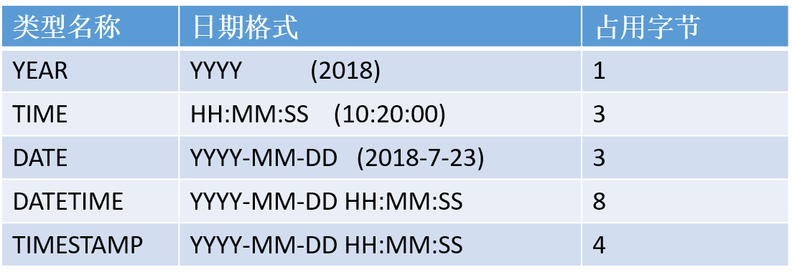
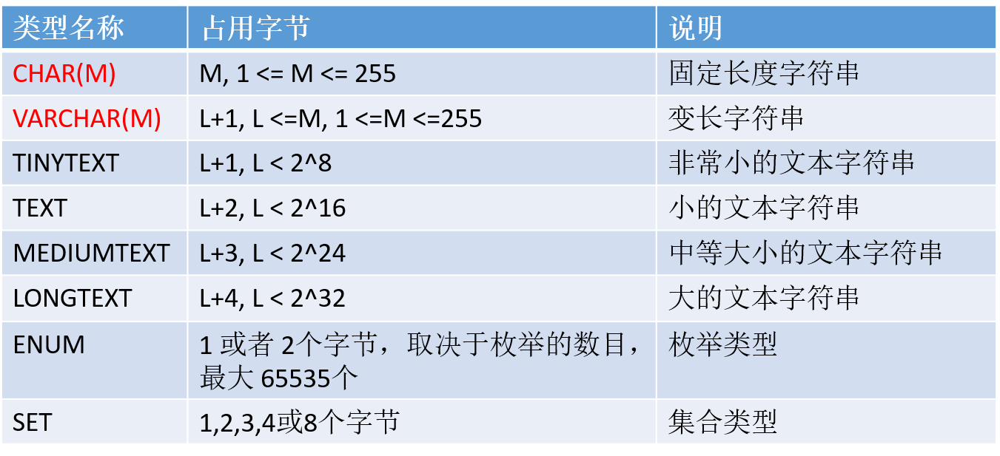
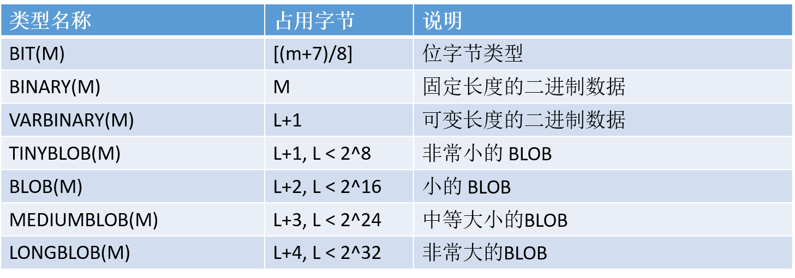
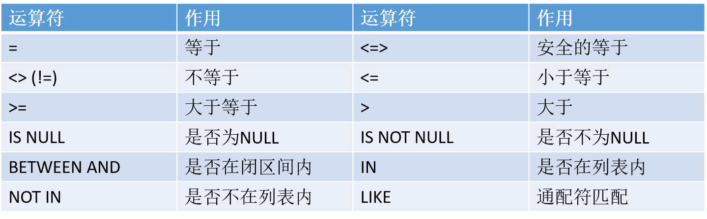

# 数据库

## 目录

## ## 数据库基础

数据库定义：  
> A database is an organized collection of data, stored and accessed electronically.  


分类：
- 关系型数据库。  
  不仅存储数据本身，还存储数据之间的关系，比如说用户信息和订单信息。关系型数据库模型把复杂的数据结构归结为简单的二维表（关系表）。

- 非关系型数据库。  
  非关系型数据库也被称为 NoSQL 数据库。NoSQL 的产生并不是要否定关系型数据库，而是作为关系型数据库的一个有效补充。

易混淆术语：
- 数据库系统（DBS）：是指在计算机系统中引入数据库后的系统，一般由数据库、数据库管理系统、应用系统、数据库管理员（DBA）构成。 

- 数据库管理系统（DBMS）：是一种操纵和管理数据库的大型软件，用于建立、使用和维护数据库（如：MySQL）。 

- 数据库（DB）：数据库是按照数据结构来组织、存储和管理数据的仓库。

注：我们通常用数据库这个术语来代表 DBMS，严格来说这是不正确的，容易产生混淆。

数据库管理系统、数据库服务、数据库和表的关系（C/S 架构）：  
<div align="center">

</div>

数据在表中的形式：  
<div align="center">

</div>  

- 表的一行称之为一条记录（数据）。

- 表中一条记录对应一个 Java 对象的数据。  
  - 对象与行对应，属性与列对应。


## MySQL

### MySQL安装与配置

具体步骤查看 PDF 文件：<a href="./file/MySQL安装与配置.pdf" download="MySQL安装与配置"> MySQL 安装与配置 </a>

### 登录 MySQL Server

在启动 MySQL 服务后，输入以下格式的命令：
```
mysql -h 主机名 -u 用户名 –p
```
- `-h`：该参数用于指定客户端的主机名（host），即哪台机器要登录 MySQL Server，如果是当前机器该参数可以省略。

- `-u`：用户名（user）。

- `-p`：密码（password），如果密码为空，该参数可以省略。

示例：
```
mysql -u root -p
```

### 数据库的备份和恢复

**（1）备份**  

在命令行中：
```
mysqldump -u $user -p $ db_name > file
```

**（2）恢复**  

方式一，在命令行中：  
  ```
  mysql -u $user -p $db_name < file
  ```

  方式二，登录 mysql 服务, 进入数据库执行 `source file`。  
  注：后面不要加分号


## SQL

SQL 是结构化查询语言（Structured Query Language）的缩写。它是一种专门用来与关系型数据库沟通的语言。

SQL 语言的优点：  
- 通用。  
  几乎所有的关系型数据库都支持 SQL。

- 简单易学。  
  它的语句是由一些有很强描述性的关键词组织而成，
而且这些关键词并不多。

- 简单且强有力。  
  灵活地使用 SQL，可以进行非常复杂的数据库操作。 

- 半衰期很长。

SQL 不区分大小写。  
注：  
- 虽然 SQL 不区分大小写，但是表名、列名和值可能区分！（这依赖具体的 DBMS 及其配置）。
SQL 不区分大小写（关键字不区分大小写）！！！

- 建议：关键字大写；表名、列名和值最好是以它定义时为准。

> 标准 SQL 是由 ANSI 标准委员会管理的，从而称为 ANSI SQL。许多 DBMS 厂商通过增加语句或指令，对 SQL 进行了扩展，目的是提供一些特定的操作，或者是简化某些操作。虽然这种扩展很有必要，但同时也给 SQL 代码的移植带来了麻烦。   
> 即使 DBMS 有自己的扩展，但它们都支持 ANSI SQL。

组成：
- DDL：数据定义语言。

- DML：数据操作语言（增、删、改）。

- DQL：数据查询语言（查）。

- DCL：数据控制语言。

- TPL：事务处理语言。

- …

### DDL管理数据库

数据定义语言 DDL（Data Definition Language）。
- 作用：创建 & 管理数据库和表的结构。

- 常用关键字：CREATE、ALTER 和 DROP。

**（1）创建数据库**  

```sql
CREATE DATABASE [IF NOT EXISTS] db_name [create_specification [ create_specification] ...];
```

create_specification：
- `CHARACTER SET charset_name`：指定字符集，如 utf8。

- `COLLATE collation_name`：指定数据库字符集的比较方式。  
  
  比较规则有时也称为排序规则，用于在字符串比较大小时规定其顺序的。  
  同一种字符集可以有多种比较规则。

  比较规则名称以对应的字符集名称开头，中间部分表示主要用于哪种语言，常见后缀有以下几种：
  - `_bin`：以二进制方式比较。即 A < a。

  - `_ci`：不区分大小写。即 A = a。  
  
  默认 `_ci`。

示例：
```sql
# 创建一个名称为 mydb1 的数据库。
create database mydb1;

# 创建一个使用 gbk 字符集的 mydb2 数据库。
create database if not exists mydb2 character set gbk;

# 创建一个使用 gbk 字符集，并带校对规则（gbk_bin）的 mydb3 数据库。
create database mydb3 character set gbk collate gbk_bin;
```

**（2）查看、删除数据库**  

显示数据库语句：`SHOW DATABASES`。  
示例：
```sql
# 查看所有数据库
show databases;
```

显示数据库创建语句：`SHOW CREATE DATABASE db_name`。  
示例：
```sql
# 查询数据库的创建语句 
show create database mydb1;
```
 
数据库删除语句：`DROP DATABASE [IF EXISTS] db_name`。  
示例：
```sql
# 删除数据库 mydb3
drop database if exists mydb3;
```

**（3）修改数据库**  

```sql
ALTER  DATABASE db_name [alter_specification [, alter_specification] ...] 
```

alter_specification：    
- `CHARACTER SET charset_name`。

- `COLLATE collation_name`。

示例：
```sql
# 把 mydb2 的字符集修改为 utf8
alter database mydb2 character set utf8;
```

### 数据类型

注：这里以 MySQL 为例，不同的 DBMS 都支持数值类型、字符串类型以及日期类型，但他们的实现可能不一样。

**（1）整数类型**  

<div align="center">

</div>

**（2）浮点数类型和定点数类型**  

<div align="center">

</div>

- M 称为精度，表示总共的位数; 

- D 称为标度，表示小数的位数。

- DECIMAL 类型不同于 FLOAT & DOUBLE，DECIMAL 实际是以字符串存放的，它的存储空间并不固定，而是由精度 M 决定的。

**（3）日期与时间类型**  

<div align="center">

</div>

DATETIME 和 TIMESTAMP 虽然显示的格式是一样的，但是它们有很大的区别：
- DATETIME 的系统默认值是 NULL, 而 TIMESTAMP 的系统默认值是当前时间 NOW();

- DATETIME 存储的时间与时区无关，而 TIMESTAMP 与时区有关。

**（4）字符串类型**  

<div align="center">

</div>

ENUM 类型总有一个默认值，当 ENUM 列声明为 NULL，则默认值为 NULL。如果 ENUM 列被声明为 NOT NULL，则其默认值为列表的第一个元素。

**（5）二进制类型**  

<div align="center">

</div>

字符串类型存储的字符串（字符），二进制类型存储的是二进制数据（字节）。

### DDL管理表

**（1）创建表**  

```sql
CREATE TABLE table_name
(
	field1  datatype,
	field2  datatype,
	field3  datatype
)[CHARACTER SET 字符集 COLLATE 校对规则]
```
- field：指定列名。

- datatype：指定列类型。

注：
- 创建表前，要先使用 `USE db_name` 语句使用库。  

- 创建表时，要根据需保存的数据创建相应的列，并根据数据的类型定义相应的列类型。

示例：
```sql
# 在数据库 mydb1 中 创建 user 表
use mydb1;

create table t_user (
	id int,
    name varchar(255),
    password varchar(20),
    birthday date
);
```

**（2）查询表**  

简单描述表结构：`DESC 表名` 或者 `DESCRIBE 表名`。  
示例：
```sql
DESC t_user;
```


查看数据库中所有的表：`SHOW TABLES;`。


查看生成表的 DDL 语句：`SHOW CREATE TABLE 表名`。  
示例：
```sql
# 查看表的定义语句
show create table t_user;
```

**（3）修改表**  

使用 `ALTER TABLE` 语句追加、修改或删除列的语法。  

追加：
```sql
ALTER TABLE table_name ADD (column datatype [DEFAULT expr] [,ADD column datatype]...);
```
示例：
```sql
# 添加 gender 列
alter table t_user add column gender varchar(10);

# 在 password 后面添加 balance 列
alter table t_user add column balance int after password;

# 在最前面添加 no 列
alter table t_user add column no int first;

# 添加 a, b 列 
alter table t_user add column a int, add column b int;
```

修改：
```sql
ALTER TABLE table_name change col_name new_col_name datatype [DEFAULT expr] [,change col_name new_col_name datatype [DEFAULT ...] ]...;
```
示例：
```sql
# 把 balance 的名字改成 salary
alter table t_user change column balance salary int;
```

修改定义：
```sql
ALTER TABLE table_name MODIFY column datatype [DEFAULT expr] [,MODIFY column datatype]...;
```
示例：
```sql
# 把 salary 的类型改成 decimal(10,2)
alter table t_user modify column salary decimal(10,2);
```

删除：
```sql
ALTER TABLE table_name DROP column col_name;
```
示例：
```sql
# 删除 a 列
alter table t_user drop column a;
```

注：
- 修改表的名称：`RENAME TABLE 表名 TO 新表名`。  
  
  RENAME TABLE 语句的另一个用法是移动该表到另一个数据库。格式：`RENAME TABLE 旧数据库名.旧表名 TO 新数据库名.新表名`。  

- 修改表的字符集：`alter table student character set utf8;`。

多个修改的操作可以同时在同一 `ALTER TABLE` 语句后。  
示例：
```sql
# 删除 b 列, 把 gender 的类型改成 bit(1), 在 name 的后面添加 c 列
alter table t_user drop column b, modify column gender bit(1), add column c int after name;
```


**（4）删除表**  

格式：`DROP TALBE 表名`。  
示例：
```sql
# 删除表 
drop table t_user;
```


### DML数据操纵语言

DML：Data Manipulation Language。  
作用：用于向数据库表中插入、删除、修改数据。  
常用关键字：INSERT、UPDATE 和 DELETE。

**（1）INSERT**  

使用 INSERT 语句向表中插入数据：  
```sql
INSERT INTO	table [(column [, column...])]
VALUES (value [, value...]);
```
- 插入的数据应与字段的数据类型相同。

- 数据的大小应在列的规定范围内。例如：不能将一个长度为 80 的字符串加入到长度为 40 的列中。

- 字符串和日期型数据应包含在单引号中。

示例：
```sql
create table t_user (
	id int,
    name varchar(20),
    age int,
    gender enum('male', 'female')
);
insert into t_user values (1, 'thomas_he', 18, 'male');
insert into t_user (name, id) values ('茜茜', 2);
insert into t_user (id, name, age) values (3, '张三', 30), (4, '李四', 40);

create table user (
	id int,
    name varchar(20),
    age int,
    gender enum('male', 'female')
);
insert into user (select * from t_user);
```


**（2）UPDATE**  

使用 UPDATE 语句修改表中数据：  
```sql
UPDATE 	tbl_name    
SET col_name1=expr1 [, col_name2=expr2 ...]    
[WHERE where_definition]
```

- UPDATE 语法可以用新值更新原有表行中的各列。

- SET 子句指示要修改哪些列和要给予哪些值。

- WHERE 子句指定应更新哪些行。如没有 WHERE 子句，则更新所有的行。

示例：
```sql
# 把 t_user 表中所有人的年龄改为 18
update t_user 
set age=18;

# 把名字为茜茜的用户的年龄改为 16, 性别改成 female
update t_user 
set age=16, gender='female' 
where name='茜茜';
```

**（3）DELETE**  

使用 DELETE 语句删除表中数据：  
```sql
delete from table_name       
[WHERE where_definition]
```

- 如果不使用 WHERE 子句，将删除表中所有数据。

- DELETE 语句不能删除某一列的值，删除的单位是行。

- 使用 DELETE 语句仅删除记录，不删除表本身。如要删除表，使用 DROP TABLE 语句。

示例：
```sql
# 删除名字为张三的记录
delete from t_user 
where name='张三';

# 清空 t_user 表中的所有记录
delete from t_user;
```

### 常用运算符

算术运算符：`+`、`-`、`*`、`/`、`%`。  

比较运算符：
<div align="center">

</div>

逻辑运算符：`NOT(!)`、`AND(&&)`、`OR(||)`。  

位操作运算符：`&`、`|`、`~`、`^`、`<<`、`>>`。

like 与通配符搭配使用, 进行模糊查询。
- `%`：匹配任何数目的字符，甚至包括零个字符。

- `_`: 匹配一个字符。

注：不同的 DBMS，通配符可能不一样, 比如 SQL Server 是 `*` 匹配所有字符, `?` 匹配一个字符。


### DQL数据查询语言

DQL：Data Query Language。  
作用：查询表中的数据。  
关键字：SELECT。

以下示例以 <a href="./file/heros.sql" download="heros.sql"> heros 表 </a> 为例。 

**（1）计算表达式和函数的值**  

虽然 SELECT 语句通常用于从表中检索数据，但我们也可以用它计算表达式和函数的值。  
示例：
```sql
# 计算表达式3*2的值 
SELECT 3*2;

# 查看当前的时间 
SELECT NOW();

# 修剪字符串' ab cd '左右两边的空白
SELECT TRIM(' ab cd ');

# 拼接字符串 'ab'和'cd'
SELECT CONCAT('ab','cd');
```

**（2）查询表中的字段**  

查询单个字段的值。  
```sql
# 查询 heros 表中所有英雄的名字
select name from heros;

# 查询 heors 表中所有辅助角色定位
select role_assist from heros;
```

查询多个字段的值，多个字段之间用 `,` 分隔。  
```sql
# 查询 heros 表中所有英雄的名字，最大生命值，最大法力值以及主要角色定位。
select name, hp_max, mp_max, role_main from heros;
```

查询所有字段，还可以用 `*` 代指所有字段。
```sql
# 查询 heros 表中所有数据。
select * from heros;
```

注：在生产环境中，尽量不要使用 `*` 通配符。因为查询不必要的数据会降低查询和应用程序的
效率！

**（3）使用 WHERE 子句过滤记录**  

WHERE 子句后面接逻辑表达式。如果逻辑表达式的结果为真，这条记录就会添加到结果集中，否则就
不会添加到结果集。  
示例：
```sql
# 返回空表
select * from heros where 0;

# 查询 heros 表中所有数据
select * from heros where 1;

# 查询 heros 中，name='花木兰' 的数据
select * from heros where name='花木兰';
```

**（4）给字段起别名**  

AS 可以给字段起别名。  
示例：
```sql
SELECT name, hp_max AS hp, mp_max AS mp FROM heros;

# 省略 AS
SELECT name, hp_max hp, mp_max mp FROM heros;
```
注：
- AS 关键字可以省略，但是不推荐这样做。

- AS 关键字不仅仅可以给字段起别名，还可以给表起别名。

**（5）去除重复行**  

DISTINCT 可以对查询结果去重。  
示例：
```sql
# 查询主要角色定位有哪些
select role_main from heros;

# 去重查询主要角色定位
select distinct role_main from heros;

# 去重查询主要角色定位和辅助角色定位
select distinct role_main, role_assist from heros;
```

注：
- DISTINCT 关键字必须放在所有查询字段的前面。

- DISTINCT 是对所有查询字段的组合进行去重，也就是说每个字段都相同，才认为两条记录是相同。

**（6）排序**  

`ORDER BY` 可以对结果集进行排序。`ASC` 表示升序，`DESC` 表示降序，默认情况为升序。  
示例：
```sql
# 查询所有英雄，并按最大生命值从大到小排序
select name, hp_max from heros order by hp_max asc;
```

还可以对多个字段进行排序。即先按照第一个字段排序，当第一个字段相同时，再按照第二个字段排序，依此类推。  
示例：
```sql
# 查询所有英雄，先按最大生命值降序排序，再按照最大法力值升序排序
select name, hp_max, mp_max from heros order by hp_max asc, mp_max desc;
```

`ORDER BY` 可以对非选择字段进行排序，也就是说排序的字段不一定要在结果集中。  
示例：
```sql
SELECT name, hp_max FROM heros ORDER BY hp_max ASC, mp_max DESC;
```

甚至，我们还可以对计算字段进行排序。  
示例：
```sql
SELECT name, hp_max FROM heros ORDER BY (hp_max + mp_max) DESC;
```

**（7）限制结果集 **  

`LIMIT` 可以限制结果集的数量。它有两种使用方式：`LIMIT offset, nums` 和 `LIMIT nums OFFSET offset`。  
示例：
```sql
# 查询最大生命值最高的 5 名英雄。
select name, hp_max from heros order by hp_max desc limit 0, 5;

# 推荐使用 LIMIT nums OFFSET offset 方式，可以清楚查看偏移量
select name, hp_max from heros order by hp_max desc limit 5 offset 0;

# 偏移量为 0，可省略
select name, hp_max from heros order by hp_max desc limit 5;
```

使用 LIMIT 可以很方便地实现分页查询：
```sql
limit rows offset rows * (page - 1)
```


注：不同的 DBMS 用来限制结果集的关键字是不一样的。比如 Microsoft SQL Server 和 Access  使用的是 TOP 关键字。

**（8）计算字段**  

计算字段并不实际存在于数据库表中，它是由表中的其它字段计算而来的。一般我们会给计算字段起一
个的别名。  
示例：
```sql
SELECT name, hp_max + mp_max FROM heros;

SELECT name, hp_max + mp_max AS total_max FROM heros;
```

**（9）聚合函数**  

聚合函数是对某个字段的值进行统计的，而不是对某条记录进行统计。如果想计算某个学生各科成绩的
总分，那么应该使用计算字段。  

聚合函数往往是搭配分组使用的。如果没有分组，那么聚合函数统计的是整个结果集的数据；如果分组
了，那么聚合函数统计的是结果集中每个组的数据。  

SQL 中一共有 5 个聚合函数。分别为 COUNT()，SUM()，AVG()，MAX()，MIN()。  

`COUNT(*)` 可以统计记录数。可以统计 null 行。  
示例：
```sql
# 查询 heros 表中有多少条记录 
select count(*) from heros;

# 统计 null 行
create table temp (
	a int
);
insert into temp values (null);
select count(*) from temp;
```

`COUNT()` 作用于某个具体的字段，可以统计这个字段的非 `NULL` 值的个数。  
示例：
```sql
# 查询有辅助角色定义的英雄有多少个
select count(role_assist) from heros;
```

`SUM()` 用于统计某个字段非 `NULL` 值的和。  
示例：
```sql
SELECT SUM(hp_max) FROM heros;
```

`AVG()` 用于统计某个字段非 `NULL` 值的平均值。  
示例：
```sql
# 查询最大生命值的平均值
SELECT AVG(hp_max) FROM heros;

# 将结果格式化，保留小数点后 2 位
SELECT round(AVG(hp_max), 2) FROM heros;
```

`MAX()` 用于统计某个字段非 `NULL` 值的最大值。  
`MIN()` 用于统计某个字段非 `NULL` 值的最小值。  
示例：
```sql
SELECT MAX(hp_max) FROM heros;

SELECT MIN(hp_max) FROM heros;
```

我们还可以对字段中不同的值进行统计。先用 `DSITINCT` 去重，再用聚合函数统计。  
示例：
```sql
select count(hp_max) from heros;

SELECT COUNT(DISTINCT hp_max) FROM heros;
```

**（10）分组**  

`GROUP BY` 可以对记录进行分组。 

搭配聚合函数使用：
```sql
# 按照主要角色定位进行分组，并统计每一组的英雄数目。
select role_main, count(*) from heros group by role_main;

# 按照次要角色定位进行分组，并统计每一组的英雄数目。
select role_assist, count(*) from heros group by role_assist;
```


`GROUP_CONCAT`：
```sql
# 如果我们想知道每种角色的英雄都有哪些，可以使用 GROUP_CONCAT() 函数。
select role_main, group_concat(name) from heros group by role_main;
```

我们可以对多个字段进行分组。也就是说，每个字段的值都相同的记录为一组。  
示例：
```sql
SELECT COUNT(*) AS num, role_main, role_assist 
FROM heros 
GROUP BY role_main, role_assist 
ORDER BY num DESC;
```

`HAVING` 可以过滤分组。  
示例：
```sql
# 按照英雄的主要角色定位，次要角色定位进行分组，并且筛选分组中英雄数目大于 5 的组，最后根据每组的英雄数目从高到低进行排序。
SELECT COUNT(*) AS num, role_main, role_assist 
FROM heros 
GROUP BY role_main, role_assist 
HAVING num > 5
ORDER BY num DESC;

# 筛选最大生命值大于 6000 的英雄，按照主要角色定位，次要角色定位分组，并且筛选英雄数目大于 5 的分组，最后按照英雄数目从高到低进行排序。
SELECT COUNT(*) AS num, role_main, role_assist 
FROM heros 
WHERE hp_max > 6000
GROUP BY role_main, role_assist 
HAVING num > 5
ORDER BY num DESC;
```

**（11）SELECT的顺序**  

SELECT 是 RDBMS 中执行最多的操作。我们不仅仅要理解 SELECT 的语法，还要理解它底层执行的原
理。  
有两个关于 SELECT 的顺序，我们需要记住：
- 语法中关键字的顺序：  
  ```sql
  SELECT ... 
  FROM ... 
  WHERE ... 
  GROUP BY ... 
  HAVING ... 
  ORDER BY ... 
  LIMIT ...
  ```

- 语句的执行顺序。不同的 RDBMS，它们 SELECT 语句的执行顺序基本是相同的。  
  FROM --> WHERE --> GROUP BY --> HAVING --> SELECT --> DISTINCT --> ORDER BY -->
LIMIT

示例：
```sql
SELECT DISTINCT team_id, team_name, count(*) AS num # 顺序 5
FROM player JOIN team ON player.team_id = team.team_id # 顺序 1
WHERE height > 1.80 # 顺序 2
GROUP BY player.team_id # 顺序 3
HAVING num > 2 # 顺序 4
ORDER BY num DESC # 顺序 6
LIMIT 2; # 顺序 7
```