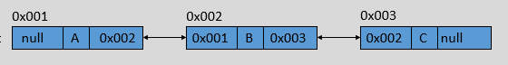

# 四、高级类型

## 目录


## 集合类

类集在整个 Java 中最为核心的用处就在于其实现了动态数组的操作，并且定义了大量的操作标准。在整个类集框架中，其核心接口为：Collection、List、Set、Map、Iterator、Enumeration。

<div align="center">

</div>

### Collection


Collection 是层次结构中的根接口。Collection 表示一组对象，这些对象也称为 collection 的元素。一些 collection 允许有重复的元素，而另一些则不允许。一些 collection 是有序的，而另一些则是无序的。

Collection 常见接口 API：
- `boolean add(E e)`：将指定元素添加到此 collection 中。  
  如果此 collection 由于调用而发生更改，则返回 true。如果此 collection 不允许有重复元素，并且已经包含了指定的元素，则返回 false。

- `boolean remove(Object o)`：如果此 collection 包含一个或多个满足 (o == null ? e == null : o.equals(e)) 的元素 e，则移除这样的元素。  
  如果此 collection 包含指定的元素（或者此 collection 由于调用而发生更改），则返回 true 。 

- `void clear()`：移除此 collection 中的所有元素。  
  如果此 collection 不支持 clear 操作，此方法抛出一个异常： `UnsupportedOperationException`。


- `boolean contains(Object o)`：当且仅当此 collection 至少包含一个满足 (o == null ? e == null : o.equals(e)) 的元素 e 时，返回 true。 

- `boolean isEmpty()`：如果此 collection 不包含元素，则返回 true。

- `int size()`： 返回此 collection 中的元素数。  
  如果此 collection 包含的元素大于 Integer.MAX_VALUE，则返回 Integer.MAX_VALUE。 

- `boolean addAll(Collection c)`：将指定 collection 中的所有元素都添加到此 collection 中。

- `boolean removeAll(Collection c)`：移除此 collection 中那些也包含在指定 collection 中的所有元素。

- `boolean containsAll(Collection c)`：如果此 collection 包含指定 collection 中的所有元素，则返回 true。

- `boolean retainAll(Collection c)`：仅保留此 collection 中那些也包含在指定 collection 的元素。  
  如果此 collection 由于调用而发生更改，则返回 true 


- `Object[] toArray()`：返回包含此 collection 中所有元素的数组。  
  返回的数组将是「安全的」，因为此 collection 并不维护对返回数组的任何引用。（换句话说，即使 collection 受到数组的支持，此方法也必须分配一个新的数组）。因此，调用者可以随意修改返回的数组。 

- `Iterator iterator()`：返回在此 collection 的元素上进行迭代的迭代器。  
  关于元素返回的顺序没有任何保证（除非此 collection 是某个能提供保证顺序的类实例）。 

示例：  
```java
import java.util.ArrayList;
import java.util.Arrays;
import java.util.Collection;

public class TestDemo {
    public static void main(String[] args) {
        Collection c1 = new ArrayList();
        Collection c2 = new ArrayList();

        // boolean add(E e)
        c1.add("Hello");
        c1.add("World");
        System.out.println(c1);

        // boolean remove(Object o)
        c1.remove("World");
        System.out.println(c1);

        //void clear()
        c1.clear();
        System.out.println(c1);

        // boolean contains(Object o)
        c1.add("Hello");
        c1.add("World");
        System.out.println(c1.contains("Hello"));

        // boolean isEmpty()
        System.out.println(c1.isEmpty());

        // int size()
        System.out.println(c1.size());

        // boolean addAll(Collection c)
        c2.add("Java");
        c2.add("No.1");
        c1.addAll(c2);
        System.out.println(c1);

        // boolean removeAll(Collection c)
        c1.removeAll(c2);
        System.out.println(c1);

        // boolean retainAll(Collection c)
        c2.add("Hello");
        c2.add("World");
        c1.retainAll(c2);
        System.out.println(c1);

        // boolean containsAll(Collection c)
        System.out.println(c1.containsAll(c2));

        Object[] arr = c2.toArray();
        for (int i = 0; i < arr.length; i++) {
            String s = (String) arr[i];
            if ("No.1".equals(s)) arr[i] = "No.0";
        }
        System.out.println(Arrays.toString(arr));
        System.out.println(c2);
    }
}

/* 运行结过：
[Hello, World]
[Hello]
[]
true
false
2
[Hello, World, Java, No.1]
[Hello, World]
[Hello, World]
false
[Java, No.0, Hello, World]
[Java, No.1, Hello, World]
*/
```

### Iterator接口

它是对集合进行迭代的迭代器，依赖于集合对象存在。

Iterator接口 API：
- `boolean hasNext()`：如果仍有元素可以迭代，则返回 true。

- `E next()`：返回迭代的下一个元素。

- `void remove()`：从迭代器指向的 collection 中移除迭代器返回的最后一个元素。

示例：  
```java
import java.util.ArrayList;
import java.util.Collection;
import java.util.Iterator;

public class TestDemo {
    public static void main(String[] args) {
        Collection c = new ArrayList();

        c.add("Hello");
        c.add("World");

        Iterator it = c.iterator();
        while (it.hasNext()) {
            String s = (String) it.next();
            System.out.println(s);
        }
    }
}

/* 运行结果：
Hello
World
*/
```

注：  
- 用集合的 API 修改集合的结构，所有的迭代器会失效。  
  用迭代器的 API 修改集合的结构，其它迭代器会失效。  

  例如，将上面的循环代码修改为：  
  ```java
  while (it.hasNext()) {
       String s = (String) it.next();
       if ("World".equals(s)) {
             c.remove(s);
        }
  }
  ```
  就会报错：ConcurrentModificationException。

- 用迭代器遍历集合的时候，不要使用 while 循环，可以使用 for 循环，最好使用 for each 循环。


### List

List：有序的 collection（也称为序列）。  
此接口的用户可以对列表中每个元素的插入位置进行精确地控制。用户可以根据元素的整数索引（在列表中的位置）访问元素，并搜索列表中的元素。  

与 set 不同，列表通常允许重复的元素。更确切地讲，列表通常允许满足 `e1.equals(e2)` 的元素对 e1 和 e2，并且如果列表本身允许 null 元素的话，通常它们允许多个 null 元素。

常见 API：
- `void add(int index, E element)`：在列表的指定位置插入指定元素。

- `boolean addAll(int index, Collection c)`：将指定 collection 中的所有元素都插入到列表中的指定位置。

- `E remove(int index)`：移除列表中指定位置的元素。

- `E get(int index)`：返回列表中指定位置的元素。

- `int indexOf(Object o)`：返回此列表中第一次出现的指定元素的索引；如果此列表不包含该元素，则返回 -1。

- `lastIndexOf(Object o)`：返回此列表中最后出现的指定元素的索引；如果列表不包含此元素，则返回 -1。

- `E set(int index, E element)`：用指定元素替换列表中指定位置的元素。

- `List<E> subList(int fromIndex, int toIndex)`：返回列表中指定的 fromIndex（包括 ）和 toIndex（不包括）之间的部分视图。（如果 fromIndex 和 toIndex 相等，则返回的列表为空）。返回的列表由此列表支持，因此返回列表中的非结构性更改将反映在此列表中，反之亦然。返回的列表支持此列表支持的所有可选列表操作。  
  即修改子列表，原列表也会修改。示例：  
  ```java
  import java.util.ArrayList;
  import java.util.List;

  public class TestDemo {
      public static void main(String[] args) {
          List list = new ArrayList();
          list.add("hello");
          list.add("world");
          list.add("java");

          List subList = list.subList(1, 2);
          System.out.println(subList);

          subList.set(0, "WORLD");
          System.out.println(subList);
          System.out.println(list);
      }
  }

  /* 运行结果：
  [world]
  [WORLD]
  [hello, WORLD, java]
  */
  ```

- `ListIterator<E> listIterator()`：返回此列表元素的列表迭代器（按适当顺序）。

- `ListIterator<E> listIterator(int index)`：返回列表中元素的列表迭代器（按适当顺序），从列表的指定位置开始。 

ListIterator 接口常见 API：
- `boolean hasPrevious()`：如果以逆向遍历列表，列表迭代器有多个元素，则返回 true。

- `E next()`： 返回列表中的下一个元素。

- `boolean hasPrevious()`：如果以逆向遍历列表，列表迭代器有多个元素，则返回 true。

- `E previous()`：返回列表中的前一个元素。

- `int previousIndex()`：返回对 previous 的后续调用所返回元素的索引。

- `int nextIndex()`：返回对 next 的后续调用所返回元素的索引。

- `void add(E e)`：将指定的元素插入列表。

- `void remove()`：从列表中移除由 next 或 previous 返回的最后一个元素。

- `void set(E e)`：用指定元素替换 next 或 previous 返回的最后一个元素。

## 数组和链表

### 数组

常见的数据结构有：数组、链表、栈、队列、树、哈希表和图。

数组的本质是固定大小的连续的内存空间，并且这片连续的内存空间又被分割成等长的小空间。它最主要的特点是随机访问。
- 数组的长度是固定的。

- 数组只能存储同一种数据类型的元素。

注：在 Java 中只有一维数组的内存空间是连续，多维数组的内存空间不一定连续。

数组通过寻址公式实现随机访问。  
寻址公式：i_address = base_address + i * type_length。

数组的基本操作：
- 添加（保证元素的顺序）。  
  最好情况：O(1)；  
  最坏情况：移动 n 个元素，O(n)；   
  平均情况：移动 n/2 个元素，O(n) 。 

- 删除（保证元素的顺序）。  
  最好情况：O(1)；  
  最坏情况：移动 n-1 个元素，O(n)；  
  平均情况：移动 (n-1)/2 个元素，O(n)。  

- 查找。
  - 根据索引查找元素：O(1)。

  - 查找数组中与特定值相等的元素。  
    大小无序：O(n)；  
    大小有序：O(log2n)。  

总结：数组增删慢，查找快。

### 链表

形象地说，链表就是用一串链子将结点串联起来。

<div align="center">

</div>

结点：包含数据域和指针域。  
数据域：数据。  
指针域：下一个结点的地址。  

链表分类：
- 单链表：  
  <div align="center">
  
  </div>

- 循环链表：  
  <div align="center">
  
  </div>

- 双向链表：  
  <div align="center">
  
  </div>

- 双向循环链表：  
  <div align="center">
  
  </div>

**（1）单链表**  

增加（在某个结点后面添加）。

删除（在某个结点后面删除）。

查找：
- 根据索引查找元素。

- 查找链表中与特定值相等的元素。
  - 元素大小有序。

  - 元素大小无序。

总结：链表增删快，查找慢。

**（2）双向链表**  

很容易验证，前面那些操作，双向链表和单链表的时间复杂度是一样的。但是双向链表有单链表没有的独特魅力 —— 它有一条指向前驱结点的链接。

增加（在某个结点前面添加元素）。

删除（删除该结点）。

查找：
- 查找前驱结点。

- 根据索引查找元素。

- 查找链表中与特定值相等的元素：
  - 元素大小无序。
  - 元素大小有序 。

总结：虽然双向链表更占用内存空间，但是它在某些操作上的性能是优于单链表的。

思想：用空间换取时间。

**（3）空间换取时间**  

缓存就是一种用空间换取时间的技术。

内存大小是有限的，所以缓存不能无限大。那么当缓存满的时候，再向缓存中添加数据，就需要采取一些策略。

缓存淘汰策略：
- FIFO（First In First Out）。

- LFU（Least Frequently Used）。

- LRU（Least Recently Used）。

LRU 算法中我们就用到了链表！

添加（认为尾节点是最近最少使用的数据）：
- 如果缓存中已经存在该数据：删除该结点，添加到头结点。

- 如果缓存中不存在该数据：
  - 缓存没满，添加到头结点。

  - 缓存满了，删除尾节点, 在头结点添加。

### 数组VS链表

<div align="center">

</div>

数组和链表的插入、删除和随机访问操作的时间复杂度刚好相反。

- 数组使用的是连续的内存空间，可以利用 CPU 的高速缓存预读数据。  
  链表的内存空间不是连续的，不能有效预读数据。当然如果数组过大，系统没有足够的连续内存空间，会抛出 OOM。

- 数组的缺点是大小固定，没法动态的调整大小。如果要存储一些对象，如果数组太大，浪费内存空间；如果数组太小，我们需要重新申请一个更大数组，并将数据拷贝过去，耗时。

- 如果业务对内存的使用非常苛刻，数组更适合。因为结点有指针域，更消耗内存。而且对链表的频繁插入和删除，会导致结点对象的频繁创建和销毁，有可能会导致频繁的 GC 活动。
