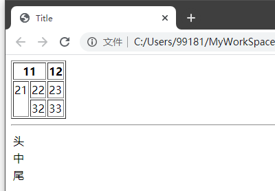

# 七、前端基础

## 目录

- [七、前端基础](#七前端基础)
  - [目录](#目录)
  - [1 背景知识](#1-背景知识)
    - [1.1 URI 和 URL](#11-uri-和-url)
    - [1.2 DNS](#12-dns)
    - [1.3 HTTP](#13-http)
  - [2 HTML](#2-html)
    - [2.1 HTML 概念](#21-html-概念)
    - [2.2 HTML 结构](#22-html-结构)
      - [2.2.1 HelloWorld](#221-helloworld)
      - [2.2.2 结构特点](#222-结构特点)
      - [2.2.3 `<!DOCTYPE>` 声明](#223-doctype-声明)
      - [2.2.4 标签分类](#224-标签分类)
    - [2.3 头部常用标签](#23-头部常用标签)
      - [2.3.1 title](#231-title)
      - [2.3.2 meta](#232-meta)
      - [2.3.3 link](#233-link)
      - [2.3.4 style](#234-style)
      - [2.3.5 script](#235-script)
    - [2.4 body 常用标签](#24-body-常用标签)
      - [2.4.1 hr](#241-hr)
      - [2.4.2 br](#242-br)
      - [2.4.3 h 标题](#243-h-标题)
      - [2.4.4 div](#244-div)
      - [2.4.5 a](#245-a)
      - [2.4.6 p](#246-p)
      - [2.4.7 img](#247-img)
      - [2.4.8 input](#248-input)
      - [2.4.9 textarea](#249-textarea)
      - [2.4.10 select](#2410-select)
      - [2.4.11 ol 和 ul](#2411-ol-和-ul)
      - [2.4.12 table](#2412-table)
      - [2.4.13 form](#2413-form)

## 1 背景知识

### 1.1 URI 和 URL

统一资源标识符（英语：Uniform Resource Identifier，缩写：URI）在电脑术语中是一个用于标识某一互联网资源名称的字符串。  

> 维基百科介绍：  
> 该种标识允许用户对网络中（一般指万维网）的资源通过特定的协议进行交互操作。URI的最常见的形式是统一资源定位符（URL），经常指定为非正式的网址。更罕见的用法是统一资源名称（URN），其目的是通过提供一种途径。用于在特定的名字空间资源的标识，以补充网址。

URL，简单讲就是网址。

### 1.2 DNS

域名系统（英语：Domain Name System，缩写：DNS）是互联网的一项服务。它作为将域名和IP地址相互映射的一个分布式数据库，能够使人更方便地访问互联网。

DNS，简单讲就是将域名转换成IP地址。

### 1.3 HTTP

浏览器负责发起请求 --> 服务器从 80 端口接收请求 --> 服务器负责响应 --> 浏览器下载响应内容。

HTTP 的作用就是指导浏览器和服务器如何沟通。

## 2 HTML

### 2.1 HTML 概念

HTML 的英文全称是 Hypertext Marked Language，即超文本标记语言。  
- 超文本是一种组织信息的方式，它通过超链接方法蒋文本中的文字、图表与其它信息媒体相关联（本质是一个文本，不过是个特别的文本）。

- HTML 不是一种编程语言，而是一种标记语言。标记语言是一套（一系列）标记标签，通过这些标签可以将网络上的文档格式统一，使分散的 internet 资源链接为一个逻辑整体。

用 HTML 编写的超文本文档称为 HTML 文档，它能独立于各种操作系统平台。使用 HTML 语言，将所需要表达的信息按某种规则写成 HTML 文件，通过专用的浏览器来识别，并将这些 HTML 文件翻译成可以识别的信息，即现在所见到的网页.

HTML 发展历史：HTML 1.0 --> HTML 2.0 --> HTML 3.2 --> HTML 4.0 --> HTML 4.01 --> HTML 5。  

HTML5 极大地提升了 Web 在富媒体、富内容和富应用等方面的能力，曾经被喻为终将改变移动互联网的重要推手。  

HTML 语言特点：
- 简易性：超级文本标记语言版本升级采用超集方式，从而更加灵活方便。 

- 可扩展性：超级文本标记语言的广泛应用带来了加强功能，增加标识符等要求，超级文本标记语言采取子类元素的方式，为系统扩展带来保证。 

- 平台无关性：超级文本标记语言可以使用在广泛的平台上 

- 通用性： HTML 是网络的通用语言，一种简单、通用的全置标记语言。它允许网页制作人建立文本与图片相结合的复杂页面，这些页面可以被网上任何其他人浏览到，无论使用的是什么类型的电脑或浏览器。

### 2.2 HTML 结构

#### 2.2.1 HelloWorld

创建一个新的 HTML 文本：新建文本 `FirstHtml` --> 后缀改为 `.html`。

编辑 `FirstHtml.html`：
```html
<!DOCTYPE html>
<html lang="en">
<head>
    <meta charset="UTF-8">
    <title>FirstHtml</title>
</head>
<body>
HelloWorld！
</body>
</html>
```

保存后选择打开方式为浏览器：
<div align="center">

</div>

#### 2.2.2 结构特点

HTML 文本是由标签描述的文本，整个文本由 `<html>` 标签包裹，文本分为两个部分：
- 头标签 `<head>`。

- 包裹身体标签 `<body>`。
 
HTML 标记语言有一系列标签组成，这些标签具有以下特点：
- 由尖括号包围的关键词，比如 `<html>`。

- 标签成对出现，有开始标签和结束标签（除了个别单标签，如 `<hr>`）

- 标签对中的第一个标签是开始标签，第二个标签是结束标签。开始和结束标签也被称为开放标签和闭合标签。

#### 2.2.3 `<!DOCTYPE>` 声明

一个 HTML 文本必须有 `<!DOCTYPE>` 声明，用来选择文档类型（除了 HTML5 的 DOCTYPE，其他的都很难记）。  

HTML5 的 DOCTYPE：
```html
<!DOCTYPE html>
```

注：
- `<!DOCTYPE>` 声明位于文档中的最前面的位置，处于 `<html>` 标签之前。

- `<!DOCTYPE>` 声明不是一个 HTML 标签。

#### 2.2.4 标签分类

**（1）按位置分类**  

HTML 标签在文档中一般分为两个部分：文档头部和文档身体。

文档头部由 `<head>` 标签包裹，主要用来指定整个网页的标题、提供有关页面的基本信息和定义文档与外部资源的关系。  

除了网页在浏览器的标题外, 头部标签包裹的标签及内容都不会在网页上显示。  

写在头部的主要标签：`<title>`、`<base>`、`<meta>`、`<link>`、`<script>`、`<style>`。

文档身体部分由 `<body>` 标签包裹，主要用来书写网页的实际显示部分。  

写在身体部分的主要标签：`<div>`、`<a>`、`<font>`、`<b>`、`<i>`、`<ui>`、`<li>`、`<ol>`、`<table>`、`<tr>`、`<td>`、`<th>`、`<br>`、``、`<input>`...

**（2）按单双标签分类**  

双标签: 标签成对出现，有开始和结束标签。  

单标签: 标签单个出现，没有开始和结束标签，仅有一个标签。  
如：`<br>`、`<hr>`、``。

HTML 标签中大多都是双标签，只有少部分特别的标签是单标签。

**（3）body 里按 css 盒子模型分类**  

在 HTML 文本中，部分标签独占一行，称为块级标签；有的不能独占一行，多个标签元素可以在一行内前后排列，称为行级（行内）标签。

块级元素性质：
- 独占一行，每一个块级元素都会从新的一行重新开始，从上到下排布。

- 可以直接控制宽度、高度以及盒子模型的相关 css 属性。

- 在不设置宽度的情况下，块级元素的宽度是它父级元素内容的宽度。

- 在不设置高度的情况下，块级元素的高度是它本身内容的高度。

- 块级元素是指本身属性为 `display:block;` 的元素。

- 通常使用块级元素来进行大布局（大结构）的搭建。


行级元素性质：
- 和其他内联元素从左到右在一行显示。

- 不能直接控制宽度、高度以及盒子模型的相关 css 属性，但是直接设置内外边距的左右值是可以的。

- 内联元素的宽高是由本身内容的大小决定（文字、图片等）。

- 内联元素只能容纳文本或者其他内联元素（不要在内联元素中嵌套块级元素）。

- 内联元素是指本身属性为 `display:inline;` 的元素。

- 通常使用行级元素来进行文字、小图标（小结构）的搭建。

行级块元素性质：
- 本质属于行级元素。

- 可以与其他行内元素、内联元素共处一行。

- 可以设置宽高、内外边距（需要结合 css 盒子模型理解）。

- 属性为 `display:inline-block;` 的元素。

### 2.3 头部常用标签

#### 2.3.1 title

`<title>` 定义文档的标题。  

浏览器会以特殊的方式来使用标题，并且通常把它放置在浏览器窗口的标题栏或状态栏上。同样，当把文档加入用户的链接列表或者收藏夹或书签列表时，标题将成为该文档链接的默认名称。

#### 2.3.2 meta

meta 标签提供关于 HTML 文档的元数据。

元数据不会显示在页面上，但是对于机器是可读的。它可用于浏览器（如何显示内容或重新加载页面）、搜索引擎（关键词）或其他 Web 服务。

为搜索引擎定义关键词：
```html
<meta name="keywords" content="HTML, CSS, XML, XHTML, JavaScript">
```

为网页定义描述内容：
```html
<meta name="description" content="编程 & 教程">
```

定义网页作者：
```html
<meta name="author" content="Runoob">
```

每 30 秒钟刷新当前页面：
```html
<meta http-equiv="refresh" content="30">
```

#### 2.3.3 link

`<link>` 标签定义了文档与外部资源之间的关系，通常用于链接到样式表。  

注：在用于样式表时，`<link>` 标签得到了几乎所有浏览器的支持。但是几乎没有浏览器支持其他方面的用途。

#### 2.3.4 style

`<style>` 标签定义了 HTML 文档的 css 样式文件引用。

在 `<style>` 元素中也可以直接添加样式来渲染 HTML 文档。

#### 2.3.5 script

`<script>` 标签用于加载脚本文件，如 JavaScript。

### 2.4 body 常用标签

#### 2.4.1 hr

`<hr>` 标识一条横线，并且是一个单标签。


| 属性 | 值 | 描述 |
| :- | :- | :- |
| align	| center<br>left<br>right | 对齐方式 |
| noshade | noshade	| 规定 hr 元素的颜色呈现为纯色 |
| size | pixels	| 规定 hr 元素的高度（厚度） |
| width	| pixels<br>% | 宽度 |

#### 2.4.2 br

`<br>` 可插入一个简单的换行符，是一个单标签。

使用在行级元素, 当多个行级元素,中间需要换行时使用。

#### 2.4.3 h 标题

`<h1>`、`<h2>`、`<h3>`、`<h4>`、`<h5>`、`<h6>` 被称为标题标签，用来定义标题。
- 有且只有这 6 个标题标签。

- `<h1>` 定义最大的标题，`<h6>` 定义最小的标题。

- `<h1>` 只能在一个 HTML 文本中出现一次，并且不得出现在 `<h2>` - `<h6>` 之后。  
  注：错误书写不影响显示，但是建议正确书写。例如写多个 `<h1>` 不影响每个 `<h1>` 的显示，但是 SEO 会淡化这个页面的标题和关键词，降低关键字的排名。

#### 2.4.4 div

<div> 可定义文档中的分区或节（division/section）。它可以把文档分割为独立的、不同的部分。可以用作严格的组织工具，并且不使用任何格式与其关联。
- 它是块级标签，会自动换行。

- 是最常用的布局标签。

| 属性 | 值 | 描述 |
| :- | :- | :- |
| align	| center<br>left<br>right<br>justify | 对齐方式 |

#### 2.4.5 a

`<a>` 标签定义超链接，用于从一张页面链接到另一张页面。


| 属性 | 值 | 描述 |
| :- | :- | :- |
| targrt | _self<br>_blank<br>_parent<br>_top | 默认是 _self<br>_self：原窗口打开<br>_blank：在新窗口打开<br>_parent：在父窗口打开<br>_top：在顶级窗口打开 |
| href | URL | 规定链接指向的页面的 URL |

注：`<a>` 元素最重要的属性是 href 属性。

#### 2.4.6 p

`<p>` 标签定义段落。  

`<p>` 元素会自动在其前后创建一些空白。浏览器会自动添加这些空间，也可以自己在样式表中规定。

#### 2.4.7 img

`` 为图片标签，在文档中引入图片资源。
- 单标签。

- 行级标签。

注：从技术上讲，`` 标签并不会在网页中插入图像，而是从网页上链接图像。`` 标签创建的是被引用图像的占位空间。

| 必须属性 | 值 | 描述 |
| :- | :- | :- |
| alt | text | 规定图像的替代文本 |
| src | URL | 规定显示图像的 URL |

| 属性 | 值 | 描述 |
| :- | :- | :- |
| height / width | pixels<br>% | 设置图像的高度 / 宽度 |

#### 2.4.8 input

`<input>` 标签用于搜集用户信息。
- 单标签。

- 行级元素。


根据不同的 type 属性值，输入字段拥有很多种形式。输入字段可以是文本字段、复选框、掩码后的文本控件、单选按钮、按钮等等。

| 属性 | 值 | 描述 |
| :- | :- | :- |
| type | button<br>checkbox<br>file<br>hidden<br>image<br>password<br>radio<br>reset<br>submit<br>text | Button：按钮<br>Checkbox：定义复选框<br>file：文件上传<br>hidden：隐藏<br>image：图片<br>password	：密码<br>radio：单选框<br>reset：重置按钮，用于 form 表单<br>submit：提交<br>text：单行文本 |
| max / min | number<br>date | 规定输入字段的最大值 / 最小值 |
| multiple | multiple | 如果使用该属性，则允许一个以上的值 |
| required | required | 指示输入字段的值是必需的 |
| placeholder | text | 规定帮助用户填写输入字段的提示 |
| readonly | readonly | 规定输入字段为只读 |

#### 2.4.9 textarea

`<textarea>` 标签定义多行的文本输入控件。

文本区中可容纳无限数量的文本，其中的文本的默认字体是等宽字体（通常是 Courier）。

#### 2.4.10 select

<select> 元素可创建单选或多选菜单。

<select> 元素中的 <option> 标签用于定义列表中的可用选项。

示例：
```html
<select>
    <option>
        1
    </option>
    <option>
        2
    </option>
    <option selected="selected">
        3
    </option>
    <option>
        4
    </option>
</select>
```
<div align="center">

</div>

#### 2.4.11 ol 和 ul

`<ol>`: 标识有序列表。

| 属性 | 值 | 描述 |
| :- | :- | :- |
| reversed | reversed | 规定列表顺序为降序 |
| start	| number | 规定有序列表的起始值 |
| type | 1<br><br><br><br>i | 规定在列表中使用的标记类型 |

示例：
```html
<ol type="1" start="10">
    <li>li1</li>
    <li>li2</li>
    <li>li3</li>
</ol>

<ol type="a" start="2">
    <li>li1</li>
    <li>li2</li>
    <li>li3</li>
</ol>

<ol type="1" reversed>
    <li>li1</li>
    <li>li2</li>
    <li>li3</li>
</ol>
```
<div align="center">

</div>

`<ul>`: 标识无序列表。

| 属性 | 值 | 描述 |
| :- | :- | :- |
| compact | compact | 规定列表呈现的效果比正常情况更小巧 |
| type | disc<br>square<br>circle | disc：实心圆，是默认值<br>circle：空心圆<br>square：实心方块 |

注：`<ol>` 和 `<ul>` 都必须结合 li 标签使用。

#### 2.4.12 table

`<table>` 标签定义 HTML 表格。

简单的 HTML 表格由 table 元素以及一个或多个 tr、th 或 td 元素组成。
- tr 元素定义表格行。
  
- th 元素定义表头。

- td 元素定义表格单元。

更复杂的 HTML 表格也可能包括 caption、col、colgroup、thead、tfoot 以及 tbody 元素。

`<thead>`、`<tbody>`、`<tfoot>` 必须结合起来使用，它们的出现次序是：`<thead>`、`<tbody>`、`<tfoot>`。  
- `<thead>` 标签定义表格的表头。

- `<tbody>` 元素用于对 HTML 表格中的主体内容进行分组。

- `<tfoot>` 元素用于对 HTML 表格中的表注（页脚）内容进行分组。

注：
- 必须在 `<table>` 元素内部使用这些标签。

- 依旧包含 `<tr>`、`<td>`、`<th>` 等子元素。

示例：
```html
<table border="1px">
    <tr>
        <th colspan="2">11</th>
        <th>12</th>
    </tr>
    <tr valign="top">
        <td rowspan="2">21</td>
        <td>22</td>
        <td>23</td>
    </tr>
    <tr>

        <td>32</td>
        <td>33</td>
    </tr>
</table>

<hr>

<table>
    <thead>
        <tr>
            <td>头</td>
        </tr>
    </thead>

    <tfoot>
        <tr>
            <td>尾</td>
        </tr>
    </tfoot>

    <tbody>
        <tr>
            <td>中</td>
        </tr>
    </tbody>
</table>
```
<div align="center">

</div>

#### 2.4.13 form

`<form>` 标签用于为用户输入创建 HTML 表单。
- 表单能够包含 input 元素，比如文本字段、复选框、单选框、提交按钮等等。

- 表单还可以包含 menus、textarea、fieldset、legend 和 label 元素。

- 表单用于向服务器传输数据。

| 属性 | 值 | 描述 |
| :- | :- | :- |
| action | URL | 规定当提交表单时向何处发送表单数据 |
| method | get<br>post | 规定用于发送 form-data 的 HTTP 方法 |


示例：
```html
<form action="https://www.baidu.com/s" method="get">

    <input name="wd">

    <input type="submit">

</form>
```
<div align="center">


</div>