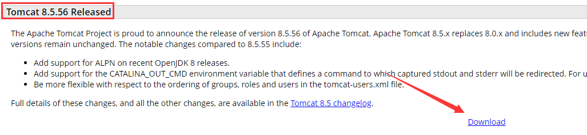

# 八、JavaWeb

## 目录

- [八、JavaWeb](#八javaweb)
  - [目录](#目录)
  - [1. Tomcat](#1-tomcat)
    - [1.1 安装和使用](#11-安装和使用)
    - [1.2 Tomcat 的目录结构](#12-tomcat-的目录结构)
    - [1.3 Tomcat 的组成结构](#13-tomcat-的组成结构)
    - [1.4 虚拟目录映射](#14-虚拟目录映射)
      - [1.4.1 方式一](#141-方式一)
      - [1.4.2 方式二](#142-方式二)
    - [1.5 默认页面和端口](#15-默认页面和端口)


## 1. Tomcat

### 1.1 安装和使用

第一步：进入 [官网](http://tomcat.apache.org)，选择相应版本，进入其下载界面。  

<div align="center">

</div>

第二步：选择下载方式。  
- Linux 操作系统下载 tar.gz 文件。

- Windows 操作系统建议下载 zip 文件。

<div align="center">

</div>

第三步：把下载的文件解压，解压后的文件放入工作区即可。

使用先需要保证环境变量中存在 `JAVA_HOME`。可以通过命令行下的：`echo %JAVA_HOME%` 检查。

检查是否安装成功：
1. 双击 `bin` 目录下的 `startup.bat` 文件;

2. 在浏览器访问 `http://localhost:8080`，如果安装成功界面会有提示。

3. `shutdown.bat` 关闭服务器。

### 1.2 Tomcat 的目录结构

bin：存放启动和关闭 Tomcat 的脚本文件。

conf：存放 Tomcat 服务器的各种配置文件。
- 推荐：修改 `./conf` -> `server.xml` -> connector -> port="8080" 为 "80"。

lib：存放 Tomcat 服务器的支撑 jar 包。

logs：存放 Tomcat 的日志文件。

temp：存放 Tomcat 运行时产生的临时文件。

webpack：Web 应用所在目录，即供外界访问的 Web 资源的存放目录。

work：Tomcat 的工作目录。


### 1.3 Tomcat 的组成结构

```xml
// ./conf/server.xml
<Server>
    <Service>
        <Connector/>
        <Engine>
            <Host>
                <Context/>
            </Host>
        </Engine>
    </Service>
</Server>
```

Server：代表整个 Servlet 容器的组件，是最顶层元素，可以包含一个或多个 Service 元素。  

Service：包含一个 Engine 元素以及一个或多个 Connector 元素，这些 Connector 元素共享同一个 Engine。

Connector：代表和客户端程序实际交互的组件，负责接受客户请求，以及向客户返回响应。

Engine：每个 Service 元素只能包含一个 Engine 元素，它处理在同一个 Service 中所有 Connector 接收到的客户请求。

Host：在一个 Engine 中可以包含多个 Host，它代表一个虚拟主机，它可以包含一个或者多个 Web 应用。

Context：使用最频繁的元素，代表了运行在虚拟主机上的单个 Web 应用。

### 1.4 虚拟目录映射

#### 1.4.1 方式一

在 `server.xml` 文件的 host 元素中配置 context 元素，例如：
```
<Host name="localhost"  appBase="webapps"
      unpackWARs="true" autoDeploy="true">

      <Context path="/test" docBase="D:\test"></Context>
```
并在 `D:\test` 下新建 `index.html` 文件。  

<div align="center">

</div>

注：在 Tomcat6 中，不再建议在 `server.xml` 文件中配置 context 元素。

#### 1.4.2 方式二

Tomcat 自动映射：Tomcat 服务器会自动管理 webapps 目录下的所有 Web 应用，并把它映射成虚似目录。  
换句话说，Tomcat 服务器 webapps 目录中的 Web 应用，外界可以直接访问。

在 `./conf/Catalina/localhost` 目录下新建一个 xml 文件，文件名为虚拟目录名。  

示例：  
<div align="center">

</div>

即可达到和方式一一样的效果。


### 1.5 默认页面和端口

默认页面：`./conf` -> `web.xml` -> welcome-file-list。

默认端口：`./conf` -> `server.xml` -> connector -> port。