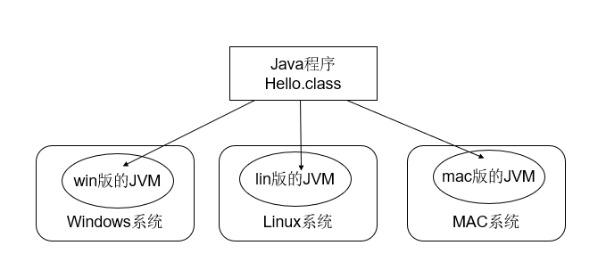
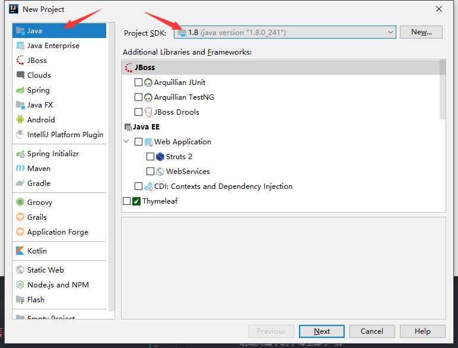
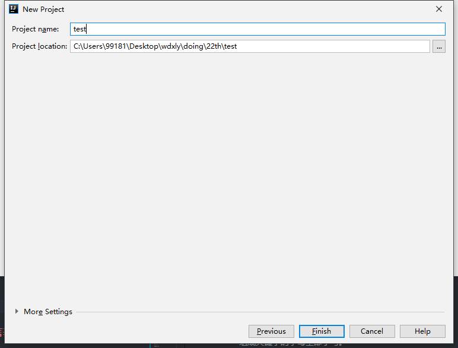
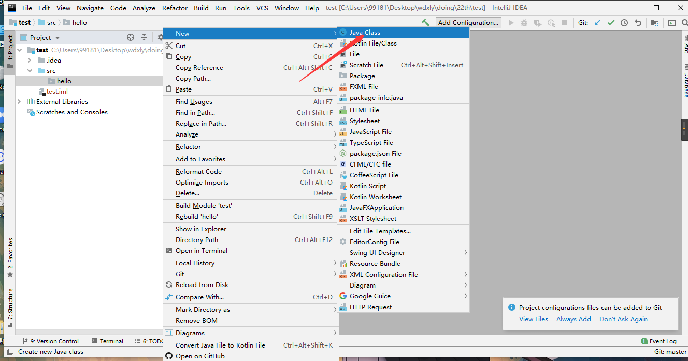
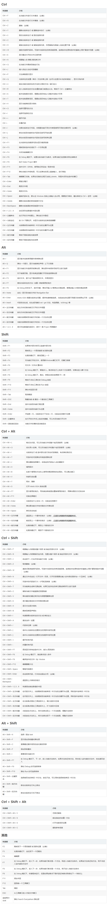

# week1

本周学习任务：  
- Java 语言介绍，JDK 的介绍，Java 开发环境配置
- 基本语法，包括关键字、标识符、常量、进制转换、数据类型、运算符、流程控制语句
- 一维数组，二维数组，多维数组
- 方法，方法重载，多态的引入
- 面向对象，类的初始化及变量作用域，类的访问控制权限，面向对象三大特性（封装、继承、多态）

## 目录

- [Java语言概述](#Java语言概述)  
  - [JAVA语言的诞生](#JAVA语言的诞生)
  - [JAVA语言的平台版本](#JAVA语言的平台版本)
  - [JAVA语言的特点](#JAVA语言的特点)
  - [JDK与JRE](#JDK与JRE)
  - [JDK的下载和安装](#JDK的下载和安装)
  - [JAVA程序运行原理](#JAVA程序运行原理)
  - [PATH和CLASSPATH环境变量](#PATH和CLASSPATH环境变量)

- [HelloWorld](#HelloWorld)  
  - [命令行](#命令行)  
  - [IDEA](#IDEA)

- [Java语言基础](#Java语言基础)  
  - [关键字](#关键字)
  - [标识符](#标识符)
  - [注释](#注释)
  - [常量](#常量)
  - [原码反码补码](#原码反码补码)
  - [变量](#变量)
  - [运算符](#运算符)
  - [三目运算符](#三目运算符)
  - [键盘录入数据](#键盘录入数据)

- [Java流程控制](#Java流程控制)  
  - [顺序结构](#顺序结构)  
  - [选择结构](#选择结构)  
  - [循环结构](#循环结构)
  - [跳转控制语句](#跳转控制语句)

- [方法和数组](#方法和数组)  
  - [方法](#方法)  
  - [递归](#递归)
  - [数组](#数组)
  - [二维数组](#二维数组)
  - [Java中的内存](#Java中的内存)

- [面向对象](#面向对象)  
  - [面向对象基本概念](#面向对象基本概念)
  - [内存里的对象](#内存里的对象)
  - [面向对象的特殊语法](#面向对象的特殊语法)
  - [修改权限修饰符](#修改权限修饰符)
  - [面向对象三大特征之封装](#面向对象三大特征之封装)
  - [面向对象三大特征之继承](#面向对象三大特征之继承)
  - [面向对象三大特征之多态](#面向对象三大特征之多态)

## Java语言概述

### JAVA语言的诞生

Java 是由 Sun 公司于 1995 年 5 月推出的 Java 面向对象程序设计语言和 Java 平台的总称。由 James Gosling 和同事们共同研发，并在 1995 年正式推出。  

### JAVA语言的发展

- JDK 1.0 (1996.1)
- JDK 1.1 (1997.2)
- J2SE 1.2 (1998.12) 
- J2SE 1.3 (2001.9)
- J2SE 1.4 (2002.2) 
- J2SE 5.0 (2004.9) 
- Java SE 6 (2006.12) 
- Java SE 7 (2011.7) 
- Java SE 8 (2014.3) 
- Java SE 9 (2017.9)
- Java SE 10 (2018.3)
- Java SE 11 (2018.9)
- Java SE 12 (2019.3)
- Java SE 13 (2019.9)
- Java SE 14 (2020.3)

### JAVA语言的平台版本

- Java SE 标准版  
  是为开发普通桌面和商务应用程序提供的解决方案。  

- Java ME 嵌入式开发  
  是为开发电子消费产品和嵌入式设备提供的解决方案。  

- Java EE 企业级开发  
  是为开发企业环境下的应用程序提供的一套解决方案。  

注：Java SE 为整个技术架构的核心。  

### JAVA语言的特点

- **跨平台**  
  Java 程序是在 Java 虚拟机上运行，而非直接运行于操作系统。因此通过 Java 语言编写的应用程序在不同的系统平台上都可以运行。  
    

- 面向对象  

- 解释型  
  编译型语言写出的代码，首先通过编译器的编译，全部转化成目标代码，然后依次在操作系统中执行。解释型语言则是转化一句，执行一句。  
  Java 编译过程：.java -> .class -> Java 虚拟机。  

- 健壮  
  提供了异常机制。  

- 动态  
  两个方面：  
  1. 在 Java 语言中，可以简单、直观地查询运行时的信息。  
  2. 可以将新代码加入到一个正在运行的程序中。  

- 分布式  
  Java 语言具有强大的、易于使用的联网能力。

- 高效  
  由于 Java 是一种解释型语言，所以它的执行效率相对就会慢一些，但由于 Java 语言采用以下两种手段，使其拥有较好的性能。  
  1. Java 语言源程序编写完成后，先使用 Java 伪编译器进行伪编译，将其转换为中间码，再解释。  
  2. Java 语言提供一种「准实时」（Just-in-Time，JIT）编译器，当需要更快速度时，Java 语言可以使用 JIT 编译器将字节码转换成机器码，然后将其缓冲下来，这样速度就会更快。

- 多线程

- 结构中立（字节码）  
  Java 编译器通过伪编译后，将生成一个与任何计算机体系统无关的「中性」的字节码。  

- **开源**

### JDK与JRE

- JRE(JAVA  Runtime Environment)  
  包括 Java 虚拟机、运行时核心类库（rt.jar）。JRE 主要是给已经写好的 Java 程序使用，换句话说 Java 程序要能在操作系统中运行，必须有 JRE。

- JDK(JAVA  Develop kit)  
  首先，JDK 包含 JRE，除此之外，JDK 中还包含一些供开发者使用的工具，比如 Javac、Javap 等。

### JDK的下载和安装

JDK8 下载地址：https://www.oracle.com/java/technologies/javase-jdk8-downloads.html 。  
建议 JDK 安装路径中不要有中文，同时当提示安装 JRE 时，可以选择不安装。

### JAVA程序运行原理

  

### PATH和CLASSPATH环境变量

PATH 环境变量是操作系统的环境属性，告诉操作系统可执行程序（javac）路径。  
官方推荐的配置 PATH 环境变量方式：  
- 先配置 JAVA_HOME 环境变量：xx\xx\xx\jdk1.8；  
  再添加 PATH 环境变量：$JAVA_HOME$\bin

CLASSPATH 环境变量是所有 *.class 文件的执行路径，给 JVM 用，告诉 JVM 到哪里加载 *.class 文件。  

## HelloWorld

### 命令行

创建 HelloWorld.java 文件，用文本编辑器打开编辑：  
```java
public class HelloWorld {
	public static void main(String[] args) {
		System.out.println("Hello World!");
	}
}  
```  
打开 cmd，进入 HelloWorld.java 文件所在的文件夹，通过 javac 命令处理 HelloWorld.java 文件后，会生成 HelloWorld.class 文件，接着用 java 命令执行 HelloWorld.class 文件即可（省略 .class 后缀）：  
  

注：如代码中包含中文，cmd 命令行下运行该代码会显示乱码。用 javac 命令时添加 `-enconding UTF-8` 即可解决。如：`javac -encoding UTF-8 HelloWorld.java`。

### IDEA

IDEA 官网地址：https://www.jetbrains.com/idea 。  

安装完成后，打开 IDEA，选择新建项目：  
  

选择创建 Java 项目，并选择 JDK 版本：  
  

不勾选：  
  

设置项目名称和存储位置：  
  

Java 代码一般存放在 src 目录下，在此新建一个包：  
  

给包命名：  
  

右击包名，在包文件夹下新建 Java 程序：  
  

给程序命名：  
  

写好代码后，右击侧边小三角，选择运行，即可在下方显示运行结果：  
  
  

**IDEA快捷键**


## Java语言基础

### 关键字  

关键字也称保留字，是被 Java 语言赋予特殊含义的单词。  

关键字的特点：
- 组成关键字的字母全部小写。  

关键字的注意事项：  
- 高级的编辑器或者专门的开发工具中，关键字会有高亮效果。
- goto 和 const 作为保留字存在，目前并不使用。

### 标识符

标识符是我们给类、接口、方法、变量等起名字时使用的字符序列。  

组成规则：由英文大小写字母、数字字符、$ 和 _ 组合。  

注意事项：  
- 不能以数字开头。
- 不能是 Java 中的关键字（保留字）。
- 区分大小写。

常见命名规则：  
- 包命名  
  单级：一个全部小写的单词；  
  多级：以域名反转的方式来命名，单词全部小写，单词以 `.` 隔开。

- 类和接口命名  
  类名使用 UpperCamelCase 风格，但以下情形例外：DO / BO / DTO / VO / AO / PO / UID 等。

- 变量和方法的命名  
  方法名、参数名、成员变量、局部变量都统一使用 lowerCamelCase 风格，必须遵从驼峰形式。

- 常量的命名  
  常量命名全部大写，单词间用下划线隔开，力求语义表达完整清楚，不要嫌名字长。 

注：Java 语言还有很多约定俗成的书写规范。如：  
- 代码中的命名均不能以下划线或美元符号开始，也不能以下划线或美元符号结束。  

- 代码中的命名严禁使用拼音与英文混合的方式，更不允许直接使用中文的方式。  
  说明：正确的英文拼写和语法可以让阅读者易于理解，避免歧义。注意，纯拼音命名方式更要避免采用。  

- 更多规则可以阅读 <a href = "https://github.com/alibaba/p3c">《阿里巴巴Java开发手册》</a>。  

### 注释

注释是指用于解释说明的文字，有助于阅读代码和项目维护。  

Java 语言的注释分类：  
- 单行注释。格式：  
  ```java
  // 这是单行注释
  ```  

- 多行注释。格式：  
  ```java
  /*
  一行
  两行
  可以很多行
  */
  ```  
  注：多行注释不能嵌套使用！

- 文档注释。格式：  
  ```java
  /**
  文档注释内容
  */
  ```

### 常量

常量是指在运行过程中，其值不会发生改变的量。

常量的分类：  
- 字面值常量  

- 自定义常量（面向对象部分讲）  

字面值常量分类  
- 字符串常量  
  用双引号引起来的内容，如："wangdao"。  

- 整形常量  
  所有整数。  
  
- 小数常量  
  所有小数。  

- 字符常量  
  用单引号引起来的内容，如：'a'，'我'。  

- 布尔常量  
  只有 true 和 false。  

- 空常量  
  只有 null。  

JAVA 中的整数型常量的表现形式：  
- 二进制  
  由 0 和 1 组成，以 `0b` 开头，比如 0b1100。

- 八进制  
  由 0~7 组成，以 `0` 开头，比如 014。

- 十进制  
  由 0~9 组成，默认 10 进制，比如 12。

- 十六进制  
  由 0\~9，A\~F(或 a\~f) 表示 0\~15，以 `0x` 开头。  

转换方式可以查看 <a href="https://github.com/guo-yaohua/wdxly/blob/master/before/README.md/#知识点整理">知识点整理</a> -> 计算机体系结构及组成原理 -> Q3 进制转换  

注：从 Java 7 开始，可以为数字字变量加下划线，如用 1_000_000（或 0b1111_0100_0010_0100_0000）表示一百万。这些下划线只是为了让人更易读。Java 编译器会去除这些下划线。


### 原码反码补码  

一个数在计算机中的二进制表示形式， 叫做这个数的机器数。   
- 原码表示法在数值前面增加了一位符号位（即最高位为符号位），正数该位为 0，负数该位为 1，其余位表示数值的大小。

- 反码的表示方法是：正数的反码是其本身；负数的反码是在其原码的基础上，符号位不变度，其余各个位取反。  

- 补码的表示方法是：正数的补码就是其本身；负数的补码是在其原码的基础上，符号位不变，其余各位取反，最后 +1（即在反码的基础上 +1）。

### 变量

变量指在程序运行期间，其值在某个范围内可以改变的量。  
理解（通过名字访问到）变量就是「一片」内存空间。  

变量定义的格式：`数据类型 变量名 = 变量值`。  

一种数据类型，表示的就是一个数据集和基于该数据集的一组合法操作。  
  
不同类型在内存中的存储大小也不同：  
| 类型 | byte | bit|
| --- | --- | --- |
| byte | 8 | 1 |
| char | 16 | 2 |
| short | 16| 2 |
| int | 32 | 4 |
| float | 32 | 4 |
| long | 64 | 8 |
| double | 64 | 8 |
| boolean | ~ | ~ |  

注：
- boolean 只有两个值：true、false，可以使用 1 bit 来存储，但是具体大小没有明确规定。JVM 会在编译时期将 boolean 类型的数据转换为 int，使用 1 来表示 true，0 表示 false。JVM 支持 boolean 数组，但是是通过读写 byte 数组来实现的。  

- 在 long 或者 Long 赋值时，数值后使用大写的 L，不能是小写的 l ，小写容易跟数字 1 混淆，造成误解。  

- 在 float 赋值时，通过数值后加 f / F，声明类型是 float 类型。没有后缀 f / F 的浮点数值默认为 double 类型。  
  事实上，只有很少的情况适合使用 float 类型。   

- 关于字符的问题  
  一个字符，只能以数值的形式保存到计算机中，一个字符对应的数值，也就是字符和字符对应的数值对应关系，即 ASCII 码表。  
  **强烈建议不要在程序中使用 char 类型，除非确实需要处理 UTF-16 代码单元。最好将字符串作为抽象数据处理类型。**

一些数据类型之间可以互相转换（JVM 默认类型转化规则）：  
- boolean 类型的值不能直接转化为其它数据类型的值
- byte，short，char -> int -> long -> float -> double
- byte，short，char 相互之间不转换，他们参与运算时都会提升为 int 类型。

强制转化目标类型格式：`变量名 = (目标类型)(被转换的数据)`。  

使用变量的注意事项：  
- 作用域  
  变量有效的时间范围，这个范围通常用 `{}` 来界定。 

- 初始化值  
  变量在使用之前，由编译器强制必须赋初值。

- 建议一行定义一个变量  
  从代码的可读性角度来考虑。

### 运算符

常用运算符有 6 类：算术运算符、赋值运算符、比较运算符、逻辑运算符、位运算符、三目运算符。  

- 算数运算符   
  | 运算符 | 功能 | 注意事项 |
  | - | - | - |
  | + | 加号 / 正号 / 字符串拼接 |
  | - | 减号 / 负号 | 
  | * | 乘号 |
  | / | 除号 | 整数相除只能得到整数（舍弃小数部分） |
  | % | 取模 |
  | ++ / -- | 自增 / 自减 | （++ 或 --）若参与运算，位置不同，效果不同 |  

  **建议不要在表达式中使用 ++，因为这样的代码很容易让人困惑，而且会带来烦人的 bug。**

- 赋值运算符  
  基本赋值运算符：=  
  复合赋值运算符：+=，-=，*=，/=，%=

- 关系运算符  
  | 运算符 | 功能 |
  | - | - |
  | == | 判断是否相等于 |
  | != | 判断是否不等于 |
  | < / > | 判断是否小于 / 大于 |
  | <= / >= | 判断是否小于等于 / 大于等于 |  

  关系运算符的结果只有两种：ture 和 flase。  

- 逻辑运算符  
  | 运算符 | 功能 |
  | - | - |
  | & | 与（AND） |
  | \| | 或（OR） |
  | ^ | 异或（XOR） |
  | ! | 非（NOT） |
  | && | 与（短路） |
  | \|\| | 或（短路） |
  
  实现两个整数的互换：
  ```java
  a = a ^ b;
  b = a ^ b;
  a = a ^ b;
  ```

- 位运算符  
  | 运算符 | 功能 | 注意事项 |
  | - | - | - |
  | << | 左移 | 空位补 0，被移除的高位丢弃 |
  | >> | 右移 | 被移位的二进制最高位是 0，右移后，空缺位补 0；最高位是 1，最高位补 1 |
  | >>> | 无符号右移 | 被移位二进制最高位无论是 0 或者是 1，空缺位都用 0 补 |
  | & | 与运算 | 任何二进制位和 0 进行 & 运算，结果是 0；和 1 进行 & 运算结果是原值 |
  | \| | 或运算 | 任何二进制位和 0 进行 \| 运算，结果是原值；和 1 进行 \| 运算结果是 1 |
  | ^ | 异或运算 | 任何相同二进制位进行 ^ 运算，结果是0；不相同二进制位 ^ 运算结果是 1 |
  | ~ | 按位取反 |  

  快速实现计算 2 乘以 8：  
  ```java
  n = 2 << 3;
  ```

### 三目运算符

格式：`关系表达式 ? 表达式 1 : 表达式 2`  
含义：如果关系表达式结果为为 true，运算后的结果是表达式 1；如果关系表达式结果为false，运算后的结果是表达式2。

### 键盘录入数据

实现键盘录入数据：  
```java
import java.util.Scanner; // 导包语句（放到 class 定义的上面）

Scanner sc = new Scanner(System.in);  // 创建对象
int x = sc.nextInt(); // 从键盘输入读取数据
```


## Java流程控制

一个 Java 程序，通常是由多条符合 Java 语法规则的语句组成的。一个 Java 程序的执行，一定意味着多条 Java 语句的执行。  
既然是多条 Java 语句的执行，执行的结果就一定与语句执行的顺序有关，同样的语句，不同的执行顺序，结果可能不同。

### 顺序结构

顺序结构描述的是 Java 语句之间，从上到下（或从左到右）依次执行的执行顺序。  

顺序结构是程序中最简单最基本的流程控制，没有特定的语法，就是按照代码书写的顺序执行。

### 选择结构

选择结构中的代码顺序和顺序结构中代码的执行顺序有明显的不同：  
- 选择结构有特定的语法规则，代码要执行具体的逻辑运算进行判断。  

- 逻辑运算的结果有两个，所以产生选择，按照不同的选择执行不同的代码。  

- Java 中，选择结构有 2 种实现形式，if 语句 和 switch 语句

if 语句实现选择结构有 3 种格式：  
- 如果，就（单分支）  
  ```java
  if (关系表达式) {
    语句体
  }
  ```  

- 非此即彼（两分支）
  ```java
  if (关系表达式) {
      语句体 1
    } else {
      语句体 2
    }
  ```

- 多选一（多分支）
  ```java
  if (关系表达式 1) {
    语句体 1
  } else  if (关系表达式 2) {
    语句体 2
  }
  …
  else {
    语句体 n+1
  }
  ```

注：在绝大部分场景下，三目运算符和 if 双分支选择结构，都可以相互替代。但是，如果选择结构执行的仅仅只是一个操作，没有返回值，此时三目运算无法替代 if 双分支选择结构。  

switch语句格式：  
```java
switch(表达式) {
  case 值 1:
    语句体 1
    break;
  case 值 2:
    语句体 2
    break;
  …
  default:	
    语句体 n+1
    break;
}
```

switch 格式解释：  
- switch 关键字：表示这是一个 switch 语句。

- switch 后的表达式：表示选择条件。

- case 语句：每个 case 语句表示一个分支。

- beak 语句：表示结束 switch 语句。

- default 语句：表示当所有其他的 case 的分支都不能匹配 switch 后表达式的值的时候，此时就会执行 default 分支。

注意事项：  
- switch 语句后，表达式结果的取值范围：byte、short、int、char、枚举、String。

- case 后面的值，不能相同，且必须是和表达式值的类型相同的常量值。

- break 在语法上可以省略，省略之后，switch 实现的就不再是多分支选择结构。

- default 语法上可以省略，但建议一般不要省略。

### 循环结构

与顺序结构和选择结构不同，循环结构的主要功能是控制 Java 语句能够重复执行。

循环结构，从语法上来讲，有 3 种实现形式：
- for 语句
- while 语句
- do while 语句  
  
不管哪种实现形式，都由 4 部分组成：  
- 初始化语句  
- 条件判断语句  
- 循环体语句  
- 循环控制语句

for 循环语句格式：
```java
for (初始化语句; 判断条件语句; 控制条件语句) {
  循环体语句
}
```

执行流程：  
  

while 循环语句格式：  
```java
初始化语句；
while (条件判断语句) {
  循环体语句；
}
```

执行流程：
  和 for 循环一模一样。

do while 循环语句格式：  
```java
初始化语句
do {
  循环体语句
} while (条件判断)
```

执行流程：  
do while 循环结构与while循环结构比，略有不同。不同之处在于 do while 中的循环体语句是在条件判断之前执行。

Java 中还有一种功能很强的循环结构，for each 循环。可以用来依次处理数组中的每个元素，而不必为指定下标值而分心。  

这种增强的 for 循环的语句格式：
```java
for (循环变量 : 数组) {
  循环体语句
}
```  
for each 中的循环变量会遍历数组中的每一个元素，且不需要下标值。

### 跳转控制语句

通过跳转控制语句可以实现对循环结构更加细粒度的控制。
- break 中断
- continue 继续 
- return 返回

break 的使用场景：
- 在选择结构的 switch 语句中：  
  结束 switch 语句。

- 在循环语句中：  
  - 跳出单层循环（如果有多层循环，只跳出内层）  
  - 带标签的跳出（多重循环）  
    格式：`标签名 : 循环语句`  
    标签名要符合 Java 的命名规则

- 离开使用场景的存在是没有意义的。  


continue 的使用场景：
  - 在循环语句中：  
    - 退出单层循环的一次迭代过程。
    - 也可以使用标签。

  - 离开使用场景的存在是没有意义的。

return 关键字不是为了跳转出循环体。更常用的功能是结束一个方法（函数），也就是退出一个方法，跳转到上层调用的方法。


## 方法和数组

### 方法

方法定义：方法就是完成特定功能的代码块（在有些其他语言中，也被成为函数）。  

方法定义的格式：  
```java
修饰符 方法返回值类型 方法名 (参数 1 类型 参数 1 名称, 参数 2 类型 参数 2 名称, ……) {
  方法体语句
  return 返回值;
}
```

格式说明：  
- 修饰符：现在暂且认为是固定的 public static  

- 返回值类型：return 返回的数据类型

- 方法名：标识符

- 参数 ：类比数学中函数的自变量，如 z = f(x, y) 里的 x，y

- 方法体：实现具体功能的语句结合

- return：跳转控制关键字

- 返回值：方法执行的到的最终结果

注：
  `return 返回值;` 这句并非必须

方法重载（overload）：  
  在同一个类中，允许存在一个以上的同名方法，只要它们的「参数个数 / 参数类型 / 参数顺序」不同。

注：方法重载与返回值类型无关，只看方法名和参数列表。即返回值不同，其它都相同不算是重载。  

### 递归

递归调用是一种特殊的调用形式，指的是方法自己调用自己的形式。递归调用必须满足两个条件：  
- 必须有结束条件；
- 每次调用必须改变传递的参数。

例：
```java
// 求阶乘

public static fac(int n) {
  if (n == 1) {
    return 1;
  }
  return n * fac(n - 1);
}
```

开发中应当避免过多的使用递归，因为处理不当，就可能造成栈溢出问题。

### 数组

数组的概念：相同数据类型的数据元素的有序（物理地址有序非元素有序）集合。  
通过一个整型下标就可以访问数组中的每一个元素。  

特点：  
- 存储多个数据元素

- 这多个数据元素的数据类型必须一致

可以存储的数据类型：  
- 基本类型数据  

- 引用类型数据

数组的定义格式：  
- 格式 1：`数据类型[] 数组名;` 

- 格式 2：`数据类型 数组名[];`  

建议使用格式 1，避免造成歧义。

数组的初始化：为数组中的数组元素分配内存空间，并为每个数组元素赋初值。Java 中的数组必须先初始化，然后才能使用。  

数组的初始化方式：  
- 动态初始化  
  初始化时只指定数组长度，由系统为数组分配初始值。  
  格式：`数据类型[] 数组名 = new 数据类型[数组长度];`  
  例：`int[]  arr = new int[3];` 。  

- 静态初始化  
  初始化时指定每个数组元素的初始值，由系统决定数组长度。    
  格式：`数据类型[][] 数组名 = new 数据类型[]{元素1,元素2,…};`  
  例：`int[] arr = new int[]{1,2,3};`  
  简化写法：`int[] arr = {1,2,3};`  
  注：简化写法只在数组定义时有效！

一旦创建了数组就不能再改变它的大小。如果经常需要在运行中拓展数组的大小，就应该使用另外一种数据结构 —— 数组列表（array list），之后会详细介绍。  

注：字符串类型的数据不是基本数据类型的数据，我们所说的一个字符串，其实是一个字符串对象，字符串对象，存储在数组中，数组中其实存储的是对象的地址值，并未直接存储字符串中的字符序列数据，而同一个 JVM中 的引用值（地址值），占用的内存大小相同。


**数组拷贝**：  
在 Java 中，允许将一个数组拷贝给另一个数组变量。这时，两个变量将引用同一个数组。

如：
```java
int[] arr2 = arr1;
arr2[3] = 5; // 这时 arr1[3] 也等于 5
```

如果希望将一个数组的所有值拷贝到一个新的数组中去，可以使用 Arrays 类中的 copyOf 方法：  
```java
int[] arr2 = Arrays.copyOf(arr1, arr1.length);
```
参数 2 确定新数组的长度，因此这个方法常用来调整数组的长度。如果 参数 2 小于原始长度，则只拷贝最前面的数据元素。

**数组操作中，常见的两个问题**：  
- 数组索引越界  ArrayIndexOutOfBoundsException

- 空指针异常 NullPointerException


### 二维数组

相对于一维数组单行多列的结构，二维数组就是一张多行多列的数据表结构。  

定义格式：  
- 动态初始化：`数据类型[][] 数组名 = new 数据类型[行的长度][列的长度];`  
  例：`int[][] arr = new int[10][10]`

- 静态初始化：`数据类型[][] 数组名 = 数据类型[][] 数组名 = {{}, {}, {}, …};`  
  简化：`数据类型[][] 数组名 = {{}, {}, {}, …};`  
  例：  
  ```java
  int[][] arr = {
    {1, 2, 3},
    {3, 4, 6},
    {7, 8, 9}
  };
  ```

注：for each 循环语句不能自动处理二维数组的每一个元素。它是按行，也就是一位数组处理的。想要访问二维数组的所有元素，需要使用两个嵌套的循环。例：
```java
for (int[] row : arr) {
  for (int value : row) {
    循环语句
  }
}
```
 
Java 实际上没有多维数组，只有一维数组。多维数组实际上是「数组的数组」。因此 Java 中可以构建不规则数组，即数组的每一行有不同的长度。   

不规则数组动态定义格式：`数据类型[][] 数组名 = new 数据类型[行的长度][];`。  
示例：
```java
int[][] arr = new int[3][];
for (int i = 0; i < arr.length; i++) {
  int[i] = new int[i + 1];
}
/*
构建了不规则数组：
{
  {长度为 1},
  {长度为 2},
  {长度为 3}
}
*/
```

### Java中的内存

一个 Java 程序在 JVM 中运行的过程中，在内存中需要保存很多种内存数据，比如局部变量、数组等。  
不同类型的数据，其使用方式和生命周期都不相同。  
为了更好的管理这些不同类型的数据，JVM 把自己的内存空间划分为不同的内存区域。各个区域针对不同类型的数据采用不同的管理方式：  
- 栈  
  功能：存储局部变量  
  初值：coder 自己赋值  
  内存管理方式：和作用域有关

- 堆  
  功能：存储关键字 new 开辟出来的东西，即保存每一个对象的属性内容。比如数组。  
  初值：天然有初值  
  - 整型：0
  - 浮点型：0.0
  - 字符型：'\u000'
  - 布尔型：false
  - 引入数据类型：null  

  内存管理方式：和作用域无关

- 方法区

- 本地方法区

- 程序计数器  
  功能：指明代码执行的位置。

个人理解：  
当定义一个变量，如 `int a = 1` 时，栈是先开辟地址，这个地址存放值 1，然后让变量名 a 指向这个地址。如果又定义了新的变量等于这个值，如 `int b = 1`，那直接让新的变量名 b 也指向这个地址。如果修改新的变量值，如 `b = 2`，并不会修改这块地址的值（即 a 依旧为 1），而是重新指向一块值为 2 的地址（如果没有，就再开辟一块地址，令值为 2）。如果变量都离开了作用域，即没有变量指向这块地址，就把这块地址回收。  
堆是申请一片地址，数组名指向这个地址。修改数组，就直接修改这块地址的数据。


## 面向对象

### 面向对象基本概念

面向过程的思想：简单理解就是程序是「动词」的集合，即程序功能是由一系列有序的动作来完成。
    
面向对象的思想：简单理解就是程序是由一系列的对象（消息）+ 消息组成，即程序是由一系列的对象和对象间的消息组成。  
  - 运行中的程序，由多个个体（也就是对象）组成。
  - 运行中的个体，需要相互协作，共同完成程序的功能。

要想写出面向对象的程序，首先要学会构建**面向对象程序的基本组成单位 —— 对象**。  

类：同种物体在属性和行为上的集合与抽象，是构造对象的模板。

类和对象的关系：
- 类描述出了，该种类型对象共有的属性和行为。

- 类描述了，对象有哪些属性，具备哪些行为（包括行为的具体实现）。

- 但是各个对象的属性取什么值，只有具体的对象能确定。

Java 语言中定义类，其实就是定义类的成员（成员变量和成员方法）：  
- 成员变量：就是事物的属性。  
  成员变量和局部变量定义的位置不同，成员变量定义在方法体之外。

- 成员方法：就是事物的行为。  
  之前学的方法的修饰符都是 public static，修饰符中去掉 static 修饰符的方法就是成员方法。

例：  
定义一个学生类：  
- 属性（成员变量）：姓名，性别，年龄，学号
- 行为（成员方法）：吃饭，睡觉，学习  

有了类定义，我们就有了对同种类型的对象的描述，我们就可以创建学生对象了
- 创建对象：`类名  对象名 = new 类名();`

- 给对象的属性赋值, 或者访问对象的属性：`对象名.成员变量;`

- 访问对象的行为：`对象名.成员方法;`

成员变量：定义在类体中，方法体之外的变量。

局部变量和成员变量的比较：
- 在类中定义的位置不同。

- 在内存中的位置不同。  
  1. 局部变量，都是存储在方法对应的栈帧中的；
  2. 成员变量，存储在堆上，在对象的内存中。

- 初始化值不同。  
  1. 局部变量，局部变量没有天生的初始值，必须在使用之前，用代码初始化成员变量的值。
  2. 成员变量，成员变量存储在堆上的，堆上的成员变量，天然有默认初值。

- 生命周期不同。
  1. 因为局部变量是存储在栈帧中的，因此，随着栈帧的存在而存在，随着栈帧的销毁而销毁。
  2. 成员变量是在堆上的。在对象的内存空间中，成员变量随着对象的存在而存在，随着对象的销毁而销毁。

### 内存里的对象

类本身属于引用数据类型，对于引用数据类型的执行分析，必须结合内存操作来看。
- 堆内存保存每一个对象的属性内容，堆内存需要用关键字 new 才可以开辟，如果一个对象没有对应的堆内存指向，将无法使用；  

- 栈内存保存的是一块堆内存的地址数值，可以把它想象成一个 int 类型变量（每一个 int 类型变量只能存放一个数组），所以每一块栈内存只能够保留一块堆内存地址。

对象的内存图解：  


### 面向对象的特殊语法

**（1）构造方法**  

构造方法的作用就是使得 JVM 在构造对象的时候，进行成员变量的初始化。  
其定义的原则是：  
- 方法名称与类名相同；
- 没有返回值类型声明；
- 数构造方法可以进行重载。  

当我们没有在类中定义任何一个构造方法的时候，JVM 会自动添加一个默认的构造方法（无参构造方法）。但是，一旦我们自己在类定义中，定义了哪怕只有一个构造方法，JVM 就不会再自动帮我们添加那个无参构造方法了。
- 这和 JVM 执行固定流程有关系：  
  开辟对象的存储空间 -> 给对象成员变量赋予默认初值 -> 使用构造方法，初始化对象成员变量的值

构造方法何时执行：
由 JVM 在创建对象的最后一步，执行构造方法，给对象的成员变量赋予 Coder 传递的初值。


**（2）this关键字**  

成员变量的隐藏问题：当方法中定义了和类中同名的成员变量时，在方法体中，通过同名的变量名来访问变量值，只能访问到方法中的那个局部同名变量的值，而访问不到，同名成员变量的值。  
在方法体中，就好像同名成员变量，被同名局部变量给隐藏起来了。

this 关键字：代表对象自身的引用。  
- 在构造方法中的 this，指代的当前对象，其实就是，构造方法执行时，JVM 正在创建的那个对象。

- 对于普通成员方法而言，this 指代的对象 `对象名.方法()` 指的是对象名对应的对象。  

this 关键字的作用：
- 解决成员变量的隐藏的问题。

- 访问对象的成员（访问当前对象的成员变量值，访问当前对象的成员方法）。

- 访问对象的构造方法。
  1. 只能在某个构造方法体中使用 this 调用构造方法；
  2. 必须处在该构造方法体的第一条语句的位置。

**（3）static关键字**  

static 关键字：可以修饰成员变量和成员方法。  
按照严格意义上的面向对象思想，static 修饰的成员变量和成员方法都不能算做类中定义的成员。我们之所以称 static 修饰的变量为静态成员变量、方法为静态成员方法，这是习惯上的称呼。

static 关键字的特点：  
- 被类的所有成员所共享（这点判定是否使用 static）。   
  1. 当 static 修饰了成员变量，该成员变量的值就不存在其存储对象中，而是单独存储一份，被类的所有对象所共享；  
  2. 当 static 修饰成员方法时，该方法被当前类的所有方法共享。

- 可以通过类名访问。  
  1. 可以通过类名直接访问 static 成员变量的值；  
  2. 通过类名直接调用 static 成员方法。

- 随着类的加载而加载。  
  1. static 成员变量，随着类加载过程，其实就已经在方法区中，分配了内存；
  2. static 成员方法, 一旦类加载完毕，就可以直接访问，而不必等待创建对象，然后再用 `对象名.访问方法` 的方式。

- 优先于对象而存在。  
  - 不依赖于对象而存在。  
     1. 成员变量的角度来理解：  
     static修饰的成员变量，不依赖于对象而存在，因为static修饰的成员变量的值，不再存储在该类的每个对象中。  
     作为对比，没有被static修饰的成员变量，都依赖于对象而存在，因为他们的值，都存储在对象中

     2. 成员方法角度：  
     被 static 修饰的成员方法，在没有对象存在的情况下，也可以直接通过类名来调用方法。  
     作为对比，没有被 static 修饰的普通成员方法，它依赖于对象而存在。原因是普通成员方法中，可以访问普通成员变量的值，而普通对象的值又是依赖于对象而存在的。

  - 先出现在内存。  
    静态成员变量， 一定先于没有被 static 修饰的普通成员变量，出现在内存中。


static 关键字注意事项：  
- 非静态成员变量（非静态的成员方法）不能在静态上下文（静态方法的方法体）中被访问。  
   1. 因为静态方法，优先于对象而存在。  
      我们可以在没有任何对象存在的情况下，可以直接通过类名执行静态方法，所以静态方法是访问不到当前对象的普通成员变量值（因为此时，当前对象不存在）。

    2. 之所以静态方法方法体中，不能访问非静态的成员方法，是因为，如果静态方法可以直接调用非静态的的方法，而非静态的方法可以去访问当前对象的成员变量值，而当前对象，此时可能还不存在。

- 静态方法的方法体中是没有 static 关键字的。

- 静态方法的使用场景：  
  静态方法和非静态方法除了访问方式不同，最大的区别就是静态方法可以访问到的数据集合（静态方法方法体中，不能直接访问非静态的成员变量）。所以通常静态方法所访问的数据要么是静态的成员变量，要么是方法的形式参数。  
  通常定义静态方法都是为了方便使用该方法的功能（工具方法），使其不用创建对象就可以使用。


**（4）代码块**  

在 Java 中，使用 `{}` 括起来的代码被称为代码块，根据其位置和声明的不同，可以分为局部代码块、构造代码块、静态代码块、同步代码块(多线程讲解)。  

局部代码块（开发中不会用）：方法体中的用 `{}` 括起来的一段代码。  
- 执行时机：随着方法的执行而执行。  

- 优点：限定变量生命周期，及早释放，提高内存利用率。  
  （这个优点理论上确实存在，但是这个优点，在现在 JVM 中的效果微乎其微，甚至可以忽略不计）

注：在嵌套的代码块中，不能定义同名变量。

构造代码块：类中方法外 `{}` 包含的代码。  
- 执行特征：创建对象的时候执行。  
  注：构造方法和构造代码块，都是在创建对象的时候执行，但是构造代码块先执行，构造方法后执行。

- 构造代码块的使用场景：
  1. 可以把多个构造方法方法中相同的代码提取放到构造代码块中；
  2. 可以用构造代码块来初始化对象的成员变量的值。  
  注：成员变量初始化语句和构造代码块的执行顺序按顺序结构。  

静态代码块：类中方法外，被 static 修饰。  
- 执行特征：随着类加载而执行，所以静态代码块还有一个特征 —— 至多执行一次。


**（5）package关键字**  

在 Java 源程序文件的第一行使用 package 声明，可以使文件中定义的类成为指定包的成员。  

声明语法：`package 包名;`。  

包名通常由多个名字字符串构成，中间用 `.` 分隔。每个名字表示的包称为其前面的名字表示的包的子包。  

通常以组织机构的域名反转形式作为其所有包的通用前缀，比如：`com.somecompany.apps`

注：Java 中定义的任何一个类，都是在某一个包下的。如果代码没声明所属的包，此时类会在 Java 中的一个默认包中。

**（6）import关键字**  

在类名前面加上类所属的包名，中间用 `.` 分隔，称为类的完全限定名（Full Qualified Name），简称类的限定名。  

当在类体中使用了与当前类不同包的类名时，编译器编译时会因为无法找到该类的定义而报错。对此有两个解决办法：  
1. 使用不同包类的完全限定名；
2. 使用 import 声明，为编译器提供该类的定义信息。

声明语法：`import <类的完全限定名>;`。  

注：
- import 声明一般紧跟在 package 声明之后，且必须在类声明之前。

- Java 语言核心包 java.lang 包中的类将被隐式导入，可以直接使用其中的类。

- import 声明提供了一种包的智能导入方式：`import <包名>.*;`。包中的类将根据需要导入，避免使用多条 import 声明。  
  注：智能导包（不会递归导入子包中的类）且按需导入。  


### 访问权限修饰符

在 Java 语言中，一切事物（类所有成员）都具有（或显示定义或隐式定义的）访问权限，而这种语言层面的访问权限控制，是由访问权限修饰符实现。  

访问权限修饰符的访问控制，分为 2 个层面：
- 修饰类中成员（field & method）  
  控制类中的成员，对其他类可见性（其他类是否可以直接使用到）。

- 修饰类  
  通常用来限定类库中的类（自定义数据类型），对于外部使用者的可见性（是否能使用该类型）。

修饰类中成员可以使用的访问权限修饰符有 4 种：
- public：任意类均访问，实际就是没有限制访问权限。  
  1. 类体中，可以直接访问；
  2. 同包的其他类中，也可以访问；
  3. 不同包的的类中，也可以访问。

- protected：同包中的其他类，和不同包的（可见）子类均可见。
  1. 类体中，可以直接访问；  
  2. 同包其他类中，可以访问；  
  3. 在非同包的一部分类中，访问不到（有一部分子类中可以访问到：父类中被 protected）。

- default：默认权限，隐式定义。
  1. 类体中，可以直接访问；
  2. 同包其他类中，可以访问；
  3. 不同包的类中，访问不了。

- private：仅对同类中的其他成员可见。  
  使用户不要触碰他们「不该」触碰的代码（private），类库设计者可以安全的修改实现细节。
  1. 类体中，可以访问
  2. 同包其他类中，无法访问
  3. 非同包中，无法访问  

针对 private 成员变量，专门定义 public 的方法，让外部能够访问私有成员变量的值。
- get：让外部读取到私有成员变量值
- set：让外部通过该方法，修改私有成员变量的值

同时，为了清楚的表名 get 和 set 分别获取和改变的是哪个成员变量的值，命名规则为：
`getXxx()`、`setXxx(修改目标值参数)`。

提供 get，set 方法的好处：
-  可以满足某些场景下，需要访问私有成员变量值的需求。

-  通过定义 get 和 set 方法来实现对私有成员变量的读写分离。

-  一旦一个成员变量被 private 修饰，别人就无法直接通过 `对象名.成员变量` 访问，只能通过 `set()` 此时我们在 set 方法中，就可以通过代码控制别人的修改。

各权限修饰符对成员的可见性的影响：  
| | public | protected | default | private |
| - | - | - | - | - | 
| 同一类 | √ | √ | √ | √ |
| 同包子类 / 其它类 | √ | √ | √ | |
| 不同包子类 | √ | √ |  |  |
| 不同包其它类 | √ |  |  |  |  


能够修饰类的访问权限修饰符只有 2 种：
- public：对其他任意类可见。  
  任何其他地方都可以访问到这个类（同一个 module 下），比如：同包中的其他类以及非同包的其他类。

- default：对同包中的其他类可以访问，非同包的类不可访问。


### 面向对象三大特征之封装

封装是一种信息隐藏技术，是指将数据和基于数据的操作封装在一起。  
数据被保护在内部，系统的其他部分只有通过在数据外面的被授权的操作才能够进行交互。  
目的在于将类使用者 class user 和类设计者 class creator 分开。  

在面向对象的编程中，用类来封装相关的数据和方法，保证了数据的安全和系统的严密性。

```
类
  成员变量（一定要考虑访问权限）

  构造方法
    无参构造方法
    带参构造方法

  成员方法
    getXxx()
    setXxx()
```
给成员变量赋值的方式：
-  无参构造方法 + setXxx()；
-  带参构造方法。

### 面向对象三大特征之继承

Java 中的继承和我们现实生活中的「继承」的含义基本类似，但是含义更广。
- 简单来说都可以表示「不劳而获」（类似于现实世界中继承的含义）。

- 类型之间「is a」的关系：一种类型（类）继承另外一种类型（类）。

被继承的类称之为父类（基类或超类），继承其他类的类称之为子类（派生类，导出类）。

子类可以通过继承机制，不写任何额外代码就可以拥有父类的「所有」成员。

继承的语法：`class 子类名 extends 父类名 {}`。  

继承的优点：
- 代码复用（方法，类）。

- 提高了代码的可维护性（这是一把双刃剑）。

- 弱化 Java 中的类型约束（多态的前提）。

继承的缺点：父类的修改可能会出现在所有子类中（我们无法选择这些修改可以反应在哪些子类中，不可以反应在哪些子类中）。

Java 继承的特点：在 Java 中只能实现单重继承。  
单重继承：简单来说 Java 的 extends 关键字后只能跟一个。当然这并不意味着一个 Java 类只能继承某一个类的成员（可以间接继承）。
```java
class SubDemo extends Demo{} //ok
class SubDemo extends Demo1,Demo2{} //error
```

继承的注意事项：  
- 子类只能访问父类所有非私有的成员（成员方法和成员变量）。

- 子类不能继承父类的构造方法。


结合面向对象相关知识，子类继承父类，于是子类拥有了父类的成员，同时，子类本身又可以定义属于自己的成员，这样一来一个子类对象中包含的数据，其实由两部分组成：  
- 父类包含的可继承的成员（成员变量和成员方法）。

- 子类中自己定义的成员。

一旦子类继承了父类，那么在创建子类对象、初始化子类对象的过程、子类对象的初始化过程和之前相比也会有较大的不同。  
根本原因在于子类对象初始化时要初始化父类对象和子类对象两部分数据，而且父类对象（即父类成员部分）都应该先于子类对象（即子类中自己定义的成员部分）而被初始化。  
这种优先关系可以从 2 个角度去理解：  
- 直觉：儿子能继承父亲的前提是，父亲先存在。

- JVM：子类成员变量的初始化可能依赖于父类成员。

在 Java 语言中，子类对象的初始化有两种，隐式初始化和显式初始化。
- 隐式初始化  
  当父类提供了默认的构造方法且子类的构造方法中没有显式调用父类的其它构造方法时，在执行子类的构造方法之前会自动执行父类的构造方法。  

- 显式初始化  
  通过 super 关键字。
  

super 关键字：this 代表当前这个对象，代表对象的内存空间标识（当前类定义的内容）。super 代表对象的内存空间的标识（父类定义的内容）。

用法：  
- 访问成员变量：`super.成员变量`

- 访问构造方法：`super(实参列表)`

- 访问成员方法：`super.成员方法()`

父类域的隐藏：如果在子类中定义了和父类同名的成员变量，则在子类类体中，通过同名变量名访问到的是子类中定义的成员变量。看起来就好像父类成员变量在子类中被隐藏。

注：
- 在父类方法的方法体中，通过同名成员变量的名访问到的是父类中定义的成员变量。

- 通过 super 关键字也可以在子类对象中访问到父类中的同名成员变量。

方法覆盖的问题：当子类中定义了和父类「一模一样」的方法，在子类方法体中，访问到的是子类中定义的方法。如果我们在父类方法的方法体中，访问那个「一模一样」的方法，访问到的仍然是子类中的方法。即当子类父类定义「一模一样」的方法时，子类方法覆盖父类方法。  

方法覆盖发生的条件「一模一样」主要看的是子类和父类的方法声明部分：访问权限、返回值、法签名。
- 方法声明的访问权限的条件  
  并非子类和父类方法的访问权限要相同，只要子类方法的访问权限不小于父类方法的访问权限。

- 方法返回值
  - 基本数据类型的方法返回值：子类必须和父类相同。

  - 引用数据类型  
    子类父类返回值类型相同；  
    或子类方法返回值类型是父类方法返回值类型的子类类型（因为可以把子类类型看做是父类类型）。

- 方法签名  
  子类方法的方法签名必须和父类一样。

方法覆盖的使用场景：当子类继承父类之后，想要修改父类的方法，就可以使用方法覆盖。

注：  
- 父类中私有方法不能被重写。

- 静态方法不能被重写！！

final 关键字：final 是最终的意思，可以修饰类，变量，成员方法。  
- 修饰类，类不能被继承。

- 修饰变量，变量就变成了常量，只能被赋值一次。  
  - 对于局部变量而言，如果被 final 修饰，那么该变量必须在使用之前赋值，而且只能赋值一次。

  - 对于成员变量而言，如果被 final 修饰，必须在对象创建完毕之前，给对象的该成员变量值赋值一次。

- 修饰方法，方法不能被重写（override）。

final 修饰变量时分为 2 种情况：  
- 修饰成员变量：必须在定义时初始化。

- 修饰局部变量：可以在定义时初始化，也可以选择在构造方法中进行初始化。


### 面向对象三大特征之多态  

多态：某一个事物在不同时刻（或条件下）表现出来的不同状态。  
Java 语言中的多态：同一个对象的行为在不同的时刻或条件下表现出不同的效果。

要实现多态的效果有前提条件：
1. 继承；
2. 要有方法覆盖；
3. 父类引用指向子类对象（对象有时也称之为实例）。

父类引用指向子类对象，去访问子类对象中的成员时（多态的特征）：
- 成员变量：编译看左边，运行看左边。  
  通过引用变量访问到的子类成员的范围，是由引用类型来决定的。

- 成员方法：编译看左边，运行看右边。  
  通过引用变量访问到的方法，是由引用实际指向的对象来决定的。

多态的好处：
- 提高了程序的维护性（由继承保证）。

- 提高了程序的扩展性（由多态保证）。

多态的弊端：
- 不能访问子类特有功能。  
  通过多态的转型可以解决。

多态中的转型：  
- 向上转型：从子到父，即父类引用指向子类对象。  
  注意：向上转型，是 Java 语言天生就允许的。

- 向下转型：从父到子，即父类引用转为子类对象的引用。  
  注意：向下转型是不安全的，因此 Java 语言默认不允许向下转型。但是通过 instanceof 关键字可以做到安全的向下转型。
  
instanceof 关键字：instanceof 关键字的作用是判断其左边对象是否为其右边类的实例，返回 boolean 类型的数据。可以用来判断继承中的子类的实例是否为父类的实现。  

语法：`对象名 instanceof 类名`。