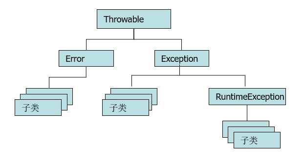

# week2

本周学习任务：  
- 抽象类及接口
- 内部类，匿名内部类
- Java 常见 Object 及 String 类
- 异常、异常分类、异常处理、自定义异常
- 多线程概述、实现方案、线程调度和线程控制、线程生命周期、线程同步、线程锁、死锁问题、线程间通信、生产者消费者问题等
- Java 文件的常见操作

## 目录

- [抽象类及接口](#抽象类及接口)  
  - [抽象类](#抽象类)
  - [接口](#接口)
- [内部类和匿名内部类](#内部类和匿名内部类)  
  - [内部类](#内部类)
  - [匿名内部类](#匿名内部类)
- [Object类和String类](#Object类和String类)  
  - [Object类](#Object类)
  - [String类](#String类)
- [Java异常](#Java异常)  
  - [异常概述](#异常概述)
  - [异常分类](#异常分类)
  - [JVM默认的异常处理](#JVM默认的异常处理)
  - [Java的异常处理机制](#Java的异常处理机制)
  - [异常的抛出](#异常的抛出)
  - [finally](#funally)
  - [自定义异常](#自定义异常)
- [File类](#File类)  
  - [File类概述](#File类概述)
  - [File类的构成方法](#File类的构成方法)
  - [File类的成员方法](#File类的成员方法)


## 抽象类及接口

### 抽象类

抽象类：在普通类的结构里面增加抽象方法的组成部分。  
抽象方法：没有方法体的方法。
- **抽象类和抽象方法必须用 abstract 关键字修饰。**
  ```java
  abstract class 类名 {}    // 抽象类
  public abstract void 方法名();    // 抽象方法
  ```  

- 抽象类不一定有抽象方法，有抽象方法的类一定是抽象类。

- 抽象类不能直接实例化，不过可以间接实例化：`抽象类类型 引用 = new 具体子类();`。  

- 抽象类的子类可以是抽象类，也可以是具体类。

抽象类的成员特点：  
- 构造方法：同普通类。

- 成员变量：同普通类。

- 成员方法：可以是抽象方法，也可以是非抽象方法。  
  一个不包含抽象方法的抽象类的意义：
  - 虽然不包含抽象方法，但是依然无法直接使用它（new 该类型的对象）。  
  - 如果别人使用你定义的抽象类，就必须自己定义一个子类继承抽象类。此时可能就会查看抽象类的定义，你在抽象类中的注释就会提示代码的使用者，哪些方法适用哪些场景。

注：代码中永远是通过多态调用子类覆盖抽象父类来使用 abstract 定义的抽象方法，而被 private，final，static 关键字修饰的方法都不能在子类中被覆盖，因此 private，final，static 这三个关键字不能和 abstract 共存。

### 接口

如果一个类只是由抽象方法和全局常量组成的，在这种情况下通常不会将其定义为一个抽象类，而是定义为接口。所以所谓的接口严格来讲就属于一个特殊的类，这个类里面只有抽象方法和全局常量。  
注：接口不是类！而是对类的一组需求描述，这些类要遵从接口描述的统一格式进行定义。  

接口用关键字 interface 定义，格式：`interface 接口名 {}`。  

在 Java 语言中 interface 也可以表示一种数据类型。
- 类和接口都可以用来表示数据类型（类和接口是地位对等的），只不过他们的侧重点不一样。

- 操作（行为）描述：  
  类定义的是一个数据集合基于这个数据集的一组操作（行为），类所描述的这一组行为，它们是有关系的（间接），都可以访问同一个数据集合。  

  接口表示数据类型，侧重于描述一组具有特殊功能的行为。这些行为可以完全没有任何关系。

类和接口可以有实现关系（类可以实现接口），这种实现关系其实是一种实质上的继承关系。  
类实现接口用 implements 表示，格式：`class 类名 implements 接口名 {}`。  

接口的原则：  
- 接口不能直接实例化。

- 接口的子类可以是抽象类也可以是具体类。

接口的特点：  
- 无构造方法。

- 成员变量：只能是常量，修饰符 public static final。

- 成员方法：只能是抽象方法，修饰符 public abstract。

- 接口与接口之间可以实现多重继承；  
  一个类也可以实现多个接口，一个考虑接口的比较完整的类定义语法：  
  ```java
  class 类名 extends 父类 implements 接口 1, 接口 2... {

  }
  ```

抽象类和接口的比较：
- 成员区别  
  抽象类：变量、抽象方法、非抽象方法；  
  接口：常量、抽象方法。  

- 关系区别  
  类与类：继承、单继承；  
  类与接口：实现、单实现、多实现；  
  接口与接口：继承、单继承、多继承。  

- 设计理念区别  
  抽象类：被继承体现的是共性功能。  
    - 抽象类可以被其他类继承，而且子类只能 extends 一个类
    - 抽象被子类继承之后，子类和抽象类的关系是「is a」。  
  
  接口：被实现体现的是扩展功能。  
    - 一个类可以同时多个接口。
    - 类实现接口之后，类和接口的关系用「like a」来描述。

从 JDK8 开始，接口中可以定义两种特殊的方法，这两种方法可以有方法体，默认的访问权限都是 public。
- 默认方法：它就是一种折中，通过添加默认方法的方式修改接口。不会对已经实现接口的其他类造成影响。

- 静态方法：作为工具方法来使用。  


## 内部类和匿名内部类

### 内部类

在 Java 语言中类可以嵌套定义。  
内部类：定义在其他类内部的类就称为内部类。约定：把包含内部类的类，称之为外部类。  
注：内部类之所以存在，是为了方便外部类的操作。

内部类的访问特点：  
- 内部类可以直接访问外部类的成员，包括私有。

- 外部类要访问内部类的成员，必须创建对象。

按照内部类在类中定义的位置不同，可以分为如下两种格式：  
- 成员位置（成员内部类）
- 局部位置（局部内部类） 

成员内部类
- 成员内部类的定义位置：外部类的成员位置。  
  如果将内部类看做一个整体，对于外部类而言成员内部类就类似于一个成员变量或成员方法的一个普通成员。所以成员内部类在静态上下文中也无法访问非静态的成员。

- 成员内部类对象的实例化语法：`外部类.内部类 对象 = new 外部类().new 内部类();`。  

- 成员内部的常见修饰符：  
  - private：保证成员位置内部类只对其外部类可见
  
  - static：一旦被 static 修饰，那么整个成员内部类就有了静态的访问特征：  
    普通成员内部类依赖于外部类对象而存在。创建普通成员内部类的语法：`外部类.内部类 对象 = new 外部类().new 内部类();`。  
    静态成员内部类作为外部类的一个静态成员，不再依赖于外部类对象而存在。创建静态成员内部类的语法：`外部类.内部类 对象 = new 外部类.内部类();`

局部内部类
- 局部内部类的定义位置：方法体内。

- 局部内部类的特征：可以创建内部类对象，通过对象调用内部类方法，来使用局部内部类功能。  
  
  注：所以局部内部类可以访问方法体中局部变量。但是，被局部内部类对象访问的局部变量必须被 final 关键字修饰。  
  这是因为局部内部类对象与局部变量的生命周期冲突：  
  - 局部变量的生命周期，随着方法的执行结束，即栈帧销毁，其从内存中消失。

  - 局部内部类对象存储在堆上，对象的销毁和方法栈帧没有直接关系。  

  - 简单来说就是方法运行结束后，局部变量不存在了，但是对象还在。因此要想继续正常使用局部内部类对象，就要将被其访问的局部变量用 final 关键字修饰。


### 匿名内部类

不管是成员或局部位置内部类，要使用内部类都分成了 2 步：  
- 定义内部类
- 创建内部类对象

通过定义匿名内部类对象，可以将上面的 2 步变为 1 步。前提：存在一个类（可以是具体类也可以是抽象类）或者接口。    

匿名内部类语法：
```
new 类名或者接口名() {
  方法覆盖
}
```

本质：是一个继承了类或者实现了接口的子类匿名对象。

特征：匿名内部类对象只能在被创建的时候被访问一次。


## Object类及String类

### Object类

Object 类是所有类的父类，也就是说任何一个类在定义时如果没有明确地继承一个父类，那它就是 Object 类的子类。  
- 每个类都使用 Object 作为超类。  
  在设计代码时，如果不确定参数类型，可以使用 Object 类。因此它可以通过向上转型来接收全部类的对象。  

- 所有对象（包括数组）都有这个类的方法。

Object() 类：
```java
// 构造方法
public Object();  // 因此所有类都会有一个默认的无参构造方法

// 常见成员方法
public final Class getClass();
public String toString(); // 取得对象信息
public boolean equals(Object obj);  // 对象比较
public int hashCode();  // 取得对象哈希码
protected Object clone();
protected void finalize();  // 了解即可
```

**（1）getClass()**  

getClass() 返回此 Object 的运行时类。返回的 Class 对象是由所表示类的 static synchronized 方法锁定的对象。   

每个类对应对应的字节码文件内容，被加载到方法区之后，就会创建一个 Class 对象（该对象的包含该类，类定义信息）。  
Class 对象代表一个类，表示的就是所有类的共性：
- 构造方法
- 成员变量
- 成员方法

**（2）toString()**  

toString() 返回该对象的字符串表示。  
通常 toString 方法会返回一个「以文本方式表示」此对象的字符串。结果应是一个简明但易于读懂的信息表达式。建议所有子类都重写此方法。  

该字符串由类名（对象是该类的一个实例）、标记符（@）和此对象哈希码的无符号十六进制表示组成。换句话说，该方法返回一个字符串，它的值等于：`getClass().getName() + '@' + Integer.toHexString(hashCode())`。

**（3）equals()**  

equals 方法用于检查一个对象是否等于另一个对象。在 Object 类中，这个方法将判断两个对象是否具有相同的引用。  
格式：`对象.equals(比较对象)`。  

equals 方法在非空对象引用上实现相等关系： 
- 自反性：对于任何非空引用值 x，x.equals(x) 都应返回 true。 

- 对称性：对于任何非空引用值 x 和 y，当且仅当 y.equals(x) 返回 true 时，x.equals(y) 才应返回 true。 

- 传递性：对于任何非空引用值 x、y 和 z，如果 x.equals(y) 返回 true，并且 y.equals(z) 返回 true，那么 x.equals(z) 应返回 true。 

- 一致性：对于任何非空引用值 x 和 y，多次调用 x.equals(y) 始终返回 true 或始终返回 false，前提是对象上 equals 比较中所用的信息没有被修改。 

- 对于任何非空引用值 x，x.equals(null) 都应返回 false。 

Object 类的 equals 方法实现对象上差别可能性最大的相等关系；即，对于任何非空引用值 x 和 y，当且仅当 x 和 y 引用同一个对象时，此方法才返回 true（x == y 具有值 true）。 

**（4）hashCode()**  

返回该对象的哈希码值。支持此方法是为了提高哈希表（例如 java.util.Hashtable 提供的哈希表）的性能。   

hashCode 的常规协定是： 
- 在 Java 应用程序执行期间，在对同一对象多次调用 hashCode 方法时，必须一致地返回相同的整数，前提是将对象进行 equals 比较时所用的信息没有被修改。从某一应用程序的一次执行到同一应用程序的另一次执行，该整数无需保持一致。 

- 如果根据 equals(Object) 方法，两个对象是相等的，那么对这两个对象中的每个对象调用 hashCode 方法都必须生成相同的整数结果。 

- 如果根据 equals(java.lang.Object) 方法，两个对象不相等，那么对这两个对象中的任一对象上调用 hashCode 方法不 要求一定生成不同的整数结果。但是，程序员应该意识到，为不相等的对象生成不同整数结果可以提高哈希表的性能。 

实际上，由 Object 类定义的 hashCode 方法确实会针对不同的对象返回不同的整数。  
这一般是通过将该对象的内部地址转换成一个整数来实现的，但是 Java 编程语言不需要这种实现技巧。  


**（5）clone()**  

创建并返回此对象的一个副本。「副本」的准确含义可能依赖于对象的类。

对于任何对象 x，表达式：
- `x.clone() != x` 为 true。  
  说明 clone 创建了一个新的对象。

- `x.clone().getClass() == x.getClass()` 为 true。  
  说明 clone 创建的对象和原对象是同一个类的对象。

- `x.clone().equals(x)` 为 true。  
  说明复制对象和原对象的内容（成员变量值）也相同。  

注：被 clone() 方法复制的对象，所属的类必须实现一个接口 Cloneable。  

Cloneable 接口是个空接口。
```java
public interface Cloneable {
}
```
空接口也被称之为标记接口：做标记（数据类型层面的标记）。比如说对于 clone 方法而言，Cloneable 就是一个标记，因为 clone 只会复制，实现类了 Cloneable 接口的类的对象。  
利用 instanceof 运算符判断：`对象  instanceof  Cloneable`。

浅拷贝（Shallow Clone）：被复制对象的所有变量都含有与原来对象相同的值，而所有对其它对象的引用仍然指向原来的对象。换而言之，浅拷贝仅仅复制所考虑的对象，而不复制它所引用的对象。  

深拷贝（Deep Clone）：被复制对象的所有变量都含有与原来对象相同的值，除去那些引用其它对象的变量。那些引用其它对象的变量将指向被复制的新对象，而不再是原有的那些被引用的对象。换而言之，深拷贝把复制的对象所引用的对象都复制了一遍。  

**（6）finalize()**  

当垃圾回收器确定不存在对该对象的更多引用时，由对象的垃圾回收器调用此方法。子类重写 finalize 方法，以配置系统资源或执行其他清除。  

finalize 的常规协定是：当 JVM 已确定尚未终止的任何线程无法再通过任何方法访问此对象时，将调用此方法，除非由于准备终止的其他某个对象或类的终结操作执行了某个操作。  
finalize 方法可以采取任何操作，其中包括再次使此对象对其他线程可用；不过，finalize 的主要目的是在不可撤消地丢弃对象之前执行清除操作。

比如：当我们要执行一些 IO 或者是网络通信的功能的时候，JVM 是借助操作系统的内核完成的，所以执行这些功能时，Java 程序需要占用一定的操作系统资源，当程序使用完操作系统资源的时候，即时释放资源。当使用资源的对象变成垃圾，才能安全的释放系统资源。  
finalize 方法刚刚好就是在对象变成垃圾，并且被垃圾回收器回收的时候会调用这个方法。但是回收时机不确定。


### String类

Java 没有内置的字符串类型，而是标准 Java 类库中提供了一个预定义类 String。每个用双引号括起来的字符串都是 String 类的一个实例。  
```java
// 构造方法

public String() // 空字符串 ""

/* 利用字节数组，创建字节数组所表示的字符串
   字符 -> 数值形式 'a' -> 97，所以可以用多个字节值，表示多个字符 -> 即字符序列
*/
public String(byte[] bytes)

// 利用字节数数组的一部分，创建字符序列, 从 byte 数组的 offset 开始的 length 个字节值
public String(byte[] bytes,int offset,int length)

// 利用一个字符数组创建字符数组，代表的字符序列
public String(char[] value)

// 创建 value 字符数组中，从第 offset 位置开始的 count 个字符所代表的字符串对象
public String(char[] value,int offset,int count)

public String(String original)
```

字符串是常量，它的值在创建之后不能更改。

String 类的的判断功能：  
```java
boolean equals(Object obj)  // 比较字符串内容
boolean equalsIgnoreCase(String str) // 比较字符串内容，但是忽略字符串大小写

boolean contains(String str) // 判断当前字符串中是否包含，参数字符串

boolean startsWith(String str) // 当前字符串是否以参数字符串开头
boolean endsWith(String str)

boolean isEmpty() // 判断字符串是否为空串
```

String类的的获取功能：  
```java
int  length()   //返回当前字符串中包含的字符个数

char charAt(int index)  // 获取字符串指定位置的字符（字符串中的字符，从左到右，从 0 开始编号）

int indexOf(int ch) // 在当前字符串中，查找参数字符，如果当前字符串中存在，则返回首次出现的位置，若不存在则返回 -1

int indexOf(String str) // 在当前字符串中，查找参数字符串首次出现的位置如果找到返回，参数字符串首次出现的首字母的位置，否则返回 -1

int indexOf(int ch, int fromIndex) // 指定从字符串的 fromIndex 位置开始，向后查找指定字符，找到返回其从 formIndex 开始，首次出现的位置，否则返回 -1

int indexOf(String str, int fromIndex) // 指定从字符串的 fromIndex 位置开始，向后查找指定字符串，找到返回其从 formIndex 开始，首次出现的位置，否则返回 -1

String substring(int start)  //生成当前字符串的子串，字串的取值是原字符串的 [start, length()-1]

String substring(int start, int end) //生成当前字符串的子串，字串的取值是原字符串的 [start, end)
```

String 类的的转换功能：
```java
byte[] getBytes()  // 获取表示一个字符串中，多个字符对应多个字节值

char[] toCharArray() // 获取表示一个字符串中，多个字符对应多个字符

static String valueOf(char[] chs) // 把一个字符数组转化成一个字符串

static String valueOf(int i) // 把一个整数值，转化成其字符串表示形式

String toLowerCase() // 把一个字符串的所有字符转化成小写，返回该新的字符串对象

String toUpperCase() // 把一个字符串的所有字符转化成大写，返回该新的字符串对象

String concat(String str) // 完成字符串拼接 了解
```

String 类的替换功能：  
```java
String replace(char old,char new) // 在新的字符串中，用新 （new） 字符，替换旧 （old） 字符

String replace(String old, String new) // 在新的字符串中，用新的字符串（new）, 替换旧（old）字符串
```

String 类去除空字符串：  
```
String trim() //在新的字符串中，去掉开头和结尾的空格字符
```

String 类的比较功能：
```
int compareTo(String str)
int compareToIgnoreCase(String str)
```
- 字符串的大小如何比较：  
  按照字典序比较字符串的大小。字典序原本的含义实质：英文单词在字典中出现的先后顺序（在字典中，先出现的字符串小，后出现的字符串大）。具体到编程语言，是根据两个字符串字符串从左往右数，第一个对应位置的不同字符，来决定两字符串的大小

- compareTo 几乎就是按照字典序，来比较两个字符串大小的。  
  格式：`字符串对象.compareTo(字符串对象)`。  
  对于 CompareTo 方法：String 类实现了一个接口：  
  ```java
  interface Comparable<String> {
    int compareTo(String anotherStr);
  }
  ```
  该接口定义了一种比较规则，该规则规定：  
  1. 对于大于这种比较结果 `> 0` 表示大于关系；  
  2. 对于小于这种比较结果 `< 0` 表示小于关系；  
  3. 对于等于这种比较结果 `0` 表示相等关系。


## Java异常

### 异常概述

简单来说异常就是用来表示 Java 程序运行过程中的错误（信息）。  

Java 异常机制的由来：  
- C 语言时代的错误处理。

- Java 的基本理念。  
  尽量把一切错误摒弃在 JVM 之外，最好在程序之前发现程序错误（编译器）。有一部分错误是编译器可以在程序运行前帮我们发现的，但是还有一些错误，是 Java 程序不运行，编译器发现不了。

- 错误恢复机制（Java 异常处理机制）。  
  Java 语言退而求其次，可以让 Java 程序运行的时候出错，但是同时，Java 语言本身提供了一种通用的错误处理机制 —— 异常处理机制。  
  - 异常处理机制：异常的发现，和异常的处理（一致性的错误报告模型）。
  - 简单来说就是，一旦发生错误，就把该错误信息层层向上报告。如果上层知道怎么处理这个错误，上层可以捕获该错误信息并处理。如果上层不知道该怎么处理，可以将错误继续向上报告。

### 异常分类

根据 Java 程序在运行过程中出现的错误的严重程度，异常可分为：  
- Exception：在程序中可能能够处理的错误。

- Error：程序层面无法处理的错误。

Java 中的异常层次结构：  
<div align="center">

</div>

对于 Exception，根据错误处理方式的不同分为：  
- 编译时异常（Checkable Exception）  
  可预见的，语法层面强制在代码编写时处理。  
  如：  
  - 试图在文件尾部后面读取数据。  
  - 试图打开一个不存在的文件。
  - 试图根据给定的字符串查找 class 对象，而这个字符串表示的类并不存在。

- 运行时异常（Runtime Exception）  
  不可预见的，不要求在编写代码时必须处理。  
  如：  
  - 错误的类型转换。
  - 数组访问越界。
  - 访问 null 指针。

“如果出现 RuntimeException 异常，那么一定是你的问题” 是一条相当有道理的规则。

### JVM默认的异常处理

用户期望在出现错误时，程序能够采用一些理智的行为。如果由于出现错误而使得某些操作没有完成，程序应该：  
- 返回一种安全状态，并能够让用户执行一些其它的命令。  

- 或者允许用户保存所有操作的结果，并以妥善的方式终止程序。


实际操作中，程序在正常执行的过程中一旦发生错误：  
1. JVM 就会终止程序的运行，转而执行 JVM 的错误处理流程；    

2. 收集错误信息，产生一个描述错误的对象；

3. 访问收集到的错误信息，将错误信息输出到控制台窗口中。

### Java的异常处理机制

Java 针对异常处理提供了 3 个核心关键字：try、catch、finally，利用这 3 个关键字就可以组成以下异常处理格式。
```java
try {
  // 可能出现异常的语句
} catch(异常类型 对象) {
  // 异常处理
} catch(异常类型 对象) {
  // 异常处理
} …
 finally { // 不管是否出现异常，都执行统一的代码（可省略）
}
```

如果 try 中代码运行时发生了错误，JVM 在发生错误的代码处收集错误信息。try 块中错误代码之后的代码就不会再运行。JVM 会跳转到相应的错误处理器中，执行由开发者自己写的错误处理代码。错误处理器中的代码一旦执行完毕，紧接着程序继续正常执行，执行的是整个 try 代码块之后的代码。  

注：
- 在多 catch 分支的情况下，如果不同的 catch 分支处理的异常类型有父子关系，则处理子类的异常分支写在前，父类的异常分支写在后。  

- 一次匹配，只会执行多个 catch 分支中的一个。


### 获取异常信息

通常所使用的获取异常信息的方法，都是定义在 Throwable 类中的。  
```java
getMessage()  // 获取异常信息，返回字符串。

toString()  // 获取异常类名和异常信息，返回字符串。

printStackTrace() // 获取异常类名和异常信息，以及异常出现在程序中的位置，并打印到控制台

printStackTrace(PrintStream s)  // 该方法将异常内容保存在日志文件中，以便查阅。 
```

### Java的异常处理机制

所有的 RuntimeException 类及其子类的实例被称为运行时异常，其他的异常就是编译时异常。
- 运行时异常：无需显示处理，也可以和编译时异常一样处理。

- 编译时异常：Java 程序必须显示处理，否则程序就会发生错误无法通过编译。

### 异常的抛出

在 Java 中，与异常抛出有关的主要有两个关键字：throws 和 throw。  

**（1）throws**  

throws 在方法定义时使用，声明该方法可能抛出的异常。对于编译时异常，可以在语法层面个强制方法调用者处理该异常。  

基本语法：`修饰符 返回值(形参列表) throws 异常列表 {}`
 
注：
- 异常列表之间用逗号分割，列表中出现的异常不要出现包含关系。

- 方法覆盖时的子类异常列表必须与父类兼容。  
  - 当子类方法声明的异常类型和父类声明的异常类型完全相同的时候，可以发生方法覆盖。  

  - 子类中声明的异常类型,都是父类中声明异常列表中的异常的子类类型（只针对编译时异常）。  

  - 如果说父类没有异常列表，对于编译时异常而言，子类也不能有异常列表（子类也没有才能发生方法覆盖）。

  - 如果说父类有异常列表，子类没有异常列表，不管是编译时异常，还是运行时异常，都可以发生方法覆盖。

- 从实际开发来讲，主方法上不建议使用 throws，因为如果程序出现了错误，也希望其可以正常结束调用。

**（2）throw**  

语法：throw 异常对象
- 在方法体中使用。

- 主动在程序中抛出异常。

- 每次只能抛出确定的某个异常对象。

注：
- 若要抛出编译时异常，则必须和 throws 配合起来使用。

- 一旦执行, throw 关键字的语句后面的代码就不会在执行。

**（3）比较**  

throws
- 用在方法声明后面，跟的是异常类名。

- 可以跟多个异常类名，用逗号隔开。

- 表示抛出异常，由该方法的调用者来处理。

- throws 表示出现异常的一种可能性，并不一定会发生这些异常。

throw
- 用在方法体内，跟的是异常对象名。

- 只能抛出一个异常对象。

- 表示抛出异常，可以由方法体内的语句处理。

- throw 则是抛出了异常，执行 throw 则一定抛出了某种异常。

总结一下，目前为止，我们所学习过的异常的处理策略主要有两种：
- 捕获并处理
- 向上抛出

选择处理策略的原则：
- 如果该功能内部可以将问题处理，用 try。

- 如果处理不了则交由调用者处理，用 throws。

注：异常一旦被捕获，并且没有再次被抛出，那么上层是感知不到该异常的！！！！

### finally

finally 的特点：被 finally 控制的语句体一定会执行。  

特殊情况：在执行到 finally 之前 JVM 退出了（比如 `System.exit(0)`）。  

finally 的作用：用于释放资源，在 IO 流操作和数据库操作中会见到。

finally 相关的面试题：
- final，finally 和 finalize 的区别。  
  1. final 修饰类、变量（成员变量和局部变量）和成员方法。  
      - 修饰类之后，该类不能被继承。
      - 修饰变量之后，该变量变成自定义常量。
      - 修饰方法之后，该方法部类被子类覆盖。
  2. finally 修饰代码块。  
  finally 代码块的执行特征是：  
  对于 try-catch-finnally 代码块而言，finally 代码块中的代码，不管是否发生异常，finally 代码块中的代码，最后都会执行。  
  即使在 finally 代码块之前，有 return 语句，finally 代码块，仍然会执行。  
  特殊情况：在执行到 finally 之前 JVM 退出了（比如System.exit(0)）。
     
  3. finalize() 是 Object 类中的一个方法。  
  该方法在对象变成垃圾，并且被垃圾回收期调用之前，JVM 会在该对象上调用 finalize() 方法一次且仅一次。

- 如果 catch 里面有 return 语句，请问 finally 的代码还会执行吗？如果会，请问是在 return 前还是 return 后。  
  即使在 finally 代码块之前有 return 语句，finally 代码块仍然会执行。

### 自定义异常  

自定义异常分两种：  
- 继承自 Exception。

- 继承自 RuntimeException。


## File类

### File类概述

操作系统中，所有需要永久保存的数据，都是以文件的形式存在。

File 类概述：文件和目录路径名的抽象表达形式。

路径：  
- 绝对路径名是完整的路径名，不需要任何其他信息就可以定位它所表示的文件或目录。如 windows 下：`E:\first\a.txt`。  

- 相反，相对路径名必须使用取自其他路径名的信息进行解释（相对路径本身表示信息不完整）。如 `dir\a.txt`。

- 默认情况下，java.io 包中的类总是根据当前用户目录来解析相对路径名。  
  此目录由系统属性 user.dir 指定，通常是 Java 虚拟机的调用目录。

路径表示：  
- 对于 UNIX 平台，绝对路径名的前缀始终是 "/"。相对路径名没有前缀。表示根目录的绝对路径名的前缀为 "/" 且名称序列为空。  
  绝对路径表示：`/data/a.log`。  
  相对路径：`home/6379.conf`。  
  `/:` 表示根目录。

- 对于 Microsoft Windows 平台，包含盘符的路径名前缀由驱动器号和一个 `:` 组成。如果路径名是绝对路径名，还可能后跟 `\\`，而相对路径没有盘符前缀。  
  绝对路径：`E:\first\dir\a.txt`  
  相对路径：`dir\a.txt`  

- 在 java.io.File 类里面提供了一个路径分隔符常量：`public static String separator;` 利用此常量可以在不同的操作系统中自动转换为适合该操作系统的路径分隔符。所有在实际开发中，如果要定义 File 类对象往往会使用如下形式的操作代码。  
  ```java
  File file = new File("d:" + File.separator + "test.txt");  // 设置文件路径`
  ```

### File类的构造方法

```java
// 通过将给定路径名字符串转换为抽象路径名来创建一个新 File 实例。
File (String pathname)

// 根据 parent 路径名字符串和 child 路径名字符串创建一个新 File 实例。
File (String parent, Sting child)

// 根据 parent 抽象路径名和 child 路径名字符串创建一个新 File 实例。
File (File parent, String child)
```

### File类的成员方法

**（1）创建功能**  
```java
// 当且仅当不存在具有此抽象路径名指定名称的文件时，不可分地创建一个新的空文件。
public boolean createNewFile() 

// 创建此抽象路径名指定的目录。
public boolean mkdir()

// 创建此抽象路径名指定的目录，包括所有必需但不存在的父目录。
public boolean mkdirs()
```

**（2）删除功能**  
```java
// 删除此抽象路径名表示的文件或目录，如果此路径名表示一个目录，则该目录必须为空才能删除。
public boolean delete()
```

**（3）重命名功能**  
```java
// 重新命名此抽象路径名表示的文件。
public boolean renameTo(File dest)
```
当目标 File 对象所表示抽象路径如果和原文件的路径在同一目录下，该方法实现的效果仅仅只是重命名。  
当目标 File 对象所表示抽象路径如果和原文件的路径不在同一目录下，该方法实现的效果：文件移动 + 重命名。  

**（4）判断功能**  
```java
// 判断此抽象路径名表示的文件是否是一个标准文件。
public boolean isFile()

// 判断此抽象路径名表示的文件是否是一个目录。
public boolean isDirectory()

// 判断该 File 对象所表示的文件或目录是否物理存在。
public boolean exists()

// 判断该 File 对象所表示的文件目录是否有读取权。
public boolean canRead()

public boolean canWrite()

// 判断此抽象路径名指定的文件是否是一个隐藏文件。
public boolean isHidden()
```

**（5）基本获取功能**  
```java
// 返回此抽象路径名的绝对路径名形式。
public File getAbsoluteFile()

// 将此抽象路径名转换为一个路径名字符串。
public String getPath()

// 返回由此抽象路径名表示的文件或目录的名称。
public String getName()

// 返回由此抽象路径名表示的文件的长度。
public long length()

// 返回此抽象路径名表示的文件最后一次被修改的时间。
public long lastModified()
```

**（6）高级获取功能**  
```java
// 返回一个字符串数组，这些字符串指定此抽象路径名表示的目录中的文件和目录。
public String[] list()

// 返回一个抽象路径名数组，这些路径名表示此抽象路径名表示的目录中的文件。
public File[] listFiles()
```
`public String[] list()` 
- 返回一个字符串数组，这些字符串指定此抽象路径名表示的目录中的 文件 和 目录（其实返回的就是当前目录下的所有目录或文件的名字）。  

- 如果此抽象路径名不表示一个目录，那么此方法将返回 null。

`public File[] listFiles()` 
- 仅返回当前目录下的子文件或子目录的名称。  

- 返回一个抽象路径名数组，这些路径名表示此抽象路径名表示的目录中的文件。

- 如果此抽象路径名不表示一个目录，那么此方法将返回 null。


**（7）自定义获取功能**  
```java
// 返回抽象路径名数组，这些路径名表示此抽象路径名表示的目录中满足指定过滤器的文件和目录。
File[] listFiles(FileFilter filter)

// 返回抽象路径名数组，这些路径名表示此抽象路径名表示的目录中满足指定过滤器的文件和目录。
File[] listFiles(FilenameFilter filter)
```