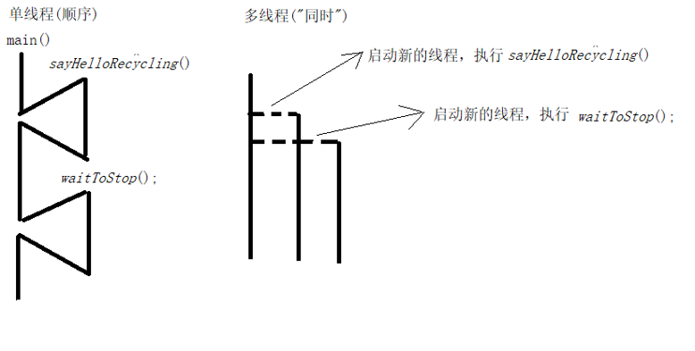
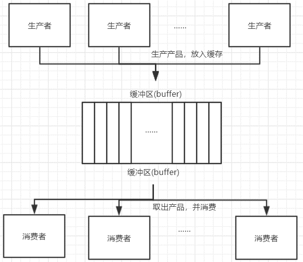
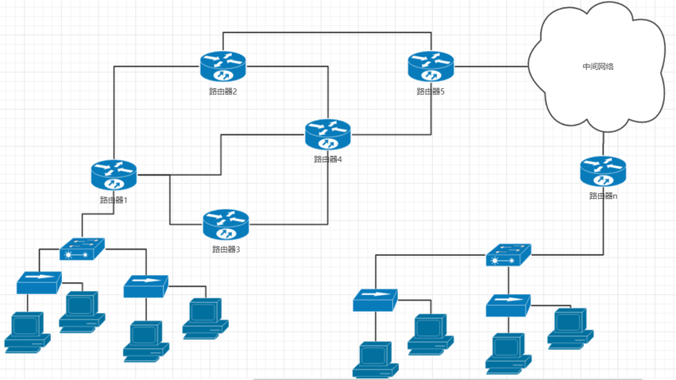
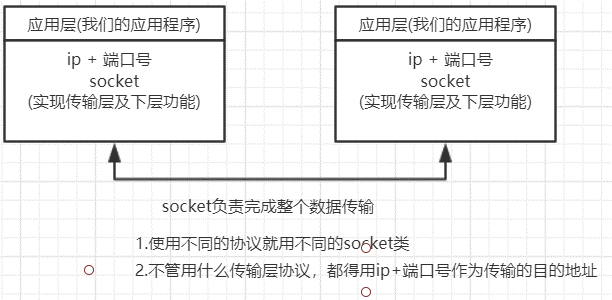

# week2

本周学习任务：  
- 抽象类及接口
- 内部类，匿名内部类
- Java 常见 Object 及 String 类
- 异常、异常分类、异常处理、自定义异常
- 多线程概述、实现方案、线程调度和线程控制、线程生命周期、线程同步、线程锁、死锁问题、线程间通信、生产者消费者问题等
- Java 文件的常见操作

## 目录

- [抽象类及接口](#抽象类及接口)  
  - [抽象类](#抽象类)
  - [接口](#接口)
- [内部类和匿名内部类](#内部类和匿名内部类)  
  - [内部类](#内部类)
  - [匿名内部类](#匿名内部类)
- [Object类和String类](#Object类和String类)  
  - [Object类](#Object类)
  - [String类](#String类)
- [Java异常](#Java异常)  
  - [异常概述](#异常概述)
  - [异常分类](#异常分类)
  - [JVM默认的异常处理](#JVM默认的异常处理)
  - [Java的异常处理机制](#Java的异常处理机制)
  - [异常的抛出](#异常的抛出)
  - [finally](#funally)
  - [自定义异常](#自定义异常)
- [File类](#File类)  
  - [File类概述](#File类概述)
  - [File类的构造方法](#File类的构造方法)
  - [File类的成员方法](#File类的成员方法)
- [字节流与字符流](#字节流与字符流)  
  - [字节流](#字节流)
  - [字符编码](#字符编码)
  - [字符流](#字符流)
  - [其它流](#其它流)
- [多线程](#多线程)  
  - [引入多线程](#引入多线程)
  - [多线程实现方式一（继承Thread子类）](#多线程实现方式一（继承Thread子类)
  - [多线程实现方式二（实现Runnable接口）](#多线程实现方式二（实现Runnable接口）)
  - [线程调度和线程优先级](#线程调度和线程优先级)
  - [多线程相关API](#多线程相关API)
  - [线程的生命周期](#线程的生命周期)
  - [多线程安全问题](#多线程安全问题)
  - [生产者消费者模型](#生产者消费者模型)
  - [线程池](#线程池)
  - [定时任务](#定时任务)

## 抽象类及接口

### 抽象类

抽象类：在普通类的结构里面增加抽象方法的组成部分。  
抽象方法：没有方法体的方法。
- **抽象类和抽象方法必须用 abstract 关键字修饰。**
  ```java
  abstract class 类名 {}    // 抽象类
  public abstract void 方法名();    // 抽象方法
  ```  

- 抽象类不一定有抽象方法，有抽象方法的类一定是抽象类。

- 抽象类不能直接实例化，不过可以间接实例化：`抽象类类型 引用 = new 具体子类();`。  

- 抽象类的子类可以是抽象类，也可以是具体类。

抽象类的成员特点：  
- 构造方法：同普通类。

- 成员变量：同普通类。

- 成员方法：可以是抽象方法，也可以是非抽象方法。  
  一个不包含抽象方法的抽象类的意义：
  - 虽然不包含抽象方法，但是依然无法直接使用它（new 该类型的对象）。  
  - 如果别人使用你定义的抽象类，就必须自己定义一个子类继承抽象类。此时可能就会查看抽象类的定义，你在抽象类中的注释就会提示代码的使用者，哪些方法适用哪些场景。

注：代码中永远是通过多态调用子类覆盖抽象父类来使用 abstract 定义的抽象方法，而被 private，final，static 关键字修饰的方法都不能在子类中被覆盖，因此 private，final，static 这三个关键字不能和 abstract 共存。

### 接口

如果一个类只是由抽象方法和全局常量组成的，在这种情况下通常不会将其定义为一个抽象类，而是定义为接口。所以所谓的接口严格来讲就属于一个特殊的类，这个类里面只有抽象方法和全局常量。  
注：接口不是类！而是对类的一组需求描述，这些类要遵从接口描述的统一格式进行定义。  

接口用关键字 interface 定义，格式：`interface 接口名 {}`。  

在 Java 语言中 interface 也可以表示一种数据类型。
- 类和接口都可以用来表示数据类型（类和接口是地位对等的），只不过他们的侧重点不一样。

- 操作（行为）描述：  
  类定义的是一个数据集合基于这个数据集的一组操作（行为），类所描述的这一组行为，它们是有关系的（间接），都可以访问同一个数据集合。  

  接口表示数据类型，侧重于描述一组具有特殊功能的行为。这些行为可以完全没有任何关系。

类和接口可以有实现关系（类可以实现接口），这种实现关系其实是一种实质上的继承关系。  
类实现接口用 implements 表示，格式：`class 类名 implements 接口名 {}`。  

接口的原则：  
- 接口不能直接实例化。

- 接口的子类可以是抽象类也可以是具体类。

接口的特点：  
- 无构造方法。

- 成员变量：只能是常量，修饰符 public static final。

- 成员方法：只能是抽象方法，修饰符 public abstract。

- 接口与接口之间可以实现多重继承；  
  一个类也可以实现多个接口，一个考虑接口的比较完整的类定义语法：  
  ```java
  class 类名 extends 父类 implements 接口 1, 接口 2... {

  }
  ```

抽象类和接口的比较：
- 成员区别  
  抽象类：变量、抽象方法、非抽象方法；  
  接口：常量、抽象方法。  

- 关系区别  
  类与类：继承、单继承；  
  类与接口：实现、单实现、多实现；  
  接口与接口：继承、单继承、多继承。  

- 设计理念区别  
  抽象类：被继承体现的是共性功能。  
    - 抽象类可以被其他类继承，而且子类只能 extends 一个类
    - 抽象被子类继承之后，子类和抽象类的关系是「is a」。  
  
  接口：被实现体现的是扩展功能。  
    - 一个类可以同时多个接口。
    - 类实现接口之后，类和接口的关系用「like a」来描述。

从 JDK8 开始，接口中可以定义两种特殊的方法，这两种方法可以有方法体，默认的访问权限都是 public。
- 默认方法：它就是一种折中，通过添加默认方法的方式修改接口。不会对已经实现接口的其他类造成影响。

- 静态方法：作为工具方法来使用。  


## 内部类和匿名内部类

### 内部类

在 Java 语言中类可以嵌套定义。  
内部类：定义在其他类内部的类就称为内部类。约定：把包含内部类的类，称之为外部类。  
注：内部类之所以存在，是为了方便外部类的操作。

内部类的访问特点：  
- 内部类可以直接访问外部类的成员，包括私有。

- 外部类要访问内部类的成员，必须创建对象。

按照内部类在类中定义的位置不同，可以分为如下两种格式：  
- 成员位置（成员内部类）
- 局部位置（局部内部类） 

成员内部类
- 成员内部类的定义位置：外部类的成员位置。  
  如果将内部类看做一个整体，对于外部类而言成员内部类就类似于一个成员变量或成员方法的一个普通成员。所以成员内部类在静态上下文中也无法访问非静态的成员。

- 成员内部类对象的实例化语法：`外部类.内部类 对象 = new 外部类().new 内部类();`。  

- 成员内部的常见修饰符：  
  - private：保证成员位置内部类只对其外部类可见
  
  - static：一旦被 static 修饰，那么整个成员内部类就有了静态的访问特征：  
    普通成员内部类依赖于外部类对象而存在。创建普通成员内部类的语法：`外部类.内部类 对象 = new 外部类().new 内部类();`。  
    静态成员内部类作为外部类的一个静态成员，不再依赖于外部类对象而存在。创建静态成员内部类的语法：`外部类.内部类 对象 = new 外部类.内部类();`

局部内部类
- 局部内部类的定义位置：方法体内。

- 局部内部类的特征：可以创建内部类对象，通过对象调用内部类方法，来使用局部内部类功能。  
  
  注：所以局部内部类可以访问方法体中局部变量。但是，被局部内部类对象访问的局部变量必须被 final 关键字修饰。  
  这是因为局部内部类对象与局部变量的生命周期冲突：  
  - 局部变量的生命周期，随着方法的执行结束，即栈帧销毁，其从内存中消失。

  - 局部内部类对象存储在堆上，对象的销毁和方法栈帧没有直接关系。  

  - 简单来说就是方法运行结束后，局部变量不存在了，但是对象还在。因此要想继续正常使用局部内部类对象，就要将被其访问的局部变量用 final 关键字修饰。


### 匿名内部类

不管是成员或局部位置内部类，要使用内部类都分成了 2 步：  
- 定义内部类
- 创建内部类对象

通过定义匿名内部类对象，可以将上面的 2 步变为 1 步。前提：存在一个类（可以是具体类也可以是抽象类）或者接口。    

匿名内部类语法：
```
new 类名或者接口名() {
  方法覆盖
}
```

本质：是一个继承了类或者实现了接口的子类匿名对象。

特征：匿名内部类对象只能在被创建的时候被访问一次。


## Object类及String类

### Object类

Object 类是所有类的父类，也就是说任何一个类在定义时如果没有明确地继承一个父类，那它就是 Object 类的子类。  
- 每个类都使用 Object 作为超类。  
  在设计代码时，如果不确定参数类型，可以使用 Object 类。因此它可以通过向上转型来接收全部类的对象。  

- 所有对象（包括数组）都有这个类的方法。

Object() 类：
```java
// 构造方法
public Object();  // 因此所有类都会有一个默认的无参构造方法

// 常见成员方法
public final Class getClass();
public String toString(); // 取得对象信息
public boolean equals(Object obj);  // 对象比较
public int hashCode();  // 取得对象哈希码
protected Object clone();
protected void finalize();  // 了解即可
```

**（1）getClass()**  

getClass() 返回此 Object 的运行时类。返回的 Class 对象是由所表示类的 static synchronized 方法锁定的对象。   

每个类对应对应的字节码文件内容，被加载到方法区之后，就会创建一个 Class 对象（该对象的包含该类，类定义信息）。  
Class 对象代表一个类，表示的就是所有类的共性：
- 构造方法
- 成员变量
- 成员方法

**（2）toString()**  

toString() 返回该对象的字符串表示。  
通常 toString 方法会返回一个「以文本方式表示」此对象的字符串。结果应是一个简明但易于读懂的信息表达式。建议所有子类都重写此方法。  

该字符串由类名（对象是该类的一个实例）、标记符（@）和此对象哈希码的无符号十六进制表示组成。换句话说，该方法返回一个字符串，它的值等于：`getClass().getName() + '@' + Integer.toHexString(hashCode())`。

**（3）equals()**  

equals 方法用于检查一个对象是否等于另一个对象。在 Object 类中，这个方法将判断两个对象是否具有相同的引用。  
格式：`对象.equals(比较对象)`。  

equals 方法在非空对象引用上实现相等关系： 
- 自反性：对于任何非空引用值 x，x.equals(x) 都应返回 true。 

- 对称性：对于任何非空引用值 x 和 y，当且仅当 y.equals(x) 返回 true 时，x.equals(y) 才应返回 true。 

- 传递性：对于任何非空引用值 x、y 和 z，如果 x.equals(y) 返回 true，并且 y.equals(z) 返回 true，那么 x.equals(z) 应返回 true。 

- 一致性：对于任何非空引用值 x 和 y，多次调用 x.equals(y) 始终返回 true 或始终返回 false，前提是对象上 equals 比较中所用的信息没有被修改。 

- 对于任何非空引用值 x，x.equals(null) 都应返回 false。 

Object 类的 equals 方法实现对象上差别可能性最大的相等关系；即，对于任何非空引用值 x 和 y，当且仅当 x 和 y 引用同一个对象时，此方法才返回 true（x == y 具有值 true）。 

**（4）hashCode()**  

返回该对象的哈希码值。支持此方法是为了提高哈希表（例如 java.util.Hashtable 提供的哈希表）的性能。   

hashCode 的常规协定是： 
- 在 Java 应用程序执行期间，在对同一对象多次调用 hashCode 方法时，必须一致地返回相同的整数，前提是将对象进行 equals 比较时所用的信息没有被修改。从某一应用程序的一次执行到同一应用程序的另一次执行，该整数无需保持一致。 

- 如果根据 equals(Object) 方法，两个对象是相等的，那么对这两个对象中的每个对象调用 hashCode 方法都必须生成相同的整数结果。 

- 如果根据 equals(java.lang.Object) 方法，两个对象不相等，那么对这两个对象中的任一对象上调用 hashCode 方法不 要求一定生成不同的整数结果。但是，程序员应该意识到，为不相等的对象生成不同整数结果可以提高哈希表的性能。 

实际上，由 Object 类定义的 hashCode 方法确实会针对不同的对象返回不同的整数。  
这一般是通过将该对象的内部地址转换成一个整数来实现的，但是 Java 编程语言不需要这种实现技巧。  


**（5）clone()**  

创建并返回此对象的一个副本。「副本」的准确含义可能依赖于对象的类。

对于任何对象 x，表达式：
- `x.clone() != x` 为 true。  
  说明 clone 创建了一个新的对象。

- `x.clone().getClass() == x.getClass()` 为 true。  
  说明 clone 创建的对象和原对象是同一个类的对象。

- `x.clone().equals(x)` 为 true。  
  说明复制对象和原对象的内容（成员变量值）也相同。  

注：被 clone() 方法复制的对象，所属的类必须实现一个接口 Cloneable。  

Cloneable 接口是个空接口。
```java
public interface Cloneable {
}
```
空接口也被称之为标记接口：做标记（数据类型层面的标记）。比如说对于 clone 方法而言，Cloneable 就是一个标记，因为 clone 只会复制，实现类了 Cloneable 接口的类的对象。  
利用 instanceof 运算符判断：`对象  instanceof  Cloneable`。

浅拷贝（Shallow Clone）：被复制对象的所有变量都含有与原来对象相同的值，而所有对其它对象的引用仍然指向原来的对象。换而言之，浅拷贝仅仅复制所考虑的对象，而不复制它所引用的对象。  

深拷贝（Deep Clone）：被复制对象的所有变量都含有与原来对象相同的值，除去那些引用其它对象的变量。那些引用其它对象的变量将指向被复制的新对象，而不再是原有的那些被引用的对象。换而言之，深拷贝把复制的对象所引用的对象都复制了一遍。  

**（6）finalize()**  

当垃圾回收器确定不存在对该对象的更多引用时，由对象的垃圾回收器调用此方法。子类重写 finalize 方法，以配置系统资源或执行其他清除。  

finalize 的常规协定是：当 JVM 已确定尚未终止的任何线程无法再通过任何方法访问此对象时，将调用此方法，除非由于准备终止的其他某个对象或类的终结操作执行了某个操作。  
finalize 方法可以采取任何操作，其中包括再次使此对象对其他线程可用；不过，finalize 的主要目的是在不可撤消地丢弃对象之前执行清除操作。

比如：当我们要执行一些 IO 或者是网络通信的功能的时候，JVM 是借助操作系统的内核完成的，所以执行这些功能时，Java 程序需要占用一定的操作系统资源，当程序使用完操作系统资源的时候，即时释放资源。当使用资源的对象变成垃圾，才能安全的释放系统资源。  
finalize 方法刚刚好就是在对象变成垃圾，并且被垃圾回收器回收的时候会调用这个方法。但是回收时机不确定。


### String类

Java 没有内置的字符串类型，而是标准 Java 类库中提供了一个预定义类 String。每个用双引号括起来的字符串都是 String 类的一个实例。  
```java
// 构造方法

public String() // 空字符串 ""

/* 利用字节数组，创建字节数组所表示的字符串
   字符 -> 数值形式 'a' -> 97，所以可以用多个字节值，表示多个字符 -> 即字符序列
*/
public String(byte[] bytes)

// 利用字节数数组的一部分，创建字符序列, 从 byte 数组的 offset 开始的 length 个字节值
public String(byte[] bytes,int offset,int length)

// 利用一个字符数组创建字符数组，代表的字符序列
public String(char[] value)

// 创建 value 字符数组中，从第 offset 位置开始的 count 个字符所代表的字符串对象
public String(char[] value,int offset,int count)

public String(String original)
```

字符串是常量，它的值在创建之后不能更改。

String 类的的判断功能：  
```java
boolean equals(Object obj)  // 比较字符串内容
boolean equalsIgnoreCase(String str) // 比较字符串内容，但是忽略字符串大小写

boolean contains(String str) // 判断当前字符串中是否包含，参数字符串

boolean startsWith(String str) // 当前字符串是否以参数字符串开头
boolean endsWith(String str)

boolean isEmpty() // 判断字符串是否为空串
```

String类的的获取功能：  
```java
int  length()   //返回当前字符串中包含的字符个数

char charAt(int index)  // 获取字符串指定位置的字符（字符串中的字符，从左到右，从 0 开始编号）

int indexOf(int ch) // 在当前字符串中，查找参数字符，如果当前字符串中存在，则返回首次出现的位置，若不存在则返回 -1

int indexOf(String str) // 在当前字符串中，查找参数字符串首次出现的位置如果找到返回，参数字符串首次出现的首字母的位置，否则返回 -1

int indexOf(int ch, int fromIndex) // 指定从字符串的 fromIndex 位置开始，向后查找指定字符，找到返回其从 formIndex 开始，首次出现的位置，否则返回 -1

int indexOf(String str, int fromIndex) // 指定从字符串的 fromIndex 位置开始，向后查找指定字符串，找到返回其从 formIndex 开始，首次出现的位置，否则返回 -1

String substring(int start)  //生成当前字符串的子串，字串的取值是原字符串的 [start, length()-1]

String substring(int start, int end) //生成当前字符串的子串，字串的取值是原字符串的 [start, end)
```

String 类的的转换功能：
```java
byte[] getBytes()  // 获取表示一个字符串中，多个字符对应多个字节值

char[] toCharArray() // 获取表示一个字符串中，多个字符对应多个字符

static String valueOf(char[] chs) // 把一个字符数组转化成一个字符串

static String valueOf(int i) // 把一个整数值，转化成其字符串表示形式

String toLowerCase() // 把一个字符串的所有字符转化成小写，返回该新的字符串对象

String toUpperCase() // 把一个字符串的所有字符转化成大写，返回该新的字符串对象

String concat(String str) // 完成字符串拼接 了解
```

String 类的替换功能：  
```java
String replace(char old,char new) // 在新的字符串中，用新 （new） 字符，替换旧 （old） 字符

String replace(String old, String new) // 在新的字符串中，用新的字符串（new）, 替换旧（old）字符串
```

String 类去除空字符串：  
```
String trim() //在新的字符串中，去掉开头和结尾的空格字符
```

String 类的比较功能：
```
int compareTo(String str)
int compareToIgnoreCase(String str)
```
- 字符串的大小如何比较：  
  按照字典序比较字符串的大小。字典序原本的含义实质：英文单词在字典中出现的先后顺序（在字典中，先出现的字符串小，后出现的字符串大）。具体到编程语言，是根据两个字符串字符串从左往右数，第一个对应位置的不同字符，来决定两字符串的大小

- compareTo 几乎就是按照字典序，来比较两个字符串大小的。  
  格式：`字符串对象.compareTo(字符串对象)`。  
  对于 CompareTo 方法：String 类实现了一个接口：  
  ```java
  interface Comparable<String> {
    int compareTo(String anotherStr);
  }
  ```
  该接口定义了一种比较规则，该规则规定：  
  1. 对于大于这种比较结果 `> 0` 表示大于关系；  
  2. 对于小于这种比较结果 `< 0` 表示小于关系；  
  3. 对于等于这种比较结果 `0` 表示相等关系。


## Java异常

### 异常概述

简单来说异常就是用来表示 Java 程序运行过程中的错误（信息）。  

Java 异常机制的由来：  
- C 语言时代的错误处理。

- Java 的基本理念。  
  尽量把一切错误摒弃在 JVM 之外，最好在程序之前发现程序错误（编译器）。有一部分错误是编译器可以在程序运行前帮我们发现的，但是还有一些错误，是 Java 程序不运行，编译器发现不了。

- 错误恢复机制（Java 异常处理机制）。  
  Java 语言退而求其次，可以让 Java 程序运行的时候出错，但是同时，Java 语言本身提供了一种通用的错误处理机制 —— 异常处理机制。  
  - 异常处理机制：异常的发现，和异常的处理（一致性的错误报告模型）。
  - 简单来说就是，一旦发生错误，就把该错误信息层层向上报告。如果上层知道怎么处理这个错误，上层可以捕获该错误信息并处理。如果上层不知道该怎么处理，可以将错误继续向上报告。

### 异常分类

根据 Java 程序在运行过程中出现的错误的严重程度，异常可分为：  
- Exception：在程序中可能能够处理的错误。

- Error：程序层面无法处理的错误。

Java 中的异常层次结构：  
<div align="center">

</div>

对于 Exception，根据错误处理方式的不同分为：  
- 编译时异常（Checkable Exception）  
  可预见的，语法层面强制在代码编写时处理。  
  如：  
  - 试图在文件尾部后面读取数据。  
  - 试图打开一个不存在的文件。
  - 试图根据给定的字符串查找 class 对象，而这个字符串表示的类并不存在。

- 运行时异常（Runtime Exception）  
  不可预见的，不要求在编写代码时必须处理。  
  如：  
  - 错误的类型转换。
  - 数组访问越界。
  - 访问 null 指针。

“如果出现 RuntimeException 异常，那么一定是你的问题” 是一条相当有道理的规则。

### JVM默认的异常处理

用户期望在出现错误时，程序能够采用一些理智的行为。如果由于出现错误而使得某些操作没有完成，程序应该：  
- 返回一种安全状态，并能够让用户执行一些其它的命令。  

- 或者允许用户保存所有操作的结果，并以妥善的方式终止程序。


实际操作中，程序在正常执行的过程中一旦发生错误：  
1. JVM 就会终止程序的运行，转而执行 JVM 的错误处理流程；    

2. 收集错误信息，产生一个描述错误的对象；

3. 访问收集到的错误信息，将错误信息输出到控制台窗口中。

### Java的异常处理机制

Java 针对异常处理提供了 3 个核心关键字：try、catch、finally，利用这 3 个关键字就可以组成以下异常处理格式。
```java
try {
  // 可能出现异常的语句
} catch(异常类型 对象) {
  // 异常处理
} catch(异常类型 对象) {
  // 异常处理
} …
 finally { // 不管是否出现异常，都执行统一的代码（可省略）
}
```

如果 try 中代码运行时发生了错误，JVM 在发生错误的代码处收集错误信息。try 块中错误代码之后的代码就不会再运行。JVM 会跳转到相应的错误处理器中，执行由开发者自己写的错误处理代码。错误处理器中的代码一旦执行完毕，紧接着程序继续正常执行，执行的是整个 try 代码块之后的代码。  

注：
- 在多 catch 分支的情况下，如果不同的 catch 分支处理的异常类型有父子关系，则处理子类的异常分支写在前，父类的异常分支写在后。  

- 一次匹配，只会执行多个 catch 分支中的一个。


### 获取异常信息

通常所使用的获取异常信息的方法，都是定义在 Throwable 类中的。  
```java
getMessage()  // 获取异常信息，返回字符串。

toString()  // 获取异常类名和异常信息，返回字符串。

printStackTrace() // 获取异常类名和异常信息，以及异常出现在程序中的位置，并打印到控制台

printStackTrace(PrintStream s)  // 该方法将异常内容保存在日志文件中，以便查阅。 
```

### Java的异常处理机制

所有的 RuntimeException 类及其子类的实例被称为运行时异常，其他的异常就是编译时异常。
- 运行时异常：无需显示处理，也可以和编译时异常一样处理。

- 编译时异常：Java 程序必须显示处理，否则程序就会发生错误无法通过编译。

### 异常的抛出

在 Java 中，与异常抛出有关的主要有两个关键字：throws 和 throw。  

**（1）throws**  

throws 在方法定义时使用，声明该方法可能抛出的异常。对于编译时异常，可以在语法层面个强制方法调用者处理该异常。  

基本语法：`修饰符 返回值(形参列表) throws 异常列表 {}`
 
注：
- 异常列表之间用逗号分割，列表中出现的异常不要出现包含关系。

- 方法覆盖时的子类异常列表必须与父类兼容。  
  - 当子类方法声明的异常类型和父类声明的异常类型完全相同的时候，可以发生方法覆盖。  

  - 子类中声明的异常类型,都是父类中声明异常列表中的异常的子类类型（只针对编译时异常）。  

  - 如果说父类没有异常列表，对于编译时异常而言，子类也不能有异常列表（子类也没有才能发生方法覆盖）。

  - 如果说父类有异常列表，子类没有异常列表，不管是编译时异常，还是运行时异常，都可以发生方法覆盖。

- 从实际开发来讲，主方法上不建议使用 throws，因为如果程序出现了错误，也希望其可以正常结束调用。

**（2）throw**  

语法：throw 异常对象
- 在方法体中使用。

- 主动在程序中抛出异常。

- 每次只能抛出确定的某个异常对象。

注：
- 若要抛出编译时异常，则必须和 throws 配合起来使用。

- 一旦执行, throw 关键字的语句后面的代码就不会在执行。

**（3）比较**  

throws
- 用在方法声明后面，跟的是异常类名。

- 可以跟多个异常类名，用逗号隔开。

- 表示抛出异常，由该方法的调用者来处理。

- throws 表示出现异常的一种可能性，并不一定会发生这些异常。

throw
- 用在方法体内，跟的是异常对象名。

- 只能抛出一个异常对象。

- 表示抛出异常，可以由方法体内的语句处理。

- throw 则是抛出了异常，执行 throw 则一定抛出了某种异常。

总结一下，目前为止，我们所学习过的异常的处理策略主要有两种：
- 捕获并处理
- 向上抛出

选择处理策略的原则：
- 如果该功能内部可以将问题处理，用 try。

- 如果处理不了则交由调用者处理，用 throws。

注：异常一旦被捕获，并且没有再次被抛出，那么上层是感知不到该异常的！！！！

### finally

finally 的特点：被 finally 控制的语句体一定会执行。  

特殊情况：在执行到 finally 之前 JVM 退出了（比如 `System.exit(0)`）。  

finally 的作用：用于释放资源，在 IO 流操作和数据库操作中会见到。

finally 相关的面试题：
- final，finally 和 finalize 的区别。  
  1. final 修饰类、变量（成员变量和局部变量）和成员方法。  
      - 修饰类之后，该类不能被继承。
      - 修饰变量之后，该变量变成自定义常量。
      - 修饰方法之后，该方法部类被子类覆盖。
  2. finally 修饰代码块。  
  finally 代码块的执行特征是：  
  对于 try-catch-finnally 代码块而言，finally 代码块中的代码，不管是否发生异常，finally 代码块中的代码，最后都会执行。  
  即使在 finally 代码块之前，有 return 语句，finally 代码块，仍然会执行。  
  特殊情况：在执行到 finally 之前 JVM 退出了（比如System.exit(0)）。
     
  3. finalize() 是 Object 类中的一个方法。  
  该方法在对象变成垃圾，并且被垃圾回收期调用之前，JVM 会在该对象上调用 finalize() 方法一次且仅一次。

- 如果 catch 里面有 return 语句，请问 finally 的代码还会执行吗？如果会，请问是在 return 前还是 return 后。  
  即使在 finally 代码块之前有 return 语句，finally 代码块仍然会执行。

### 自定义异常  

自定义异常分两种：  
- 继承自 Exception。

- 继承自 RuntimeException。


## File类

### File类概述

操作系统中，所有需要永久保存的数据，都是以文件的形式存在。

File 类概述：文件和目录路径名的抽象表达形式。

路径：  
- 绝对路径名是完整的路径名，不需要任何其他信息就可以定位它所表示的文件或目录。如 windows 下：`E:\first\a.txt`。  

- 相反，相对路径名必须使用取自其他路径名的信息进行解释（相对路径本身表示信息不完整）。如 `dir\a.txt`。

- 默认情况下，java.io 包中的类总是根据当前用户目录来解析相对路径名。  
  此目录由系统属性 user.dir 指定，通常是 Java 虚拟机的调用目录。

路径表示：  
- 对于 UNIX 平台，绝对路径名的前缀始终是 `/`。相对路径名没有前缀。表示根目录的绝对路径名的前缀为 `/` 且名称序列为空。  
  绝对路径表示：`/data/a.log`。  
  相对路径：`home/6379.conf`。  
  `/:` 表示根目录。

- 对于 Microsoft Windows 平台，包含盘符的路径名前缀由驱动器号和一个 `:` 组成。如果路径名是绝对路径名，还可能后跟 `\\`，而相对路径没有盘符前缀。  
  绝对路径：`E:\first\dir\a.txt`  
  相对路径：`dir\a.txt`  

- 在 java.io.File 类里面提供了一个路径分隔符常量：`public static String separator;` 利用此常量可以在不同的操作系统中自动转换为适合该操作系统的路径分隔符。所以在实际开发中，如果要定义 File 类对象往往会使用如下形式的操作代码。  
  ```java
  File file = new File("d:" + File.separator + "test.txt");  // 设置文件路径
  ```

### File类的构造方法

```java
// 通过将给定路径名字符串转换为抽象路径名来创建一个新 File 实例。
File (String pathname)

// 根据 parent 路径名字符串和 child 路径名字符串创建一个新 File 实例。
File (String parent, Sting child)

// 根据 parent 抽象路径名和 child 路径名字符串创建一个新 File 实例。
File (File parent, String child)
```

### File类的成员方法

**（1）创建功能**  
```java
// 当且仅当不存在具有此抽象路径名指定名称的文件时，不可分地创建一个新的空文件。
public boolean createNewFile() 

// 创建此抽象路径名指定的目录。
public boolean mkdir()

// 创建此抽象路径名指定的目录，包括所有必需但不存在的父目录。
public boolean mkdirs()
```

**（2）删除功能**  
```java
// 删除此抽象路径名表示的文件或目录，如果此路径名表示一个目录，则该目录必须为空才能删除。
public boolean delete()
```

**（3）重命名功能**  
```java
// 重新命名此抽象路径名表示的文件。
public boolean renameTo(File dest)
```
当目标 File 对象所表示抽象路径如果和原文件的路径在同一目录下，该方法实现的效果仅仅只是重命名。  
当目标 File 对象所表示抽象路径如果和原文件的路径不在同一目录下，该方法实现的效果：文件移动 + 重命名。  

**（4）判断功能**  
```java
// 判断此抽象路径名表示的文件是否是一个标准文件。
public boolean isFile()

// 判断此抽象路径名表示的文件是否是一个目录。
public boolean isDirectory()

// 判断该 File 对象所表示的文件或目录是否物理存在。
public boolean exists()

// 判断该 File 对象所表示的文件目录是否有读取权。
public boolean canRead()

public boolean canWrite()

// 判断此抽象路径名指定的文件是否是一个隐藏文件。
public boolean isHidden()
```

**（5）基本获取功能**  
```java
// 返回此抽象路径名的绝对路径名形式。
public File getAbsoluteFile()

// 将此抽象路径名转换为一个路径名字符串。
public String getPath()

// 返回由此抽象路径名表示的文件或目录的名称。
public String getName()

// 返回由此抽象路径名表示的文件的长度。
public long length()

// 返回此抽象路径名表示的文件最后一次被修改的时间。
public long lastModified()
```

**（6）高级获取功能**  
```java
// 返回一个字符串数组，这些字符串指定此抽象路径名表示的目录中的文件和目录。
public String[] list()

// 返回一个抽象路径名数组，这些路径名表示此抽象路径名表示的目录中的文件。
public File[] listFiles()
```
`public String[] list()` 
- 返回一个字符串数组，这些字符串指定此抽象路径名表示的目录中的文件和目录（其实返回的就是当前目录下的所有目录和文件的名字）。  

- 如果此抽象路径名不表示一个目录，那么此方法将返回 null。

`public File[] listFiles()` 
- 仅返回当前目录下的子文件或子目录的名称。  

- 返回一个抽象路径名数组，这些路径名表示此抽象路径名表示的目录中的文件。

- 如果此抽象路径名不表示一个目录，那么此方法将返回 null。


**（7）自定义获取功能**  
```java
// 返回抽象路径名数组，这些路径名表示此抽象路径名表示的目录中满足指定过滤器的文件和目录。
File[] listFiles(FileFilter filter)

// 返回抽象路径名数组，这些路径名表示此抽象路径名表示的目录中满足指定过滤器的文件和目录。
File[] listFiles(FilenameFilter filter)
```

### File实战

**（1）递归地列出一个目录下所有文件**  

```java
public static void listAllFiles(File dir) {
    if (dir == null || !dir.exists()) {
        return;
    }
    if (dir.isFile()) {
        System.out.println(dir.getName());
        return;
    }
    for (File file : dir.listFiles()) {
        listAllFiles(file);
    }
}
```


## 字节流与字符流

使用 java.io.File 类虽然可以操作文件，但是却不能操作文件的内容。如果要进行文件的内容操作，就必须依靠I / O（Input / Output） 流来完成。  

Java 语言主要通过输入流和输出流，完成 I / O 的功能，从而实现和外设的数据交互。而且针对此操作提供以下两类支持。  
- 字节流（JDK 1.0 开始提供）：InputStream（输入字节流）、OutputStream（输出字节流）。  

- 字符流（JDK 1.1 开始提供）：Reader（输入字符流）、Writer（输出字符流）。

实际应用中，文本数据用字符流，如果不确定内容，就用字节流。  

这四个操作流的类都是抽象类，所以在使用这些类时，一定要通过子类对象的向上转型来进行抽象类对象的实例化操作。  
由这四个类派生出来的子类名称都是以其父类名作为子类名的后缀。如：  
- InputStream 的子类 FileInputStream。  
- Reader 的子类 FileReader。


### 字节流

**（1）字节流写数据**  

OutputStream 本身是一个抽象类，想要完成字节输出功能就需要一个子类。如果要进行文件操作，则可以使用 FileOutputStream 子类完成操作。  

FileOutputStream 的构造方法：
```java
// 创建一个向指定 File 对象表示的文件中写入数据的文件输出流。
FileOutputStream(File file)

// 如果讲布尔参数设置为 true，表示追加新的内容到文件中。
FileOutputStream(File file, boolean append)

// 创建一个向具有指定名称的文件中写入数据的输出文件流。
FileOutputStream(String name)

FileOutputStream(String name, boolean append)
```

创建字节输出流过程：  
1. FileOutputStream 对象在被创建之前，JVM 会首先到操作系统中找目标文件；  
    - 找到的话，先清空已经存在的目标文件内容（因为默认向文件汇总写入数据中的方式，从文件头开始写入）。
    - 找不到，JVM 会创建一个新的目标文件。

2. 在 JVM 内存中，创建 FileOutputStream 对象；  

3. 在 FileOutputStream 对象和目标文件之间，建立数据传输通道。

FileOutputStream 的成员方法：  
```java
// 将指定字节写入此文件输出流。
public void write(int b)

// 将 b.length 个字节从指定 byte 数组写入此文件输出流中。
public void write(byte[] b)

// 将指定 byte 数组中从偏移量 off 开始的 len 个字节写入此文件输出流。（开发中常用方法）
public void write(byte[] b,int off, int len)
```

数据写成功后，需要调用 close() 方法关闭此输出流，并释放与此流有关的所有系统资源。

由于 OutputStream 只适合输出字节数据，当输出字符串时，需要先将自定的字符串利用 getBytes() 方法转换为字节数组。  

向文件中写入换行字符实现数据的换行：    
- Windows操作系统: `\r \n`（在不同的 Windows 操作系统上，可能表现不一样）。

- 类 Unix 操作系统：`\n`。


**（2）字节流读取数据**  

InputStream 依然属于一个抽象类，如果想要实现文件读取功能，需要使用 FileInputStream 子类。  

FileInputStream 的构造方法：
```java
// 通过打开一个到实际文件的连接来创建一个 FileInputStream，该文件通过文件系统中的 File 对象 file 指定。
FileInputStream(File file)

// 通过打开一个到实际文件的连接来创建一个 FileInputStream，该文件通过文件系统中的路径名 name 指定。
FileInputStream(String name)
```

创建字节输入流过程：  
1. FileInputStream 对象在被创建之前，JVM 会首先到操作系统中，找目标文件；  
    - 找到，就不做任何额外工作。
    - 找不到，则直接抛出异常 FileNotFoundException。

2. 在 JVM 内存中，创建 FileInputStream 对象。

3. 在 FileInputStream 对象和目标文件之间，建立数据传输通道。

FileInputStream 的成员方法:
```java
/*
从此输入流中读取一个数据字节。
返回 0 到 255 范围内的 int 字节值。如果因为已经到达流末尾而没有可用的字节，则返回值 -1。
*/
public int read()

/* 
此输入流中将最多 b.length 个字节的数据读入一个 byte 数组中。
返回值：
  1. 以整数形式返回实际读取的字节数；
  2. 如果因为已经到达流末尾而不再有数据可用，则返回 -1。
*/
public int read(byte[] b)

/*
将输入流中最多 len 个数据字节读入 byte 数组。
返回值：
  1. 以整数形式返回实际读取的字节数；
  2. 如果因为已经到达流末尾而不再有数据可用，则返回 -1。
*/
int read(byte[] b, int off, int len)
```

**（3）字节缓冲流**  

字节流一次读写一个数组的速度明显比一次读写一个字节的速度快很多，这是加入了数组这样的缓冲区效果，Java 本身在设计的时候也考虑到了这样的情况，所以提供了字节缓冲区流。

字节缓冲输出流：BufferedOutputStream。  
构造方法：
```java
// 创建一个新的缓冲输出流，以将数据写入指定的底层输出流。
BufferedOutputStream(OutputStream out)
```

字节缓冲输入流：BufferedInputStream。  
构造方法：
```java
// 创建一个 BufferedInputStream 并保存其参数，即输入流 in，以便将来使用。
BufferedInputStream(InputStream in)
```

关于缓冲输出流的注意事项：
- void flush() 刷新此缓冲的输出流。flush 可以帮助我们，强制把缓冲流中的字节数字，写入底层流中，从而写入目标文件。

- BufferedOutputStream 的 close 方法先调用其 flush 方法，然后调用其基础输出流的 close 方法。   

### 字符编码

计算机中所有信息都是由二进制数据组成的，因此所有能够描述出的中文文字都是经过处理后的结果。在计算机的世界里，所有的语言文字都会使用编码来进行描述。例如：最常见的编码是 ASC II 码。  
在实际工作中，最为常见的 4 种编码如下：  
- GBK、GB2312：中文的国际标码，其中 GBK 包含简体中文与繁体中文两种，而 GB2312 只包含简体中文。    
  GBK 编码中，中文字符占 2 个字节，英文字符占 1 个字节。

- ISO8859-1：是国际编码，可以描述任何文字信息（中文需要转码）。  

- UNICODE：是十六进制编码，但是在传递字符信息时会造成传输的数据较大。  

- UTF 编码（Unicode Transformation Format）：是一种 UNICODE 的可变长编码，常见的编码为 UTF-8 编码。  
  UTF-8 编码中，中文字符占 3 个字节，英文字符占 1 个字节。  
  UTF-16be 编码中，中文字符和英文字符都占 2 个字节。

UTF-16be 中的 be 指的是 Big Endian，也就是大端。相应地也有 UTF-16le，le 指的是 Little Endian，也就是小端。  

Java 的内存编码使用双字节编码 UTF-16be，这不是指 Java 只支持这一种编码方式，而是说 char 这种类型使用 UTF-16be 进行编码。char 类型占 16 位，也就是两个字节，Java 使用这种双字节编码是为了让一个中文或者一个英文都能使用一个 char 来存储。

注：项目开发中全部都要使用 UTF-8 编码。

String 可以看成一个字符序列，可以指定一个编码方式将它编码为字节序列，也可以指定一个编码方式将一个字节序列解码为 String。
```java
String str1 = "中文";
byte[] bytes = str1.getBytes("UTF-8");

String str2 = new String(bytes, "UTF-8");
System.out.println(str2);
```
在调用无参数 getBytes() 方法时，默认的编码方式不是 UTF-16be。双字节编码的好处是可以使用一个 char 存储中文和英文，而将 String 转为 bytes[] 字节数组就不再需要这个好处，因此也就不再需要双字节编码。getBytes() 的默认编码方式与平台有关，一般为 UTF-8。


### 字符流

不管是磁盘还是网络传输，最小的存储单元都是字节，而不是字符。但是在程序中操作的通常是字符形式的数据，因此需要提供对字符进行操作的方法。
- InputStreamReader 实现从字节流解码成字符流；

- OutputStreamWriter 实现字符流编码成为字节流。

**（1）字符输出流（转换流）：Writer**  

Writer 类中直接提供了输出字符串数据的方法，这样就不需要将字符串转成字节数组再输出了。  

与 OutputStream 的定义相似，Write 类本身也属于一个抽象类，我们可以使用其子类 OutputStreamWriter 实现对 Writer 类对象的实例化操作。  

OutputStreamWriter 的构造方法：  
```java
// 创建使用默认字符编码的 OutputStreamWriter。
OutputStreamWriter(OutputStream out) 

// 创建使用指定字符集的 OutputStreamWriter。
OutputStreamWriter(OutputStream out, String charsetName) 
```

成员方法：  
```java
/*
写入单个字符。
要写入的字符包含在给定整数值的 16 个低位中，16 高位被忽略。
*/
public void write(int c)

// 写入字符数组。
public void write(char[] cbuf)

// 写入字符数组的某一部分。
public void write(char[] cbuf,int off,int len)

// 写入字符串。
public void write(String str)

// 写入字符串的某一部分。
public void write(String str,int off,int len)
```

在使用 OutputStream 输出数据时即使最后没有关闭输出流，内容也可以正常输出，但是使用字符输出流 Writer 时，在执行到最后如果不关闭输出流，就表示在缓冲区中处理的内容不会被强制性清空，所以就不会输出数据。  
如果有特殊情况不能关闭字符输出流，可以使用 flush() 方法强制清空缓冲区。


**（2）字符输入流（转换流）：Reader**  

同样 Reader 也是抽象类，我们使用其子类 InputStreamReader。  

InputStreamReader 的构造方法：  
```java
public InputStreamReader(InputStream in)

public InputStreamReader(InputStream in,String charsetName)
```

成员方法：  
```java
/*
读取单个字符。
作为整数读取的字符，范围在 0 到 65535 之间 (0x00-0xffff)，如果已到达流的末尾，则返回 -1。
*/
public int read()
        
/*
从字符输入流中，读取一个字符数组的字符数据。
读取的字符数，如果已到达流的末尾，则返回 -1。
*/
public int read(char[] cbuf)
         
/*
从字符输入流中读取多个字符，这些字符，从字符数组的第 offset 开始的位置填充，最多填充 len个 字符。
读取的字符数，如果已到达流的末尾，则返回 -1。
*/
public int read(char[] cbuf，int off ,int len)
```

**（3）转换流的简化**  

在使用转化流的时候，通常需要经过 2 步：  
1. 创建底层的字节流；

2. 包装字节流，指定字符集并完成转换流的创建。

大多数时候，我们所依赖的字符集都是本地字符集，所以，为了简化我们的书写，转换流提供了对应的子类。

FileWriter：用来写入字符文件的便捷类。此类的构造方法假定默认字符编码和默认字节缓冲区大小都是可接受的。

FileWriter 构造方法：
```java
// 根据给定的文件名构造一个 FileWriter 对象。
public FileWriter(String fileName) 

// 根据给定的文件名以及指示是否附加写入数据的 boolean 值来构造 FileWriter 对象
public FileWriter(String fileName, boolean append)
```

FileReader：用来读取字符文件的便捷类。此类的构造方法假定默认字符编码和默认字节缓冲区大小都是适当的。

FileReader 构造方法：
```java
public FileReader(String fileName)

public FileReader(File file)
```

字符流的转化流和简化类比较：
1. 字符流的简化类创建该类对象很方便，但是简化类不能指定编解码所使用的字符集。

2. 转化流创建转化流对象不太方便，但是转化流可以指定自己编解码所使用的字符集。


**（4）字符缓冲流**  

操作字符类型数据，主要操作类是 Reader、Writer 的子类；使用缓冲区缓冲字符，不关闭流就不会输出任何内容。

BufferedWriter
- 构造方法：`BufferedWriter(Writer out)`。创建一个使用默认大小输出缓冲区的缓冲字符输出流。

- 成员方法：`void newLine()`。写入一个行分隔符

BufferedReader
- 构造方法：`BufferedReader(Reader in)`。创建一个使用默认大小输入缓冲区的缓冲字符输入流。

- 成员方法：`String readLine()`。读取一个文本行，该文本数据是包含该行内容的字符串，但是不包含任何行终止符，如果已到达流末尾，则返回 null。


### 其它流

**（1）标准输入输出流**  

标准输入流：System 类中的字段 in 代表了系统的标准输入，默认的输入设备是键盘。  
System.in 的类型是 InputStream。

标准输出流：System 类中的字段 out 代表了系统的标准输出，默认的输出设备是显示器。  
System.out 的类型是 PrintStream 是 OutputStream 的子类。

注： 对于标准输入流而言，其 read 方法是一个阻塞方法。
1. 当执行 BufferedReader 的 readLine方法的时候，其实 readLine 还是基于 System.in 的 read 方法读取键盘输入数据的；

2. 当没有键盘输入数据的时候，此时执行标准输入流的 read 方法，read 不会执行完，而是在执行过程中的某一步阻塞，等着我们键盘输入数据

3. 可以自己定义键盘输入的结束规则，让键盘输入的循环终止。如：  
    ```java
    while ((s = br.readLine()) != null) {
      System.out.println("接收到了：" + s);
      if ("886".equals(s)) {
        break;
      }
    }
    ```

## 多线程

### 引入多线程

进程（process），是指计算机中已运行的程序。  
线程（thread）是操作系统能够进行运算调度的最小单位。大部分情况下，它被包含在进程之中，是进程中的实际运作单位。一条线程指的是进程中一个单一顺序的控制流，一个进程中可以并发多个线程，每条线程并行执行不同的任务。  

多线程是指一个进程在执行过程中可以产生多个线程，这些线程可以同时存在、同时运行。  
多线程是实现并发机制的一种有效手段。


多线程和单线程的执行路径对比：  
<div align="center">

</div>

Java 命令运行一个程序的过程（`java 字节码文件名`）：  
1. 启动了一个 JVM 进程;

2. 该 JVM 进程在执行的时候，首先会创建一个线程 —— main 线程；

3. 在 main 线程中，运行主类中的 main 方法代码。

注：
- Jvm 天生多线程。

- 多个线程，交替执行

- 「同时执行」  
  并发： 同一时间段内，同时执行（但是同一时间点，可能并没有同时执行）。
  并行： 同一时间点, 同时执行。


### 多线程实现方式一（继承Thread类）

步骤：  
1. 继承 Thread；

2. 重写子类的 run 方法；

3. 创建该子类的对象；

4. 启动线程 start()。

格式：  
```java
class 类名称 extends Thread {
  属性
  方法
  public void run {
    线程主题方法
  }
}
```

举例：
```java
public class TestDemo {
    public static void main(String[] args) {
        MyThread mt1 = new MyThread("线程 A");    // 实例化
        MyThread mt2 = new MyThread("线程 B");
        MyThread mt3 = new MyThread("线程 C");

        mt1.start();    // 启动多线程
        mt2.start();
        mt3.start();
    }
}

class MyThread extends Thread {
    private String name;    // 属性
    public MyThread(String name) {   // 构造方法
        this.name = name;
    }
    @Override
    public void run() { // 覆盖 run() 方法，作为线程的主操作方法
        for (int i = 0; i < 3; i++) {
            System.out.println(this.name + " --> " + i);
        }
    }
}
/*可能的输出结果：
线程 A --> 0
线程 B --> 0
线程 B --> 1
线程 B --> 2
线程 C --> 0
线程 C --> 1
线程 C --> 2
线程 A --> 1
线程 A --> 2
*/
```
注：
- 一个 Thread 类（Thread 子类）对象代表一个线程；

- 必须重写 Thread 类中的 run 方法。  
  只有 Thread run() 方法中的代码，才会执行在子线程中。

- 如果想要让代码在子线程中运行，并非一定要把代码写在 run 方法方法体中。  
  对于，定义在该 Thread 子类中，其他方法方法体中的代码，也可以运行在子线程。  
  
  即，一个方法被哪个线程中的代码调用，被调用的方法，就运行在调用它的线程中。

- 必须使用 start() 方法来启动线程，这样才能使 Thread 中的 run() 方法运行在子线程中。  
  如果通过调用 run() 方法，来执行 Thread 的 run() 方法代码，这仅仅只是普通的方法调用。

- 同一个 Thread 或 Thread 子类对象（代表同一个线程），只能被启动一次。  
  如果想要启动多个线程，只能创建多个线程对象，并启动这些线程对象。

### 多线程实现方式二（实现Runnable接口）

步骤：  
1. 定义实现 Runnable 接口的子类。

2. 实现 Runnable 接口的 run 方法。

3. 创建该子类对象。

4. 在创建 Thread 对象的时候，将创建好的 Runnable 子类对象作为初始化参数，传递给 Thread 对象。

5. 启动 Thread 对象（启动线程）。

举例：
```java
public class TestDemo {
    public static void main(String[] args) {
        MyThread mt1 = new MyThread("线程 A");    // 实例化多线程类对象
        MyThread mt2 = new MyThread("线程 B");
        MyThread mt3 = new MyThread("线程 C");

        new Thread(mt1).start();    // 利用 Thread 启动多线程
        new Thread(mt2).start();
        new Thread(mt3).start();
    }
}
class MyThread implements Runnable {
    private String name;
    public MyThread(String name) {
        this.name = name;
    }

    @Override
    public void run() {
        for (int i = 0; i < 3; i++) {
            System.out.println(this.name + " --> " + i);
        }
    }
}
```


注：  
- Runnable 接口子类的 run() 方法代码，会运行在子线程当中。所以在线程的第二种实现方式中，我们自己定义子类，实现 Runnable 接口的 run 方法。  
  Runnable 子类对象并不代表线程，它只代表要在线程中执行的任务。

- 从逻辑上说，第二种实现方式逻辑十分清晰：
  1. 线程就是一条执行路径，至于在线程这条执行路径上，究竟执行的是什么样的具体代码，应该和线程本身没有关系的；

  2. 线程实现的第二种方式，把线程（Thread 对象代表线程） 和在线程上执行的任务（Ruannable 子类对象） 分开。

两种方式比较：
- 方式一实现步骤较方式二少。

- 方式一的实现方式，存在单重继承的局限性。

- 方式二将线程和任务解耦。

- 方式二，便于多线程数据的共享。


### 线程调度和线程优先级

单 CPU 的情况下，线程的两种主要调度模型：  
- 协同式线程调度（Cooperative Thread-Scheduling）  
  线程的执行时间由线程本身控制，线程把自己的工作执行完之后要主动通知系统，切换到另一个线程上去。  

  优点：实现简单，而且由于线程要把自己的事情做完后才会进行线程切换，所有切换操作对线程自己是可知的。  
  缺点：线程执行时间不可控。

- 抢占式调度（Preemptive Thread-Scheduling）  
  线程的执行时间由系统来分配，线程的调度不由线程本身决定。在这种情况下，线程的执行时间是系统可控的。  
  
  Java 使用抢占式调度模型。

线程的优先级：
```java
// 返回线程的优先级。
public final int getPriority()                

// 更改线程的优先级。
public final void setPriority(int priority)   
```

注：
- 多线程的优先级的取值范围：1 <= priority <=10。

- 线程的默认优先级为 5。

- 然而，我们在 Java 语言中设置的线程优先级仅仅只能被看做是一种「建议」，操作系统有它自己的一套线程优先级（静态优先级 + 动态优先级）。所以不要试图利用线程优先级来间接控制线程调度的顺序。  
  Java 官方：线程优先级并非完全没有用，我们 Thread 的优先级具有统计意义。总的来说，高优先级的线程占用 cpu 的执行时间多一点，低优先级线程，占用cpu执行时间少一点。


### 多线程相关API

线程名称 API： 
```java
// 获取线程的名称。 
public final String getName()

// 设置线程的名称。 
public final void setName(String name)

// 返回对当前正在执行的线程对象的引用。
static Thread currentThread() 
```

线程控制 API：
```java
// 在指定的毫秒数内让当前正在执行的线程休眠（暂停执行）。
public static native void sleep(long millis)

// 等待该线程终止。
public final void join()

// 暂停当前正在执行的线程对象，并执行其他线程。
public static native void yield()

// 将该线程标记为守护线程或用户线程。
public final void setDaemon(boolean on)

// 中断线程。
public void interrupt()
```

### 线程的生命周期  

新建：线程处于刚刚创建的状态。  

就绪：有执行资格，等待 cpu 调度获得执行权。

运行：取得执行权，正在 cpu 上执行。

阻塞：无执行资格，无执行权。

死亡：线程正常或异常终止（run() 方法执行完毕），线程对象成为垃圾，等待垃圾回收器回收。

### 多线程安全问题

多个线程操作同一资源就有可能出现不同步的问题，出现问题的原因：  
- 多线程运行环境（打破不了这个原因）。

- 数据共享（无法打破该条件）。

- 共享数据的非原子操作（可以打破）。  
  原子操作：一组不可分割的操作，这一组操作要么一次全部执行完毕，要么不执行。

**（1）synchronized**  

想要解决这类问题，就必须使用同步操作。在 Java 中想要实现线程的同步操作，可以使用 synchronized 关键字。synchronized 关键字可以通过以下两种方式进行使用。
- 同步代码块：利用 synchronized 包装的代码块，但是需要指定同步对象（锁对象），一般设置为 this。  
  > **前情回顾**  
    之前讲过 Java 中有 4 种代码块：普通代码块、构造代码块、静态块、同步块。这里的同步代码块即同步块。  
    **知识提示**  
    Java 中方法的完整定义格式如下：  
  > ```java
  > [public | protected | private] [static] [final] [native] [synchronized] 方法返回值类型 方法名称(参数列表 | 可变参数) [throws 异常, 异常,...] {}
  > ```
- 同步方法：利用 synchronized 定义的方法。


同步代码块示例：  
```java
public class TestDemo {
    public static void main(String[] args) {
        MyThread mt = new MyThread();

        new Thread(mt, "票贩子 A").start(); // 启动多线程
        new Thread(mt, "票贩子 B").start();
        new Thread(mt, "票贩子 C").start();
    }
}

class MyThread implements Runnable {
    private int ticket = 5;

    @Override
    public void run() {
        while (ticket > 0) {
            synchronized (this) { // 定义同步代码块
                if (this.ticket > 0) {
                    try {
                        Thread.sleep(100);  // 休眠 1 s，模拟延迟
                    } catch (InterruptedException e) {
                        e.printStackTrace();
                    }

                    System.out.println(Thread.currentThread().getName() + " 卖出第 " + ticket-- + " 张票");
                }
            }
        }
    }
}
/*可能输出的结果：
票贩子 A 卖出第 5 张票
票贩子 C 卖出第 4 张票
票贩子 B 卖出第 3 张票
票贩子 C 卖出第 2 张票
票贩子 A 卖出第 1 张票
*/
```

注：
- synchronized 代码块中的锁对象，可以是 Java 语言中的任意对象。  
  锁对象，就充当着锁的角色。所谓的加锁解锁，其实就是设置随对象的标志位，来表示加锁解锁的状态。而 Java 中所有对象内部都存在一个标志位，表示加锁和解锁的状态。  

- 当加锁线程执行完了同步代码块中的代码（对共享变量的一组操作），在退出同步代码块之前，JVM 自动清理锁对象的标志位，将锁对象变成未上锁状态。

- 对于同一个共享变量的每一组操作，如果说要让他们变成原子操作，必须使用同一个锁对象。


同步方法示例：
```java
public class TestDemo {
    public static void main(String[] args) {
        MyThread mt = new MyThread();

        new Thread(mt, "票贩子 A").start();
        new Thread(mt, "票贩子 B").start();
        new Thread(mt, "票贩子 C").start();
    }
}

class MyThread implements Runnable {
    private int ticket = 5;

    @Override
    public void run() {
        while (ticket > 0) {
            this.sale();    // 买票操作
        }
    }

    public synchronized void sale() {   // 同步方法
        if (this.ticket > 0) {
            try {
                Thread.sleep(100);  // 休眠 1 s，模拟延迟
            } catch (InterruptedException e) {
                e.printStackTrace();
            }

            System.out.println(Thread.currentThread().getName() + " 卖出第 " + ticket-- + " 张票");
        }
    }
}
/* 可能出现的结果：
票贩子 A 卖出第 5 张票
票贩子 C 卖出第 4 张票
票贩子 C 卖出第 3 张票
票贩子 C 卖出第 2 张票
票贩子 B 卖出第 1 张票
*/
```

注：一个线程进入一个对象的 synchronized 方法后，其它线程不能访问此对象的其它方法，因为一个对象操作一个 synchronized 方法只能由一个线程访问。

**（2）Lock锁**  

实现同步代码块，除了使用 synchronized 之外，在 JDK1.5 之后，提供了另外的方式 —— Lock 锁机制。 
Lock：表示锁的接口，其实现机制与 synchronized 不同。
- lock()
- unlock()

常用子类：ReentrantLock

示例：
```java

import java.util.concurrent.locks.Lock;
import java.util.concurrent.locks.ReentrantLock;

public class TestDemo {
    public static void main(String[] args) {
        MyThread mt = new MyThread();

        new Thread(mt, "票贩子 A").start();
        new Thread(mt, "票贩子 B").start();
        new Thread(mt, "票贩子 C").start();
    }

    private static void synchronizedBlock() {
        Object lock = new Object();
        synchronized (lock) {
        }
    }
}

class MyThread implements Runnable {
    private int ticket = 5;

    private Lock lock = new ReentrantLock();    // 创建锁对象

    @Override
    public void run() {
        while (ticket > 0) {
            try {
                Thread.sleep(100);
            } catch (InterruptedException e) {
                e.printStackTrace();
            }

            // //利用 Lock 锁机制，构造同步代码块
            lock.lock();
            try {
                if (ticket > 0) {
                    System.out.println(Thread.currentThread().getName() + "卖出第" + ticket-- + "张票");
                }
            } finally {
                lock.unlock();
            }
        }
    }
}
```


**（3）死锁问题**  

同步就是指一个线程要等待另外一个线程执行完毕才会继续执行的一种操作形式，虽然在一个程序中，使用同步可以保证资源共享操作的正确性，但是过多的同步也会产生问题。例如：张三想要李四的画，李四想要张三的书，那么张三对李四说了：“把你的画给我，我就给你书”，李四也对张三说了：“把你的书给我，我就给你画”，此时张三在等李四的答复，而李四也在等张三的答复，这样下去最终完成不了交换。这就是死锁问题。  
死锁就是指两个以上的线程在执行过程中，因为争夺资源而产生的一种相互等待的现象。

死锁问题的解决：
- 调整获取多把锁的顺序，让所有线程，获取多把锁的顺序相同

- 当锁的获取顺序不能调整的时候，就让一个线程要么一次持有所有的锁，要么一把锁都不持有。  
  如果把一次持有多把锁，当成是一组原子操作，我们就可以重新在定义一把锁，利用这把锁（结合 synchronized）把一次获取多把锁，变成一组原子操作

注：死锁是一种需要回避的代码，并且在多线程的开发中，死锁都是需要通过大量测试后才可以被检查出来的一种程序非法状态。


### 生产者消费者模型

<div align="center">

</div>

在生产者消费者模型中，生产者不断生产，并将产品放置在缓冲区，然后消费者从此缓存区中取走产品。  
多个生产者和多个消费者各自都是以异步的方式运行，但是在某些情况写，生产者和消费者之间必须保持协作：
- 当缓冲区空的时候，不允许消费者到缓冲区中取数据。

- 当缓冲区满的时候，不允许生产者向缓冲区中放入数据。

- 同时缓冲区中的一个单元，只能放入一个产品。

同时还要注意，因为生产者和消费者都是异步的，但是它们都共享缓冲区。

线程间通信，Java 中主要通过 Object 中的 3 个方法来实现：
- `public final void wait() throws InterruptedException`：线程的等待。

- `public final void notify()`：唤醒第一个等待的线程。

- `public final void notifyAll()`：唤醒全部等待的线程。

阻塞：在哪个线程中调用了 wait()（`对象a.wait()`），将导致调用 wait() 方法的线程处于阻塞状态。  
  wait() 方法除了使线程阻塞之外，还发布对此监视器的所有权并等待，直到其他线程通过调用 notify() 方法或 notifyAll() 方法通知在此对象的监视器上等待的线程醒来。然后该线程将等到重新获得对监视器的所有权后才能继续执行。

唤醒：在其他线程调用此对象的 notify() 方法或 notifyAll()方法。
  - 前提条件：当前线程必须拥有此对象监视器 (当前线程必须持有这个锁对象)。  
  
  - notify() 唤醒在此对象监视器上等待的单个线程。如果所有线程都在此对象上等待，则会选择唤醒其中一个线程。选择是任意性的。

  - notifyAll() 唤醒在此对象监视器上等待的所有线程。

完整的线程状态转化：  
<div align="center">

</div>

Thread.sleep 与 Object.wait() 对比。
- 所属不同：  
  sleep 定义在 Thread 类，是静态方法。  
  wait 定义在 Object 类中，非静态方法。

- 唤醒条件不同：  
  sleep: 休眠时间到。  
  wait: 在其他线程中，在同一个锁对象上，调用了 notify 或 notifyAll 方法。

- 使用条件不同：  
  Sleep 没有任何前提条件。  
  wait() 必须当前线程，持有锁对象，锁对象上调用 wait()。

- 休眠时，对锁对象的持有不同（最核心的区别）：
  线程因为 Sleep 方法而处于阻塞状态的时候，在阻塞的时候不会放弃对锁的持有。
  但是 wait() 方法会在阻塞的时候，放弃锁对象持有。

### 线程池

JDK5 提供了 Executors 来产生线程池，有如下方法：  
```java
/*
1. 创建一个可根据需要创建新线程的线程池，但是在以前构造的线程可用时将重用它们。
2. 对于执行很多短期异步任务的程序而言，这些线程池通常可提高程序性能。
3. 如果现有线程没有可用的，则创建一个新线程并添加到池。
4. 终止并从缓存中移除那些已有 60 秒钟未被使用的线程。
*/
ExecutorService newCachedThreadPool()

/*
1.创建一个可重用固定线程数的线程池，以共享的无界队列方式来运行这些线程
2.以共享的无界队列方式来运行这些线程。在任意点，在大多数 nThreads 线程会处于处理任务的活动状态。
3.如果在所有线程处于活动状态时提交附加任务，则在有可用线程之前，附加任务将在队列中等待
*/
ExecutorService newFixedThreadPool(int nThreads)

/*
1.创建一个使用单个 worker 线程的 Executor；
2.以无界队列方式来运行该线程。
*/
ExecutorService newSingleThreadExecutor()
```

对于线程池而言可以向他提交两种类型的异步任务：
- Runnable 子类对象没有返回值。

- Callable。

线程池的使用：ExecutorService(接口)
- Future<T> submit(Callable<T> task)

- Future<?> submit(Runnable task)

### 定时任务

在实际开发中，我们需要一些任务在如下情况下执行：
- 在指定的时间延迟之后，比如 3s 后执行。

- 在未来某固定的时间点执行。

- 以固定的时间间隔重复执行等等。

这些待执行的任务统统称之为，定时任务。我们通过定时器 Timer 来控制定时任务的执行。

Timer：一种工具，线程用其安排以后在后台线程中执行的任务。可安排任务执行一次，或者定期重复执行。  
Timer 用来安排任务执行的时间， 但具体在指定的时间执行的任务是由 TimerTask 对象决定。

```java
// 安排在指定的时间执行指定的任务。
schedule(TimerTask task, Date time)
      
// 安排指定的任务在指定的时间开始进行重复的固定延迟执行。（period 毫秒）
void schedule(TimerTask task, Date firstTime, long period)  
      
// 安排在指定延迟后执行指定的任务。
void schedule(TimerTask task, long delay)
      
// 安排指定的任务从指定的延迟后开始进行重复的固定延迟执行。
void schedule(TimerTask task, long delay, long period)
      
// 安排指定的任务在指定的时间开始进行重复的固定速率执行。
void scheduleAtFixedRate(TimerTask task, Date firstTime, long period)
```    

cancel 方法：
-  Timer 的 cancel 方法：当前 Timer 中所有的定时任务都会被取消。

- TimerTask 的 cancel 方法：只终止一个 TimerTask 的执行，前提是（他还没有被 Timer 调度执行）。


## 网络编程

### 计算机网络概述

计算机网络是指将地理位置不同的具有独立功能的多台计算机及其外部设备，通过通信线路连接起来（物理互联）。在网络操作系统、网络管理软件及网络通信协议的管理和协调下（管理），实现资源共享和信息传递的计算机系统。  

网络编程就是用来实现网络互连的不同计算机上运行的程序间可以进行数据交换。  

计算机网络之间以何种规则进行通信，就是网络模型研究问题。

网络模型一般是指
- OSI（Open System Interconnection开放系统互连）参考模型（理想化模型 理论）

- TCP/IP参考模型（实际的标准）

基本概念
- IP 地址：计算机在网络中的地址，或者说唯一标识。

- mac 地址：网卡地址，或者说唯一标识。

- port 端口号：进程在某计算机中的逻辑地址，或者唯一标识。

注：IP + 端口号才能唯一确定要通信的目标地址

网络参考模型图：  
<div align="center">

</div>

计算机网络通信过程举例：
<div align="center">

</div>

### 网络编程三要素

网络编程三要素：IP 地址、端口号以及传输层协议。  
- IP + Port = 目标地址。

- 传输层提供了不同类型的传送数据的方式（随协议的不同而不同）。


**（1）IP 地址**  

IP 地址有两个主要的功能：
- 标识主机。更具体地说，标识其网络接口，并且提供主机在网络中的位置。

- 网络寻址，网际协议（缩写：IP）的一个重要机制就是网络寻址（英语：internet address）。该功能的目的是将数据报从一个网络模块送到目的地。在发送的整个过程，IP地址（address）充当着目的地的位置，域名（name）意味着我们要找什么，路由（route）代表着如何到达目的地的这个过程。每个 IP 数据包的标头包含了发送主机的 IP 地址和目的主机的 IP 地址。

常见的 IP 地址分为 IPv4 与 IPv6 两大类，IP 地址由一串数字组成。IPv4 由十进制数字组成，并以点分隔，如：`172.16.254.1`；Pv6 由十六进制数字组成，以冒号分割，如：`2001:db8:0:1234:0:567:8:1`。

InetAddress 类表示互联网协议 (IP) 地址。 
```java
public class InetAddress  
extends Object  
implements Serializable
```

常见方法：
```java
/* 
在给定主机名的情况下确定主机的 IP 地址。
返回值类型：static InetAddress 
*/
getByName(String host)

/*
返回本地主机。 
返回值类型：static InetAddress 
*/    
getLocalHost() 

/*
返回 IP 地址字符串（以文本表现形式）。
返回值类型：String
*/
getHostAddress()

/*
获取此 IP 地址的主机名。
返回值类型：String
*/
getHostName() 
```

**（2）端口号**  

端口号（只具有本地意义）
- 每个进程都有一个端口号。

- 端口号标识进程的逻辑地址。

- 取值范围 0~65535。

网络通信说到底是进程与进程间的通信，因此 `IP + 端口号` 才能构成完整的目标地址

**（3）传输层协议**  

协议：规则的有序集合。

传输层协议：TCP 和 UDP。  
- TCP：传输控制协议，可靠的传输。  
  发送数据前要首先建立连接（3 次握手机制），连接建立成功后，会建立数据传输的通道，然后在该通道下进行数据传输 (一对一的通信) 。

- UDP：数据报协议（1 对多）。  
  发送数据时无需建立连接。  
  每个发送的数据报大小限制在 64KB。  

**（4）Socket 套接字**  

Socket 套接字 = IP + 端口号。
Socket 本身是网络协议中的概念，和语言无关。Java 类库中，定义了各种 Socket 类（类名都带 Socket），来抽象传输层的功能，供我们的应用程序使用。

对于 TCP 和 UDP 分别定义类不同类型的 Socket 类，来实现分别基于 TCP 和 UDP 协议的输出传输。

Socket传输的原理：  
<div align="center">

</div>

### UDP传输

网络编程的核心意义在于不同的电脑主机之间进行的数据交互，但是在 Java 中将这一概念又进一步进行了简化，即 Java 是以 JVM 进程划分网络的（如果一台电脑运行多个 JVM，那么这些不同的 JVM 彼此都是一台主机）。  

网络编程的实质意义在于数据的交互，而在交互的过程中一定会分为服务器端与客户端，而这两端的开发就会存在以下两种方式。  
- C/S 结构（Client/Server）：一般需要编写两套程序，一套是客户端代码，另一套属于服务器端代码。由于需要有编写程序，所有对开发以及维护的成本比较高。但是由于其使用的是自己的连接端口与交换协议，所有安全性比较高。而 C/S 结构程序的开发分为两种：TCP（传输控制协议，可靠的传输）和 UDP（数据报协议）。  

- B/S 结构（Brower/Server）：不再单独开发客户端代码，只开发一套服务端程序，客户端利用浏览器进行访问，这种模式只需要开发一套程序，但是安全性不高，因为使用的是公共的 HTTP 协议以及公共的 80 端口。  


**（1）UDP发送端**  

步骤：
1. 建立 UDP 的 Socket 对象；

2. 将要发送的数据封装成数据包。

3. 通过 UDP 的 Socket 对象将数据包发送出去；

4. 释放资源

DatagramSocket 类表示用来发送和接收（数据报包）的套接字。
- DatagramSocket 既可以发送，也可以用来接受数据。

- 发送和接收的数据都是数据报包

常用方法：  
- `DatagramSocket(int port)`：创建数据报套接字并将其绑定到本地主机上的指定端口。即得到本地主机 IP + port 端口号。  
  该构造方法绑定了本地主机的指定端口，一旦创建好该 Socket 对象之后可以从该端口发送信息，也可以从该端口接收数据。

- `DatagramPacket(byte[] buf, int offset, int length, InetAddress address, int port)`：构造数据报包，用来将长度为 length 偏移量为 offset 的包发送到指定主机上的指定端口号。  
  buf：包数据，即实际要发送的数据（byte[]）。
  offset：包数据偏移量。
  length：包数据长度。
  address：目的 IP 地址。
  port：目的 IP 端口号。

示例：  
```java
import java.io.IOException;
import java.net.DatagramPacket;
import java.net.DatagramSocket;
import java.net.InetAddress;

public class Sender {
  public static void main(String[] args) throws IOException {
     // 要发送一个字符串数据
     String data = "hello, udp";

    // 建立udp的socket对象
    DatagramSocket sendSocket = new DatagramSocket(10086);

    // 将要发送的数据封装成数据包
    byte[] byteData = data.getBytes();
    InetAddress targetIp = InetAddress.getByName("192.168.0.100");

    DatagramPacket packet = new DatagramPacket(byteData, 0,
        byteData.length, targetIp, 9998);

    // 通过 UDP 的 Socket 对象,将数据包发送出
    sendSocket.send(packet);

    // Socket 对象也可以被看作是一种资源
    sendSocket.close();
  }
}
```

UDP 协议是一种不可靠的无连接的协议：因为即使还没有接收端，发送端仍然可以发送数据。


**（2）UDP接收端**  

步骤：
1. 建立 UDP 的 socket 对象；

2. 创建用于接收数据的数据报包，通过 socket 对象的 receive 方法接收数据；

3. 通过数据包对象的功能来完成对接收到数据进行解析；

4. 可以对资源进行释放。

常用方法：  
- `DatagramPacket(byte[] buf, int length)` 创建用于接受数据的数据报包。  
  buf：保存传入数据报的缓冲区。  
  len：要读取的字节数。

- `DatagramPacket(byte[] buf, int offset, int length)` 用来接收长度为 length 的包，在缓冲区中指定了偏移量。

- `public void receive(DatagramPacket p)` 从此套接字接收数据报包。  
  当此方法返回时，DatagramPacket 的缓冲区填充了接收的数据。  
  数据报包也包含发送方的 IP 地址和发送方机器上的端口号。

示例：  
```java
import java.io.IOException;
import java.net.DatagramPacket;
import java.net.DatagramSocket;
import java.net.SocketException;

public class Receiver {
  public static void main(String[] args) throws IOException {
    // 创建DatagramSocket对象（绑定指定端口，从改端口接收数据）
    DatagramSocket receiveSocket = new DatagramSocket(9998);

    // 创建用于接收数据的数据报包
    byte[] buffer = new byte[1024];
    DatagramPacket receivePacket = new DatagramPacket(buffer, 0, buffer.length);

    // 通过socket对象的receive方法接收数据
    // 此方法在接收到数据报前一直阻塞
    receiveSocket.receive(receivePacket);

    //------------------------------------------------------------------------------------------

    // 根据应用程序逻辑，从数据报包中，取出接收到的数据，并解析
    byte[] data = receivePacket.getData();
    int offset = receivePacket.getOffset();
    int length = receivePacket.getLength();

    // 通过数据报包的以上三个方法，我们就可以从数据报包中，将从字节数组的第offset个位置开始，的length个字节数，
    // 解析成我们的结果数据
    String s = new String(data, offset, length);
    System.out.println("接收来自 " + receivePacket.getAddress() + "/" + receivePacket.getPort()  + " 的数据：" + s);

    //释放资源
    receiveSocket.close();
  }
}
```

注：
- 一个常见错误：`java.net.BindException: Address already in use: Cannot bind`。
  同一台计算机汇，一个端口号，只能被一个进程所绑定。

- DatagramSocket 的 receive 方法是一个阻塞方法，当没有数据发送的时候，如果执行到 receive 方法，该方法会阻塞。


### TCP传输

java.net 包提供了网络编程有关的开发工具类，在此包中有以下两个 TCP 核心操作类：
- ServerSocket 类：是一个封装的 TCP 协议的操作类，主要工作在服务器端，用户接收客户端请求。

- Socket 类：也是一个封装了 TCP 协议的操作类，每个 Socket 对象都代表一个客户端。  

**（1）TCP接收端（服务端）**  

步骤：  
1. 创建 Serversocket 对象，在指定端口，监听客户端连接请求；

2. 收到客户端连接请求后，建立 Socket 连接；

3. 如果连接建立成功，就表明已经建立了数据传输的通道。就可以在该通道通过 IO 进行数据的读取和写入，从 Socket 中根据需要获取输入流或输出流；

4. 根据需要向流中写入数据或从流中读数据；

5. 释放资源。

常用方法：
- `ServerSocket(int port)`：创建绑定到特定端口的服务器套接字。

- `public Socket accept()`：侦听并接受到此套接字的连接(请求)。此方法在连接传入之前一直阻塞。

注：
1. ServerSocket 仅仅只处理客户端的连接请求，并且其 accept 方法在接收到连接请求之后，会为本次连接创建新的 Socket 对象。

2. 是服务器端的 Socket 对象和客户端的 Socket 对象之间建立连接并传输数据

常见报错：
- `BindException: Address already in use`：同一个端口号，只能属于一个进程。

示例：  
```java
import java.io.IOException;
import java.io.InputStream;
import java.net.ServerSocket;
import java.net.Socket;

public class Server {
  public static void main(String[] args) throws IOException {
    // 创建 ServerSocket 对象，在指定端口监听客户端连接请求
    ServerSocket serverSocket = new ServerSocket(11111);

    // 收到客户端连接请求后，建立 Socket 连接
    Socket socket = serverSocket.accept();

    // 在建立好的连接中，通过在服务器端的 Socket 对象中获取流，来进行数据传输
    InputStream inputStream = socket.getInputStream();

    // 在输入流中读取客户端发送的数据
    byte[] buffer = new byte[1024];
    int len = inputStream.read(buffer);

    // 解析接收到的数据
    String s = new String(buffer, 0, len);
    System.out.println(s);

    // 关闭资源, Socket 中的流，不用专门关闭，Socket 会负责关闭它所持有的流
    socket.close();
    serverSocket.close();
  }
}
```

**（2）TCP客户端**  

步骤：  
1. 建立客户端的 Socket 对象，并明确要连接的服务器；

2. 如果对象建立成功，就表明已经建立了连接。就可以在该通道通过 IO 进行数据的读取和写入。根据需要，从 Socket 对象中获取输入流或输出流；

3. 向流中读取或写入数据；

4. 释放资源

常见方法：  
- `Socket()`：实现客户端套接字，连接本机 IP + 一个创建该对象时随机分配的端口号。

- `Socket(String host, int port)`：创建一个流套接字，并将其连接到指定主机上的指定端口号。  
  host：主机名或 IP 地址字符串，或者为 null，表示回送地址（127.0.0.1）。  
  port：端口号。  

- `getInputStream()`：返回此套接字的输入流。

常见报错：
- `java.net.ConnectException: Connection refused: connect`：在没有服务器端的时候，直接运行客户端。

示例：  
```java
public class Client {
  public static void main(String[] args) throws IOException {
    // 建立客户端的 Socket 对象，并明确要连接的服务器。
    Socket socket = new Socket("192.168.0.100", 11111);

    // 如果要发送数据，那么就从 Socket 对象中获取输出流
    OutputStream outputStream = socket.getOutputStream();

    // 通过输出流，向对端发送数据
    String s = "hello, tcp";

    // 利用输出流的 write 方法传输数据
    outputStream.write(s.getBytes());

    //关闭资源, Socket中的流，不用专门关闭，socket会负责关闭它所持有的流
    socket.close();
  }
}
```

## 反射

反射是 Java 中最为重要的特性，几乎所有的开发框架以及应用技术中都是基于反射技术的应用。

### Class类对象实例化

通过 Object 类中的 getClass() 方法，可以通过对象获取此对象所在类的信息。返回的类型为 java.lang.Class，这是反射操作的源头，即所有的反射操作都需要通过此类开始。这个类有 3 种实例化方式。
- 调用 Object 类 getClass() 方法。如：  
  ```java
  Date date = new date;
  Class<?> cls = date.getClass();
  ```

- 使用 `类.class` 取得。如：  
  ```java
  Class<?> cls = java.util.Date.class;
  ```

- 调用 Class 类提供的方法：`public static Class<?> forName(String className) throws ClassNotFoundException`。如：  
  ```java
  Class<?> cls = Class.forName("java.util.Date");
  ```

注:
- Class.forName 方法，参数必须是一个类全类名。

- `类名.class` 触发的类加载过程是不完整的类加载过程（静态代码块中的代码不会执行），而 `Class.forName` 触发的是完整的类加载过程。

- 开发中，多用第三种方式来获取某个类的 Class 对象, 因为这种方式很灵活，该方法可以根据不同全类名，加载全类名。