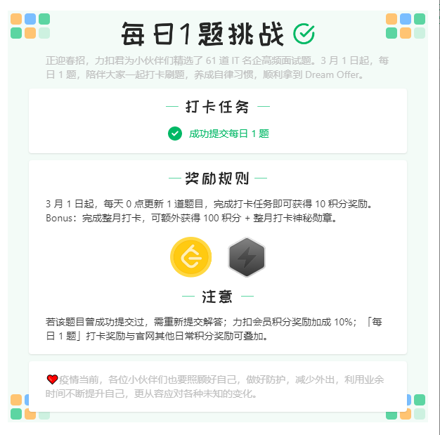
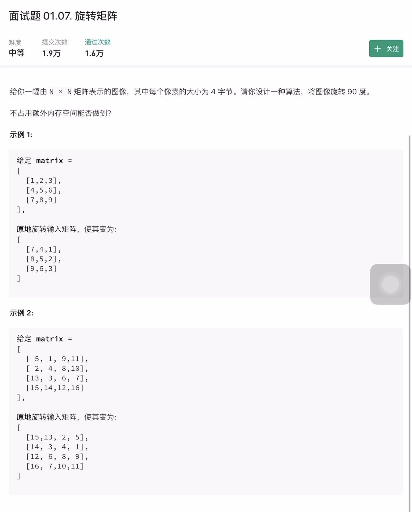
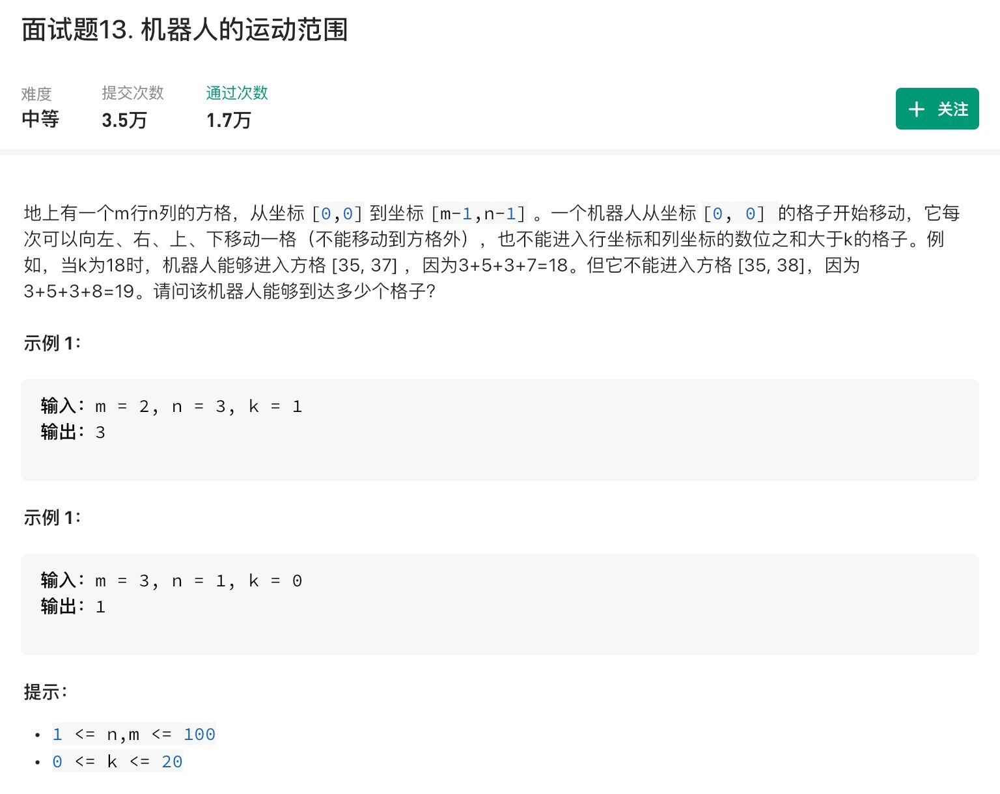
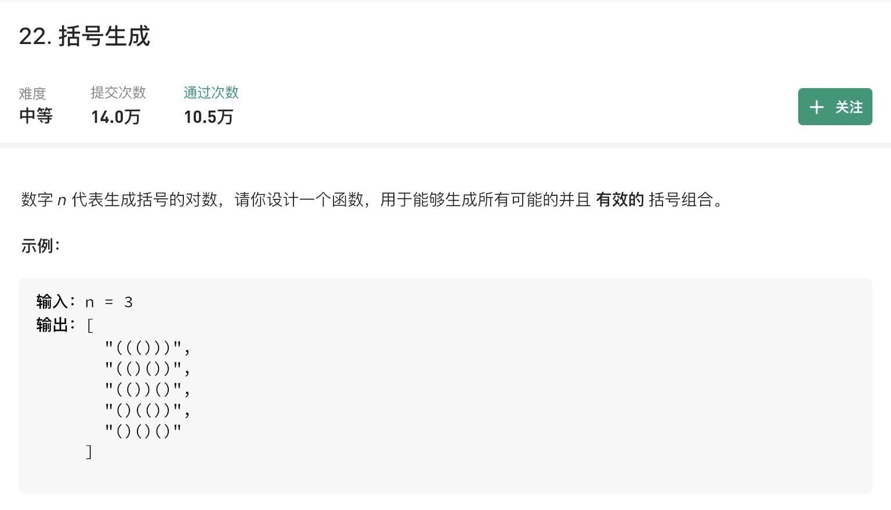

# LeetCode

打开 LeetCode 发现有每日一题挑战，尝试一下，提升自己。
  

## 目录
- [Day01](#Day01)

## Day01

题目：  
  

算法：  
没有算法全靠观察  

思路：  
观察之后发现主对角线元素按 x，y 轴对称变换，其余位置元素按对角线对称变换。  
再观察之后发现左右对称变换之后再按斜对角线（/）对称变换即可。  
写代码时发现按斜对角线（/）变换代码麻烦一些，发现先按斜对角线（\）变换再左右变换也可。

代码：
```java
class Solution {
    public void rotate(int[][] matrix) {
        int n = matrix.length;
    	for (int i = 0, temp; i < n; i++) {	// 斜对角线（\）变换
    		for (int j = 0; j < i; j++) {
        		temp = matrix[i][j];
        		matrix[i][j] = matrix[j][i];
        		matrix[j][i] = temp;
    		}
    	}
        for (int i = 0, temp; i < n; i++) {	// 左右对称变换
        	for (int j = 0; j < n / 2; j++) {
        		temp = matrix[i][j];
        		matrix[i][j] = matrix[i][n - j - 1];
        		matrix[i][n - j - 1] = temp;
        	}
        }
    }
}
```

## Day02

题目：  
  

思路：  
一共两个坐标，所以第一步把 k 分成两部分 x 和 y = k - x  
第二步把 x 和 y 各自拆分，组成一个数，因为题目要求 1<= n，m < =100，所以拆 2 份就行。且组成的数字范围在 m - 1 和 n - 1 内。  

然后发现上述暴力遍历不可，因为机器人按规则移动，有些位置压根去不了。按照机器人移动路径遍历，可以考虑深度优先搜索。

代码：  
```java
 class Solution {
    static int[][] arr = new int[100][100];

	public int compose(int n){
        return n % 10 + n / 10;
    }
    public boolean isOk(int x, int y, int m, int n, int k) { // 判断坐标是否合法
    	if (x >= 0 && x < m && y >= 0 && y < n && compose(x) + compose(y) <= k && arr[x][y] == 0) {
            return true;
    	}
        return false;
    }

	public int result(int x, int y, int m, int n ,int k) {
		if (isOk(x ,y, m, n, k)) {
            arr[x][y] = 1;
            return 1 + result(x + 1, y, m, n, k) + result(x, y+1, m, n, k);
        } else {
            arr[x][y] = 1;
            return 0;
        }
	}

    public int movingCount(int m, int n, int k) {
        for (int i = 0; i < m; i++) {
            for (int j = 0; j < n; j++) {
                arr[i][j] = 0;
            }
        }
        return result(0, 0, m, n, k);
    }
}
```

## Day03

题目：  


代码：
```java
class Solution {
    List<String> result = new ArrayList<>();

    private void dfs(int left, int right, String str) {
        if (left == 0 && right == 0) { // 左右括号都不剩余了，本次递归终止
            result.add(str);
        }

        if (left > 0) { // 如果左括号数不为 0，就可以拼接左括号
            dfs(left - 1, right, str + "(");
        }
        if (right > left) { // 当右括号剩余数比左括号多时才可以拼接右括号
            dfs(left, right - 1, str + ")");
        }
    }

    public List<String> generateParenthesis(int n) {
        String str = "";    // 空字符串
        dfs(n, n, str);  // 深度优先遍历
        return result;
    }
}
```

## Day04

  

代码：  
```java
class Solution {
    public String reverseWords(String s) {
        char[] ch = new char[s.length()];
        for (int i = 0; i < s.length(); i++) {
            ch[i] = s.charAt(i);
        }

        // 计算字符串的有效长度（去掉多余空格）
        int trueStart = 0;  // 找到真正开头
        while (trueStart < s.length() && ch[trueStart] == ' ') {
            trueStart++;
        }

        int endSpace = 0;
        if (trueStart != s.length()) {
            while (s.length() - 1 - endSpace >= 0 && ch[s.length() - 1 - endSpace] == ' ') {
                endSpace++;
            }
        }

        int resLen = s.length() - trueStart - endSpace;    // 去掉开头和结尾空格有多长

        for (int i = trueStart; i < s.length() - endSpace - 1; i++) {
            if (ch[i] == ' ' && ch[i + 1] == ' ') {
                resLen--;
            }
        }

        char[] res = new char[resLen];  // 创建结果数组，其长度为真实字符串长度

        int index = resLen; // index 记录处理结果数组时的坐标
        for (int i = 0; i < s.length(); i++) {
            if (ch[i] == ' ') {
                continue;
            }

            // 计算这次的单词长度
            int charLen = 0;
            while (i + charLen < s.length() && ch[i + charLen] != ' ') {
                charLen++;
            }

            index -= charLen;
            for (int j = 0; j < charLen; j++) {
                res[index + j] = ch[i + j];
            }

            if (index != 0) {
                res[index - 1] = ' ';
                index--;
            }

            i += charLen;
        }

        String str = new String(res);
        return str;
    }
}
```