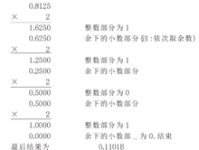

# 入营作业

## 需要掌握的基础知识

**计算机体系结构及组成原理：**
1. 了解计算机的基本体系结构。计算机的组成部分及各个部分的作用。
2. 掌握二进制表示数。给出一个任意的十进制数，会算它的二进制数。
3. 掌握八进制数，十六进制数，掌握他们和 2 二进制的转换关系。
4. 了解程序编译运行的基本流程。如何从源代码变为机器码，最终在计算机上执行。

**操作系统部分：**
1. 理解计算机操作系统的概念。操作系统的作用，设计目标和具体功能。
2. 了解进程和线程的概念。
3. 了解计算机操作系统内存管理的概念。要明白为什么要有内存管理。（有兴趣的同学请研究内存管理算法）
4. 了解计算机文件系统的概念。了解磁盘存储介质。
5. 了解计算机 IO 管理主要的工作。了解缓存及缓冲区的概念。

**Java 语言部分**  
了解 Java 语言的基本信息，扒一扒发展历程等感兴趣的资料。
1. 学会配置 Java 开发环境（SDK+eclipse）。掌握 Java SDK 配置环境变量的意义。
2. 会使用命令行编译运行 java 程序。
3. 会使用 eclipse 编译运行 java 程序。
4. 掌握 Java 的基本数据类型，掌握每种类型的表示的数据及其范围。
5. 掌握 Java 的基本运算符的意义及用法。如说出&和&&的区别等。
王道论坛程序员训练营
6. 掌握 Java 最基本的流程控制语句用法。包括条件语句和循环语句。
7. 掌握一维数组的创建及使用。
8. 理解类和对象的基本概念。

**数据结构部分**  
1. 线性表的概念
2. 掌握线性表的两种实现，顺序实现及链式实现。
3. 理解栈和队列的基本概念（深刻理解）
4. 理解栈和队列的顺序存储实现和链式存储实现。
5. 理解数组和矩阵的概念。
6. 掌握常见的内部排序方法（插入排序，，冒泡排序，选择排序，快速排序，堆排序，希尔排序，归并排序，基数排序等）。
7. 了解算法时间复杂度的概念。了解每种排序算法的时间复杂度

## Day-1（3.16）

查阅并梳理知识点  

### 计算机体系结构及组成原理

Q1：计算机的基本体系结构？  
A1：计算机体系结构是程序员所看到的计算机的属性，即计算机的逻辑结构和功能特征，包括其各个硬部件和软部件之间的相互关系。经典的冯·诺伊曼体系结构：  
- 采用存储程序方式，指令和数据不加区别混合存储在同一个存储器中，数据和程序在内存中是没有区别的，它们都是内存中的数据，当 EIP 指针指向哪，CPU 就加载那段内存中的数据，如果是不正确的指令格式，CPU 就会发生错误中断。  
指令和数据都可以送到运算器进行运算，即由指令组成的程序是可以修改的。  
- 存储器是按地址访问的线性编址的一维结构，每个单元的位数是固定的。  
- 指令由操作码和地址码组成。操作码指明本指令的操作类型，地址码指明操作数和地址。操作数本身无数据类型的标志，它的数据类型由操作码确定。  
- 通过执行指令直接发出控制信号控制计算机的操作。指令在存储器中按其执行顺序存放，由指令计数器指明要执行的指令所在的单元地址。指令计数器只有一个，一般按顺序递增，但执行顺序可按运算结果或当时的外界条件而改变。  
- 以运算器为中心，I/O 设备与存储器间的数据传送都要经过运算器。  
- 数据以二进制表示。  

Q2：计算机的组成部分及各个部分的作用？  
A2：计算机的主要组成部分可以归纳为五个部分：控制器、运算器、存储器、输入设备、和输出设备。
- 控制器  
  是整个计算机的中枢神经，其功能是对程序规定的控制信息进行解释，根据其要求进行控制，调度程序、数据、地址，协调计算机各部分工作及内存与外设的访问等。
- 运算器  
  运算器的功能是对数据进行各种算术运算和逻辑运算，即对数据进行加工处理。
- 存储器  
  存储器的功能是存储程序、数据和各种信号、命令等信息，并在需要时提供这些信息。
- 输入设备  
  输入设备是计算机的重要组成部分，输入设备与输出设备合你为外部设备，简称外设。输入设备的作用是将程序、原始数据、文字、字符、控制命令或现场采集的数据等信息输入到计算机。
- 输出设备  
  输出设备与输入设备同样是计算机的重要组成部分，它把外算机的中间结果或最后结果、机内的各种数据符号及文字或各种控制信号等信息输出出来。

Q3：关于进制。  
A3：二进制记数只用 0 和 1 两个符号，无需其他符号。同理，八进制计数只用 0~7 八个符号，十六进制计数使用 0~9 A B C D E F 十六个符号。  

- 二进制转十进制  
  方法：「按权展开求和」。  
  规则：个位上的数字的次数是 0，十位上的数字的次数是 1，......，依次递增，而十分位的数字的次数是 -1，百分位上数字的次数是 -2，......，依次递减。  
  例如：二进制数 1101 转十进制  
  1\*2^0 + 0\*2^1 + 1\*2^2 + 1\*2^3 = 1 + 0 + 4 + 8 = 13

- 十进制转二进制  
  方法：整数部分采用「除2取余，逆序排列」，小数部分采用「乘 2 取整法」。  
  规则：用 2 整除十进制整数，可以得到一个商和余数，再用 2 去除商，又会得到一个商和余数，如此进行，直到商为小于 1 时为止，然后把先得到的余数作为二进制数的低位有效位，后得到的余数作为二进制数的高位有效位，依次排列起来即得到所对应的十进制整数。  
  用十进制的小数乘以 2 并取走结果的整数（必是 0 或 1），然后再用剩下的小数重复刚才的步骤，直到剩余的小数为 0 时停止，最后将每次得到的整数部分按先后顺序从左到右排列即得到所对应二进制小数。  
  例如：十进制数 125.8125 转二进制为 1111101.1101  
     
     

- 八进制转二进制  
  方法 1：转十进制再转二进制  
  方法 2：每一位单独按十进制转二进制的方式转为二进制，二进制为 3 位，不足时以 0 补齐，即得。  
  例如：八进制数 226 转二进制  
  2 > 010; 2 > 010; 6 > 110; 结果为 10010110。

- 二进制转八进制  
  方法 1：转十进制再转八进制  
  方法 2：从末尾起，每三位分为一组，不足三位以 0 补齐，每组按二进制转十进制方式处理，即得。  
  例如：二进制数 10010110 转八进制  
  补0 > 010010110; 010 > 2; 010 > 2; 110 > 6; 结果为 226。

- 十六进制转二进制  
  方法 1：转十进制再转二进制  
  方法 2：每一位单独按十进制转二进制的方式转为二进制，二进制为 4 位，不足时以 0 补齐，即得。  
  例如：十六进制数 12C 转二进制  
  1 > 0001; 2 > 0010; C > 1100; 结果为 100101100。

- 二进制转十六进制  
  方法 1：转十进制再转十六进制  
  方法 2：从末尾起，每四位分为一组，不足四位以 0 补齐，每组按二进制转十进制方式处理，即得。  
  例如：二进制数 100101100 转十六进制  
  补0 > 000100101100; 0001 > 1; 0010 > 2; 1100 > C; 结果为 12C。

Q4：程序编译运行的基本流程？  
A4：一般高级语言程序编译的过程分为四个阶段：预处理、编译、汇编、链接。以 C 语言为例
- 预处理  
  编译器对各种预处理命令进行处理，包括头文件的包含、宏定义的扩展、条件编译的选择等。
- 编译  
  将预处理完的文件进行一系列词法分析、语法分析、语义分析及优化后，产生相应的汇编代码文件。
- 汇编  
  把作为中间结果的汇编代码翻译成了机器代码，即目标代码，不过它还不可以运行。
- 链接  
  通过链接器将一个个目标文件（或许还会有库文件）链接在一起生成一个完整的可执行程序。  

### 操作系统部分

Q1：计算机操作系统的概念，操作系统的作用，设计目标和具体功能。
A1：操作系统（Operating System，缩写：OS）是管理计算机硬件与软件资源的系统软件，同时也是计算机系统的内核与基石。操作系统需要处理如管理与配置内存、决定系统资源供需的优先次序、控制输入与输出设备、操作网络与管理文件系统等基本事务。操作系统也提供一个让用户与系统交互的操作界面。

Q2：进程和线程的概念。  
A2：进程（process），是指计算机中已运行的程序。  
线程（thread）是操作系统能够进行运算调度的最小单位。大部分情况下，它被包含在进程之中，是进程中的实际运作单位。一条线程指的是进程中一个单一顺序的控制流，一个进程中可以并发多个线程，每条线程并行执行不同的任务。  

Q3：计算机操作系统内存管理的概念。  
A3：内存管理，是指软件运行时对计算机内存资源的分配和使用的技术。其最主要的目的是如何高效、快速的分配，并且在适当的时候释放和回收内存资源。  

Q4：计算机文件系统的概念。  
A4：文件系统，通常指称管理磁盘数据的系统，可将数据以目录或文件的型式存储。  

Q5：计算机 IO 管理主要的工作？缓存及缓冲区的概念。  
A5：I/O（Input/Output），即输入／输出，通常指数据在存储器（内部和外部）或其他周边设备之间的输入和输出，是信息处理系统（例如计算机）与外部世界（可能是人类或另一信息处理系统）之间的通信。输入是系统接收的信号或数据，输出则是从其发送的信号或数据。  
高速缓存（英语：cache）简称缓存，原始意义是指访问速度比一般随机存取存储器（RAM）快的一种 RAM。如今缓存的概念已被扩充，不仅在 CPU 和主内存之间有 Cache，而且在内存和硬盘之间也有 Cache（磁盘缓存），乃至在硬盘与网络之间也有某种意义上的 Cache ──称为 Internet 临时文件夹或网络内容缓存等。凡是位于速度相差较大的两种硬件之间，用于协调两者数据传输速度差异的结构，均可称之为 Cache。  
缓冲器为暂时置放输出或输入数据的存储器。  

### 数据结构部分

Q1：线性表的概念。  
A1：线性表（Linear List）是由 n（n≥0）个数据元素（结点）a[0]，a[1]，a[2]…，a[n-1] 组成的有限序列。  

Q2：线性表的两种实现方式。  
顺序表：顺序表是在计算机内存中以数组的形式保存的线性表，是指用一组地址连续的存储单元依次存储数据元素的线性结构。  
链表：链表（Linked list）不会按线性的顺序存储数据，而是在每一个节点里存到下一个节点的指针(Pointer)。  

Q3：栈和队列。
A3：栈（stack）是计算机科学中的一种抽象数据类型，只允许在有序的线性数据集合的一端（称为堆栈顶端）进行加入数据（push）和移除数据（pop）的运算。因而按照后进先出（LIFO, Last In First Out）的原理运作。  
队列（queue）是先进先出（FIFO, First-In-First-Out）的线性表。在具体应用中通常用链表或者数组来实现。队列只允许在后端（称为rear）进行插入操作，在前端（称为front）进行删除操作。  
 

Q4：数组和矩阵的概念。  
A4：数组数据结构（array data structure），简称数组（Array），是由相同类型的元素（element）的集合所组成的数据结构，分配一块连续的内存来存储。利用元素的索引（index）可以计算出该元素对应的存储地址。  
矩阵，可以理解为二维的数组。

Q5：时间复杂度  
A5：算法的时间复杂度（Time complexity）是一个函数，它定性描述该算法的运行时间。这是一个代表算法输入值的字符串的长度的函数。时间复杂度常用大 O 符号表述，不包括这个函数的低阶项和首项系数。使用这种方式时，时间复杂度可被称为是渐近的，亦即考察输入值大小趋近无穷时的情况。

Q6：常见的内部排序方法。  
A6：插入排序，冒泡排序，选择排序，快速排序，堆排序，希尔排序，归并排序，基数排序  
- 插入排序  
  插入排序（Insertion Sort）是一种简单直观的排序算法。它的工作原理是通过构建有序序列，对于未排序数据，在已排序序列中从后向前扫描，找到相应位置并插入。插入排序在实现上，通常采用in-place排序（即只需用到 O(1) 的额外空间的排序），因而在从后向前扫描过程中，需要反复把已排序元素逐步向后挪位，为最新元素提供插入空间。  
  插入排序时间复杂度为 O(n^2)。
  ```c
  void insertion_sort(int arr[], int len) {
        int i,j,key;
        for (i=1;i<len;i++) {
                key = arr[i];
                j=i-1;
                while((j>=0) && (arr[j]>key)) {
                        arr[j+1] = arr[j];
                        j--;
                }
                arr[j+1] = key;
        }
  }
  ```

- 冒泡排序  
  冒泡排序（Bubble Sort）是一种简单的排序算法。它重复地走访过要排序的数列，一次比较两个元素，如果他们的顺序错误就把他们交换过来。走访数列的工作是重复地进行直到没有再需要交换，也就是说该数列已经排序完成。这个算法的名字由来是因为越小的元素会经由交换慢慢“浮”到数列的顶端。  
  冒泡排序时间复杂度为 O(n^2)。
  ```c
  void bubbleSort (int arr[], int len) {
    int i, j,temp;
	  Boolean exchanged = true;
    for (i=0; exchanged && i<len-1; i++)
      for (j=0; j<len-1-i; j++) {
        exchanged = false;
        if (arr[j] > arr[j+1]) {
          temp = arr[j];
          arr[j] = arr[j+1];
          arr[j+1] = temp;
          exchanged = true;
        }
      }
  }
  ```

- 选择排序  
  选择排序（Selection sort）是一种简单直观的排序算法。它的工作原理如下：首先在未排序序列中找到最小（大）元素，存放到排序序列的起始位置，然后，再从剩余未排序元素中继续寻找最小（大）元素，然后放到已排序序列的末尾。以此类推，直到所有元素均排序完毕。  
  选择排序时间复杂度为 O(n^2)。  
  ```c
  void selection_sort(int a[], int len) {
    int i,j,temp;
    for (i = 0 ; i < len - 1 ; i++) {
		  int min = i;
		  for (j = i + 1; j < len; j++) {
			  if (a[j] < a[min]) {
				  min = j; 
			  }
		  }
		  if(min != i) {
        temp=a[min];
        a[min]=a[i];
        a[i]=temp;
		  }
  	}
  }
  ```

- 快速排序  
  快速排序（Quicksort）使用分治法（Divide and conquer）策略来把一个序列（list）分为较小和较大的2个子序列，然后递归地排序两个子序列。  
  步骤为：
  1. 挑选基准值：从数列中挑出一个元素，称为“基准”（pivot）。
  2. 分割：重新排序数列，所有比基准值小的元素摆放在基准前面，所有比基准值大的元素摆在基准后面（与基准值相等的数可以到任何一边）。在这个分割结束之后，对基准值的排序就已经完成。
  3. 递归排序子序列：递归地将小于基准值元素的子序列和大于基准值元素的子序列排序。

  递归到最底部的判断条件是数列的大小是零或一，此时该数列显然已经有序。  
  快速排序的时间复杂度为O(n*logn)。
  ```c
  void swap(int *x, int *y) {
    int t = *x;
    *x = *y;
    *y = t;
  }

  void quick_sort_recursive(int arr[], int start, int end) {
    if (start >= end)
      return;
    int mid = arr[end];
    int left = start, right = end - 1;
    while (left < right) {
      while (arr[left] < mid && left < right)
          left++;
      while (arr[right] >= mid && left < right)
          right--;
      swap(&arr[left], &arr[right]);
    }
    if (arr[left] >= arr[end])
      swap(&arr[left], &arr[end]);
    else{
      left++;
      swap(&arr[left], &arr[end]);
    }
    if (left)
      quick_sort_recursive(arr, start, left - 1);
    quick_sort_recursive(arr, left + 1, end);
  }

  void quick_sort(int arr[], int len) {
    quick_sort_recursive(arr, 0, len - 1);
  }
  ```

- 堆排序  
  堆排序（Heapsort）是指利用堆这种数据结构所设计的一种排序算法。堆是一个近似完全二叉树的结构，并同时满足堆积的性质：即子节点的键值或索引总是小于（或者大于）它的父节点。  
  堆排序的时间复杂度为O(n*logn)。
  ```c
  #include <stdio.h>
  #include <stdlib.h>

  void swap(int *a, int *b) {
    int temp = *b;
    *b = *a;
    *a = temp;
  }

  void max_heapify(int arr[], int start, int end) {
    // 建立父节点下标和子节点下标
    int dad = start;
    int son = dad * 2 + 1;
    while (son <= end) { // 若子节点在范围内才做比较
      if (son + 1 <= end && arr[son] < arr[son + 1]) // 先比较两个子节点大小，选择最大的
        son++;
      if (arr[dad] > arr[son]) //如果父节点大于子节点代表调整完毕，直接跳出函数
        return;
      else { // 否则交换父子内容再继续子节点和孙子节点比较
        swap(&arr[dad], &arr[son]);
        dad = son;
        son = dad * 2 + 1;
      }
    }
  }

  void heap_sort(int arr[], int len) {
    int i;
    // 初始化，i 从最后一个父节点开始调整
    for (i = len / 2 - 1; i >= 0; i--)
      max_heapify(arr, i, len - 1);
    // 先将第一个元素和已排好元素前一位做交换，再重新调整，直到排序完毕
    for (i = len - 1; i > 0; i--) {
      swap(&arr[0], &arr[i]);
      max_heapify(arr, 0, i - 1);
    }
  }

  int main() {
    int arr[] = { 3, 5, 3, 0, 8, 6, 1, 5, 8, 6, 2, 4, 9, 4, 7, 0, 1, 8, 9, 7, 3, 1, 2, 5, 9, 7, 4, 0, 2, 6 };
    int len = (int) sizeof(arr) / sizeof(*arr);
    heap_sort(arr, len);
    int i;
    for (i = 0; i < len; i++)
      printf("%d ", arr[i]);
    printf("\n");
    return 0;
  }
  ```

- 希尔排序  
  希尔排序（Shellsort）通过将比较的全部元素分为几个区域来提升插入排序的性能。这样可以让一个元素可以一次性地朝最终位置前进一大步。然后算法再取越来越小的步长进行排序，算法的最后一步就是普通的插入排序，但是到了这步，需排序的数据几乎是已排好的了（此时插入排序较快）。  
  希尔排序的时间复杂度为O(n*(logn)^2)。 
  ```c
  void shell_sort(int arr[], int len) {
    int gap, i, j;
    int temp;
    for (gap = len >> 1; gap > 0; gap >>= 1)
      for (i = gap; i < len; i++) {
        temp = arr[i];
        for (j = i - gap; j >= 0 && arr[j] > temp; j -= gap)
          arr[j + gap] = arr[j];
        arr[j + gap] = temp;
     }
  }
  ```

- 归并排序  
  归并排序（英语：Merge sort，或mergesort），是创建在归并操作上的一种有效的排序算法。  
  采用分治法:
  - 分割：递归地把当前序列平均分割成两半。
  - 集成：在保持元素顺序的同时将上一步得到的子序列集成到一起（归并）。

  归并排序的时间复杂度为O(n*logn)。  
  ```c
  int min(int x, int y) {
    return x < y ? x : y;
  }
  void merge_sort(int arr[], int len) {
    int *a = arr;
    int *b = (int *) malloc(len * sizeof(int));
    int seg, start;
    for (seg = 1; seg < len; seg += seg) {
      for (start = 0; start < len; start += seg * 2) {
        int low = start, mid = min(start + seg, len), high = min(start + seg * 2, len);
        int k = low;
        int start1 = low, end1 = mid;
        int start2 = mid, end2 = high;
        while (start1 < end1 && start2 < end2)
            b[k++] = a[start1] < a[start2] ? a[start1++] : a[start2++];
        while (start1 < end1)
            b[k++] = a[start1++];
        while (start2 < end2)
            b[k++] = a[start2++];
        }
        int *temp = a;
        a = b;
        b = temp;
    }
    if (a != arr) {
      int i;
      for (i = 0; i < len; i++)
        b[i] = a[i];
      b = a;
    }
    free(b);
  }
  ```

- 基数排序  
  基数排序（Radix sort）是一种非比较型整数排序算法，其原理是将整数按位数切割成不同的数字，然后按每个位数分别比较。由于整数也可以表达字符串（比如名字或日期）和特定格式的浮点数，所以基数排序也不是只能使用于整数。  
  基数排序的时间复杂度是 O(k*n)，其中 n 是排序元素个数，k 是数字位数。
  ```c
  #include<stdio.h>
  #define MAX 20
  //#define SHOWPASS
  #define BASE 10

  void print(int *a, int n) {
    int i;
    for (i = 0; i < n; i++) {
      printf("%d\t", a[i]);
    }
  }

  void radixsort(int *a, int n) {
    int i, b[MAX], m = a[0], exp = 1;

    for (i = 1; i < n; i++) {
      if (a[i] > m) {
        m = a[i];
      }
    }

    while (m / exp > 0) {
      int bucket[BASE] = { 0 };

      for (i = 0; i < n; i++) {
        bucket[(a[i] / exp) % BASE]++;
      }

      for (i = 1; i < BASE; i++) {
        bucket[i] += bucket[i - 1];
      }

      for (i = n - 1; i >= 0; i--) {
        b[--bucket[(a[i] / exp) % BASE]] = a[i];
      }

      for (i = 0; i < n; i++) {
        a[i] = b[i];
      }

      exp *= BASE;

  #ifdef SHOWPASS
      printf("\nPASS   : ");
      print(a, n);
  #endif
    }
  }

  int main() {
    int arr[MAX];
    int i, n;

    printf("Enter total elements (n <= %d) : ", MAX);
    scanf("%d", &n);
    n = n < MAX ? n : MAX;

    printf("Enter %d Elements : ", n);
    for (i = 0; i < n; i++) {
      scanf("%d", &arr[i]);
    }

    printf("\nARRAY  : ");
    print(&arr[0], n);

    radixsort(&arr[0], n);

    printf("\nSORTED : ");
    print(&arr[0], n);
    printf("\n");

    return 0;
  }
  ```