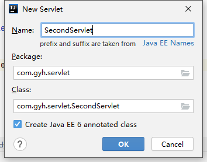
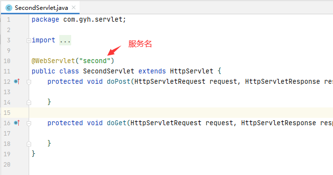

# 八、JavaWeb

## 目录

- [八、JavaWeb](#八javaweb)
  - [目录](#目录)
  - [1. Tomcat](#1-tomcat)
    - [1.1 安装和使用](#11-安装和使用)
    - [1.2 Tomcat 的目录结构](#12-tomcat-的目录结构)
    - [1.3 Tomcat 的组成结构](#13-tomcat-的组成结构)
    - [1.4 虚拟目录映射](#14-虚拟目录映射)
      - [1.4.1 方式一](#141-方式一)
      - [1.4.2 方式二](#142-方式二)
    - [1.5 默认页面和端口](#15-默认页面和端口)
  - [2 Servlet](#2-servlet)
    - [2.1 概述](#21-概述)
    - [2.2 实现第一个 Servlet](#22-实现第一个-servlet)
      - [2.2.1 FirstServlet](#221-firstservlet)
      - [2.2.2 Servlet 执行流程](#222-servlet-执行流程)
    - [2.3 Servlet 接口实现类](#23-servlet-接口实现类)
    - [2.4 IDEA 开发 Servlet](#24-idea-开发-servlet)
    - [2.5 Servlet 的生命周期](#25-servlet-的生命周期)
    - [2.6 url-pattern 细节](#26-url-pattern-细节)
      - [2.6.1 多个映射关系](#261-多个映射关系)
      - [2.6.2 两个特殊的 url-pattern](#262-两个特殊的-url-pattern)
    - [2.7 ServletConfig](#27-servletconfig)
    - [2.8 ServletContext](#28-servletcontext)
      - [2.8.1 全局性初始化参数](#281-全局性初始化参数)
      - [2.8.2 全局性共享数据](#282-全局性共享数据)
      - [2.8.3 获取绝对路径](#283-获取绝对路径)
  - [3 ServletRequest](#3-servletrequest)


## 1. Tomcat

### 1.1 安装和使用

第一步：进入 [官网](http://tomcat.apache.org)，选择相应版本，进入其下载界面。  

<div align="center">

</div>

第二步：选择下载方式。  
- Linux 操作系统下载 tar.gz 文件。

- Windows 操作系统建议下载 zip 文件。

<div align="center">

</div>

第三步：把下载的文件解压，解压后的文件放入工作区即可。

使用先需要保证环境变量中存在 `JAVA_HOME`。可以通过命令行下的：`echo %JAVA_HOME%` 检查。

检查是否安装成功：
1. 双击 `bin` 目录下的 `startup.bat` 文件;

2. 在浏览器访问 `http://localhost:8080`，如果安装成功界面会有提示。

3. `shutdown.bat` 关闭服务器。

### 1.2 Tomcat 的目录结构

bin：存放启动和关闭 Tomcat 的脚本文件。

conf：存放 Tomcat 服务器的各种配置文件。
- 推荐：修改 `./conf` -> `server.xml` -> connector -> port="8080" 为 "80"。

lib：存放 Tomcat 服务器的支撑 jar 包。

logs：存放 Tomcat 的日志文件。

temp：存放 Tomcat 运行时产生的临时文件。

webpack：Web 应用所在目录，即供外界访问的 Web 资源的存放目录。

work：Tomcat 的工作目录。


### 1.3 Tomcat 的组成结构

```xml
// ./conf/server.xml
<Server>
    <Service>
        <Connector/>
        <Engine>
            <Host>
                <Context/>
            </Host>
        </Engine>
    </Service>
</Server>
```

Server：代表整个 Servlet 容器的组件，是最顶层元素，可以包含一个或多个 Service 元素。  

Service：包含一个 Engine 元素以及一个或多个 Connector 元素，这些 Connector 元素共享同一个 Engine。

Connector：代表和客户端程序实际交互的组件，负责接受客户请求，以及向客户返回响应。

Engine：每个 Service 元素只能包含一个 Engine 元素，它处理在同一个 Service 中所有 Connector 接收到的客户请求。

Host：在一个 Engine 中可以包含多个 Host，它代表一个虚拟主机，它可以包含一个或者多个 Web 应用。

Context：使用最频繁的元素，代表了运行在虚拟主机上的单个 Web 应用。

### 1.4 虚拟目录映射

#### 1.4.1 方式一

在 `server.xml` 文件的 host 元素中配置 context 元素，例如：
```
<Host name="localhost"  appBase="webapps"
      unpackWARs="true" autoDeploy="true">

      <Context path="/test" docBase="D:\test"></Context>
```
并在 `D:\test` 下新建 `index.html` 文件。  

<div align="center">

</div>

注：在 Tomcat6 中，不再建议在 `server.xml` 文件中配置 context 元素。

#### 1.4.2 方式二

Tomcat 自动映射：Tomcat 服务器会自动管理 webapps 目录下的所有 Web 应用，并把它映射成虚似目录。  
换句话说，Tomcat 服务器 webapps 目录中的 Web 应用，外界可以直接访问。

在 `./conf/Catalina/localhost` 目录下新建一个 xml 文件，文件名为虚拟目录名。  

示例：  
<div align="center">

</div>

即可达到和方式一一样的效果。


### 1.5 默认页面和端口

默认页面：`./conf` -> `web.xml` -> welcome-file-list。

默认端口：`./conf` -> `server.xml` -> connector -> port。

## 2 Servlet

### 2.1 概述

> A servlet is a small Java program that runs within a Web server. Servlets receive and respond to requests from Web clients, usually across HTTP, the HyperText Transfer Protocol. 

Servlet 是 Sun 公司提供的一门用于开发动态 Web 资源的技术。  

Sun 公司在其 API 中提供了一个 servlet 接口，用户若想开发一个动态 Web 资源（即开发一个 Java 程序向浏览器输出数据），需要完成以下 2 个步骤：
1. 编写一个 Java 类，实现 servlet 接口；

2. 把开发好的 Java 类部署到 Web 服务器中。

注：按照一种约定俗成的称呼习惯，通常我们也把实现了servlet 接口的 Java 程序，称之为 Servlet。

Servlet 在 Web 应用中的位置：
```
mail
|
|--html、jsp、css、js 文件等
|
|--WEB-INF
    |
    |--classes
    |   |
    |   |--Java 类
    |
    |--lib
    |   |
    |   |--Java 类运行所需要的 jar 包
    |
    |--web.xml
```

mail：Web 应用所在目录

html、jsp、css、js 文件等：这些文件一般存在 Web 应用根目录下，根目录下的文件外界可以直接访问。

WEB-INF：必须直接放在应用下一级目录里。Java 类、jar 包、Web 应用的配置文件存在这个目录下，该目录下的文件外界无法非法直接访问，由 Web 服务器负责调用。

### 2.2 实现第一个 Servlet

#### 2.2.1 FirstServlet

第一步：下载 Tomcat，在 Tomcat 的 `webapps` 文件夹下新建应用文件夹，如 `app1`。  
在 `app1` 文件夹下新建文件夹 `WEB-INF/classes`。

第二步：编译一个 Java 文件，将生成的 class 文件放入 `classes` 文件夹下。如：
```java
import javax.servlet.*;

public class FirstServlet extends GenericServlet {
    public void service(ServletRequest req, ServletResponse res) throws ServletException, java.io.IOException {
        res.getWriter().println("Hello World");
    }
}
```

使用命令行编译时，需要注意类加载机制：
```
javac -classpath xx/xx/xx/apache-tomcat-8.5.56/lib/servlet-api.jar FirstServlet.java
```

第三步：`WEB-INF` 下新建文件 `web.xml`，在 xml 文件中进行配置虚拟路径。如：
```xml
<web-app xmlns="http://xmlns.jcp.org/xml/ns/javaee"
  xmlns:xsi="http://www.w3.org/2001/XMLSchema-instance"
  xsi:schemaLocation="http://xmlns.jcp.org/xml/ns/javaee
                      http://xmlns.jcp.org/xml/ns/javaee/web-app_3_1.xsd"
  version="3.1"
  metadata-complete="true">


    <servlet>
      <servlet-name>hello</servlet-name>
      <servlet-class>FirstServlet</servlet-class>
    </servlet>

    <servlet-mapping>
        <servlet-name>hello</servlet-name>
        <url-pattern>/servlet</url-pattern>
    </servlet-mapping>

</web-app>
```

第四步：启动 Tomcat，在默认端口下后缀 `/app1/servlet` 即可访问 Servlet 应用。  
<div align="center">

</div>

#### 2.2.2 Servlet 执行流程

当访问 `http://localhost/app1/servlet` 时：
1. 地址栏打出该地址，浏览器构建一个请求报文；

2. 传输到目标机器，到达指定端口的 connector，然后 connector 接收到该请求，将请求报文转成 request 对象；

3. connector 同时还会生成一个空的 response 对象，然后将其和 request 对象传给 engine；
 
4. engine 接着选择 host，将这两个对象传给 host；

5. host 选择 `Context（/app1）`，将这两个对象传给 Context；

6. Context 在当前应用下去寻找 `/servlet`，如果找到，则往 response 对象里面写入对应的数据；

7. 这两个对象依次返回，给 connector；

8. connector 读取 response 对象里面的数据，然后生成一个响应报文，发送出去。

### 2.3 Servlet 接口实现类

Servlet 接口定义了两个默认实现类：GenericServlet、HttpServlet。

HttpServlet 指能够处理 HTTP 请求的 Servlet，它在原有 Servlet 接口上添加了一些与 HTTP 协议处理方法，它比 Servlet 接口的功能更为强大。  
因此，开发人员在编写 Servlet 时，通常应继承这个类，而避免直接去实现 Servlet 接口。

HttpServlet 在实现 Servlet 接口时，覆写了 service 方法，该方法体内的代码会自动判断用户的请求方式，如为 GET 请求，则调用 HttpServlet 的 doGet 方法，如为 Post 请求，则调用 doPost 方法。  
因此，开发人员在编写 Servlet 时，通常只需要覆写 doGet 或 doPost 方法，而不要去覆写 service 方法。

### 2.4 IDEA 开发 Servlet

第一步：创建 Project 和 Module。  
<div align="center">


</div>

第二步：创建 Web 应用。  

<div align="center">



</div>

第三步：Debug，然后就可以在浏览器访问。  
<div align="center">


</div>


### 2.5 Servlet 的生命周期

Servlet 是一个供其他 Java 程序（Servlet 引擎）调用的 Java 类，它不能独立运行，它的运行完全由 Servlet 引擎来控制和调度。

针对客户端的多次 Servlet 请求，通常情况下，服务器只会创建一个 Servlet 实例对象，也就是说 Servlet 实例对象一旦创建，它就会驻留在内存中，为后续的其它请求服务，直至 Web 容器退出（或应用停止），Servlet 实例对象才会销毁。

在 Servlet 的整个生命周期内，Servlet 的 init 方法只被调用一次。而对一个 Servlet 的每次访问请求都导致 Servlet 引擎调用一次 Servlet 的 service 方法。对于每次访问请求，Servlet引擎都会创建一个新的 HttpServletRequest 请求对象和一个新的 HttpServletResponse 响应对象，然后将这两个对象作为参数传递给它调用的 Servlet 的 service() 方法，service 方法再根据请求方式分别调用 doXXX 方法。 

### 2.6 url-pattern 细节

#### 2.6.1 多个映射关系

同一个 Servlet 可以被映射到多个 URL 上，即多个 `<servlet-mapping>` 元素的 `<servlet-name>` 子元素的设置值可以是同一个 Servlet 的注册名。  

在 Servlet 映射到的 URL 中也可以使用 `*` 通配符，但是只能有两种固定的格式：
- 一种格式是 `*.扩展名`。

- 一种格式是以正斜杠 `/` 开头并以 `/*` 结尾。

优先级：
- `/*` 的优先级要高于 `*.do`。

- 以 `/` 开头的优先级要高于 `*.后缀` 的优先级。

- 如果多个 `/` 开头的 url-pattern 同时满足，那么匹配的程度越高，越优先执行谁。

如以下的映射关系：  
Servlet1 映射到 `/abc/*`；   
Servlet2 映射到 `/*`；   
Servlet3 映射到 `/abc`；   
Servlet4 映射到 `*.do`。   

则：
- 当请求 URL 为 `/abc/a.html`，`/abc/*` 和`/*` 都匹配，Servlet 引擎将调用 Servlet1。

- 当请求 URL 为 `/abc` 时，`/abc` 和 `/*` 都匹配，Servlet 引擎将调用 Servlet3。

- 当请求 URL 为 `/abc/a.do` 时，`/abc/*` 和 `*.do` 和 `/*` 都匹配，Servlet 引擎将调用 Servlet1。

- 当请求 URL 为 `/a.do` 时，`/*` 和 `*.do` 都匹配，Servlet 引擎将调用 Servlet2。

- 当请求 URL 为 `/xxx/yyy/a.do` 时，`/*` 和 `*.do` 都匹配，Servlet 引擎将调用 Servlet2。

#### 2.6.2 两个特殊的 url-pattern

如果某个 Servlet 的映射路径仅仅为一个正斜杠 `/`，那么这个 Servlet 就成为当前 Web 应用程序的缺省 Servlet。  
凡是在 `web.xml` 文件中找不到匹配的 `<servlet-mapping>` 元素的 URL，它们的访问请求都将交给缺省 Servlet 处理。也就是说，缺省 Servlet 用于处理所有其他 Servlet 都不处理的访问请求。 

在 `tomcat/conf/web.xml` 文件中，注册了一个名称为 `org.apache.catalina.servlets.DefaultServlet` 的 Servlet，并将这个 Servlet 设置为了缺省 Servlet。  
当访问 Tomcat 服务器中的某个静态 HTML 文件和图片时，实际上是在访问这个缺省 Servlet。 

### 2.7 ServletConfig

在 Servlet 的配置文件中，可以使用一个或多个 `<init-param>` 标签为某个 Servlet 配置一些初始化参数。

当 Servlet 配置了初始化参数后，Web 容器在创建 Servlet 实例对象时，会自动将这些初始化参数封装到 ServletConfig 对象中，并在调用 `Servlet` 的 init 方法时，将 ServletConfig 对象传递给 Servlet。进而，通过 ServletConfig 对象就可以得到当前 Servlet 的初始化参数信息。

示例：
```xml
<servlet>
  <servlet-name>config</servlet-name>
  <servlet-class>com.gyh.test</servlet-class>
  <init-param>
    <param-name>name</param-name>
    <param-value>zhang3</param-value>
  </init-param>
</servlet>
```
```java
ServletConfig servletConfig = getServletConfig();
String name = servletConfig.getInitParameter("name");
System.out.printf(name);

// 即可打印 name 的 value
```

### 2.8 ServletContext

#### 2.8.1 全局性初始化参数

示例：
```xml
<context-param>
  <param-name>key</param-name>
  <param-value>utf-8</param-value>
</context-param>
```
```java
String key = getServletContext().getInitParameter("key");
System.out.println(key);
```

#### 2.8.2 全局性共享数据


Context 类下的三个数据操作：
- `setAttribute(key,value)`。

- `getAttribute(key)`。

- `removeAttribute(key)`。

示例：记录网站历史访问次数。  
```java
ServletContext servletContext = getServletContext();
synchronized (servletContext){
    Integer count = (Integer) servletContext.getAttribute("count");
    if(count == null){
        count = 0;
    }
    servletContext.setAttribute("count", ++count);
}
response.getWriter().println("history total count: " + servletContext.getAttribute("count"));
```

#### 2.8.3 获取绝对路径

Context 关于路径的两个操作：
- `getRealpath(String path)`：获取绝对路径。  
  path 为文件和部署根目录的相对路径关系。  

  注：该方法也可以获取 `WEB-INF` 目录下的文件。


## 3 ServletRequest

Web 服务器收到客户端的 http 请求，会针对每一次请求，分别创建一个用于代表请求的 Request 对象、和代表响应的 Response 对象。   
- Request：获取客户机（浏览器）提交过来的数据。

- Response：向浏览器（客户端）输出数据。

HttpServletRequest 对象代表客户端的请求，当客户端通过 HTTP 协议访问 http 服务器时，HTTP 请求头（正文）中的所有信息都封装在这个对象中，开发人员通过这个对象的方法，可以获得客户这些信息。

请求行：
- `getMethod`：请求方法。

- `getRequestURL`：URL。

- `getRequestURI`：资源名。

- `getProtoco`：协议 / 版本。

请求头：
- `getRemoteAddr`：方法返回发出请求的客户机的 IP 地址。

- `getRemoteHost`：方法返回发出请求的客户机的完整主机名。

- `getRemotePort`：方法返回客户机所使用的网络端口号。

- `getLocalAddr`：方法返回 WEB 服务器的 IP 地址。

- `getLocalName`：方法返回 WEB 服务器的主机名。

获得客户机请求参数（客户端提交的数据）：
- `getParameter(name)`。

- `getParameterValues(String name)`。

- `getParameterNames`。

示例：
```xml
<form action="http://localhost:8080/app/submit" method="post">
    用户名：<input type="text" name="username"><br>
    密码：<input type="password" name="password"><br>
    性别：男<input type="radio" name="gender" value="male">
          女<input type="radio" name="gender" value="female"><br>
    爱好：java<input type="checkbox" name="hobby" value="java">
          c++<input type="checkbox" name="hobby" value="c++">
          python<input type="checkbox" name="hobby" value="python"><br>
    简介<textarea name="description"></textarea><br>
    <input type="submit">
</form>
```
```java
String username = request.getParameter("username");
String password = request.getParameter("password");
String gender = request.getParameter("gender");
String[] hobbies = request.getParameterValues("hobby");
String description = request.getParameter("description");
```
